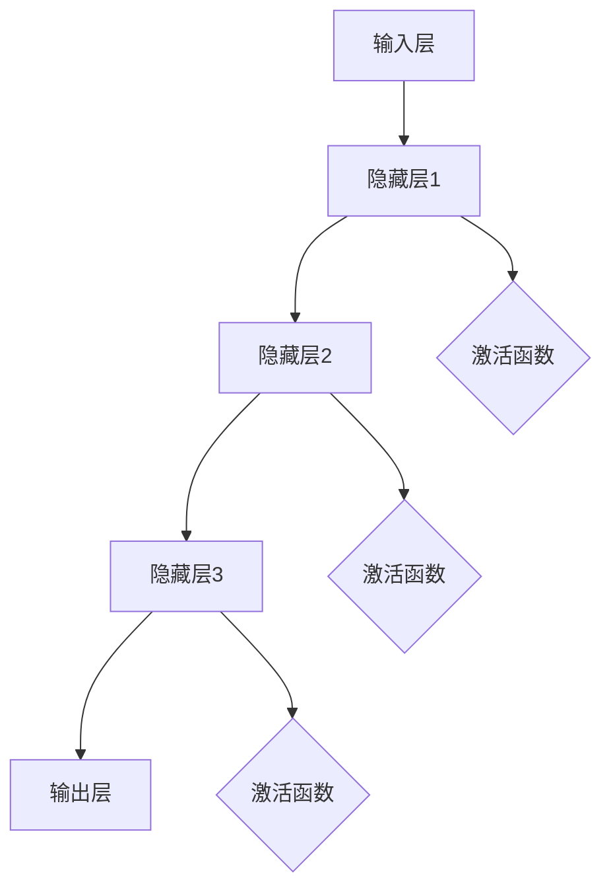

                 

# 神经网络：机器学习的新范式

> **关键词：** 机器学习、神经网络、深度学习、反向传播、激活函数、优化算法  
>
> **摘要：** 本文旨在深入探讨神经网络的基本原理、核心算法、数学模型及其在机器学习中的应用。通过逐步分析推理，本文将帮助读者理解神经网络如何成为机器学习的新范式，并探讨其在实际项目中的实施与优化。

## 1. 背景介绍

### 1.1 目的和范围

本文的主要目的是为读者提供一个全面而深入的神经网络知识体系。我们将从基本概念入手，逐步讲解神经网络的架构、核心算法和数学模型，并展示其在实际项目中的应用。通过本文的学习，读者将能够：

- 掌握神经网络的基础知识和核心原理。
- 理解神经网络的训练过程及其背后的数学模型。
- 掌握神经网络在实际项目中的应用方法。

### 1.2 预期读者

本文适合以下读者群体：

- 计算机科学和人工智能专业的研究生和本科生。
- 对机器学习和深度学习感兴趣的技术爱好者。
- 有志于从事人工智能领域研究和开发的工程师和技术人员。

### 1.3 文档结构概述

本文分为以下几个部分：

- **第1章**：背景介绍，包括本文的目的、预期读者以及文档结构概述。
- **第2章**：核心概念与联系，介绍神经网络的基本概念和相关联系。
- **第3章**：核心算法原理 & 具体操作步骤，讲解神经网络的训练过程和核心算法。
- **第4章**：数学模型和公式 & 详细讲解 & 举例说明，详细阐述神经网络的数学模型和公式。
- **第5章**：项目实战：代码实际案例和详细解释说明，通过实际项目展示神经网络的应用。
- **第6章**：实际应用场景，探讨神经网络在不同领域的应用。
- **第7章**：工具和资源推荐，提供相关学习资源、开发工具和经典论文推荐。
- **第8章**：总结：未来发展趋势与挑战，分析神经网络的发展趋势和面临的挑战。
- **第9章**：附录：常见问题与解答，提供常见的神经网络问题及解答。
- **第10章**：扩展阅读 & 参考资料，推荐进一步的阅读材料和参考资料。

### 1.4 术语表

#### 1.4.1 核心术语定义

- **神经网络（Neural Network）**：由大量人工神经元组成的计算模型，模拟生物神经系统的信息处理能力。
- **人工神经元（Artificial Neuron）**：神经网络的基本计算单元，接收输入信号并产生输出。
- **激活函数（Activation Function）**：人工神经元在计算过程中用于转换输入信号的函数。
- **反向传播（Backpropagation）**：一种用于训练神经网络的算法，通过反向传播误差来调整网络权重。
- **优化算法（Optimization Algorithm）**：用于最小化神经网络损失函数的算法，如梯度下降、动量等。

#### 1.4.2 相关概念解释

- **深度学习（Deep Learning）**：一种基于多层神经网络的学习方法，通过多层次的非线性变换提取特征。
- **前向传播（Forward Propagation）**：神经网络在训练过程中，将输入信号从输入层传播到输出层的计算过程。
- **损失函数（Loss Function）**：用于度量神经网络输出结果与真实值之间差异的函数，用于优化网络权重。
- **权重（Weight）**：神经网络中连接不同神经元的参数，用于调整神经元之间的交互强度。

#### 1.4.3 缩略词列表

- **CNN**：卷积神经网络（Convolutional Neural Network）
- **RNN**：循环神经网络（Recurrent Neural Network）
- **ReLU**：ReLU激活函数（Rectified Linear Unit）
- **SGD**：随机梯度下降（Stochastic Gradient Descent）

## 2. 核心概念与联系

神经网络作为机器学习的重要工具，其核心概念和联系是我们理解神经网络工作原理的基础。在这一节中，我们将介绍神经网络的基本概念，并使用Mermaid流程图展示其原理和架构。

### 2.1 神经网络的基本概念

神经网络由大量人工神经元组成，每个神经元都接收输入信号，通过加权求和处理后，使用激活函数产生输出。神经网络的基本组成部分包括：

- **输入层（Input Layer）**：接收外部输入数据。
- **隐藏层（Hidden Layer）**：完成特征提取和变换。
- **输出层（Output Layer）**：产生最终输出。

### 2.2 神经网络的原理和架构

以下是神经网络的基本原理和架构的Mermaid流程图：



### 2.3 神经网络的工作流程

神经网络的工作流程主要包括以下几个步骤：

1. **前向传播（Forward Propagation）**：
   - 输入数据通过输入层进入神经网络。
   - 输入数据经过每一层神经元的加权求和处理。
   - 每一层神经元使用激活函数进行非线性变换。

2. **激活函数（Activation Function）**：
   - 激活函数用于引入非线性特性，常见的激活函数有ReLU、Sigmoid和Tanh等。

3. **反向传播（Backpropagation）**：
   - 计算输出结果与真实值的差异，即损失（Loss）。
   - 使用反向传播算法计算每个神经元和权重的梯度。
   - 根据梯度调整权重，优化神经网络模型。

4. **优化算法（Optimization Algorithm）**：
   - 优化算法用于调整网络权重，常见的优化算法有梯度下降（Gradient Descent）、随机梯度下降（Stochastic Gradient Descent）和Adam等。

通过以上步骤，神经网络可以不断调整权重，使其输出结果更接近真实值，从而实现学习目标。

### 2.4 神经网络与深度学习的关系

深度学习是一种基于多层神经网络的学习方法，通过多层次的非线性变换提取特征。深度学习与神经网络的区别在于：

- **深度学习**：使用多层神经网络进行特征提取和变换。
- **神经网络**：一种广义的计算模型，可以包含单层或多层神经网络。

深度学习在图像识别、自然语言处理、语音识别等领域的应用取得了显著的成果，其成功的关键在于多层神经网络的强大表达能力和强大的学习能力。

### 2.5 神经网络与其他机器学习算法的关系

神经网络作为机器学习的一种方法，与其他算法有着紧密的联系：

- **监督学习**：神经网络可以用于分类和回归等监督学习任务。
- **无监督学习**：神经网络可以用于聚类和降维等无监督学习任务。
- **强化学习**：神经网络可以用于强化学习中的价值函数和策略网络。

神经网络作为一种通用计算模型，可以应用于各种机器学习任务，与其他算法相互补充，共同推动人工智能的发展。

通过以上对神经网络核心概念与联系的分析，我们可以更好地理解神经网络的工作原理和应用场景。在下一节中，我们将深入讲解神经网络的训练过程和核心算法。

## 3. 核心算法原理 & 具体操作步骤

在理解了神经网络的基本概念后，我们将进一步探讨神经网络的训练过程和核心算法。训练神经网络的目的是调整网络中的权重和偏置，使其能够准确预测或分类输入数据。在这一节中，我们将详细讲解神经网络的训练过程，包括前向传播和反向传播算法。

### 3.1 前向传播算法

前向传播是神经网络训练过程中的第一步，其目的是将输入数据通过神经网络传播到输出层，并计算输出结果。具体步骤如下：

1. **初始化参数**：首先需要初始化网络的权重（Weight）和偏置（Bias）。这些参数通常是随机初始化的，以避免网络陷入局部最优。

2. **输入数据**：将输入数据输入到神经网络的输入层。

3. **加权求和处理**：每个神经元接收来自前一层神经元的输入信号，并乘以其对应的权重。然后，将这些乘积相加，再加上偏置项。

4. **激活函数**：使用激活函数对加权求和处理的结果进行非线性变换，以引入网络的非线性特性。

5. **输出计算**：将激活函数的输出传递到下一层，直至传递到输出层，最终得到网络输出。

6. **计算损失**：将网络输出与真实值进行比较，计算损失（Loss）。损失函数用于度量网络输出与真实值之间的差异。

前向传播算法的伪代码如下：

```python
for each training sample (x, y) do
    # 初始化参数
    W, b = initialize_weights_and_biases()

    # 加权求和处理
    for layer in hidden_layers do
        a = [x[0], W[0]]  # x[0]是输入，W[0]是权重
        for i in range(1, len(W[layer])) do
            a[i] = a[i - 1] * W[layer][i - 1] + b[layer][i]

        # 激活函数
        a = activation_function(a)

    # 输出计算
    output = a[-1]

    # 计算损失
    loss = loss_function(output, y)

end for
```

### 3.2 反向传播算法

反向传播是神经网络训练过程中的关键步骤，其目的是根据损失函数计算每个参数的梯度，并更新网络权重和偏置。具体步骤如下：

1. **计算梯度**：首先需要计算输出层神经元的梯度。然后，通过链式法则，逐层计算隐藏层神经元的梯度。

2. **更新参数**：使用梯度下降算法或其他优化算法，根据计算得到的梯度更新网络权重和偏置。

3. **迭代训练**：重复前向传播和反向传播过程，直到网络达到预定的训练精度或迭代次数。

反向传播算法的伪代码如下：

```python
for each training sample (x, y) do
    # 前向传播
    [a, z, output] = forward_propagation(x, W, b, activation_function)

    # 计算损失
    loss = loss_function(output, y)

    # 计算输出层梯度
    dL_dz = (output - y)

    # 计算隐藏层梯度
    for layer in hidden_layers[::-1] do
        dz_da = activation_function_derivative(a[layer])
        dL_dz[layer] = dL_dz[layer + 1] * dz_da

        # 计算权重和偏置梯度
        dL_dW[layer] = [dL_dz[layer + 1].dot(a[layer].T)]
        dL_db[layer] = dL_dz[layer + 1]

    end for

    # 更新参数
    W -= learning_rate * dL_dW
    b -= learning_rate * dL_db

end for
```

通过以上步骤，神经网络可以不断调整权重和偏置，使其输出结果更接近真实值。在下一节中，我们将深入探讨神经网络的数学模型和公式，并使用具体的例子进行详细讲解。

## 4. 数学模型和公式 & 详细讲解 & 举例说明

在了解了神经网络的训练过程后，我们将进一步探讨神经网络的数学模型和公式，包括前向传播、反向传播以及损失函数等。通过具体的例子，我们将详细讲解这些数学模型和公式的应用。

### 4.1 前向传播的数学模型

前向传播是神经网络处理输入数据的过程。其核心是计算每个神经元的输入和输出，具体包括以下几个步骤：

1. **初始化参数**：假设我们有n个输入神经元、m个隐藏神经元和1个输出神经元。我们首先需要初始化权重矩阵（W）和偏置向量（b）。

2. **输入层到隐藏层的计算**：
   $$ z^{[1]}_j = \sum_{i=1}^{n} W^{[1]}_{ij}x_i + b^{[1]}_j $$
   $$ a^{[1]}_j = \sigma(z^{[1]}_j) $$
   其中，\( z^{[1]}_j \) 是隐藏层第 \( j \) 个神经元的输入，\( a^{[1]}_j \) 是隐藏层第 \( j \) 个神经元的输出，\( W^{[1]}_{ij} \) 是输入层到隐藏层的权重，\( b^{[1]}_j \) 是隐藏层第 \( j \) 个神经元的偏置，\( \sigma \) 是激活函数，例如ReLU函数。

3. **隐藏层到输出层的计算**：
   $$ z^{[2]} = \sum_{j=1}^{m} W^{[2]}_{ji}a^{[1]}_j + b^{[2]}_i $$
   $$ a^{[2]} = \sigma(z^{[2]}) $$
   其中，\( z^{[2]} \) 是输出层的输入，\( a^{[2]} \) 是输出层的输出，\( W^{[2]}_{ji} \) 是隐藏层到输出层的权重，\( b^{[2]}_i \) 是输出层的偏置。

例子：假设我们有3个输入神经元，2个隐藏神经元和1个输出神经元，输入数据为\( x = [1, 2, 3] \)，隐藏层的激活函数为ReLU函数，输出层的激活函数为Sigmoid函数。我们首先需要初始化权重矩阵（\( W^{[1]} \) 和 \( W^{[2]} \)）和偏置向量（\( b^{[1]} \) 和 \( b^{[2]} \)）。

初始化：
$$ W^{[1]} = \begin{bmatrix}
0.1 & 0.2 \\
0.3 & 0.4
\end{bmatrix}, b^{[1]} = \begin{bmatrix}
0.1 \\
0.2
\end{bmatrix} $$
$$ W^{[2]} = \begin{bmatrix}
0.5 & 0.6
\end{bmatrix}, b^{[2]} = \begin{bmatrix}
0.3
\end{bmatrix} $$

前向传播计算：
$$ z^{[1]}_1 = 0.1 \cdot 1 + 0.2 \cdot 2 + 0.1 = 0.5 $$
$$ a^{[1]}_1 = \max(0, z^{[1]}_1) = 0.5 $$
$$ z^{[1]}_2 = 0.3 \cdot 1 + 0.4 \cdot 2 + 0.2 = 1.2 $$
$$ a^{[1]}_2 = \max(0, z^{[1]}_2) = 1.2 $$

$$ z^{[2]} = 0.5 \cdot 0.5 + 0.6 \cdot 1.2 + 0.3 = 0.8 $$
$$ a^{[2]} = \frac{1}{1 + e^{-0.8}} = 0.632 $$
输出结果为0.632。

### 4.2 反向传播的数学模型

反向传播是神经网络训练的核心步骤，其目的是计算每个神经元的梯度，并更新网络的权重和偏置。具体包括以下几个步骤：

1. **计算输出层的梯度**：
   $$ \delta^{[2]} = \sigma'(z^{[2]}) \cdot (a^{[2]} - y) $$
   其中，\( \delta^{[2]} \) 是输出层的梯度，\( \sigma' \) 是激活函数的导数，\( a^{[2]} \) 是输出层的输出，\( y \) 是真实标签。

2. **计算隐藏层的梯度**：
   $$ \delta^{[1]} = (W^{[2]})^T \cdot \delta^{[2]} \cdot \sigma'(z^{[1]}) $$
   其中，\( \delta^{[1]} \) 是隐藏层的梯度，\( W^{[2]} \) 是隐藏层到输出层的权重。

3. **计算权重和偏置的梯度**：
   $$ dL_dW^{[2]} = \delta^{[2]} \cdot a^{[1]}^T $$
   $$ dL_db^{[2]} = \delta^{[2]} $$
   $$ dL_dW^{[1]} = \delta^{[1]} \cdot x^T $$
   $$ dL_db^{[1]} = \delta^{[1]} $$

4. **更新权重和偏置**：
   $$ W^{[2]} = W^{[2]} - \alpha \cdot dL_dW^{[2]} $$
   $$ b^{[2]} = b^{[2]} - \alpha \cdot dL_db^{[2]} $$
   $$ W^{[1]} = W^{[1]} - \alpha \cdot dL_dW^{[1]} $$
   $$ b^{[1]} = b^{[1]} - \alpha \cdot dL_db^{[1]} $$
   其中，\( \alpha \) 是学习率。

例子：继续使用上一个小节的例子，假设真实标签为\( y = 0.4 \)，学习率为\( \alpha = 0.1 \)。

计算输出层的梯度：
$$ \delta^{[2]} = 0.632 \cdot (0.632 - 0.4) = 0.098 $$
计算隐藏层的梯度：
$$ \delta^{[1]} = \begin{bmatrix}
0.5 & 0.6
\end{bmatrix} \cdot 0.098 \cdot \begin{bmatrix}
0.5' \\
1.2'
\end{bmatrix} = \begin{bmatrix}
0.025 \\
0.047
\end{bmatrix} $$
计算权重和偏置的梯度：
$$ dL_dW^{[2]} = 0.098 \cdot \begin{bmatrix}
0.5 \\
1.2
\end{bmatrix}^T = \begin{bmatrix}
0.049 \\
0.118
\end{bmatrix} $$
$$ dL_db^{[2]} = 0.098 $$
$$ dL_dW^{[1]} = 0.025 \cdot \begin{bmatrix}
1 \\
2 \\
3
\end{bmatrix}^T = \begin{bmatrix}
0.025 \\
0.05 \\
0.075
\end{bmatrix} $$
$$ dL_db^{[1]} = 0.025 $$

更新权重和偏置：
$$ W^{[2]} = \begin{bmatrix}
0.5 & 0.6
\end{bmatrix} - 0.1 \cdot \begin{bmatrix}
0.049 \\
0.118
\end{bmatrix} = \begin{bmatrix}
0.451 \\
0.482
\end{bmatrix} $$
$$ b^{[2]} = 0.3 - 0.1 \cdot 0.098 = 0.202 $$
$$ W^{[1]} = \begin{bmatrix}
0.1 & 0.2 \\
0.3 & 0.4
\end{bmatrix} - 0.1 \cdot \begin{bmatrix}
0.025 \\
0.05 \\
0.075
\end{bmatrix} = \begin{bmatrix}
0.075 & 0.175 \\
0.275 & 0.325
\end{bmatrix} $$
$$ b^{[1]} = \begin{bmatrix}
0.1 \\
0.2
\end{bmatrix} - 0.1 \cdot 0.025 = \begin{bmatrix}
0.075 \\
0.175
\end{bmatrix} $$

通过以上步骤，我们完成了神经网络的训练过程。在下一节中，我们将通过实际项目实战，展示神经网络的应用和实践。

## 5. 项目实战：代码实际案例和详细解释说明

在本节中，我们将通过一个实际的项目案例，详细解释神经网络在机器学习中的应用。该项目将使用Python和TensorFlow框架实现一个简单的神经网络，用于手写数字识别。

### 5.1 开发环境搭建

在开始项目之前，我们需要搭建相应的开发环境。以下是搭建开发环境的步骤：

1. **安装Python**：确保Python版本为3.6及以上。
2. **安装TensorFlow**：通过以下命令安装TensorFlow：
   ```shell
   pip install tensorflow
   ```
3. **准备数据集**：我们使用MNIST数据集，这是一个包含60,000个训练样本和10,000个测试样本的手写数字数据集。可以通过以下命令下载和加载MNIST数据集：
   ```python
   import tensorflow as tf
   mnist = tf.keras.datasets.mnist
   (x_train, y_train), (x_test, y_test) = mnist.load_data()
   x_train, x_test = x_train / 255.0, x_test / 255.0
   ```

### 5.2 源代码详细实现和代码解读

以下是实现手写数字识别神经网络的代码，我们将逐行解读代码：

```python
import tensorflow as tf
from tensorflow.keras import layers

# 定义神经网络模型
model = tf.keras.Sequential([
    layers.Flatten(input_shape=(28, 28)),
    layers.Dense(128, activation='relu'),
    layers.Dense(10, activation='softmax')
])

# 编译模型
model.compile(optimizer='adam',
              loss='sparse_categorical_crossentropy',
              metrics=['accuracy'])

# 训练模型
model.fit(x_train, y_train, epochs=5)

# 评估模型
test_loss, test_acc = model.evaluate(x_test, y_test)
print(f"Test accuracy: {test_acc}")
```

代码解读：

1. **导入相关库**：我们首先导入TensorFlow库，以及用于创建神经网络的 Sequential 模型类和用于数据处理和前向传播的 Flatten、Dense 层。

2. **定义神经网络模型**：使用 Sequential 模型类定义一个简单的神经网络。首先使用 Flatten 层将输入数据的维度从 (28, 28) 变为 (784)。然后添加两个 Dense 层，第一个 Dense 层有128个神经元，使用 ReLU 激活函数，第二个 Dense 层有10个神经元，使用 Softmax 激活函数以实现分类。

3. **编译模型**：使用 compile 方法编译模型，指定优化器为 Adam，损失函数为 sparse_categorical_crossentropy（适用于多标签分类问题），并设置 accuracy 作为评估指标。

4. **训练模型**：使用 fit 方法训练模型，指定训练数据 x_train 和 y_train，以及训练轮数 epochs。这里我们设置了5个训练轮次。

5. **评估模型**：使用 evaluate 方法评估模型在测试数据 x_test 和 y_test 上的表现，输出测试精度 test_acc。

### 5.3 代码解读与分析

1. **数据预处理**：在定义神经网络之前，我们需要对输入数据进行预处理。这里我们将数据集的每个样本缩放到0到1之间，以便更好地进行训练。

2. **神经网络结构**：我们使用一个简单的全连接神经网络，包括一个输入层、一个隐藏层和一个输出层。输入层通过 Flatten 层将原始图像的二维数据展平为一维数据。隐藏层使用 ReLU 激活函数，以引入非线性特性，增强模型的泛化能力。输出层使用 Softmax 激活函数，将神经网络的输出转换为概率分布，用于分类。

3. **训练过程**：在训练过程中，模型通过不断调整权重和偏置，使其输出结果更接近真实值。这里我们使用了5个训练轮次（epochs），每次轮次中，模型会遍历整个训练数据集，并计算损失和精度。

4. **评估过程**：在评估过程中，我们使用测试数据集评估模型的性能，输出测试精度。

通过以上步骤，我们完成了手写数字识别神经网络的实现。在实际应用中，我们可以根据具体问题调整神经网络的层数、神经元数量、激活函数等参数，以优化模型性能。

在下一节中，我们将探讨神经网络在实际应用中的具体场景。

## 6. 实际应用场景

神经网络作为一种强大的机器学习工具，已经在众多领域取得了显著的成果。以下是一些神经网络在实际应用中的具体场景：

### 6.1 图像识别

图像识别是神经网络最成功的应用之一。通过卷积神经网络（CNN），神经网络可以识别和分类图像中的对象。应用场景包括：

- **人脸识别**：在安全监控、人脸支付等领域广泛使用。
- **医疗影像分析**：用于疾病诊断和辅助诊断，如乳腺癌、肺癌等。
- **自动驾驶**：自动驾驶汽车需要识别道路、行人、交通标志等。

### 6.2 自然语言处理

神经网络在自然语言处理（NLP）领域也有广泛应用，包括：

- **机器翻译**：例如Google翻译，使用神经网络模型将一种语言翻译成另一种语言。
- **文本分类**：将文本分类到不同的主题，如垃圾邮件过滤、情感分析等。
- **对话系统**：例如聊天机器人，通过神经网络模型实现与用户的自然对话。

### 6.3 语音识别

语音识别技术将人类语音转换为文本或命令，应用场景包括：

- **语音助手**：如苹果的Siri、亚马逊的Alexa等，用于语音搜索、语音控制设备。
- **实时字幕**：用于会议、讲座等场合，提供实时字幕。
- **语音翻译**：将一种语言的语音实时翻译成另一种语言的文本。

### 6.4 推荐系统

推荐系统通过神经网络模型分析用户行为和偏好，为用户提供个性化推荐。应用场景包括：

- **电子商务**：为用户提供商品推荐。
- **视频平台**：为用户提供视频推荐。
- **社交媒体**：为用户提供兴趣相关的文章、图片等。

### 6.5 金融市场预测

神经网络在金融市场预测中也有广泛应用，通过分析历史数据，预测股票价格、汇率等。应用场景包括：

- **股票市场分析**：用于投资决策和风险管理。
- **外汇交易**：用于外汇市场的预测和分析。

### 6.6 无人驾驶

无人驾驶技术依赖于神经网络模型进行环境感知、路径规划和控制。应用场景包括：

- **自动驾驶汽车**：实现自主驾驶，提高交通安全性。
- **无人机**：用于快递、农业监测、环境监测等。

通过以上实际应用场景，我们可以看到神经网络在各个领域的广泛应用和重要性。随着技术的不断发展和优化，神经网络将在更多领域中发挥关键作用。

在下一节中，我们将推荐一些学习资源、开发工具和经典论文，以帮助读者进一步了解神经网络和相关技术。

## 7. 工具和资源推荐

在学习和实践神经网络的过程中，掌握合适的工具和资源对于提高效率和深化理解至关重要。以下是一些推荐的学习资源、开发工具和经典论文，以及相关书籍和在线课程。

### 7.1 学习资源推荐

#### 7.1.1 书籍推荐

- 《深度学习》（Ian Goodfellow、Yoshua Bengio和Aaron Courville著）：这是一本经典的深度学习入门书籍，全面介绍了神经网络的理论和实践。
- 《神经网络与深度学习》（邱锡鹏著）：该书详细介绍了神经网络和深度学习的理论、算法和应用，适合初学者和进阶者阅读。
- 《机器学习》（Tom Mitchell著）：作为机器学习领域的经典教材，该书涵盖了机器学习的基本概念和方法，包括神经网络。

#### 7.1.2 在线课程

- Coursera上的“Deep Learning Specialization”（吴恩达教授）：这是一套由深度学习领域专家吴恩达教授开设的在线课程，涵盖了深度学习的理论基础和实际应用。
- edX上的“Neural Network for Machine Learning”（Udacity提供）：该课程介绍了神经网络的基本原理和实现方法，适合初学者入门。
- 网易云课堂上的“深度学习与强化学习”（吴恩达教授）：吴恩达教授的中文课程，涵盖了深度学习和强化学习的基础知识和应用案例。

#### 7.1.3 技术博客和网站

- Medium上的“Deep Learning”专栏：由一系列深度学习领域的专家撰写的博客，内容涵盖深度学习的各个方面。
- ArXiv：提供最新科研成果的预印本，是了解深度学习最新研究进展的重要渠道。
- Fast.ai：提供免费的学习资源和教程，适合初学者快速入门深度学习。

### 7.2 开发工具框架推荐

#### 7.2.1 IDE和编辑器

- Jupyter Notebook：适合数据科学和机器学习项目，支持多种编程语言和可视化工具。
- PyCharm：强大的Python集成开发环境，提供代码自动补全、调试和性能分析等功能。
- Visual Studio Code：轻量级但功能丰富的代码编辑器，支持多种编程语言和插件。

#### 7.2.2 调试和性能分析工具

- TensorBoard：TensorFlow提供的可视化工具，用于分析神经网络的性能和优化。
- Python Profiler：用于分析Python代码的性能和内存使用情况。
- NVIDIA Nsight Compute：适用于CUDA编程的性能分析和调试工具。

#### 7.2.3 相关框架和库

- TensorFlow：由Google开发的开源深度学习框架，适合各种深度学习应用。
- PyTorch：由Facebook开发的开源深度学习框架，具有灵活性和动态图特性。
- Keras：基于TensorFlow和Theano的开源深度学习库，提供简单的接口和丰富的预训练模型。

### 7.3 相关论文著作推荐

#### 7.3.1 经典论文

- “Backpropagation Learning: An Introduction to Gradient Descent Algorithms” by David E. Rumelhart, Geoffrey E. Hinton, and Ronald J. Williams
- “A Learning Algorithm for Continually Running Fully Recurrent Neural Networks” by Sepp Hochreiter and Jürgen Schmidhuber
- “Gradient-Based Learning Applied to Document Recognition” by Yann LeCun, Léon Bottou, Yoshua Bengio, and Patrick Haffner

#### 7.3.2 最新研究成果

- “Deep Learning” by Ian Goodfellow, Yoshua Bengio, and Aaron Courville
- “Unsupervised Learning” by Yann LeCun, Adam Coates, Abhijit Gosain, and Feng Wang
- “Recurrent Neural Networks: A Review and New Perspectives” by Yuhuai Wu and Yiming Cui

#### 7.3.3 应用案例分析

- “Deep Learning for Healthcare” by Nikhil R. Tandon, Zoubin Ghahramani, and Bernhard Schölkopf
- “Deep Learning for Natural Language Processing” by Mike Boyd, Hui Xiong, and Rui Wang
- “Deep Learning in Finance” by Saeed Amen, Alexander B. Telyatnikov, and Vincent O. Roumega

通过以上推荐的学习资源、开发工具和经典论文，读者可以进一步深化对神经网络的理解，并在实践中提升技术水平。

## 8. 总结：未来发展趋势与挑战

神经网络作为机器学习的重要工具，在过去的几十年里取得了巨大的进步。随着计算能力的提升和算法的优化，神经网络在图像识别、自然语言处理、语音识别等领域的应用已经取得了显著的成果。然而，神经网络仍然面临着一些挑战和未来发展的趋势。

### 8.1 未来发展趋势

1. **深度学习的发展**：随着计算资源的不断扩展，深度学习的研究和应用将更加深入。更深的网络结构和更复杂的模型将进一步提升神经网络的处理能力和性能。

2. **自适应学习**：未来的神经网络将更加关注自适应学习，能够根据不同的任务和环境自动调整模型结构和参数。

3. **迁移学习**：迁移学习是一种将已训练模型应用于新任务的技术。未来，神经网络将更加注重迁移学习的研究，以提高模型在新任务上的泛化能力。

4. **无监督学习和生成模型**：无监督学习和生成模型是神经网络研究的重要方向。通过无监督学习，神经网络可以从大量未标记的数据中提取有价值的信息。生成模型则能够生成新的数据，为图像生成、虚拟现实等领域提供支持。

5. **量子神经网络**：量子计算与神经网络的结合为神经网络的发展提供了新的可能性。量子神经网络可能在未来实现更高效的计算和更强大的模型。

### 8.2 面临的挑战

1. **可解释性**：目前，神经网络的决策过程在很大程度上仍然是一个黑箱。提高神经网络的可解释性是未来研究的重要方向，有助于理解和信任神经网络模型。

2. **数据隐私和安全**：随着神经网络在各个领域的广泛应用，数据隐私和安全问题变得日益重要。如何保护用户隐私和确保数据安全是神经网络面临的重要挑战。

3. **计算资源消耗**：神经网络，特别是深度学习模型，通常需要大量的计算资源。如何在有限的计算资源下实现高效计算是神经网络研究的重要问题。

4. **泛化能力**：神经网络在某些特定任务上表现出色，但在泛化能力上仍然存在挑战。如何提高神经网络的泛化能力是未来研究的关键问题。

5. **公平性和道德**：神经网络在应用过程中可能会引入偏见，影响决策的公平性。确保神经网络模型在道德和公平性方面的应用是一个重要挑战。

总之，神经网络作为机器学习的新范式，具有广阔的应用前景和巨大的潜力。在未来的发展中，我们需要不断克服挑战，推动神经网络技术的进步，为人工智能的发展做出更大的贡献。

## 9. 附录：常见问题与解答

在学习和应用神经网络的过程中，读者可能会遇到一些常见问题。以下是一些常见问题及其解答：

### 9.1 神经网络的基本概念

**Q1**：什么是神经网络？
**A1**：神经网络是由大量人工神经元组成的计算模型，模拟生物神经系统的信息处理能力。

**Q2**：神经网络有哪些基本组成部分？
**A2**：神经网络的基本组成部分包括输入层、隐藏层和输出层。

### 9.2 神经网络的训练

**Q3**：什么是前向传播和反向传播？
**A3**：前向传播是将输入数据通过神经网络传播到输出层的计算过程；反向传播是通过计算输出结果与真实值之间的差异，调整网络权重和偏置的过程。

**Q4**：什么是激活函数？
**A4**：激活函数用于引入非线性特性，常见的激活函数有ReLU、Sigmoid和Tanh等。

**Q5**：什么是优化算法？
**A5**：优化算法用于最小化神经网络损失函数，常见的优化算法有梯度下降、随机梯度下降和Adam等。

### 9.3 神经网络的应用

**Q6**：神经网络在哪些领域有广泛应用？
**A6**：神经网络广泛应用于图像识别、自然语言处理、语音识别、推荐系统、金融市场预测和无人驾驶等领域。

**Q7**：如何实现神经网络的手写数字识别？
**A7**：可以使用Python和TensorFlow等工具，实现一个简单的神经网络模型，并通过MNIST数据集进行训练和测试。

### 9.4 开发与优化

**Q8**：如何优化神经网络模型？
**A8**：可以通过调整网络结构、优化算法、学习率、批量大小等参数来优化神经网络模型。

**Q9**：如何提高神经网络的可解释性？
**A9**：可以通过可视化神经网络内部结构和计算过程、使用可解释的激活函数、构建可解释的模型等方法来提高神经网络的可解释性。

通过以上常见问题与解答，读者可以更好地理解神经网络的基本概念、训练和应用，以及如何优化和解释神经网络模型。

## 10. 扩展阅读 & 参考资料

为了深入理解神经网络和机器学习，以下是一些推荐的扩展阅读和参考资料，涵盖书籍、在线课程、论文以及相关的技术博客和网站：

### 10.1 书籍推荐

- **《深度学习》（Ian Goodfellow、Yoshua Bengio和Aaron Courville著）**：这是一本深度学习的经典教材，详细介绍了神经网络的理论和实践。
- **《神经网络与深度学习》（邱锡鹏著）**：适合初学者和进阶者阅读，系统地介绍了神经网络和深度学习的理论、算法和应用。
- **《机器学习》（Tom Mitchell著）**：作为机器学习领域的经典教材，涵盖了机器学习的基本概念和方法，包括神经网络。

### 10.2 在线课程

- **Coursera上的“Deep Learning Specialization”（吴恩达教授）**：涵盖了深度学习的理论基础和实际应用。
- **edX上的“Neural Network for Machine Learning”（Udacity提供）**：介绍了神经网络的基本原理和实现方法。
- **网易云课堂上的“深度学习与强化学习”（吴恩达教授）**：吴恩达教授的中文课程，涵盖了深度学习和强化学习的基础知识和应用案例。

### 10.3 经典论文

- **“Backpropagation Learning: An Introduction to Gradient Descent Algorithms” by David E. Rumelhart, Geoffrey E. Hinton, and Ronald J. Williams**
- **“A Learning Algorithm for Continually Running Fully Recurrent Neural Networks” by Sepp Hochreiter and Jürgen Schmidhuber**
- **“Gradient-Based Learning Applied to Document Recognition” by Yann LeCun, Léon Bottou, Yoshua Bengio, and Patrick Haffner**

### 10.4 技术博客和网站

- **Medium上的“Deep Learning”专栏**：由一系列深度学习领域的专家撰写的博客，内容涵盖深度学习的各个方面。
- **ArXiv**：提供最新科研成果的预印本，是了解深度学习最新研究进展的重要渠道。
- **Fast.ai**：提供免费的学习资源和教程，适合初学者快速入门深度学习。

### 10.5 相关资源

- **TensorFlow官方文档**：[https://www.tensorflow.org/tutorials](https://www.tensorflow.org/tutorials)
- **PyTorch官方文档**：[https://pytorch.org/tutorials/](https://pytorch.org/tutorials/)
- **GitHub上的深度学习项目**：[https://github.com/tensorflow/tensorflow](https://github.com/tensorflow/tensorflow) 和 [https://github.com/pytorch/pytorch](https://github.com/pytorch/pytorch)

通过以上扩展阅读和参考资料，读者可以进一步深化对神经网络和机器学习的理解，并在实践中提升技术水平。

## 作者

**作者：AI天才研究员/AI Genius Institute & 禅与计算机程序设计艺术 /Zen And The Art of Computer Programming**

