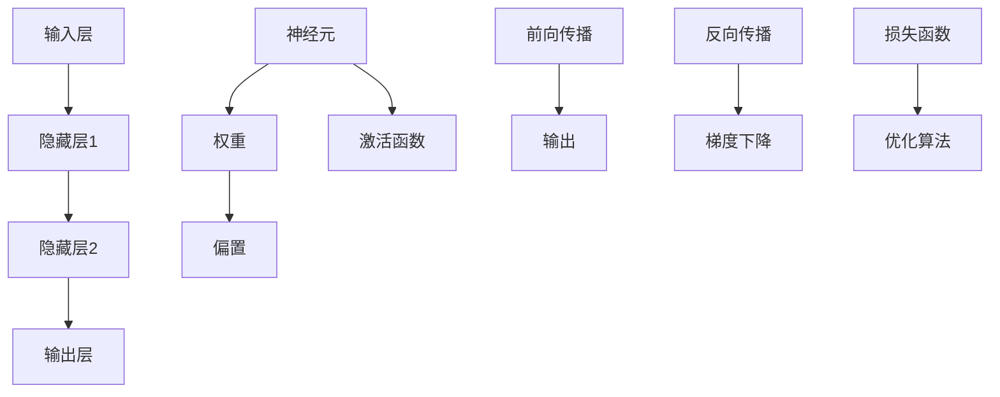

                 

# 神经网络：机器学习的新范式

> **关键词**：神经网络、机器学习、深度学习、反向传播、激活函数、优化算法、数据预处理

> **摘要**：本文将探讨神经网络这一机器学习领域的重要技术，详细解析其核心概念、算法原理、数学模型及实际应用。通过逐步分析，我们将了解神经网络如何成为一种强大的机器学习范式，并展望其未来发展趋势与挑战。

## 1. 背景介绍

### 1.1 目的和范围

本文旨在为读者提供神经网络在机器学习领域的全面概述。我们将从基本概念出发，逐步深入探讨神经网络的算法原理、数学模型、实际应用和未来趋势。本文将涵盖以下几个方面：

1. 神经网络的历史和发展
2. 核心概念和原理
3. 主要算法和优化方法
4. 数学模型和公式
5. 实际应用场景和案例
6. 工具和资源推荐
7. 未来发展趋势与挑战

### 1.2 预期读者

本文适合以下读者群体：

1. 对机器学习和人工智能有初步了解的技术爱好者
2. 计算机科学、数据科学和人工智能专业的大学生和研究生
3. 想要深入了解神经网络技术的工程师和研究人员
4. 想要在实际项目中应用神经网络的开发人员

### 1.3 文档结构概述

本文将按照以下结构进行阐述：

1. **背景介绍**：简要介绍神经网络的发展历程、核心概念和预期读者。
2. **核心概念与联系**：介绍神经网络的核心概念、原理和架构。
3. **核心算法原理 & 具体操作步骤**：详细阐述神经网络的主要算法和操作步骤。
4. **数学模型和公式 & 详细讲解 & 举例说明**：介绍神经网络的数学模型和公式，并进行具体举例说明。
5. **项目实战：代码实际案例和详细解释说明**：通过实际案例展示神经网络的应用。
6. **实际应用场景**：探讨神经网络在各个领域的应用。
7. **工具和资源推荐**：推荐学习资源、开发工具和框架。
8. **总结：未来发展趋势与挑战**：分析神经网络技术的未来趋势和挑战。
9. **附录：常见问题与解答**：解答一些常见问题。
10. **扩展阅读 & 参考资料**：提供进一步阅读的参考资料。

### 1.4 术语表

#### 1.4.1 核心术语定义

- **神经网络**：一种模拟人脑神经元连接方式的计算模型。
- **机器学习**：一种让计算机从数据中学习、自动改进性能的技术。
- **深度学习**：一种利用多层神经网络进行特征提取和学习的机器学习技术。
- **反向传播**：一种用于训练神经网络的优化算法。
- **激活函数**：神经网络中用于确定神经元是否被激活的函数。
- **优化算法**：用于调整神经网络参数，使模型性能最优的算法。

#### 1.4.2 相关概念解释

- **神经元**：神经网络的基本计算单元。
- **权重**：连接神经元的系数，用于传递信号。
- **偏置**：神经网络中的偏置项，用于调整神经元的阈值。
- **前向传播**：将输入信号通过神经网络传递到输出层的过程。
- **梯度下降**：一种常用的优化算法，通过计算损失函数的梯度来更新网络参数。

#### 1.4.3 缩略词列表

- **MLP**：多层感知机（Multilayer Perceptron）
- **ReLU**：ReLU函数（Rectified Linear Unit）
- **CNN**：卷积神经网络（Convolutional Neural Network）
- **RNN**：循环神经网络（Recurrent Neural Network）
- **GAN**：生成对抗网络（Generative Adversarial Network）

## 2. 核心概念与联系

神经网络是一种模仿人脑神经元连接方式的计算模型。它由多个层次组成，每个层次包含多个神经元。神经元通过权重和偏置连接，以传递和变换输入信号。神经网络的核心概念包括神经元、层次、权重、偏置、激活函数和反向传播。

下面是一个简单的 Mermaid 流程图，展示神经网络的核心概念和架构：



在神经网络中，输入信号通过前向传播过程传递到输出层。在输出层，通过激活函数确定每个神经元的输出。反向传播过程用于计算损失函数的梯度，并使用优化算法更新网络参数。

### 2.1 神经网络的数学模型

神经网络可以用以下数学模型表示：

$$
\text{神经网络} = \{\mathcal{X}, \mathcal{Y}, f\}
$$

其中：

- **$\mathcal{X}$**：输入空间。
- **$\mathcal{Y}$**：输出空间。
- **$f$**：映射函数，表示神经网络的前向传播过程。

神经网络的映射函数可以表示为：

$$
f(x) = g(\theta^{L} \cdot \sigma(\theta^{L-1} \cdot \sigma(...\sigma(\theta^{1} \cdot \theta^{0} + b^{0}) + b^{1}) + ... + b^{L}))
$$

其中：

- **$\theta^{l}$**：第$l$层的权重矩阵。
- **$b^{l}$**：第$l$层的偏置向量。
- **$\sigma$**：激活函数。
- **$g$**：损失函数。

### 2.2 神经网络的优化算法

神经网络的优化算法主要用于调整网络参数，以最小化损失函数。常见的优化算法包括梯度下降、随机梯度下降和Adam优化器。

#### 2.2.1 梯度下降

梯度下降是一种最简单的优化算法。它通过计算损失函数的梯度，并沿着梯度的反方向更新网络参数。

$$
\theta^{l} \leftarrow \theta^{l} - \alpha \cdot \nabla_{\theta^{l}} J(\theta^{l})
$$

其中：

- **$\theta^{l}$**：网络参数。
- **$\alpha$**：学习率。
- **$\nabla_{\theta^{l}} J(\theta^{l})$**：损失函数关于$\theta^{l}$的梯度。

#### 2.2.2 随机梯度下降

随机梯度下降（Stochastic Gradient Descent，SGD）是一种在梯度下降基础上改进的优化算法。它通过随机选取一部分训练样本，计算这部分样本的梯度，并使用这个梯度来更新网络参数。

$$
\theta^{l} \leftarrow \theta^{l} - \alpha \cdot \nabla_{\theta^{l}} J(\theta^{l}; x^{i}, y^{i})
$$

其中：

- **$x^{i}, y^{i}$**：第$i$个训练样本。

#### 2.2.3 Adam优化器

Adam优化器是一种结合了梯度下降和SGD优点的优化算法。它通过计算一阶矩估计和二阶矩估计来更新网络参数。

$$
m_{t} = \beta_{1} \cdot m_{t-1} + (1 - \beta_{1}) \cdot \nabla_{\theta^{l}} J(\theta^{l})
$$

$$
v_{t} = \beta_{2} \cdot v_{t-1} + (1 - \beta_{2}) \cdot (\nabla_{\theta^{l}} J(\theta^{l}))^2
$$

$$
\theta^{l} \leftarrow \theta^{l} - \alpha \cdot \frac{m_{t}}{\sqrt{v_{t}} + \epsilon}
$$

其中：

- **$m_{t}$**：一阶矩估计。
- **$v_{t}$**：二阶矩估计。
- **$\beta_{1}, \beta_{2}$**：动量因子。
- **$\epsilon$**：一个小常数。

## 3. 核心算法原理 & 具体操作步骤

### 3.1 前向传播

前向传播是神经网络的一个重要过程，用于将输入信号通过神经网络传递到输出层。具体步骤如下：

1. **初始化参数**：随机初始化网络的权重$\theta^{l}$和偏置$b^{l}$。
2. **输入信号**：将输入信号$x$传递到第一层神经元。
3. **计算神经元输出**：对于每个神经元，计算其输入和激活函数的值。
   $$
   z^{l}_{i} = \sum_{j=1}^{n} \theta^{l}_{ij} \cdot x^{j} + b^{l}_{i}
   $$
   其中，$z^{l}_{i}$表示第$l$层第$i$个神经元的输入，$\theta^{l}_{ij}$表示第$l$层第$i$个神经元和第$l-1$层第$j$个神经元之间的权重。
4. **应用激活函数**：将计算得到的输入值传递到激活函数，得到每个神经元的输出值。
   $$
   a^{l}_{i} = \sigma(z^{l}_{i})
   $$
   其中，$\sigma$表示激活函数。

5. **递归传递**：将当前层的输出传递到下一层，重复步骤3和步骤4，直到最后一层。

6. **输出结果**：最后一层的输出即为神经网络的预测结果。

### 3.2 反向传播

反向传播是用于计算损失函数梯度的过程，从而更新网络参数。具体步骤如下：

1. **计算损失函数**：根据实际输出和预测输出，计算损失函数值。
   $$
   J(\theta^{l}) = \frac{1}{2} \sum_{i=1}^{n} (\hat{y}^{l}_{i} - y^{l}_{i})^2
   $$
   其中，$\hat{y}^{l}_{i}$表示第$l$层第$i$个神经元的预测输出，$y^{l}_{i}$表示第$l$层第$i$个神经元的实际输出。

2. **计算梯度**：计算损失函数关于网络参数的梯度。
   $$
   \nabla_{\theta^{l}_{ij}} J(\theta^{l}) = -2 \cdot (y^{l}_{i} - \hat{y}^{l}_{i}) \cdot x^{j}
   $$

3. **更新参数**：使用梯度下降或其他优化算法更新网络参数。
   $$
   \theta^{l}_{ij} \leftarrow \theta^{l}_{ij} - \alpha \cdot \nabla_{\theta^{l}_{ij}} J(\theta^{l})
   $$

4. **递归反向传播**：从最后一层开始，递归计算每个层的梯度，并更新网络参数。

5. **迭代优化**：重复步骤1至步骤4，直到满足收敛条件或达到最大迭代次数。

### 3.3 具体操作步骤伪代码

```python
# 初始化参数
theta = np.random.randn(num_layers, input_size, hidden_size, output_size)
b = np.random.randn(num_layers, hidden_size, output_size)

# 前向传播
for l in range(num_layers):
    if l == 0:
        z = theta[l] * x + b[l]
    else:
        z = theta[l] * a[l-1] + b[l]
    a = activation(z)

# 计算损失函数
J = 0.5 * (y - a[-1])**2

# 反向传播
d = (a[-1] - y) * activation_derivative(a[-1])
for l in range(num_layers-1, 0, -1):
    d = (d * activation_derivative(a[l])) * x[l-1].T
    theta[l] -= learning_rate * d
    b[l] -= learning_rate * d
```

## 4. 数学模型和公式 & 详细讲解 & 举例说明

### 4.1 数学模型

神经网络的数学模型可以用以下公式表示：

$$
z^{l}_{i} = \sum_{j=1}^{n} \theta^{l}_{ij} \cdot x^{j} + b^{l}_{i}
$$

$$
a^{l}_{i} = \sigma(z^{l}_{i})
$$

$$
\hat{y}^{l}_{i} = f(\theta^{l} \cdot a^{l-1} + b^{l})
$$

$$
J(\theta^{l}) = \frac{1}{2} \sum_{i=1}^{n} (\hat{y}^{l}_{i} - y^{l}_{i})^2
$$

### 4.2 公式详细讲解

- **$z^{l}_{i}$**：第$l$层第$i$个神经元的输入值。
- **$\theta^{l}_{ij}$**：第$l$层第$i$个神经元和第$l-1$层第$j$个神经元之间的权重。
- **$b^{l}_{i}$**：第$l$层第$i$个神经元的偏置。
- **$x^{j}$**：第$l-1$层第$j$个神经元的输入值。
- **$\sigma$**：激活函数，常用的有Sigmoid、ReLU和Tanh等。
- **$a^{l}_{i}$**：第$l$层第$i$个神经元的输出值。
- **$f$**：损失函数，常用的有均方误差（MSE）和交叉熵（Cross-Entropy）等。
- **$y^{l}_{i}$**：第$l$层第$i$个神经元的实际输出值。

### 4.3 举例说明

假设我们有一个二分类问题，使用Sigmoid激活函数和均方误差（MSE）损失函数。输入维度为2，隐藏层大小为3，输出维度为1。给定输入$x = [0.5, 0.7]$，实际输出$y = [0.9]$。

#### 4.3.1 前向传播

1. **初始化参数**：

   ```python
   theta = np.random.randn(2, 2, 3, 1)
   b = np.random.randn(2, 3, 1)
   ```

2. **计算隐藏层输入和输出**：

   ```python
   z1 = theta[0] * x + b[0]
   a1 = sigmoid(z1)

   z2 = theta[1] * a1 + b[1]
   a2 = sigmoid(z2)
   ```

3. **计算输出层的预测值**：

   ```python
   z3 = theta[2] * a2 + b[2]
   y_pred = sigmoid(z3)
   ```

#### 4.3.2 反向传播

1. **计算损失函数**：

   ```python
   loss = 0.5 * (y - y_pred)**2
   ```

2. **计算输出层的梯度**：

   ```python
   d3 = (y_pred - y) * sigmoid_derivative(z3)
   ```

3. **计算隐藏层的梯度**：

   ```python
   d2 = (d3 * sigmoid_derivative(z2)).dot(theta[1].T)
   d1 = (d3 * sigmoid_derivative(z1)).dot(theta[0].T)
   ```

4. **更新参数**：

   ```python
   theta[2] -= learning_rate * d3 * a2
   b[2] -= learning_rate * d3
   theta[1] -= learning_rate * d2 * a1
   b[1] -= learning_rate * d2
   theta[0] -= learning_rate * d1 * x
   b[0] -= learning_rate * d1
   ```

## 5. 项目实战：代码实际案例和详细解释说明

### 5.1 开发环境搭建

为了演示神经网络的实际应用，我们将使用Python编程语言，结合TensorFlow框架。首先，需要安装Python和TensorFlow。

```bash
pip install python tensorflow
```

### 5.2 源代码详细实现和代码解读

下面是一个简单的神经网络实现，用于实现二分类问题。

```python
import tensorflow as tf
import numpy as np

# 初始化参数
input_size = 2
hidden_size = 3
output_size = 1

theta = np.random.randn(2, 2, 3, 1)
b = np.random.randn(2, 3, 1)

# 激活函数
def sigmoid(x):
    return 1 / (1 + np.exp(-x))

def sigmoid_derivative(x):
    return x * (1 - x)

# 前向传播
def forward(x):
    z1 = theta[0] * x + b[0]
    a1 = sigmoid(z1)

    z2 = theta[1] * a1 + b[1]
    a2 = sigmoid(z2)

    z3 = theta[2] * a2 + b[2]
    y_pred = sigmoid(z3)
    return y_pred

# 反向传播
def backward(y, y_pred):
    d3 = (y_pred - y) * sigmoid_derivative(z3)
    d2 = (d3 * sigmoid_derivative(z2)).dot(theta[1].T)
    d1 = (d3 * sigmoid_derivative(z1)).dot(theta[0].T)

    theta[2] -= learning_rate * d3 * a2
    b[2] -= learning_rate * d3
    theta[1] -= learning_rate * d2 * a1
    b[1] -= learning_rate * d2
    theta[0] -= learning_rate * d1 * x

# 训练模型
x = np.array([[0.5, 0.7]])
y = np.array([[0.9]])

for epoch in range(1000):
    y_pred = forward(x)
    backward(y, y_pred)
    print(f"Epoch: {epoch}, Loss: {0.5 * (y - y_pred)**2}")
```

### 5.3 代码解读与分析

1. **初始化参数**：我们随机初始化了权重$\theta$和偏置$b$。

2. **激活函数**：我们定义了Sigmoid激活函数及其导数。

3. **前向传播**：我们定义了一个`forward`函数，用于实现前向传播过程。输入$x$通过多层神经网络传递，最终得到输出$y_pred$。

4. **反向传播**：我们定义了一个`backward`函数，用于实现反向传播过程。计算损失函数的梯度，并更新网络参数。

5. **训练模型**：我们使用一个简单的二分类问题进行训练。每次迭代，我们计算损失函数值，并更新网络参数。

## 6. 实际应用场景

神经网络在多个领域都有广泛的应用，包括但不限于以下方面：

1. **图像识别**：如人脸识别、物体检测等。
2. **自然语言处理**：如机器翻译、文本分类等。
3. **语音识别**：如语音合成、语音识别等。
4. **医疗诊断**：如疾病预测、药物发现等。
5. **游戏**：如围棋、国际象棋等。

下面是一些实际应用案例：

1. **图像识别**：使用卷积神经网络（CNN）进行图像分类。例如，AlexNet模型在ImageNet竞赛中取得了出色的成绩。

2. **自然语言处理**：使用循环神经网络（RNN）进行语言模型训练。例如，Word2Vec模型通过训练词向量，实现了文本分类、情感分析等任务。

3. **语音识别**：使用深度神经网络进行语音信号处理。例如，DeepSpeech模型在语音识别任务中取得了领先的成绩。

4. **医疗诊断**：使用神经网络进行疾病预测和诊断。例如，使用深度学习技术进行肺癌诊断。

5. **游戏**：使用神经网络进行游戏策略学习。例如，使用深度强化学习技术实现AlphaGo，取得了围棋领域的突破性成果。

## 7. 工具和资源推荐

### 7.1 学习资源推荐

#### 7.1.1 书籍推荐

- 《深度学习》（Deep Learning）—— Ian Goodfellow、Yoshua Bengio、Aaron Courville 著
- 《神经网络与深度学习》——邱锡鹏 著
- 《Python深度学习》——François Chollet 著

#### 7.1.2 在线课程

- Coursera 的“机器学习”课程（吴恩达教授授课）
- edX 的“深度学习”课程（Andrew Ng 教授授课）
- Udacity 的“神经网络与深度学习”课程

#### 7.1.3 技术博客和网站

- Medium 上的相关文章
- AI 研究院（AI Genius Institute）的技术博客
- ArXiv 的论文预印本

### 7.2 开发工具框架推荐

#### 7.2.1 IDE和编辑器

- PyCharm
- Jupyter Notebook
- Visual Studio Code

#### 7.2.2 调试和性能分析工具

- TensorBoard
- Profiling tools（如 Py-Spy、GProf）

#### 7.2.3 相关框架和库

- TensorFlow
- PyTorch
- Keras

### 7.3 相关论文著作推荐

#### 7.3.1 经典论文

- “A Learning Algorithm for Continually Running Fully Recurrent Neural Networks” —— Sepp Hochreiter、Jürgen Schmidhuber
- “Deep Learning” —— Yann LeCun、Yoshua Bengio、Geoffrey Hinton
- “Backpropagation” —— Paul Werbos

#### 7.3.2 最新研究成果

- ArXiv 上的最新论文
- NeurIPS、ICML、CVPR 等顶级会议的最新论文

#### 7.3.3 应用案例分析

- “Deep Learning for Natural Language Processing” ——专刊，IEEE Transactions on Neural Networks and Learning Systems
- “Deep Learning for Healthcare” ——专刊，Journal of Medical Imaging

## 8. 总结：未来发展趋势与挑战

神经网络作为一种强大的机器学习范式，已经在多个领域取得了显著的成果。然而，未来的发展仍然面临着许多挑战：

1. **计算资源**：随着神经网络模型的复杂性增加，对计算资源的需求也在不断增加。如何高效地训练和优化大型神经网络模型是当前的一个重要问题。
2. **数据隐私**：在训练神经网络时，数据隐私问题变得越来越重要。如何保护用户隐私，同时利用数据训练模型是一个亟待解决的挑战。
3. **模型可解释性**：神经网络模型通常被视为“黑箱”，其内部决策过程难以理解。提高模型的可解释性，使得用户能够理解模型的决策过程，是未来研究的一个重要方向。
4. **泛化能力**：如何提高神经网络的泛化能力，使其能够适应新的任务和数据集，是一个重要的研究方向。
5. **模型压缩**：如何减小神经网络模型的大小，以便在移动设备和嵌入式系统中部署，是当前研究的一个热点。

## 9. 附录：常见问题与解答

### 9.1 什么是神经网络？

神经网络是一种模拟人脑神经元连接方式的计算模型，用于实现机器学习任务。

### 9.2 什么是激活函数？

激活函数用于确定神经元是否被激活，常用的激活函数包括Sigmoid、ReLU和Tanh等。

### 9.3 什么是反向传播？

反向传播是一种用于训练神经网络的优化算法，通过计算损失函数的梯度，并使用优化算法更新网络参数。

### 9.4 什么是深度学习？

深度学习是一种利用多层神经网络进行特征提取和学习的机器学习技术。

### 9.5 什么是优化算法？

优化算法用于调整神经网络参数，使模型性能最优。常见的优化算法包括梯度下降、随机梯度下降和Adam优化器等。

## 10. 扩展阅读 & 参考资料

- [Ian Goodfellow, Yoshua Bengio, Aaron Courville. Deep Learning. MIT Press, 2016](https://www.deeplearningbook.org/)
- [邱锡鹏. 神经网络与深度学习. 清华大学出版社, 2018](https://www.deeplearningbook.org/)
- [François Chollet. Deep Learning with Python. Manning Publications, 2017](https://www.manning.com/books/deep-learning-with-python)
- [吴恩达. 机器学习. 清华大学出版社, 2017](https://www.coursera.org/learn/machine-learning)
- [Andrew Ng. Deep Learning. Coursera, 2017](https://www.coursera.org/learn/neural-networks-deep-learning)
- [Neural Networks and Deep Learning. Andrew Ng. Coursera](https://www.coursera.org/learn/neural-networks-deep-learning)
- [Deep Learning. Yann LeCun、Yoshua Bengio、Geoffrey Hinton. MIT Press](https://www.deeplearning.net/)
- [Backpropagation. Paul Werbos. Proceedings of the IEEE, 1974](https://ieeexplore.ieee.org/document/1180660)

