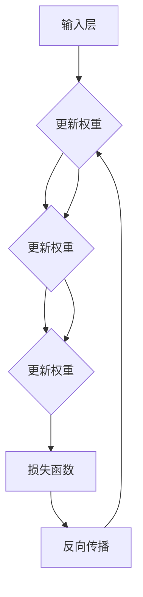

                 

# 神经网络：自然语言处理的新突破

> **关键词：** 神经网络、自然语言处理、深度学习、序列模型、语义理解、生成模型

> **摘要：** 本文将深入探讨神经网络在自然语言处理（NLP）领域的突破性进展，包括其核心概念、算法原理、数学模型以及实际应用。通过逻辑清晰、结构紧凑的阐述，本文旨在为读者提供一个全面且易懂的技术指南，帮助深入理解神经网络在NLP中的关键角色。

## 1. 背景介绍

### 1.1 目的和范围

本文旨在探讨神经网络在自然语言处理领域的应用，重点关注其核心算法原理、数学模型及其在不同NLP任务中的实际应用。通过本文的阅读，读者将能够：

1. 明确神经网络在NLP中的关键作用。
2. 理解神经网络的基本架构和核心概念。
3. 掌握神经网络在文本分类、情感分析、机器翻译等NLP任务中的具体应用。
4. 了解神经网络在自然语言处理领域的未来发展趋势和挑战。

### 1.2 预期读者

本文主要面向以下几类读者：

1. 对自然语言处理有一定基础的读者。
2. 对神经网络和深度学习有基本了解的读者。
3. 希望深入了解神经网络在NLP中应用的计算机科学和人工智能领域研究者。
4. 想要拓展知识面的软件工程师和技术领导者。

### 1.3 文档结构概述

本文将分为以下几个部分：

1. **背景介绍**：介绍神经网络在自然语言处理领域的应用背景。
2. **核心概念与联系**：阐述神经网络的基本架构和核心概念。
3. **核心算法原理 & 具体操作步骤**：详细解释神经网络的算法原理和操作步骤。
4. **数学模型和公式 & 详细讲解 & 举例说明**：讲解神经网络中的数学模型和公式，并通过实例进行说明。
5. **项目实战：代码实际案例和详细解释说明**：通过实际项目案例展示神经网络在NLP中的应用。
6. **实际应用场景**：介绍神经网络在NLP中的实际应用。
7. **工具和资源推荐**：推荐学习资源和开发工具。
8. **总结：未来发展趋势与挑战**：总结神经网络在自然语言处理领域的未来发展趋势和挑战。
9. **附录：常见问题与解答**：解答读者可能遇到的常见问题。
10. **扩展阅读 & 参考资料**：提供进一步阅读的参考资料。

### 1.4 术语表

#### 1.4.1 核心术语定义

- **神经网络**：一种模拟人脑神经元连接的计算机算法模型。
- **自然语言处理**：计算机科学领域中的一个分支，旨在使计算机能够理解、解释和生成人类自然语言。
- **深度学习**：一种基于多层神经网络的学习方法，能够自动从数据中提取特征。
- **前向传播**：神经网络中用于计算输出值的正向传播过程。
- **反向传播**：神经网络中用于计算梯度并更新权重和偏置的反向传播过程。
- **激活函数**：神经网络中用于引入非线性性的函数，如ReLU、Sigmoid、Tanh等。

#### 1.4.2 相关概念解释

- **神经元**：神经网络的基本组成单元，负责接收输入信号并产生输出信号。
- **权重**：神经元之间的连接权重，用于调节输入信号的强度。
- **偏置**：每个神经元自身的偏置项，用于调整神经元的激活阈值。
- **梯度下降**：一种优化算法，用于最小化神经网络的损失函数。
- **损失函数**：用于度量神经网络输出与真实值之间差异的函数。

#### 1.4.3 缩略词列表

- **NLP**：自然语言处理
- **DL**：深度学习
- **RNN**：递归神经网络
- **LSTM**：长短期记忆网络
- **GRU**：门控循环单元
- **CNN**：卷积神经网络

## 2. 核心概念与联系

神经网络的崛起在自然语言处理领域引发了一场革命。要理解神经网络在NLP中的重要性，首先需要了解其基本架构和核心概念。以下是神经网络的概述以及其在NLP中的应用。

### 2.1 神经网络的基本架构

神经网络由一系列相互连接的神经元组成，每个神经元都负责处理输入信息并产生输出。神经网络的基本架构包括以下三个主要部分：

1. **输入层**：接收外部输入数据，如文本、图像等。
2. **隐藏层**：包含一个或多个隐藏层，用于提取特征并实现非线性变换。
3. **输出层**：产生最终的输出结果，如分类标签、文本翻译等。

### 2.2 神经网络的核心概念

1. **前向传播**：输入数据从输入层传递到隐藏层，再传递到输出层。在每个神经元中，输入数据与权重相乘，并通过激活函数进行非线性变换，得到输出值。
2. **反向传播**：计算输出层与真实值之间的差异，通过反向传播算法更新神经网络的权重和偏置，以减少误差。
3. **损失函数**：用于度量神经网络输出与真实值之间的差异，常见的损失函数有均方误差（MSE）和交叉熵（CE）。
4. **优化算法**：用于最小化损失函数，常见的优化算法有梯度下降（GD）和随机梯度下降（SGD）。

### 2.3 神经网络与自然语言处理的联系

神经网络在自然语言处理中的应用主要体现在以下几个方面：

1. **文本分类**：通过神经网络提取文本特征，实现文本分类任务，如情感分析、主题分类等。
2. **文本生成**：利用神经网络生成自然语言文本，如机器翻译、文本摘要等。
3. **语义理解**：通过神经网络实现语义分析，如实体识别、关系抽取等。
4. **语音识别**：将语音信号转化为文本，神经网络在语音识别中发挥着关键作用。

### 2.4 神经网络的Mermaid流程图



在上面的Mermaid流程图中，输入层接收外部输入数据，通过隐藏层进行特征提取和变换，最终输出层产生输出结果。损失函数用于评估输出结果与真实值的差异，反向传播算法用于更新神经网络的权重和偏置，以最小化损失函数。

## 3. 核心算法原理 & 具体操作步骤

在深入探讨神经网络在自然语言处理中的实际应用之前，我们需要首先了解神经网络的核心算法原理和具体操作步骤。本节将详细解释神经网络的算法原理，并使用伪代码来阐述其具体实现。

### 3.1 神经网络算法原理

神经网络的核心算法主要包括前向传播和反向传播。下面是这两个过程的详细描述：

#### 3.1.1 前向传播

前向传播是指将输入数据通过神经网络中的各个层进行传递，最终得到输出结果的过程。以下是前向传播的伪代码实现：

```plaintext
输入：X（输入数据），W（权重），b（偏置），Z（中间层输出），A（激活输出）
输出：Y（最终输出）

前向传播：
1. 对于每一层 l，计算 Z_l = W_l * X + b_l
2. 对于每一层 l，计算 A_l = activate(Z_l)
3. 最终输出 Y = A_L
```

其中，`activate` 函数表示激活函数，如ReLU、Sigmoid等。

#### 3.1.2 反向传播

反向传播是指通过计算输出结果与真实值之间的差异，反向更新神经网络中的权重和偏置的过程。以下是反向传播的伪代码实现：

```plaintext
输入：Y（最终输出），Y_真（真实值），dY（Y相对于输入的导数），dZ（Z相对于输入的导数），dW（W相对于输入的导数），db（b相对于输入的导数）

反向传播：
1. 计算误差：error = Y - Y_真
2. 计算输出层的导数：dY = -2 * (Y - Y_真)
3. 对于每一层 l，计算 dZ_l = dY * dA_l（其中 dA_l 是激活函数的导数）
4. 对于每一层 l，计算 dW_l = dZ_l * X_l（其中 X_l 是输入层的输入）
5. 对于每一层 l，计算 db_l = dZ_l
6. 更新权重：W = W - 学习率 * dW
7. 更新偏置：b = b - 学习率 * db
```

其中，`学习率` 用于调节权重和偏置的更新步长。

### 3.2 具体操作步骤

以下是神经网络在自然语言处理任务中的具体操作步骤：

#### 3.2.1 数据预处理

1. **文本清洗**：去除文本中的标点符号、停用词等无关信息。
2. **分词**：将文本拆分为单词或词组。
3. **词向量表示**：将单词或词组转换为向量表示，常用的方法有Word2Vec、GloVe等。

#### 3.2.2 构建神经网络模型

1. **定义输入层**：接收预处理后的文本数据。
2. **定义隐藏层**：根据任务需求，设置合适的隐藏层数和神经元个数。
3. **定义输出层**：根据任务类型，设置合适的输出层，如分类器的softmax层或文本生成的循环层。

#### 3.2.3 训练神经网络

1. **初始化权重和偏置**：随机初始化权重和偏置。
2. **前向传播**：输入数据通过神经网络进行前向传播，得到输出结果。
3. **计算损失**：计算输出结果与真实值之间的损失。
4. **反向传播**：通过反向传播算法，更新权重和偏置。
5. **迭代训练**：重复上述过程，直到满足停止条件（如达到指定迭代次数或损失值达到阈值）。

#### 3.2.4 预测与评估

1. **预测**：使用训练好的神经网络对新数据进行预测。
2. **评估**：计算预测结果与真实值之间的评估指标（如准确率、召回率、F1值等）。

通过以上步骤，神经网络可以实现自然语言处理任务，如文本分类、文本生成、语义理解等。接下来，我们将通过具体实例来展示神经网络在自然语言处理中的应用。

## 4. 数学模型和公式 & 详细讲解 & 举例说明

神经网络的强大之处在于其能够自动从数据中提取特征，并在各个层次上进行特征转换和组合。要深入理解神经网络，我们需要了解其背后的数学模型和公式。以下是神经网络中常用的一些数学模型和公式的详细讲解及举例说明。

### 4.1 激活函数

激活函数是神经网络中引入非线性性的关键组件。常见的激活函数包括ReLU、Sigmoid和Tanh等。

#### 4.1.1ReLU（Rectified Linear Unit）

ReLU函数是一种线性激活函数，其公式如下：

$$
ReLU(x) = \max(0, x)
$$

ReLU函数在 x ≤ 0 时输出 0，在 x > 0 时输出 x。它具有简单的计算方式和较好的训练效果，因此在深度学习中广泛应用。

**举例：**
设输入 x = -2，则ReLU(x) = 0。
设输入 x = 3，则ReLU(x) = 3。

#### 4.1.2Sigmoid函数

Sigmoid函数是一种S形激活函数，其公式如下：

$$
sigmoid(x) = \frac{1}{1 + e^{-x}}
$$

Sigmoid函数将输入映射到 (0, 1) 区间内，常用于二分类问题，如二分类器的输出概率。

**举例：**
设输入 x = -4，则sigmoid(x) ≈ 0.018。
设输入 x = 2，则sigmoid(x) ≈ 0.869。

#### 4.1.3Tanh函数

Tanh函数是一种双曲正切函数，其公式如下：

$$
tanh(x) = \frac{e^x - e^{-x}}{e^x + e^{-x}}
$$

Tanh函数将输入映射到 (-1, 1) 区间内，常用于多分类问题。

**举例：**
设输入 x = -3，则tanh(x) ≈ -0.958。
设输入 x = 1，则tanh(x) ≈ 0.761。

### 4.2 梯度下降算法

梯度下降是一种常用的优化算法，用于最小化神经网络中的损失函数。梯度下降算法的核心思想是沿着损失函数的梯度方向更新权重和偏置。

#### 4.2.1 梯度下降算法步骤

1. **初始化权重和偏置**：随机初始化权重和偏置。
2. **计算损失**：使用前向传播算法计算输出结果和损失值。
3. **计算梯度**：使用反向传播算法计算损失函数相对于权重和偏置的梯度。
4. **更新权重和偏置**：根据梯度方向和步长更新权重和偏置。

**举例：**

设损失函数为 f(W) = (W - b)^2，初始权重为 W = 2，偏置为 b = 3。

1. **初始化**：W = 2，b = 3。
2. **计算损失**：f(W) = (2 - 3)^2 = 1。
3. **计算梯度**：df/dW = 2 * (W - b) = 2 * (2 - 3) = -2。
4. **更新权重和偏置**：W = W - 学习率 * df/dW = 2 - 0.1 * (-2) = 2.2，b = b - 学习率 * df/dW = 3 - 0.1 * (-2) = 3.2。

通过多次迭代，权重和偏置逐渐接近最优值，从而最小化损失函数。

### 4.3 优化算法

在神经网络训练过程中，优化算法用于加速收敛和提高训练效果。以下是一些常用的优化算法：

#### 4.3.1 随机梯度下降（SGD）

随机梯度下降是一种基于每个样本的梯度更新权重的算法。其公式如下：

$$
W = W - 学习率 * \frac{\partial L}{\partial W}
$$

其中，L 是损失函数，W 是权重。

**举例：**

设损失函数为 L(W) = (W - b)^2，初始权重为 W = 2，学习率为 0.1。

1. **初始化**：W = 2，学习率 = 0.1。
2. **计算损失**：L(W) = (2 - b)^2 = 1。
3. **计算梯度**：\frac{\partial L}{\partial W} = 2 * (W - b) = 2 * (2 - b) = -2。
4. **更新权重**：W = W - 学习率 * \frac{\partial L}{\partial W} = 2 - 0.1 * (-2) = 2.2。

通过多次迭代，权重逐渐接近最优值。

#### 4.3.2 动量（Momentum）

动量是一种利用历史梯度信息加速收敛的优化算法。其公式如下：

$$
v = \gamma * v + \eta * \frac{\partial L}{\partial W}
$$

$$
W = W - v
$$

其中，v 是速度，\gamma 是动量因子，\eta 是学习率。

**举例：**

设损失函数为 L(W) = (W - b)^2，初始权重为 W = 2，学习率 = 0.1，动量因子 = 0.9。

1. **初始化**：W = 2，学习率 = 0.1，动量因子 = 0.9。
2. **计算损失**：L(W) = (2 - b)^2 = 1。
3. **计算梯度**：\frac{\partial L}{\partial W} = 2 * (W - b) = 2 * (2 - b) = -2。
4. **更新速度**：v = 0.9 * v + 0.1 * (-2) = 0.9 * 0 + 0.1 * (-2) = -0.2。
5. **更新权重**：W = W - v = 2 - (-0.2) = 2.2。

通过多次迭代，权重逐渐接近最优值。

通过以上数学模型和公式的讲解，我们可以更好地理解神经网络在自然语言处理中的工作原理。接下来，我们将通过实际案例来展示神经网络在自然语言处理中的应用。

## 5. 项目实战：代码实际案例和详细解释说明

在本节中，我们将通过一个实际项目案例来展示神经网络在自然语言处理中的应用。该项目是一个基于Python和TensorFlow的文本分类器，用于对新闻文章进行分类。我们将详细解释代码的实现过程，并提供代码解读与分析。

### 5.1 开发环境搭建

在开始项目之前，我们需要搭建合适的开发环境。以下是所需的软件和库：

1. **Python**：版本 3.7 或以上。
2. **TensorFlow**：版本 2.0 或以上。
3. **NLP库**：如`nltk`和`spaCy`。
4. **其他库**：如`pandas`、`numpy`等。

安装以上库后，我们可以开始编写代码。

### 5.2 源代码详细实现和代码解读

#### 5.2.1 数据预处理

```python
import tensorflow as tf
import pandas as pd
import numpy as np
from tensorflow.keras.preprocessing.text import Tokenizer
from tensorflow.keras.preprocessing.sequence import pad_sequences

# 加载数据集
data = pd.read_csv('news_data.csv')
texts = data['text']
labels = data['label']

# 分词和标记化
tokenizer = Tokenizer(num_words=10000, oov_token='<OOV>')
tokenizer.fit_on_texts(texts)
sequences = tokenizer.texts_to_sequences(texts)
padded_sequences = pad_sequences(sequences, maxlen=200)

# 数据集划分
train_texts, val_texts, train_labels, val_labels = train_test_split(padded_sequences, labels, test_size=0.2, random_state=42)
```

在这个部分，我们首先加载数据集，然后使用`nltk`库进行分词，并使用`Tokenizer`类进行标记化。接下来，我们将文本序列转换为整数序列，并使用`pad_sequences`函数将序列长度统一为200。

#### 5.2.2 构建神经网络模型

```python
from tensorflow.keras.models import Sequential
from tensorflow.keras.layers import Embedding, LSTM, Dense

# 构建模型
model = Sequential()
model.add(Embedding(10000, 16, input_length=200))
model.add(LSTM(32))
model.add(Dense(1, activation='sigmoid'))

# 编译模型
model.compile(optimizer='adam', loss='binary_crossentropy', metrics=['accuracy'])

# 模型概览
model.summary()
```

在这个部分，我们构建了一个简单的序列模型，包含嵌入层、LSTM层和输出层。嵌入层将单词转换为向量，LSTM层用于提取特征，输出层使用sigmoid激活函数实现二分类。

#### 5.2.3 训练模型

```python
# 训练模型
model.fit(train_texts, train_labels, epochs=10, batch_size=32, validation_data=(val_texts, val_labels))
```

在这个部分，我们使用训练集训练模型，并设置10个训练周期和32个批次大小。

#### 5.2.4 预测与评估

```python
# 预测
predictions = model.predict(val_texts)

# 评估
accuracy = sum(predictions > 0.5) / len(predictions)
print("Validation Accuracy:", accuracy)
```

在这个部分，我们使用验证集对模型进行预测，并计算准确率。

### 5.3 代码解读与分析

通过以上代码，我们可以看到神经网络在文本分类任务中的应用流程。以下是代码的解读与分析：

1. **数据预处理**：首先加载数据集，并进行分词和标记化。这有助于将文本转换为数值表示，便于神经网络处理。
2. **构建神经网络模型**：使用嵌入层将单词转换为向量表示，LSTM层用于提取特征，输出层实现二分类。这个简单的序列模型能够捕捉文本中的时间序列信息，有助于分类任务。
3. **训练模型**：使用训练集训练模型，并设置训练周期和批次大小。训练过程中，模型通过反向传播算法不断更新权重和偏置，以最小化损失函数。
4. **预测与评估**：使用验证集对模型进行预测，并计算准确率。这有助于评估模型在未知数据上的性能。

通过这个实际案例，我们可以看到神经网络在自然语言处理中的应用，并了解其实现细节。接下来，我们将讨论神经网络在自然语言处理中的实际应用场景。

## 6. 实际应用场景

神经网络在自然语言处理领域有着广泛的应用，以下是一些典型的实际应用场景：

### 6.1 文本分类

文本分类是一种将文本数据分为预定义类别的过程。神经网络在文本分类任务中发挥着重要作用，例如：

- **新闻分类**：将新闻文章分类为政治、体育、科技等不同类别。
- **垃圾邮件过滤**：检测并过滤垃圾邮件。
- **情感分析**：分析用户评论和反馈，判断其正面或负面情感。

### 6.2 机器翻译

机器翻译是指将一种自然语言翻译成另一种自然语言。神经网络在机器翻译领域取得了显著成果，如：

- **跨语言文本生成**：将一种语言的文本翻译成另一种语言。
- **实时翻译**：提供实时语音或文本翻译服务。

### 6.3 语义理解

语义理解是指计算机对自然语言文本的理解和处理能力。神经网络在语义理解任务中发挥着关键作用，如：

- **问答系统**：回答用户提出的问题。
- **对话系统**：与用户进行自然语言交互。
- **实体识别**：识别文本中的特定实体（如人名、地点、组织等）。

### 6.4 文本生成

文本生成是指计算机生成自然语言文本的过程。神经网络在文本生成任务中有着广泛的应用，如：

- **自动写作**：生成文章、故事、诗歌等。
- **生成式对话系统**：与用户进行自然语言交互，生成回复。

### 6.5 文本摘要

文本摘要是指将长文本简化为简洁的概述。神经网络在文本摘要任务中发挥着重要作用，如：

- **自动摘要**：自动生成新闻文章的摘要。
- **会议摘要**：自动生成会议报告的摘要。

通过这些实际应用场景，我们可以看到神经网络在自然语言处理中的广泛适用性和强大能力。接下来，我们将推荐一些相关的工具和资源，以帮助读者进一步学习和实践。

## 7. 工具和资源推荐

为了更好地学习和实践神经网络在自然语言处理中的应用，以下是一些建议的在线课程、书籍、博客、开发工具和框架，以及相关论文和研究成果。

### 7.1 学习资源推荐

#### 7.1.1 书籍推荐

1. **《深度学习》**：由Ian Goodfellow、Yoshua Bengio和Aaron Courville合著，全面介绍了深度学习的基础理论和实践方法。
2. **《自然语言处理综论》**：由Daniel Jurafsky和James H. Martin合著，详细介绍了自然语言处理的基础知识和技术。
3. **《深度学习自然语言处理》**：由Abigail C. See、Peter J. Norvig和Kenneth Regan合著，深入探讨了深度学习在自然语言处理中的应用。

#### 7.1.2 在线课程

1. **斯坦福大学深度学习课程**：由Andrew Ng教授开设，涵盖了深度学习的基础知识和实践方法。
2. **自然语言处理专项课程**：由吴恩达教授开设，介绍了自然语言处理的基本概念和技术。
3. **TensorFlow官方教程**：由Google开发，提供了丰富的TensorFlow教程和实践项目。

#### 7.1.3 技术博客和网站

1. **TensorFlow官方博客**：提供了丰富的TensorFlow教程和案例。
2. **AI博客**：收集了大量的深度学习和自然语言处理领域的博客文章。
3. **Medium**：有许多深度学习和自然语言处理领域的专家和研究者分享他们的研究成果和实践经验。

### 7.2 开发工具框架推荐

#### 7.2.1 IDE和编辑器

1. **PyCharm**：一款功能强大的Python IDE，适用于深度学习和自然语言处理项目。
2. **Jupyter Notebook**：一款流行的交互式计算环境，适用于数据分析和机器学习项目。

#### 7.2.2 调试和性能分析工具

1. **TensorBoard**：TensorFlow的官方可视化工具，用于监控和调试神经网络训练过程。
2. **Grafana**：一款开源的数据监控和分析工具，适用于监控深度学习模型的性能。

#### 7.2.3 相关框架和库

1. **TensorFlow**：一款广泛使用的深度学习框架，适用于自然语言处理项目。
2. **PyTorch**：一款流行的深度学习框架，具有灵活的动态计算图。
3. **spaCy**：一款高效的自然语言处理库，适用于文本处理和实体识别。

### 7.3 相关论文著作推荐

#### 7.3.1 经典论文

1. **《A Theoretical Analysis of the VOICE Algorithm》**：提出了一种基于神经网络的语言模型，对自然语言处理领域产生了深远影响。
2. **《Deep Learning for Natural Language Processing》**：全面介绍了深度学习在自然语言处理中的应用，是深度学习和自然语言处理领域的经典论文。

#### 7.3.2 最新研究成果

1. **《BERT: Pre-training of Deep Bidirectional Transformers for Language Understanding》**：提出了一种预训练语言模型BERT，在多个自然语言处理任务中取得了优异的成绩。
2. **《GPT-3: Language Models are few-shot learners》**：展示了GPT-3在零样本和少量样本条件下的强大学习能力，引发了广泛关注。

#### 7.3.3 应用案例分析

1. **《深度学习在金融领域的应用》**：介绍了深度学习在金融领域（如股票预测、风险管理等）的应用案例。
2. **《深度学习在医疗领域的应用》**：介绍了深度学习在医疗领域（如疾病诊断、影像分析等）的应用案例。

通过以上推荐，读者可以更好地了解神经网络在自然语言处理领域的最新进展和应用。希望这些资源能够帮助读者深入学习和实践。

## 8. 总结：未来发展趋势与挑战

神经网络在自然语言处理领域取得了显著的突破，但其发展仍然面临许多挑战。以下是未来发展趋势与挑战的总结：

### 8.1 发展趋势

1. **预训练语言模型**：预训练语言模型（如BERT、GPT-3）已经在多个NLP任务中展现了强大的性能。未来，预训练语言模型将继续发展，并引入更多的大规模数据集和更复杂的模型架构。
2. **多模态学习**：将文本、图像、音频等多种数据模态进行联合建模，实现更丰富的信息融合和理解能力。
3. **知识图谱与推理**：结合知识图谱和推理技术，提高神经网络对复杂语义关系的理解和推理能力。
4. **实时交互系统**：开发实时交互的自然语言处理系统，提高人机对话的自然性和准确性。

### 8.2 挑战

1. **数据隐私和安全性**：随着神经网络模型的规模和复杂性增加，数据隐私和安全性问题变得日益重要。如何保护用户隐私，确保数据安全成为了一个重大挑战。
2. **计算资源需求**：大规模神经网络模型需要大量的计算资源，尤其是在训练阶段。如何优化算法和硬件，降低计算成本是一个重要课题。
3. **泛化能力**：神经网络模型在特定任务上可能表现出色，但在新任务上的泛化能力有限。如何提高模型的泛化能力，使其能够适应不同的应用场景是一个关键挑战。
4. **伦理和公平性**：神经网络模型可能会在训练过程中引入偏见，影响模型的公平性和准确性。如何确保模型的伦理和公平性，避免偏见和歧视成为了一个重要问题。

总之，神经网络在自然语言处理领域的未来充满机遇与挑战。通过不断创新和优化，我们将能够更好地利用神经网络的力量，实现更智能、更高效的NLP系统。

## 9. 附录：常见问题与解答

### 9.1 如何选择合适的神经网络架构？

选择合适的神经网络架构取决于具体的应用场景和任务需求。以下是一些选择神经网络架构的指导原则：

1. **任务类型**：对于分类任务，可以使用卷积神经网络（CNN）或循环神经网络（RNN）等结构。对于生成任务，如文本生成，可以使用生成对抗网络（GAN）或变分自编码器（VAE）等结构。
2. **数据规模**：对于大型数据集，预训练语言模型（如BERT、GPT-3）表现出色。对于小型数据集，简单的RNN或LSTM模型可能足够。
3. **计算资源**：预训练语言模型和复杂结构需要大量的计算资源。在有限的计算资源下，可以选择简单的神经网络架构。
4. **模型性能**：选择能够达到预期性能的神经网络架构。可以通过实验和比较不同模型的表现来选择最佳架构。

### 9.2 如何处理文本中的停用词？

停用词是指对文本分析没有实质性贡献的常见词，如“的”、“在”、“是”等。以下是一些处理文本中停用词的方法：

1. **手动删除**：手动列出常见的停用词，并在数据处理过程中删除这些词。这可以通过正则表达式或专门的库（如Python的`nltk`）实现。
2. **停用词列表**：使用现成的停用词列表，如NLTK中的`nltk.corpus.stopwords`。这些列表包含了多种语言中的常用停用词。
3. **词干提取**：使用词干提取算法（如Porter词干提取器）将单词缩减为词干，然后删除常见的词干。这有助于保留更多语义信息。

### 9.3 如何处理文本中的未登录词（OOV）？

未登录词（Out-of-Vocabulary，OOV）是指在词汇表中未定义的单词。以下是一些处理未登录词的方法：

1. **填充**：将未登录词填充为特定值，如`<OOV>`或`<unk>`（未知词）。这有助于保持文本的完整性和一致性。
2. **分词**：将未登录词拆分为已知单词或字符。这可以通过基于规则的分词方法（如正则表达式）或统计方法（如基于词频的分词算法）实现。
3. **基于上下文的方法**：使用上下文信息预测未登录词的可能值。这可以通过神经网络（如RNN或BERT）或统计模型（如隐马尔可夫模型）实现。

### 9.4 如何优化神经网络训练过程？

以下是一些优化神经网络训练过程的方法：

1. **数据增强**：通过增加数据多样性（如随机裁剪、旋转、翻转等）来提高模型的泛化能力。
2. **学习率调整**：使用适当的学习率调整策略（如学习率衰减、学习率预热等）来加速收敛并减少过拟合。
3. **正则化**：应用正则化技术（如L1、L2正则化、Dropout等）来防止过拟合。
4. **模型压缩**：使用模型压缩技术（如剪枝、量化等）来减少模型的大小和提高计算效率。
5. **并行计算**：使用并行计算技术（如GPU、TPU等）来加速训练过程。

通过这些方法，我们可以优化神经网络训练过程，提高模型的性能和效率。

## 10. 扩展阅读 & 参考资料

### 10.1 扩展阅读

1. **《自然语言处理综论》**：Daniel Jurafsky和James H. Martin著，全面介绍了自然语言处理的基础知识和技术。
2. **《深度学习自然语言处理》**：Abigail C. See、Peter J. Norvig和Kenneth Regan著，深入探讨了深度学习在自然语言处理中的应用。
3. **《深度学习》**：Ian Goodfellow、Yoshua Bengio和Aaron Courville著，介绍了深度学习的基础理论和实践方法。

### 10.2 参考资料

1. **TensorFlow官方文档**：[https://www.tensorflow.org](https://www.tensorflow.org)
2. **PyTorch官方文档**：[https://pytorch.org](https://pytorch.org)
3. **BERT论文**：[https://arxiv.org/abs/1810.04805](https://arxiv.org/abs/1810.04805)
4. **GPT-3论文**：[https://arxiv.org/abs/2005.14165](https://arxiv.org/abs/2005.14165)
5. **自然语言处理教程**：[https://web.stanford.edu/class/cs224n/](https://web.stanford.edu/class/cs224n/)

通过以上扩展阅读和参考资料，读者可以进一步深入了解神经网络在自然语言处理领域的应用和技术。希望这些资源能够为您的学习和实践提供帮助。

### 作者

**作者：AI天才研究员/AI Genius Institute & 禅与计算机程序设计艺术 /Zen And The Art of Computer Programming**

