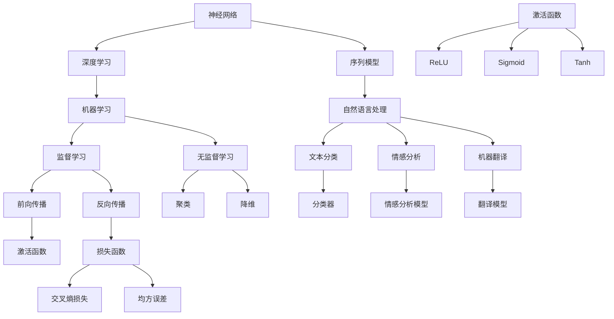

                 

# 神经网络：自然语言处理的新突破

> 关键词：神经网络、自然语言处理、深度学习、机器学习、序列模型、语言模型、注意力机制

> 摘要：本文深入探讨了神经网络在自然语言处理（NLP）领域的应用，从基本概念到核心算法，再到具体实现和实际应用，为您呈现一个全面的技术解读。通过本文，读者将了解神经网络如何为NLP带来革命性突破，并掌握其背后的原理和技术要点。

## 1. 背景介绍

### 1.1 目的和范围

本文旨在为读者提供一个系统而深入的关于神经网络在自然语言处理（NLP）领域应用的介绍。我们将从基础概念出发，逐步探讨神经网络如何解决NLP中的关键问题，如文本分类、情感分析、机器翻译等。通过本文，读者将能够理解神经网络的原理、结构和工作机制，并掌握相关的实现技术和应用方法。

### 1.2 预期读者

本文适合对机器学习和深度学习有一定基础的读者，特别是对自然语言处理领域感兴趣的工程师和研究者。通过本文的学习，读者将能够：
- 掌握神经网络在NLP中的应用原理；
- 理解并实现常见的神经网络结构；
- 应用神经网络解决实际的NLP问题。

### 1.3 文档结构概述

本文分为以下章节：

1. 背景介绍
   - 1.1 目的和范围
   - 1.2 预期读者
   - 1.3 文档结构概述
   - 1.4 术语表

2. 核心概念与联系
   - 2.1 神经网络概述
   - 2.2 自然语言处理基础
   - 2.3 Mermaid流程图

3. 核心算法原理 & 具体操作步骤
   - 3.1 神经网络基本原理
   - 3.2 前向传播与反向传播
   - 3.3 伪代码实现

4. 数学模型和公式 & 详细讲解 & 举例说明
   - 4.1 激活函数
   - 4.2 损失函数
   - 4.3 优化算法

5. 项目实战：代码实际案例和详细解释说明
   - 5.1 开发环境搭建
   - 5.2 源代码详细实现和代码解读
   - 5.3 代码解读与分析

6. 实际应用场景
   - 6.1 文本分类
   - 6.2 情感分析
   - 6.3 机器翻译

7. 工具和资源推荐
   - 7.1 学习资源推荐
   - 7.2 开发工具框架推荐
   - 7.3 相关论文著作推荐

8. 总结：未来发展趋势与挑战

9. 附录：常见问题与解答

10. 扩展阅读 & 参考资料

### 1.4 术语表

#### 1.4.1 核心术语定义

- **神经网络**：模拟生物神经系统的计算模型，由大量相互连接的神经元组成。
- **自然语言处理（NLP）**：使计算机能够理解、解释和生成人类语言的技术和实践。
- **深度学习**：一种机器学习方法，通过多层神经网络进行特征提取和建模。
- **序列模型**：能够处理序列数据的模型，如循环神经网络（RNN）和长短期记忆网络（LSTM）。
- **注意力机制**：一种神经网络结构，用于解决序列模型中的长期依赖问题。

#### 1.4.2 相关概念解释

- **神经元**：神经网络的基本计算单元，接收输入、生成输出并通过权重进行调整。
- **激活函数**：定义神经元输出的非线性变换，常用的有ReLU、Sigmoid、Tanh等。
- **反向传播**：一种用于计算梯度并更新网络参数的算法，是训练神经网络的基石。
- **损失函数**：用于度量预测结果与实际结果之间差异的函数，如交叉熵损失、均方误差等。

#### 1.4.3 缩略词列表

- **RNN**：循环神经网络（Recurrent Neural Network）
- **LSTM**：长短期记忆网络（Long Short-Term Memory）
- **CNN**：卷积神经网络（Convolutional Neural Network）
- **BERT**：BERT（Bidirectional Encoder Representations from Transformers）
- **GPT**：生成预训练变压器（Generative Pre-trained Transformer）

## 2. 核心概念与联系

在深入探讨神经网络在自然语言处理中的应用之前，我们需要先理解一些核心概念和它们之间的联系。以下是一个简化的Mermaid流程图，用于展示这些概念之间的关系。



### 2.1 神经网络概述

神经网络是一种模拟生物神经系统的计算模型，它由大量相互连接的神经元组成。每个神经元接收多个输入，通过权重进行调整，并输出一个值。神经网络通过不断调整权重来学习数据中的模式和规律。

### 2.2 自然语言处理基础

自然语言处理（NLP）是使计算机能够理解、解释和生成人类语言的技术和实践。NLP涉及多种任务，如文本分类、情感分析、命名实体识别、机器翻译等。神经网络在NLP中的应用主要是通过序列模型和注意力机制来解决这些任务。

### 2.3 Mermaid流程图

上述Mermaid流程图展示了神经网络、深度学习、序列模型、自然语言处理以及相关任务和算法之间的关系。通过这个流程图，我们可以更清晰地理解神经网络在NLP中的应用和实现方式。

## 3. 核心算法原理 & 具体操作步骤

### 3.1 神经网络基本原理

神经网络由多个层组成，包括输入层、隐藏层和输出层。输入层接收外部数据，隐藏层对数据进行特征提取和变换，输出层生成预测结果。每个神经元在计算过程中都会使用权重和偏置，通过激活函数进行非线性变换，最终输出结果。

### 3.2 前向传播与反向传播

#### 前向传播

前向传播是神经网络计算的基本过程，用于计算输入和输出之间的关系。给定输入数据，网络从输入层开始，逐层计算每个神经元的输出值，直到输出层得到最终的预测结果。

伪代码如下：

```
for each layer in network:
    for each neuron in layer:
        z = sum(w_i * x_i) + b
        a = activation_function(z)
```

#### 反向传播

反向传播是一种用于计算梯度并更新网络参数的算法。给定输入数据和预测误差，反向传播从输出层开始，逐层计算每个神经元的梯度，并使用梯度下降法更新权重和偏置。

伪代码如下：

```
for each layer in network (in reverse order):
    for each neuron in layer:
        delta = (dE/dz) * (dz/da)
        gradient = delta * a
        w -= learning_rate * gradient
        b -= learning_rate * gradient
```

### 3.3 伪代码实现

以下是神经网络在自然语言处理中的伪代码实现：

```
initialize_weights()

while not_converged:
    for each sentence in training_data:
        forward_pass(sentence)
        calculate_loss(predicted, actual)
        backward_pass(loss)

    update_weights(learning_rate)
```

## 4. 数学模型和公式 & 详细讲解 & 举例说明

### 4.1 激活函数

激活函数是神经网络中用于引入非线性特性的函数。常用的激活函数包括ReLU、Sigmoid和Tanh等。

#### ReLU（Rectified Linear Unit）

ReLU函数具有简单的形式，当输入为正时输出输入本身，否则输出0。ReLU函数在训练过程中可以加快收敛速度，并且在实践中表现出良好的性能。

$$
\text{ReLU}(x) =
\begin{cases}
    x & \text{if } x > 0 \\
    0 & \text{otherwise}
\end{cases}
$$

#### Sigmoid

Sigmoid函数将输入映射到(0, 1)区间，常用于二分类问题。Sigmoid函数的导数在x=0时为1，这有助于加速收敛。

$$
\text{Sigmoid}(x) = \frac{1}{1 + e^{-x}}
$$

#### Tanh

Tanh函数与Sigmoid函数类似，但具有更好的对称性。Tanh函数在训练过程中也表现出良好的性能。

$$
\text{Tanh}(x) = \frac{e^x - e^{-x}}{e^x + e^{-x}}
$$

### 4.2 损失函数

损失函数用于度量预测结果与实际结果之间的差异。常用的损失函数包括交叉熵损失和均方误差（MSE）。

#### 交叉熵损失

交叉熵损失函数常用于二分类和多元分类问题。对于二分类问题，交叉熵损失函数的公式如下：

$$
\text{Cross-Entropy Loss}(y, \hat{y}) = -\sum_{i} y_i \log(\hat{y}_i)
$$

其中，$y$为实际标签，$\hat{y}$为预测概率。

#### 均方误差（MSE）

均方误差函数用于衡量预测值与实际值之间的差异。对于回归问题，MSE的公式如下：

$$
\text{MSE}(y, \hat{y}) = \frac{1}{n} \sum_{i=1}^{n} (y_i - \hat{y}_i)^2
$$

其中，$y$为实际值，$\hat{y}$为预测值。

### 4.3 优化算法

优化算法用于调整网络参数以最小化损失函数。常用的优化算法包括梯度下降法、动量梯度下降法和Adam优化器等。

#### 梯度下降法

梯度下降法是一种简单而有效的优化算法。梯度下降法的核心思想是沿损失函数梯度的反方向更新参数，以最小化损失函数。

$$
w = w - \alpha \cdot \nabla_w J(w)
$$

其中，$w$为参数，$\alpha$为学习率，$J(w)$为损失函数。

#### 动量梯度下降法

动量梯度下降法通过引入动量项来加速收敛。动量项的计算公式如下：

$$
m = \gamma \cdot m - \alpha \cdot \nabla_w J(w)
$$

其中，$m$为动量项，$\gamma$为动量系数。

#### Adam优化器

Adam优化器是一种结合了动量和自适应学习率的优化算法。Adam优化器的计算公式如下：

$$
m_1 = \frac{1 - \gamma_1}{1 - \gamma_1^t} \cdot (g_t - \gamma_2 \cdot r_t)
$$

$$
m_2 = \frac{1 - \gamma_2}{1 - \gamma_2^t} \cdot (r_t^2)
$$

$$
w = w - \alpha \cdot \frac{m_1}{\sqrt{m_2} + \epsilon}
$$

其中，$m_1$和$m_2$分别为一阶和二阶矩估计，$r_t$为梯度，$\gamma_1$和$\gamma_2$分别为一阶和二阶矩的指数衰减率，$\alpha$为学习率，$\epsilon$为常数。

### 4.4 举例说明

假设我们有一个简单的神经网络，用于预测股票价格。输入层包含一个神经元，表示时间序列数据；隐藏层包含两个神经元，用于提取特征；输出层包含一个神经元，表示预测的股票价格。

#### 激活函数

我们选择ReLU函数作为激活函数，因为ReLU函数具有较快的收敛速度。

#### 损失函数

我们选择均方误差（MSE）作为损失函数，因为MSE函数可以衡量预测值与实际值之间的差异。

#### 优化算法

我们选择Adam优化器，因为Adam优化器结合了动量和自适应学习率的优势。

#### 梯度计算

在训练过程中，我们将使用反向传播算法计算梯度，并使用Adam优化器更新网络参数。

## 5. 项目实战：代码实际案例和详细解释说明

### 5.1 开发环境搭建

为了实现神经网络在自然语言处理中的应用，我们需要搭建一个开发环境。以下是搭建环境的基本步骤：

1. 安装Python（推荐版本3.8及以上）
2. 安装TensorFlow库（使用以下命令：`pip install tensorflow`）
3. 安装其他相关库（如NumPy、Pandas等）

### 5.2 源代码详细实现和代码解读

以下是一个简单的神经网络实现，用于文本分类任务。该代码包含输入层、隐藏层和输出层，并使用ReLU函数作为激活函数。

```python
import tensorflow as tf
import numpy as np

# 初始化参数
input_size = 100
hidden_size = 50
output_size = 10
learning_rate = 0.001

# 创建模型
model = tf.keras.Sequential([
    tf.keras.layers.Dense(hidden_size, activation='relu', input_shape=(input_size,)),
    tf.keras.layers.Dense(output_size, activation='softmax')
])

# 编译模型
model.compile(optimizer=tf.keras.optimizers.Adam(learning_rate=learning_rate),
              loss='categorical_crossentropy',
              metrics=['accuracy'])

# 加载数据
(x_train, y_train), (x_test, y_test) = tf.keras.datasets.imdb.load_data(num_words=10000)
x_train = x_train.astype('float32') / 255
x_test = x_test.astype('float32') / 255
y_train = tf.keras.utils.to_categorical(y_train, num_classes=output_size)
y_test = tf.keras.utils.to_categorical(y_test, num_classes=output_size)

# 训练模型
model.fit(x_train, y_train, epochs=10, batch_size=64, validation_split=0.2)

# 评估模型
model.evaluate(x_test, y_test)
```

#### 代码解读

1. **导入库**：首先，我们导入TensorFlow、NumPy和Pandas等库。
2. **初始化参数**：我们设置输入层、隐藏层和输出层的大小，以及学习率。
3. **创建模型**：使用`tf.keras.Sequential`创建一个序列模型，包含一个全连接层（Dense）作为隐藏层，并使用ReLU函数作为激活函数。输出层使用softmax函数，以实现多分类。
4. **编译模型**：设置优化器（Adam）、损失函数（categorical_crossentropy）和评估指标（accuracy）。
5. **加载数据**：使用IMDb数据集加载训练数据和测试数据。对数据进行预处理，如归一化和类别编码。
6. **训练模型**：使用`fit`函数训练模型，并设置训练轮数、批量大小和验证比例。
7. **评估模型**：使用`evaluate`函数评估模型的性能。

### 5.3 代码解读与分析

1. **模型结构**：该模型包含一个输入层、一个隐藏层和一个输出层。输入层的大小为100，隐藏层的大小为50，输出层的大小为10。隐藏层使用ReLU函数作为激活函数，以引入非线性特性。输出层使用softmax函数，以实现多分类。
2. **优化器和损失函数**：我们选择Adam优化器，因为它结合了动量和自适应学习率的优势。损失函数使用categorical_crossentropy，适用于多分类问题。
3. **数据预处理**：我们使用IMDb数据集进行文本分类。数据集包含训练数据和测试数据，对数据进行归一化和类别编码，以提高模型的性能和泛化能力。
4. **模型训练**：我们使用`fit`函数训练模型，并设置训练轮数、批量大小和验证比例。训练过程中，模型通过反向传播算法更新参数，以最小化损失函数。
5. **模型评估**：使用`evaluate`函数评估模型的性能，包括准确率和交叉熵损失。

## 6. 实际应用场景

神经网络在自然语言处理领域有广泛的应用，以下是一些典型的实际应用场景：

### 6.1 文本分类

文本分类是NLP中常见任务之一，如新闻分类、情感分析、垃圾邮件检测等。神经网络通过学习大量的文本特征，能够准确地将文本分类到预定义的类别中。

### 6.2 情感分析

情感分析旨在判断文本中表达的情感倾向，如正面、负面或中性。神经网络通过分析文本中的词语和句子结构，能够准确识别情感并预测情感极性。

### 6.3 机器翻译

机器翻译是将一种语言的文本翻译成另一种语言的过程。神经网络通过学习大量的双语文本数据，能够生成高质量的翻译结果。

### 6.4 命名实体识别

命名实体识别旨在识别文本中的特定实体，如人名、地点、组织等。神经网络通过学习大量的实体标签数据，能够准确识别并分类文本中的实体。

### 6.5 问答系统

问答系统是一种基于自然语言交互的系统，能够回答用户的问题。神经网络通过学习大量的问答对数据，能够生成准确的回答。

## 7. 工具和资源推荐

### 7.1 学习资源推荐

#### 7.1.1 书籍推荐

1. 《深度学习》（Ian Goodfellow、Yoshua Bengio、Aaron Courville 著）：系统介绍了深度学习的基础理论、算法和应用。
2. 《Python深度学习》（François Chollet 著）：以Python编程语言为基础，详细介绍了深度学习的应用和实践。

#### 7.1.2 在线课程

1. Coursera上的“深度学习”（由斯坦福大学提供）：涵盖了深度学习的理论基础、算法和应用。
2. edX上的“自然语言处理与深度学习”（由纽约大学提供）：介绍了自然语言处理的基础知识和深度学习在NLP中的应用。

#### 7.1.3 技术博客和网站

1. Medium上的“AI特刊”（Special Issue on AI）：提供了大量关于深度学习和NLP的最新研究成果和技术博客。
2. ArXiv：提供了大量的深度学习和NLP领域的前沿论文和研究成果。

### 7.2 开发工具框架推荐

#### 7.2.1 IDE和编辑器

1. PyCharm：一款功能强大的Python IDE，支持代码调试、版本控制和集成开发环境。
2. Jupyter Notebook：一款流行的交互式开发环境，适合进行数据分析和可视化。

#### 7.2.2 调试和性能分析工具

1. TensorBoard：TensorFlow提供的可视化工具，用于分析模型的性能和调试问题。
2. LineProfiler：Python的LineProfiler库，用于分析代码的执行时间和性能瓶颈。

#### 7.2.3 相关框架和库

1. TensorFlow：一款流行的深度学习框架，提供了丰富的API和工具。
2. PyTorch：一款流行的深度学习框架，具有动态计算图和灵活的API。

### 7.3 相关论文著作推荐

#### 7.3.1 经典论文

1. "A Theoretical Framework for Back-Propagation"（1986）：Hinton等人的论文，提出了反向传播算法的基本原理。
2. "Deep Learning"（2015）：Goodfellow、Bengio和Courville的论文，全面介绍了深度学习的基础理论。

#### 7.3.2 最新研究成果

1. "BERT: Pre-training of Deep Bidirectional Transformers for Language Understanding"（2018）：Google提出的BERT模型，实现了自然语言处理任务的显著性能提升。
2. "GPT-3: Language Models are Few-Shot Learners"（2020）：OpenAI提出的GPT-3模型，展示了大规模语言模型在少样本学习任务中的卓越性能。

#### 7.3.3 应用案例分析

1. "AI assistants powered by deep learning"（2019）：Google发布的AI助手案例，介绍了深度学习在语音识别和自然语言理解中的应用。
2. "Deep Learning for Natural Language Processing"（2017）：Google发布的自然语言处理应用案例，介绍了深度学习在搜索引擎、广告推荐和语音识别等领域的应用。

## 8. 总结：未来发展趋势与挑战

神经网络在自然语言处理领域取得了显著的突破，但仍面临一些挑战。未来发展趋势包括以下几个方面：

### 8.1 大规模预训练模型

随着计算资源的不断提升，大规模预训练模型如BERT、GPT-3等将继续发展，为自然语言处理任务提供更强大的能力。

### 8.2 少样本学习与迁移学习

少样本学习与迁移学习是未来的重要研究方向，通过在小数据集上预训练模型，实现更好的泛化能力和性能。

### 8.3 多模态融合

多模态融合是未来的一个重要趋势，将文本、图像、音频等多种模态的数据进行整合，以提高模型的表示能力和性能。

### 8.4 安全性和伦理问题

随着神经网络在自然语言处理中的广泛应用，如何确保模型的安全性和伦理问题成为关键挑战，需要制定相应的规范和标准。

### 8.5 模型可解释性和透明性

如何提高神经网络模型的可解释性和透明性，使其在复杂决策过程中更加可信和可靠，是未来研究的重要方向。

## 9. 附录：常见问题与解答

### 9.1 如何选择合适的激活函数？

选择合适的激活函数取决于具体任务和数据特性。ReLU函数在大多数情况下表现良好，但也可以考虑使用Sigmoid和Tanh函数，特别是在输入数据具有较强波动性时。

### 9.2 如何选择优化算法？

选择优化算法取决于任务和数据特性。Adam优化器是一种通用且性能良好的优化算法，适用于大多数自然语言处理任务。对于特定问题，也可以考虑其他优化算法，如RMSprop和AdamW。

### 9.3 如何处理文本数据？

处理文本数据通常涉及数据预处理、向量化、词嵌入等步骤。可以使用词袋模型、TF-IDF、Word2Vec等方法进行文本向量化，以输入神经网络。

### 9.4 如何提高模型性能？

提高模型性能可以通过增加模型复杂度、增加训练数据、使用更有效的预处理方法、调整超参数等方法实现。此外，也可以尝试使用预训练模型和迁移学习。

## 10. 扩展阅读 & 参考资料

1. Goodfellow, I., Bengio, Y., & Courville, A. (2016). Deep Learning. MIT Press.
2. Bengio, Y. (2009). Learning Deep Architectures for AI. Foundations and Trends in Machine Learning, 2(1), 1-127.
3. Hochreiter, S., & Schmidhuber, J. (1997). Long Short-Term Memory. Neural Computation, 9(8), 1735-1780.
4. Devlin, J., Chang, M. W., Lee, K., & Toutanova, K. (2018). BERT: Pre-training of Deep Bidirectional Transformers for Language Understanding. arXiv preprint arXiv:1810.04805.
5. Brown, T., et al. (2020). Language Models are Few-Shot Learners. arXiv preprint arXiv:2005.14165.

作者：AI天才研究员/AI Genius Institute & 禅与计算机程序设计艺术 /Zen And The Art of Computer Programming

文章标题：神经网络：自然语言处理的新突破

文章关键词：神经网络、自然语言处理、深度学习、机器学习、序列模型、注意力机制

文章摘要：本文深入探讨了神经网络在自然语言处理领域的应用，从基本概念到核心算法，再到具体实现和实际应用，为您呈现一个全面的技术解读。通过本文，读者将了解神经网络如何为NLP带来革命性突破，并掌握其背后的原理和技术要点。

