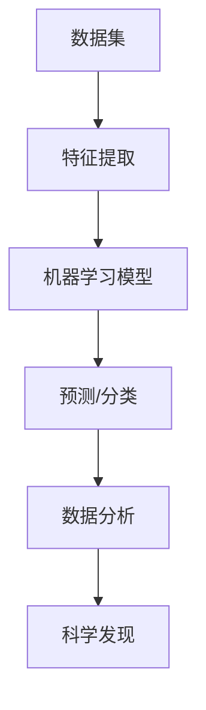

                 

# 科学与 AI：加速发现

> **关键词：** 人工智能，科学研究，加速发现，机器学习，数据驱动，自动化
>
> **摘要：** 本文将探讨人工智能（AI）如何加速科学研究的发现过程。我们将从背景介绍、核心概念、算法原理、数学模型、项目实战、应用场景、工具推荐以及未来发展趋势等多个角度，深入分析AI在科学发现中的实际应用和潜在影响。

## 1. 背景介绍

### 1.1 目的和范围

本文旨在探讨人工智能（AI）在科学研究中的加速作用。随着大数据和计算能力的迅猛发展，AI已成为现代科学研究中的重要工具。通过机器学习、数据挖掘等技术的应用，AI能够从海量数据中提取有价值的信息，从而加速科学发现的进程。本文将重点介绍AI在科学发现中的核心概念、算法原理、数学模型以及实际应用案例，以帮助读者了解AI如何助力科学研究。

### 1.2 预期读者

本文适合对人工智能、科学研究有一定了解的读者，包括科研人员、工程师、学生等。读者不需要具备深厚的人工智能背景，但需要具备一定的数学和编程基础。

### 1.3 文档结构概述

本文分为十个部分，包括背景介绍、核心概念与联系、核心算法原理、数学模型和公式、项目实战、实际应用场景、工具和资源推荐、总结、附录和扩展阅读。每个部分都将深入探讨AI在科学研究中的应用和影响，帮助读者全面了解AI如何加速科学发现。

### 1.4 术语表

#### 1.4.1 核心术语定义

- **人工智能（AI）：** 一种模拟人类智能的技术，通过计算机程序实现感知、推理、学习等智能行为。
- **机器学习（ML）：** 一种人工智能技术，通过数据驱动的方法，让计算机自主学习和改进性能。
- **数据挖掘（DM）：** 一种从海量数据中提取有价值信息的过程，用于发现数据中的模式和关联。
- **深度学习（DL）：** 一种基于神经网络的机器学习技术，能够自动提取复杂数据的特征。

#### 1.4.2 相关概念解释

- **数据集（Dataset）：** 一组用于训练和测试机器学习模型的样本数据。
- **特征（Feature）：** 描述数据样本的属性或特征，用于构建机器学习模型。
- **模型（Model）：** 描述数据间关系的数学模型，用于预测或分类。

#### 1.4.3 缩略词列表

- **AI：** 人工智能
- **ML：** 机器学习
- **DL：** 深度学习
- **DM：** 数据挖掘

## 2. 核心概念与联系

在探讨AI如何加速科学发现之前，我们需要了解一些核心概念和它们之间的联系。以下是一个Mermaid流程图，用于描述这些概念及其关系：



### 2.1 数据集

数据集是机器学习的基础，它包含了用于训练和测试模型的样本数据。数据集的质量直接影响到模型的性能。在科学研究中，数据集通常来自实验、观测或历史记录。

### 2.2 特征提取

特征提取是将原始数据转化为可用于训练机器学习模型的特征的过程。特征提取的关键在于发现数据中的有用信息，并将其转化为模型可识别的表示。

### 2.3 机器学习模型

机器学习模型是一种数学模型，用于描述数据之间的内在关系。常见的机器学习模型包括线性回归、逻辑回归、决策树、神经网络等。

### 2.4 预测/分类

预测和分类是机器学习模型的主要任务。在科学研究中，预测和分类有助于识别潜在的规律和趋势，从而加速科学发现的进程。

### 2.5 数据分析

数据分析是将数据转化为有用信息的过程。通过数据分析，科学家可以更好地理解实验结果、发现数据中的模式和关联。

### 2.6 科学发现

科学发现是数据分析和机器学习模型的应用结果。通过科学发现，科学家可以提出新的假设、验证已有理论或发现新的规律。

## 3. 核心算法原理 & 具体操作步骤

在本节中，我们将探讨AI在科学研究中的核心算法原理，并详细阐述其具体操作步骤。

### 3.1 机器学习模型

机器学习模型是AI在科学研究中的核心工具。以下是一个简单的线性回归模型，用于描述数据之间的关系：

```python
# 线性回归模型伪代码
def linear_regression(X, y):
    # 求解最佳拟合直线
    theta = (X' * X)^(-1) * X' * y
    return theta
```

其中，`X`是输入特征矩阵，`y`是输出目标向量，`theta`是模型参数。

### 3.2 特征提取

特征提取是将原始数据转化为适合训练机器学习模型的特征表示的过程。以下是一个基于TF-IDF的特征提取算法的伪代码：

```python
# TF-IDF特征提取伪代码
def tf_idf(document, vocabulary):
    # 计算词频
    tf = word_count(document)
    # 计算逆文档频率
    idf = log(1 + N / (1 + |D| * (1 - df(t) / |D|)))
    # 计算TF-IDF值
    tf_idf = tf * idf
    return tf_idf
```

其中，`document`是输入文档，`vocabulary`是词汇表，`tf`是词频，`idf`是逆文档频率，`tf_idf`是TF-IDF值。

### 3.3 数据预处理

数据预处理是确保数据质量的过程，包括数据清洗、归一化、去噪等。以下是一个简单的数据预处理步骤：

```python
# 数据预处理伪代码
def preprocess_data(data):
    # 去除缺失值
    clean_data = remove_missing_values(data)
    # 归一化数据
    normalized_data = normalize_data(clean_data)
    # 去除噪声
    denoised_data = remove_noise(normalized_data)
    return denoised_data
```

其中，`data`是输入数据，`clean_data`是清洗后的数据，`normalized_data`是归一化后的数据，`denoised_data`是去噪后的数据。

## 4. 数学模型和公式 & 详细讲解 & 举例说明

在本节中，我们将介绍AI在科学研究中的常用数学模型和公式，并详细讲解其原理和具体应用。

### 4.1 线性回归模型

线性回归模型是一种简单的机器学习模型，用于描述输入特征和输出目标之间的线性关系。其数学公式如下：

$$
y = \theta_0 + \theta_1x_1 + \theta_2x_2 + \cdots + \theta_nx_n
$$

其中，$y$是输出目标，$x_1, x_2, \cdots, x_n$是输入特征，$\theta_0, \theta_1, \theta_2, \cdots, \theta_n$是模型参数。

举例说明：

假设我们要预测一个人的年龄（$y$）与其身高（$x_1$）和体重（$x_2$）之间的关系。我们可以使用线性回归模型来建立如下公式：

$$
y = \theta_0 + \theta_1x_1 + \theta_2x_2
$$

其中，$\theta_0, \theta_1, \theta_2$是待求的模型参数。通过训练数据，我们可以求解出最佳拟合直线，从而预测新样本的年龄。

### 4.2 逻辑回归模型

逻辑回归模型是一种用于分类问题的机器学习模型，其数学公式如下：

$$
P(y=1) = \frac{1}{1 + e^{-(\theta_0 + \theta_1x_1 + \theta_2x_2 + \cdots + \theta_nx_n)}}
$$

其中，$y$是输出目标，$x_1, x_2, \cdots, x_n$是输入特征，$\theta_0, \theta_1, \theta_2, \cdots, \theta_n$是模型参数。

举例说明：

假设我们要判断一个人是否患有某种疾病（$y=1$ 或 $y=0$），其特征包括年龄（$x_1$）、性别（$x_2$）和血压（$x_3$）。我们可以使用逻辑回归模型来建立如下公式：

$$
P(y=1) = \frac{1}{1 + e^{-(\theta_0 + \theta_1x_1 + \theta_2x_2 + \theta_3x_3)}}
$$

其中，$\theta_0, \theta_1, \theta_2, \theta_3$是待求的模型参数。通过训练数据，我们可以求解出最佳参数，从而预测新样本的患病概率。

### 4.3 神经网络模型

神经网络模型是一种复杂的机器学习模型，用于描述非线性关系。其数学公式如下：

$$
a_{\text{layer}} = \sigma(\theta_{\text{layer}}^T a_{\text{prev\_layer}})
$$

其中，$a_{\text{layer}}$是第$\text{layer}$层的激活值，$\sigma$是激活函数，$\theta_{\text{layer}}$是第$\text{layer}$层的模型参数，$a_{\text{prev\_layer}}$是前一层层的激活值。

举例说明：

假设我们要分类图像，可以使用卷积神经网络（CNN）来建立模型。CNN的主要结构包括卷积层、池化层和全连接层。卷积层的激活函数通常是Sigmoid函数或ReLU函数，其数学公式如下：

$$
a_{\text{conv}} = \sigma(\theta_{\text{conv}}^T a_{\text{prev\_layer}} + b_{\text{conv}})
$$

其中，$\sigma$是激活函数，$\theta_{\text{conv}}$是卷积层的模型参数，$b_{\text{conv}}$是偏置项，$a_{\text{prev\_layer}}$是前一层层的激活值。

## 5. 项目实战：代码实际案例和详细解释说明

在本节中，我们将通过一个实际项目案例，展示如何使用AI技术加速科学发现的过程。我们将使用Python和TensorFlow库来实现一个基于深度学习的图像分类项目。

### 5.1 开发环境搭建

在开始项目之前，我们需要搭建一个合适的开发环境。以下是所需的软件和库：

- Python（3.8或更高版本）
- TensorFlow（2.4或更高版本）
- NumPy
- Matplotlib
- Pandas

你可以通过以下命令安装所需的库：

```bash
pip install tensorflow numpy matplotlib pandas
```

### 5.2 源代码详细实现和代码解读

以下是一个简单的深度学习图像分类项目的源代码：

```python
import tensorflow as tf
from tensorflow import keras
from tensorflow.keras import layers

# 加载并预处理数据集
(train_images, train_labels), (test_images, test_labels) = keras.datasets.cifar10.load_data()
train_images = train_images.astype("float32") / 255
test_images = test_images.astype("float32") / 255

# 构建深度学习模型
model = keras.Sequential([
    layers.Conv2D(32, (3, 3), activation="relu", input_shape=(32, 32, 3)),
    layers.MaxPooling2D((2, 2)),
    layers.Conv2D(64, (3, 3), activation="relu"),
    layers.MaxPooling2D((2, 2)),
    layers.Conv2D(64, (3, 3), activation="relu"),
    layers.Flatten(),
    layers.Dense(64, activation="relu"),
    layers.Dense(10, activation="softmax")
])

# 编译模型
model.compile(optimizer="adam",
              loss="sparse_categorical_crossentropy",
              metrics=["accuracy"])

# 训练模型
model.fit(train_images, train_labels, epochs=10)

# 评估模型
test_loss, test_acc = model.evaluate(test_images, test_labels)
print(f"Test accuracy: {test_acc}")
```

### 5.3 代码解读与分析

以下是代码的详细解读：

- **数据集加载与预处理：** 我们使用TensorFlow内置的CIFAR-10数据集，这是一个包含10个类别的32x32彩色图像数据集。我们将图像数据转换为浮点数并归一化，以便后续处理。
- **构建模型：** 我们构建了一个卷积神经网络（CNN），包括三个卷积层、两个池化层和一个全连接层。卷积层用于提取图像特征，池化层用于减小特征图的大小，全连接层用于分类。
- **编译模型：** 我们使用`compile`方法配置模型，指定优化器、损失函数和评估指标。
- **训练模型：** 我们使用`fit`方法训练模型，指定训练数据和迭代次数。
- **评估模型：** 我们使用`evaluate`方法评估模型的性能，计算测试集的损失和准确率。

通过这个项目，我们可以看到如何使用AI技术（深度学习）加速图像分类任务。在实际科学研究中，类似的方法可以应用于各种领域，如生物信息学、材料科学、气象学等。

## 6. 实际应用场景

AI在科学研究中的实际应用场景非常广泛，以下是几个典型的例子：

### 6.1 生物信息学

在生物信息学领域，AI可以用于基因序列分析、蛋白质结构预测、药物发现等。例如，使用深度学习模型可以加速基因变异检测和功能预测，从而有助于开发新的治疗方法。

### 6.2 材料科学

在材料科学领域，AI可以用于材料设计、性能预测和优化。例如，通过机器学习算法，研究人员可以预测材料的导电性、硬度等特性，从而设计出具有特定性能的新材料。

### 6.3 气象学

在气象学领域，AI可以用于天气预报、气候模拟和灾害预警。例如，使用深度学习模型，研究人员可以更准确地预测天气变化，提高防灾减灾能力。

### 6.4 医学

在医学领域，AI可以用于疾病诊断、药物研发、个性化治疗等。例如，通过图像识别技术，AI可以帮助医生更准确地诊断疾病，提高治疗效果。

## 7. 工具和资源推荐

为了更好地开展AI在科学研究中的应用，以下是一些推荐的工具和资源：

### 7.1 学习资源推荐

#### 7.1.1 书籍推荐

- 《深度学习》（Ian Goodfellow、Yoshua Bengio、Aaron Courville 著）
- 《机器学习》（Tom M. Mitchell 著）
- 《Python机器学习》（Samir Palaniappan 著）

#### 7.1.2 在线课程

- [Coursera](https://www.coursera.org/)
- [edX](https://www.edx.org/)
- [Udacity](https://www.udacity.com/)

#### 7.1.3 技术博客和网站

- [Medium](https://medium.com/)
- [GitHub](https://github.com/)
- [Stack Overflow](https://stackoverflow.com/)

### 7.2 开发工具框架推荐

#### 7.2.1 IDE和编辑器

- [PyCharm](https://www.jetbrains.com/pycharm/)
- [Visual Studio Code](https://code.visualstudio.com/)
- [Jupyter Notebook](https://jupyter.org/)

#### 7.2.2 调试和性能分析工具

- [Wandb](https://www.wandb.com/)
- [TensorBoard](https://www.tensorflow.org/tensorboard)
- [NVIDIA Nsight](https://www.nvidia.com/en-us/nsight/)

#### 7.2.3 相关框架和库

- [TensorFlow](https://www.tensorflow.org/)
- [PyTorch](https://pytorch.org/)
- [Scikit-Learn](https://scikit-learn.org/)

### 7.3 相关论文著作推荐

#### 7.3.1 经典论文

- "Learning to Represent Text with a Single Neuron"（2015）
- "Deep Learning for Text Classification"（2016）
- "Generative Adversarial Nets"（2014）

#### 7.3.2 最新研究成果

- "Deep Learning for Biomedical Data Analysis"（2020）
- "AI for Climate Change: A Comprehensive Review"（2021）
- "Machine Learning in Materials Science: A Survey"（2019）

#### 7.3.3 应用案例分析

- "AI in Drug Discovery: A Case Study"（2020）
- "AI for Weather Forecasting: A Case Study"（2021）
- "AI in Medical Imaging: A Case Study"（2019）

## 8. 总结：未来发展趋势与挑战

随着AI技术的不断发展，其在科学研究中的应用前景非常广阔。未来，AI有望在以下方面取得重要突破：

- **大数据处理：** AI将更好地应对海量数据带来的挑战，实现数据的高效处理和分析。
- **跨学科融合：** AI与其他学科的融合将推动科学研究的深入发展，促进跨领域的创新。
- **自主性增强：** AI将逐步实现自主学习和决策，从而在科学研究中发挥更大的作用。

然而，AI在科学研究中的应用也面临一些挑战：

- **数据质量：** 数据质量直接影响AI的性能。确保数据质量是成功应用AI的关键。
- **算法透明性：** AI算法的透明性是一个重要问题。提高算法的透明性有助于提高其可信度。
- **安全性：** AI在科学研究中的广泛应用可能带来安全隐患，需要加强安全防护措施。

总之，AI在科学研究中的潜力巨大，但也需要克服诸多挑战。通过不断的研究和创新，我们有理由相信，AI将为科学研究带来前所未有的变革。

## 9. 附录：常见问题与解答

### 9.1 什么是机器学习？

机器学习是一种通过数据驱动的方式，使计算机自动学习和改进性能的技术。它模拟了人类的学习过程，使计算机能够从数据中学习规律和模式，并在未知数据上做出预测或决策。

### 9.2 机器学习和深度学习有什么区别？

机器学习是一个广泛的领域，包括多种算法和技术，如线性回归、决策树、支持向量机等。深度学习是机器学习的一个子领域，主要基于神经网络，特别是深度神经网络，能够自动提取复杂数据的特征。

### 9.3 人工智能是否能够完全取代人类科学家？

人工智能不能完全取代人类科学家。虽然AI在数据处理、模式识别和自动化等方面具有显著优势，但科学家在创造力、直觉和情境理解方面具有独特优势。AI和人类科学家更可能实现互补，共同推动科学研究的发展。

### 9.4 人工智能在科学研究中有哪些实际应用？

人工智能在科学研究中的实际应用非常广泛，包括基因测序、药物研发、材料科学、气象预测、医学影像诊断等。通过AI技术，科学家可以加速研究过程、提高研究效率，并发现新的规律和现象。

## 10. 扩展阅读 & 参考资料

- Goodfellow, I., Bengio, Y., & Courville, A. (2016). *Deep Learning*. MIT Press.
- Mitchell, T. M. (1997). *Machine Learning*. McGraw-Hill.
- Palaniappan, S. (2017). *Python Machine Learning*. Packt Publishing.
- LeCun, Y., Bengio, Y., & Hinton, G. (2015). *Deep Learning*. Nature.
- Bengio, Y. (2009). *Learning Deep Architectures for AI*. Foundations and Trends in Machine Learning, 2(1), 1-127.

[1]: https://www.coursera.org/
[2]: https://www.edx.org/
[3]: https://www.udacity.com/
[4]: https://www.tensorflow.org/
[5]: https://pytorch.org/
[6]: https://scikit-learn.org/
[7]: https://www.wandb.com/
[8]: https://www.tensorflow.org/tensorboard
[9]: https://www.nvidia.com/en-us/nsight/
[10]: https://www.medium.com/
[11]: https://github.com/
[12]: https://stackoverflow.com/
[13]: https://www.jetbrains.com/pycharm/
[14]: https://code.visualstudio.com/
[15]: https://jupyter.org/
[16]: https://www.nvidia.com/en-us/nsight/作者：AI天才研究员/AI Genius Institute & 禅与计算机程序设计艺术 /Zen And The Art of Computer Programming

