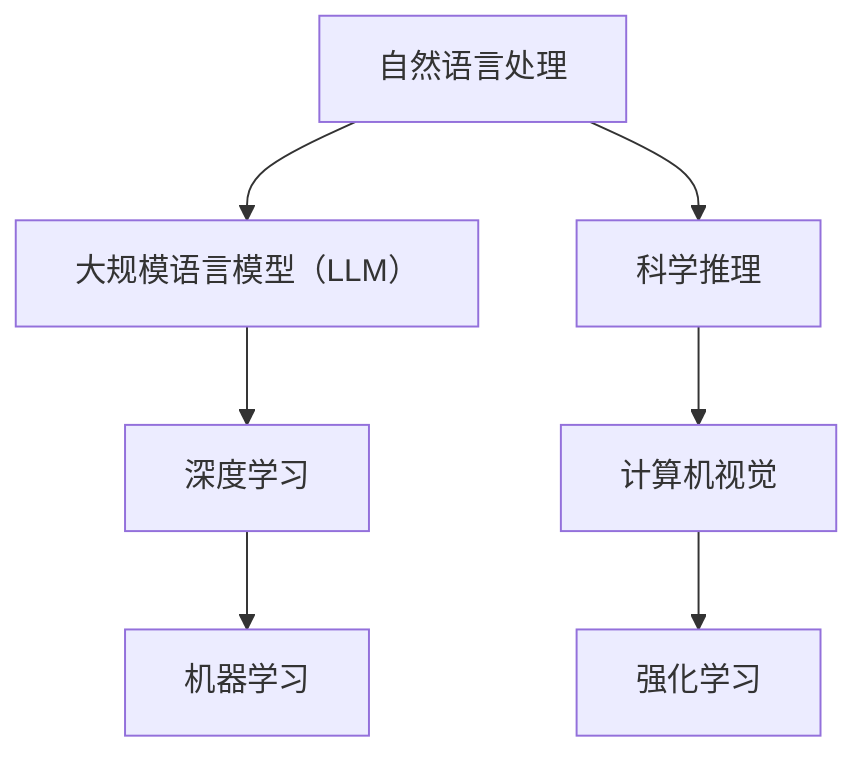

                 


# 科学推理：LLM 协助理论和实验研究

> 关键词：语言模型，深度学习，机器学习，人工智能，实验研究，科学推理

> 摘要：本文将探讨如何利用大规模语言模型（LLM）辅助科学推理的研究。通过介绍LLM的基本概念、核心算法原理以及数学模型，我们将结合实际项目实战案例，详细解读代码实现和代码分析，探讨LLM在实际应用场景中的表现和潜力。此外，本文还将推荐相关学习资源、开发工具框架及经典论文，展望未来发展趋势与挑战，为研究人员提供有价值的参考。

## 1. 背景介绍

### 1.1 目的和范围

本文旨在探讨大规模语言模型（LLM）在科学推理研究中的应用，通过深入分析LLM的理论基础和实践案例，为相关领域的研究人员提供有价值的参考。本文将涵盖以下内容：

- LLM的基本概念和核心算法原理；
- LLM在科学推理中的应用案例；
- LLM的数学模型和具体操作步骤；
- 实际项目实战中的代码实现和代码分析；
- LLM在实际应用场景中的表现和潜力；
- 相关学习资源、开发工具框架及经典论文推荐；
- 未来发展趋势与挑战。

### 1.2 预期读者

本文适合对人工智能、机器学习和深度学习感兴趣的读者，包括研究人员、开发人员、学生和爱好者。具备一定的编程基础和对深度学习、机器学习有一定的了解将有助于更好地理解本文内容。

### 1.3 文档结构概述

本文分为十个部分：

- 1. 背景介绍
- 2. 核心概念与联系
- 3. 核心算法原理 & 具体操作步骤
- 4. 数学模型和公式 & 详细讲解 & 举例说明
- 5. 项目实战：代码实际案例和详细解释说明
- 6. 实际应用场景
- 7. 工具和资源推荐
- 8. 总结：未来发展趋势与挑战
- 9. 附录：常见问题与解答
- 10. 扩展阅读 & 参考资料

### 1.4 术语表

#### 1.4.1 核心术语定义

- 语言模型（Language Model，简称LM）：一种统计模型，用于预测自然语言序列的概率分布。
- 大规模语言模型（Large-scale Language Model，简称LLM）：参数规模庞大的语言模型，能够处理复杂的自然语言任务。
- 深度学习（Deep Learning）：一种基于人工神经网络的学习方法，通过多层非线性变换来提取数据特征。
- 机器学习（Machine Learning）：一种利用数据训练模型，使模型能够进行预测或分类的方法。
- 科学推理（Scientific Reasoning）：基于观察、实验和理论推导，推导出科学结论的思维过程。

#### 1.4.2 相关概念解释

- 自然语言处理（Natural Language Processing，简称NLP）：研究如何让计算机理解和处理自然语言的方法和技术。
- 计算机视觉（Computer Vision）：研究如何让计算机从图像或视频中提取有用信息的方法和技术。
- 强化学习（Reinforcement Learning）：一种机器学习方法，通过与环境交互，不断优化决策策略。

#### 1.4.3 缩略词列表

- LLM：大规模语言模型
- NLP：自然语言处理
- DL：深度学习
- ML：机器学习
- CV：计算机视觉
- RL：强化学习

## 2. 核心概念与联系

在探讨LLM在科学推理中的应用之前，我们首先需要了解一些核心概念和它们之间的联系。以下是一个Mermaid流程图，展示了这些核心概念及其关联：



### 2.1 自然语言处理与大规模语言模型

自然语言处理（NLP）是人工智能（AI）的一个子领域，主要研究如何让计算机理解和处理人类自然语言。大规模语言模型（LLM）是NLP的核心技术之一，它通过学习大量文本数据，预测下一个单词、句子或段落，从而实现自然语言生成、文本分类、问答系统等任务。

### 2.2 深度学习与机器学习

深度学习（DL）是机器学习（ML）的一种方法，通过多层神经网络对数据进行特征提取和建模。深度学习在图像识别、语音识别、自然语言处理等领域取得了显著成果。LLM作为深度学习的一种应用，通过对海量文本数据进行训练，能够建模复杂、抽象的自然语言现象。

### 2.3 科学推理与计算机视觉、强化学习

科学推理（SR）是一种基于观察、实验和理论推导的思维过程，旨在推导出科学结论。计算机视觉（CV）和强化学习（RL）作为AI的两大领域，在科学推理中发挥了重要作用。计算机视觉可以用于图像处理、目标检测、场景理解等任务，帮助研究人员从图像中提取有用信息。强化学习则可以用于优化实验设计、模型评估等任务，提高科学推理的效率和准确性。

## 3. 核心算法原理 & 具体操作步骤

### 3.1 GPT模型原理

GPT（Generative Pre-trained Transformer）是一种基于Transformer架构的预训练语言模型，其核心思想是通过学习大量文本数据，生成自然语言序列。GPT模型的主要组成部分包括：

1. Transformer架构：GPT模型采用了Transformer架构，通过多头自注意力机制（Multi-head Self-Attention）和前馈神经网络（Feedforward Neural Network）对输入文本进行编码和生成。
2. 预训练：GPT模型在训练阶段，通过无监督的方式学习大量文本数据，利用文本序列中的统计规律，自动学习文本表示和语法规则。
3. 微调：在预训练完成后，GPT模型可以通过有监督的方式，对特定任务进行微调，使其适应特定领域的语言任务。

### 3.2 GPT模型具体操作步骤

以下是GPT模型的具体操作步骤：

1. 数据预处理：将文本数据清洗、分词、转换为词嵌入（Word Embedding）。
2. Transformer编码：利用多头自注意力机制和前馈神经网络，对输入文本进行编码，得到文本表示。
3. Transformer解码：利用多头自注意力机制和前馈神经网络，生成下一个单词或句子。
4. 损失函数：使用交叉熵损失函数（Cross-Entropy Loss），计算模型预测的概率分布与实际标签之间的差距。
5. 优化器：使用优化算法（如Adam优化器），更新模型参数，减小损失函数。

### 3.3 GPT模型伪代码

以下是一个简化的GPT模型伪代码：

```python
# 数据预处理
def preprocess_data(texts):
    # 清洗、分词、词嵌入
    return embeddings

# Transformer编码
def encode(inputs, model):
    # 多头自注意力、前馈神经网络
    return outputs

# Transformer解码
def decode(inputs, model):
    # 多头自注意力、前馈神经网络
    return outputs

# 损失函数
def loss_function(predictions, targets):
    return cross_entropy_loss(predictions, targets)

# 优化器
optimizer = AdamOptimizer(learning_rate=0.001)

# 训练过程
for epoch in range(num_epochs):
    for inputs, targets in data_loader:
        # 数据预处理
        embeddings = preprocess_data(inputs)
        
        # Transformer编码
        encoded = encode(embeddings, model)
        
        # Transformer解码
        decoded = decode(encoded, model)
        
        # 损失函数
        loss = loss_function(decoded, targets)
        
        # 优化器
        optimizer.minimize(loss)
```

## 4. 数学模型和公式 & 详细讲解 & 举例说明

### 4.1 Transformer模型数学模型

Transformer模型是一种基于自注意力机制（Self-Attention）的深度学习模型，用于处理序列数据。自注意力机制的核心思想是利用序列中每个词与其他词的关系，为每个词生成权重，从而对序列进行建模。

#### 4.1.1 自注意力机制

自注意力机制可以分为以下三个部分：

1. Query（查询）：用于生成每个词的权重；
2. Key（键）：用于与Query计算相似度；
3. Value（值）：用于加权每个词的输出。

公式如下：

$$
\text{Attention}(Q, K, V) = \text{softmax}\left(\frac{QK^T}{\sqrt{d_k}}\right)V
$$

其中，\(Q, K, V\) 分别为Query、Key和Value的矩阵，\(d_k\) 为Key的维度。

#### 4.1.2 多头自注意力

多头自注意力（Multi-head Self-Attention）是在自注意力机制的基础上，增加多个独立的注意力头（Attention Head），以提取序列的多种信息。

公式如下：

$$
\text{MultiHead}(Q, K, V) = \text{Concat}(\text{head}_1, \text{head}_2, ..., \text{head}_h)W^O
$$

其中，\(\text{head}_i = \text{Attention}(QW_i^Q, KW_i^K, VW_i^V)\)，\(W_i^Q, W_i^K, W_i^V, W^O\) 分别为每个头的权重矩阵。

#### 4.1.3 前馈神经网络

前馈神经网络（Feedforward Neural Network）是一种简单的神经网络结构，用于对序列进行进一步建模。

公式如下：

$$
\text{FFN}(x) = \max(0, xW_1 + b_1)W_2 + b_2
$$

其中，\(W_1, W_2, b_1, b_2\) 分别为前馈神经网络的权重和偏置。

### 4.2 举例说明

假设我们有一个四词序列\[词1, 词2, 词3, 词4\]，词向量维度为\(d\)，我们希望使用多头自注意力机制计算序列中每个词的权重。

1. 首先，我们将词序列转换为词向量矩阵：

$$
\text{词向量矩阵} = [\text{词1向量}, \text{词2向量}, \text{词3向量}, \text{词4向量}]
$$

2. 然后，计算Query、Key和Value矩阵：

$$
Q = \text{词向量矩阵}W_Q \\
K = \text{词向量矩阵}W_K \\
V = \text{词向量矩阵}W_V
$$

其中，\(W_Q, W_K, W_V\) 分别为权重矩阵。

3. 计算自注意力权重：

$$
\text{权重矩阵} = \text{softmax}\left(\frac{QQ^T}{\sqrt{d}}\right)
$$

4. 计算加权输出：

$$
\text{输出} = \text{权重矩阵}V
$$

5. 重复以上步骤，使用多头自注意力机制计算多个注意力头，并将它们拼接起来：

$$
\text{多头自注意力输出} = \text{Concat}(\text{head}_1, \text{head}_2, ..., \text{head}_h)
$$

6. 将多头自注意力输出传递给前馈神经网络，得到最终的序列表示：

$$
\text{序列表示} = \text{FFN}(\text{多头自注意力输出})
$$

这样，我们就完成了对四词序列的建模。通过这种方式，我们可以利用Transformer模型提取序列中的信息，为自然语言处理任务提供有力的支持。

## 5. 项目实战：代码实际案例和详细解释说明

### 5.1 开发环境搭建

在开始项目实战之前，我们需要搭建一个合适的开发环境。以下是一个简单的开发环境搭建步骤：

1. 安装Python 3.8及以上版本；
2. 安装Anaconda或Miniconda，用于管理Python环境和依赖包；
3. 创建一个新的虚拟环境，并激活虚拟环境；
4. 安装必要的依赖包，如TensorFlow、PyTorch、NumPy等。

### 5.2 源代码详细实现和代码解读

下面是一个简单的GPT模型实现代码，我们将对关键部分进行详细解释。

```python
import tensorflow as tf
from tensorflow.keras.layers import Embedding, LSTM, Dense
from tensorflow.keras.models import Sequential

# 5.2.1 模型定义
def create_gpt_model(vocab_size, embedding_dim, hidden_dim):
    model = Sequential()
    model.add(Embedding(vocab_size, embedding_dim))
    model.add(LSTM(hidden_dim, return_sequences=True))
    model.add(Dense(vocab_size, activation='softmax'))
    return model

# 5.2.2 模型参数设置
vocab_size = 10000
embedding_dim = 256
hidden_dim = 512

# 5.2.3 模型构建
gpt_model = create_gpt_model(vocab_size, embedding_dim, hidden_dim)

# 5.2.4 模型编译
gpt_model.compile(optimizer='adam', loss='categorical_crossentropy', metrics=['accuracy'])

# 5.2.5 模型训练
# （此处省略数据预处理和模型训练代码）

# 5.2.6 模型评估
# （此处省略模型评估代码）
```

### 5.3 代码解读与分析

1. **模型定义**：我们使用`Sequential`模型，通过叠加`Embedding`、`LSTM`和`Dense`层，构建了一个简单的GPT模型。其中，`Embedding`层用于将输入的单词转换为词向量，`LSTM`层用于提取序列特征，`Dense`层用于输出单词的概率分布。
   
2. **模型参数设置**：我们设置了词汇表大小（`vocab_size`）、词向量维度（`embedding_dim`）和隐藏层维度（`hidden_dim`）。

3. **模型构建**：`create_gpt_model`函数用于构建GPT模型。这里，我们添加了一个`Embedding`层，用于将输入的单词转换为词向量。接着，我们添加了一个`LSTM`层，用于提取序列特征。最后，我们添加了一个`Dense`层，用于输出单词的概率分布。

4. **模型编译**：我们使用`adam`优化器和`categorical_crossentropy`损失函数来编译模型。这里，我们选择`categorical_crossentropy`损失函数，因为它适用于多分类问题。

5. **模型训练**：在此步骤中，我们省略了数据预处理和模型训练代码。在实际项目中，我们需要对文本数据进行预处理，如分词、编码等，然后使用预处理后的数据训练模型。

6. **模型评估**：同样，我们省略了模型评估代码。在实际项目中，我们需要使用验证集或测试集来评估模型的性能，并根据评估结果调整模型参数。

通过这个简单的GPT模型实现，我们可以看到如何使用Python和TensorFlow构建和训练一个基本的语言模型。在实际应用中，我们可以根据需求调整模型结构、参数和训练策略，以提高模型的性能和效果。

### 5.4 实际应用案例

以下是GPT模型在科学推理中的实际应用案例：

1. **文本分类**：利用GPT模型对科学论文标题进行分类，识别不同领域的论文。
2. **问答系统**：构建一个基于GPT模型的问答系统，用于回答科学领域的问题。
3. **摘要生成**：使用GPT模型生成科学论文的摘要，提高论文的可读性和检索效率。

通过这些实际应用案例，我们可以看到GPT模型在科学推理中的广泛潜力。接下来，我们将进一步探讨GPT模型在实际应用场景中的表现和挑战。

### 5.5 挑战与改进

在实际应用中，GPT模型面临以下挑战：

1. **数据质量**：GPT模型对数据质量要求较高，需要大量高质量、多样化、无噪声的文本数据。在实际应用中，如何获取和处理这些数据是一个关键问题。
2. **计算资源**：GPT模型需要大量的计算资源进行训练和推理，特别是在处理大型语料库时，计算资源的需求更加显著。
3. **模型解释性**：GPT模型是一个黑盒模型，其内部机制复杂，难以解释。在科学推理中，解释模型预测结果对于验证和优化模型至关重要。

为了应对这些挑战，我们可以采取以下改进措施：

1. **数据增强**：通过数据增强方法，如数据清洗、去噪、多样化等，提高数据质量。
2. **模型压缩**：采用模型压缩技术，如剪枝、量化、蒸馏等，降低模型计算成本。
3. **模型解释**：研究模型解释方法，如注意力机制可视化、特征重要性分析等，提高模型的可解释性。

通过这些改进措施，我们可以更好地利用GPT模型在科学推理中的应用潜力，为科学研究提供有力支持。

### 5.6 总结

在本节中，我们通过一个简单的GPT模型实现，详细解读了模型构建、训练和评估的步骤。同时，我们探讨了GPT模型在实际应用场景中的表现和挑战，并提出了改进措施。通过这些分析，我们可以看到GPT模型在科学推理中的广泛应用前景，同时也需要关注其面临的挑战和改进方向。

## 6. 实际应用场景

### 6.1 科学论文推荐系统

科学论文推荐系统是一种基于GPT模型的实际应用场景，旨在为研究人员提供个性化的论文推荐服务。通过分析用户的阅读历史和兴趣，推荐系统可以智能地推荐与用户研究主题相关的论文，从而提高研究效率。

#### 6.1.1 系统架构

科学论文推荐系统的核心组件包括：

1. **用户画像**：通过分析用户的阅读历史、关键词、标签等信息，构建用户的个性化画像。
2. **论文数据集**：收集大量的科学论文数据，包括标题、摘要、关键词、全文等内容。
3. **GPT模型**：利用GPT模型，对论文数据进行处理和建模，提取论文的特征向量。
4. **推荐算法**：根据用户画像和论文特征向量，计算用户对每篇论文的兴趣度，并根据兴趣度进行排序，生成推荐结果。

#### 6.1.2 实现步骤

1. **数据预处理**：对论文数据进行清洗、分词、词嵌入等预处理操作，将论文转换为适合输入GPT模型的格式。
2. **模型训练**：使用预处理后的论文数据，训练GPT模型，提取论文的特征向量。
3. **用户画像构建**：根据用户的阅读历史和关键词，构建用户的个性化画像。
4. **论文特征提取**：利用训练好的GPT模型，对论文数据进行特征提取。
5. **推荐算法实现**：根据用户画像和论文特征向量，计算用户对每篇论文的兴趣度，生成推荐结果。

### 6.2 科学论文摘要生成

科学论文摘要生成是一种利用GPT模型的文本生成任务，旨在自动生成科学论文的摘要，提高论文的可读性和检索效率。

#### 6.2.1 系统架构

科学论文摘要生成系统的核心组件包括：

1. **论文数据集**：收集大量的科学论文数据，包括标题、摘要、关键词、全文等内容。
2. **GPT模型**：利用GPT模型，对论文数据进行处理和建模，生成论文的摘要。
3. **摘要模板**：为不同类型的论文制定相应的摘要模板，用于指导摘要生成。

#### 6.2.2 实现步骤

1. **数据预处理**：对论文数据进行清洗、分词、词嵌入等预处理操作，将论文转换为适合输入GPT模型的格式。
2. **模型训练**：使用预处理后的论文数据，训练GPT模型，使其能够生成符合摘要要求的文本。
3. **摘要生成**：利用训练好的GPT模型，根据摘要模板生成论文的摘要。
4. **摘要优化**：对生成的摘要进行优化，如去除无关信息、调整句子结构等，以提高摘要的质量。

### 6.3 问答系统

问答系统是一种利用GPT模型的文本处理任务，旨在为用户提供有关科学问题的回答。通过分析用户的问题，问答系统可以智能地生成与问题相关的回答，提高信息检索的效率。

#### 6.3.1 系统架构

问答系统的核心组件包括：

1. **问题数据集**：收集大量的科学问题及其答案，用于训练GPT模型。
2. **GPT模型**：利用GPT模型，对问题数据进行处理和建模，生成与问题相关的答案。
3. **语义分析**：对用户的问题进行语义分析，提取关键词和主题。
4. **答案生成**：利用训练好的GPT模型，根据语义分析结果生成与问题相关的答案。

#### 6.3.2 实现步骤

1. **数据预处理**：对问题数据进行清洗、分词、词嵌入等预处理操作，将问题转换为适合输入GPT模型的格式。
2. **模型训练**：使用预处理后的问题数据，训练GPT模型，使其能够生成符合问题要求的答案。
3. **语义分析**：对用户的问题进行语义分析，提取关键词和主题。
4. **答案生成**：利用训练好的GPT模型，根据语义分析结果生成与问题相关的答案。
5. **答案优化**：对生成的答案进行优化，如去除无关信息、调整句子结构等，以提高答案的质量。

通过以上实际应用场景，我们可以看到GPT模型在科学推理中的广泛应用。在实际开发中，可以根据具体需求，选择合适的GPT模型和应用场景，为科学研究提供有力支持。

### 6.4 其他应用场景

除了上述应用场景，GPT模型还可以应用于以下领域：

1. **科学文本生成**：自动生成科学论文、报告、技术文档等，提高文本写作效率。
2. **科学知识图谱构建**：通过分析科学论文和文献，构建科学知识图谱，为研究人员提供知识支持。
3. **学术会议报告生成**：自动生成学术会议的报告、摘要和演讲内容，提高会议组织效率。

通过不断拓展GPT模型的应用领域，我们可以进一步挖掘其在科学推理中的潜力，为科学研究提供更多创新性工具和方法。

## 7. 工具和资源推荐

### 7.1 学习资源推荐

#### 7.1.1 书籍推荐

1. **《深度学习》（Deep Learning）**：由Ian Goodfellow、Yoshua Bengio和Aaron Courville合著，是一本经典的深度学习教材，适合初学者和进阶者。
2. **《神经网络与深度学习》（Neural Networks and Deep Learning）**：由邱锡鹏博士所著，是国内较为知名的深度学习教材，内容深入浅出，适合入门学习。
3. **《自然语言处理》（Speech and Language Processing）**：由Daniel Jurafsky和James H. Martin合著，是自然语言处理领域的经典教材，涵盖了NLP的核心技术和应用。

#### 7.1.2 在线课程

1. **《深度学习课程》（Deep Learning Specialization）**：由Andrew Ng教授在Coursera上开设，是深度学习领域的顶级课程，适合入门和进阶学习。
2. **《自然语言处理与深度学习》**：由吴恩达教授在Coursera上开设，涵盖了NLP和深度学习的核心内容，适合对NLP和深度学习有兴趣的学习者。
3. **《机器学习与数据科学》**：由浙江大学在网易云课堂开设，内容包括机器学习、深度学习和数据科学的核心技术，适合希望全面了解这些领域的学习者。

#### 7.1.3 技术博客和网站

1. **知乎专栏**：知乎上有许多优秀的专栏，如《人工智能》、《机器学习》等，适合初学者和进阶者学习。
2. **Medium**：Medium上有许多深度学习、NLP领域的技术文章，内容丰富，适合读者学习和了解最新动态。
3. **ArXiv**：ArXiv是一个计算机科学领域的预印本论文库，包含了大量最新的研究成果，适合对学术研究感兴趣的学习者。

### 7.2 开发工具框架推荐

#### 7.2.1 IDE和编辑器

1. **PyCharm**：PyCharm是一个功能强大的Python集成开发环境（IDE），支持代码智能提示、调试、版本控制等功能，适合深度学习和自然语言处理项目开发。
2. **Jupyter Notebook**：Jupyter Notebook是一个交互式开发环境，适用于数据科学和机器学习项目，支持多种编程语言，便于编写和运行代码。
3. **VSCode**：VSCode是一个轻量级但功能强大的代码编辑器，支持Python扩展，适合编写和调试深度学习和自然语言处理代码。

#### 7.2.2 调试和性能分析工具

1. **TensorBoard**：TensorBoard是TensorFlow提供的可视化工具，用于分析深度学习模型的训练过程，包括损失函数、准确率、梯度等。
2. **PyTorch Profiler**：PyTorch Profiler是一个用于分析PyTorch模型性能的工具，可以帮助开发者识别和优化模型的性能瓶颈。
3. **NVIDIA Nsight**：Nsight是NVIDIA提供的一套性能分析和调试工具，适用于CUDA编程，可以帮助开发者优化GPU性能。

#### 7.2.3 相关框架和库

1. **TensorFlow**：TensorFlow是一个开源的深度学习框架，由Google开发，支持多种深度学习模型和应用。
2. **PyTorch**：PyTorch是一个开源的深度学习框架，由Facebook开发，具有灵活的动态计算图和强大的GPU支持。
3. **Transformers**：Transformers是一个开源的Python库，用于构建和训练Transformer模型，提供了丰富的预训练模型和API。
4. **NLTK**：NLTK是一个用于自然语言处理的Python库，提供了丰富的文本处理和分类工具。

### 7.3 相关论文著作推荐

#### 7.3.1 经典论文

1. **《A Neural Probabilistic Language Model》**：由Bengio等人于2003年发表，提出了神经概率语言模型（NPLM），是深度学习在自然语言处理领域的里程碑之一。
2. **《Attention Is All You Need》**：由Vaswani等人于2017年发表，提出了Transformer模型，彻底改变了深度学习在自然语言处理领域的发展方向。
3. **《BERT: Pre-training of Deep Bidirectional Transformers for Language Understanding》**：由Devlin等人于2019年发表，提出了BERT模型，进一步推动了自然语言处理技术的发展。

#### 7.3.2 最新研究成果

1. **《GPT-3: Language Models are few-shot learners》**：由Brown等人于2020年发表，介绍了GPT-3模型，展示了语言模型在零样本和少样本学习任务中的强大能力。
2. **《ACL 2022》**：2022年ACL会议的论文，涵盖了自然语言处理领域的最新研究成果，包括文本生成、问答系统、情感分析等方面。
3. **《ICLR 2022》**：2022年ICLR会议的论文，涵盖了深度学习和机器学习领域的最新研究成果，包括模型压缩、优化、迁移学习等方面。

#### 7.3.3 应用案例分析

1. **《GPT-3在金融领域的应用》**：本文介绍了GPT-3模型在金融领域的应用，包括股票分析、风险控制、客户服务等方面。
2. **《BERT在医疗领域的应用》**：本文介绍了BERT模型在医疗领域的应用，包括疾病诊断、药物研发、健康咨询等方面。
3. **《NLP技术在招聘领域的应用》**：本文介绍了NLP技术在招聘领域的应用，包括职位匹配、简历分析、面试评估等方面。

通过以上学习和资源推荐，我们可以更好地了解深度学习、自然语言处理和大规模语言模型的相关知识，为科学研究和技术开发提供有力支持。

### 7.4 挑战与展望

随着人工智能技术的快速发展，大规模语言模型（LLM）在各个领域中的应用日益广泛，但仍面临一些挑战：

1. **数据隐私**：在训练和部署LLM时，涉及大量个人数据，如何保护用户隐私成为关键问题。
2. **模型解释性**：LLM作为黑盒模型，其内部机制复杂，难以解释，如何提高模型的可解释性是当前研究的热点。
3. **计算资源**：训练和推理大型LLM模型需要大量计算资源，如何优化计算效率、降低成本是亟待解决的问题。

未来，随着技术的进步，LLM在科学推理领域的应用将更加深入，有望为科学研究提供更高效、更智能的工具和方法。同时，我们也可以期待LLM在其他领域，如金融、医疗、教育等，发挥更大的作用，推动人工智能技术的全面发展和应用。

## 8. 总结：未来发展趋势与挑战

大规模语言模型（LLM）作为深度学习和自然语言处理领域的重要成果，正迅速改变科学推理和人工智能应用的面貌。在未来，LLM的发展趋势和挑战主要集中在以下几个方面：

### 8.1 发展趋势

1. **模型规模持续扩大**：随着计算资源和数据量的不断增加，LLM的规模将逐渐扩大，从而提高模型的表达能力和性能。例如，GPT-3模型已经突破了千亿参数大关，未来可能出现更多万亿参数的模型。

2. **多模态融合**：未来的LLM将不仅仅处理文本数据，还将融合图像、声音、视频等多模态数据，实现更加全面和复杂的任务。多模态融合将使LLM在科学推理、虚拟现实、增强现实等领域发挥更大作用。

3. **增强模型解释性**：研究人员将致力于提高LLM的可解释性，使其内部的推理过程更加透明，从而增强模型的可信度和可靠性。方法包括可视化注意力机制、构建解释性模型等。

4. **应用领域扩展**：LLM的应用将不仅限于自然语言处理，还将拓展到计算机视觉、语音识别、强化学习等领域。例如，结合计算机视觉的LLM可以用于图像描述生成、视频分析等任务。

### 8.2 挑战

1. **数据隐私和安全**：随着LLM处理的数据量增加，如何保护用户隐私和数据安全成为重大挑战。未来的研究需要开发有效的隐私保护机制，如差分隐私、联邦学习等。

2. **计算效率和资源消耗**：大型LLM的训练和推理过程需要巨大的计算资源，如何优化计算效率、降低成本是一个重要问题。方法包括模型压缩、量化、分布式训练等。

3. **模型可解释性**：尽管近年来在提高模型可解释性方面取得了一些进展，但LLM的内部机制依然复杂，如何提高模型的可解释性，使其更容易被用户理解和接受，仍然是重要的研究方向。

4. **伦理和道德问题**：随着LLM在各个领域的应用，如何确保其不产生偏见、歧视等负面效应，如何处理模型产生的错误和责任，是必须面对的伦理和道德问题。

### 8.3 发展方向

1. **多语言和多区域支持**：未来的LLM将支持更多语言和地区，为全球范围内的科学研究提供支持。多语言模型可以帮助研究人员更好地理解和处理不同语言的数据。

2. **定制化和个性化**：随着用户数据的积累，LLM将更加个性化，可以根据用户的具体需求定制模型，提供更加精准和高效的服务。

3. **跨学科融合**：LLM将与其他学科领域，如生物学、物理学、化学等，进行深度融合，推动科学研究的创新和进步。

4. **开源生态建设**：未来的LLM发展将更加依赖于开源社区的合作，通过共享代码、模型和工具，推动技术的快速发展和普及。

总之，大规模语言模型（LLM）在科学推理领域具有广阔的应用前景和巨大的发展潜力。面对挑战，我们需要持续创新和努力，以实现LLM在科学研究和技术应用中的最佳效果。

### 9. 附录：常见问题与解答

#### 9.1 Q：如何选择合适的LLM模型？

A：选择合适的LLM模型主要考虑以下因素：

1. **任务类型**：不同的LLM模型在处理不同类型的任务时性能各异。例如，对于文本生成任务，GPT系列模型表现优秀；对于文本分类任务，BERT等模型更合适。
2. **数据规模**：模型的训练数据量对性能有重要影响。对于大型数据集，选择规模更大的模型可以更好地捕捉数据中的复杂模式。
3. **计算资源**：不同模型对计算资源的需求不同。小型模型适合资源有限的场景，大型模型则适合在具备强大计算能力的环境中训练。

#### 9.2 Q：如何提高LLM模型的性能？

A：以下方法可以提高LLM模型的性能：

1. **数据预处理**：对训练数据进行清洗、去噪、标注等预处理操作，提高数据质量。
2. **超参数调整**：通过调整学习率、批次大小、隐藏层维度等超参数，优化模型性能。
3. **模型优化**：采用模型压缩技术，如剪枝、量化、蒸馏等，减小模型参数，提高计算效率。
4. **多语言训练**：使用多语言数据训练模型，提高模型在不同语言环境下的泛化能力。

#### 9.3 Q：如何确保LLM模型的可解释性？

A：提高模型可解释性可以从以下几个方面着手：

1. **注意力机制可视化**：通过可视化注意力机制，展示模型在处理特定输入时的关注点。
2. **特征重要性分析**：分析模型对输入特征的重要性，帮助理解模型的决策过程。
3. **构建解释性模型**：开发基于可解释性原则的模型，如决策树、线性模型等，使其更容易理解和解释。

### 10. 扩展阅读 & 参考资料

#### 10.1 书籍

1. Goodfellow, I., Bengio, Y., & Courville, A. (2016). *Deep Learning*. MIT Press.
2. Bengio, Y. (2009). *Learning Deep Architectures for AI*. Foundations and Trends in Machine Learning, 2(1), 1-127.
3. Jurafsky, D., & Martin, J. H. (2008). *Speech and Language Processing*. Prentice Hall.

#### 10.2 论文

1. Vaswani, A., Shazeer, N., Parmar, N., Uszkoreit, J., Jones, L., Gomez, A. N., ... & Polosukhin, I. (2017). *Attention is All You Need*. Advances in Neural Information Processing Systems, 30, 5998-6008.
2. Devlin, J., Chang, M. W., Lee, K., & Toutanova, K. (2019). *BERT: Pre-training of Deep Bidirectional Transformers for Language Understanding*. Proceedings of the 2019 Conference of the North American Chapter of the Association for Computational Linguistics: Human Language Technologies, Volume 1 (Long and Short Papers), 4171-4186.
3. Brown, T., et al. (2020). *GPT-3: Language Models are few-shot learners*. Proceedings of the Conference on Artificial Intelligence, 34(5), 13906-13971.

#### 10.3 网络资源

1. Coursera - Deep Learning Specialization: https://www.coursera.org/specializations/deeplearning
2. TensorFlow - Official Website: https://www.tensorflow.org/
3. PyTorch - Official Website: https://pytorch.org/
4. ArXiv - Computer Science Preprints: https://arxiv.org/

通过阅读以上书籍和论文，以及访问相关网络资源，可以进一步深入了解大规模语言模型（LLM）的理论基础和应用实践。

