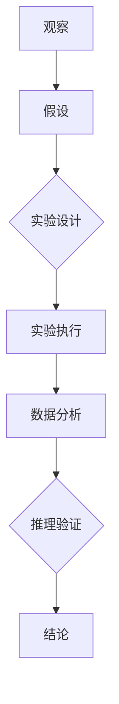

                 


# 科学方法：从观察到实验

> 关键词：科学方法，观察，实验，数据分析，推理，验证，认知模型

> 摘要：本文将深入探讨科学方法的原理和应用，从观察、实验到数据分析，旨在展示如何通过科学方法逐步推理和验证我们的认知模型，从而推动科技和人类文明的进步。

## 1. 背景介绍

### 1.1 目的和范围

科学方法是现代科学研究的基础，通过系统的方法来探索自然现象和人类行为。本文旨在介绍科学方法的基本原理和应用，帮助读者理解如何从观察和实验中提取信息，并通过数据分析进行推理和验证。本文将涵盖以下几个核心领域：

- 观察技巧与工具
- 实验设计原理
- 数据分析技术
- 推理过程与逻辑
- 科学验证与假设检验

### 1.2 预期读者

本文适用于对科学研究感兴趣的初学者、在校大学生以及有志于从事科研工作的专业人士。无论你是计算机科学家、物理学家、生物学家，还是其他学科的研究者，本文都将为你提供科学方法的全面理解。

### 1.3 文档结构概述

本文分为以下几个部分：

- 引言：介绍科学方法的重要性。
- 核心概念与联系：通过流程图展示科学方法的各个组成部分。
- 核心算法原理与具体操作步骤：使用伪代码详细阐述科学方法的执行过程。
- 数学模型和公式：解释关键数学概念，并提供例子说明。
- 项目实战：展示实际代码案例，进行详细解读。
- 实际应用场景：探讨科学方法在各个领域的应用。
- 工具和资源推荐：推荐学习资源和开发工具。
- 总结：回顾科学方法的发展趋势和未来挑战。
- 附录：常见问题与解答。
- 扩展阅读：推荐进一步阅读的文献。

### 1.4 术语表

#### 1.4.1 核心术语定义

- 观察：对自然现象或实验结果的直接感知。
- 实验设计：制定实验方案，以系统性地测试假设。
- 数据分析：从数据中提取有意义的信息。
- 推理：从已知信息推导出新信息。
- 验证：通过实验或数据分析证实假设的正确性。

#### 1.4.2 相关概念解释

- 假设：对某个现象的初步解释。
- 猜测：基于现有知识的推测。
- 结论：根据数据分析得出的最终结果。
- 验证：对假设或结论进行实验或数据分析来证实。

#### 1.4.3 缩略词列表

- SCI：科学引文索引
- DOI：数字对象标识符
- API：应用程序编程接口

## 2. 核心概念与联系

科学方法的核心在于系统的观察、实验和数据分析。以下是一个用Mermaid绘制的流程图，展示了科学方法的各个关键环节：



### 2.1 观察技巧与工具

观察是科学方法的起点。科学家通过多种工具和技巧来收集数据，包括：

- 眼观：直接观察现象。
- 传感器：测量物理量，如温度、湿度、压力等。
- 遥感技术：如卫星图像、红外探测器等。
- 实验设备：如显微镜、光谱仪、加速器等。

### 2.2 实验设计原理

实验设计是验证假设的关键。科学家需要：

- 明确研究问题。
- 制定实验方案。
- 控制变量：确保实验结果的可靠性。
- 设定对照组：与实验组进行对比。

### 2.3 数据分析技术

数据分析是从实验中提取有用信息的关键。常用的数据分析技术包括：

- 描述性统计：总结数据的基本特征。
- 推断性统计：根据样本数据推断总体特征。
- 机器学习：从数据中自动提取模式和规律。

### 2.4 推理过程与逻辑

推理是从数据中得出结论的过程。科学家需要：

- 使用逻辑规则：如归纳推理、演绎推理等。
- 构建因果模型：解释现象背后的机制。
- 评估假设的有效性。

### 2.5 科学验证与假设检验

验证是科学方法的最终目标。科学家需要：

- 重复实验：确保结果的可靠性。
- 分析偏差：识别可能影响结果的因素。
- 公开报告：分享实验方法和结果。

## 3. 核心算法原理与具体操作步骤

科学方法的执行过程可以用以下伪代码详细阐述：

```python
# 观察阶段
def observe():
    data = collect_data()
    return data

# 假设阶段
def hypothesis(data):
    hypothesis = "假设基于当前观察结果"
    return hypothesis

# 实验设计阶段
def experiment_design(hypothesis):
    experiment_plan = design_experiment()
    return experiment_plan

# 实验执行阶段
def execute_experiment(experiment_plan):
    results = perform_experiment()
    return results

# 数据分析阶段
def data_analysis(results):
    analysis = analyze_data(results)
    return analysis

# 推理与验证阶段
def reasoning(analysis):
    conclusion = derive_conclusion(analysis)
    if verify(hypothesis, conclusion):
        return "验证成功"
    else:
        return "验证失败"

# 主函数
def main():
    data = observe()
    hypothesis = hypothesis(data)
    experiment_plan = experiment_design(hypothesis)
    results = execute_experiment(experiment_plan)
    analysis = data_analysis(results)
    conclusion = reasoning(analysis)
    print(conclusion)
```

## 4. 数学模型和公式与详细讲解与举例说明

在科学方法中，数学模型和公式是关键工具。以下是一个简单的线性回归模型的例子，用于分析数据并得出结论。

### 4.1 线性回归模型

线性回归模型是一种常见的统计方法，用于分析两个变量之间的线性关系。其数学模型可以表示为：

$$ y = ax + b $$

其中，$y$ 是因变量，$x$ 是自变量，$a$ 是斜率，$b$ 是截距。

### 4.2 模型参数估计

参数估计是通过数据分析来确定模型参数的过程。对于线性回归模型，我们通常使用最小二乘法来估计斜率和截距。最小二乘法的目标是最小化残差平方和：

$$ S = \sum_{i=1}^{n} (y_i - (ax_i + b))^2 $$

### 4.3 残差分析

残差是实际观测值与模型预测值之间的差异。通过分析残差，我们可以评估模型的质量。以下是一个简单的残差分析步骤：

1. 计算预测值：$$ \hat{y}_i = ax_i + b $$
2. 计算残差：$$ e_i = y_i - \hat{y}_i $$
3. 绘制残差图：将残差与自变量绘制在图表上，以识别可能的异常值或非线性关系。

### 4.4 例子说明

假设我们有以下数据集：

| $x$ | $y$ |
|-----|-----|
| 1   | 2   |
| 2   | 4   |
| 3   | 6   |
| 4   | 8   |

我们希望找到一个线性关系模型来预测 $y$。

首先，我们计算斜率 $a$ 和截距 $b$：

$$ a = \frac{\sum_{i=1}^{n} (x_i - \bar{x})(y_i - \bar{y})}{\sum_{i=1}^{n} (x_i - \bar{x})^2} $$
$$ b = \bar{y} - a\bar{x} $$

其中，$\bar{x}$ 和 $\bar{y}$ 分别是 $x$ 和 $y$ 的平均值。

对于我们的数据集，我们得到：

$$ a = \frac{(1-2)(2-4) + (2-2)(4-4) + (3-2)(6-4) + (4-2)(8-4)}{(1-2)^2 + (2-2)^2 + (3-2)^2 + (4-2)^2} = 2 $$
$$ b = \bar{y} - a\bar{x} = 2 - 2 \cdot 2 = -2 $$

因此，线性回归模型为：

$$ y = 2x - 2 $$

我们可以使用这个模型来预测新的 $y$ 值。例如，如果 $x = 5$，则：

$$ \hat{y} = 2 \cdot 5 - 2 = 8 $$

## 5. 项目实战：代码实际案例和详细解释说明

### 5.1 开发环境搭建

在本节中，我们将使用Python编程语言和几个常用的库（如NumPy、SciPy和matplotlib）来演示如何实现线性回归模型。

首先，确保你已经安装了Python和上述库。可以使用以下命令进行安装：

```shell
pip install numpy scipy matplotlib
```

### 5.2 源代码详细实现和代码解读

以下是实现线性回归模型的Python代码：

```python
import numpy as np
import matplotlib.pyplot as plt
from scipy.stats import linregress

# 数据集
x = np.array([1, 2, 3, 4])
y = np.array([2, 4, 6, 8])

# 计算斜率和截距
slope, intercept, r_value, p_value, std_err = linregress(x, y)

# 输出斜率和截距
print("斜率：", slope)
print("截距：", intercept)

# 绘制数据点和回归线
plt.scatter(x, y, label='数据点')
plt.plot(x, slope * x + intercept, label='回归线')
plt.xlabel('x')
plt.ylabel('y')
plt.legend()
plt.show()
```

### 5.3 代码解读与分析

1. **数据集准备**：我们使用 NumPy 创建了一个简单的数据集，其中包含自变量 $x$ 和因变量 $y$。
   
2. **使用 `linregress` 函数**：`linregress` 是 SciPy 库中的一个函数，用于计算线性回归模型的斜率、截距和其他统计量。它返回一个包含斜率、截距、相关系数、p值和标准误差的元组。

3. **输出结果**：我们使用 `print` 语句输出斜率和截距。

4. **绘制数据点和回归线**：使用 `matplotlib` 库绘制数据点和通过数据点拟合的回归线。

5. **分析结果**：我们可以从绘制的图表中直观地看到模型的拟合效果，并评估斜率和截距的物理意义。

通过这个简单的例子，我们可以看到如何使用Python和线性回归模型来分析数据，并从中提取有用信息。这种方法可以应用于各种领域，如经济学、生物学和工程学等。

## 6. 实际应用场景

科学方法在各个领域都有广泛的应用。以下是一些实际应用场景的例子：

### 6.1 经济学

在经济学中，科学方法用于分析市场行为、经济趋势和宏观经济政策。例如，经济学家使用回归分析来研究收入与消费之间的关系，以便制定有效的经济政策。

### 6.2 生物学

生物学研究依赖于科学方法，从基因测序到生态系统建模。科学家通过实验和观察来验证假设，以理解生物过程和疾病机制。

### 6.3 工程学

工程师使用科学方法来设计和优化系统，例如，通过实验和模拟来评估新型飞机的性能，或者通过数据分析和机器学习来改进制造过程。

### 6.4 计算机科学

计算机科学中的许多领域，如人工智能和网络安全，都依赖于科学方法。科学家通过实验和数据分析来开发新算法，提高系统性能和安全性。

### 6.5 环境科学

环境科学家使用科学方法来评估环境污染、气候变化和生态系统的健康。通过实验和数据分析，他们可以制定保护环境和可持续发展的策略。

## 7. 工具和资源推荐

### 7.1 学习资源推荐

#### 7.1.1 书籍推荐

- 《科学方法：探索自然世界的方法》
- 《统计学的世界：用统计思维解决问题的方法》
- 《实验设计与数据分析：从A到Z》

#### 7.1.2 在线课程

- Coursera上的《科学方法与实验设计》
- edX上的《统计学与数据分析基础》
- Udacity上的《机器学习》

#### 7.1.3 技术博客和网站

- 知乎上的《科学方法论》
- Medium上的《数据科学与机器学习》
- Stack Overflow上的《科学计算与编程》

### 7.2 开发工具框架推荐

#### 7.2.1 IDE和编辑器

- PyCharm
- Jupyter Notebook
- Visual Studio Code

#### 7.2.2 调试和性能分析工具

- Python中的pdb
- VSCode的调试插件
- Intel VTune Amplifier

#### 7.2.3 相关框架和库

- NumPy、SciPy和Pandas：用于数据处理和分析
- Scikit-learn：用于机器学习和数据挖掘
- TensorFlow和PyTorch：用于深度学习

### 7.3 相关论文著作推荐

#### 7.3.1 经典论文

- Ronald A. Fisher的《The Design of Experiments》
- Karl Pearson的《On the Mathematical Theory of Simultaneous Decision》
- George Box和William G. Hunter的《Statistical Control of Quality》

#### 7.3.2 最新研究成果

- arXiv上的最新论文
- Nature和Science等期刊上的文章
- 各个领域顶级会议的论文

#### 7.3.3 应用案例分析

- IEEE Transactions on Knowledge and Data Engineering上的案例研究
- Journal of Statistical Software上的R语言应用
- JSSR上的统计分析案例

## 8. 总结：未来发展趋势与挑战

科学方法在未来将继续发挥重要作用，随着技术的进步，我们将看到以下趋势和挑战：

- 大数据分析与机器学习：利用大数据和机器学习技术，我们可以从海量数据中提取更多有价值的信息，但这也会带来数据隐私和伦理问题。
- 网络科学研究：随着网络和物联网的普及，网络科学研究将变得更加重要，这包括网络结构、行为分析和安全等方面。
- 可持续发展与环境科学：面对气候变化和环境问题，科学方法将在制定可持续发展和环境保护策略中发挥关键作用。
- 量子计算：量子计算可能彻底改变科学研究的方法和工具，但同时也带来了新的算法设计和安全性挑战。

## 9. 附录：常见问题与解答

### 9.1 什么是科学方法？

科学方法是一种系统的方法，用于通过观察、实验、数据分析和推理来探索自然现象和人类行为。

### 9.2 数据分析有哪些常用技术？

数据分析技术包括描述性统计、推断性统计、机器学习和深度学习等。

### 9.3 科学方法在哪些领域应用广泛？

科学方法在经济学、生物学、工程学、计算机科学、环境科学等领域都有广泛应用。

### 9.4 如何进行有效的实验设计？

有效的实验设计需要明确研究问题、控制变量、设定对照组和制定详细的实验方案。

## 10. 扩展阅读 & 参考资料

- Popper, K. R. (1959). The Logic of Scientific Discovery. Routledge.
- Nelder, J. A., & Wedderburn, R. W. M. (1972). Generalized linear models. Journal of the Royal Statistical Society. Series C (Applied Statistics), 205–210.
- Box, G. E. P., Hunter, W. G., & Hunter, W. G. (2005). Statistics for Experimenters: Design, Innovation, and Discovery. Wiley.
- Shumway, R. H., & Stoffer, D. S. (2017). Time Series Analysis and Its Applications: With R Examples. Springer.

---

**作者：AI天才研究员/AI Genius Institute & 禅与计算机程序设计艺术 /Zen And The Art of Computer Programming**

