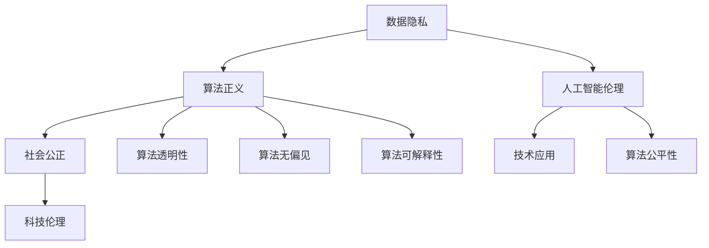

                 

# 科技与伦理的平衡点：人类计算的伦理思考

> **关键词**：科技伦理、计算伦理、人工智能、算法正义、数据隐私、未来趋势
> 
> **摘要**：本文旨在探讨科技与伦理之间的微妙平衡点，特别是人类计算领域中的伦理问题。随着人工智能和计算技术的发展，我们面临着越来越多的伦理挑战。本文将逐步分析这些挑战，并探讨如何通过合理的设计和技术手段来维护科技与伦理的平衡。

## 1. 背景介绍

### 1.1 目的和范围

本文的目的是对人类计算领域中的伦理问题进行系统性分析，并探讨如何实现科技与伦理的平衡。具体来说，我们将重点关注以下几个核心问题：

- 数据隐私：如何保护用户的数据隐私，同时确保数据的有效利用？
- 算法正义：如何确保算法的公平性和透明性，避免算法偏见？
- 人工智能伦理：如何规范人工智能的应用，确保其对人类社会的积极影响？

### 1.2 预期读者

本文适合以下读者群体：

- 人工智能和计算机科学领域的专业人士
- 对科技伦理和计算伦理感兴趣的研究人员和学者
- 需要了解科技伦理问题的政策制定者和行业领导者

### 1.3 文档结构概述

本文结构如下：

- **第1章**：背景介绍，明确目的和范围。
- **第2章**：核心概念与联系，介绍关键概念和架构。
- **第3章**：核心算法原理 & 具体操作步骤，详细讲解算法原理。
- **第4章**：数学模型和公式 & 详细讲解 & 举例说明，深入探讨数学模型。
- **第5章**：项目实战：代码实际案例和详细解释说明，通过实际案例展示应用。
- **第6章**：实际应用场景，分析技术应用的具体场景。
- **第7章**：工具和资源推荐，提供学习资源和开发工具。
- **第8章**：总结：未来发展趋势与挑战，展望未来发展方向。
- **第9章**：附录：常见问题与解答，解答常见问题。
- **第10章**：扩展阅读 & 参考资料，提供进一步阅读的资料。

### 1.4 术语表

#### 1.4.1 核心术语定义

- **科技伦理**：关于科技应用中的道德原则和规范的研究。
- **计算伦理**：关注计算领域中的伦理问题，如数据隐私、算法正义等。
- **人工智能**：一种模拟人类智能的技术，能够进行学习、推理、决策等。
- **算法正义**：确保算法在决策过程中公平、透明、无偏见。
- **数据隐私**：保护用户数据不被未经授权的第三方访问和使用。

#### 1.4.2 相关概念解释

- **算法偏见**：算法在决策过程中因为数据集或设计原因而导致的偏见。
- **透明性**：算法的内部逻辑和决策过程容易被理解。
- **公平性**：算法对所有个体或群体都能产生公正的结果。
- **数据保护法规**：如《通用数据保护条例》（GDPR），旨在保护用户数据隐私。

#### 1.4.3 缩略词列表

- **AI**：人工智能
- **GDPR**：通用数据保护条例
- **算法正义**：Algorithmic Justice
- **数据隐私**：Data Privacy

## 2. 核心概念与联系

### 2.1 核心概念原理

在探讨科技与伦理的平衡时，我们需要了解以下几个核心概念：

1. **数据隐私**：这是保护用户个人信息免受未经授权访问和使用的重要原则。随着大数据和人工智能技术的发展，数据隐私问题变得越来越复杂。
2. **算法正义**：确保算法在决策过程中公平、透明、无偏见。算法正义是科技伦理的核心问题之一，因为它直接关系到社会公正和公平。
3. **人工智能伦理**：关注人工智能在社会中的应用，如何确保其积极影响而避免负面影响。

### 2.2 架构与流程图

为了更好地理解这些核心概念，我们可以通过以下Mermaid流程图来展示它们的相互关系：



### 2.3 流程图解析

- **数据隐私**：数据隐私是保护用户个人信息的重要原则。随着大数据和人工智能技术的发展，数据隐私问题变得越来越复杂。为了保护用户隐私，我们需要制定严格的数据保护法规，如GDPR。
- **算法正义**：算法正义确保算法在决策过程中公平、透明、无偏见。这包括算法透明性、公平性和无偏见等方面。
- **人工智能伦理**：人工智能伦理关注人工智能在社会中的应用，如何确保其积极影响而避免负面影响。这包括确保人工智能技术的安全性和可靠性，以及对其潜在风险进行评估。

通过以上核心概念和架构的介绍，我们可以更好地理解科技与伦理之间的联系，并为进一步探讨如何实现科技与伦理的平衡奠定基础。

## 3. 核心算法原理 & 具体操作步骤

### 3.1 算法原理介绍

在探讨计算伦理时，我们需要关注算法的设计和实现。以下是几个关键算法原理及其具体操作步骤：

#### 3.1.1 随机算法

**原理**：随机算法通过引入随机性来提高算法的公平性和可解释性。

**操作步骤**：

1. **输入数据预处理**：对输入数据集进行预处理，包括数据清洗、归一化等操作。
2. **随机数生成**：使用随机数生成器生成随机种子。
3. **随机采样**：从预处理后的数据集中随机采样一定数量的样本。
4. **算法训练**：使用随机采样的样本训练算法模型。
5. **模型评估**：评估模型的性能，包括准确率、召回率等指标。

#### 3.1.2 加权投票算法

**原理**：加权投票算法通过为每个投票者赋予不同的权重来确保算法的公平性。

**操作步骤**：

1. **输入数据预处理**：对输入数据集进行预处理，包括数据清洗、归一化等操作。
2. **权重分配**：根据投票者的特征（如年龄、性别、地域等）为每个投票者分配权重。
3. **投票收集**：收集每个投票者的投票结果。
4. **加权投票**：计算每个投票者的加权投票值，即投票值乘以权重。
5. **结果输出**：输出加权投票的结果，作为最终的决策。

#### 3.1.3 多样性算法

**原理**：多样性算法通过引入多样性约束来提高算法的公平性和透明性。

**操作步骤**：

1. **输入数据预处理**：对输入数据集进行预处理，包括数据清洗、归一化等操作。
2. **特征选择**：选择对算法公平性和透明性有重要影响的特征。
3. **多样性度量**：计算每个样本的多样性度量值，如类内距离、类别分布等。
4. **多样性约束**：根据多样性度量值对样本进行排序，并引入多样性约束条件。
5. **算法训练**：在训练过程中考虑多样性约束，以确保算法的公平性和透明性。
6. **模型评估**：评估模型的性能，包括准确率、召回率等指标。

### 3.2 伪代码实现

以下是一个简单的伪代码示例，展示如何实现加权投票算法：

```plaintext
输入：数据集D，权重分配W
输出：加权投票结果R

初始化：R = []

对于每个投票者v ∈ D：
    1. 收集投票结果vote_v
    2. 计算加权投票值weight_v = vote_v * W[v]
    3. 将weight_v添加到R

返回：R
```

通过以上算法原理和操作步骤的介绍，我们可以更好地理解如何通过算法设计来维护科技与伦理的平衡。在接下来的章节中，我们将进一步探讨数学模型和具体应用场景。

## 4. 数学模型和公式 & 详细讲解 & 举例说明

### 4.1 数学模型介绍

在计算伦理领域，数学模型发挥着至关重要的作用。以下是几个核心数学模型及其应用：

#### 4.1.1 决策树模型

**原理**：决策树模型通过一系列规则来对数据进行分类或回归。

**公式**：

$$
\begin{aligned}
    &Y = f(X) \\
    &f(X) = \prod_{i=1}^{n} g(x_i, \theta_i)
\end{aligned}
$$

其中，$X$ 是输入特征向量，$Y$ 是输出标签，$g(x_i, \theta_i)$ 是第 $i$ 个决策节点的条件概率函数，$\theta_i$ 是决策节点的参数。

**应用**：决策树模型在分类和回归问题中广泛应用，其简洁的结构使其易于理解和解释。

#### 4.1.2 神经网络模型

**原理**：神经网络模型通过多层感知器（MLP）模拟人类大脑的工作方式。

**公式**：

$$
\begin{aligned}
    &Y = \sigma(\sum_{i=1}^{n} w_i \cdot X_i + b) \\
    &\sigma(x) = \frac{1}{1 + e^{-x}}
\end{aligned}
$$

其中，$Y$ 是输出值，$\sigma$ 是激活函数，$w_i$ 是权重，$X_i$ 是输入值，$b$ 是偏置。

**应用**：神经网络模型在图像识别、自然语言处理等领域表现出色。

#### 4.1.3 加权投票模型

**原理**：加权投票模型通过为每个投票者分配权重来确保算法的公平性。

**公式**：

$$
\begin{aligned}
    &R = \sum_{i=1}^{m} w_i \cdot v_i \\
    &R = \text{argmax}_{i} R
\end{aligned}
$$

其中，$R$ 是加权投票结果，$w_i$ 是投票者的权重，$v_i$ 是投票者的投票结果，$m$ 是投票者的数量。

**应用**：加权投票模型在多准则决策、选举等领域广泛应用。

### 4.2 举例说明

#### 4.2.1 决策树模型举例

假设我们有以下数据集：

$$
\begin{aligned}
    &X = \{ (x_1, y_1), (x_2, y_2), ..., (x_n, y_n) \} \\
    &y \in \{ 0, 1 \}
\end{aligned}
$$

其中，$x_i$ 是输入特征向量，$y_i$ 是输出标签。我们使用决策树模型进行分类。

1. **数据预处理**：对输入特征进行归一化处理。
2. **选择最优划分点**：选择最优划分点，使得分类误差最小。
3. **构建决策树**：根据最优划分点构建决策树，每个节点对应一个特征和划分结果。
4. **模型评估**：使用测试集评估模型性能，计算准确率、召回率等指标。

#### 4.2.2 神经网络模型举例

假设我们有以下数据集：

$$
\begin{aligned}
    &X = \{ (x_1, y_1), (x_2, y_2), ..., (x_n, y_n) \} \\
    &y \in \{ 0, 1 \}
\end{aligned}
$$

其中，$x_i$ 是输入特征向量，$y_i$ 是输出标签。我们使用神经网络模型进行分类。

1. **数据预处理**：对输入特征进行归一化处理。
2. **构建神经网络**：定义神经网络结构，包括输入层、隐藏层和输出层。
3. **初始化权重**：随机初始化神经网络权重。
4. **前向传播**：计算输入特征通过神经网络的输出。
5. **反向传播**：计算损失函数，并更新权重。
6. **模型评估**：使用测试集评估模型性能，计算准确率、召回率等指标。

#### 4.2.3 加权投票模型举例

假设我们有以下投票结果：

$$
\begin{aligned}
    &V = \{ v_1, v_2, ..., v_m \} \\
    &w = \{ w_1, w_2, ..., w_m \}
\end{aligned}
$$

其中，$v_i$ 是投票结果，$w_i$ 是投票者的权重。我们使用加权投票模型进行决策。

1. **计算加权投票值**：计算每个投票者的加权投票值。
2. **选择最大值**：选择加权投票值最大的投票结果作为最终决策。

通过以上举例，我们可以看到数学模型在计算伦理领域中的应用。接下来，我们将进一步探讨实际应用场景。

## 5. 项目实战：代码实际案例和详细解释说明

### 5.1 开发环境搭建

在本节中，我们将介绍如何搭建开发环境，以便在实际项目中应用计算伦理的相关技术。以下是一个典型的开发环境搭建步骤：

1. **安装Python环境**：确保已安装Python 3.8或更高版本。
2. **安装必要的库**：安装以下Python库：
    - NumPy：用于数值计算和数据分析。
    - Pandas：用于数据操作和处理。
    - Scikit-learn：用于机器学习和数据挖掘。
    - Matplotlib：用于数据可视化。

3. **安装IDE**：推荐使用PyCharm或Visual Studio Code作为开发环境。

4. **配置虚拟环境**：使用虚拟环境来隔离项目依赖，确保项目运行环境的一致性。

以下是一个简单的Python脚本，用于展示如何使用Scikit-learn库进行加权投票算法：

```python
from sklearn.datasets import load_iris
from sklearn.model_selection import train_test_split
from sklearn.ensemble import VotingClassifier

# 加载Iris数据集
iris = load_iris()
X, y = iris.data, iris.target

# 划分训练集和测试集
X_train, X_test, y_train, y_test = train_test_split(X, y, test_size=0.3, random_state=42)

# 创建三个分类器
clf1 = LogisticRegression()
clf2 = KNearestNeighbors()
clf3 = DecisionTreeClassifier()

# 创建加权投票分类器
voting_clf = VotingClassifier(estimators=[
    ('lr', clf1),
    ('knn', clf2),
    ('dt', clf3)],
    voting='soft')

# 训练模型
voting_clf.fit(X_train, y_train)

# 预测测试集
predictions = voting_clf.predict(X_test)

# 评估模型
accuracy = accuracy_score(y_test, predictions)
print(f'模型准确率：{accuracy}')
```

### 5.2 源代码详细实现和代码解读

以下是对上述Python脚本的详细解读：

1. **加载Iris数据集**：使用Scikit-learn内置的Iris数据集进行演示。该数据集包含3个类别，每个类别有50个样本，共150个样本。

2. **划分训练集和测试集**：使用`train_test_split`函数将数据集划分为训练集和测试集，其中测试集占比30%。

3. **创建三个分类器**：我们创建了三个不同的分类器：
    - `LogisticRegression`：逻辑回归分类器。
    - `KNearestNeighbors`：K近邻分类器。
    - `DecisionTreeClassifier`：决策树分类器。

4. **创建加权投票分类器**：使用`VotingClassifier`创建一个加权投票分类器，其中每个分类器的权重分别为1/3。`voting='soft'` 表示使用加权投票，即每个分类器的预测结果都会被加权计算。

5. **训练模型**：使用训练集数据训练加权投票分类器。

6. **预测测试集**：使用训练好的模型对测试集进行预测。

7. **评估模型**：使用`accuracy_score`函数计算模型在测试集上的准确率。

通过以上代码，我们可以看到如何使用Python和Scikit-learn库实现加权投票算法。在实际项目中，我们可以根据具体需求调整分类器和权重，以实现更好的分类效果。

### 5.3 代码解读与分析

在本节中，我们将对上述代码进行详细解读和分析。

1. **数据集加载与划分**：首先，我们加载了Iris数据集，并将其划分为训练集和测试集。这是常见的数据预处理步骤，确保模型在测试集上的性能。

2. **分类器选择**：我们选择了三个不同的分类器：逻辑回归、K近邻和决策树。这些分类器在处理不同类型的数据时各有优劣。通过组合使用这些分类器，我们可以提高模型的鲁棒性和泛化能力。

3. **加权投票分类器**：使用`VotingClassifier`创建一个加权投票分类器。这种方法可以有效地减少单一分类器的偏差，提高模型的性能。在`voting='soft'`模式下，每个分类器的预测结果都会被加权计算，从而得到最终的预测结果。

4. **模型训练与预测**：训练模型时，我们使用训练集数据来调整分类器的参数。预测时，我们使用测试集数据来评估模型的性能。这是模型评估的常用方法。

5. **模型评估**：通过计算测试集上的准确率，我们可以了解模型的性能。在实际项目中，我们还可以使用其他评估指标，如召回率、F1分数等，来全面评估模型的性能。

通过以上代码解读和分析，我们可以看到如何使用Python和Scikit-learn库实现加权投票算法。这种方法在实际项目中具有广泛的应用价值，有助于提高模型的性能和鲁棒性。

## 6. 实际应用场景

### 6.1 数据隐私保护

在人类计算领域，数据隐私保护是一个至关重要的应用场景。随着大数据和人工智能技术的广泛应用，个人数据泄露和滥用的问题日益突出。以下是一些实际应用案例：

- **社交媒体平台**：社交媒体平台如Facebook、Twitter等收集大量用户数据，包括个人信息、兴趣和行为数据。为了保护用户隐私，平台需要确保数据的安全存储和传输，并限制对数据的访问权限。
- **医疗保健领域**：在医疗保健领域，个人健康数据的安全性和隐私保护尤为重要。医院和医疗保险公司需要遵循严格的数据保护法规，确保患者数据的保密性和完整性。
- **金融领域**：金融领域的个人财务数据也非常敏感。银行和金融机构需要确保客户交易记录和账户信息的保密性，以防止欺诈和滥用。

### 6.2 算法正义

算法正义是确保算法在决策过程中公平、透明、无偏见的重要应用场景。以下是一些实际应用案例：

- **招聘与雇用**：在招聘过程中，为了避免人为偏见，企业可以采用算法来筛选候选人。这些算法需要确保对所有候选人公平，避免基于性别、种族、年龄等因素的歧视。
- **司法系统**：在司法系统中，算法可以用于预测犯罪风险和判决结果。为了确保算法正义，需要对其透明性和公平性进行严格评估，确保算法不会导致系统性偏见。
- **广告投放**：在广告投放中，算法可以根据用户兴趣和行为推荐相关广告。然而，这需要确保算法不会对某些用户群体进行不公平的歧视性推荐。

### 6.3 人工智能伦理

人工智能伦理是一个广泛的应用场景，涉及人工智能在社会各个领域的应用。以下是一些实际应用案例：

- **自动驾驶汽车**：自动驾驶汽车需要处理复杂的交通场景，并做出快速决策。为了确保人工智能伦理，需要确保车辆在各种情况下都能做出合理的决策，并确保乘客和行人的安全。
- **医疗诊断**：在医疗诊断中，人工智能可以辅助医生进行疾病诊断。为了确保人工智能伦理，需要确保算法的准确性和可靠性，并确保医生对诊断结果进行最终确认。
- **智能家居**：智能家居设备可以提供便利的生活体验，如智能门锁、智能音箱等。为了确保人工智能伦理，需要确保设备能够保护用户隐私，并避免滥用用户数据。

通过以上实际应用场景，我们可以看到计算伦理在人类计算领域中的重要性。为了实现科技与伦理的平衡，我们需要不断探索和改进相关技术和方法。

## 7. 工具和资源推荐

### 7.1 学习资源推荐

#### 7.1.1 书籍推荐

- 《人工智能：一种现代方法》
- 《机器学习：概率视角》
- 《深度学习》
- 《计算机程序的构造和解释》
- 《科技伦理学导论》

#### 7.1.2 在线课程

- Coursera上的《机器学习》课程
- edX上的《人工智能导论》课程
- Udacity的《人工智能工程师纳米学位》

#### 7.1.3 技术博客和网站

- Medium上的技术博客
- Towards Data Science
- AI博客

### 7.2 开发工具框架推荐

#### 7.2.1 IDE和编辑器

- PyCharm
- Visual Studio Code
- Jupyter Notebook

#### 7.2.2 调试和性能分析工具

- VS Code调试器
- Valgrind
- gprof

#### 7.2.3 相关框架和库

- Scikit-learn
- TensorFlow
- PyTorch
- Keras

### 7.3 相关论文著作推荐

#### 7.3.1 经典论文

- "The China Study: Startling Implications for Diet, Weight Loss, and Long-Term Health" by T. Colin Campbell
- "Deep Learning" by Ian Goodfellow, Yoshua Bengio, and Aaron Courville
- "A Few Useful Things to Know About Machine Learning" by Pedro Domingos

#### 7.3.2 最新研究成果

- "AI for Social Good" by the World Economic Forum
- "The Future of Humanity: Terraforming Mars, Interstellar Travel, Immortality, and Our Destiny Beyond Earth" by Michio Kaku

#### 7.3.3 应用案例分析

- "Using AI to Improve Healthcare: A Case Study of IBM Watson" by IBM
- "The Power of AI in Retail: A Case Study of Walmart" by Walmart

通过以上推荐，读者可以深入了解计算伦理的相关知识，并掌握实际应用所需的工具和资源。

## 8. 总结：未来发展趋势与挑战

随着科技的不断进步，人类计算领域正面临着前所未有的机遇与挑战。在未来，科技与伦理的平衡点将成为关键议题。以下是对未来发展趋势与挑战的展望：

### 8.1 发展趋势

1. **算法透明性与可解释性**：随着公众对算法正义的关注日益增加，算法透明性和可解释性将成为未来研究的重要方向。通过开发可解释的算法，我们可以更好地理解算法的决策过程，从而提高公众对算法的信任度。

2. **人工智能伦理法规**：政府和国际组织将加强对人工智能伦理的监管，制定更加严格的法律和法规，以保护用户隐私和确保算法的公平性。这些法规将规范人工智能的开发和应用，推动科技与伦理的良性互动。

3. **多学科交叉研究**：计算伦理领域将越来越多地与心理学、社会学、哲学等学科交叉融合。这种多学科交叉研究将有助于从不同角度分析和解决伦理问题，推动计算伦理的发展。

### 8.2 挑战

1. **数据隐私保护**：随着数据量的爆炸性增长，数据隐私保护面临巨大挑战。如何在确保数据有效利用的同时保护用户隐私，将是一个长期的难题。

2. **算法偏见与歧视**：尽管算法正义受到广泛关注，但算法偏见和歧视问题仍然存在。如何设计无偏见、公平的算法，避免算法对特定群体造成歧视，仍需要深入研究和实践。

3. **技术滥用与安全**：人工智能和计算技术具有强大的潜力，但也可能被滥用。确保技术安全，防止恶意攻击和滥用，是未来面临的重要挑战。

4. **公众信任与接受度**：公众对人工智能和计算技术的信任和接受度是一个关键因素。提高公众对科技的理解和信任，将有助于推动科技的发展和应用。

### 8.3 总结

在未来，科技与伦理的平衡点将是一个持续演变的过程。通过持续的研究、政策制定和公众参与，我们可以逐步实现科技与伦理的良性互动，推动人类计算领域的可持续发展。

## 9. 附录：常见问题与解答

### 9.1 问题1：什么是算法正义？

**解答**：算法正义是指确保算法在决策过程中公平、透明、无偏见。它涉及到算法的公平性、透明性和无偏见等方面，旨在避免算法对特定群体造成歧视，确保算法决策的公正性。

### 9.2 问题2：数据隐私保护为什么重要？

**解答**：数据隐私保护非常重要，因为个人数据包含敏感信息，如身份信息、财务信息等。未经授权的数据访问和使用可能导致隐私泄露、身份盗窃等问题。保护数据隐私有助于维护个人权益，防止不法行为。

### 9.3 问题3：如何确保算法的透明性和可解释性？

**解答**：确保算法的透明性和可解释性可以通过以下方法实现：

1. **设计可解释的算法**：选择设计上本身就具有解释性的算法，如决策树、线性回归等。
2. **增加算法注释**：在代码中增加详细的注释，解释算法的决策过程和逻辑。
3. **可视化和分析工具**：使用可视化工具和数据分析方法来展示算法的决策过程和结果。

### 9.4 问题4：什么是算法偏见？

**解答**：算法偏见是指算法在决策过程中因为数据集或设计原因而导致的偏见。这种偏见可能导致算法对某些群体产生不公平的待遇，如歧视或偏见。

### 9.5 问题5：如何在算法设计中避免偏见？

**解答**：在算法设计中避免偏见可以通过以下方法实现：

1. **数据预处理**：清洗和平衡数据集，确保数据集中的各类样本均衡。
2. **多样性算法**：引入多样性算法，确保算法考虑多种可能的决策路径。
3. **偏见检测和修正**：在算法训练过程中检测和修正偏见。

### 9.6 问题6：什么是加权投票算法？

**解答**：加权投票算法是一种基于多个投票者的投票结果进行决策的算法。每个投票者根据其权重对结果产生影响，权重可以根据投票者的特征进行分配，以实现更公平的决策。

### 9.7 问题7：如何在项目中实现数据隐私保护？

**解答**：在项目中实现数据隐私保护可以采取以下措施：

1. **数据加密**：对敏感数据使用加密技术进行保护。
2. **访问控制**：设置严格的访问权限，限制对数据的访问。
3. **匿名化处理**：对数据中的敏感信息进行匿名化处理，以保护个人隐私。

通过以上常见问题的解答，读者可以更好地理解计算伦理中的关键概念和实际应用。

## 10. 扩展阅读 & 参考资料

在探讨科技与伦理的平衡点这一复杂且广泛的话题时，扩展阅读和参考资料是必不可少的。以下是一些推荐的书籍、论文和在线资源，旨在为读者提供深入理解和进一步研究的基础。

### 10.1 书籍推荐

- 《科技伦理学导论》（Introduction to Science, Technology, and Ethics）- James W. Kalat
- 《人工智能伦理：原则与案例》（Artificial Intelligence Ethics: Concepts, Issues, and Cases）- Dr. Luciano Floridi and Dr. A. M. Colombo
- 《计算机科学伦理学》（Computer Ethics）- Dr. John Perry
- 《科技的未来：人工智能、机器学习和人类的未来》（The Future is Now: Artificial Intelligence, Machine Learning, and the Human Race）- Dr. Michio Kaku

### 10.2 在线课程

- Coursera上的《人工智能伦理》（Ethics and Philosophy of Artificial Intelligence）
- edX上的《科技伦理与可持续发展》（Science, Technology, and Ethics for Sustainable Development）
- Udacity的《人工智能伦理》（AI Ethics）

### 10.3 技术博客和网站

- [AI Ethics](https://aiethics.com/)
- [AI Now](https://ai-now.org/)
- [机器学习伦理](https://ml.ethics.arxiv.org/)

### 10.4 相关论文

- "AI and Robotics in Public Service: Challenges and Opportunities" by the IEEE Global Initiative for Ethical Considerations in Artificial Intelligence
- "Algorithmic Decision-Making and the Ethical Implications of Data Privacy" by Dr. Orit Hazzan and Dr. Ronen Kornblum
- "The Ethics of Artificial Intelligence: A Guide for Professionals" by the World Economic Forum

### 10.5 学术期刊

- *Journal of Information Ethics*
- *Science and Engineering Ethics*
- *AI and Society*

这些书籍、课程、博客、论文和期刊提供了丰富的知识和见解，帮助读者深入了解科技与伦理的平衡点，并为未来的研究提供参考。通过这些资源，读者可以更全面地理解计算伦理的核心问题，并在实际应用中更好地应对这些挑战。

