                 

# 科技发展：人类福祉的保障

> **关键词：科技发展、人类福祉、人工智能、可持续发展、科技创新**
> 
> **摘要：本文从科技发展的角度出发，探讨科技如何成为人类福祉的保障，解析科技创新在提高生活质量、推动社会进步和实现可持续发展等方面的关键作用，并结合实际案例，探讨未来科技发展的趋势与挑战。**

## 1. 背景介绍

### 1.1 目的和范围

本文旨在探讨科技发展对人类福祉的保障作用，分析科技创新在各个领域中的应用，以及其对社会和经济发展的推动力。具体而言，本文将重点讨论以下几个方面：

1. 科技发展的核心概念与联系。
2. 核心算法原理与具体操作步骤。
3. 数学模型与公式及详细讲解。
4. 项目实战：代码实际案例和详细解释说明。
5. 科技发展的实际应用场景。
6. 工具和资源推荐。

通过以上内容，旨在为读者提供一个全面、深入的科技发展对人类福祉保障的理解，从而激发更多人对科技创新的关注和探索。

### 1.2 预期读者

本文面向对科技发展感兴趣的技术爱好者、程序员、科研人员、企业管理者以及对可持续发展有关注的社会各界人士。无论你是刚接触技术的初学者，还是对科技发展有深入研究的专家，本文都将为你提供有价值的信息和启示。

### 1.3 文档结构概述

本文将按照以下结构进行展开：

1. **背景介绍**：介绍本文的目的、范围、预期读者和文档结构。
2. **核心概念与联系**：分析科技发展的核心概念，并使用Mermaid流程图展示相关架构。
3. **核心算法原理 & 具体操作步骤**：讲解科技发展的核心算法原理，并用伪代码详细阐述。
4. **数学模型和公式 & 详细讲解 & 举例说明**：介绍科技发展中的数学模型和公式，并进行详细讲解和举例。
5. **项目实战：代码实际案例和详细解释说明**：通过实际案例展示科技发展的应用，并对代码进行详细解释。
6. **实际应用场景**：探讨科技发展的实际应用场景。
7. **工具和资源推荐**：推荐学习资源、开发工具框架和相关论文著作。
8. **总结：未来发展趋势与挑战**：总结科技发展的趋势与挑战。
9. **附录：常见问题与解答**：提供常见问题及解答。
10. **扩展阅读 & 参考资料**：推荐相关阅读材料和参考资料。

### 1.4 术语表

#### 1.4.1 核心术语定义

- 科技发展：指在科学研究和技术创新的基础上，推动技术进步和社会发展的过程。
- 人工智能：指模拟人类智能的计算机系统，能够学习和适应新的环境，进行感知、推理、决策等任务。
- 可持续发展：指在满足当前需求的同时，不损害后代满足其需求的能力，实现经济、社会、环境三者协调发展。
- 科技创新：指通过科学研究和技术创新，推动技术进步和产业升级的过程。

#### 1.4.2 相关概念解释

- 互联网：一种连接全球计算机和设备的网络，实现信息的快速传输和共享。
- 数据科学：一门跨学科领域，结合数学、统计学、计算机科学等方法，分析和解释复杂数据。
- 大数据：指规模庞大、种类繁多的数据，需要采用特定的技术进行处理和分析。

#### 1.4.3 缩略词列表

- AI：人工智能
- IoT：物联网
- VR：虚拟现实
- AR：增强现实
- ML：机器学习
- IoT：物联网

## 2. 核心概念与联系

在探讨科技发展对人类福祉的保障作用之前，我们需要了解一些核心概念和它们之间的联系。以下是一个简单的Mermaid流程图，展示科技发展的核心概念及其相互关系：

```mermaid
graph TD
    A[科技创新] --> B[人工智能]
    A --> C[大数据]
    A --> D[互联网]
    B --> E[机器学习]
    B --> F[物联网]
    C --> G[数据分析]
    C --> H[数据挖掘]
    D --> I[云计算]
    D --> J[网络安全]
    E --> K[深度学习]
    E --> L[强化学习]
    F --> M[智能家居]
    F --> N[智能交通]
    G --> O[数据可视化]
    G --> P[数据存储]
    H --> Q[文本挖掘]
    H --> R[图像识别]
    I --> S[分布式计算]
    I --> T[虚拟化技术]
    J --> U[数据加密]
    J --> V[身份认证]
    K --> W[卷积神经网络]
    K --> X[循环神经网络]
    L --> Y[策略网络]
    L --> Z[值函数网络]
    M --> AA[智能音箱]
    M --> BB[智能照明]
    N --> CC[智能交通信号]
    N --> DD[自动驾驶]
    O --> EE[热图分析]
    O --> FF[交互式仪表板]
    P --> GG[数据库管理]
    P --> HH[数据仓库]
    Q --> II[情感分析]
    Q --> JJ[话题模型]
    R --> KK[人脸识别]
    R --> LL[目标检测]
    S --> MM[容器技术]
    S --> NN[微服务架构]
    T --> OO[容器编排]
    T --> PP[持续集成]
    U --> QQ[区块链]
    U --> RR[加密算法]
    V --> SS[生物识别]
    V --> TT[多因素认证]
    W --> UU[卷积层]
    W --> VV[池化层]
    X --> WW[循环层]
    X --> XX[门控层]
    Y --> YY[动作选择]
    Y --> ZZ[状态评估]
    AA --> AAA[语音助手]
    BB --> BBB[智能灯光控制]
    CC --> CCC[交通流量监控]
    DD --> DDD[无人驾驶汽车]
    EE --> EEE[用户行为分析]
    FF --> FFF[数据可视化应用]
    GG --> GGG[数据库管理工具]
    HH --> HHH[数据仓库解决方案]
    II --> III[社交媒体分析]
    JJ --> JJJ[内容推荐系统]
    KK --> KKK[人脸识别系统]
    LL --> LL[目标检测算法]
    MM --> MMM[容器编排工具]
    NN --> NNN[微服务框架]
    OO --> OOO[容器编排平台]
    PP --> PPP[持续集成工具]
    QQ --> QQQ[区块链应用]
    RR --> RRR[加密技术]
    SS --> SSS[生物识别技术]
    TT --> TTT[身份验证系统]
    UU --> UUU[卷积神经网络]
    VV --> VVV[池化神经网络]
    WW --> WWW[循环神经网络]
    XX --> XXX[门控循环神经网络]
    YY --> YYY[强化学习算法]
    ZZ --> ZZZ[价值评估模型]
```



### 3. 核心算法原理 & 具体操作步骤

科技发展的核心在于算法原理的不断创新和优化。以下将介绍一些关键算法原理，并用伪代码详细阐述其操作步骤：

#### 3.1. 人工智能算法原理

**算法名称**：神经网络

**伪代码**：

```
初始化：设定网络结构、学习率、损失函数

while 未达到最大迭代次数：
    for 每个神经元：
        前向传播：计算输入值和输出值
        计算损失：使用损失函数计算预测值和真实值之间的差异
        反向传播：更新权重和偏置，减小损失
        
    更新学习率：减小学习率
    
end while

输出：训练完成的神经网络模型
```

#### 3.2. 大数据算法原理

**算法名称**：MapReduce

**伪代码**：

```
初始化：设定输入数据、Map函数、Reduce函数

for 每个分片：
    执行Map函数：将输入数据分割成键值对，输出中间键值对
    
    执行Reduce函数：将中间键值对聚合，输出最终结果

end for

输出：处理完成的大数据结果
```

#### 3.3. 互联网算法原理

**算法名称**：TCP/IP协议

**伪代码**：

```
初始化：设定网络层、传输层、应用层

接收数据包：
    解析数据包头部：获取源IP地址、目标IP地址、端口号等
    根据目标IP地址和端口号，路由到对应的进程
    
发送数据包：
    将数据分割成数据包
    添加IP头部、TCP头部等
    发送数据包到网络层
    
处理网络连接：
    建立连接：使用三次握手建立TCP连接
    维持连接：定期发送心跳包
    断开连接：使用四次挥手断开TCP连接
    
输出：处理完成的网络连接和数据传输
```

### 4. 数学模型和公式 & 详细讲解 & 举例说明

在科技发展中，数学模型和公式起着至关重要的作用。以下将介绍一些关键数学模型和公式，并进行详细讲解和举例说明：

#### 4.1. 机器学习中的数学模型

**模型名称**：线性回归

**公式**：

```
y = w1 * x1 + w2 * x2 + ... + wn * xn + b
```

**详细讲解**：

线性回归是一种常见的机器学习模型，用于预测一个连续目标值。公式中的y代表预测值，x1、x2、...、xn代表输入特征，w1、w2、...、wn代表权重，b代表偏置。

**举例说明**：

假设我们要预测一个人的身高（y）与体重（x1）之间的关系。我们可以使用线性回归模型来建立预测方程，并根据输入体重预测身高。

```
身高 = 0.5 * 体重 + 10
```

当输入体重为70kg时，预测身高为60kg。

#### 4.2. 数据分析中的数学模型

**模型名称**：聚类分析

**公式**：

```
C = {C1, C2, ..., Ck}
U = {u1, u2, ..., un}
V = {v1, v2, ..., vk}
```

**详细讲解**：

聚类分析是一种无监督学习方法，用于将数据集划分为若干个群组，使得同一群组内的数据点相似度较高，不同群组之间的数据点相似度较低。公式中的C代表聚类结果，U代表数据集，V代表聚类中心。

**举例说明**：

假设我们要对一组客户数据（包括年龄、收入、消费水平等特征）进行聚类分析，将客户划分为高价值客户、普通客户和低价值客户。通过计算每个客户与聚类中心的距离，可以确定每个客户所属的群组。

```
高价值客户：聚类中心距离较近
普通客户：聚类中心距离适中
低价值客户：聚类中心距离较远
```

#### 4.3. 互联网协议中的数学模型

**模型名称**：IP地址分配

**公式**：

```
IP地址 = A类地址 | B类地址 | C类地址 | D类地址 | E类地址
A类地址 = 0xxxxxxx.xxxxxxxxxxxxxxxx.xxxxxxxxxxxxx
B类地址 = 10xxxxxx.xxxxxxxx.xxxxxxxxxxxx.xxxxxxxxx
C类地址 = 110xxxxx.xxxxxxxx.xxxxxxxxx.xxxxxxxxx
D类地址 = 1110xxxx.xxxxxxxx.xxxxxxxx.xxxxxxxxx
E类地址 = 11110xxx.xxxxxxxx.xxxxxxxx.xxxxxxxxx
```

**详细讲解**：

IP地址是互联网中用于标识设备的唯一标识符。IP地址分为A、B、C、D、E五类，其中A、B、C类地址用于主机标识，D类地址用于组播，E类地址用于备用。

**举例说明**：

假设我们要为一家公司分配IP地址，可以选择以下方式：

```
A类地址：0xxxxxxx.xxxxxxxxxxxxxxxx.xxxxxxxxxxxxx
B类地址：10xxxxxx.xxxxxxxx.xxxxxxxxxxxx.xxxxxxxxx
C类地址：110xxxxx.xxxxxxxx.xxxxxxxxx.xxxxxxxxx
```

公司可以根据自身规模和需求选择合适的IP地址类型。

### 5. 项目实战：代码实际案例和详细解释说明

#### 5.1 开发环境搭建

在本项目实战中，我们将使用Python编程语言，结合TensorFlow库，实现一个简单的线性回归模型。以下是开发环境的搭建步骤：

1. 安装Python：访问Python官网（https://www.python.org/）下载Python安装包，并按照安装向导进行安装。
2. 安装TensorFlow：在命令行中执行以下命令安装TensorFlow：

```
pip install tensorflow
```

#### 5.2 源代码详细实现和代码解读

以下是一个简单的线性回归模型实现，用于预测房价。代码分为数据准备、模型构建、模型训练和模型评估四个部分。

**数据准备**：

```
import numpy as np
import tensorflow as tf

# 生成模拟数据
x_data = np.linspace(0, 10, 100)
y_data = 2 * x_data + 1 + np.random.normal(0, 1, 100)
```

**模型构建**：

```
# 定义线性回归模型
W = tf.Variable(0.0, name='weight')
b = tf.Variable(0.0, name='bias')
y = W * x_data + b
```

**模型训练**：

```
# 定义损失函数和优化器
loss = tf.reduce_mean(tf.square(y - y_data))
optimizer = tf.train.GradientDescentOptimizer(learning_rate=0.01)
train_op = optimizer.minimize(loss)
```

**模型评估**：

```
# 训练模型
with tf.Session() as sess:
    sess.run(tf.global_variables_initializer())
    for i in range(1000):
        _, loss_val = sess.run([train_op, loss], feed_dict={x_data: x_data, y_data: y_data})
        if i % 100 == 0:
            print('Step {}: Loss = {}'.format(i, loss_val))

    # 评估模型
    predicted_y = sess.run(y, feed_dict={x_data: x_data})
    print('Predicted y =', predicted_y)
```

**代码解读与分析**：

1. 数据准备部分：生成模拟数据，包括输入特征x_data和输出目标y_data。
2. 模型构建部分：定义线性回归模型，包括权重W、偏置b和输出y。
3. 模型训练部分：定义损失函数（均方误差）和优化器（梯度下降），并训练模型。
4. 模型评估部分：在训练完成后，评估模型的预测性能。

通过以上代码实现，我们可以观察到模型在训练过程中损失逐渐减小，最终得到预测结果。这表明线性回归模型能够较好地拟合模拟数据，实现房价预测。

### 6. 实际应用场景

科技发展在各个领域都有着广泛的应用，对人类福祉产生了深远的影响。以下是一些实际应用场景的例子：

#### 6.1 医疗领域

- **人工智能诊断**：通过深度学习算法，人工智能系统能够从医学图像中自动识别疾病，如肿瘤、心脏病等。这有助于医生提高诊断准确性，降低误诊率，提高治疗效果。
- **智能药物研发**：利用大数据和人工智能技术，研究人员可以加速药物研发过程，从海量数据中挖掘潜在的药物分子，提高新药的发现率和安全性。

#### 6.2 教育领域

- **在线教育平台**：互联网技术的普及使得在线教育平台如雨后春笋般涌现。学生可以通过在线学习平台自主选择课程、学习进度，实现个性化学习。
- **智能教学系统**：通过大数据分析和人工智能技术，智能教学系统可以根据学生的学习习惯、成绩和兴趣，为学生推荐合适的学习资源，提高学习效果。

#### 6.3 能源领域

- **智能电网**：利用物联网技术和大数据分析，智能电网可以实现电力资源的实时监测、优化调度和智能控制，提高电力供应的可靠性和效率。
- **可再生能源**：太阳能、风能等可再生能源的快速发展，为解决全球能源危机提供了新途径。通过科技创新，可再生能源的成本逐渐降低，成为能源领域的重要补充。

#### 6.4 交通领域

- **智能交通系统**：利用人工智能和物联网技术，智能交通系统可以实现交通流量的实时监测、预测和优化，减少交通拥堵，提高道路通行效率。
- **自动驾驶技术**：自动驾驶技术的发展，有望解决交通安全、效率和环保等问题。自动驾驶汽车可以通过传感器、计算机视觉等技术，实现自主驾驶，降低人为驾驶失误的风险。

### 7. 工具和资源推荐

为了更好地学习和应用科技发展，以下推荐一些学习资源、开发工具框架和相关论文著作：

#### 7.1 学习资源推荐

##### 7.1.1 书籍推荐

- 《人工智能：一种现代的方法》
- 《深度学习》
- 《大数据技术导论》
- 《计算机网络：自顶向下方法》

##### 7.1.2 在线课程

- Coursera（可免费试听）
- edX（可免费试听）
- Udacity（部分课程免费）

##### 7.1.3 技术博客和网站

- medium.com/tensorflow
- towardsdatascience.com
- www.javatpoint.com

#### 7.2 开发工具框架推荐

##### 7.2.1 IDE和编辑器

- PyCharm
- Visual Studio Code
- Jupyter Notebook

##### 7.2.2 调试和性能分析工具

- VSCode Debugger
- PyCharm Debugger
- TensorBoard

##### 7.2.3 相关框架和库

- TensorFlow
- PyTorch
- Scikit-learn
- Pandas

#### 7.3 相关论文著作推荐

##### 7.3.1 经典论文

- "A Mathematical Theory of Communication"（香农信息论）
- "Deep Learning"（Goodfellow et al.）
- "Recurrent Neural Networks for Language Modeling"（Mikolov et al.）

##### 7.3.2 最新研究成果

- "Generative Adversarial Networks"（GANs）（Goodfellow et al.）
- "Distributed Computing in the Age of Big Data"（Dean et al.）
- "AI for Social Good"（Russell et al.）

##### 7.3.3 应用案例分析

- "Facebook的人工智能研究与应用"
- "谷歌的深度学习研究与实践"
- "阿里巴巴的数字化转型与智慧零售"

### 8. 总结：未来发展趋势与挑战

科技发展对人类福祉的保障作用日益凸显，未来发展趋势如下：

1. **人工智能技术**：人工智能将继续在各领域得到广泛应用，推动产业升级和社会进步。
2. **物联网与大数据**：物联网和大数据技术将更加成熟，实现数据的全面连接和分析。
3. **可再生能源**：可再生能源技术将不断发展，解决能源危机和环境问题。
4. **智能交通与智慧城市**：智能交通和智慧城市技术将提高城市运行效率，提升居民生活质量。

然而，科技发展也面临一系列挑战：

1. **数据隐私与安全**：随着数据规模的扩大，数据隐私和安全问题愈发突出。
2. **技术垄断与公平**：部分科技巨头垄断市场，可能导致资源分配不均和市场竞争失衡。
3. **技术伦理**：人工智能等技术的快速发展引发一系列伦理问题，如算法偏见、自动化失业等。

未来，我们需要在推动科技创新的同时，关注这些挑战，积极寻求解决方案，确保科技发展真正成为人类福祉的保障。

### 9. 附录：常见问题与解答

#### 9.1. 如何搭建开发环境？

**解答**：搭建开发环境一般分为以下几步：

1. 安装操作系统：选择适合的开发环境，如Windows、macOS或Linux。
2. 安装Python：从Python官网下载安装包，并按照安装向导进行安装。
3. 安装相关库：使用pip命令安装所需的库，如TensorFlow、Pandas等。

#### 9.2. 如何实现线性回归模型？

**解答**：

1. 导入所需的库，如numpy和tensorflow。
2. 生成模拟数据。
3. 定义线性回归模型，包括权重和偏置。
4. 定义损失函数和优化器。
5. 训练模型，通过迭代更新权重和偏置。
6. 评估模型，计算预测值和真实值之间的误差。

#### 9.3. 数据隐私和安全问题如何解决？

**解答**：

1. 数据加密：对数据进行加密处理，确保数据在传输和存储过程中安全。
2. 数据匿名化：对敏感数据进行匿名化处理，消除个人隐私信息。
3. 数据访问控制：制定严格的数据访问策略，确保只有授权用户可以访问数据。
4. 数据审计和监控：建立数据审计和监控机制，及时发现和处理数据泄露和安全问题。

### 10. 扩展阅读 & 参考资料

为了更深入地了解科技发展对人类福祉的保障作用，以下推荐一些扩展阅读和参考资料：

1. 《人工智能简史》（David Mindell）
2. 《深度学习实践》（François Chollet）
3. 《大数据战略》（Viktor Mayer-Schönberger）
4. 《智能交通系统》（Stephen R. Forrest）
5. 《智慧城市：未来城市发展的新趋势》（Song Yu）
6. 《科技与社会：科技伦理学导论》（Michael R. Anderson）
7. 《物联网技术与应用》（周志华）

这些书籍和资料提供了丰富的理论和实践内容，有助于读者更全面地了解科技发展及其对人类福祉的影响。同时，读者还可以关注相关领域的学术期刊、技术博客和在线课程，不断更新知识和技能。

