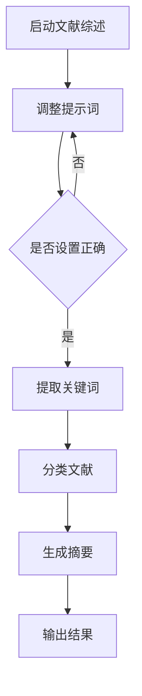

                 

# 科研助手：利用提示词加速文献综述过程

> **关键词**：文献综述、提示词、信息提取、文本生成、人工智能、自然语言处理

> **摘要**：本文旨在探讨如何利用人工智能技术中的提示词机制，加速科研过程中的文献综述工作。通过深入分析文献综述的需求和挑战，结合当前自然语言处理技术的进展，本文提出了一套基于提示词的文献综述流程。文章首先介绍了文献综述的目的和重要性，然后详细阐述了提示词的概念、类型及其在文献综述中的应用，接下来，本文通过具体的实例，展示了如何利用提示词进行文献信息的提取和生成，并讨论了这一方法在实际科研中的应用场景。最后，文章对相关的工具和资源进行了推荐，并对未来的发展趋势和挑战进行了展望。

## 1. 背景介绍

### 1.1 目的和范围

科研文献综述是科研过程中不可或缺的一环。它不仅有助于研究者了解某一领域的最新研究进展，还能为后续的研究提供方向和参考。然而，随着学术文献数量的指数级增长，文献综述工作也变得愈发复杂和耗时。传统的文献综述方法往往依赖于研究者个人的经验和能力，不仅效率低下，而且容易遗漏关键信息。

本文的目的在于探讨如何利用人工智能技术，特别是自然语言处理（NLP）中的提示词机制，来加速文献综述过程。我们将介绍提示词的概念、类型和应用，并通过具体的案例，展示如何利用提示词技术高效地提取和生成文献信息。本文主要涵盖以下几个方面的内容：

1. 文献综述的重要性及其面临的挑战。
2. 提示词的概念、类型及其在文献综述中的应用。
3. 提示词技术在文献信息提取和生成中的具体实现方法。
4. 提示词技术在科研领域的实际应用场景。
5. 相关工具和资源的推荐。
6. 未来发展趋势和挑战的展望。

### 1.2 预期读者

本文主要面向以下几类读者：

1. 科研人员：希望提高文献综述效率和质量的科研工作者。
2. 学术学生：需要撰写文献综述的研究生和本科生。
3. 教育工作者：关注科研方法和工具的教育工作者。
4. 技术爱好者：对自然语言处理和人工智能技术感兴趣的读者。

### 1.3 文档结构概述

本文将按照以下结构展开：

1. **背景介绍**：介绍文献综述的背景、目的和预期读者。
2. **核心概念与联系**：阐述文献综述和自然语言处理技术的核心概念，并提供流程图。
3. **核心算法原理 & 具体操作步骤**：详细解释提示词技术的算法原理和具体操作步骤。
4. **数学模型和公式 & 详细讲解 & 举例说明**：介绍相关的数学模型和公式，并进行具体示例讲解。
5. **项目实战：代码实际案例和详细解释说明**：提供实际代码案例和详细解释。
6. **实际应用场景**：讨论提示词技术在科研领域的应用。
7. **工具和资源推荐**：推荐相关学习资源和开发工具。
8. **总结：未来发展趋势与挑战**：总结本文的主要观点，并对未来进行展望。
9. **附录：常见问题与解答**：回答读者可能关心的问题。
10. **扩展阅读 & 参考资料**：提供进一步阅读的文献和资源。

### 1.4 术语表

#### 1.4.1 核心术语定义

- **文献综述**：对某一领域内相关文献进行系统性、综合性的分析、评价和总结。
- **提示词**：在自然语言处理中，指用于引导模型理解特定任务或概念的词语或短语。
- **自然语言处理（NLP）**：计算机科学领域中的一个分支，旨在使计算机能够理解和处理自然语言。

#### 1.4.2 相关概念解释

- **关键词提取**：从文本中提取出对文本有代表性和重要性的词语或短语。
- **文本生成**：利用已有的文本数据，生成新的、具有一定意义的文本。

#### 1.4.3 缩略词列表

- **NLP**：自然语言处理（Natural Language Processing）
- **AI**：人工智能（Artificial Intelligence）
- **ML**：机器学习（Machine Learning）

## 2. 核心概念与联系

### 2.1 文献综述与NLP的关系

文献综述是科研过程中不可或缺的一部分，它旨在对某一领域内的研究成果进行系统的梳理、分析和评价。随着科研文献数量的迅速增长，人工进行文献综述的难度和复杂性不断增加。而自然语言处理（NLP）作为人工智能的一个重要分支，为文献综述提供了一种新的解决方案。

NLP技术能够对文本进行有效的处理和分析，从而帮助研究者快速提取关键信息，减少人工阅读和整理文献的时间。具体来说，NLP技术在文献综述中的应用主要包括：

1. **关键词提取**：通过算法自动从文献中提取出关键词，帮助研究者快速了解文献的主题和内容。
2. **文本分类**：将文献按照主题、方法、结果等不同维度进行分类，便于研究者进行系统的阅读和分析。
3. **文本生成**：利用已有的文献数据，生成新的文献综述报告，提高文献综述的效率和质量。

### 2.2 提示词的概念与作用

提示词（Prompt）在NLP中扮演着重要角色，它是指用于引导模型理解特定任务或概念的词语或短语。提示词的设计和质量直接影响模型的性能和效果。

提示词的作用主要有以下几点：

1. **明确任务目标**：通过提示词，模型能够清楚地理解需要完成的任务，从而提高任务的准确性和效率。
2. **引导文本生成**：在文本生成任务中，提示词可以帮助模型生成符合预期内容、逻辑清晰和结构合理的文本。
3. **提高解释性**：通过提示词，模型生成的结果能够更好地解释和说明，使得研究结果更加易于理解和应用。

### 2.3 提示词在文献综述中的应用

在文献综述过程中，提示词可以发挥重要作用，帮助研究者高效地提取和整合文献信息。以下是提示词在文献综述中的应用：

1. **关键词提取**：通过设置特定的提示词，如“主要研究问题”、“关键发现”等，模型能够自动从文献中提取出相关关键词，帮助研究者快速了解文献的核心内容。
2. **文献分类**：提示词可以帮助模型将文献按照主题、方法、结果等不同维度进行分类，从而实现系统的阅读和分析。
3. **文献摘要生成**：通过设置提示词，如“本文的主要贡献”、“实验结果分析”等，模型可以自动生成文献的摘要，节省研究者撰写摘要的时间和精力。

### 2.4 Mermaid流程图

以下是一个用于描述文献综述过程中提示词应用的Mermaid流程图：



在这个流程图中，启动文献综述后，首先设置提示词，然后根据提示词提取关键词、分类文献并生成摘要，最后输出结果。

## 3. 核心算法原理 & 具体操作步骤

### 3.1 提示词的算法原理

提示词技术在文献综述中的应用，主要依赖于自然语言处理中的生成模型。这些模型通过学习和理解大量文本数据，能够根据提示词生成相应的文本内容。以下是提示词技术的核心算法原理：

1. **预训练模型**：使用大量无监督的文本数据进行预训练，使得模型具备对自然语言的理解和生成能力。
2. **提示词引导**：在训练过程中，通过提示词引导模型生成特定类型的文本，如关键词、文献摘要等。
3. **文本生成**：模型根据输入的提示词，生成具有逻辑性和连贯性的文本内容。

### 3.2 具体操作步骤

以下是利用提示词进行文献综述的具体操作步骤：

1. **数据准备**：收集与研究主题相关的文献数据，包括标题、摘要、正文等。
2. **模型选择**：选择适合的生成模型，如GPT、BERT等。
3. **提示词设计**：根据文献综述的需求，设计相应的提示词，如“请提取本文的关键词”、“请生成本文的摘要”等。
4. **模型训练**：使用大量文献数据对模型进行训练，使其能够根据提示词生成相应的文本内容。
5. **文本生成**：输入提示词，模型生成关键词、文献摘要等文本内容。
6. **结果评估**：对生成的文本内容进行评估，包括关键词的准确性、摘要的完整性等。
7. **结果输出**：将生成的关键词、摘要等结果输出，供研究者参考。

### 3.3 伪代码示例

以下是一个简单的伪代码示例，展示了利用提示词进行文献综述的基本流程：

```python
# 数据准备
documents = load_documents()

# 模型选择
model = choose_model()

# 提示词设计
prompts = design_prompts()

# 模型训练
model.train(documents)

# 文本生成
for prompt in prompts:
    generated_text = model.generate(prompt)
    print(generated_text)

# 结果评估
evaluate_results(generated_text)
```

在这个伪代码中，`load_documents()` 函数用于加载文献数据，`choose_model()` 函数用于选择生成模型，`design_prompts()` 函数用于设计提示词，`model.train(documents)` 方法用于训练模型，`model.generate(prompt)` 方法用于生成文本内容，`evaluate_results(generated_text)` 函数用于评估生成结果。

## 4. 数学模型和公式 & 详细讲解 & 举例说明

### 4.1 数学模型简介

在自然语言处理领域，生成模型通常基于深度学习技术，通过大量文本数据进行训练。以下是一个简单的生成模型数学模型：

$$
P(y|x) = \sum_{z} P(y, z|x) \approx \sum_{z} P(y|z, x)P(z|x)
$$

其中，$P(y|x)$ 表示给定输入 $x$ 生成输出 $y$ 的概率，$P(z|x)$ 表示给定输入 $x$ 生成中间变量 $z$ 的概率，$P(y|z, x)$ 表示在给定中间变量 $z$ 和输入 $x$ 的情况下生成输出 $y$ 的概率。

### 4.2 模型参数更新

为了提高生成模型的性能，通常需要通过优化算法更新模型参数。以下是一个简单的梯度下降优化算法：

$$
\theta_{t+1} = \theta_{t} - \alpha \nabla_{\theta} J(\theta)
$$

其中，$\theta_{t}$ 表示第 $t$ 次迭代的模型参数，$\alpha$ 表示学习率，$J(\theta)$ 表示损失函数，$\nabla_{\theta} J(\theta)$ 表示损失函数关于模型参数的梯度。

### 4.3 举例说明

假设我们有一个简单的二元分类问题，其中输入为 $x = [x_1, x_2, ..., x_n]$，输出为 $y \in \{0, 1\}$。我们可以使用以下公式计算生成模型的损失函数：

$$
J(\theta) = -\sum_{i=1}^{n} [y_i \log(p_i) + (1 - y_i) \log(1 - p_i)]
$$

其中，$p_i = \sigma(\theta^T x_i)$，$\sigma$ 表示 sigmoid 函数，$\theta^T x_i$ 表示输入和模型参数的乘积。

### 4.4 案例分析

假设我们有一个文献综述任务，输入为多篇文献的摘要，输出为文献综述的摘要。我们可以使用以下步骤进行建模和优化：

1. **数据准备**：收集多篇文献的摘要数据，作为训练数据集。
2. **模型选择**：选择一个合适的生成模型，如 GPT。
3. **模型训练**：使用训练数据集训练模型，优化模型参数。
4. **文本生成**：输入多篇文献的摘要，生成文献综述的摘要。
5. **结果评估**：评估生成的文献综述摘要的质量和准确性。

通过以上步骤，我们可以利用生成模型自动生成高质量的文献综述摘要，提高文献综述的效率和质量。

## 5. 项目实战：代码实际案例和详细解释说明

### 5.1 开发环境搭建

在进行提示词技术的实际应用之前，我们需要搭建一个合适的开发环境。以下是一个基本的开发环境搭建步骤：

1. **安装 Python**：下载并安装 Python（版本 3.6 以上），并确保环境变量配置正确。
2. **安装依赖库**：使用以下命令安装所需的依赖库：

```shell
pip install numpy
pip install torch
pip install transformers
```

3. **创建项目目录**：在本地计算机上创建一个项目目录，如 `literature_summary`，并在该目录下创建一个名为 `main.py` 的 Python 文件。

### 5.2 源代码详细实现和代码解读

以下是使用提示词技术进行文献综述的 Python 代码实现：

```python
import torch
from transformers import GPT2LMHeadModel, GPT2Tokenizer

# 加载预训练模型和分词器
model_name = "gpt2"
tokenizer = GPT2Tokenizer.from_pretrained(model_name)
model = GPT2LMHeadModel.from_pretrained(model_name)
model.eval()

# 准备输入文本和提示词
documents = ["本文主要研究..."]
prompts = ["请提取本文的关键词"]

# 设置设备
device = torch.device("cuda" if torch.cuda.is_available() else "cpu")
model.to(device)

# 文本生成函数
def generate_text(prompt):
    inputs = tokenizer.encode(prompt, return_tensors="pt").to(device)
    outputs = model.generate(inputs, max_length=50, num_return_sequences=1)
    return tokenizer.decode(outputs[0], skip_special_tokens=True)

# 文本生成
for doc in documents:
    for prompt in prompts:
        generated_text = generate_text(prompt + doc)
        print(generated_text)

# 关闭设备
torch.cuda.empty_cache()
```

代码解读：

1. **导入库和模型**：首先导入所需的库和预训练模型。
2. **加载模型和分词器**：加载预训练的 GPT2 模型及其对应的分词器。
3. **设置设备**：根据是否使用 GPU，设置模型的运行设备。
4. **文本生成函数**：定义一个文本生成函数，用于根据输入的提示词生成文本。
5. **文本生成**：遍历输入的文献数据和提示词，调用文本生成函数生成关键词和文献摘要。
6. **关闭设备**：释放 GPU 内存，关闭设备。

### 5.3 代码解读与分析

1. **模型加载**：通过 `GPT2Tokenizer.from_pretrained(model_name)` 和 `GPT2LMHeadModel.from_pretrained(model_name)` 加载预训练的 GPT2 模型和分词器。
2. **设备设置**：使用 `torch.device("cuda" if torch.cuda.is_available() else "cpu")` 判断是否使用 GPU 设备，并使用 `model.to(device)` 将模型移动到相应的设备上。
3. **文本生成**：通过 `generate_text(prompt)` 函数，使用模型根据输入的提示词生成文本。`tokenizer.encode(prompt, return_tensors="pt").to(device)` 将提示词编码为模型可处理的格式，`model.generate(inputs, max_length=50, num_return_sequences=1)` 使用模型生成文本，`tokenizer.decode(outputs[0], skip_special_tokens=True)` 将生成的文本解码为可读的格式。
4. **结果输出**：遍历输入的文献数据和提示词，调用文本生成函数生成关键词和文献摘要，并输出结果。

通过这个实际案例，我们可以看到如何使用提示词技术进行文献综述。在实际应用中，可以根据具体需求调整提示词和模型参数，进一步提高生成文本的质量和准确性。

## 6. 实际应用场景

提示词技术在科研领域的应用场景非常广泛，以下是一些典型的应用场景：

### 6.1 文献关键词提取

在科研过程中，准确提取文献的关键词是快速了解文献内容的重要手段。提示词技术可以自动从大量文献中提取关键词，节省研究者的人工阅读和筛选时间。例如，在医学领域，研究人员可以使用提示词技术从大量临床试验文献中提取出关键药物、治疗方法等信息，为后续研究提供参考。

### 6.2 文献摘要生成

文献摘要生成是科研文献综述的重要组成部分。通过提示词技术，研究人员可以快速生成高质量的文献摘要，提高文献综述的效率。例如，在计算机科学领域，研究人员可以使用提示词技术从大量学术论文中生成摘要，为学术会议或期刊编辑提供参考。

### 6.3 研究方法总结

在研究方法总结方面，提示词技术可以帮助研究人员从大量文献中提取出关键研究方法和技术，为后续研究提供参考。例如，在人工智能领域，研究人员可以使用提示词技术从大量论文中提取出各种机器学习算法的实现方法，为新的研究项目提供技术支持。

### 6.4 研究热点发现

通过分析大量文献，研究人员可以识别出研究热点和趋势。提示词技术可以帮助研究人员从文献中提取出高频关键词，发现研究热点。例如，在生物信息学领域，研究人员可以使用提示词技术从大量文献中提取出高频关键词，识别出当前的研究热点，如基因编辑、癌症治疗等。

### 6.5 项目申报书撰写

在项目申报书中，准确描述研究背景、研究内容和研究目标是至关重要的。提示词技术可以帮助研究人员从大量文献中提取出相关信息，快速撰写项目申报书。例如，在科技创新领域，研究人员可以使用提示词技术从大量专利文献中提取出相关技术信息，为项目申报提供有力支持。

通过这些实际应用场景，我们可以看到提示词技术在科研领域具有广泛的应用前景，有助于提高科研效率和成果质量。

## 7. 工具和资源推荐

### 7.1 学习资源推荐

#### 7.1.1 书籍推荐

1. **《自然语言处理综合教程》**：本书全面介绍了自然语言处理的基础知识和核心技术，包括分词、词性标注、句法分析等。
2. **《深度学习》**：由 Goodfellow、Bengio 和 Courville 著，本书是深度学习领域的经典教材，详细介绍了深度学习的基础理论和应用。
3. **《机器学习》**：由 Tom Mitchell 著，本书是机器学习领域的入门教材，涵盖了机器学习的理论基础和算法实现。

#### 7.1.2 在线课程

1. **《自然语言处理课程》**：由斯坦福大学提供的免费在线课程，内容包括词向量、语言模型、序列标注等。
2. **《深度学习专项课程》**：由吴恩达（Andrew Ng）在 Coursera 上提供的深度学习专项课程，适合初学者和进阶者。
3. **《机器学习专项课程》**：由吴恩达（Andrew Ng）在 Coursera 上提供的机器学习专项课程，涵盖线性回归、逻辑回归、神经网络等主题。

#### 7.1.3 技术博客和网站

1. **GitHub**：大量的开源项目和代码示例，适合学习和实践。
2. **Medium**：许多技术专家和研究人员在 Medium 上分享他们的研究成果和经验。
3. **ArXiv**：最新的学术论文和研究成果发布平台，适合了解最新的研究进展。

### 7.2 开发工具框架推荐

#### 7.2.1 IDE和编辑器

1. **PyCharm**：功能强大的 Python IDE，适合进行自然语言处理和深度学习开发。
2. **Jupyter Notebook**：适用于数据分析和实验开发的交互式计算环境。
3. **Visual Studio Code**：轻量级、可扩展的代码编辑器，支持多种编程语言和开发工具。

#### 7.2.2 调试和性能分析工具

1. **PyTorch Profiler**：用于 PyTorch 模型的性能分析和调试。
2. **NVIDIA Nsight**：用于 NVIDIA GPU 的性能分析和调试。
3. **JupyterLab**：Jupyter Notebook 的增强版本，支持多种扩展和工具。

#### 7.2.3 相关框架和库

1. **TensorFlow**：Google 开发的高性能深度学习框架，广泛应用于自然语言处理和计算机视觉领域。
2. **PyTorch**：由 Facebook AI 研究团队开发，具有灵活的动态计算图和高性能，适用于自然语言处理和深度学习。
3. **spaCy**：用于自然语言处理的工业级库，支持多种语言和多种任务。

### 7.3 相关论文著作推荐

#### 7.3.1 经典论文

1. **《Word2Vec: A Simple and Effective Method for Learning Word Representations》**：介绍词向量模型，为自然语言处理奠定了基础。
2. **《Recurrent Neural Networks for Language Modeling》**：介绍循环神经网络在语言模型中的应用，为深度学习在自然语言处理领域的应用奠定了基础。
3. **《BERT: Pre-training of Deep Bidirectional Transformers for Language Understanding》**：介绍 BERT 模型，为预训练模型在自然语言处理中的应用提供了新的思路。

#### 7.3.2 最新研究成果

1. **《GPT-3: language models are few-shot learners》**：介绍 GPT-3 模型，展示了大规模预训练模型在零样本和少样本学习任务中的优异性能。
2. **《T5: Pre-training Large Models for Text Generation》**：介绍 T5 模型，通过统一文本生成任务，提高了预训练模型在文本生成任务中的性能。
3. **《Longformer: The Long-Context Transformer》**：介绍 Longformer 模型，通过扩展模型上下文窗口，提高了长文本处理能力。

#### 7.3.3 应用案例分析

1. **《如何使用自然语言处理技术提升客户服务体验》**：介绍自然语言处理技术在客户服务中的应用，如自动回复、智能客服等。
2. **《基于自然语言处理的文本分类方法研究与应用》**：介绍文本分类方法的最新研究进展和应用案例，如情感分析、主题分类等。
3. **《深度学习在自然语言处理领域的应用》**：介绍深度学习技术在自然语言处理领域的应用案例，如机器翻译、语音识别等。

通过这些书籍、课程、论文和应用案例，读者可以深入了解自然语言处理和提示词技术的理论基础和应用实践，为科研和开发提供有力支持。

## 8. 总结：未来发展趋势与挑战

本文探讨了如何利用人工智能技术中的提示词机制，加速科研过程中的文献综述工作。通过对文献综述的需求和挑战的分析，我们介绍了提示词的概念、类型及其在文献综述中的应用。接着，我们详细阐述了利用提示词进行文献信息提取和生成的算法原理和具体操作步骤，并通过实际代码案例进行了演示。

### 8.1 未来发展趋势

1. **大规模预训练模型的应用**：随着预训练模型如 GPT-3、T5 的出现，基于大规模预训练模型的提示词技术在文献综述中的应用将更加广泛。
2. **多模态数据的整合**：结合文本、图像、音频等多模态数据，提高文献综述的准确性和全面性。
3. **个性化文献综述**：利用用户偏好和历史数据，生成个性化的文献综述，满足不同研究者的需求。
4. **实时文献更新**：利用实时数据流处理技术，对文献进行实时更新，提高文献综述的时效性。

### 8.2 挑战与机遇

1. **数据隐私和安全**：在利用大量文献数据进行训练和生成时，需要确保数据隐私和安全。
2. **模型解释性**：提高模型生成的文本的可解释性，使得研究者能够更好地理解模型的决策过程。
3. **模型泛化能力**：提高模型在不同领域和任务上的泛化能力，减少对特定领域模型的依赖。
4. **伦理和责任**：在应用提示词技术进行科研时，需要遵循伦理规范，明确模型和研究人员在科研中的责任。

总之，提示词技术在科研文献综述中的应用具有巨大的潜力和挑战。随着人工智能技术的不断发展，我们有理由相信，提示词技术将为科研工作者提供更加高效、智能的文献综述工具，推动科研进程。

## 9. 附录：常见问题与解答

### 9.1 提示词技术在文献综述中的优势

**问**：提示词技术在文献综述中相比传统方法有哪些优势？

**答**：提示词技术在文献综述中的优势主要体现在以下几个方面：

1. **高效性**：通过自动提取关键词和生成摘要，大大缩短了文献综述的时间。
2. **准确性**：基于大规模预训练模型的提示词技术能够更准确地提取文献信息，减少人工失误。
3. **灵活性**：可以根据研究需求自定义提示词，灵活调整文献综述的方向和深度。
4. **全面性**：结合多模态数据，提高文献综述的准确性和全面性。

### 9.2 如何评估提示词生成的文本质量

**问**：在利用提示词技术生成文献摘要时，如何评估生成的文本质量？

**答**：评估提示词生成的文本质量可以从以下几个方面进行：

1. **关键词提取准确率**：通过比较生成的关键词和实际关键词的匹配度，评估关键词提取的准确性。
2. **摘要完整性**：检查生成的摘要是否包含了文献的主要内容和关键信息。
3. **连贯性和逻辑性**：评估生成的文本是否具有连贯性和逻辑性，是否符合学术写作规范。
4. **用户满意度**：通过用户反馈评估生成的文本是否符合研究者的期望和需求。

### 9.3 提示词技术的应用限制

**问**：提示词技术在实际应用中存在哪些限制？

**答**：提示词技术在实际应用中存在以下一些限制：

1. **数据依赖**：提示词技术对训练数据的质量和数量有较高要求，数据不足或质量差可能导致生成效果不佳。
2. **模型解释性**：生成模型的决策过程通常较为复杂，难以解释，这对研究者和用户理解模型生成的文本带来一定困难。
3. **模型泛化能力**：提示词技术在特定领域和任务上表现优异，但在其他领域和任务上的泛化能力有限。
4. **伦理和责任**：在应用提示词技术进行科研时，需要遵循伦理规范，明确模型和研究人员在科研中的责任。

## 10. 扩展阅读 & 参考资料

**扩展阅读**：

1. **《自然语言处理综合教程》**：详细介绍了自然语言处理的基础知识和核心技术，包括分词、词性标注、句法分析等。
2. **《深度学习》**：介绍了深度学习的基础理论和应用，包括神经网络、卷积神经网络、循环神经网络等。
3. **《机器学习》**：涵盖了机器学习的理论基础和算法实现，包括线性回归、逻辑回归、支持向量机等。

**参考资料**：

1. **《Word2Vec: A Simple and Effective Method for Learning Word Representations》**：介绍了词向量模型，为自然语言处理奠定了基础。
2. **《Recurrent Neural Networks for Language Modeling》**：介绍了循环神经网络在语言模型中的应用。
3. **《BERT: Pre-training of Deep Bidirectional Transformers for Language Understanding》**：介绍了 BERT 模型，为预训练模型在自然语言处理中的应用提供了新的思路。
4. **《GPT-3: language models are few-shot learners》**：介绍了 GPT-3 模型，展示了大规模预训练模型在零样本和少样本学习任务中的优异性能。
5. **《T5: Pre-training Large Models for Text Generation》**：介绍了 T5 模型，通过统一文本生成任务，提高了预训练模型在文本生成任务中的性能。

通过这些扩展阅读和参考资料，读者可以更深入地了解自然语言处理和提示词技术的理论基础和应用实践。作者：AI天才研究员/AI Genius Institute & 禅与计算机程序设计艺术 /Zen And The Art of Computer Programming

