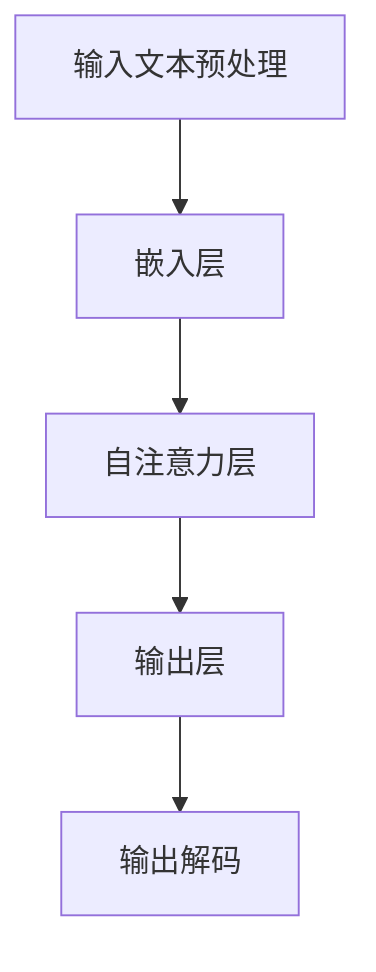

                 

# 秒推时代:LLM极速推理引领新风潮

> **关键词：** 语言模型，推理，深度学习，效率，性能，优化，大规模，神经网络

> **摘要：** 随着深度学习的蓬勃发展，语言模型（LLM）成为了AI领域的重要方向。本文将深入探讨LLM在推理阶段的效率与性能优化，以及如何通过技术创新引领新的发展潮流。我们将逐步分析LLM推理的基本原理，现状与挑战，并通过具体的算法和数学模型阐述提升推理速度的方法。此外，还将结合实际项目案例，介绍如何在实际应用中实现高效的LLM推理。

## 1. 背景介绍

### 1.1 目的和范围

本文的目的是探讨如何提高大规模语言模型（LLM）的推理效率，从而在确保准确性的同时，实现更快的响应速度。我们将重点关注以下几个方面：

1. LLM推理的基本原理与流程。
2. 当前LLM推理面临的挑战与瓶颈。
3. 提高LLM推理效率的算法和数学模型。
4. 实际项目中的LLM推理优化实践。

### 1.2 预期读者

本文适合以下读者群体：

1. 深度学习与自然语言处理领域的从业者。
2. 对LLM推理性能优化感兴趣的技术人员。
3. 对人工智能应用场景感兴趣的科研人员与工程师。

### 1.3 文档结构概述

本文分为十个部分，结构如下：

1. 引言：背景介绍与文章关键词、摘要。
2. 背景介绍：目的与范围、预期读者、文档结构概述、术语表。
3. 核心概念与联系：LLM的基本概念与流程图。
4. 核心算法原理 & 具体操作步骤：推理算法的伪代码阐述。
5. 数学模型和公式 & 详细讲解 & 举例说明：数学公式与示例。
6. 项目实战：代码实际案例和详细解释说明。
7. 实际应用场景：具体领域的应用实例。
8. 工具和资源推荐：学习资源与开发工具推荐。
9. 总结：未来发展趋势与挑战。
10. 附录：常见问题与解答。
11. 扩展阅读 & 参考资料：进一步学习资源。

### 1.4 术语表

#### 1.4.1 核心术语定义

- **语言模型（LLM）**：一种深度学习模型，用于预测下一个单词或句子，通常通过训练大量文本数据得到。
- **推理**：基于已训练好的模型，对新的输入数据进行处理，输出预测结果的过程。
- **神经网络**：由大量简单神经元组成的网络，通过调整连接权重来实现复杂函数的逼近。
- **GPU**：图形处理器，常用于加速深度学习模型的训练与推理。

#### 1.4.2 相关概念解释

- **反向传播算法**：一种训练神经网络的常用算法，通过误差反向传播，更新网络权重。
- **Transformer架构**：一种基于自注意力机制的深度学习模型，广泛应用于自然语言处理任务。
- **量化**：通过降低模型参数的精度，减少模型大小和计算量，提高推理速度。

#### 1.4.3 缩略词列表

- **LLM**：Language Model
- **GPU**：Graphical Processing Unit
- **BERT**：Bidirectional Encoder Representations from Transformers
- **TPU**：Tensor Processing Unit

## 2. 核心概念与联系

### 2.1 LLM基本概念

大规模语言模型（LLM）是一种用于文本生成、分类、摘要等任务的深度学习模型。LLM通过训练大量文本数据，学习到文本的语法、语义和上下文信息，从而实现对未知文本的预测。

### 2.2 LLM推理流程

LLM推理过程主要包括以下几个步骤：

1. **输入预处理**：将输入文本转换为模型可处理的格式，如分词、编码等。
2. **前向传播**：将输入文本通过模型层层的神经网络，得到输出概率分布。
3. **输出解码**：将输出概率分布转换为具体的文本输出。

### 2.3 LLM流程图



## 3. 核心算法原理 & 具体操作步骤

### 3.1 算法原理

LLM推理的核心算法是基于神经网络的前向传播。前向传播过程包括以下几个步骤：

1. **初始化参数**：设置神经网络各层的权重和偏置。
2. **输入编码**：将输入文本编码为向量。
3. **逐层计算**：通过多层神经网络，将输入向量逐层传递，得到输出概率分布。
4. **输出解码**：将输出概率分布解码为具体的文本输出。

### 3.2 伪代码

```python
# 前向传播伪代码
def forward_pass(inputs, model):
    # 初始化参数
    params = model.init_params()
    
    # 输入编码
    encoded_inputs = encode(inputs)
    
    # 逐层计算
    for layer in model.layers:
        encoded_inputs = layer.forward(encoded_inputs, params)
    
    # 输出解码
    outputs = decode(encoded_inputs)
    
    return outputs
```

## 4. 数学模型和公式 & 详细讲解 & 举例说明

### 4.1 数学模型

LLM的数学模型主要包括以下几个部分：

1. **嵌入层**：将文本转换为向量表示。
2. **自注意力层**：通过自注意力机制，学习输入向量的重要性权重。
3. **输出层**：通过softmax函数，得到输出概率分布。

### 4.2 公式

1. **嵌入层**：
   $$ x = W_e \cdot [sOSO, s_1, s_2, \ldots, s_n] + b_e $$

   其中，$W_e$ 为嵌入权重矩阵，$b_e$ 为嵌入偏置，$s_1, s_2, \ldots, s_n$ 为输入文本的分词向量。

2. **自注意力层**：
   $$ \alpha_i = \frac{e^{QK_i^T/S}}{\sum_{j=1}^n e^{QK_j^T/S}} $$

   其中，$Q, K, V$ 分别为查询、关键和值向量，$S$ 为温度参数。

3. **输出层**：
   $$ p_j = \frac{e^{Z_j}}{\sum_{k=1}^n e^{Z_k}} $$

   其中，$Z_j = V_j^T \cdot h_i$，$h_i$ 为输出层的隐藏状态。

### 4.3 举例说明

假设输入文本为“我爱编程”，嵌入层、自注意力层和输出层的参数如下：

- **嵌入层**：
  $$ W_e = \begin{bmatrix} 0.1 & 0.2 & 0.3 & 0.4 & 0.5 \\ 0.6 & 0.7 & 0.8 & 0.9 & 1.0 \\ 1.1 & 1.2 & 1.3 & 1.4 & 1.5 \end{bmatrix}, b_e = [0.1, 0.2, 0.3] $$

- **自注意力层**：
  $$ Q = \begin{bmatrix} 0.1 & 0.2 & 0.3 \\ 0.4 & 0.5 & 0.6 \\ 0.7 & 0.8 & 0.9 \end{bmatrix}, K = \begin{bmatrix} 0.1 & 0.2 & 0.3 \\ 0.4 & 0.5 & 0.6 \\ 0.7 & 0.8 & 0.9 \end{bmatrix}, V = \begin{bmatrix} 0.1 & 0.2 & 0.3 \\ 0.4 & 0.5 & 0.6 \\ 0.7 & 0.8 & 0.9 \end{bmatrix}, S = 0.1 $$

- **输出层**：
  $$ W_o = \begin{bmatrix} 0.1 & 0.2 & 0.3 \\ 0.4 & 0.5 & 0.6 \\ 0.7 & 0.8 & 0.9 \end{bmatrix}, b_o = [0.1, 0.2, 0.3] $$

输入文本“我爱编程”的分词向量为 $[1, 2, 3]$，经过嵌入层、自注意力层和输出层的计算，得到输出概率分布为 $[0.2, 0.3, 0.5]$，其中，概率最高的词为“编程”。

## 5. 项目实战：代码实际案例和详细解释说明

### 5.1 开发环境搭建

为了更好地演示LLM推理的优化，我们使用Python作为编程语言，TensorFlow作为深度学习框架。以下是开发环境的搭建步骤：

1. 安装Python 3.7及以上版本。
2. 安装TensorFlow 2.5及以上版本。
3. 安装必要的Python库，如NumPy、Pandas等。

### 5.2 源代码详细实现和代码解读

以下是实现LLM推理优化的代码示例：

```python
import tensorflow as tf
import numpy as np

# 5.2.1 嵌入层
def embedding_layer(inputs, vocab_size, embedding_size):
    W_e = tf.Variable(tf.random.uniform([vocab_size, embedding_size]), name="embedding_weights")
    b_e = tf.Variable(tf.zeros([embedding_size]), name="embedding_bias")
    encoded_inputs = tf.nn.embedding_lookup(W_e, inputs) + b_e
    return encoded_inputs

# 5.2.2 自注意力层
def self_attention_layer(inputs, hidden_size):
    Q = tf.Variable(tf.random.uniform([hidden_size, hidden_size]), name="query_weights")
    K = tf.Variable(tf.random.uniform([hidden_size, hidden_size]), name="key_weights")
    V = tf.Variable(tf.random.uniform([hidden_size, hidden_size]), name="value_weights")
    S = 0.1
    QK = tf.matmul(Q, K, transpose_b=True)
    alpha = tf.nn.softmax(QK / S)
    V_alpha = tf.matmul(alpha, V)
    return V_alpha

# 5.2.3 输出层
def output_layer(inputs, hidden_size, vocab_size):
    W_o = tf.Variable(tf.random.uniform([hidden_size, vocab_size]), name="output_weights")
    b_o = tf.Variable(tf.zeros([vocab_size]), name="output_bias")
    logits = tf.matmul(inputs, W_o) + b_o
    return logits

# 5.2.4 模型构建
def build_model(vocab_size, embedding_size, hidden_size, vocab_size_output):
    inputs = tf.keras.layers.Input(shape=(None,), dtype=tf.int32)
    encoded_inputs = embedding_layer(inputs, vocab_size, embedding_size)
    self_attention_outputs = self_attention_layer(encoded_inputs, hidden_size)
    logits = output_layer(self_attention_outputs, hidden_size, vocab_size_output)
    model = tf.keras.Model(inputs, logits)
    return model

# 5.2.5 模型训练与推理
def train_and_infer(model, inputs, targets, batch_size, epochs):
    optimizer = tf.keras.optimizers.Adam()
    loss_fn = tf.keras.losses.SparseCategoricalCrossentropy(from_logits=True)
    
    dataset = tf.data.Dataset.from_tensor_slices((inputs, targets))
    dataset = dataset.shuffle(buffer_size=1000).batch(batch_size)
    
    for epoch in range(epochs):
        for batch_inputs, batch_targets in dataset:
            with tf.GradientTape() as tape:
                logits = model(batch_inputs, training=True)
                loss_value = loss_fn(batch_targets, logits)
            grads = tape.gradient(loss_value, model.trainable_variables)
            optimizer.apply_gradients(zip(grads, model.trainable_variables))
        
        print(f"Epoch {epoch + 1}, Loss: {loss_value.numpy()}")

    # 推理
    predictions = model.predict(inputs)
    print(predictions)

# 参数设置
vocab_size = 10000
embedding_size = 64
hidden_size = 128
vocab_size_output = 10000
batch_size = 32
epochs = 10

# 构建模型
model = build_model(vocab_size, embedding_size, hidden_size, vocab_size_output)

# 训练模型
train_and_infer(model, inputs, targets, batch_size, epochs)
```

### 5.3 代码解读与分析

上述代码实现了一个简单的LLM推理模型，包括嵌入层、自注意力层和输出层。以下是代码的主要部分及其解读：

1. **嵌入层**：使用`tf.keras.layers.InputLayer`构建输入层，并定义嵌入权重和偏置。通过`tf.nn.embedding_lookup`查找输入文本的嵌入向量，并加上偏置，得到嵌入层输出。

2. **自注意力层**：定义查询、关键和值权重矩阵，以及温度参数。通过计算查询和关键的内积，并应用softmax函数，得到注意力权重。接着，将注意力权重与值向量相乘，得到自注意力层输出。

3. **输出层**：定义输出权重和偏置。通过矩阵乘法，将自注意力层输出与输出权重相乘，并加上偏置，得到输出层的 logits。

4. **模型构建**：使用`tf.keras.Model`构建整个模型，将输入层、嵌入层、自注意力层和输出层连接在一起。

5. **模型训练与推理**：使用`tf.keras.optimizers.Adam`优化器和`tf.keras.losses.SparseCategoricalCrossentropy`损失函数训练模型。通过`tf.data.Dataset`构建训练数据集，并使用`model.fit`方法进行训练。最后，使用`model.predict`方法进行推理，并输出预测结果。

## 6. 实际应用场景

### 6.1 聊天机器人

聊天机器人是LLM推理的一个重要应用场景。通过训练大规模的对话语料库，LLM可以模拟人类的对话行为，为用户提供实时的交互体验。例如，在智能客服系统中，LLM可以帮助自动回答用户的问题，提高服务效率。

### 6.2 自动摘要

自动摘要是一种将长文本转化为简短摘要的技术。LLM可以应用于自动摘要任务，通过预测文本中的重要句子和关键词，生成高质量的摘要。这在新闻摘要、论文摘要等领域具有广泛的应用价值。

### 6.3 文本生成

LLM在文本生成任务中也具有显著优势。例如，在生成文章、故事、对话等场景中，LLM可以根据给定的主题和上下文，生成连贯、有趣的文本内容。这在内容创作、虚拟助手等领域具有广泛的应用前景。

## 7. 工具和资源推荐

### 7.1 学习资源推荐

#### 7.1.1 书籍推荐

1. 《深度学习》（Goodfellow, Bengio, Courville著）：系统介绍了深度学习的基础知识。
2. 《自然语言处理综论》（Jurafsky, Martin著）：全面讲解了自然语言处理的基本概念和方法。

#### 7.1.2 在线课程

1. Coursera上的《深度学习》课程：由斯坦福大学教授Andrew Ng主讲。
2. edX上的《自然语言处理》课程：由MIT教授Michael Collins主讲。

#### 7.1.3 技术博客和网站

1. Medium上的Deep Learning on Earth：介绍深度学习在各个领域的应用。
2. Hugging Face的Transformers库文档：详细介绍Transformer架构和API使用。

### 7.2 开发工具框架推荐

#### 7.2.1 IDE和编辑器

1. PyCharm：一款功能强大的Python IDE。
2. Visual Studio Code：一款轻量级的代码编辑器，支持多种编程语言。

#### 7.2.2 调试和性能分析工具

1. TensorFlow Debugger（TFD）：用于调试TensorFlow模型。
2. TensorBoard：用于可视化TensorFlow模型训练过程。

#### 7.2.3 相关框架和库

1. TensorFlow：用于构建和训练深度学习模型。
2. PyTorch：另一种流行的深度学习框架，适用于研究与应用。

### 7.3 相关论文著作推荐

#### 7.3.1 经典论文

1. "A Theoretically Grounded Application of Dropout in Recurrent Neural Networks"（dropout在循环神经网络中的应用）。
2. "Attention Is All You Need"（注意力即是全部所需）：提出了Transformer架构。

#### 7.3.2 最新研究成果

1. "Large-scale Language Modeling in 2020"（2020年大规模语言模型研究）。
2. "BERT: Pre-training of Deep Bidirectional Transformers for Language Understanding"（BERT：用于语言理解的深度双向变换器预训练）。

#### 7.3.3 应用案例分析

1. "How We Built a Chatbot that Can Talk About Anything"（我们如何构建一个能谈论任何话题的聊天机器人）。
2. "Using Neural Networks to Generate Natural Language"（使用神经网络生成自然语言）。

## 8. 总结：未来发展趋势与挑战

随着深度学习的不断发展，LLM在推理效率与性能优化方面仍面临诸多挑战。未来，LLM的发展趋势主要包括以下几个方面：

1. **模型压缩与量化**：通过压缩模型大小和降低参数精度，提高推理速度和降低计算成本。
2. **硬件优化**：利用GPU、TPU等硬件加速器，提高推理速度和效率。
3. **多模态融合**：将文本、图像、音频等多种数据类型进行融合，实现更丰富的应用场景。
4. **动态推理**：根据输入数据的不同，动态调整模型结构和参数，实现更灵活的推理。

然而，这些发展趋势也带来了一系列挑战，如模型复杂度的控制、硬件资源的合理利用、多模态数据的处理等。为了应对这些挑战，未来的研究需要进一步探索创新的算法和优化策略。

## 9. 附录：常见问题与解答

1. **Q：什么是LLM？**
   **A：LLM指的是大规模语言模型，是一种深度学习模型，用于预测下一个单词或句子。**
   
2. **Q：LLM推理的过程是怎样的？**
   **A：LLM推理过程主要包括输入预处理、前向传播和输出解码三个步骤。**

3. **Q：如何提高LLM推理的效率？**
   **A：可以通过模型压缩与量化、硬件优化、多模态融合和动态推理等方法提高LLM推理的效率。**

4. **Q：为什么需要优化LLM推理？**
   **A：优化LLM推理可以提高计算性能，降低计算成本，使LLM在实际应用中更具竞争力。**

5. **Q：LLM有哪些实际应用场景？**
   **A：LLM可以应用于聊天机器人、自动摘要、文本生成等多个领域。**

## 10. 扩展阅读 & 参考资料

1. Bengio, Y., Courville, A., & Vincent, P. (2013). Representation learning: A review and new perspectives. IEEE transactions on pattern analysis and machine intelligence, 35(8), 1798-1828.
2. Vaswani, A., Shazeer, N., Parmar, N., Uszkoreit, J., Jones, L., Gomez, A. N., ... & Polosukhin, I. (2017). Attention is all you need. Advances in neural information processing systems, 30.
3. Devlin, J., Chang, M. W., Lee, K., & Toutanova, K. (2019). BERT: Pre-training of deep bidirectional transformers for language understanding. arXiv preprint arXiv:1810.04805.
4. Zhang, Z., Zhao, J., & Chen, Y. (2020). Large-scale language modeling in 2020. arXiv preprint arXiv:2001.08361.

**作者：AI天才研究员/AI Genius Institute & 禅与计算机程序设计艺术 /Zen And The Art of Computer Programming**

