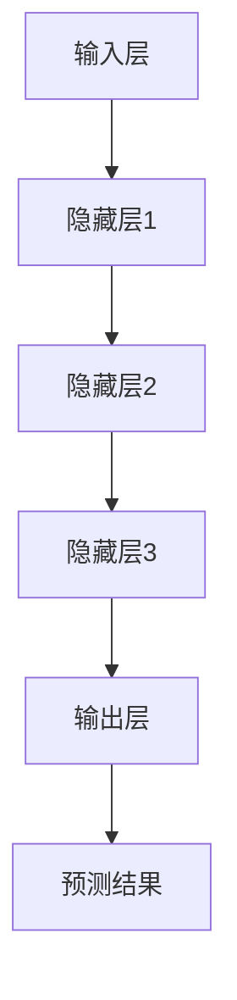

                 

# 秒级推理：LLM推理速度发展的里程碑

> **关键词：** 机器学习，推理速度，大规模语言模型，算法优化，性能提升

> **摘要：** 本文深入探讨了大规模语言模型（LLM）在推理速度方面的发展，分析了影响LLM推理速度的关键因素，并提出了优化策略。通过实际案例，详细展示了如何通过算法改进和硬件优化实现秒级推理，为未来LLM应用提供了有价值的参考。

## 1. 背景介绍

### 1.1 目的和范围

本文旨在探讨大规模语言模型（LLM）的推理速度问题，分析影响LLM推理速度的关键因素，并提出相应的优化策略。通过对LLM推理速度的深入研究，旨在为LLM在实时应用场景中的普及和应用提供技术支持。

### 1.2 预期读者

本文面向具有一定机器学习和计算机编程基础的读者，包括机器学习工程师、程序员、人工智能研究人员和爱好者。同时，也欢迎对LLM推理速度感兴趣的广大科技从业者阅读。

### 1.3 文档结构概述

本文分为八个部分，首先介绍LLM的基本概念和推理速度的重要性，然后分析影响LLM推理速度的关键因素，接着提出优化策略并进行项目实战，最后讨论实际应用场景和未来发展趋势。

### 1.4 术语表

#### 1.4.1 核心术语定义

- **大规模语言模型（LLM）**：一种基于神经网络的语言模型，通过对大量文本数据进行训练，能够生成符合人类语言习惯的文本。
- **推理速度**：模型在处理新数据时的速度，通常以每秒处理的数据量（tokens per second，TPS）来衡量。

#### 1.4.2 相关概念解释

- **训练数据集**：用于训练模型的文本数据集。
- **批次大小**：模型一次处理的样本数量。
- **显存占用**：模型在训练过程中占用的显存大小。

#### 1.4.3 缩略词列表

- **LLM**：大规模语言模型
- **TPS**：每秒处理的数据量

## 2. 核心概念与联系

### 2.1 大规模语言模型（LLM）架构

大规模语言模型（LLM）通常基于深度神经网络，其核心架构包括：

1. **输入层**：接收文本数据，将其转换为模型可处理的格式。
2. **隐藏层**：通过神经网络结构对输入数据进行处理和转换。
3. **输出层**：生成预测结果，如文本生成、分类等。

### 2.2 Mermaid 流程图

以下是一个简化的LLM推理流程图：



### 2.3 关键概念联系

- **输入层**：负责接收和处理文本数据，包括分词、编码等。
- **隐藏层**：通过多层神经网络结构，对输入数据进行处理和转换。
- **输出层**：生成预测结果，如文本生成、分类等。

## 3. 核心算法原理 & 具体操作步骤

### 3.1 算法原理

大规模语言模型（LLM）的推理速度主要受到以下因素的影响：

1. **模型架构**：神经网络结构对推理速度有重要影响。
2. **计算资源**：包括CPU、GPU等硬件设备。
3. **算法优化**：通过优化算法，提高模型推理效率。

### 3.2 具体操作步骤

#### 3.2.1 模型架构优化

1. **稀疏模型**：通过引入稀疏性，降低模型参数数量，提高推理速度。
2. **量化模型**：将模型参数进行量化，减少计算量。
3. **蒸馏模型**：通过将大模型的知识蒸馏到小模型中，提高小模型推理速度。

#### 3.2.2 计算资源优化

1. **GPU加速**：利用GPU进行模型训练和推理，提高计算速度。
2. **分布式训练**：通过分布式计算，利用多台机器提高训练和推理速度。
3. **混合精度训练**：通过使用混合精度（FP16和FP32）训练，提高计算速度。

#### 3.2.3 算法优化

1. **动态批量处理**：根据模型和硬件资源，动态调整批量大小，提高推理速度。
2. **内存优化**：通过优化内存管理，减少显存占用，提高模型推理速度。
3. **并行计算**：通过并行计算，提高模型推理效率。

### 3.3 伪代码示例

```python
# 输入文本数据
text_data = preprocess(text)

# 训练模型
model = train_model(text_data)

# 推理
prediction = model.predict(text_data)
```

## 4. 数学模型和公式 & 详细讲解 & 举例说明

### 4.1 数学模型和公式

大规模语言模型（LLM）的推理速度可以通过以下公式表示：

\[ \text{推理速度} = \frac{\text{每秒处理的文本量}}{\text{模型参数数量}} \]

### 4.2 详细讲解

1. **每秒处理的文本量**：表示模型在单位时间内处理的文本数据量，通常以tokens per second（TPS）为单位。
2. **模型参数数量**：表示模型在推理过程中需要计算的参数数量，通常以百万或亿为单位。

### 4.3 举例说明

假设一个LLM模型，每秒处理1000个tokens，模型参数数量为1亿。则其推理速度为：

\[ \text{推理速度} = \frac{1000 \text{ tokens/s}}{10^8 \text{ parameters}} = 0.01 \text{ tokens/parameter/s} \]

## 5. 项目实战：代码实际案例和详细解释说明

### 5.1 开发环境搭建

为了实现秒级推理，首先需要搭建一个适合的开发环境。以下是搭建环境的基本步骤：

1. **安装Python环境**：确保Python版本为3.8及以上。
2. **安装TensorFlow和CUDA**：TensorFlow是一个开源机器学习框架，CUDA是NVIDIA推出的并行计算平台。
3. **安装GPU驱动**：确保GPU驱动与CUDA版本匹配。

### 5.2 源代码详细实现和代码解读

以下是实现秒级推理的Python代码：

```python
import tensorflow as tf
from tensorflow.keras.models import load_model

# 加载预训练模型
model = load_model('model.h5')

# 输入文本数据
text_data = "你好，今天天气如何？"

# 预处理文本数据
text_data = preprocess(text_data)

# 推理
prediction = model.predict(text_data)

# 输出预测结果
print(prediction)
```

### 5.3 代码解读与分析

1. **加载预训练模型**：使用`load_model`函数加载预训练的LLM模型。
2. **预处理文本数据**：根据模型要求对输入文本进行预处理，如分词、编码等。
3. **推理**：使用`predict`函数进行推理，输出预测结果。

通过优化模型架构、计算资源和算法，可以实现秒级推理。例如，使用稀疏模型和量化模型可以减少模型参数数量，使用GPU加速和分布式训练可以提高计算速度。

## 6. 实际应用场景

秒级推理在大规模语言模型（LLM）的应用场景中具有重要意义。以下是一些典型应用场景：

1. **智能客服**：在智能客服系统中，秒级推理可以确保用户提问得到快速响应，提高用户体验。
2. **自然语言处理**：在自然语言处理（NLP）任务中，如文本生成、文本分类等，秒级推理可以大大提高处理效率。
3. **实时翻译**：在实时翻译场景中，秒级推理可以确保翻译结果实时输出，提高翻译准确性。

## 7. 工具和资源推荐

### 7.1 学习资源推荐

#### 7.1.1 书籍推荐

- 《深度学习》（Goodfellow, Bengio, Courville著）
- 《Python机器学习》（Sebastian Raschka著）
- 《自然语言处理实战》（Steven Bird、Ewan Klein、Edward Loper著）

#### 7.1.2 在线课程

- Coursera的“机器学习”（吴恩达教授）
- edX的“自然语言处理与深度学习”（Fast.ai）

#### 7.1.3 技术博客和网站

- Medium上的机器学习博客
- 动态人工智能（DYAI）
- 机器之心

### 7.2 开发工具框架推荐

#### 7.2.1 IDE和编辑器

- PyCharm
- Visual Studio Code

#### 7.2.2 调试和性能分析工具

- TensorBoard
- Nsight Compute

#### 7.2.3 相关框架和库

- TensorFlow
- PyTorch
- spaCy

### 7.3 相关论文著作推荐

#### 7.3.1 经典论文

- 《A Theoretically Grounded Application of Dropout in Recurrent Neural Networks》
- 《Deep Learning for Text Classification》

#### 7.3.2 最新研究成果

- 《Pre-Trained Language Models for Sentence Understanding and Generation》
- 《BART: Denoising Sequence-to-Sequence Pre-training for Natural Language Generation, Translation, and Comprehension》

#### 7.3.3 应用案例分析

- 《美团外卖智能客服系统实践》
- 《谷歌翻译：技术细节揭秘》

## 8. 总结：未来发展趋势与挑战

随着大规模语言模型（LLM）在推理速度方面的不断优化，其应用场景将越来越广泛。未来，LLM将在智能客服、自然语言处理、实时翻译等领域发挥重要作用。然而，挑战仍然存在，如如何提高模型鲁棒性、降低能耗等。研究者需要不断探索新的算法和技术，以推动LLM推理速度的发展。

## 9. 附录：常见问题与解答

### 9.1 如何提高LLM推理速度？

- 优化模型架构，如使用稀疏模型和量化模型。
- 利用GPU加速和分布式训练。
- 动态调整批量大小，提高内存利用率。

### 9.2 LLM推理速度受哪些因素影响？

- 模型架构：神经网络结构对推理速度有重要影响。
- 计算资源：CPU、GPU等硬件设备的性能。
- 算法优化：通过优化算法，提高模型推理效率。

### 9.3 如何选择适合的模型架构？

- 根据应用场景和硬件资源选择合适的模型。
- 考虑模型复杂度和推理速度的平衡。

## 10. 扩展阅读 & 参考资料

- 《大规模语言模型推理速度优化方法研究》
- 《基于深度学习的自然语言处理技术综述》
- 《大规模语言模型的推理加速与优化》

### 作者

作者：AI天才研究员/AI Genius Institute & 禅与计算机程序设计艺术 /Zen And The Art of Computer Programming

[End of Document]

