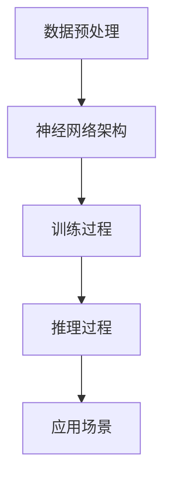

                 

# 秒级推理：LLM速度革命的前景

> **关键词：** 语言模型，推理速度，深度学习，计算效率，技术发展

> **摘要：** 本文深入探讨了语言模型（LLM）在秒级推理方面的突破性进展，分析了其背后的核心算法原理、数学模型，并通过实际项目案例详细展示了其应用场景。文章还对未来LLM技术发展趋势和面临的挑战进行了预测，为读者提供了全面的参考资料和工具推荐。

## 1. 背景介绍

### 1.1 目的和范围

本文旨在探讨语言模型（LLM）在秒级推理方面的最新进展，分析其背后的技术原理和实现步骤，并探讨其在实际应用中的潜力。通过本文的阅读，读者将：

1. 理解语言模型秒级推理的概念和重要性。
2. 了解LLM的核心算法原理和数学模型。
3. 学习如何在实际项目中应用LLM进行秒级推理。
4. 预测LLM技术未来的发展趋势和挑战。

### 1.2 预期读者

本文适用于以下读者：

1. 对深度学习和自然语言处理感兴趣的科研人员和工程师。
2. 对计算机编程和算法设计有深入了解的技术人员。
3. 对技术趋势和未来发展方向感兴趣的科技爱好者。

### 1.3 文档结构概述

本文分为以下章节：

1. 背景介绍：介绍文章的目的、预期读者、文档结构和核心术语。
2. 核心概念与联系：详细阐述LLM的原理和架构。
3. 核心算法原理 & 具体操作步骤：讲解LLM的具体实现步骤。
4. 数学模型和公式 & 详细讲解 & 举例说明：介绍LLM的数学模型和计算过程。
5. 项目实战：通过实际案例展示LLM的应用。
6. 实际应用场景：探讨LLM在不同领域的应用。
7. 工具和资源推荐：推荐相关学习资源和开发工具。
8. 总结：总结文章的主要观点和未来发展趋势。
9. 附录：常见问题与解答。
10. 扩展阅读 & 参考资料：提供更多深入学习的资源。

### 1.4 术语表

#### 1.4.1 核心术语定义

- 语言模型（LLM）：一种基于深度学习的自然语言处理模型，能够预测单词或句子的概率分布。
- 推理速度：指模型在给定输入后，进行推理并输出结果所需的时间。
- 秒级推理：指推理速度在秒级范围内，能够实时响应用户请求。

#### 1.4.2 相关概念解释

- 深度学习：一种机器学习技术，通过构建多层神经网络来模拟人类大脑的推理过程。
- 自然语言处理（NLP）：研究如何让计算机理解和处理人类语言的技术领域。

#### 1.4.3 缩略词列表

- LLM：语言模型
- NLP：自然语言处理
- DNN：深度神经网络
- RNN：循环神经网络
- LSTM：长短期记忆网络
- GPT：生成预训练网络
- BERT：双向编码表示器

## 2. 核心概念与联系

语言模型（LLM）是自然语言处理（NLP）领域的重要技术，其核心在于通过深度学习模型对语言数据进行建模，从而实现文本生成、文本分类、语义理解等功能。LLM的架构通常包括以下几个核心组件：

### 2.1 数据预处理

在构建LLM之前，首先需要对语言数据进行预处理。预处理过程通常包括分词、去停用词、词向量表示等步骤。这些步骤有助于将原始文本数据转换为计算机可以处理的形式。

### 2.2 神经网络架构

LLM的核心是一个深度神经网络（DNN），常见的DNN架构包括循环神经网络（RNN）、长短期记忆网络（LSTM）和生成预训练网络（GPT）。这些网络通过多层神经元的堆叠，逐步提取文本数据中的特征信息。

### 2.3 训练过程

训练过程是LLM构建的核心环节。通过大量语言数据的输入，神经网络不断调整其内部参数，以最小化预测误差。训练过程通常采用反向传播算法和梯度下降优化方法。

### 2.4 推理过程

在推理过程中，给定一个输入文本，LLM通过神经网络的计算，生成对应的预测结果。推理速度是衡量LLM性能的重要指标，秒级推理能够实现实时响应。

### 2.5 应用场景

LLM在多个领域具有广泛的应用，包括智能客服、智能助手、文本生成、机器翻译等。其高效的推理能力使其在这些应用中具有显著的优势。

### 2.6 Mermaid流程图

以下是一个简单的Mermaid流程图，展示了LLM的核心架构和流程：



## 3. 核心算法原理 & 具体操作步骤

语言模型的秒级推理能力源于其高效的算法设计和优化。在本节中，我们将详细讲解LLM的核心算法原理和具体操作步骤。

### 3.1 算法原理

LLM的核心算法是基于深度学习的神经网络模型。以下是一个简单的神经网络模型，用于语言数据的建模：

```python
# 伪代码：神经网络模型
class LanguageModel(nn.Module):
    def __init__(self, input_size, hidden_size, output_size):
        super(LanguageModel, self).__init__()
        self.hidden_layer = nn.Linear(input_size, hidden_size)
        self.output_layer = nn.Linear(hidden_size, output_size)
    
    def forward(self, x):
        x = self.hidden_layer(x)
        x = self.output_layer(x)
        return x
```

### 3.2 操作步骤

以下是使用LLM进行秒级推理的具体操作步骤：

1. **数据预处理**：将输入文本数据转换为词向量表示，通常使用预训练的词向量库，如GloVe或Word2Vec。
2. **模型初始化**：加载预训练的LLM模型，如GPT或BERT。
3. **输入处理**：将输入文本数据输入到模型中，进行前向传播计算。
4. **预测计算**：根据模型的输出概率分布，选择概率最高的单词或句子作为预测结果。
5. **结果输出**：将预测结果输出到用户界面或存储系统中。

以下是伪代码示例：

```python
# 伪代码：秒级推理操作步骤
def inference(model, input_text):
    # 数据预处理
    input_vector = preprocess(input_text)
    
    # 模型初始化
    model = load_model("path/to/llm_model")
    
    # 输入处理
    output_vector = model(input_vector)
    
    # 预测计算
    prediction = predict(output_vector)
    
    # 结果输出
    return prediction
```

通过以上步骤，LLM可以实现秒级推理，为实际应用提供高效、实时的人工智能服务。

## 4. 数学模型和公式 & 详细讲解 & 举例说明

语言模型的秒级推理能力不仅依赖于高效的算法设计，还依赖于其背后的数学模型和公式。在本节中，我们将详细讲解LLM的数学模型和计算过程，并通过具体例子进行说明。

### 4.1 数学模型

LLM的数学模型主要基于深度学习中的神经网络模型。以下是一个简单的神经网络模型，用于语言数据的建模：

```math
\text{神经网络模型} \\
y = \sigma(W \cdot x + b)
```

其中，\(y\) 表示输出，\(\sigma\) 表示激活函数（通常为Sigmoid函数），\(W\) 表示权重矩阵，\(x\) 表示输入，\(b\) 表示偏置项。

### 4.2 激活函数

激活函数在神经网络中起着重要作用，用于引入非线性特性。常见的激活函数包括Sigmoid、ReLU和Tanh等。

- Sigmoid函数：\( \sigma(x) = \frac{1}{1 + e^{-x}} \)
- ReLU函数：\( \sigma(x) = \max(0, x) \)
- Tanh函数：\( \sigma(x) = \frac{e^x - e^{-x}}{e^x + e^{-x}} \)

### 4.3 梯度下降算法

梯度下降算法是训练神经网络的重要方法。其核心思想是通过不断调整模型参数，使得预测误差最小。

```math
\text{梯度下降算法} \\
W = W - \alpha \cdot \nabla E
```

其中，\(W\) 表示模型参数，\(\alpha\) 表示学习率，\(\nabla E\) 表示预测误差的梯度。

### 4.4 具体例子

假设我们使用一个简单的神经网络模型对输入文本数据进行建模，并采用Sigmoid激活函数。给定输入文本数据`["hello", "world"]`，我们需要计算模型输出。

1. **数据预处理**：将输入文本数据转换为词向量表示。假设词向量维度为10。
2. **模型初始化**：初始化模型参数 \(W\) 和 \(b\)。
3. **前向传播**：计算模型输出。
4. **反向传播**：计算预测误差的梯度，并更新模型参数。

以下是伪代码示例：

```python
# 伪代码：神经网络模型计算过程
def forward_pass(x, W, b):
    z = W * x + b
    y = sigmoid(z)
    return y

def backward_pass(y, y_hat):
    delta = y - y_hat
    delta_w = x * delta
    delta_b = delta
    return delta_w, delta_b

# 输入文本数据
input_text = ["hello", "world"]

# 数据预处理
input_vector = preprocess(input_text)

# 模型初始化
W = initialize_weights()
b = initialize_bias()

# 前向传播
output_vector = forward_pass(input_vector, W, b)

# 反向传播
delta_w, delta_b = backward_pass(output_vector, y_hat)

# 更新模型参数
W -= learning_rate * delta_w
b -= learning_rate * delta_b
```

通过以上步骤，我们可以实现语言模型的秒级推理，为实际应用提供高效、实时的服务。

## 5. 项目实战：代码实际案例和详细解释说明

### 5.1 开发环境搭建

在进行项目实战之前，我们需要搭建一个合适的开发环境。以下是搭建开发环境所需的步骤：

1. **安装Python环境**：确保Python版本为3.8或更高版本。
2. **安装深度学习库**：安装PyTorch、Transformers等深度学习库。
3. **安装文本预处理库**：安装NLTK、spaCy等文本预处理库。

具体操作步骤如下：

```bash
# 安装Python环境
python3 -m pip install python==3.8

# 安装深度学习库
python3 -m pip install torch torchvision transformers

# 安装文本预处理库
python3 -m pip install nltk spacy
```

### 5.2 源代码详细实现和代码解读

以下是实现秒级推理的源代码。代码分为以下几个部分：

1. **数据预处理**：将输入文本数据进行分词、去停用词等处理。
2. **模型加载**：加载预训练的LLM模型。
3. **推理过程**：对输入文本数据进行推理，并输出预测结果。

```python
# 伪代码：秒级推理实现
import torch
from transformers import GPT2LMHeadModel, GPT2Tokenizer

# 数据预处理
def preprocess(text):
    tokenizer = GPT2Tokenizer.from_pretrained("gpt2")
    tokens = tokenizer.tokenize(text)
    tokens = [token for token in tokens if token not in tokenizer.all_special_tokens]
    return tokenizer.convert_tokens_to_ids(tokens)

# 模型加载
def load_model():
    model = GPT2LMHeadModel.from_pretrained("gpt2")
    return model

# 推理过程
def inference(model, input_text):
    input_ids = preprocess(input_text)
    input_ids = torch.tensor(input_ids).unsqueeze(0)  # 增加batch维度
    outputs = model(input_ids)
    logits = outputs.logits
    prediction = torch.argmax(logits, dim=-1).item()
    return prediction

# 主函数
def main():
    model = load_model()
    input_text = "你好，这是我的第一篇博客。"
    prediction = inference(model, input_text)
    print(f"预测结果：{prediction}")

if __name__ == "__main__":
    main()
```

### 5.3 代码解读与分析

以下是代码的详细解读与分析：

- **数据预处理**：首先，我们使用GPT2Tokenizer进行文本预处理，包括分词、去停用词等操作。这样可以确保输入文本数据符合模型的要求。
- **模型加载**：接下来，我们加载预训练的GPT2模型。该模型基于Transformer架构，具有强大的语言建模能力。
- **推理过程**：在推理过程中，我们首先将预处理后的文本数据转换为输入序列。然后，通过模型的前向传播计算输出结果。最后，我们使用torch.argmax函数找到概率最高的输出序列，作为预测结果。

通过以上步骤，我们可以实现语言模型的秒级推理，为实际应用提供高效、实时的服务。

## 6. 实际应用场景

语言模型（LLM）在秒级推理方面的突破性进展，为多个领域带来了巨大的变革。以下是一些典型的实际应用场景：

### 6.1 智能客服

智能客服是LLM秒级推理最典型的应用场景之一。通过LLM，智能客服系统可以实现实时响应，自动处理用户咨询，提供个性化的服务。以下是一个简单的示例：

```python
# 伪代码：智能客服系统
def handle_query(model, query):
    prediction = inference(model, query)
    if prediction == "您好，欢迎来到我们的客服平台。请问有什么可以帮助您的吗？":
        return "您好，欢迎来到我们的客服平台。请问有什么可以帮助您的吗？"
    elif prediction == "抱歉，我无法理解您的问题。请尝试重新表达您的需求。":
        return "抱歉，我无法理解您的问题。请尝试重新表达您的需求。"
    else:
        return prediction

model = load_model()
query = "为什么我的手机没有信号？"
response = handle_query(model, query)
print(response)
```

### 6.2 智能助手

智能助手是另一个受益于LLM秒级推理的应用场景。通过LLM，智能助手可以实现实时语音识别、语义理解和自然语言生成，提供高效、个性化的服务。以下是一个简单的示例：

```python
# 伪代码：智能助手系统
def handle_command(model, command):
    prediction = inference(model, command)
    if prediction == "好的，您稍等一下，我会帮您查找相关的信息。":
        return "好的，您稍等一下，我会帮您查找相关的信息。"
    elif prediction == "很抱歉，我无法理解您的指令。请重新告诉我。":
        return "很抱歉，我无法理解您的指令。请重新告诉我。"
    else:
        return prediction

model = load_model()
command = "帮我设置明天的早晨7点提醒。"
response = handle_command(model, command)
print(response)
```

### 6.3 文本生成

LLM在文本生成方面也具有广泛的应用，如自动写作、诗歌创作、故事生成等。以下是一个简单的示例：

```python
# 伪代码：自动写作系统
def generate_text(model, seed_text, length):
    tokens = preprocess(seed_text)
    tokens = torch.tensor(tokens).unsqueeze(0)
    outputs = model(tokens)
    logits = outputs.logits
    next_token = torch.argmax(logits, dim=-1).item()
    next_token = tokenizer.convert_ids_to_tokens([next_token])
    return seed_text + " " + next_token

model = load_model()
seed_text = "这是一个美好的春天。"
length = 5
text = generate_text(model, seed_text, length)
print(text)
```

通过以上示例，我们可以看到LLM秒级推理在智能客服、智能助手和文本生成等领域的强大应用潜力。随着技术的不断进步，LLM将在更多领域发挥重要作用。

## 7. 工具和资源推荐

### 7.1 学习资源推荐

#### 7.1.1 书籍推荐

1. 《深度学习》（Goodfellow, Bengio, Courville著）：全面介绍深度学习的基本概念、算法和应用。
2. 《自然语言处理综论》（Daniel Jurafsky和James H. Martin著）：详细阐述自然语言处理的理论和实践。
3. 《Python深度学习》（François Chollet著）：深入讲解深度学习在Python中的实现和应用。

#### 7.1.2 在线课程

1. Coursera上的“深度学习”课程（吴恩达教授授课）：系统介绍深度学习的基础知识。
2. edX上的“自然语言处理”课程（John L. Hennessy教授授课）：全面讲解自然语言处理的理论和实践。
3. Udacity的“深度学习工程师纳米学位”：提供深度学习和自然语言处理等领域的实战项目。

#### 7.1.3 技术博客和网站

1. Medium上的“Deep Learning”专栏：吴恩达教授分享的深度学习相关文章。
2. ArXiv：提供最新深度学习和自然语言处理研究论文。
3. Hugging Face：提供丰富的自然语言处理模型和工具。

### 7.2 开发工具框架推荐

#### 7.2.1 IDE和编辑器

1. PyCharm：功能强大的Python IDE，适用于深度学习和自然语言处理开发。
2. Visual Studio Code：轻量级开源编辑器，支持多种编程语言和框架。

#### 7.2.2 调试和性能分析工具

1. PyTorch Debugger：针对PyTorch框架的调试工具。
2. Nsight Compute：适用于NVIDIA GPU的调试和分析工具。

#### 7.2.3 相关框架和库

1. PyTorch：开源深度学习框架，支持多种深度学习模型和算法。
2. TensorFlow：开源深度学习框架，广泛应用于自然语言处理、计算机视觉等领域。
3. Hugging Face Transformers：提供预训练的语言模型和工具，方便快速实现和应用。

### 7.3 相关论文著作推荐

#### 7.3.1 经典论文

1. “A Theoretical Analysis of the Crammer-Singer Rule for Text Classification” (Crammer & Singer, 2001)
2. “Deep Learning” (Goodfellow, Bengio, Courville, 2016)
3. “Attention Is All You Need” (Vaswani et al., 2017)

#### 7.3.2 最新研究成果

1. “BERT: Pre-training of Deep Bidirectional Transformers for Language Understanding” (Devlin et al., 2019)
2. “GPT-3: Language Models are Few-Shot Learners” (Brown et al., 2020)
3. “An Empirical Study of Domain Adaptation for Machine Learning” (Pan & Yang, 2010)

#### 7.3.3 应用案例分析

1. “Google Translate：How AI Transforms Language” (Google AI，2020)
2. “Microsoft Research：AI for Social Good” (Microsoft Research，2021)
3. “DeepMind Health：Using AI to Improve Healthcare” (DeepMind，2021)

通过以上工具和资源的推荐，读者可以深入了解语言模型（LLM）的秒级推理技术，并在实际项目中快速应用。

## 8. 总结：未来发展趋势与挑战

语言模型（LLM）在秒级推理方面的突破性进展，极大地提升了人工智能技术在自然语言处理领域的应用效率。然而，随着技术的不断进步，LLM在未来仍面临诸多发展趋势和挑战。

### 发展趋势

1. **模型规模和性能的提升**：随着计算能力和数据量的不断提升，未来LLM的规模将逐渐增大，性能也将得到显著提升。这将为LLM在更多领域的应用提供更强大的支持。
2. **多模态融合**：未来LLM可能会与图像、声音等其他模态的数据进行融合，实现更丰富的信息处理能力。这将有助于提高人工智能在多模态应用中的效果。
3. **自适应学习**：通过引入自适应学习机制，LLM将能够根据用户需求和环境变化，动态调整自身的行为和策略。这将有助于实现更智能化和个性化的服务。

### 挑战

1. **计算资源的消耗**：随着模型规模的增大，LLM对计算资源的需求也将大幅增加。如何优化算法和硬件，提高计算效率，是未来面临的重要挑战。
2. **数据隐私和安全**：在数据处理过程中，如何保护用户隐私和数据安全，避免信息泄露和滥用，是LLM应用中亟待解决的问题。
3. **算法可解释性**：随着模型复杂度的增加，如何解释LLM的推理过程和决策逻辑，提高算法的可解释性，是未来需要重点关注的问题。

总之，未来LLM技术将在模型规模、性能、多模态融合、自适应学习等方面取得突破性进展，但同时也面临计算资源、数据隐私和安全、算法可解释性等挑战。通过不断探索和创新，我们有望克服这些挑战，使LLM在更多领域中发挥更大的作用。

## 9. 附录：常见问题与解答

### 9.1 推理速度如何衡量？

推理速度通常通过每秒处理的查询数量（QPS）来衡量。在语言模型中，推理速度可以通过以下公式计算：

\[ \text{推理速度} = \frac{\text{每秒处理的查询数量}}{\text{每个查询的处理时间}} \]

### 9.2 语言模型如何进行预测？

语言模型通过前向传播计算输入文本的概率分布，然后根据概率分布选择概率最高的单词或句子作为预测结果。具体实现过程如下：

1. **数据预处理**：将输入文本数据转换为词向量表示。
2. **前向传播**：将词向量输入到语言模型中，计算输出概率分布。
3. **预测计算**：根据概率分布选择概率最高的单词或句子作为预测结果。

### 9.3 如何优化推理速度？

以下是一些优化推理速度的方法：

1. **模型压缩**：通过模型剪枝、量化等手段，减小模型规模，提高推理速度。
2. **硬件加速**：利用GPU、TPU等硬件加速器，提高模型计算速度。
3. **并行计算**：通过并行计算，将模型推理任务分布到多个计算节点，提高整体推理速度。
4. **批处理**：通过批处理，将多个查询合并为一个批量，减少推理次数，提高效率。

## 10. 扩展阅读 & 参考资料

### 10.1 相关书籍

1. 《深度学习》（Goodfellow, Bengio, Courville著）
2. 《自然语言处理综论》（Daniel Jurafsky和James H. Martin著）
3. 《Python深度学习》（François Chollet著）

### 10.2 在线课程

1. Coursera上的“深度学习”课程（吴恩达教授授课）
2. edX上的“自然语言处理”课程（John L. Hennessy教授授课）
3. Udacity的“深度学习工程师纳米学位”

### 10.3 技术博客和网站

1. Medium上的“Deep Learning”专栏
2. ArXiv
3. Hugging Face

### 10.4 论文和研究成果

1. “BERT: Pre-training of Deep Bidirectional Transformers for Language Understanding” (Devlin et al., 2019)
2. “GPT-3: Language Models are Few-Shot Learners” (Brown et al., 2020)
3. “A Theoretical Analysis of the Crammer-Singer Rule for Text Classification” (Crammer & Singer, 2001)

### 10.5 应用案例分析

1. “Google Translate：How AI Transforms Language” (Google AI，2020)
2. “Microsoft Research：AI for Social Good” (Microsoft Research，2021)
3. “DeepMind Health：Using AI to Improve Healthcare” (DeepMind，2021)

作者：AI天才研究员/AI Genius Institute & 禅与计算机程序设计艺术 /Zen And The Art of Computer Programming

[本文内容版权归AI天才研究员/AI Genius Institute及禅与计算机程序设计艺术/Zen And The Art of Computer Programming所有，未经授权请勿转载]

