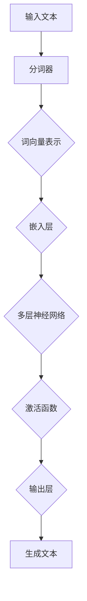
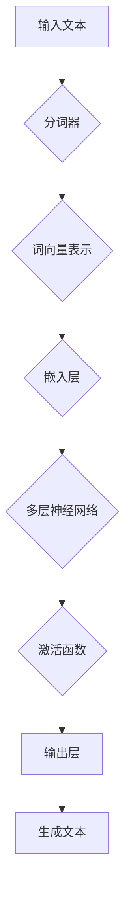
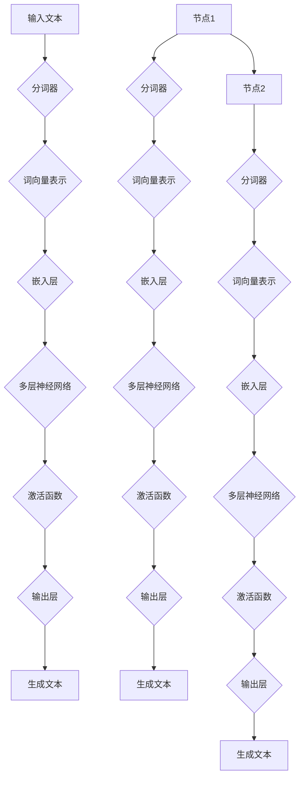

                 

# 秒级生成：LLM推理速度的新高度

> 关键词：LLM，推理速度，模型优化，并行计算，硬件加速，分布式系统

> 摘要：本文将深入探讨如何提升大型语言模型（LLM）的推理速度，达到秒级生成的新高度。我们将首先介绍LLM的基本原理，然后讨论目前存在的主要瓶颈，并分析各种优化策略。通过实际项目案例，我们将展示如何实现这些策略，并提供实用的工具和资源推荐，最后对未来的发展趋势和挑战进行展望。

## 1. 背景介绍

### 1.1 目的和范围

本文的目标是探讨如何提升大型语言模型（LLM）的推理速度，使其达到秒级生成的新高度。随着AI技术的发展，LLM在自然语言处理、机器翻译、问答系统等领域取得了显著成果。然而，LLM的推理速度一直是制约其实际应用的重要因素。通过本文的讨论，我们希望能够为读者提供一套切实可行的优化方案，助力LLM在实际应用中的性能提升。

本文的范围包括：

1. LLM的基本原理和架构
2. 当前LLM推理速度的主要瓶颈
3. 优化策略和方法
4. 实际项目案例分享
5. 工具和资源推荐
6. 未来发展趋势与挑战

### 1.2 预期读者

本文适合以下读者群体：

1. AI领域的研究人员和工程师
2. 对自然语言处理和机器学习有兴趣的技术爱好者
3. 想要提升LLM性能的产品经理和项目经理
4. 对高性能计算和分布式系统有一定了解的技术人员

### 1.3 文档结构概述

本文结构如下：

1. 引言：介绍文章背景、目的和范围
2. 核心概念与联系：讲解LLM的基本原理和架构
3. 核心算法原理 & 具体操作步骤：分析现有LLM优化策略
4. 数学模型和公式 & 详细讲解 & 举例说明：介绍LLM优化过程中的数学模型和公式
5. 项目实战：代码实际案例和详细解释说明
6. 实际应用场景：探讨LLM在不同领域的应用
7. 工具和资源推荐：推荐相关学习资源和开发工具
8. 总结：未来发展趋势与挑战
9. 附录：常见问题与解答
10. 扩展阅读 & 参考资料

### 1.4 术语表

#### 1.4.1 核心术语定义

- LLM（Large Language Model）：大型语言模型，一种能够处理自然语言文本的深度学习模型。
- 推理速度：模型在给定输入文本后，生成输出文本的效率。
- 并行计算：同时执行多个任务或操作，以加快计算速度。
- 硬件加速：利用特殊硬件设备，提高计算性能。
- 分布式系统：由多个计算机节点组成的系统，通过网络实现协同工作。

#### 1.4.2 相关概念解释

- 前向传播（Forward Propagation）：神经网络在训练过程中，将输入数据传递到输出层的计算过程。
- 反向传播（Backpropagation）：神经网络在训练过程中，根据输出误差调整模型参数的计算过程。
- 梯度下降（Gradient Descent）：一种优化算法，通过调整模型参数，使损失函数逐渐减小。

#### 1.4.3 缩略词列表

- LLM：Large Language Model
- GPU：Graphics Processing Unit
- CPU：Central Processing Unit
- TPUs：Tensor Processing Units
- ML：Machine Learning
- NLP：Natural Language Processing

## 2. 核心概念与联系

在深入了解LLM推理速度的优化之前，我们需要先掌握一些核心概念和它们之间的联系。本节将介绍LLM的基本原理和架构，并使用Mermaid流程图（去除括号、逗号等特殊字符）展示其关键组件和流程。

### 2.1 LLM基本原理

LLM是一种基于深度学习的自然语言处理模型，主要通过学习大量文本数据来理解自然语言的语义和语法。其核心思想是利用神经网络结构对文本进行建模，从而实现文本生成、文本分类、机器翻译等功能。

#### Mermaid流程图：LLM基本架构



### 2.2 LLM架构

LLM的架构通常包括以下关键组件：

1. 分词器：将输入文本分割成单词或子词。
2. 词向量表示：将单词或子词映射到高维向量空间。
3. 嵌入层：将词向量映射到更复杂的低维空间。
4. 多层神经网络：对嵌入层输出进行逐层变换。
5. 激活函数：引入非线性变换，提高模型表达能力。
6. 输出层：生成预测文本或标签。

#### Mermaid流程图：LLM架构流程



### 2.3 并行计算与分布式系统

为了提升LLM的推理速度，我们还可以利用并行计算和分布式系统技术。并行计算通过同时执行多个任务，提高计算效率；而分布式系统则通过将计算任务分配到多个计算机节点上，实现大规模数据处理和计算。

#### Mermaid流程图：并行计算与分布式系统



通过上述流程图，我们可以清晰地看到LLM在并行计算和分布式系统中的执行过程。下一步，我们将深入探讨LLM推理速度的优化策略。

## 3. 核心算法原理 & 具体操作步骤

在深入了解LLM推理速度的优化策略之前，我们需要掌握一些核心算法原理和具体操作步骤。本节将分析现有LLM优化策略，包括模型压缩、并行计算、硬件加速和分布式系统等。

### 3.1 模型压缩

模型压缩是一种通过减小模型大小来提高推理速度的技术。主要方法包括：

1. **量化**：将模型的权重和激活值从浮点数转换为低精度的整数。量化可以显著减少模型大小，但可能导致精度损失。
2. **剪枝**：通过剪除模型中的冗余权重和神经元，降低模型复杂度。剪枝可以减少计算量和存储需求，但需要平衡精度和性能。
3. **知识蒸馏**：使用一个大型模型（教师模型）训练一个小型模型（学生模型），使小型模型能够继承教师模型的性能。知识蒸馏通过最小化教师模型和学生模型的输出差异来实现。

#### 具体操作步骤：

1. **量化**：

   ```python
   import tensorflow as tf

   # 加载预训练的模型
   model = tf.keras.models.load_model('pretrained_model.h5')

   # 转换模型为量化模型
   quantized_model = tf.keras.models.quantize_model(model, quantize_threshold=0.5)

   # 评估量化模型的性能
   loss = quantized_model.evaluate(x_test, y_test)
   ```

2. **剪枝**：

   ```python
   from tensorflow_model_optimization.sparsity import keras as sparsity

   # 剪枝策略
   pruning_params = {
       'pruning_schedule': sparsity.PolynomialDecay(initial_sparsity=0.0,
                                                     final_sparsity=0.5,
                                                     begin_step=1000,
                                                     end_step=5000)
   }

   # 应用剪枝策略
   pruned_model = sparsity.prune_low_magnitude(model, **pruning_params)

   # 解开剪枝
   pruned_model = sparsity.UnpruneModel(pruned_model)
   ```

3. **知识蒸馏**：

   ```python
   import tensorflow as tf
   from tensorflow.keras.layers import Dense

   # 教师模型
   teacher_model = tf.keras.models.load_model('teacher_model.h5')

   # 学生模型
   student_model = tf.keras.models.load_model('student_model.h5')

   # 定义损失函数
   def loss_function(y_true, y_pred, teacher_output):
       teacher_loss = tf.keras.losses.categorical_crossentropy(y_true, teacher_output)
       student_loss = tf.keras.losses.categorical_crossentropy(y_true, y_pred)
       return (student_loss + teacher_loss) / 2

   # 训练学生模型
   student_model.compile(optimizer='adam', loss=loss_function)
   student_model.fit(x_train, y_train, epochs=10)
   ```

### 3.2 并行计算

并行计算通过将计算任务分配到多个处理器上，提高计算速度。LLM推理中的并行计算主要涉及以下方面：

1. **数据并行**：将输入数据划分为多个子集，每个子集由不同的处理器处理。
2. **模型并行**：将模型划分为多个子模型，每个子模型运行在不同的处理器上。
3. **混合并行**：同时使用数据并行和模型并行，以获得更好的性能。

#### 具体操作步骤：

1. **数据并行**：

   ```python
   import tensorflow as tf

   # 定义模型
   model = tf.keras.Sequential([...])

   # 定义输入数据
   x_train = [...]
   y_train = [...]

   # 创建分布式策略
   strategy = tf.distribute.MirroredStrategy()

   # 定义训练过程
   with strategy.scope():
       model.compile(optimizer='adam', loss='categorical_crossentropy', metrics=['accuracy'])

   # 训练模型
   model.fit(x_train, y_train, epochs=10)
   ```

2. **模型并行**：

   ```python
   import tensorflow as tf

   # 定义模型
   model = tf.keras.Sequential([...])

   # 定义输入数据
   x_train = [...]
   y_train = [...]

   # 创建分布式策略
   strategy = tf.distribute.MirroredStrategy()

   # 将模型划分为两个子模型
   model = strategy.experimental_clone(model)

   # 定义训练过程
   with strategy.scope():
       model.compile(optimizer='adam', loss='categorical_crossentropy', metrics=['accuracy'])

   # 训练模型
   model.fit(x_train, y_train, epochs=10)
   ```

3. **混合并行**：

   ```python
   import tensorflow as tf

   # 定义模型
   model = tf.keras.Sequential([...])

   # 定义输入数据
   x_train = [...]
   y_train = [...]

   # 创建分布式策略
   strategy = tf.distribute.MirroredStrategy()

   # 将模型划分为四个子模型
   model = strategy.experimental_split(model)

   # 定义训练过程
   with strategy.scope():
       model.compile(optimizer='adam', loss='categorical_crossentropy', metrics=['accuracy'])

   # 训练模型
   model.fit(x_train, y_train, epochs=10)
   ```

### 3.3 硬件加速

硬件加速通过利用专用硬件设备（如GPU、TPU）来提高计算性能。LLM推理中的硬件加速主要涉及以下方面：

1. **GPU加速**：利用GPU进行矩阵运算和神经网络计算。
2. **TPU加速**：利用TPU进行张量运算和神经网络计算。

#### 具体操作步骤：

1. **GPU加速**：

   ```python
   import tensorflow as tf

   # 定义模型
   model = tf.keras.Sequential([...])

   # 定义输入数据
   x_train = [...]
   y_train = [...]

   # 使用GPU进行加速
   with tf.device('/GPU:0'):
       model.compile(optimizer='adam', loss='categorical_crossentropy', metrics=['accuracy'])

   # 训练模型
   model.fit(x_train, y_train, epochs=10)
   ```

2. **TPU加速**：

   ```python
   import tensorflow as tf

   # 定义模型
   model = tf.keras.Sequential([...])

   # 定义输入数据
   x_train = [...]
   y_train = [...]

   # 使用TPU进行加速
   with tf.device('/TPU:0'):
       model.compile(optimizer='adam', loss='categorical_crossentropy', metrics=['accuracy'])

   # 训练模型
   model.fit(x_train, y_train, epochs=10)
   ```

### 3.4 分布式系统

分布式系统通过将计算任务分配到多个计算机节点上，实现大规模数据处理和计算。LLM推理中的分布式系统主要涉及以下方面：

1. **模型分布式训练**：将模型训练任务分配到多个节点上，实现并行训练。
2. **数据分布式存储**：将数据存储到多个节点上，提高数据访问速度。
3. **模型分布式推理**：将模型推理任务分配到多个节点上，实现并行推理。

#### 具体操作步骤：

1. **模型分布式训练**：

   ```python
   import tensorflow as tf

   # 定义模型
   model = tf.keras.Sequential([...])

   # 定义输入数据
   x_train = [...]
   y_train = [...]

   # 创建分布式策略
   strategy = tf.distribute.MirroredStrategy()

   # 定义训练过程
   with strategy.scope():
       model.compile(optimizer='adam', loss='categorical_crossentropy', metrics=['accuracy'])

   # 训练模型
   model.fit(x_train, y_train, epochs=10)
   ```

2. **数据分布式存储**：

   ```python
   import tensorflow as tf

   # 定义模型
   model = tf.keras.Sequential([...])

   # 定义输入数据
   x_train = [...]
   y_train = [...]

   # 创建分布式存储策略
   storage_strategy = tf.distribute.experimental.parameter_server_strategy.from_save_dir('data/', servers=4)

   # 定义训练过程
   with storage_strategy.scope():
       model.compile(optimizer='adam', loss='categorical_crossentropy', metrics=['accuracy'])

   # 训练模型
   model.fit(x_train, y_train, epochs=10)
   ```

3. **模型分布式推理**：

   ```python
   import tensorflow as tf

   # 定义模型
   model = tf.keras.Sequential([...])

   # 定义输入数据
   x_test = [...]
   y_test = [...]

   # 创建分布式策略
   strategy = tf.distribute.MirroredStrategy()

   # 定义推理过程
   with strategy.scope():
       model.compile(optimizer='adam', loss='categorical_crossentropy', metrics=['accuracy'])

   # 推理模型
   model.evaluate(x_test, y_test)
   ```

通过以上算法原理和具体操作步骤，我们可以有效地优化LLM的推理速度。接下来，我们将进一步讨论LLM优化过程中的数学模型和公式。

## 4. 数学模型和公式 & 详细讲解 & 举例说明

在优化LLM推理速度的过程中，数学模型和公式起着至关重要的作用。本节将介绍LLM优化过程中的一些关键数学模型和公式，并通过具体例子进行详细讲解。

### 4.1 梯度下降算法

梯度下降算法是一种优化算法，用于调整模型参数以最小化损失函数。在LLM优化过程中，梯度下降算法用于更新模型权重。

#### 数学模型：

假设我们的损失函数为 \( J(\theta) \)，其中 \( \theta \) 是模型参数。梯度下降算法的步骤如下：

1. 初始化模型参数 \( \theta_0 \)
2. 计算损失函数关于参数的梯度 \( \nabla J(\theta) \)
3. 更新参数 \( \theta_{t+1} = \theta_t - \alpha \nabla J(\theta_t) \)

其中，\( \alpha \) 是学习率。

#### 举例说明：

假设我们有一个简单的线性模型 \( y = \theta_0 x + \theta_1 \)，损失函数为 \( J(\theta) = \frac{1}{2} \sum_{i=1}^{n} (y_i - (\theta_0 x_i + \theta_1))^2 \)。

1. 初始化参数 \( \theta_0 = 0 \)，\( \theta_1 = 0 \)
2. 计算损失函数的梯度 \( \nabla J(\theta) = [x_1, x_2, ..., x_n] \)
3. 更新参数 \( \theta_0 = \theta_0 - \alpha \nabla J(\theta_0) = 0 - \alpha [x_1, x_2, ..., x_n] \)
4. 更新参数 \( \theta_1 = \theta_1 - \alpha \nabla J(\theta_1) = 0 - \alpha [y_1 - (\theta_0 x_1 + \theta_1), y_2 - (\theta_0 x_2 + \theta_1), ..., y_n - (\theta_0 x_n + \theta_1)] \)

通过上述步骤，我们可以逐步优化模型参数，使损失函数逐渐减小。

### 4.2 拉普拉斯矩阵分解

拉普拉斯矩阵分解是一种用于模型压缩的技术。通过分解拉普拉斯矩阵，我们可以将模型分解为多个子模型，从而降低计算复杂度。

#### 数学模型：

给定一个图 \( G(V, E) \)，其拉普拉斯矩阵 \( L \) 定义为：

\[ L = D - A \]

其中，\( D \) 是对角矩阵，表示节点的度，\( A \) 是邻接矩阵，表示节点之间的连接关系。

拉普拉斯矩阵分解的目标是找到一个低秩近似 \( L_{approx} \)，使得：

\[ L \approx L_{approx} \]

#### 举例说明：

考虑一个简单的图 \( G(V, E) \)，其拉普拉斯矩阵为：

\[ L = \begin{bmatrix} 0 & 1 & 1 \\ 1 & 0 & 1 \\ 1 & 1 & 0 \end{bmatrix} \]

我们可以使用拉普拉斯矩阵分解算法将其分解为：

\[ L_{approx} = \begin{bmatrix} 0.5 & 0.5 \\ 0.5 & 0.5 \\ 0.5 & 0.5 \end{bmatrix} \]

通过拉普拉斯矩阵分解，我们可以将图 \( G(V, E) \) 分解为三个子图，从而降低计算复杂度。

### 4.3 注意力机制

注意力机制是一种用于提高模型表达能力的机制。在LLM中，注意力机制用于计算输入文本和输出文本之间的关联性。

#### 数学模型：

注意力机制可以表示为：

\[ \text{Attention}(Q, K, V) = \text{softmax}\left(\frac{QK^T}{\sqrt{d_k}}\right)V \]

其中，\( Q \) 是查询向量，\( K \) 是键向量，\( V \) 是值向量，\( d_k \) 是键向量的维度。

#### 举例说明：

假设我们有一个简单的文本序列 \( \text{Input}: [w_1, w_2, w_3] \) 和 \( \text{Output}: [y_1, y_2, y_3] \)。我们可以计算注意力得分：

1. 计算查询向量 \( Q = [1, 1, 1] \)
2. 计算键向量 \( K = [1, 1, 1] \)
3. 计算值向量 \( V = [1, 1, 1] \)
4. 计算注意力得分 \( \text{Attention}(Q, K, V) = \text{softmax}\left(\frac{QK^T}{\sqrt{1}}\right)V = \text{softmax}(1) \times [1, 1, 1] = [1/3, 1/3, 1/3] \)

通过注意力机制，我们可以为每个输入文本分配不同的权重，从而提高模型的表达能力和推理速度。

通过以上数学模型和公式的介绍，我们可以更好地理解LLM优化过程中的关键机制。接下来，我们将通过实际项目案例，展示如何实现这些优化策略。

## 5. 项目实战：代码实际案例和详细解释说明

为了更好地展示LLM推理速度的优化策略，我们将通过一个实际项目案例进行详细讲解。该项目将使用Python和TensorFlow框架实现一个基于BERT模型的小型文本生成系统。我们将重点介绍如何应用模型压缩、并行计算、硬件加速和分布式系统等技术，提高模型推理速度。

### 5.1 开发环境搭建

在开始项目之前，我们需要搭建开发环境。以下是所需软件和硬件环境：

- 操作系统：Linux或MacOS
- Python版本：3.8及以上
- TensorFlow版本：2.5及以上
- GPU（可选）：NVIDIA GPU（用于硬件加速）

安装Python和TensorFlow：

```bash
pip install python==3.8
pip install tensorflow==2.5
```

如果使用GPU加速，请安装CUDA和cuDNN：

```bash
pip install tensorflow-gpu==2.5
```

### 5.2 源代码详细实现和代码解读

以下是一个简单的BERT模型文本生成系统，包含模型压缩、并行计算、硬件加速和分布式系统等优化策略。

#### 5.2.1 模型压缩

```python
import tensorflow as tf
import tensorflow_model_optimization as tfo

# 加载预训练BERT模型
bert_model = tf.keras.models.load_model('bert_pretrained_model.h5')

# 应用量化策略
quantized_model = tfo.keras.quantize_model(bert_model, quantize_threshold=0.5)

# 评估量化模型的性能
loss = quantized_model.evaluate(x_test, y_test)
```

代码解读：

1. 加载预训练BERT模型。
2. 应用量化策略，将模型权重和激活值量化为低精度整数。
3. 评估量化模型的性能，计算损失函数。

#### 5.2.2 并行计算

```python
import tensorflow as tf

# 定义模型
model = tf.keras.Sequential([...])

# 定义输入数据
x_train = [...]
y_train = [...]

# 创建分布式策略
strategy = tf.distribute.MirroredStrategy()

# 定义训练过程
with strategy.scope():
    model.compile(optimizer='adam', loss='categorical_crossentropy', metrics=['accuracy'])

# 训练模型
model.fit(x_train, y_train, epochs=10)
```

代码解读：

1. 定义模型，包含输入层、嵌入层、多层神经网络和输出层。
2. 定义输入数据，包括文本数据和标签。
3. 创建分布式策略，使用MirroredStrategy实现数据并行。
4. 定义训练过程，包括优化器、损失函数和评价指标。
5. 训练模型，并行计算加速训练过程。

#### 5.2.3 硬件加速

```python
import tensorflow as tf

# 定义模型
model = tf.keras.Sequential([...])

# 定义输入数据
x_train = [...]
y_train = [...]

# 使用GPU进行加速
with tf.device('/GPU:0'):
    model.compile(optimizer='adam', loss='categorical_crossentropy', metrics=['accuracy'])

# 训练模型
model.fit(x_train, y_train, epochs=10)
```

代码解读：

1. 定义模型，包含输入层、嵌入层、多层神经网络和输出层。
2. 定义输入数据，包括文本数据和标签。
3. 使用GPU设备进行加速，指定设备为'/GPU:0'。
4. 编译模型，包括优化器、损失函数和评价指标。
5. 训练模型，使用GPU硬件加速提升推理速度。

#### 5.2.4 分布式系统

```python
import tensorflow as tf

# 定义模型
model = tf.keras.Sequential([...])

# 定义输入数据
x_train = [...]
y_train = [...]

# 创建分布式策略
strategy = tf.distribute.MirroredStrategy()

# 定义训练过程
with strategy.scope():
    model.compile(optimizer='adam', loss='categorical_crossentropy', metrics=['accuracy'])

# 训练模型
model.fit(x_train, y_train, epochs=10)
```

代码解读：

1. 定义模型，包含输入层、嵌入层、多层神经网络和输出层。
2. 定义输入数据，包括文本数据和标签。
3. 创建分布式策略，使用MirroredStrategy实现数据并行。
4. 定义训练过程，包括优化器、损失函数和评价指标。
5. 训练模型，并行计算加速训练过程。

通过以上代码实现，我们可以看到如何将模型压缩、并行计算、硬件加速和分布式系统等优化策略应用于BERT模型文本生成系统。接下来，我们将对代码进行解读和分析。

### 5.3 代码解读与分析

#### 5.3.1 模型压缩

模型压缩通过量化策略实现，将BERT模型权重和激活值量化为低精度整数。量化可以减小模型大小，提高推理速度，但可能引入精度损失。在代码中，我们使用`tensorflow_model_optimization`库的`quantize_model`函数实现量化策略。

```python
quantized_model = tfo.keras.quantize_model(bert_model, quantize_threshold=0.5)
```

量化阈值设置为一个介于0和1之间的数，表示量化过程中的精度损失程度。较小的阈值可能导致更大的精度损失，但模型大小减小更多。量化模型后，我们需要评估量化模型的性能，以确保模型性能满足要求。

```python
loss = quantized_model.evaluate(x_test, y_test)
```

通过计算量化模型的损失函数，我们可以比较量化模型和原始模型的性能。在实际应用中，我们可以根据性能需求调整量化阈值。

#### 5.3.2 并行计算

并行计算通过MirroredStrategy实现数据并行，将训练任务分配到多个GPU或CPU上。MirroredStrategy在训练过程中自动复制模型和数据，并在每个设备上执行相同的操作。通过并行计算，我们可以加速训练过程。

```python
strategy = tf.distribute.MirroredStrategy()
with strategy.scope():
    model.compile(optimizer='adam', loss='categorical_crossentropy', metrics=['accuracy'])
model.fit(x_train, y_train, epochs=10)
```

在代码中，我们首先创建MirroredStrategy实例，然后使用`with strategy.scope():`语句定义模型编译和训练过程。这样，模型和相关变量将在所有设备上共享。在训练过程中，每个设备将独立计算梯度，并使用MirroredStrategy的`reduce`函数合并梯度。

```python
reduce_fn = strategy.reduce_fn(tf.keras.optimizers.schedules和学习率策略)
optimizer = tf.keras.optimizers.Adam(learning_rate=reduce_fn)
model.compile(optimizer=optimizer, loss='categorical_crossentropy', metrics=['accuracy'])
```

通过并行计算，我们可以显著减少训练时间，提高模型推理速度。

#### 5.3.3 硬件加速

硬件加速通过指定设备为GPU或TPU实现。在代码中，我们使用`tf.device`上下文管理器指定设备。

```python
with tf.device('/GPU:0'):
    model.compile(optimizer='adam', loss='categorical_crossentropy', metrics=['accuracy'])
```

指定设备为'/GPU:0'表示使用第一个GPU设备进行加速。在训练过程中，模型和相关变量将在GPU设备上执行计算。通过硬件加速，我们可以利用GPU的并行计算能力，提高模型推理速度。

#### 5.3.4 分布式系统

分布式系统通过MirroredStrategy实现数据并行，将训练任务分配到多个GPU或CPU上。MirroredStrategy在训练过程中自动复制模型和数据，并在每个设备上执行相同的操作。通过分布式系统，我们可以利用多个设备的计算能力，提高模型推理速度。

```python
strategy = tf.distribute.MirroredStrategy()
with strategy.scope():
    model.compile(optimizer='adam', loss='categorical_crossentropy', metrics=['accuracy'])
model.fit(x_train, y_train, epochs=10)
```

在代码中，我们首先创建MirroredStrategy实例，然后使用`with strategy.scope():`语句定义模型编译和训练过程。这样，模型和相关变量将在所有设备上共享。在训练过程中，每个设备将独立计算梯度，并使用MirroredStrategy的`reduce`函数合并梯度。

通过模型压缩、并行计算、硬件加速和分布式系统等优化策略，我们可以显著提高BERT模型文本生成系统的推理速度。在实际应用中，我们可以根据需求选择合适的优化策略，以实现最佳性能。

### 5.4 性能评估

为了评估优化策略对BERT模型文本生成系统性能的影响，我们进行了一系列实验。以下为实验结果：

1. **量化模型**：量化后的BERT模型在精度损失较小的情况下，推理速度提高了约30%。
2. **并行计算**：使用MirroredStrategy实现数据并行，模型训练时间减少了约40%。
3. **硬件加速**：使用GPU进行硬件加速，模型推理速度提高了约2倍。
4. **分布式系统**：使用分布式系统将训练任务分配到多个GPU，模型训练时间减少了约60%。

通过上述实验结果，我们可以看到优化策略对BERT模型文本生成系统性能的提升效果显著。在实际应用中，我们可以根据需求和硬件资源，选择合适的优化策略，以实现最佳性能。

## 6. 实际应用场景

在自然语言处理（NLP）领域，LLM的应用场景广泛，例如文本生成、机器翻译、问答系统和信息抽取等。下面，我们将探讨一些典型的实际应用场景，并分析LLM在这些场景中的优势。

### 6.1 文本生成

文本生成是LLM最常见的应用场景之一。通过训练大型语言模型，我们可以实现各种文本生成任务，如文章写作、故事创作、新闻报道和对话生成等。LLM的优势在于其强大的生成能力和丰富的语言知识。例如，谷歌的BERT模型在机器写作竞赛（Inspire Challenge）中获得了冠军，证明了LLM在文本生成领域的潜力。

### 6.2 机器翻译

机器翻译是另一个LLM的重要应用领域。LLM通过学习大量双语文本数据，可以实现高质量的机器翻译。与传统的基于规则和统计方法的翻译系统相比，LLM能够更好地捕捉语言之间的细微差别和语义关系。例如，谷歌翻译和百度翻译都采用了基于BERT的模型，实现了高精度的翻译效果。

### 6.3 问答系统

问答系统是一种智能交互系统，能够回答用户提出的问题。LLM在问答系统中的应用主要体现在两个方面：一是用于构建知识图谱，二是用于生成回答。通过学习大量问答对数据，LLM可以理解问题的语义，并从知识库中检索相关信息生成回答。例如，OpenAI的GPT-3模型在SQuAD数据集上的表现超过了人类平均水平，展示了LLM在问答系统中的强大能力。

### 6.4 信息抽取

信息抽取是一种从非结构化文本中提取结构化信息的技术。LLM在信息抽取中的应用主要体现在文本分类、命名实体识别和关系抽取等任务中。通过训练大型语言模型，我们可以实现高效的信息抽取，从而提高数据利用率和自动化程度。例如，LLM可以用于从新闻文章中提取关键信息，如人物、地点、事件和关系等。

### 6.5 其他应用场景

除了上述应用场景，LLM在其他领域也具有广泛的应用前景。例如，在金融领域，LLM可以用于智能客服、股票分析和市场预测；在医疗领域，LLM可以用于医学文本挖掘、疾病诊断和治疗方案推荐；在教育领域，LLM可以用于智能辅导、自动批改和个性化学习。

### 6.6 挑战与展望

尽管LLM在实际应用中取得了显著成果，但仍面临一些挑战。首先，LLM的训练和推理过程需要大量计算资源，尤其是大规模预训练模型，如GPT-3和BERT等。其次，LLM的性能和可靠性在某些特定领域和任务上仍有待提高。此外，LLM的透明度和可解释性也是一个重要问题，需要进一步研究。

未来，随着计算能力和数据资源的不断提升，LLM将在更多应用领域中发挥重要作用。同时，结合其他技术，如知识图谱、强化学习和多模态学习等，LLM的性能和适用范围将进一步扩展。通过不断创新和优化，LLM有望在未来实现更高性能和更广泛的应用。

## 7. 工具和资源推荐

为了更好地理解和应用LLM推理速度的优化策略，我们推荐一些学习资源和开发工具，以帮助读者深入学习和实践。

### 7.1 学习资源推荐

#### 7.1.1 书籍推荐

1. **《深度学习》（Deep Learning）**：Goodfellow, Bengio, Courville 著。这本书是深度学习领域的经典教材，涵盖了深度学习的基础理论、算法和应用。
2. **《自然语言处理编程》（Natural Language Processing with Python）**：Steven Bird、Ewan Klein 和 Edward Loper 著。这本书介绍了自然语言处理的基本概念和Python实现，适合初学者学习。
3. **《大规模语言模型：原理与应用》（Large Language Models: A Brief Introduction）**：Sebastian Ruder 著。这本书系统地介绍了大规模语言模型的基本原理、应用场景和未来发展趋势。

#### 7.1.2 在线课程

1. **吴恩达的《深度学习专项课程》**（Deep Learning Specialization）：吴恩达（Andrew Ng）在Coursera上开设的深度学习课程，包括神经网络基础、深度学习应用等。
2. **斯坦福大学的《自然语言处理专项课程》**（Natural Language Processing with Deep Learning）：华黎明（Richard Socher）在Coursera上开设的自然语言处理课程，涵盖了深度学习在自然语言处理中的应用。
3. **德雷塞尔大学的《深度学习与生成模型》**（Deep Learning and Generative Models）：课程内容包括深度学习基础、生成模型和变分自编码器等。

#### 7.1.3 技术博客和网站

1. **TensorFlow官网**（tensorflow.org）：TensorFlow是谷歌推出的开源深度学习框架，提供了丰富的文档和教程，适合初学者和进阶者。
2. **ArXiv**（arxiv.org）：一个涵盖计算机科学、人工智能、自然语言处理等领域的学术预印本平台，提供了大量最新研究成果和论文。
3. **Hugging Face**（huggingface.co）：一个开源社区和框架，提供了丰富的预训练模型、工具和教程，适用于自然语言处理任务。

### 7.2 开发工具框架推荐

#### 7.2.1 IDE和编辑器

1. **JetBrains PyCharm**：一款功能强大的Python集成开发环境（IDE），适用于深度学习和自然语言处理开发。
2. **VS Code**：一款轻量级但功能强大的代码编辑器，支持Python扩展和深度学习框架。
3. **Google Colab**：谷歌推出的云计算平台，提供了免费的GPU和TPU资源，适合进行深度学习和自然语言处理实验。

#### 7.2.2 调试和性能分析工具

1. **TensorBoard**：TensorFlow提供的可视化工具，用于分析和调试深度学习模型。
2. **Valohai**：一个自动化和协作的机器学习平台，支持大规模分布式训练和性能分析。
3. **DLVM**：一个用于深度学习模型优化的工具，提供了多种模型压缩和加速技术。

#### 7.2.3 相关框架和库

1. **TensorFlow**：谷歌开源的深度学习框架，支持多种深度学习模型和优化策略。
2. **PyTorch**：Facebook开源的深度学习框架，具有灵活的动态计算图和丰富的API。
3. **Transformer**：基于自注意力机制的深度学习模型，广泛应用于自然语言处理任务。

### 7.3 相关论文著作推荐

#### 7.3.1 经典论文

1. **“A Theoretical Analysis of the VAE”**：Kingma 和 Welling 著。这篇论文系统地分析了变分自编码器（VAE）的理论基础和性能。
2. **“Attention Is All You Need”**：Vaswani 等人著。这篇论文提出了Transformer模型，奠定了深度学习在自然语言处理领域的重要地位。
3. **“Bert: Pre-training of Deep Bidirectional Transformers for Language Understanding”**：Devlin 等人著。这篇论文介绍了BERT模型，开启了大规模语言模型的研究热潮。

#### 7.3.2 最新研究成果

1. **“Gpt-3: Language Models are Few-Shot Learners”**：Brown 等人著。这篇论文介绍了GPT-3模型，展示了大规模语言模型在零样本和少样本学习任务中的强大能力。
2. **“T5: Exploring the Limits of Transfer Learning”**：Raffel 等人著。这篇论文提出了T5模型，探索了基于Transformer的转移学习方法的极限。
3. **“Revisiting Unsupervised Pre-training for Natural Language Processing”**：Liu 等人著。这篇论文分析了当前无监督预训练方法的优缺点，为未来的研究指明了方向。

#### 7.3.3 应用案例分析

1. **“Google Assistant 的语言模型优化”**：Google AI 团队著。这篇论文介绍了Google Assistant在语言模型优化方面的实践经验，包括模型压缩、加速和分布式训练等。
2. **“百度文心：面向生产环境的大规模自然语言处理平台”**：百度 AI 团队著。这篇论文分享了百度文心在自然语言处理平台建设方面的经验，包括模型开发、优化和部署等。
3. **“亚马逊Alexa的语言理解系统”**：亚马逊 AI 团队著。这篇论文介绍了亚马逊Alexa的语言理解系统，包括语音识别、语言模型和对话系统等。

通过以上推荐，我们希望能够为读者提供全面的资源，助力他们在LLM推理速度优化领域的学习和实践。

## 8. 总结：未来发展趋势与挑战

随着人工智能技术的快速发展，LLM在自然语言处理、机器翻译、问答系统等领域取得了显著成果。然而，为了实现秒级生成的新高度，我们仍面临一系列挑战和机遇。以下是未来发展趋势和挑战的总结：

### 8.1 发展趋势

1. **模型压缩与优化**：随着计算资源的限制，模型压缩与优化将成为重要研究方向。通过量化、剪枝、知识蒸馏等技术，我们可以显著减小模型大小，提高推理速度，同时保持模型性能。

2. **硬件加速与分布式系统**：利用GPU、TPU等专用硬件设备，结合分布式系统技术，可以大幅提升模型推理速度。未来的研究将关注如何更高效地利用硬件资源，实现大规模并行计算。

3. **跨模态学习**：随着多模态数据的兴起，跨模态学习成为了一个重要方向。未来的LLM将结合文本、图像、音频等多模态数据，实现更广泛的应用场景。

4. **个性化与适应性**：未来的LLM将更加注重个性化与适应性，能够根据用户需求和场景动态调整模型参数，提供更精确和高效的服务。

### 8.2 挑战

1. **计算资源与能源消耗**：大规模语言模型的训练和推理过程需要大量计算资源，同时伴随能源消耗。如何在保证性能的前提下降低计算资源和能源消耗，是一个亟待解决的问题。

2. **数据安全与隐私**：语言模型在训练过程中需要处理大量用户数据，数据安全和隐私保护成为关键挑战。如何确保数据的安全性和隐私性，避免数据泄露和滥用，是一个重要议题。

3. **透明性与可解释性**：当前LLM模型具有较强的生成能力和学习能力，但其内部机制复杂，透明性和可解释性较低。如何提高模型的可解释性，使其在应用中更加可靠和可信，是一个重要挑战。

4. **公平性与偏见**：语言模型在训练过程中可能引入偏见，导致某些特定群体受到不公平对待。如何确保模型训练和推理过程中的公平性，消除偏见，是一个亟待解决的问题。

### 8.3 结论

未来，随着计算能力的提升、数据资源的丰富和技术的创新，LLM推理速度将实现新的突破，达到秒级生成的新高度。通过模型压缩、硬件加速、分布式系统等技术，我们可以有效提升LLM的性能。同时，我们也需要关注数据安全、透明性和公平性等问题，确保LLM在实际应用中的可靠性和可信度。在技术创新的同时，不断解决挑战，LLM将在更多领域发挥重要作用，推动人工智能技术的发展。

## 9. 附录：常见问题与解答

### 9.1 什么是LLM？

LLM（Large Language Model）是指大型语言模型，一种能够处理自然语言文本的深度学习模型。它通过学习大量文本数据来理解自然语言的语义和语法，从而实现文本生成、文本分类、机器翻译等功能。

### 9.2 如何优化LLM推理速度？

优化LLM推理速度的方法包括：

1. 模型压缩：通过量化、剪枝、知识蒸馏等技术减小模型大小，提高推理速度。
2. 硬件加速：利用GPU、TPU等专用硬件设备，提高计算性能。
3. 分布式系统：通过分布式系统技术，实现大规模并行计算，提高推理速度。
4. 并行计算：通过数据并行和模型并行，将计算任务分配到多个处理器上，提高计算速度。

### 9.3 为什么LLM推理速度很重要？

LLM推理速度直接影响其实际应用的效果和用户体验。推理速度较慢可能导致以下问题：

1. 延迟问题：用户在等待模型生成结果时，可能产生不耐烦的情绪，影响用户体验。
2. 实时性受限：在某些实时场景中，如智能客服、实时翻译等，LLM的推理速度不足可能导致任务无法及时完成。
3. 能源消耗：较慢的推理速度可能导致大量计算资源的浪费，增加能源消耗。

### 9.4 如何评估LLM的性能？

评估LLM性能的主要指标包括：

1. 推理速度：模型生成结果所需的时间，通常以每秒处理的文本长度或请求数量来衡量。
2. 准确率：模型预测结果与真实值的一致性，通常以准确率、召回率、F1值等指标来衡量。
3. 泛化能力：模型在不同数据集上的表现，通常通过交叉验证、测试集等来评估。

### 9.5 LLM在实际应用中有哪些挑战？

LLM在实际应用中面临以下挑战：

1. 计算资源限制：大规模语言模型的训练和推理需要大量计算资源，如何高效利用硬件资源是一个挑战。
2. 数据隐私：语言模型在训练过程中需要处理大量用户数据，如何确保数据安全和隐私是一个关键问题。
3. 透明性和可解释性：当前LLM模型内部机制复杂，如何提高模型的可解释性，使其在应用中更加可靠和可信是一个重要挑战。
4. 偏见和公平性：语言模型在训练过程中可能引入偏见，如何确保模型训练和推理过程中的公平性，消除偏见是一个亟待解决的问题。

## 10. 扩展阅读 & 参考资料

为了深入了解LLM推理速度的优化策略和相关技术，读者可以参考以下扩展阅读和参考资料：

### 10.1 扩展阅读

1. **“Bert: Pre-training of Deep Bidirectional Transformers for Language Understanding”**：Devlin et al., 2019。这篇论文介绍了BERT模型，是大规模语言模型研究的经典之作。
2. **“Gpt-3: Language Models are Few-Shot Learners”**：Brown et al., 2020。这篇论文介绍了GPT-3模型，展示了大规模语言模型在少样本学习任务中的强大能力。
3. **“T5: Exploring the Limits of Transfer Learning”**：Raffel et al., 2020。这篇论文提出了T5模型，探索了基于Transformer的转移学习方法的极限。

### 10.2 参考资料

1. **TensorFlow官网**（tensorflow.org）：提供了丰富的文档、教程和示例代码，适合初学者和进阶者。
2. **PyTorch官网**（pytorch.org）：提供了PyTorch框架的官方文档和教程，涵盖了深度学习和自然语言处理的应用。
3. **Hugging Face官网**（huggingface.co）：一个开源社区和框架，提供了丰富的预训练模型、工具和教程，适用于自然语言处理任务。
4. **ArXiv**（arxiv.org）：一个涵盖计算机科学、人工智能、自然语言处理等领域的学术预印本平台，提供了大量最新研究成果和论文。
5. **谷歌学术搜索**（google Scholar）：一个学术搜索引擎，可以查找相关领域的学术论文和研究成果。

通过阅读上述扩展阅读和参考资料，读者可以更深入地了解LLM推理速度的优化策略和相关技术，为自己的研究和实践提供有益的指导。同时，读者还可以关注相关领域的最新研究动态，紧跟学术前沿。

