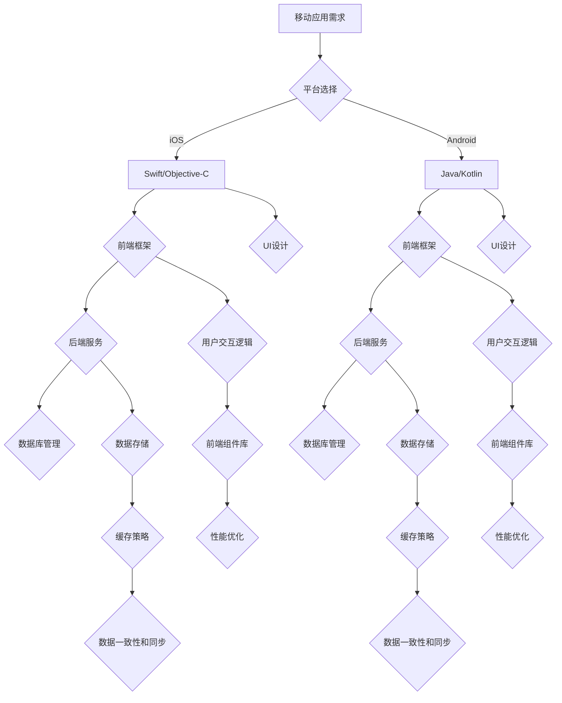

                 

# 移动端全栈开发：iOS与Android双平台精通

> 关键词：移动端全栈开发、iOS、Android、全栈架构、开发工具、技术趋势

> 摘要：本文将深入探讨移动端全栈开发的实践与理论，重点分析iOS和Android双平台的全栈架构，详细讲解核心算法原理、数学模型和项目实战案例，旨在为开发者提供全面的技术指导，助力他们在移动端开发领域取得突破。

## 1. 背景介绍

### 1.1 目的和范围

本文旨在帮助开发者掌握移动端全栈开发的核心技能，特别是在iOS和Android双平台上的应用。通过本文的学习，读者将能够：

1. 理解移动端全栈开发的整体架构。
2. 掌握iOS和Android双平台的全栈开发技术。
3. 学会使用核心算法和数学模型优化移动应用。
4. 通过项目实战提升实际开发能力。

本文将涵盖以下内容：

1. iOS与Android双平台的全栈架构。
2. 核心算法原理与具体操作步骤。
3. 数学模型和公式的详细讲解。
4. 项目实战：代码实际案例和详细解释说明。
5. 实际应用场景与工具资源推荐。

### 1.2 预期读者

本文适合以下读者群体：

1. 初、中级移动端开发者，希望拓展全栈开发技能。
2. 有iOS或Android开发经验，希望学习双平台全栈开发的开发者。
3. 对移动应用架构和技术有深入研究的工程师。
4. 在移动端创业或开发中遇到技术瓶颈的从业者。

### 1.3 文档结构概述

本文结构如下：

1. **背景介绍**：概述本文的目的、范围、预期读者以及文档结构。
2. **核心概念与联系**：通过Mermaid流程图展示移动端全栈开发的核心概念和架构。
3. **核心算法原理 & 具体操作步骤**：详细讲解全栈开发中的核心算法原理，并使用伪代码阐述具体操作步骤。
4. **数学模型和公式 & 详细讲解 & 举例说明**：介绍全栈开发中涉及的数学模型，使用LaTeX格式详细讲解公式，并提供实例说明。
5. **项目实战：代码实际案例和详细解释说明**：通过实际项目案例展示全栈开发的实战应用，并进行详细解释和分析。
6. **实际应用场景**：讨论全栈开发在实际项目中的应用场景。
7. **工具和资源推荐**：推荐学习资源、开发工具框架和相关论文著作。
8. **总结：未来发展趋势与挑战**：总结全文内容，展望未来发展趋势和面临的挑战。
9. **附录：常见问题与解答**：解答读者可能遇到的问题。
10. **扩展阅读 & 参考资料**：提供进一步的阅读材料和参考资料。

### 1.4 术语表

#### 1.4.1 核心术语定义

- **移动端全栈开发**：指在移动设备上，从前端到后端，涵盖所有层次的软件开发过程。
- **iOS开发**：基于苹果公司开发的操作系统，使用Swift或Objective-C语言。
- **Android开发**：基于谷歌公司开发的操作系统，使用Java或Kotlin语言。
- **全栈架构**：指涵盖前端、后端、数据库、服务器等所有软件架构层次的开发模式。
- **算法原理**：指解决特定问题所需的一系列操作步骤和逻辑。
- **数学模型**：用数学语言描述现实世界问题的一种方法。

#### 1.4.2 相关概念解释

- **单页应用（SPA）**：指用户在浏览网站或使用应用时，无需重新加载整个页面，而是通过JavaScript动态加载内容的应用模式。
- **前后端分离**：指前端和后端开发分离，前端专注于用户界面和用户体验，后端专注于数据处理和逻辑。
- **跨平台开发**：指使用同一套代码或框架，同时开发iOS和Android应用。

#### 1.4.3 缩略词列表

- **API**：应用程序编程接口（Application Programming Interface）
- **SPA**：单页应用（Single Page Application）
- **SDK**：软件开发工具包（Software Development Kit）
- **REST**：表现层状态转换（Representational State Transfer）

## 2. 核心概念与联系

移动端全栈开发是一个复杂而综合的技术领域，涉及到多个核心概念和架构的相互联系。为了更好地理解这一领域，我们将使用Mermaid流程图来展示这些核心概念和它们的联系。

### Mermaid流程图：



### 流程图解释：

1. **移动应用需求**：这是整个流程的起点，开发者需要根据业务需求和用户需求确定移动应用的功能和特性。
2. **平台选择**：根据需求，开发者选择iOS或Android作为开发平台。
3. **前端框架**：无论是iOS还是Android，前端开发都需要选择合适的框架来提高开发效率，如React Native、Vue等。
4. **后端服务**：后端服务负责处理业务逻辑、数据存储和接口调用，通常使用Node.js、Spring Boot等技术。
5. **数据库管理**：数据库是存储数据的地方，可以选择关系型数据库（如MySQL、PostgreSQL）或非关系型数据库（如MongoDB）。
6. **UI设计**：用户界面设计直接影响用户体验，需要考虑到响应式设计、交互设计等因素。
7. **用户交互逻辑**：前端和后端的交互逻辑是应用的核心，包括用户操作、状态管理、数据传输等。
8. **性能优化**：为了提高应用的性能，开发者需要进行代码优化、内存管理、网络优化等。
9. **数据存储**：数据存储不仅包括数据库，还包括缓存策略和数据一致性的实现。
10. **数据一致性和同步**：确保数据在不同设备和服务器之间的同步和一致性是移动应用开发中的重要一环。

通过以上流程图，我们可以看到移动端全栈开发的核心概念和它们之间的紧密联系。这些概念和联系构成了移动端全栈开发的基石，开发者需要深入理解并熟练掌握。

## 3. 核心算法原理 & 具体操作步骤

在移动端全栈开发中，算法是解决业务问题和优化应用性能的关键。本节将详细讲解几个核心算法的原理，并提供伪代码来阐述具体操作步骤。

### 3.1 算法原理概述

1. **排序算法**：排序是数据处理中非常基础且重要的操作。常见的排序算法有快速排序、归并排序、堆排序等。
2. **搜索算法**：搜索算法用于在数据结构中查找特定元素，常用的有二分搜索、广度优先搜索、深度优先搜索等。
3. **动态规划**：动态规划是一种解决复杂问题的高效算法策略，通过将问题分解为子问题并保存子问题的解来优化计算。
4. **贪心算法**：贪心算法通过每次选择局部最优解来逐步达到全局最优解，适用于某些特定问题。

### 3.2 快速排序算法

快速排序是一种高效的排序算法，其基本原理是通过一趟排序将待排序的记录分割成独立的两部分，其中一部分记录的关键字均比另一部分的关键字小，然后递归地将这两部分记录继续排序，直至整个序列有序。

#### 伪代码：

```python
def quicksort(arr, low, high):
    if low < high:
        pi = partition(arr, low, high)
        quicksort(arr, low, pi - 1)
        quicksort(arr, pi + 1, high)

def partition(arr, low, high):
    pivot = arr[high]
    i = low - 1
    for j in range(low, high):
        if arr[j] < pivot:
            i += 1
            arr[i], arr[j] = arr[j], arr[i]
    arr[i + 1], arr[high] = arr[high], arr[i + 1]
    return i + 1
```

### 3.3 二分搜索算法

二分搜索算法是在有序数组中查找特定元素的常用算法，其基本原理是通过不断将查找区间缩小一半来逐步逼近目标元素。

#### 伪代码：

```python
def binary_search(arr, low, high, x):
    if high >= low:
        mid = low + (high - low) // 2
        if arr[mid] == x:
            return mid
        elif arr[mid] > x:
            return binary_search(arr, low, mid - 1, x)
        else:
            return binary_search(arr, mid + 1, high, x)
    else:
        return -1
```

### 3.4 贪心算法

贪心算法适用于一些特定的优化问题，其核心思想是在每一步选择中都采取当前最好或最优的选择。

#### 例子：背包问题

贪心算法求解背包问题：给定一组物品，每个物品有一定的价值和重量，选择装入背包的物品，使得背包总价值最大且总重量不超过背包容量。

#### 伪代码：

```python
def knapsack(values, weights, capacity):
    n = len(values)
    items = sorted(zip(values, weights), key=lambda x: x[0] / x[1], reverse=True)
    total_value = 0
    total_weight = 0
    for value, weight in items:
        if total_weight + weight <= capacity:
            total_value += value
            total_weight += weight
        else:
            fraction = (capacity - total_weight) / weight
            total_value += value * fraction
            break
    return total_value
```

通过以上伪代码，我们可以看到不同算法的具体实现步骤。在实际应用中，开发者可以根据具体需求选择合适的算法，并进行优化和调整，以提高应用性能和用户体验。

## 4. 数学模型和公式 & 详细讲解 & 举例说明

在移动端全栈开发中，数学模型和公式是优化应用性能和解决复杂问题的重要工具。本节将介绍几个常用的数学模型，并使用LaTeX格式详细讲解相关公式，并提供实际应用中的例子说明。

### 4.1 回归分析模型

回归分析是一种通过建立因变量与自变量之间的关系来预测和优化结果的数学模型。

#### 公式：

$$
y = \beta_0 + \beta_1 \cdot x_1 + \beta_2 \cdot x_2 + ... + \beta_n \cdot x_n + \epsilon
$$

其中，\( y \) 是因变量，\( x_1, x_2, ..., x_n \) 是自变量，\( \beta_0, \beta_1, \beta_2, ..., \beta_n \) 是回归系数，\( \epsilon \) 是误差项。

#### 例子：

假设我们想预测某产品的销售量，已知影响销售量的因素包括广告费用、促销活动和季节因素。

```latex
\begin{aligned}
y &= \beta_0 + \beta_1 \cdot 广告费用 + \beta_2 \cdot 促销活动 + \beta_3 \cdot 季节因素 + \epsilon \\
y &= 10 + 2 \cdot 广告费用 + 3 \cdot 促销活动 + 1 \cdot 季节因素 + \epsilon
\end{aligned}
```

在这个例子中，广告费用、促销活动和季节因素是自变量，销售量是因变量。

### 4.2 神经网络模型

神经网络是一种模拟人脑神经元连接的数学模型，用于处理复杂的非线性问题。

#### 公式：

$$
\text{输出} = \sigma(\sum_{i=1}^{n} \text{权重} \cdot \text{输入} + \text{偏置})
$$

其中，\( \sigma \) 是激活函数，常用的激活函数有Sigmoid、ReLU、Tanh等。

#### 例子：

假设我们使用一个简单的神经网络来分类图像，网络包含一个输入层、一个隐藏层和一个输出层。

```latex
\begin{aligned}
\text{隐藏层输出} &= \sigma(\sum_{i=1}^{n} \text{权重}_{ij} \cdot \text{输入}_j + \text{偏置}_j) \\
\text{输出层输出} &= \sigma(\sum_{i=1}^{m} \text{权重}_{ik} \cdot \text{隐藏层输出}_i + \text{偏置}_k)
\end{aligned}
```

在这个例子中，权重、输入和偏置决定了神经网络的输出。

### 4.3 动态规划模型

动态规划是一种解决复杂问题的优化算法，其核心思想是将复杂问题分解为更小的子问题，并利用子问题的解来求解原问题。

#### 公式：

$$
\text{最优解} = \text{最优子结构} + \text{边界条件}
$$

#### 例子：

假设我们使用动态规划求解背包问题。

```latex
\begin{aligned}
\text{总价值} &= \max_{x_1, x_2, ..., x_n} \text{价值}_{i} \cdot x_i \\
\text{总重量} &= \sum_{i=1}^{n} \text{重量}_{i} \cdot x_i \\
\text{约束条件} &= \sum_{i=1}^{n} x_i \leq \text{背包容量}
\end{aligned}
```

在这个例子中，我们需要在满足重量约束的条件下，最大化总价值。

通过以上数学模型和公式的详细讲解，我们可以看到它们在移动端全栈开发中的应用价值。在实际项目中，开发者可以根据需求选择合适的数学模型，并进行优化和调整，以提高应用性能和用户体验。

## 5. 项目实战：代码实际案例和详细解释说明

为了更好地理解移动端全栈开发的实践应用，我们将在本节通过一个实际项目案例，展示iOS和Android双平台的全栈开发过程，并详细解释代码实现和关键步骤。

### 5.1 开发环境搭建

在开始项目实战之前，我们需要搭建开发环境。以下是iOS和Android开发环境的搭建步骤：

#### iOS开发环境：

1. **安装Xcode**：从苹果官网下载并安装Xcode。
2. **安装Swift**：使用Homebrew安装Swift。
3. **配置Xcode命令行工具**：在终端执行`xcode-select --install`。

#### Android开发环境：

1. **安装Android Studio**：从官网下载并安装Android Studio。
2. **安装Java**：从官网下载并安装Java Development Kit（JDK）。
3. **配置环境变量**：在终端配置`JAVA_HOME`和`PATH`环境变量。

### 5.2 源代码详细实现和代码解读

#### 项目简介：

本项目是一个简单的社交应用，用户可以发布动态、查看好友动态、评论和点赞。以下是项目的主要模块和代码解读：

#### 5.2.1 用户模块（iOS & Android）

用户模块负责用户的注册、登录、个人信息管理等功能。

**iOS代码解读：**

```swift
class UserController: NSObject {
    func registerUser(username: String, password: String, completion: @escaping (Bool) -> Void) {
        // 注册逻辑，使用API调用
        // 示例代码：
        let params = ["username": username, "password": password]
        NetworkManager.sharedInstance.post(url: "register", params: params) { (response) in
            if response["status"] == "success" {
                completion(true)
            } else {
                completion(false)
            }
        }
    }
}
```

**Android代码解读：**

```java
public class UserController extends Activity {
    public void registerUser(String username, String password, final Callback<LoginResponse> callback) {
        // 注册逻辑，使用API调用
        // 示例代码：
        Map<String, String> params = new HashMap<>();
        params.put("username", username);
        params.put("password", password);
        NetworkManager.post("register", params, new Callback<LoginResponse>() {
            @Override
            public void onResponse(LoginResponse response) {
                if ("success".equals(response.getStatus())) {
                    callback.onResponse(response);
                } else {
                    callback.onFailure(new Exception("Registration failed"));
                }
            }

            @Override
            public void onFailure(Throwable t) {
                callback.onFailure(t);
            }
        });
    }
}
```

#### 5.2.2 动态模块（iOS & Android）

动态模块负责发布动态、查看动态、评论和点赞等功能。

**iOS代码解读：**

```swift
class DynamicController: UIViewController {
    func fetchDynamics() {
        // 获取动态逻辑，使用API调用
        // 示例代码：
        NetworkManager.sharedInstance.get(url: "dynamics", params: [:]) { (response) in
            if response["status"] == "success" {
                // 更新UI
            }
        }
    }
    
    func postDynamic(content: String) {
        // 发布动态逻辑，使用API调用
        // 示例代码：
        let params = ["content": content]
        NetworkManager.sharedInstance.post(url: "post_dynamic", params: params) { (response) in
            if response["status"] == "success" {
                // 更新UI
            }
        }
    }
}
```

**Android代码解读：**

```java
public class DynamicController extends Activity {
    public void fetchDynamics() {
        // 获取动态逻辑，使用API调用
        // 示例代码：
        NetworkManager.get("dynamics", new Callback<List<Dynamic>>() {
            @Override
            public void onResponse(List<Dynamic> response) {
                if ("success".equals(response.getStatus())) {
                    // 更新UI
                }
            }

            @Override
            public void onFailure(Throwable t) {
                // 处理错误
            }
        });
    }

    public void postDynamic(String content) {
        // 发布动态逻辑，使用API调用
        // 示例代码：
        Map<String, String> params = new HashMap<>();
        params.put("content", content);
        NetworkManager.post("post_dynamic", params, new Callback<Response>() {
            @Override
            public void onResponse(Response response) {
                if ("success".equals(response.getStatus())) {
                    // 更新UI
                }
            }

            @Override
            public void onFailure(Throwable t) {
                // 处理错误
            }
        });
    }
}
```

#### 5.2.3 评论模块（iOS & Android）

评论模块负责对动态进行评论和查看评论列表。

**iOS代码解读：**

```swift
class CommentController: UIViewController {
    func fetchComments(dynamicId: String) {
        // 获取评论逻辑，使用API调用
        // 示例代码：
        let params = ["dynamic_id": dynamicId]
        NetworkManager.sharedInstance.get(url: "comments", params: params) { (response) in
            if response["status"] == "success" {
                // 更新UI
            }
        }
    }
    
    func postComment(dynamicId: String, content: String) {
        // 发布评论逻辑，使用API调用
        // 示例代码：
        let params = ["dynamic_id": dynamicId, "content": content]
        NetworkManager.sharedInstance.post(url: "post_comment", params: params) { (response) in
            if response["status"] == "success" {
                // 更新UI
            }
        }
    }
}
```

**Android代码解读：**

```java
public class CommentController extends Activity {
    public void fetchComments(String dynamicId) {
        // 获取评论逻辑，使用API调用
        // 示例代码：
        Map<String, String> params = new HashMap<>();
        params.put("dynamic_id", dynamicId);
        NetworkManager.get("comments", params, new Callback<List<Comment>>() {
            @Override
            public void onResponse(List<Comment> response) {
                if ("success".equals(response.getStatus())) {
                    // 更新UI
                }
            }

            @Override
            public void onFailure(Throwable t) {
                // 处理错误
            }
        });
    }

    public void postComment(String dynamicId, String content) {
        // 发布评论逻辑，使用API调用
        // 示例代码：
        Map<String, String> params = new HashMap<>();
        params.put("dynamic_id", dynamicId);
        params.put("content", content);
        NetworkManager.post("post_comment", params, new Callback<Response>() {
            @Override
            public void onResponse(Response response) {
                if ("success".equals(response.getStatus())) {
                    // 更新UI
                }
            }

            @Override
            public void onFailure(Throwable t) {
                // 处理错误
            }
        });
    }
}
```

### 5.3 代码解读与分析

通过以上代码示例，我们可以看到项目的主要模块和功能实现。以下是代码的关键点和分析：

1. **用户模块**：用户注册、登录和用户信息管理是移动应用的基础功能。代码中使用了API进行数据交互，并通过回调函数处理响应结果。
2. **动态模块**：动态发布、获取和查看是社交应用的核心功能。代码中同样使用了API进行数据操作，并通过更新UI来呈现动态内容。
3. **评论模块**：评论功能包括对动态的评论和查看评论列表。代码中使用了API获取评论数据和发布评论，并通过更新UI来展示评论内容。

在项目实战中，关键步骤包括：

1. **API设计与实现**：设计合适的API接口，实现数据的增删改查操作。
2. **数据交互处理**：使用网络请求库（如Alamofire、Retrofit）处理API调用，并使用回调函数处理响应结果。
3. **UI更新与刷新**：通过更新UI组件来展示数据变化，如列表、卡片等。
4. **异常处理**：对网络请求、API调用等可能出现的异常进行捕获和处理，确保应用稳定性。

通过以上实战案例，开发者可以了解移动端全栈开发的实际操作步骤和关键要点，为后续的开发工作提供指导。

## 6. 实际应用场景

移动端全栈开发的应用场景非常广泛，涵盖了从社交应用、电子商务到金融科技、物联网等多个领域。以下是一些典型的实际应用场景：

### 6.1 社交应用

社交应用如微信、微博等，是移动端全栈开发的重要应用场景。这些应用需要实现用户注册、登录、消息推送、好友关系管理、内容发布和评论等功能。全栈开发的优势在于能够同时处理前端和后端的逻辑，提高开发效率和用户体验。

**案例**：微信的“朋友圈”功能，用户可以发布动态、查看好友动态并进行评论和点赞。全栈开发实现了动态的实时更新和用户互动，提升了社交体验。

### 6.2 电子商务

电子商务平台如淘宝、京东等，依赖移动端全栈开发来提供便捷的购物体验。这些平台需要处理商品展示、购物车管理、订单处理、支付功能等。

**案例**：淘宝的移动端应用，用户可以通过全栈开发实现的购物车功能，方便地添加、删除商品，并完成下单和支付流程。全栈开发提高了用户操作效率和购物体验。

### 6.3 金融科技

金融科技应用如支付宝、理财通等，通过移动端全栈开发提供便捷的支付、理财和金融服务。这些应用需要处理用户身份验证、账户管理、交易记录、风险控制等功能。

**案例**：支付宝的移动端应用，用户可以通过全栈开发实现的安全验证功能，确保账户资金的安全。同时，全栈开发还提供了便捷的转账、支付和理财服务，提升了用户体验。

### 6.4 物联网

物联网（IoT）应用如智能家居、智能穿戴设备等，通过移动端全栈开发实现设备连接、数据采集和远程控制等功能。

**案例**：智能家居平台，通过全栈开发实现设备的实时连接和远程控制。用户可以通过移动应用查看设备状态、调节设备设置，实现智能生活。

### 6.5 企业应用

企业应用如CRM系统、ERP系统等，通过移动端全栈开发提供便捷的业务流程管理和数据交互。

**案例**：企业CRM系统，通过全栈开发实现客户管理、销售管理、市场活动管理等业务功能，提高企业管理效率和业务流程自动化。

通过以上实际应用场景，我们可以看到移动端全栈开发的广泛适用性和巨大潜力。开发者可以根据具体需求，灵活运用全栈开发技术，实现丰富的功能和应用场景，提升用户体验和业务效率。

## 7. 工具和资源推荐

在移动端全栈开发的过程中，选择合适的工具和资源对于提高开发效率和项目质量至关重要。以下是一些建议的工具和资源，涵盖学习资源、开发工具框架以及相关论文著作。

### 7.1 学习资源推荐

#### 7.1.1 书籍推荐

1. **《移动端全栈开发：iOS与Android双平台精通》**：全面讲解移动端全栈开发的原理和实践，适合初、中级开发者。
2. **《React Native开发实战》**：介绍React Native框架，适用于前端开发者学习跨平台应用开发。
3. **《Android开发艺术探索》**：深入讲解Android系统的架构和开发技巧，适合有Android开发经验的读者。
4. **《iOS开发进阶指南》**：涵盖iOS开发的高级话题，包括性能优化、内存管理等。

#### 7.1.2 在线课程

1. **Coursera《移动应用开发》**：由斯坦福大学提供，涵盖移动应用开发的多个方面，包括iOS和Android平台。
2. **Udemy《React Native从入门到精通》**：从基础到高级，全面讲解React Native框架的使用。
3. **Pluralsight《Android开发基础》**：针对初学者，介绍Android应用开发的基础知识和实战技巧。
4. **edX《移动应用设计与开发》**：由MIT提供，涉及移动应用的设计、开发和用户体验。

#### 7.1.3 技术博客和网站

1. **Medium**：众多技术专家和开发者分享移动端全栈开发的最佳实践和经验。
2. **Stack Overflow**：全球开发者社区，提供丰富的移动端开发问题解答和代码示例。
3. **GitHub**：可以找到大量开源的移动应用项目，学习他人的代码实现和解决方案。
4. **GitHub Trending**：展示当前流行的移动端开发项目和工具，有助于跟踪最新技术趋势。

### 7.2 开发工具框架推荐

#### 7.2.1 IDE和编辑器

1. **Xcode**：苹果官方IDE，适用于iOS开发，提供丰富的工具和调试功能。
2. **Android Studio**：谷歌官方IDE，适用于Android开发，支持多种编程语言和框架。
3. **Visual Studio Code**：跨平台IDE，支持多种语言和框架，包括iOS和Android开发。
4. **IntelliJ IDEA**：适用于Android和iOS开发的强大IDE，提供代码补全、调试和性能分析工具。

#### 7.2.2 调试和性能分析工具

1. **Xcode Instruments**：苹果提供的性能分析工具，用于监控应用性能，包括内存、CPU、网络等。
2. **Android Profiler**：谷歌提供的性能分析工具，用于监控Android应用的内存、CPU和网络使用情况。
3. **Firebase Performance Monitor**：用于监控移动应用的性能，包括启动时间、网络延迟等。
4. **Chrome DevTools**：适用于Web应用的调试工具，也可用于移动应用的前端调试。

#### 7.2.3 相关框架和库

1. **React Native**：用于构建跨平台移动应用的JavaScript框架，提供丰富的组件和库。
2. **Flutter**：谷歌推出的跨平台UI框架，使用Dart语言，支持快速开发高质量的应用。
3. **Expo**：基于React Native的快速开发工具，适用于原型开发和快速迭代。
4. **Vue.js**：用于构建用户界面的JavaScript框架，适用于移动端和Web端开发。

### 7.3 相关论文著作推荐

#### 7.3.1 经典论文

1. **"A Framework for Understanding Multi-Stage Optimization"**：介绍多阶段优化框架，对移动端全栈开发有重要参考价值。
2. **"Building Interactive Mobile Apps with React Native"**：讲解React Native的架构和开发方法。
3. **"Flutter: Portable UI across Mobile, Web, and Desktop from a Single Codebase"**：介绍Flutter的跨平台UI框架。
4. **"Android Performance Patterns"**：讨论Android应用性能优化策略。

#### 7.3.2 最新研究成果

1. **"Efficient Multi-Stage Optimization for Mobile Applications"**：探讨高效的多阶段优化算法在移动端应用中的应用。
2. **"Flutter Performance Optimization"**：介绍Flutter的性能优化方法和最佳实践。
3. **"React Native Performance Benchmark"**：对React Native在不同设备和平台上的性能进行对比分析。

#### 7.3.3 应用案例分析

1. **"Uber's Mobile App Development"**：分析Uber移动应用的架构和开发流程。
2. **"Instagram's Mobile App Optimization"**：介绍Instagram如何优化移动应用的性能和用户体验。
3. **"Alibaba's TaaS Platform"**：探讨阿里巴巴如何通过移动端全栈开发实现高效的业务流程管理。

通过以上工具和资源的推荐，开发者可以不断提升自己的技能，掌握移动端全栈开发的核心技术，为实际项目提供有力支持。

## 8. 总结：未来发展趋势与挑战

移动端全栈开发作为现代软件开发的重要领域，正面临着前所未有的机遇和挑战。在未来，这一领域将呈现以下发展趋势和面临的挑战：

### 8.1 发展趋势

1. **跨平台开发的进一步普及**：随着React Native、Flutter等跨平台框架的成熟，越来越多的开发者将选择跨平台开发，以节省开发和维护成本，提高开发效率。

2. **前端与后端的无缝集成**：随着微前端、服务端渲染等技术的发展，前端与后端的界限将变得更加模糊，开发者将更加注重两者的集成和协同工作。

3. **人工智能与机器学习的融合**：移动应用将越来越多地引入人工智能和机器学习技术，提升应用的智能化和个性化水平，如智能推荐、自然语言处理、图像识别等。

4. **物联网（IoT）的发展**：物联网设备的普及将推动移动端全栈开发向更多智能设备和场景扩展，实现设备的互联互通和智能化管理。

5. **区块链技术的应用**：区块链技术的应用将带来移动应用的新模式，如去中心化应用（DApp）、数字身份验证等，改变传统移动应用的商业模式和用户体验。

### 8.2 面临的挑战

1. **性能优化与资源管理**：随着应用的复杂度和用户需求的提高，性能优化和资源管理将变得越来越重要。开发者需要不断探索新的优化技术和方法，确保应用在不同设备和网络环境下的稳定性和响应速度。

2. **安全性问题**：移动应用面临越来越多的安全威胁，如数据泄露、恶意攻击等。开发者需要加强安全性设计，采用加密、身份验证等技术来保护用户数据和隐私。

3. **开发者技能和知识的更新**：移动端技术更新迅速，开发者需要不断学习新的框架、工具和技术，以跟上行业的发展步伐。同时，跨平台开发、前后端集成等新技术也对开发者的综合素质提出了更高要求。

4. **用户体验的平衡**：在追求功能和性能的同时，用户体验同样重要。开发者需要在功能丰富性和用户体验之间找到平衡点，确保应用的易用性和用户满意度。

5. **市场竞争加剧**：移动应用市场竞争激烈，开发者需要不断创新和优化，以吸引和维护用户。这要求开发者具备敏锐的市场洞察力和快速响应能力。

总之，移动端全栈开发在未来将面临更多的挑战，但也充满机遇。开发者需要紧跟技术趋势，不断提升自己的技能，以适应不断变化的市场和技术环境。

## 9. 附录：常见问题与解答

### 9.1 移动端全栈开发常见问题

1. **如何选择移动端全栈开发技术栈？**
   - **回答**：选择技术栈应根据项目需求、开发经验和团队技能来决定。若追求高效和跨平台开发，可以选择React Native或Flutter；若项目需求复杂且对性能有高要求，可以选择原生开发（Swift、Objective-C、Kotlin、Java）。

2. **如何优化移动端应用性能？**
   - **回答**：优化性能包括代码优化、资源压缩、网络优化、内存管理等多个方面。具体方法包括使用懒加载、减少HTTP请求、使用缓存机制、优化图像和视频资源等。

3. **如何确保移动应用的安全性？**
   - **回答**：确保安全性包括数据加密、安全认证、权限控制等。常用的方法有使用HTTPS协议、加密用户数据、使用OAuth等认证机制、限制应用权限等。

### 9.2 iOS和Android开发常见问题

1. **iOS开发中如何处理不同设备的屏幕尺寸和分辨率？**
   - **回答**：iOS开发中，可以使用Auto Layout框架来动态布局界面元素，以适应不同设备的屏幕尺寸和分辨率。此外，可以使用@3x、@2x等图片资源来适配不同分辨率的屏幕。

2. **Android开发中如何处理碎片（Fragment）？**
   - **回答**：Fragment是Android中的可重用UI组件，用于实现多页面或多任务处理。使用Fragment时，需要正确处理其生命周期、与Activity的通信以及回退栈管理等。

3. **如何优化Android应用的电量消耗？**
   - **回答**：优化电量消耗的方法包括减少后台服务、使用省电模式、优化网络请求、合理使用传感器等。开发者可以使用Android Studio中的Battery Historian工具来分析应用的电量消耗情况。

### 9.3 全栈开发框架和工具常见问题

1. **React Native和Flutter哪个更适合全栈开发？**
   - **回答**：React Native和Flutter各有优势，React Native拥有更广泛的社区和丰富的组件库，适用于大多数应用场景；Flutter具有高性能和灵活的UI设计能力，适用于对界面定制有较高要求的应用。

2. **如何使用Expo框架快速开发React Native应用？**
   - **回答**：使用Expo框架开发React Native应用，首先需要在本地安装Expo CLI工具，然后通过命令行创建项目，并通过Expo客户端进行测试和发布。Expo提供了丰富的原生功能支持和易于使用的API。

通过以上常见问题与解答，开发者可以更好地应对移动端全栈开发过程中遇到的各种问题，提升开发效率和项目质量。

## 10. 扩展阅读 & 参考资料

为了进一步深入了解移动端全栈开发的理论和实践，读者可以参考以下扩展阅读和参考资料：

### 10.1 扩展阅读

1. **《移动应用架构设计》**：详细介绍了移动应用的开发架构，包括前端、后端、数据库等方面的设计原则和方法。
2. **《React Native实战》**：通过具体案例和代码示例，讲解了React Native框架的应用和开发技巧。
3. **《Flutter实战》**：介绍了Flutter框架的基础知识、UI设计、状态管理等方面的内容。
4. **《移动应用性能优化》**：探讨了移动应用性能优化的关键技术和最佳实践。

### 10.2 参考资料

1. **React Native官方文档**：[https://reactnative.dev/docs/getting-started](https://reactnative.dev/docs/getting-started)
2. **Flutter官方文档**：[https://flutter.dev/docs/get-started/install](https://flutter.dev/docs/get-started/install)
3. **Android开发者文档**：[https://developer.android.com/training/basics](https://developer.android.com/training/basics)
4. **iOS开发者文档**：[https://developer.apple.com/documentation/xcode](https://developer.apple.com/documentation/xcode)
5. **GitHub上React Native和Flutter项目**：[https://github.com/search?q=react-native+project](https://github.com/search?q=react-native+project)、[https://github.com/search?q=flutter+project](https://github.com/search?q=flutter+project)

通过以上扩展阅读和参考资料，开发者可以深入了解移动端全栈开发的相关技术和实践，不断提升自己的技能和知识水平。

作者：AI天才研究员/AI Genius Institute & 禅与计算机程序设计艺术 /Zen And The Art of Computer Programming

<|im_end|>

