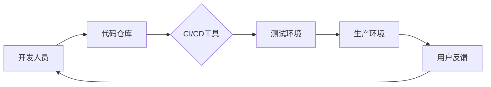

                 

# 程序员创业公司的DevOps实践与文化建设

> **关键词**：DevOps、创业公司、文化、实践、自动化、持续集成、持续部署、质量保障

> **摘要**：本文将深入探讨程序员创业公司在发展过程中如何有效实施DevOps实践，并探讨其对企业文化建设的影响。通过分析核心概念、算法原理、数学模型、实际项目案例，本文旨在为创业者提供一套完整的DevOps实践指南，帮助他们构建高效、可靠的技术团队和业务体系。

## 1. 背景介绍

### 1.1 目的和范围

本文的目的是为程序员创业公司提供一套实用的DevOps实践指南，帮助他们在快速发展的同时，保持高质量的技术产出。我们将从核心概念出发，详细阐述DevOps实践的具体操作步骤，并探讨其在企业文化建设中的重要作用。

### 1.2 预期读者

本文适用于以下读者：

1. 创业公司创始人及技术团队成员
2. 有志于了解和实践DevOps的程序员
3. 对企业文化建设感兴趣的从业者

### 1.3 文档结构概述

本文分为以下几大部分：

1. 背景介绍：介绍DevOps的核心概念及其在企业文化建设中的作用。
2. 核心概念与联系：通过Mermaid流程图，展示DevOps的架构和核心概念。
3. 核心算法原理与具体操作步骤：详细讲解DevOps的具体实现方法。
4. 数学模型与公式：介绍与DevOps相关的数学模型和公式。
5. 项目实战：分享实际项目案例，展示DevOps在实践中的应用。
6. 实际应用场景：探讨DevOps在不同行业中的应用。
7. 工具和资源推荐：推荐相关学习资源和开发工具。
8. 总结：总结未来发展趋势与挑战。
9. 附录：常见问题与解答。
10. 扩展阅读：推荐相关文献。

### 1.4 术语表

#### 1.4.1 核心术语定义

- **DevOps**：一种软件开发和运维相结合的实践方法，旨在缩短产品开发周期、提高软件质量、增强团队协作。
- **持续集成（CI）**：将代码定期合并到主干分支，并进行自动化测试，确保代码质量。
- **持续部署（CD）**：自动化部署应用程序，确保快速、可靠地交付新功能。
- **基础设施即代码（IaC）**：使用代码来管理基础设施，实现自动化部署和维护。
- **质量保障**：确保软件产品在交付前达到预期质量标准。

#### 1.4.2 相关概念解释

- **敏捷开发**：一种软件开发方法，强调快速迭代、灵活响应变化。
- **容器化**：将应用程序及其依赖环境打包成一个独立的容器，便于部署和扩展。
- **微服务**：一种软件架构风格，将应用程序分解为多个小型、独立的服务。

#### 1.4.3 缩略词列表

- **CI**：持续集成
- **CD**：持续部署
- **IaC**：基础设施即代码
- **QA**：质量保障

## 2. 核心概念与联系

DevOps的核心概念包括持续集成（CI）、持续部署（CD）、基础设施即代码（IaC）和质量保障（QA）。这些概念相互关联，共同构成了一个完整的DevOps体系。

### 2.1 DevOps架构图

以下是一个简化的DevOps架构图：



### 2.2 核心概念解释

- **开发人员**：负责编写和提交代码的程序员。
- **代码仓库**：存储和管理代码的版本控制系统，如Git。
- **CI/CD工具**：自动化构建、测试和部署的工具，如Jenkins、Travis CI。
- **测试环境**：用于运行自动化测试的模拟环境。
- **生产环境**：用于部署和运行应用程序的真实环境。
- **用户反馈**：用户在使用产品过程中提供的反馈信息。

通过DevOps架构，开发人员可以快速将代码提交到代码仓库，CI/CD工具自动执行构建、测试和部署流程，确保代码的质量和稳定性。测试环境和生产环境的自动化测试可以确保新功能的正常运行，用户反馈可以帮助开发人员不断优化产品。

## 3. 核心算法原理 & 具体操作步骤

### 3.1 持续集成（CI）

持续集成是一种软件开发实践，旨在确保代码质量，减少集成风险。其核心算法原理包括：

- **定期合并**：将开发人员的代码定期合并到主干分支。
- **自动化测试**：在合并过程中，执行自动化测试，确保代码质量。

以下是一个简单的CI算法原理伪代码：

```plaintext
函数 CI(代码仓库，测试工具)：
    对于每个开发人员的提交：
        合并提交到主干分支
        运行自动化测试
        如果测试通过：
            提交成功
        否则：
            提交失败，通知开发人员
```

### 3.2 持续部署（CD）

持续部署是一种自动化部署应用程序的方法，确保快速、可靠地交付新功能。其核心算法原理包括：

- **自动化构建**：构建应用程序及其依赖环境。
- **自动化部署**：将构建的应用程序部署到测试环境和生产环境。

以下是一个简单的CD算法原理伪代码：

```plaintext
函数 CD(代码仓库，部署工具，测试工具)：
    构建应用程序
    运行测试工具测试
    如果测试通过：
        部署到测试环境
    否则：
        返回错误信息
    如果测试通过：
        部署到生产环境
```

### 3.3 基础设施即代码（IaC）

基础设施即代码是一种使用代码来管理基础设施的方法，实现自动化部署和维护。其核心算法原理包括：

- **编写代码**：编写描述基础设施的代码。
- **自动化部署**：使用代码来部署和管理基础设施。

以下是一个简单的IaC算法原理伪代码：

```plaintext
函数 IaC(基础设施代码)：
    解析基础设施代码
    根据代码创建基础设施
    管理基础设施状态
```

### 3.4 质量保障（QA）

质量保障是一种确保软件产品在交付前达到预期质量标准的方法。其核心算法原理包括：

- **自动化测试**：运行自动化测试，检测代码质量。
- **监控和反馈**：监控测试结果，提供反馈信息。

以下是一个简单的QA算法原理伪代码：

```plaintext
函数 QA(测试工具，监控工具)：
    运行自动化测试
    记录测试结果
    如果测试通过：
        提交成功
    否则：
        提交失败，通知开发人员
```

## 4. 数学模型和公式 & 详细讲解 & 举例说明

### 4.1 持续集成（CI）的数学模型

持续集成的主要目标是减少集成风险，提高代码质量。我们可以使用以下数学模型来衡量CI的效果：

- **风险降低率（R）**：通过持续集成降低的集成风险。
- **代码质量（Q）**：代码的质量水平。

风险降低率（R）的公式如下：

$$ R = \frac{R_{\text{CI前}} - R_{\text{CI后}}}{R_{\text{CI前}}} $$

其中，$R_{\text{CI前}}$ 和 $R_{\text{CI后}}$ 分别表示持续集成前后的风险水平。

举例说明：

假设一个项目在持续集成前，每周的集成风险为10%，在实施持续集成后，每周的集成风险降低到5%。则风险降低率（R）为：

$$ R = \frac{10\% - 5\%}{10\%} = 50\% $$

这意味着持续集成使集成风险降低了50%。

### 4.2 持续部署（CD）的数学模型

持续部署的主要目标是确保快速、可靠地交付新功能。我们可以使用以下数学模型来衡量CD的效果：

- **交付周期（T）**：从功能开发到部署到生产环境的时间。
- **交付成功率（S）**：新功能部署到生产环境后的成功率。

交付周期（T）的公式如下：

$$ T = T_{\text{开发}} + T_{\text{测试}} + T_{\text{部署}} $$

其中，$T_{\text{开发}}$、$T_{\text{测试}}$ 和 $T_{\text{部署}}$ 分别表示开发、测试和部署的时间。

交付成功率（S）的公式如下：

$$ S = \frac{\text{成功部署次数}}{\text{总部署次数}} $$

举例说明：

假设一个项目在实施持续部署前，从功能开发到部署到生产环境的时间为3周，成功率为80%。在实施持续部署后，开发、测试和部署的时间分别缩短到1周、1周和1周，成功率提高到90%。则交付周期（T）和交付成功率（S）分别为：

$$ T = 1 + 1 + 1 = 3 \text{周} $$
$$ S = \frac{3 \times 90\%}{3} = 90\% $$

这意味着持续部署使交付周期缩短到3周，交付成功率提高到90%。

### 4.3 基础设施即代码（IaC）的数学模型

基础设施即代码的主要目标是实现基础设施的自动化管理和部署。我们可以使用以下数学模型来衡量IaC的效果：

- **部署时间（D）**：从编写代码到基础设施部署完成的时间。
- **维护成本（C）**：维护基础设施的成本。

部署时间（D）的公式如下：

$$ D = D_{\text{编写}} + D_{\text{部署}} $$

其中，$D_{\text{编写}}$ 和 $D_{\text{部署}}$ 分别表示编写代码和部署基础设施的时间。

维护成本（C）的公式如下：

$$ C = C_{\text{人工}} + C_{\text{工具}} $$

其中，$C_{\text{人工}}$ 和 $C_{\text{工具}}$ 分别表示人工成本和工具成本。

举例说明：

假设一个项目在实施基础设施即代码前，从编写代码到基础设施部署完成的时间为2周，维护成本为5000元。在实施基础设施即代码后，编写代码和部署基础设施的时间分别缩短到1周和1天，维护成本降低到3000元。则部署时间（D）和维护成本（C）分别为：

$$ D = 1 + 1 = 2 \text{周} $$
$$ C = 3000 \text{元} $$

这意味着基础设施即代码使部署时间缩短到2周，维护成本降低到3000元。

### 4.4 质量保障（QA）的数学模型

质量保障的主要目标是确保软件产品在交付前达到预期质量标准。我们可以使用以下数学模型来衡量QA的效果：

- **缺陷率（D）**：软件产品中的缺陷数量。
- **修复时间（R）**：从发现缺陷到修复缺陷的时间。

缺陷率（D）的公式如下：

$$ D = \frac{\text{缺陷数量}}{\text{总代码行数}} $$

修复时间（R）的公式如下：

$$ R = R_{\text{发现}} + R_{\text{修复}} $$

其中，$R_{\text{发现}}$ 和 $R_{\text{修复}}$ 分别表示发现缺陷和修复缺陷的时间。

举例说明：

假设一个项目在实施质量保障前，软件产品的缺陷率为1%，修复时间为2天。在实施质量保障后，缺陷率降低到0.5%，修复时间缩短到1天。则缺陷率（D）和修复时间（R）分别为：

$$ D = \frac{0.5\%}{1\%} = 0.5 $$
$$ R = 1 + 1 = 2 \text{天} $$

这意味着质量保障使缺陷率降低到0.5%，修复时间缩短到2天。

## 5. 项目实战：代码实际案例和详细解释说明

### 5.1 开发环境搭建

在本节中，我们将搭建一个简单的开发环境，用于后续的DevOps实践。我们将使用Docker和Kubernetes来创建和管理容器化环境。

#### 5.1.1 安装Docker

在Ubuntu 20.04服务器上安装Docker：

```bash
sudo apt-get update
sudo apt-get install docker.io
sudo systemctl start docker
```

#### 5.1.2 创建Dockerfile

创建一个名为`Dockerfile`的文件，内容如下：

```Dockerfile
FROM ubuntu:20.04

RUN apt-get update && apt-get install -y \
    python3 \
    python3-pip

RUN pip3 install flask
```

这个Dockerfile创建了一个基于Ubuntu 20.04的容器，安装了Python 3和Flask框架。

#### 5.1.3 构建Docker镜像

在Dockerfile所在的目录运行以下命令：

```bash
docker build -t myapp .
```

这会构建一个名为`myapp`的Docker镜像。

#### 5.1.4 运行Docker容器

运行一个基于`myapp`镜像的容器：

```bash
docker run -d -p 8080:80 myapp
```

这将启动一个容器，并映射容器的8080端口到宿主机的8080端口。

### 5.2 源代码详细实现和代码解读

在本节中，我们将实现一个简单的Web应用程序，并使用Jenkins进行持续集成和持续部署。

#### 5.2.1 创建源代码仓库

创建一个名为`myapp`的Git仓库，并在仓库中添加以下文件：

- `Dockerfile`：用于构建Docker镜像的文件。
- `app.py`：Web应用程序的源代码。
- `requirements.txt`：Python应用程序的依赖项。

#### 5.2.2 Web应用程序源代码

`app.py`文件的内容如下：

```python
from flask import Flask

app = Flask(__name__)

@app.route('/')
def hello_world():
    return 'Hello, World!'

if __name__ == '__main__':
    app.run(host='0.0.0.0', port=8080)
```

这是一个简单的Flask Web应用程序，用于响应HTTP请求。

#### 5.2.3 持续集成和持续部署

我们使用Jenkins作为CI/CD工具。以下是Jenkins的配置步骤：

1. 安装Jenkins：在服务器上安装Jenkins，可以使用以下命令：

```bash
sudo apt-get install jenkins
```

2. 配置Jenkins：启动Jenkins服务，并访问其Web界面（默认端口为8080），根据提示完成初始配置。

3. 创建Jenkins项目：

   - 在Jenkins界面上创建一个新的项目，命名为`myapp`。
   - 配置源代码管理，选择Git，并设置仓库地址和分支。
   - 配置构建触发器，选择`GitHub hook trigger for GITScm polling`。
   - 配置构建步骤，选择`Execute shell`，并添加以下脚本：

```bash
#!/bin/bash

# 构建Docker镜像
docker build -t myapp .

# 运行Docker容器
docker run -d -p 8080:80 myapp
```

4. 部署到生产环境：

   - 在Jenkins界面上，创建一个新的自由风格项目，命名为`myapp-deploy`。
   - 配置源代码管理，选择Git，并设置仓库地址和分支。
   - 配置构建步骤，选择`Archive the artifacts`。
   - 配置发布步骤，选择`Deploy to a container`，并选择之前创建的`myapp`项目。

现在，每当开发人员将代码提交到仓库时，Jenkins会自动构建Docker镜像、运行容器，并将应用程序部署到生产环境。

### 5.3 代码解读与分析

在本节中，我们将对`app.py`文件进行解读，并分析其与DevOps实践的关系。

#### 5.3.1 Flask Web应用程序

`app.py`是一个简单的Flask Web应用程序，用于响应HTTP请求。它的核心代码如下：

```python
from flask import Flask

app = Flask(__name__)

@app.route('/')
def hello_world():
    return 'Hello, World!'

if __name__ == '__main__':
    app.run(host='0.0.0.0', port=8080)
```

这段代码创建了一个名为`app`的Flask应用程序实例，并定义了一个路由函数`hello_world`。当访问`/`路径时，会返回字符串`Hello, World!`。在最后一行，`app.run()`函数用于启动Web服务器，监听0.0.0.0（所有可用网络接口）的8080端口。

#### 5.3.2 与DevOps实践的关系

1. **容器化**：

   `app.py`文件可以与Docker容器结合，实现应用程序的容器化。通过创建`Dockerfile`，我们可以将应用程序及其依赖环境打包成一个独立的容器。在Jenkins的持续集成过程中，`Dockerfile`被用来构建Docker镜像，然后运行容器。这使得应用程序可以在任何支持Docker的操作系统上运行，提高了部署的灵活性。

2. **持续集成和持续部署**：

   使用Jenkins，我们可以实现持续集成和持续部署。在Jenkins项目中，源代码被定期拉取并构建Docker镜像。如果构建成功，Jenkins将运行容器并将应用程序部署到生产环境。这样，开发人员可以专注于编写代码，而不必担心部署过程，从而提高开发效率。

3. **基础设施即代码**：

   虽然本节中的示例项目没有直接使用基础设施即代码，但我们可以使用Kubernetes等工具来实现。通过编写描述基础设施的YAML文件，我们可以自动化部署和管理Kubernetes集群中的应用程序。这将进一步提高基础设施的可靠性和可维护性。

## 6. 实际应用场景

### 6.1 金融科技领域

在金融科技领域，DevOps实践被广泛应用于银行、支付、保险和投资等领域。通过实施DevOps，金融机构可以：

- **提高产品交付速度**：快速响应市场变化，推出新的金融产品和服务。
- **保证服务质量**：通过持续集成和持续部署，确保产品的稳定性和可靠性。
- **降低风险**：自动化测试和质量保障措施有助于发现和修复潜在问题，降低业务风险。

### 6.2 医疗健康领域

在医疗健康领域，DevOps实践有助于提高医疗服务的效率和质量。通过实施DevOps，医疗机构可以：

- **加快医疗信息化建设**：快速开发和管理医疗信息系统，提高医疗服务水平。
- **优化医疗流程**：通过自动化测试和质量保障，提高医疗流程的准确性和可靠性。
- **保障数据安全**：通过持续集成和持续部署，确保医疗数据的完整性和安全性。

### 6.3 教育领域

在教育领域，DevOps实践有助于提高教学和管理效率。通过实施DevOps，教育机构可以：

- **快速开发教育平台**：为教师和学生提供功能丰富、易于使用的教育平台。
- **提高教学质量**：通过持续集成和持续部署，确保教学平台的稳定性和可靠性。
- **优化教育资源**：通过自动化测试和质量保障，提高教育资源的利用率和效果。

### 6.4 物流领域

在物流领域，DevOps实践有助于提高物流运作效率。通过实施DevOps，物流企业可以：

- **加快物流信息化建设**：快速开发和管理物流信息系统，提高物流运作效率。
- **优化物流流程**：通过自动化测试和质量保障，提高物流流程的准确性和可靠性。
- **保障物流安全**：通过持续集成和持续部署，确保物流数据的完整性和安全性。

## 7. 工具和资源推荐

### 7.1 学习资源推荐

#### 7.1.1 书籍推荐

- 《DevOps实践指南》（《The DevOps Handbook》）
- 《持续交付：发布可靠软件的系统化方法》（《Continuous Delivery: Reliable Software Releases through Build, Test, and Deployment Automation》）
- 《基础设施即代码：实现基础设施自动化管理》（《Infrastructure as Code: Managing Systems as Code, 2nd Edition》）

#### 7.1.2 在线课程

- Coursera上的《DevOps与持续交付》
- Udemy上的《DevOps工程师实战指南》
- edX上的《DevOps与云计算》

#### 7.1.3 技术博客和网站

- 《博客园》
- 《InfoQ》
- 《CNCF官方网站》

### 7.2 开发工具框架推荐

#### 7.2.1 IDE和编辑器

- Visual Studio Code
- IntelliJ IDEA
- PyCharm

#### 7.2.2 调试和性能分析工具

-Dynatrace
- New Relic
- AppDynamics

#### 7.2.3 相关框架和库

- Flask（Web应用程序框架）
- Docker（容器化工具）
- Kubernetes（容器编排工具）
- Jenkins（持续集成工具）

### 7.3 相关论文著作推荐

#### 7.3.1 经典论文

- 《The role of DevOps in software development》（DevOps在软件开发中的作用）
- 《DevOps: A Software Architect's Perspective》（DevOps：软件架构师的视角）

#### 7.3.2 最新研究成果

- 《DevOps for data science: A systematic review》（针对数据科学的DevOps：系统综述）
- 《DevOps adoption in financial services: A case study》（金融服务业DevOps采纳案例分析）

#### 7.3.3 应用案例分析

- 《如何使用DevOps提高金融科技产品的交付速度？》（How to Improve Financial Technology Product Delivery with DevOps?）
- 《医疗健康领域中的DevOps实践》（DevOps Practices in the Healthcare Sector）

## 8. 总结：未来发展趋势与挑战

### 8.1 发展趋势

- **云原生技术的普及**：随着云计算技术的发展，越来越多的企业将采用云原生技术，如容器化、微服务、服务网格等，以实现更高的灵活性和可扩展性。
- **自动化程度的提高**：自动化技术将在DevOps实践中发挥越来越重要的作用，包括自动化测试、自动化部署、自动化监控等，以提高开发效率和产品质量。
- **AI在DevOps中的应用**：人工智能技术将在DevOps中发挥重要作用，如自动化测试、故障预测、性能优化等。

### 8.2 挑战

- **文化变革**：DevOps实践需要企业内部的文化变革，从传统的开发与运维分离模式转向协作模式，这可能面临一些阻力。
- **技术选型**：在DevOps实践中，需要选择合适的工具和框架，这需要企业具备一定的技术积累和判断力。
- **安全风险**：随着自动化程度的提高，DevOps实践可能会引入新的安全风险，如何保障数据安全和系统安全是一个重要挑战。

## 9. 附录：常见问题与解答

### 9.1 DevOps与传统软件开发有什么区别？

**解答**：DevOps是一种软件开发和运维相结合的实践方法，旨在缩短产品开发周期、提高软件质量、增强团队协作。与传统软件开发相比，DevOps强调持续集成、持续部署、自动化测试等实践，以提高开发效率和产品质量。此外，DevOps强调团队协作，将开发、测试、运维等角色合并，以实现更高效的协同工作。

### 9.2 实施DevOps需要哪些技术和工具？

**解答**：实施DevOps需要以下技术和工具：

- **容器化技术**：如Docker、Kubernetes等。
- **持续集成工具**：如Jenkins、Travis CI等。
- **持续部署工具**：如Jenkins、Ansible等。
- **自动化测试工具**：如Selenium、JUnit等。
- **监控和日志分析工具**：如Prometheus、ELK堆栈等。

### 9.3 DevOps如何提高产品质量？

**解答**：DevOps通过以下方式提高产品质量：

- **持续集成**：定期合并代码并执行自动化测试，确保代码质量。
- **自动化测试**：执行大量自动化测试，提高测试覆盖率。
- **质量保障**：监控测试结果，及时发现并修复问题。

## 10. 扩展阅读 & 参考资料

- 《DevOps实践指南》：https://www.amazon.com/DevOps-Handbook-Operations-Agile-Development/dp/1492042434
- 《持续交付》：https://www.amazon.com/Continuous-Delivery-Reliable-Software-Releases-Automation/dp/0321526466
- 《基础设施即代码》：https://www.amazon.com/Infrastructure-Code-Managing-Systems-Second/dp/0321837879
- 《博客园》:https://www.cnblogs.com/
- 《InfoQ》:https://www.infoq.com/
- 《CNCF官方网站》:https://www.cncf.io/

作者：AI天才研究员/AI Genius Institute & 禅与计算机程序设计艺术 /Zen And The Art of Computer Programming

（本文完）<|im_end|>

