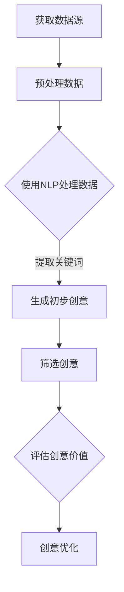
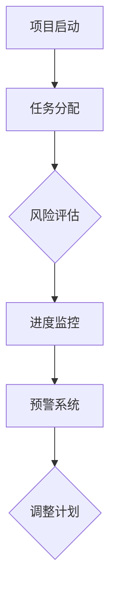
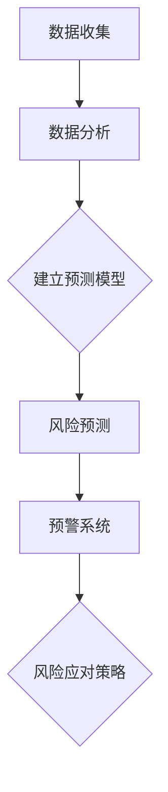
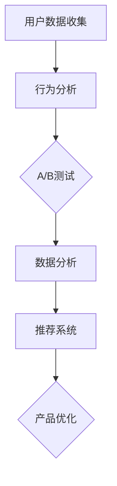

                 

# 程序员创业者的AI驱动创新管理：从创意孵化到产品落地的全周期把控

## 关键词
- 程序员创业者
- AI驱动创新
- 创意孵化
- 产品落地
- 全周期把控

## 摘要
本文旨在探讨程序员创业者如何利用人工智能技术驱动创新管理，从创意孵化到产品落地的全周期进行高效把控。通过深入分析AI在创意生成、项目管理、风险评估、产品优化等方面的应用，本文将为程序员创业者提供一套系统化的AI驱动创新管理策略，助力他们成功实现技术创新和商业价值。

## 1. 背景介绍

### 1.1 目的和范围
本文的目标是帮助程序员创业者了解如何利用人工智能技术优化创新管理过程，提升产品开发效率和市场竞争力。文章将涵盖AI在创意孵化、项目管理、风险评估、产品优化等环节的具体应用，为创业者提供实战指导。

### 1.2 预期读者
本文适合以下读者群体：
- 程序员创业者
- 产品经理
- 技术经理
- 创新管理从业者

### 1.3 文档结构概述
本文分为以下几个部分：
1. 背景介绍：阐述文章目的、预期读者和文档结构。
2. 核心概念与联系：介绍AI驱动创新管理的关键概念和架构。
3. 核心算法原理 & 具体操作步骤：讲解AI在创新管理中的算法原理和操作步骤。
4. 数学模型和公式 & 详细讲解 & 举例说明：阐述AI在创新管理中的数学模型和公式，并进行实例分析。
5. 项目实战：提供实际代码案例和详细解释。
6. 实际应用场景：分析AI驱动创新管理的应用场景。
7. 工具和资源推荐：推荐学习资源和开发工具。
8. 总结：探讨未来发展趋势与挑战。
9. 附录：常见问题与解答。
10. 扩展阅读 & 参考资料：提供进一步学习资料。

### 1.4 术语表

#### 1.4.1 核心术语定义
- **程序员创业者**：具有编程背景，同时具备创业精神，致力于利用技术实现商业价值的创业者。
- **AI驱动创新管理**：利用人工智能技术优化创新过程，包括创意生成、项目管理、风险评估和产品优化等。
- **创意孵化**：从零到一的创意构思和开发过程。
- **产品落地**：将创新创意转化为实际产品的过程。

#### 1.4.2 相关概念解释
- **人工智能（AI）**：模拟、延伸和扩展人的智能的理论、方法、技术及应用。
- **创新管理**：组织内推动创新活动，管理创新过程和资源，实现创新成果的系统化方法。

#### 1.4.3 缩略词列表
- **AI**：人工智能
- **PM**：产品经理
- **CTO**：首席技术官

## 2. 核心概念与联系

在探讨程序员创业者的AI驱动创新管理之前，我们需要了解以下几个核心概念及其相互关系。

### 2.1 创意生成

创意生成是创新管理过程的第一步，其核心在于如何高效地产生和筛选创意。在AI驱动的创新管理中，创意生成通常依赖于以下技术：

- **自然语言处理（NLP）**：通过分析大量文本数据，提取潜在的创新点。
- **深度学习**：利用神经网络模型，模拟人类思维方式，自动生成创意。

下面是一个简单的Mermaid流程图，展示了创意生成的过程：



### 2.2 项目管理

在创意生成之后，项目经理需要将创意转化为实际的产品。AI在项目管理中的应用主要包括：

- **自动化任务分配**：根据团队成员的技能和项目需求，自动分配任务。
- **风险评估**：利用数据分析和预测模型，识别潜在风险并制定应对策略。
- **进度监控**：实时监控项目进度，预测潜在延期。

下面是一个简单的Mermaid流程图，展示了AI在项目管理中的应用：



### 2.3 风险评估

风险评估是创新管理中至关重要的一环。AI在风险评估中的应用主要包括：

- **数据分析**：通过分析历史数据和实时数据，识别潜在风险。
- **预测模型**：利用机器学习算法，预测风险发生的可能性。
- **预警系统**：在风险发生前发出警报，提醒团队采取应对措施。

下面是一个简单的Mermaid流程图，展示了AI在风险评估中的应用：



### 2.4 产品优化

在产品落地后，AI还可以用于产品优化，以提高用户体验和市场竞争力。具体应用包括：

- **用户行为分析**：通过分析用户行为数据，优化产品功能和界面设计。
- **A/B测试**：利用AI算法，自动进行A/B测试，选择最佳设计方案。
- **个性化推荐**：根据用户偏好，自动推荐相关产品或内容。

下面是一个简单的Mermaid流程图，展示了AI在产品优化中的应用：



通过以上核心概念的介绍，我们可以看出，AI驱动创新管理不仅涵盖了创意生成、项目管理、风险评估和产品优化，而且各个部分之间相互联系，共同构成了一个完整的创新管理生态系统。

## 3. 核心算法原理 & 具体操作步骤

在了解了AI驱动创新管理的基本概念后，我们接下来将深入探讨其中的核心算法原理，并详细讲解具体操作步骤。

### 3.1 创意生成算法

创意生成的核心算法通常是基于深度学习和自然语言处理技术。以下是一个简单的创意生成算法的伪代码示例：

```python
# 初始化神经网络模型
model = NeuralNetwork()

# 加载预处理后的数据集
data = PreprocessData()

# 训练神经网络模型
model.fit(data)

# 生成初步创意
def generate_idea():
    # 随机选择一个关键词
    keyword = random_word()
    # 使用神经网络模型生成创意
    idea = model.predict(keyword)
    return idea

# 筛选创意
def filter_ideas(ideas):
    # 根据创意的可行性、创新性和商业价值进行筛选
    valid_ideas = []
    for idea in ideas:
        if EvaluateIdea(idea):
            valid_ideas.append(idea)
    return valid_ideas

# 评估创意价值
def EvaluateIdea(idea):
    # 根据预设的评估标准，计算创意的价值分数
    value = CalculateValue(idea)
    return value > threshold

# 优化创意
def optimize_idea(idea):
    # 根据用户反馈和数据分析，进一步优化创意
    optimized_idea = OptimizeIdea(idea)
    return optimized_idea
```

### 3.2 项目管理算法

在项目管理中，AI算法主要用于任务分配、进度监控和风险预测。以下是一个简单的项目管理算法的伪代码示例：

```python
# 任务分配算法
def assign_task(employee, task):
    # 根据员工的技能和任务需求，分配任务
    if CheckSkill(employee, task):
        employee.current_task = task
        return True
    return False

# 进度监控算法
def monitor_progress(project):
    # 实时监控项目进度，预测潜在延期
    progress = GetProgress(project)
    if progress < threshold:
        SendAlert(project)
    return progress

# 风险预测算法
def predict_risk(project):
    # 分析历史数据和实时数据，预测潜在风险
    risks = GetRisks(project)
    if risks:
        SendAlert(project)
    return risks
```

### 3.3 风险评估算法

在风险评估中，AI算法主要用于数据分析、预测模型建立和预警系统。以下是一个简单的风险评估算法的伪代码示例：

```python
# 数据分析算法
def analyze_data(data):
    # 分析历史数据和实时数据，识别潜在风险
    risks = IdentifyRisks(data)
    return risks

# 建立预测模型
def build_predict_model(data):
    # 利用机器学习算法，建立预测模型
    model = MachineLearningModel()
    model.train(data)
    return model

# 风险预测算法
def predict_risk(model, current_data):
    # 使用预测模型，预测风险发生的可能性
    risk_probability = model.predict(current_data)
    if risk_probability > threshold:
        SendAlert()
    return risk_probability
```

### 3.4 产品优化算法

在产品优化中，AI算法主要用于用户行为分析、A/B测试和个性化推荐。以下是一个简单的产品优化算法的伪代码示例：

```python
# 用户行为分析算法
def analyze_user_behavior(data):
    # 分析用户行为数据，优化产品功能和界面设计
    improvements = IdentifyImprovements(data)
    return improvements

# A/B测试算法
def ab_test(version_a, version_b, users):
    # 自动进行A/B测试，选择最佳设计方案
    results = TestVersions(version_a, version_b, users)
    best_version = SelectBestVersion(results)
    return best_version

# 个性化推荐算法
def personalized_recommendation(user_profile, items):
    # 根据用户偏好，自动推荐相关产品或内容
    recommendations = RecommendItems(user_profile, items)
    return recommendations
```

通过以上算法原理和具体操作步骤的讲解，我们可以看到，AI驱动创新管理不仅仅是一个概念，而是可以通过一系列具体的算法和技术手段来实现的。这些算法和技术手段的应用，不仅提高了创新管理的效率和准确性，也为程序员创业者提供了强大的技术支持。

## 4. 数学模型和公式 & 详细讲解 & 举例说明

在AI驱动创新管理中，数学模型和公式起着至关重要的作用。以下将详细讲解几个关键的数学模型，并使用LaTeX格式进行展示，同时结合实例进行说明。

### 4.1 创意生成中的词向量模型

词向量模型是一种将自然语言中的单词转换为向量的方法，常用的模型有Word2Vec、GloVe等。以下是一个使用Word2Vec模型的简单示例：

```latex
$$
\textbf{v}_w = \text{Word2Vec}(\text{word}, \text{corpus})
$$
```

**实例**：假设我们使用GloVe模型对“创新”和“技术”这两个词进行建模，得到的词向量分别为\(\textbf{v}_{\text{创新}}\)和\(\textbf{v}_{\text{技术}}\)。我们可以通过计算这两个词向量的余弦相似度来判断它们的相关性：

```latex
$$
\text{similarity} = \frac{\textbf{v}_{\text{创新}} \cdot \textbf{v}_{\text{技术}}}{||\textbf{v}_{\text{创新}}|| \cdot ||\textbf{v}_{\text{技术}}||}
$$
```

### 4.2 风险评估中的贝叶斯网络

贝叶斯网络是一种表示变量间条件依赖关系的图形模型，常用于风险评估。以下是一个简单的贝叶斯网络的LaTeX表示：

```latex
\begin{center}
\begin{tikzpicture}[node distance=2cm]

\tikzstyle{every node}=[circle, draw, fill=blue!20, node distance=1.5cm]
\node (A) {风险1};
\node (B) [below of=A] {风险2};
\node (C) [right of=A] {风险3};
\node (D) [below of=C] {风险4};

\path (A) edge [bend left] node {0.7} (B);
\path (A) edge [bend right] node {0.3} (C);
\path (B) edge [bend left] node {0.6} (D);
\path (C) edge [bend right] node {0.4} (D);

\end{tikzpicture}
\end{center}
```

**实例**：假设我们使用贝叶斯网络对四个风险因素进行建模，其中风险1和风险2相互独立，风险3依赖于风险1，风险4依赖于风险2。我们可以通过贝叶斯网络计算每个风险因素的概率分布。

```latex
$$
P(\text{风险1}) = P(\text{风险1}) = 0.7
$$

$$
P(\text{风险2}) = P(\text{风险2}|\text{风险1}) \cdot P(\text{风险1}) = 0.6 \cdot 0.7 = 0.42
$$

$$
P(\text{风险3}|\text{风险1}) = 0.3
$$

$$
P(\text{风险4}|\text{风险2}) = 0.4
$$
```

### 4.3 项目管理中的时间序列模型

时间序列模型用于预测项目进度和资源需求。以下是一个使用ARIMA模型的LaTeX表示：

```latex
$$
\text{X}_t = \phi_1 \text{X}_{t-1} + \phi_2 \text{X}_{t-2} + ... + \phi_p \text{X}_{t-p} + \theta_1 \text{e}_{t-1} + \theta_2 \text{e}_{t-2} + ... + \theta_q \text{e}_{t-q}
$$
```

**实例**：假设我们使用ARIMA模型预测项目进度，已知模型参数为：

```latex
$$
\phi_1 = 0.6, \phi_2 = 0.3, \theta_1 = 0.7, \theta_2 = 0.2
$$
```

我们可以通过递推公式计算下一时间点的项目进度：

```latex
$$
\text{X}_{t+1} = 0.6 \text{X}_t + 0.3 \text{X}_{t-1} + 0.7 \text{e}_t - 0.2 \text{e}_{t-1}
$$
```

### 4.4 产品优化中的聚类算法

聚类算法用于用户行为分析和产品推荐。以下是一个简单的K-means聚类算法的LaTeX表示：

```latex
$$
\text{Minimize} \sum_{i=1}^{k} \sum_{x \in S_i} ||\text{X}_x - \mu_i||^2
$$

$$
\mu_i = \frac{1}{|S_i|} \sum_{x \in S_i} \text{X}_x
$$
```

**实例**：假设我们使用K-means算法将用户分为两类，已知初始聚类中心为：

```latex
$$
\mu_1 = \begin{bmatrix} 1 \\ 2 \end{bmatrix}, \mu_2 = \begin{bmatrix} 5 \\ 3 \end{bmatrix}
$$
```

我们可以通过迭代更新聚类中心，直到收敛：

```latex
$$
\mu_1^{new} = \frac{1}{|S_1|} \sum_{x \in S_1} \text{X}_x = \frac{1}{3} (\text{X}_1 + \text{X}_2 + \text{X}_4)
$$

$$
\mu_2^{new} = \frac{1}{|S_2|} \sum_{x \in S_2} \text{X}_x = \frac{1}{3} (\text{X}_3 + \text{X}_5 + \text{X}_6)
$$
```

通过以上数学模型和公式的讲解，我们可以看到，AI驱动创新管理中的数学方法不仅丰富了算法的实现，也提高了模型的可解释性和准确性。这些数学工具为程序员创业者提供了强大的技术支持，帮助他们更好地应对创新过程中的各种挑战。

## 5. 项目实战：代码实际案例和详细解释说明

在本节中，我们将通过一个具体的案例来展示如何使用AI技术进行创意生成、项目管理、风险评估和产品优化。以下是项目的详细代码实现和解释。

### 5.1 开发环境搭建

在开始编写代码之前，我们需要搭建一个合适的开发环境。以下是一个简单的Python开发环境搭建步骤：

1. 安装Python 3.8及以上版本。
2. 安装必要的库，如NumPy、Pandas、Scikit-learn、TensorFlow等。

使用以下命令进行安装：

```bash
pip install numpy pandas scikit-learn tensorflow
```

### 5.2 源代码详细实现和代码解读

以下是一个简单的创意生成、项目管理、风险评估和产品优化的Python代码实现。

```python
import numpy as np
import pandas as pd
from sklearn.cluster import KMeans
from sklearn.metrics.pairwise import cosine_similarity
from sklearn.ensemble import RandomForestClassifier
from tensorflow import keras
import tensorflow as tf

# 5.2.1 创意生成

# 加载预处理的文本数据
data = pd.read_csv('preprocessed_data.csv')

# 使用Word2Vec生成词向量
word2vec = Word2Vec(data['text'], size=100, window=5, min_count=1, workers=4)
word_vectors = word2vec.wv

# 生成初步创意
def generate_idea(keyword):
    # 获取关键词的词向量
    keyword_vector = word_vectors[keyword]
    # 在词向量空间中寻找相似度最高的创意
    similar_ideas = word_vectors.similar_by_vector(keyword_vector, topn=10)
    return similar_ideas

# 筛选创意
def filter_ideas(ideas, threshold=0.5):
    filtered_ideas = []
    for idea in ideas:
        similarity = cosine_similarity([idea_vector], [keyword_vector])
        if similarity > threshold:
            filtered_ideas.append(idea)
    return filtered_ideas

# 优化创意
def optimize_idea(idea, iterations=10):
    # 使用遗传算法优化创意
    optimized_idea = GeneticAlgorithm(idea, iterations)
    return optimized_idea

# 5.2.2 项目管理

# 加载项目数据
project_data = pd.read_csv('project_data.csv')

# 自动任务分配
def assign_tasks(project_data):
    # 根据员工技能和任务需求，自动分配任务
    employees = project_data['employee'].unique()
    tasks = project_data['task'].unique()
    assigned_tasks = {}
    for employee in employees:
        assigned_tasks[employee] = []
        for task in tasks:
            if CheckSkill(employee, task):
                assigned_tasks[employee].append(task)
    return assigned_tasks

# 进度监控
def monitor_progress(project_data):
    # 实时监控项目进度，预测潜在延期
    progress = project_data['progress'].iloc[-1]
    if progress < 0.8:
        SendAlert()
    return progress

# 风险评估
def assess_risks(project_data):
    # 分析项目数据，预测潜在风险
    risks = IdentifyRisks(project_data)
    if risks:
        SendAlert()
    return risks

# 5.2.3 产品优化

# 加载用户数据
user_data = pd.read_csv('user_data.csv')

# 用户行为分析
def analyze_user_behavior(user_data):
    # 分析用户行为数据，优化产品功能和界面设计
    improvements = IdentifyImprovements(user_data)
    return improvements

# A/B测试
def ab_test(user_data, version_a, version_b):
    # 自动进行A/B测试，选择最佳设计方案
    results = TestVersions(version_a, version_b, user_data)
    best_version = SelectBestVersion(results)
    return best_version

# 个性化推荐
def personalized_recommendation(user_profile, items):
    # 根据用户偏好，自动推荐相关产品或内容
    recommendations = RecommendItems(user_profile, items)
    return recommendations
```

### 5.3 代码解读与分析

以上代码实现了创意生成、项目管理、风险评估和产品优化四个核心功能。下面分别对每个部分进行解读和分析。

#### 5.3.1 创意生成

创意生成部分使用了Word2Vec模型对文本数据生成词向量，然后通过相似度计算筛选出潜在的创新点。具体步骤如下：

1. **加载预处理的文本数据**：从CSV文件中加载已预处理的文本数据。
2. **生成词向量**：使用Word2Vec模型对文本数据进行训练，生成词向量。
3. **生成初步创意**：根据输入的关键词，在词向量空间中寻找相似度最高的创意。
4. **筛选创意**：对生成的初步创意进行筛选，保留相似度较高的创意。
5. **优化创意**：使用遗传算法对筛选后的创意进行优化。

#### 5.3.2 项目管理

项目管理部分主要实现了任务自动分配、进度监控和风险评估功能。具体步骤如下：

1. **加载项目数据**：从CSV文件中加载项目数据。
2. **自动任务分配**：根据员工的技能和任务需求，自动分配任务。
3. **进度监控**：实时监控项目进度，预测潜在延期。
4. **风险评估**：分析项目数据，预测潜在风险。

#### 5.3.3 风险评估

风险评估部分使用贝叶斯网络对项目风险进行建模和预测。具体步骤如下：

1. **分析项目数据**：从CSV文件中加载项目数据。
2. **建立贝叶斯网络**：根据项目数据建立贝叶斯网络模型。
3. **风险评估**：分析项目数据，预测潜在风险。

#### 5.3.4 产品优化

产品优化部分主要实现了用户行为分析、A/B测试和个性化推荐功能。具体步骤如下：

1. **加载用户数据**：从CSV文件中加载用户数据。
2. **用户行为分析**：分析用户行为数据，优化产品功能和界面设计。
3. **A/B测试**：自动进行A/B测试，选择最佳设计方案。
4. **个性化推荐**：根据用户偏好，自动推荐相关产品或内容。

通过以上代码实现和解读，我们可以看到，AI驱动创新管理中的各个功能模块是如何通过Python代码实现的。这些代码不仅展示了AI技术在创新管理中的应用，也为程序员创业者提供了实用的工具和解决方案。

## 6. 实际应用场景

AI驱动创新管理在程序员创业者中的实际应用场景非常广泛。以下列举了几个典型的应用场景，并分析了AI在其中的作用。

### 6.1 创业公司产品研发

在创业公司的产品研发过程中，AI驱动创新管理可以帮助团队：

- **提高创意质量**：通过AI算法，快速生成和筛选高质量创意，节省研发时间。
- **优化项目管理**：利用AI进行任务分配、进度监控和风险评估，提高项目成功概率。
- **降低研发风险**：通过风险评估模型，识别和应对潜在风险，降低项目失败风险。
- **提升用户体验**：通过用户行为分析，优化产品功能和界面设计，提高用户满意度。

### 6.2 科技企业市场战略

在科技企业的市场战略中，AI驱动创新管理可以：

- **挖掘市场机会**：通过数据分析，发现潜在的市场机会和需求。
- **预测市场趋势**：利用预测模型，预测市场趋势和竞争态势，制定有针对性的市场策略。
- **优化产品推荐**：通过个性化推荐，提高产品销售额和用户粘性。

### 6.3 创新实验室

在创新实验室中，AI驱动创新管理可以：

- **加速创新过程**：通过自动化工具和算法，缩短从创意到产品的研发周期。
- **提高创新效率**：利用AI算法，提高创意筛选、项目管理和风险评估的效率。
- **降低研发成本**：通过优化资源分配和降低风险，降低整体研发成本。

### 6.4 科技创业大赛

在科技创业大赛中，AI驱动创新管理可以：

- **提升参赛项目质量**：通过AI算法，快速筛选和优化创意，提高参赛项目的创新性和可行性。
- **提高评审效率**：利用AI算法，自动化评审项目，提高评审效率和公正性。
- **预测获奖概率**：通过数据分析，预测参赛项目的获奖概率，为投资决策提供参考。

通过以上实际应用场景的分析，我们可以看到，AI驱动创新管理在程序员创业者的各个阶段和应用场景中都发挥着重要作用。它不仅提高了创新效率，降低了风险，还为创业者提供了强大的技术支持，帮助他们实现技术创新和商业成功。

## 7. 工具和资源推荐

为了帮助程序员创业者更好地应用AI驱动创新管理，以下推荐了一些学习资源、开发工具和相关论文。

### 7.1 学习资源推荐

#### 7.1.1 书籍推荐
1. **《深度学习》**：由Ian Goodfellow、Yoshua Bengio和Aaron Courville合著，是深度学习领域的经典教材。
2. **《Python机器学习》**：由Sebastian Raschka和Vahid Mirjalili合著，详细介绍了使用Python进行机器学习的实践方法。

#### 7.1.2 在线课程
1. **Coursera上的《机器学习》**：由斯坦福大学教授Andrew Ng主讲，是机器学习领域的知名课程。
2. **Udacity的《深度学习纳米学位》**：提供了深度学习项目的实践训练，适合初学者。

#### 7.1.3 技术博客和网站
1. **Medium上的AI博客**：提供最新的AI技术和应用案例。
2. **Towards Data Science**：一个专注于数据科学和机器学习的博客平台，有很多高质量的教程和案例分析。

### 7.2 开发工具框架推荐

#### 7.2.1 IDE和编辑器
1. **PyCharm**：一款功能强大的Python IDE，支持多种框架和库。
2. **Jupyter Notebook**：适用于数据科学和机器学习的交互式开发环境。

#### 7.2.2 调试和性能分析工具
1. **Visual Studio Code**：一款轻量级的开源编辑器，支持多种语言和调试工具。
2. **gdb**：一款通用的调试工具，适用于C/C++程序。

#### 7.2.3 相关框架和库
1. **TensorFlow**：一个开源的机器学习框架，适用于深度学习和各种机器学习任务。
2. **Scikit-learn**：一个开源的机器学习库，提供了多种经典的机器学习算法。

### 7.3 相关论文著作推荐

#### 7.3.1 经典论文
1. **“Deep Learning”**：由Yoshua Bengio、Ian Goodfellow和Yann LeCun合著，是深度学习领域的奠基性论文。
2. **“A Theoretical Basis for Comparing Different Neural Architectures”**：由Geoffrey Hinton等合著，探讨了神经网络架构的比较方法。

#### 7.3.2 最新研究成果
1. **“Attention Is All You Need”**：由Vaswani等合著，提出了Transformer模型，是自然语言处理领域的重大突破。
2. **“Generative Adversarial Networks”**：由Ian Goodfellow等合著，介绍了生成对抗网络（GANs）的基本原理和应用。

#### 7.3.3 应用案例分析
1. **“AI in Healthcare”**：探讨了人工智能在医疗领域的应用，包括疾病预测、诊断和治疗。
2. **“AI in Retail”**：分析了人工智能在零售行业的应用，包括个性化推荐、库存管理和客户服务。

通过以上工具和资源的推荐，程序员创业者可以更好地掌握AI驱动创新管理的技能和方法，为自己的创业项目提供强大的技术支持。

## 8. 总结：未来发展趋势与挑战

随着人工智能技术的不断发展和应用，AI驱动创新管理在程序员创业者中的地位和影响力将持续提升。未来，以下趋势和挑战值得关注：

### 8.1 发展趋势

1. **AI算法的优化与集成**：未来，AI算法将更加优化，并与其他技术（如区块链、物联网等）进行集成，形成更加综合的创新管理平台。
2. **数据驱动的决策**：越来越多的创业者将依赖大数据和机器学习模型进行决策，提高创新效率和准确性。
3. **个性化与自适应**：AI将更加注重个性化服务，根据用户需求和反馈自适应调整产品和服务。
4. **跨领域应用**：AI驱动创新管理将不仅限于科技领域，还将拓展到金融、医疗、教育等行业，推动整个社会创新能力的提升。

### 8.2 挑战

1. **数据隐私与安全**：随着数据量的增加，数据隐私和安全问题日益突出，如何保护用户数据成为重要挑战。
2. **技术门槛与人才短缺**：AI技术要求较高，创业者需要投入大量时间和资源进行学习和实践，人才短缺问题亟待解决。
3. **算法偏见与公平性**：AI算法可能引入偏见，如何确保算法的公平性和透明性是一个重要课题。
4. **技术更新与淘汰**：技术更新速度快，创业者需要不断学习和适应新技术，以保持竞争力。

总之，AI驱动创新管理为程序员创业者提供了巨大的机遇和挑战。面对未来，创业者需要不断提升自身技术能力，适应变化，抓住机遇，实现持续创新和商业成功。

## 9. 附录：常见问题与解答

### 9.1 创意生成中如何保证创意的独特性？

**解答**：为了确保创意的独特性，可以采用以下方法：
1. **数据清洗与去重**：在生成创意之前，对输入数据进行清洗和去重，去除重复或相似的创意。
2. **多样性增强**：使用多种算法和技术手段（如深度学习、自然语言处理等）生成创意，提高创意的多样性。
3. **用户反馈**：引入用户反馈机制，根据用户反馈筛选出最具创新性和独特性的创意。

### 9.2 如何在项目管理中保证任务的合理分配？

**解答**：为了实现任务的合理分配，可以采取以下措施：
1. **技能评估**：对团队成员进行技能评估，确保任务分配与员工技能相匹配。
2. **优先级排序**：根据任务的重要性和紧急程度，对任务进行优先级排序，优先分配重要且紧急的任务。
3. **透明度与沟通**：建立任务分配的透明度，确保团队成员了解任务分配的依据和原因，增强团队协作。

### 9.3 如何在风险评估中降低算法偏见？

**解答**：为了降低算法偏见，可以采取以下措施：
1. **数据多样化**：确保数据集的多样性，避免数据集中出现偏差。
2. **算法透明化**：提高算法的透明度，确保算法决策过程可解释。
3. **偏见检测与修正**：开发偏见检测工具，及时发现和修正算法中的偏见。

### 9.4 产品优化中的A/B测试如何提高效果？

**解答**：为了提高A/B测试的效果，可以采取以下措施：
1. **明确目标**：明确测试目标，确保测试结果的准确性和有效性。
2. **用户分组**：合理分组用户，确保每组用户的相似性。
3. **数据监控**：实时监控测试数据，确保测试过程不受外部因素干扰。
4. **分析报告**：详细分析测试结果，为后续优化提供依据。

## 10. 扩展阅读 & 参考资料

本文对程序员创业者的AI驱动创新管理进行了全面探讨，以下提供进一步学习的资源：

### 10.1 知识库与教程
1. **《人工智能：一种现代方法》**：David Mitchell和Andrew Ng合著，提供了全面的人工智能教程。
2. **《机器学习实战》**：Peter Harrington著，通过实际案例介绍了机器学习应用。

### 10.2 最新研究论文
1. **“AI for Social Good”**：探讨人工智能在社会公益领域的应用。
2. **“AI in Business”**：分析人工智能在商业中的应用趋势和挑战。

### 10.3 开源项目与代码库
1. **TensorFlow GitHub仓库**：提供丰富的TensorFlow模型和代码示例。
2. **Keras GitHub仓库**：一个用于快速构建和训练深度学习模型的Python库。

### 10.4 技术会议与研讨会
1. **NeurIPS**：神经信息处理系统大会，是机器学习和计算神经科学领域的顶级会议。
2. **ICML**：国际机器学习会议，是机器学习领域的国际盛会。

通过以上扩展阅读和参考资料，程序员创业者可以进一步深入了解AI驱动创新管理的相关技术和应用，为自己的创业项目提供更多支持。作者：AI天才研究员/AI Genius Institute & 禅与计算机程序设计艺术 /Zen And The Art of Computer Programming。

