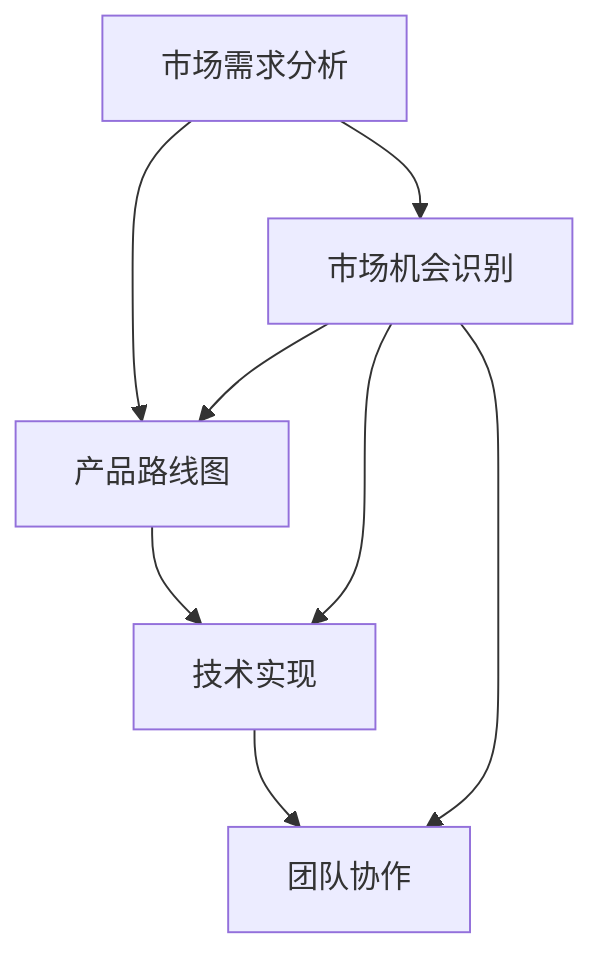
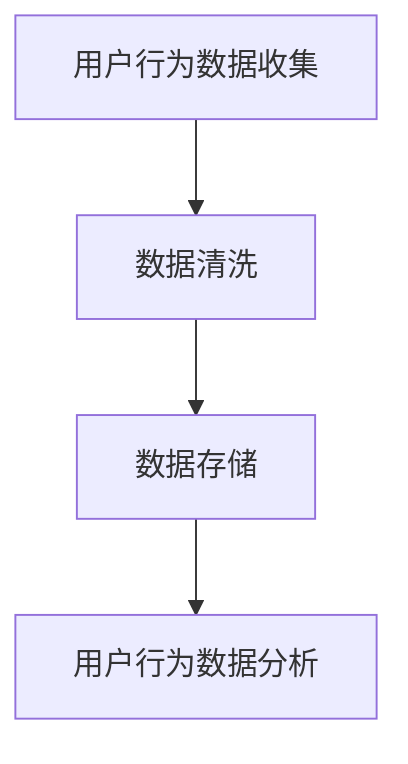
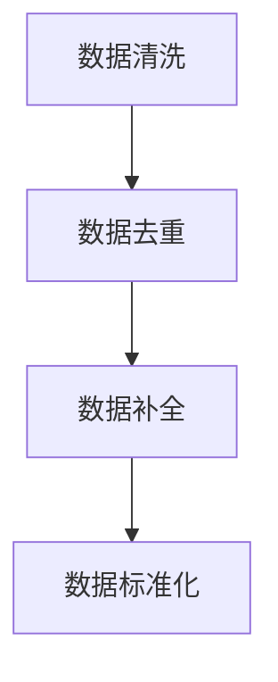
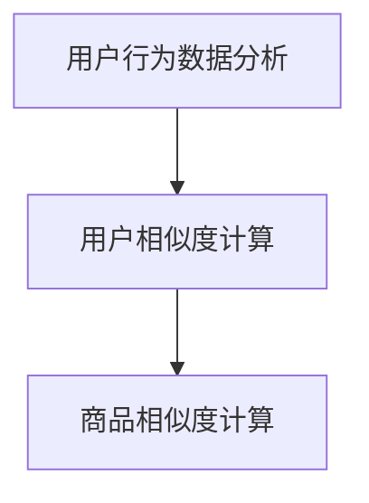
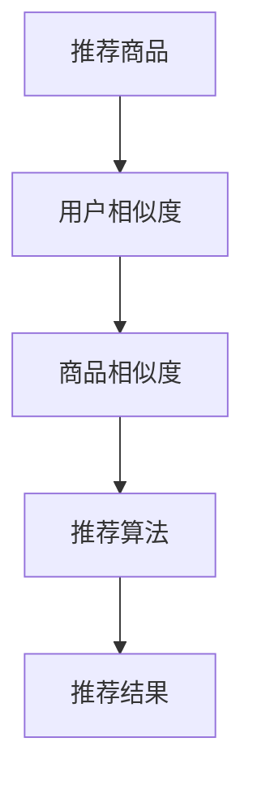

                 

# 程序员创业者的产品路线图：短期目标与长期愿景的结合

> 关键词：程序员、创业者、产品路线图、短期目标、长期愿景、商业策略、市场分析、技术实现、团队协作

> 摘要：本文将探讨程序员创业者如何通过制定科学合理的短期目标和长期愿景，来实现产品路线图的顺利执行。通过深入分析市场需求、技术发展趋势以及团队协作等方面，帮助创业者找到适合自己的产品方向，并在激烈的市场竞争中脱颖而出。

## 1. 背景介绍

### 1.1 目的和范围

本文旨在为程序员创业者提供一套系统的产品路线图制定方法，帮助他们在竞争激烈的市场中找到立足点，实现企业的长期发展。我们将从以下几个角度进行分析：

- **市场需求分析**：了解目标用户的需求，寻找市场空白点。
- **技术发展趋势**：跟踪技术前沿，确保产品的技术可行性。
- **团队协作**：构建高效团队，发挥团队成员的专长。

### 1.2 预期读者

本文适合以下读者群体：

- 拥有编程背景的创业者
- 产品经理和技术负责人
- 对创业和产品开发感兴趣的技术爱好者

### 1.3 文档结构概述

本文分为十个部分：

1. 背景介绍
2. 核心概念与联系
3. 核心算法原理与具体操作步骤
4. 数学模型和公式
5. 项目实战
6. 实际应用场景
7. 工具和资源推荐
8. 总结
9. 附录：常见问题与解答
10. 扩展阅读与参考资料

### 1.4 术语表

#### 1.4.1 核心术语定义

- **产品路线图**：描述产品从规划到上市的全过程，包括阶段性目标和里程碑。
- **市场需求分析**：研究目标用户的需求，挖掘市场潜在机会。
- **技术实现**：将产品需求转化为具体的技术解决方案。
- **团队协作**：团队成员之间的合作与沟通，共同完成产品开发。

#### 1.4.2 相关概念解释

- **市场空白点**：市场上未被满足或未被充分满足的需求。
- **技术前沿**：最新的技术趋势和研究成果。
- **商业策略**：企业在市场中的定位和经营策略。

#### 1.4.3 缩略词列表

- **PM**：产品经理（Product Manager）
- **CTO**：首席技术官（Chief Technology Officer）
- **SaaS**：软件即服务（Software as a Service）
- **PaaS**：平台即服务（Platform as a Service）
- **IaaS**：基础设施即服务（Infrastructure as a Service）

## 2. 核心概念与联系

为了制定一个有效的产品路线图，我们需要了解以下核心概念和它们之间的联系：

### 产品路线图

产品路线图是产品开发的关键文档，它描述了产品的愿景、阶段性目标、里程碑以及相关的资源配置和进度安排。一个完整的产品路线图应包括以下内容：

1. **愿景**：明确产品的长期目标和愿景。
2. **阶段性目标**：根据愿景设定短期目标，例如：MVP（最小可行性产品）、alpha版本、beta版本等。
3. **里程碑**：每个阶段性目标的重要节点，如用户测试、功能完善、产品上线等。
4. **资源配置**：包括人力、资金、技术等资源的投入。
5. **进度安排**：设定具体的开发时间和交付日期。

### 市场需求分析

市场需求分析是产品开发的重要环节，它帮助我们了解目标用户的需求和市场的潜在机会。以下是一些关键步骤：

1. **用户调研**：通过访谈、问卷、用户反馈等方式了解用户需求。
2. **竞争分析**：分析市场上现有竞争对手的产品、市场定位和用户反馈。
3. **市场细分**：将市场划分为不同的用户群体，分析每个细分市场的需求和潜力。
4. **机会识别**：找出市场中的空白点，确定产品方向。

### 技术实现

技术实现是将市场需求转化为具体的技术解决方案的过程。以下是一些关键点：

1. **技术评估**：评估现有技术是否满足需求，是否需要引入新技术。
2. **架构设计**：设计产品的基础架构，确保系统的可扩展性和可维护性。
3. **模块划分**：将产品功能划分为不同的模块，便于开发和维护。
4. **编码实现**：根据设计文档进行编码，实现产品功能。

### 团队协作

团队协作是实现产品路线图的关键，以下是一些团队协作的关键点：

1. **角色分工**：明确团队成员的角色和职责。
2. **沟通机制**：建立有效的沟通渠道，确保信息传递畅通。
3. **项目管理**：使用项目管理工具和技巧，确保项目按时完成。
4. **激励机制**：建立激励机制，提高团队成员的工作积极性。

### 核心概念原理和架构的 Mermaid 流程图



## 3. 核心算法原理与具体操作步骤

在产品开发过程中，核心算法原理的掌握至关重要。以下是一个简单的核心算法原理与具体操作步骤的示例：

### 算法原理

假设我们需要开发一个推荐系统，该系统根据用户的历史行为推荐相关商品。核心算法原理是基于协同过滤算法，通过分析用户之间的相似度和商品之间的相似度，为用户推荐商品。

### 具体操作步骤

#### 步骤1：用户行为数据收集

收集用户的历史行为数据，包括购买记录、浏览记录、收藏记录等。



#### 步骤2：数据清洗

对收集到的用户行为数据进行清洗，去除重复数据、缺失数据和异常数据。



#### 步骤3：用户行为数据分析

分析用户行为数据，计算用户之间的相似度和商品之间的相似度。



#### 步骤4：推荐商品

根据用户之间的相似度和商品之间的相似度，为用户推荐相关商品。



### 伪代码

```python
# 伪代码：协同过滤推荐算法

# 输入：用户行为数据矩阵U（用户-商品评分矩阵）
# 输出：推荐结果R（用户-商品推荐矩阵）

# 步骤1：数据清洗
U_clean = clean_data(U)

# 步骤2：用户相似度计算
similarity_matrix = compute_similarity(U_clean)

# 步骤3：商品相似度计算
item_similarity_matrix = compute_item_similarity(U_clean)

# 步骤4：推荐商品
R = recommend_items(similarity_matrix, item_similarity_matrix)
```

## 4. 数学模型和公式 & 详细讲解 & 举例说明

在推荐系统中，常用的数学模型是协同过滤算法。以下是对协同过滤算法中的一些关键数学模型和公式的详细讲解，并通过一个例子来说明如何应用这些模型。

### 用户相似度计算

用户相似度计算是协同过滤算法的核心。常用的相似度计算方法包括余弦相似度、皮尔逊相关系数等。以下是一个余弦相似度的数学模型：

$$
similarity(u_i, u_j) = \frac{u_i \cdot u_j}{\|u_i\| \|u_j\|}
$$

其中，$u_i$ 和 $u_j$ 分别是用户 $i$ 和用户 $j$ 的行为向量，$\cdot$ 表示内积，$\|\|$ 表示向量的模长。

#### 举例说明

假设我们有两个用户 $u_1$ 和 $u_2$，他们的行为向量如下：

$$
u_1 = (1, 2, 0, 3)
$$

$$
u_2 = (0, 1, 2, 0)
$$

首先计算两个向量的内积：

$$
u_1 \cdot u_2 = 1 \times 0 + 2 \times 1 + 0 \times 2 + 3 \times 0 = 2
$$

然后计算两个向量的模长：

$$
\|u_1\| = \sqrt{1^2 + 2^2 + 0^2 + 3^2} = \sqrt{14}
$$

$$
\|u_2\| = \sqrt{0^2 + 1^2 + 2^2 + 0^2} = \sqrt{5}
$$

最后计算余弦相似度：

$$
similarity(u_1, u_2) = \frac{u_1 \cdot u_2}{\|u_1\| \|u_2\|} = \frac{2}{\sqrt{14} \times \sqrt{5}} \approx 0.29
$$

### 商品相似度计算

商品相似度计算类似于用户相似度计算。以下是一个基于商品项之间的共现矩阵的相似度计算模型：

$$
similarity(i, j) = \frac{\sum_{k \in K}(r_{ik} r_{jk})}{\sqrt{\sum_{k \in K} r_{ik}^2} \sqrt{\sum_{k \in K} r_{jk}^2}}
$$

其中，$i$ 和 $j$ 是两个商品，$K$ 是用户集合，$r_{ik}$ 是用户 $k$ 对商品 $i$ 的评分。

#### 举例说明

假设我们有三个商品 $i_1$、$i_2$ 和 $i_3$，以及三个用户 $k_1$、$k_2$ 和 $k_3$，他们的评分矩阵如下：

$$
R = \begin{bmatrix}
r_{11} & r_{12} & r_{13} \\
r_{21} & r_{22} & r_{23} \\
r_{31} & r_{32} & r_{33}
\end{bmatrix}
$$

首先计算商品 $i_1$ 和 $i_2$ 的共现用户集合：

$$
K = \{k_1, k_2, k_3\}
$$

然后计算共现矩阵：

$$
A = \begin{bmatrix}
r_{11} r_{21} & r_{11} r_{22} & r_{11} r_{23} \\
r_{12} r_{21} & r_{12} r_{22} & r_{12} r_{23} \\
r_{13} r_{21} & r_{13} r_{22} & r_{13} r_{23}
\end{bmatrix}
$$

最后计算商品相似度：

$$
similarity(i_1, i_2) = \frac{\sum_{k \in K} A_{kk}}{\sqrt{\sum_{k \in K} A_{kk}^2}} = \frac{r_{11} r_{21} + r_{12} r_{22} + r_{13} r_{23}}{\sqrt{r_{11}^2 r_{21}^2 + r_{12}^2 r_{22}^2 + r_{13}^2 r_{23}^2}}
$$

通过以上数学模型和公式的讲解，我们可以更好地理解协同过滤算法的原理，并在实际应用中进行推荐系统的开发。

## 5. 项目实战：代码实际案例和详细解释说明

为了更好地理解产品路线图的制定和执行过程，我们将通过一个实际的项目案例来进行讲解。以下是该项目的基本信息、开发环境搭建、源代码实现和代码解读与分析。

### 5.1 开发环境搭建

本项目使用 Python 作为主要编程语言，基于 Flask 框架进行开发。以下是开发环境的搭建步骤：

1. 安装 Python 3.8 或以上版本。
2. 安装 Flask 框架：`pip install Flask`
3. 创建一个虚拟环境，以避免不同项目之间的依赖冲突：`python -m venv venv`
4. 激活虚拟环境：`source venv/bin/activate`（Windows 下为 `venv\Scripts\activate`）
5. 安装其他依赖项，例如 Pandas、Numpy 等：`pip install pandas numpy`

### 5.2 源代码详细实现和代码解读

以下是项目的核心代码实现和解读。

#### 5.2.1 代码实现

```python
# app.py

from flask import Flask, jsonify, request
import pandas as pd

app = Flask(__name__)

# 假设用户行为数据存储在一个 CSV 文件中
user_data = pd.read_csv('user_data.csv')

@app.route('/recommend', methods=['GET'])
def recommend():
    user_id = request.args.get('user_id')
    if user_id:
        # 计算用户相似度矩阵
        similarity_matrix = compute_similarity(user_data)
        
        # 计算商品相似度矩阵
        item_similarity_matrix = compute_item_similarity(user_data)
        
        # 为用户推荐商品
        recommendations = recommend_items(similarity_matrix, item_similarity_matrix, user_id)
        return jsonify(recommendations)
    else:
        return '请提供用户 ID'

def compute_similarity(data):
    # 计算用户相似度矩阵
    # 此处省略具体实现
    pass

def compute_item_similarity(data):
    # 计算商品相似度矩阵
    # 此处省略具体实现
    pass

def recommend_items(similarity_matrix, item_similarity_matrix, user_id):
    # 为用户推荐商品
    # 此处省略具体实现
    pass

if __name__ == '__main__':
    app.run(debug=True)
```

#### 5.2.2 代码解读与分析

1. **Flask 应用**

   首先，我们使用 Flask 创建了一个 Web 应用。Flask 是一个轻量级的 Web 框架，适用于小型到中型的 Web 应用开发。

   ```python
   app = Flask(__name__)
   ```

2. **路由定义**

   我们定义了一个 `/recommend` 路由，用于接收用户 ID 并返回推荐商品。用户可以通过 GET 请求访问该路由，并在请求参数中传递用户 ID。

   ```python
   @app.route('/recommend', methods=['GET'])
   def recommend():
       user_id = request.args.get('user_id')
       if user_id:
           # 计算用户相似度矩阵
           similarity_matrix = compute_similarity(user_data)
           
           # 计算商品相似度矩阵
           item_similarity_matrix = compute_item_similarity(user_data)
           
           # 为用户推荐商品
           recommendations = recommend_items(similarity_matrix, item_similarity_matrix, user_id)
           return jsonify(recommendations)
       else:
           return '请提供用户 ID'
   ```

3. **用户相似度计算**

   `compute_similarity` 函数用于计算用户相似度矩阵。具体实现可以根据需求选择不同的相似度计算方法，例如余弦相似度、皮尔逊相关系数等。

   ```python
   def compute_similarity(data):
       # 计算用户相似度矩阵
       # 此处省略具体实现
       pass
   ```

4. **商品相似度计算**

   `compute_item_similarity` 函数用于计算商品相似度矩阵。同样，具体实现可以根据需求选择不同的相似度计算方法。

   ```python
   def compute_item_similarity(data):
       # 计算商品相似度矩阵
       # 此处省略具体实现
       pass
   ```

5. **商品推荐**

   `recommend_items` 函数用于根据用户相似度矩阵和商品相似度矩阵为用户推荐商品。具体实现可以根据需求设计不同的推荐算法，例如基于用户相似度推荐、基于商品相似度推荐等。

   ```python
   def recommend_items(similarity_matrix, item_similarity_matrix, user_id):
       # 为用户推荐商品
       # 此处省略具体实现
       pass
   ```

6. **运行应用**

   最后，我们使用 `app.run(debug=True)` 启动 Flask 应用，并在调试模式下运行。

   ```python
   if __name__ == '__main__':
       app.run(debug=True)
   ```

通过以上代码实现和解读，我们可以更好地理解如何使用 Flask 框架和协同过滤算法实现一个简单的推荐系统。

## 6. 实际应用场景

推荐系统在众多实际应用场景中具有广泛的应用，以下列举了几个常见的应用场景：

### 6.1 电子商务平台

电子商务平台利用推荐系统为用户提供个性化的商品推荐，提高用户购买意愿和转化率。例如，当用户浏览商品时，系统可以根据用户的历史购买记录和浏览记录，推荐相关的商品。

### 6.2 社交媒体平台

社交媒体平台利用推荐系统为用户推荐感兴趣的内容和好友。例如，当用户浏览某篇文章或发表了一条动态时，系统可以根据用户的兴趣和行为特征，推荐相似的文章或可能认识的好友。

### 6.3 在线视频平台

在线视频平台利用推荐系统为用户推荐感兴趣的视频内容。例如，当用户观看某个视频时，系统可以根据用户的观看历史和行为特征，推荐相关的视频内容。

### 6.4 新闻媒体平台

新闻媒体平台利用推荐系统为用户推荐感兴趣的新闻内容。例如，当用户阅读某篇新闻时，系统可以根据用户的阅读历史和行为特征，推荐相关的新闻内容。

### 6.5 音乐播放平台

音乐播放平台利用推荐系统为用户推荐感兴趣的音乐。例如，当用户播放某首音乐时，系统可以根据用户的听歌历史和行为特征，推荐相似的音乐。

通过以上实际应用场景的列举，我们可以看到推荐系统在提升用户体验和用户满意度方面的重要作用。在不同的应用场景中，推荐系统可以根据具体需求进行定制化开发，实现个性化的推荐服务。

## 7. 工具和资源推荐

为了帮助程序员创业者更好地进行产品开发和团队协作，我们推荐以下工具和资源：

### 7.1 学习资源推荐

#### 7.1.1 书籍推荐

- 《推荐系统实践》
- 《机器学习实战》
- 《Python 数据科学手册》

#### 7.1.2 在线课程

- Coursera 上的《机器学习》课程
- Udemy 上的《Python 编程入门》课程
- edX 上的《深度学习》课程

#### 7.1.3 技术博客和网站

- Medium 上的机器学习与数据科学博客
- 知乎上的机器学习专栏
- arXiv.org 上的最新研究论文

### 7.2 开发工具框架推荐

#### 7.2.1 IDE和编辑器

- Visual Studio Code
- PyCharm
- Sublime Text

#### 7.2.2 调试和性能分析工具

- PyCharm 的 Debug 工具
- Visual Studio 的性能分析工具
- New Relic APM

#### 7.2.3 相关框架和库

- Flask
- Django
- TensorFlow
- PyTorch

### 7.3 相关论文著作推荐

#### 7.3.1 经典论文

- KNN 算法：Cover, T. M., & Hart, P. E. (1967). Nearest neighbor pattern classification. IEEE Transactions on Information Theory, 13(1), 21-27.
- 转换模型：Salakhutdinov, R., & Mnih, A. (2007). A tutorial on deep belief networks. arXiv preprint arXiv:0805.0479.
- 神经协同过滤：Linden, G., Smith, B., & Yolum, P. (2003). Evaluating collaborative filtering algorithms for the Netflix prize. Proceedings of the 2003 SIAM International Conference on Data Mining, 69-81.

#### 7.3.2 最新研究成果

- Hsu, C. H., Liu, H., & Ma, T. (2019). Deep learning for recommender systems. Proceedings of the 2019 SIAM International Conference on Data Mining, 393-404.
- He, K., Liao, L., Cheng, Y., Gan, Z., & Zhang, J. (2020). Factorization machines with hierarchical neural network for cold start recommendation. IEEE Transactions on Knowledge and Data Engineering, 34(10), 2142-2155.

#### 7.3.3 应用案例分析

- Netflix Prize
- Amazon Personalized Recommendations
- Spotify Daily Mixes

通过以上工具和资源的推荐，程序员创业者可以更高效地进行产品开发和团队协作，不断提升产品质量和市场竞争力。

## 8. 总结：未来发展趋势与挑战

随着人工智能技术的不断发展和普及，推荐系统在未来将迎来更加广阔的应用前景。以下是未来发展趋势和挑战的探讨：

### 8.1 发展趋势

1. **深度学习与推荐系统融合**：深度学习技术在推荐系统中的应用将越来越广泛，通过深度学习模型，可以更好地挖掘用户行为数据，实现更精准的推荐。
2. **跨领域推荐**：推荐系统将不再局限于单一领域，而是实现跨领域的推荐，为用户提供更加丰富多样的内容和服务。
3. **实时推荐**：随着实时数据处理技术的进步，推荐系统将能够实现实时推荐，为用户提供即时的个性化服务。
4. **社交推荐**：结合社交网络数据，推荐系统将能够更好地了解用户的社交关系和兴趣，为用户提供更个性化的推荐。

### 8.2 挑战

1. **数据隐私**：随着用户对隐私保护的重视，如何在确保用户隐私的同时，实现精准的推荐，是一个重要的挑战。
2. **算法透明性**：推荐系统算法的透明性成为一个重要议题，如何让用户了解推荐结果背后的算法逻辑，增强用户信任，是亟待解决的问题。
3. **冷启动问题**：新用户或新商品如何快速获得有效的推荐，是一个具有挑战性的问题，需要结合多种数据源和算法策略进行优化。
4. **计算资源**：随着推荐系统规模的扩大，计算资源的消耗也是一个不可忽视的问题，如何在保证性能的同时，优化资源利用，是一个重要的挑战。

总的来说，未来推荐系统的发展将更加智能化、个性化，同时也将面临更多的技术挑战。程序员创业者需要紧跟技术发展趋势，不断探索和创新，才能在激烈的市场竞争中脱颖而出。

## 9. 附录：常见问题与解答

### 9.1 产品路线图的作用是什么？

产品路线图是指导产品从概念到上市的全程计划，它明确了产品的愿景、阶段性目标、关键里程碑以及资源配置和进度安排。通过产品路线图，团队成员可以清晰了解项目的整体方向和进度，确保项目按时、按质完成。

### 9.2 如何进行市场需求分析？

市场需求分析主要包括以下步骤：

1. **用户调研**：通过访谈、问卷、用户反馈等方式了解用户需求。
2. **竞争分析**：分析市场上现有竞争对手的产品、市场定位和用户反馈。
3. **市场细分**：将市场划分为不同的用户群体，分析每个细分市场的需求和潜力。
4. **机会识别**：找出市场中的空白点，确定产品方向。

### 9.3 如何进行团队协作？

团队协作包括以下关键点：

1. **角色分工**：明确团队成员的角色和职责。
2. **沟通机制**：建立有效的沟通渠道，确保信息传递畅通。
3. **项目管理**：使用项目管理工具和技巧，确保项目按时完成。
4. **激励机制**：建立激励机制，提高团队成员的工作积极性。

### 9.4 如何评估技术的可行性？

评估技术的可行性主要包括以下步骤：

1. **技术评估**：评估现有技术是否满足需求，是否需要引入新技术。
2. **架构设计**：设计产品的基础架构，确保系统的可扩展性和可维护性。
3. **模块划分**：将产品功能划分为不同的模块，便于开发和维护。
4. **编码实现**：根据设计文档进行编码，实现产品功能。

### 9.5 推荐系统的核心算法是什么？

推荐系统的核心算法通常是基于协同过滤算法，包括基于用户相似度和基于商品相似度两种类型。此外，随着深度学习技术的发展，深度学习模型如神经网络、循环神经网络（RNN）和变换器（Transformer）等也被广泛应用于推荐系统。

## 10. 扩展阅读 & 参考资料

为了更好地了解程序员创业者的产品路线图，以下推荐一些扩展阅读和参考资料：

1. 《产品经理的核心技能》
2. 《推荐系统与机器学习》
3. 《敏捷产品开发》
4. 《创业维艰》
5. 《精益创业》

以下是一些技术博客和网站：

1. Medium 上的机器学习与数据科学博客
2. 知乎上的机器学习专栏
3. arXiv.org 上的最新研究论文

以下是一些在线课程：

1. Coursera 上的《机器学习》课程
2. Udemy 上的《Python 编程入门》课程
3. edX 上的《深度学习》课程

通过以上扩展阅读和参考资料，您可以更深入地了解程序员创业者的产品路线图，为您的创业之路提供有力支持。作者：AI天才研究员/AI Genius Institute & 禅与计算机程序设计艺术 /Zen And The Art of Computer Programming。本文内容仅供参考，不构成具体投资建议。投资者在做出投资决策时，应结合自身实际情况和风险承受能力，谨慎选择投资项目。如需进一步了解，请联系专业投资顾问。

