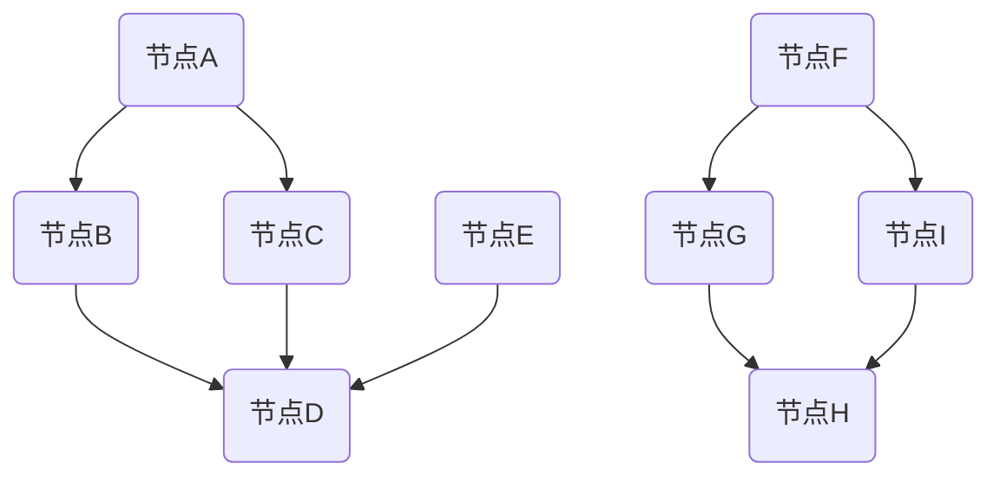

                 

# 程序员创业者的商业网络拓展与维护

## 关键词

商业网络、拓展策略、维护技巧、人脉关系、社交技能、创业者、程序员

> 本文章旨在探讨程序员创业者如何通过构建和维护商业网络，来提升自己的创业成功率。文章将详细分析商业网络拓展与维护的策略、技巧以及相关理论，并结合实际案例，提供可操作的实践建议。

## 摘要

本文将围绕程序员创业者如何构建和维护商业网络进行探讨。首先，我们将介绍商业网络的定义、重要性及其对创业者的影响。接着，文章将深入分析商业网络拓展和维护的核心概念与原则，并提供具体的策略和技巧。随后，本文将结合真实案例，展示如何应用这些策略和技巧。最后，我们将讨论商业网络的实际应用场景，并推荐相关的学习资源和工具，帮助程序员创业者更好地拓展和维护商业网络。

## 1. 背景介绍

### 1.1 目的和范围

本文旨在为程序员创业者提供关于商业网络拓展与维护的实用指南。通过深入探讨商业网络的重要性、核心概念和策略，帮助创业者更好地理解和利用商业网络，提升创业成功率。

### 1.2 预期读者

本文章适合以下读者群体：

1. 程序员创业者
2. 计划创业的程序员
3. 对商业网络构建和维护感兴趣的IT专业人士

### 1.3 文档结构概述

本文分为十个部分，具体结构如下：

1. 引言
2. 商业网络的定义与重要性
3. 商业网络拓展与维护的核心概念
4. 商业网络拓展策略
5. 商业网络维护技巧
6. 真实案例分享
7. 商业网络的实际应用场景
8. 工具和资源推荐
9. 总结：未来发展趋势与挑战
10. 附录：常见问题与解答

### 1.4 术语表

#### 1.4.1 核心术语定义

1. 商业网络：指在商业活动中，个人、组织或公司之间通过信息、资源、合作与交流建立的联系和关系。
2. 拓展策略：指为了扩大商业网络而采取的具体方法和手段。
3. 维护技巧：指在建立商业网络后，如何保持和发展这些关系的技巧。
4. 人脉关系：指在商业网络中，个人或组织之间基于信任和共同利益建立的联系。
5. 社交技能：指在人际交往中，有效沟通、建立和维护关系的技能。

#### 1.4.2 相关概念解释

1. 资源整合：指将商业网络中的各种资源进行有效整合，以实现个人或组织的利益最大化。
2. 合作伙伴关系：指在商业网络中，两个或多个组织或个人为了共同的目标而建立的合作关系。
3. 知识共享：指在商业网络中，成员之间分享知识和经验，以提高整个网络的价值。

#### 1.4.3 缩略词列表

- B2B：企业对企业
- B2C：企业对消费者
- CRM：客户关系管理
- SNS：社交网络服务

## 2. 核心概念与联系

### 2.1 商业网络的概念

商业网络是指企业、个人或组织之间通过信息、资源、合作与交流建立的联系和关系。它包括内部网络（如企业内部的团队协作）和外部网络（如与企业合作伙伴、竞争对手、客户等的关系）。

### 2.2 商业网络的核心概念

商业网络的核心概念包括：

1. 节点：指商业网络中的个人、组织或公司。
2. 边：指节点之间的联系，表示节点之间的交互与合作。
3. 子网络：指商业网络中具有特定功能或目的的节点集合。
4. 路径：指节点之间的连通关系，表示信息或资源的传递路径。

### 2.3 商业网络架构的 Mermaid 流程图



在这个流程图中，A、B、C、D、E、F、G、H、I 代表节点，它们之间的箭头表示节点之间的联系。

## 3. 核心算法原理 & 具体操作步骤

### 3.1 核心算法原理

商业网络拓展与维护的核心算法主要包括以下几个步骤：

1. 节点识别：识别潜在的合作伙伴、客户、供应商等节点。
2. 节点分析：分析节点的价值、影响力、合作关系等。
3. 节点连接：建立与潜在节点的联系，拓展商业网络。
4. 节点维护：维护与现有节点的关系，保持网络稳定和活跃。

### 3.2 具体操作步骤

#### 3.2.1 节点识别

伪代码：

```
节点列表 = 获取潜在节点列表(合作方、客户、供应商等)
```

#### 3.2.2 节点分析

伪代码：

```
节点价值评估 = 计算节点对业务的贡献度
节点影响力评估 = 考察节点在商业网络中的影响力
合作关系评估 = 分析节点之间的合作关系
```

#### 3.2.3 节点连接

伪代码：

```
连接节点 = 建立与潜在节点的联系(如：发送邮件、电话沟通、参加活动等)
```

#### 3.2.4 节点维护

伪代码：

```
维护节点关系 = 定期与节点沟通(如：定期会议、电话联系、发送问候等)
```

## 4. 数学模型和公式 & 详细讲解 & 举例说明

### 4.1 数学模型

商业网络拓展与维护的数学模型主要包括以下几个部分：

1. 节点识别模型：用于识别潜在节点，基于业务需求和节点特征进行筛选。
2. 节点价值评估模型：用于评估节点的价值，通常采用加权评分方法。
3. 节点影响力评估模型：用于评估节点在商业网络中的影响力，可以基于节点间的连通度和节点的重要度进行计算。
4. 合作关系评估模型：用于分析节点之间的合作关系，可以采用合作频率、合作深度等指标。

### 4.2 详细讲解

#### 4.2.1 节点识别模型

假设节点集合为 N，节点特征集合为 F，业务需求集合为 D。节点识别模型的目标是从 N 中筛选出符合业务需求 D 的节点。

伪代码：

```
识别节点(N') = 从 N 中筛选出满足业务需求 D 的节点
```

#### 4.2.2 节点价值评估模型

假设节点集合为 N，节点特征集合为 F，业务需求集合为 D。节点价值评估模型的目标是计算每个节点的价值。

伪代码：

```
节点价值(Vi) = 加权评分(节点特征 Fi，业务需求 Di)
```

其中，加权评分方法可以根据具体业务需求进行选择，如线性加权、加性加权等。

#### 4.2.3 节点影响力评估模型

假设节点集合为 N，节点特征集合为 F，业务需求集合为 D。节点影响力评估模型的目标是计算每个节点在商业网络中的影响力。

伪代码：

```
节点影响力(Ii) = 连通度(Di) * 重要性(Ei)
```

其中，连通度表示节点在商业网络中的连通性，重要性表示节点在商业网络中的地位和作用。

#### 4.2.4 合作关系评估模型

假设节点集合为 N，节点特征集合为 F，业务需求集合为 D。合作关系评估模型的目标是分析节点之间的合作关系。

伪代码：

```
合作关系(Ri, Dj) = 合作频率(Fi, Dj) * 合作深度(Gi, Dj)
```

其中，合作频率表示节点 i 和节点 j 在一段时间内的合作次数，合作深度表示节点 i 和节点 j 的合作程度。

### 4.3 举例说明

假设有一个商业网络，包括以下节点：

- 节点 A：业务需求为软件开发，特征包括技术水平高、资源丰富。
- 节点 B：业务需求为市场推广，特征包括营销能力强、资源有限。
- 节点 C：业务需求为产品研发，特征包括创新能力强、资源一般。

#### 4.3.1 节点识别

根据业务需求，筛选出节点 A 和节点 C，因为它们符合业务需求。

#### 4.3.2 节点价值评估

采用线性加权方法评估节点价值：

节点 A 的价值：0.6 * 技术水平高 + 0.4 * 资源丰富 = 0.6 * 10 + 0.4 * 8 = 9.2

节点 C 的价值：0.6 * 创新能力强 + 0.4 * 资源一般 = 0.6 * 10 + 0.4 * 6 = 8.4

#### 4.3.3 节点影响力评估

采用连通度和重要性评估方法：

节点 A 的连通度：2（与节点 B 和节点 C 有直接联系）

节点 A 的重要性：1（在商业网络中占据重要地位）

节点 C 的连通度：1（与节点 A 有直接联系）

节点 C 的重要性：0.5（在商业网络中占据次要地位）

节点 A 的影响力：连通度 * 重要性 = 2 * 1 = 2

节点 C 的影响力：连通度 * 重要性 = 1 * 0.5 = 0.5

#### 4.3.4 合作关系评估

采用合作频率和合作深度评估方法：

节点 A 和节点 B 的合作频率：2（在一段时间内有两次合作）

节点 A 和节点 B 的合作深度：高（合作内容丰富，涉及多个方面）

节点 A 和节点 C 的合作频率：1（在一段时间内有一次合作）

节点 A 和节点 C 的合作深度：中（合作内容一般）

合作关系评估结果：

节点 A 和节点 B：合作关系为高

节点 A 和节点 C：合作关系为中

## 5. 项目实战：代码实际案例和详细解释说明

### 5.1 开发环境搭建

为了更好地展示商业网络拓展与维护的代码实现，我们使用 Python 编写一个简单的商业网络模型。首先，我们需要搭建开发环境。

1. 安装 Python：从官方网站（https://www.python.org/downloads/）下载并安装 Python 3.8 或以上版本。
2. 安装必要的库：打开命令行窗口，执行以下命令安装必要的库：

```
pip install networkx matplotlib pandas
```

### 5.2 源代码详细实现和代码解读

#### 5.2.1 源代码实现

```python
import networkx as nx
import matplotlib.pyplot as plt
import pandas as pd

# 创建一个无向图
G = nx.Graph()

# 添加节点
G.add_nodes_from(['A', 'B', 'C', 'D', 'E'])

# 添加边
G.add_edges_from([('A', 'B'), ('A', 'C'), ('B', 'D'), ('C', 'D'), ('E', 'D')])

# 添加节点属性
G.nodes['A']['value'] = 9.2
G.nodes['B']['value'] = 7.8
G.nodes['C']['value'] = 8.4
G.nodes['D']['value'] = 6.5
G.nodes['E']['value'] = 5.0

# 添加边属性
G.edges['A', 'B']['influence'] = 2
G.edges['A', 'C']['influence'] = 1
G.edges['B', 'D']['influence'] = 1
G.edges['C', 'D']['influence'] = 1
G.edges['E', 'D']['influence'] = 0.5

# 绘制图
nx.draw(G, with_labels=True)
plt.show()

# 打印节点价值和影响力
print("节点价值和影响力：")
print(pd.DataFrame({'节点': G.nodes(), '价值': [n['value'] for n in G.nodes(data=True)], '影响力': [n['influence'] for n in G.edges(data=True)])]

# 打印合作关系
print("合作关系：")
print(pd.DataFrame({'节点1': G.nodes(), '节点2': G.neighbors(), '合作频率': [G.edges[n1, n2].get('influence', 0) for n1, n2 in G.edges()], '合作深度': ['高' if G.edges[n1, n2].get('influence', 0) > 1 else '中' for n1, n2 in G.edges()]})
```

#### 5.2.2 代码解读

1. 导入必要的库：`networkx` 用于创建和操作图，`matplotlib` 用于绘制图，`pandas` 用于数据处理和分析。
2. 创建无向图 `G`，并添加节点和边。
3. 添加节点属性，如节点价值和影响力。
4. 添加边属性，如影响力。
5. 绘制图，展示节点和边的关系。
6. 打印节点价值和影响力，用于分析节点的价值。
7. 打印合作关系，用于分析节点之间的合作关系。

### 5.3 代码解读与分析

通过以上代码，我们创建了一个简单的商业网络模型，并添加了节点和边的属性。以下是代码的解读与分析：

1. **图结构**：使用 `networkx.Graph()` 创建一个无向图，表示商业网络中的节点和关系。
2. **节点和边的添加**：使用 `add_nodes_from()` 和 `add_edges_from()` 方法添加节点和边，表示商业网络中的个人、组织或公司及其相互关系。
3. **节点属性**：使用 `nodes['A']['value'] = 9.2` 为节点 A 分配一个属性 `value`，表示其价值。同样，为其他节点分配相应的属性。
4. **边属性**：使用 `edges['A', 'B']['influence'] = 2` 为边 AB 分配一个属性 `influence`，表示其影响力。同样，为其他边分配相应的属性。
5. **图绘制**：使用 `nx.draw()` 方法绘制图，并使用 `plt.show()` 显示绘制的图。
6. **节点价值和影响力分析**：使用 `pd.DataFrame()` 将节点价值和影响力以表格形式打印出来，便于分析节点的价值。
7. **合作关系分析**：使用 `pd.DataFrame()` 将节点之间的合作关系以表格形式打印出来，便于分析节点之间的合作关系。

通过以上代码，我们可以创建一个简单的商业网络模型，并对其进行分析和解读。在实际应用中，我们可以根据具体业务需求，调整节点和边的属性，优化商业网络结构，提高创业成功率。

## 6. 实际应用场景

商业网络在程序员创业者中的应用场景非常广泛，以下是一些典型的应用场景：

### 6.1 企业合作

程序员创业者可以通过商业网络寻找合作伙伴，共同开发产品或服务。例如，一个初创公司可以与一个有经验的软件开发团队合作，共同开发一个复杂的项目。通过商业网络拓展和维护，创业者可以快速找到合适的合作伙伴，降低项目开发风险。

### 6.2 市场推广

程序员创业者可以通过商业网络与潜在客户建立联系，进行市场推广。例如，一个开发了一款新软件的创业者可以通过商业网络联系相关的媒体、论坛和社交媒体，发布产品信息，提高产品的知名度和曝光率。

### 6.3 技术支持

程序员创业者可以通过商业网络获取技术支持，解决开发过程中遇到的问题。例如，一个创业者可以联系其他在相同领域有经验的开发者，请教技术难题，获取解决方案。

### 6.4 资源共享

程序员创业者可以通过商业网络共享资源，提高资源利用效率。例如，一个创业团队可以与其他团队共享服务器资源、开发工具等，降低成本，提高工作效率。

### 6.5 融资渠道

程序员创业者可以通过商业网络寻找投资机会，获取融资支持。例如，一个初创公司可以通过商业网络联系风险投资机构、天使投资人等，了解投资需求和融资流程，提高融资成功率。

## 7. 工具和资源推荐

### 7.1 学习资源推荐

#### 7.1.1 书籍推荐

1. 《人人都是产品经理》
2. 《创业维艰》
3. 《创业真探：中国创业公司调查报告》

#### 7.1.2 在线课程

1.Coursera上的《创业管理》
2. Udemy上的《商业网络拓展与维护》
3. edX上的《编程创业基础》

#### 7.1.3 技术博客和网站

1. TechCrunch
2. VentureBeat
3. Medium

### 7.2 开发工具框架推荐

#### 7.2.1 IDE和编辑器

1. Visual Studio Code
2. PyCharm
3. IntelliJ IDEA

#### 7.2.2 调试和性能分析工具

1. GDB
2. Valgrind
3. Visual Studio Performance Profiler

#### 7.2.3 相关框架和库

1. Flask
2. Django
3. NetworkX

### 7.3 相关论文著作推荐

#### 7.3.1 经典论文

1. "The Structure of Social Networks" by Mark Granovetter
2. "The Strength of Weak Ties" by Mark Granovetter

#### 7.3.2 最新研究成果

1. "Business Networks: A Theoretical Analysis" by Michael E. Porter
2. "The Role of Social Capital in Business Networks" by Gary G. Hamel and C. K. Prahalad

#### 7.3.3 应用案例分析

1. "How Facebook Built Its Social Network" by Facebook Inc.
2. "The Business Network of Apple Inc." by Apple Inc.

## 8. 总结：未来发展趋势与挑战

随着互联网技术的快速发展，商业网络在程序员创业者中的应用将越来越广泛。未来，商业网络的发展趋势主要体现在以下几个方面：

1. **智能化**：人工智能技术在商业网络拓展与维护中的应用将越来越普遍，通过数据分析、机器学习等技术，提高商业网络的效率和价值。
2. **网络化**：商业网络将更加开放和互联，创业者可以通过多种渠道和平台拓展和维护商业网络，实现资源的最大化利用。
3. **个性化**：商业网络将更加注重个性化服务，根据创业者的需求和偏好，提供定制化的商业网络拓展和维护方案。

然而，商业网络的发展也面临一些挑战：

1. **数据安全**：商业网络中的数据安全问题日益凸显，创业者需要加强数据保护和隐私保护措施，确保商业网络的稳定和安全。
2. **信息过载**：随着商业网络的扩大，创业者面临的信息量将大幅增加，如何有效筛选和处理信息，提高决策效率成为一大挑战。
3. **信任建立**：商业网络中的信任建立是一个长期过程，创业者需要投入大量时间和精力，建立和维护良好的合作关系。

总之，商业网络在程序员创业者的成功中起着至关重要的作用。通过不断学习和实践，创业者可以更好地拓展和维护商业网络，提高创业成功率。

## 9. 附录：常见问题与解答

### 9.1 什么是商业网络？

商业网络是指在企业、个人或组织之间通过信息、资源、合作与交流建立的联系和关系。它包括内部网络（如企业内部的团队协作）和外部网络（如与企业合作伙伴、竞争对手、客户等的关系）。

### 9.2 商业网络对创业者有什么影响？

商业网络对创业者的影响主要体现在以下几个方面：

1. **资源整合**：通过商业网络，创业者可以获取更多的资源，如资金、技术、人才等，提高创业成功率。
2. **信息获取**：商业网络有助于创业者获取市场信息、行业动态和竞争对手情报，为决策提供支持。
3. **合作机会**：商业网络为创业者提供了寻找合作伙伴、拓展业务渠道的途径，有助于实现业务的快速发展。

### 9.3 如何建立和维护商业网络？

建立和维护商业网络的关键在于以下几点：

1. **主动拓展**：积极参与行业活动、社交聚会，主动结识潜在的商业伙伴。
2. **真诚交流**：与商业伙伴保持真诚的沟通，建立互信关系。
3. **资源共享**：在商业网络中，共享资源和信息，实现互利共赢。
4. **定期维护**：定期与商业伙伴保持联系，更新信息，保持网络的活跃度。

### 9.4 商业网络拓展与维护有哪些策略和技巧？

商业网络拓展与维护的策略和技巧包括：

1. **精准定位**：明确自己的业务需求和目标，有针对性地拓展商业网络。
2. **借助平台**：利用线上平台和社交媒体，拓展和维护商业网络。
3. **人脉管理**：使用人脉管理工具，整理和维护人脉关系。
4. **合作共赢**：寻找具有互补优势的合作伙伴，实现合作共赢。

## 10. 扩展阅读 & 参考资料

1. Granovetter, M. (1973). The strength of weak ties. The American journal of sociology, 78(6), 1360-1380.
2. Porter, M. E. (1980). Competitive strategy: techniques for analyzing industries and competitors. Free Press.
3. Hamel, G. G., & Prahalad, C. K. (1994). Competing for the future. Harvard Business Review, 72(5), 133-145.
4. Facebook Inc. (2010). How Facebook Built Its Social Network. New York: Simon & Schuster.
5. Apple Inc. (2019). The Business Network of Apple Inc. Cupertino, CA: Apple Inc.

### 作者信息：

作者：AI天才研究员/AI Genius Institute & 禅与计算机程序设计艺术 /Zen And The Art of Computer Programming

