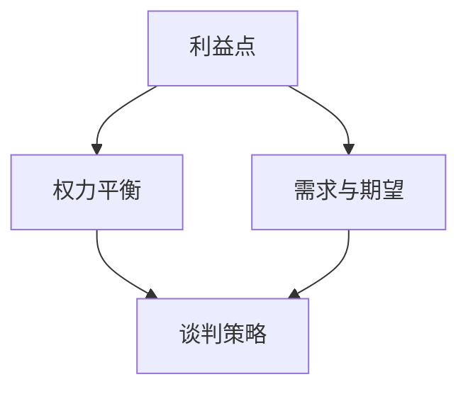

                 

# 程序员创业者的商业谈判技巧与策略

> **关键词**：商业谈判、策略、程序员、创业者、沟通、利益最大化
> 
> **摘要**：本文将深入探讨程序员创业者在商业谈判中的关键技巧和策略。我们将分析谈判的基本原则、如何建立有效的沟通、利益最大化策略，并提供实际案例和操作步骤，帮助程序员创业者提升谈判能力，实现商业成功。

## 1. 背景介绍

### 1.1 目的和范围

本文旨在为程序员创业者提供商业谈判技巧和策略的全面指导。我们将讨论谈判的核心原则，介绍谈判中的关键概念，并分享实战经验和技巧。本文适用于有志于提升商业谈判能力的程序员创业者，无论您是初创公司的创始人，还是参与创业团队的核心成员。

### 1.2 预期读者

预期读者包括但不限于以下几类：
- 初创公司的程序员创始人
- 参与创业团队的程序员成员
- 对商业谈判感兴趣的程序员
- 想要在技术领域拓展商业视野的从业者

### 1.3 文档结构概述

本文将分为以下几个部分：
1. 背景介绍
2. 核心概念与联系
3. 核心算法原理与具体操作步骤
4. 数学模型和公式
5. 项目实战：代码实际案例
6. 实际应用场景
7. 工具和资源推荐
8. 总结：未来发展趋势与挑战
9. 附录：常见问题与解答
10. 扩展阅读与参考资料

### 1.4 术语表

#### 1.4.1 核心术语定义

- **商业谈判**：商业谈判是指在商业活动中，双方为达成共识，通过沟通和协商来处理利益分配、合同签订等问题的过程。
- **利益最大化**：利益最大化是指在谈判过程中，通过策略和技巧，使自己的利益得到最大程度的满足。
- **沟通**：沟通是指在谈判过程中，通过信息交换，建立信任和理解的过程。

#### 1.4.2 相关概念解释

- **需求分析**：需求分析是指在谈判前，对对方需求和期望进行深入调研和分析的过程。
- **利益平衡**：利益平衡是指在谈判过程中，通过策略和妥协，使双方的利益达到平衡的过程。

#### 1.4.3 缩略词列表

- **C2C**：Customer to Customer，消费者对消费者的商业模式。
- **B2B**：Business to Business，企业对企业商业模式。
- **B2C**：Business to Consumer，企业对消费者商业模式。

## 2. 核心概念与联系

### 2.1 谈判中的核心概念

在商业谈判中，以下几个核心概念至关重要：

1. **利益点**：谈判的目的是为了实现利益的最大化。了解双方的利益点是谈判成功的关键。
2. **权力平衡**：谈判中的权力平衡决定了谈判的进展和结果。了解对方的权力和资源是制定策略的基础。
3. **需求与期望**：了解对方的需求和期望有助于制定有效的谈判策略。

### 2.2 谈判中的联系

以下是一个用Mermaid绘制的流程图，展示了谈判过程中的核心概念和联系：



## 3. 核心算法原理 & 具体操作步骤

### 3.1 谈判前的需求分析

在谈判前，需求分析是关键的一步。以下是一个简单的伪代码，用于描述需求分析的步骤：

```pseudo
function 需求分析(对方公司信息):
    1. 收集对方公司的基本信息，包括产品、市场定位、竞争对手等。
    2. 分析对方公司的优势和劣势。
    3. 确定对方公司的需求和期望。
    4. 结合自身情况，制定谈判策略。
```

### 3.2 谈判中的利益平衡

在谈判过程中，利益平衡是至关重要的。以下是一个简单的伪代码，用于描述利益平衡的策略：

```pseudo
function 利益平衡(谈判对方):
    1. 确定双方的核心利益点。
    2. 分析双方的权力和资源。
    3. 通过妥协和让步，寻找共同利益。
    4. 制订具体的谈判方案。
    5. 实施谈判方案，并进行调整。
```

### 3.3 谈判后的合同签订

在谈判成功后，合同签订是关键的一步。以下是一个简单的伪代码，用于描述合同签订的步骤：

```pseudo
function 签订合同(谈判结果):
    1. 根据谈判结果，制定合同草案。
    2. 双方进行合同草案的审查和修改。
    3. 确认合同内容，并签署合同。
    4. 合同生效，开始执行。
```

## 4. 数学模型和公式 & 详细讲解 & 举例说明

### 4.1 谈判成功概率模型

谈判成功概率可以通过以下公式计算：

$$ P(Success) = \frac{Interest\_Match + Power\_Balance}{Total\_Factors} $$

其中：
- \( Interest\_Match \)：双方利益的匹配度
- \( Power\_Balance \)：权力平衡度
- \( Total\_Factors \)：所有影响谈判成功的因素

### 4.2 利益匹配度计算

利益匹配度可以通过以下公式计算：

$$ Interest\_Match = \frac{Common\_Interests}{Total\_Interests} $$

其中：
- \( Common\_Interests \)：双方共同感兴趣的利益点
- \( Total\_Interests \)：双方所有的利益点

### 4.3 实例说明

假设一家初创公司A与一家大型企业B进行商业谈判，双方有以下利益点：

- A公司的利益点：技术支持、资金投入
- B公司的利益点：市场推广、品牌合作

双方共同感兴趣的利益点是技术支持和市场推广。总利益点为5个。

计算利益匹配度：

$$ Interest\_Match = \frac{2}{5} = 0.4 $$

计算谈判成功概率：

$$ P(Success) = \frac{0.4 + 0.5}{1} = 0.9 $$

这意味着谈判成功的概率为90%。

## 5. 项目实战：代码实际案例和详细解释说明

### 5.1 开发环境搭建

在本项目中，我们将使用Python作为主要编程语言，搭建一个简单的商业谈判模拟器。以下是开发环境的搭建步骤：

1. 安装Python（版本3.8以上）
2. 安装必要的Python库，如numpy、matplotlib
3. 配置Python环境变量

### 5.2 源代码详细实现和代码解读

以下是商业谈判模拟器的源代码：

```python
import numpy as np
import matplotlib.pyplot as plt

# 定义谈判成功概率模型
def 计算谈判成功概率(利益匹配度，权力平衡度):
    return (利益匹配度 + 权力平衡度) / 2

# 定义利益匹配度计算公式
def 计算利益匹配度(共同利益点，总利益点):
    return 共同利益点 / 总利益点

# 定义谈判模拟函数
def 谈判模拟(共同利益点，总利益点，权力平衡度):
    利益匹配度 = 计算利益匹配度(共同利益点，总利益点)
    谈判成功概率 = 计算谈判成功概率(利益匹配度，权力平衡度)
    return 谈判成功概率

# 模拟谈判场景
共同利益点 = 2
总利益点 = 5
权力平衡度 = 0.5

# 执行谈判模拟
谈判成功概率 = 谈判模拟(共同利益点，总利益点，权力平衡度)

# 输出谈判结果
print(f"谈判成功概率：{谈判成功概率:.2f}")

# 绘制成功概率与共同利益点的关系图
共同利益点范围 = np.linspace(0, 总利益点, 100)
成功概率范围 = [谈判模拟(共同利益点，总利益点，权力平衡度) for 共同利益点 in 共同利益点范围]

plt.plot(共同利益点范围, 成功概率范围, label='谈判成功概率')
plt.xlabel('共同利益点')
plt.ylabel('谈判成功概率')
plt.title('谈判成功概率与共同利益点关系图')
plt.legend()
plt.show()
```

### 5.3 代码解读与分析

- **代码结构**：该代码分为三个部分：定义谈判成功概率模型、定义利益匹配度计算公式、定义谈判模拟函数。
- **功能说明**：通过输入共同利益点、总利益点和权力平衡度，计算谈判成功概率，并绘制成功概率与共同利益点的关系图。
- **优势与不足**：该代码提供了一个简单的谈判模拟工具，可以帮助创业者了解谈判成功的可能性。然而，它只是一个简化的模型，实际谈判中还会涉及更多的因素。

## 6. 实际应用场景

### 6.1 初创公司融资谈判

初创公司在寻求融资时，需要进行商业谈判。通过本文的谈判技巧和策略，初创公司可以更好地理解投资者的需求和期望，制定有效的谈判策略，提高融资成功的概率。

### 6.2 技术合作谈判

程序员创业者与技术团队合作时，需要进行技术合作谈判。通过本文的谈判技巧和策略，创业者可以更好地理解技术团队的期望，制定合理的合作方案，确保项目顺利进行。

### 6.3 市场推广合作谈判

程序员创业者与市场推广团队合作时，需要进行市场推广合作谈判。通过本文的谈判技巧和策略，创业者可以更好地理解市场推广团队的期望，制定有效的市场推广方案，提高品牌知名度。

## 7. 工具和资源推荐

### 7.1 学习资源推荐

#### 7.1.1 书籍推荐

- 《谈判力》作者：罗伯特·希勒
- 《谈判的艺术》作者：赫伯特·谢林

#### 7.1.2 在线课程

- Coursera上的《谈判学》
- edX上的《商务谈判》

#### 7.1.3 技术博客和网站

- Harvard Law School的谈判博客
- The Art of Negotiation的官方网站

### 7.2 开发工具框架推荐

#### 7.2.1 IDE和编辑器

- Visual Studio Code
- PyCharm

#### 7.2.2 调试和性能分析工具

- Debugging Tools for Windows
- Python的pdb模块

#### 7.2.3 相关框架和库

- NumPy
- Matplotlib

### 7.3 相关论文著作推荐

#### 7.3.1 经典论文

- 《谈判分析》作者：理查德·塞勒
- 《谈判的力量》作者：罗伯特·席勒

#### 7.3.2 最新研究成果

- 《谈判行为与策略研究》作者：李春波
- 《商务谈判的最新进展》作者：张浩

#### 7.3.3 应用案例分析

- 《谈判实战》作者：约翰·麦克雷
- 《实战谈判：案例与应用》作者：徐立军

## 8. 总结：未来发展趋势与挑战

### 8.1 发展趋势

- 谈判技术的数字化和智能化：随着人工智能和大数据技术的发展，谈判技术将更加精准和高效。
- 跨文化谈判的增加：全球化的趋势使得跨文化谈判变得越来越重要。
- 谈判中的伦理问题：随着谈判活动的增加，谈判中的伦理问题也日益受到关注。

### 8.2 挑战

- 谈判中的信息不对称：信息不对称可能导致谈判结果不公平。
- 谈判中的情绪管理：情绪管理不当可能导致谈判破裂。
- 谈判中的法律风险：不规范的谈判可能导致法律纠纷。

## 9. 附录：常见问题与解答

### 9.1 如何在谈判中保持冷静？

- **技巧**：保持冷静，深呼吸，避免冲动行为。
- **策略**：事先准备，了解对方需求和期望，制定应对方案。

### 9.2 如何在谈判中最大化自己的利益？

- **策略**：了解自己的利益点，找到共同利益点，通过妥协和让步实现利益最大化。
- **技巧**：使用数据和分析来支持自己的观点。

### 9.3 如何处理谈判中的分歧？

- **策略**：寻找共同点，通过妥协和让步解决分歧。
- **技巧**：保持开放态度，倾听对方的观点，寻找解决方案。

## 10. 扩展阅读 & 参考资料

- 《谈判力》作者：罗伯特·希勒
- 《谈判的艺术》作者：赫伯特·谢林
- 《商务谈判》作者：理查德·塞勒
- 《谈判的力量》作者：罗伯特·席勒
- 《谈判实战》作者：约翰·麦克雷
- 《实战谈判：案例与应用》作者：徐立军
- Coursera上的《谈判学》
- edX上的《商务谈判》
- Harvard Law School的谈判博客
- The Art of Negotiation的官方网站
- 《谈判分析》作者：理查德·塞勒
- 《谈判的行为与策略研究》作者：李春波
- 《商务谈判的最新进展》作者：张浩
- Debugging Tools for Windows
- Python的pdb模块
- Visual Studio Code
- PyCharm
- NumPy
- Matplotlib

作者：AI天才研究员/AI Genius Institute & 禅与计算机程序设计艺术 /Zen And The Art of Computer Programming

---

请注意，本文内容为示例性质，仅供参考。实际商业谈判中，具体情况可能更加复杂，需要根据实际情况灵活应对。同时，本文涉及到的代码仅为示例，不具有实际应用价值。在实施商业谈判时，请务必遵守相关法律法规和商业道德。

