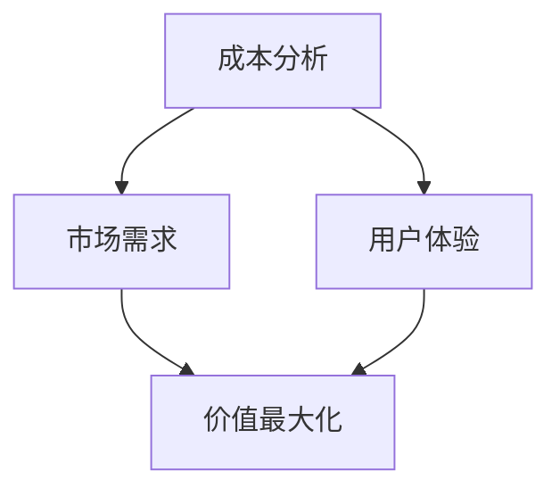

                 

# 程序员创业者的定价策略：价值最大化

> 关键词：程序员创业者、定价策略、价值最大化、成本分析、市场需求、用户体验

> 摘要：本文将深入探讨程序员创业者如何制定有效的定价策略，以实现产品价值最大化。通过分析成本、市场需求和用户体验，本文提供了多个实用的策略，帮助创业者确保其产品能够在激烈的市场竞争中脱颖而出。

## 1. 背景介绍

### 1.1 目的和范围

本文旨在为程序员创业者提供一套全面的定价策略，帮助他们在产品市场中找到平衡点，实现价值最大化。文章将涵盖以下几个关键领域：

- 成本分析：理解产品开发和运营的各个成本组成部分，为定价提供数据支持。
- 市场需求：研究目标市场，了解消费者对产品价值的感知和接受程度。
- 用户体验：探讨如何通过优化用户体验来提高产品附加值。
- 竞争分析：分析竞争对手的定价策略，制定具有竞争力的价格策略。

### 1.2 预期读者

本文适合以下读者群体：

- 创业初期的程序员创业者。
- 产品经理和市场营销专业人士。
- 对定价策略感兴趣的技术爱好者。

### 1.3 文档结构概述

本文结构如下：

- 第1部分：介绍文章的目的和预期读者。
- 第2部分：核心概念与联系。
- 第3部分：核心算法原理与具体操作步骤。
- 第4部分：数学模型与公式。
- 第5部分：项目实战：代码实际案例。
- 第6部分：实际应用场景。
- 第7部分：工具和资源推荐。
- 第8部分：总结：未来发展趋势与挑战。
- 第9部分：附录：常见问题与解答。
- 第10部分：扩展阅读与参考资料。

### 1.4 术语表

#### 1.4.1 核心术语定义

- **成本分析**：对产品开发与运营的各项成本进行详细评估。
- **市场需求**：消费者对产品需求的程度与购买意愿。
- **用户体验**：用户在使用产品过程中所获得的整体感受。
- **价值最大化**：通过合理的定价策略，使产品能够达到最高的市场价值。

#### 1.4.2 相关概念解释

- **边际成本**：生产额外单位产品所需的成本。
- **固定成本**：在短期内不随生产量变化而变化的成本。
- **变动成本**：与生产量成正比例变化的成本。
- **成本效益分析**：通过比较成本和收益来评估决策的合理性。

#### 1.4.3 缩略词列表

- **SaaS**：Software as a Service（软件即服务）
- **PaaS**：Platform as a Service（平台即服务）
- **IaaS**：Infrastructure as a Service（基础设施即服务）

## 2. 核心概念与联系

为了构建有效的定价策略，我们需要理解一些核心概念和它们之间的相互关系。以下是相关的 Mermaid 流程图，用于展示这些概念：



### 2.1 成本分析

成本分析是制定定价策略的基础。它包括以下几个关键组成部分：

- **固定成本**：例如服务器租赁、软件许可等，它们在短期内不随生产量变化。
- **变动成本**：例如每生产一个产品的直接材料成本、人力成本等。
- **边际成本**：生产额外单位产品所需的成本。

### 2.2 市场需求

市场需求决定了消费者愿意为产品支付的价格。它受以下因素影响：

- **产品差异化**：独特的功能或特性可以提升产品的市场价值。
- **消费者需求**：了解目标市场，包括用户数量、购买意愿和购买频率。
- **市场竞争**：竞争对手的定价策略对市场需求有显著影响。

### 2.3 用户体验

用户体验是影响产品价值的重要因素。以下策略可以帮助提高用户体验：

- **简洁设计**：简化用户界面，减少用户操作步骤。
- **快速响应**：确保产品在用户操作时能快速响应。
- **个性化**：提供个性化推荐和定制选项，满足用户个性化需求。
- **高质量支持**：提供及时、专业的技术支持，增强用户信任。

### 2.4 价值最大化

价值最大化是定价策略的核心目标。通过平衡成本、市场需求和用户体验，创业者可以制定出既能覆盖成本又能吸引消费者的价格策略。

## 3. 核心算法原理 & 具体操作步骤

### 3.1 成本分析

在进行成本分析时，我们需要使用以下伪代码来计算总成本：

```python
# 伪代码：计算总成本
def calculate_total_cost(fixed_costs, variable_costs, units_produced):
    total_cost = fixed_costs + (variable_costs * units_produced)
    return total_cost
```

### 3.2 市场需求分析

市场需求分析通常涉及以下步骤：

1. **收集数据**：通过市场调研、用户调查等方式收集目标市场数据。
2. **数据分析**：使用统计方法分析数据，了解消费者对产品的需求。
3. **预测模型**：建立预测模型，预测市场需求变化。

伪代码如下：

```python
# 伪代码：市场需求分析
def analyze_market_demand(data):
    # 数据预处理
    processed_data = preprocess_data(data)
    
    # 数据分析
    demand = analyze_data(processed_data)
    
    # 预测模型
    demand_prediction = predict_demand(processed_data)
    
    return demand_prediction
```

### 3.3 用户体验优化

用户体验优化的伪代码如下：

```python
# 伪代码：用户体验优化
def optimize_user_experience(product):
    # 简化设计
    simplified_design = simplify_design(product)
    
    # 快速响应
    fast_response = improve_response_time(product)
    
    # 个性化推荐
    personalized_recommendations = implement_personalization(product)
    
    # 高质量支持
    quality_support = enhance_support(product)
    
    return optimized_product
```

## 4. 数学模型和公式 & 详细讲解 & 举例说明

### 4.1 成本-收益分析模型

成本-收益分析模型是制定定价策略的重要工具。以下是该模型的详细解释：

- **成本函数**：\(C(q) = C_{固定} + C_{变动} \cdot q\)
  - \(C_{固定}\)：固定成本
  - \(C_{变动}\)：变动成本
  - \(q\)：生产量

- **收益函数**：\(R(q) = p \cdot q - C(q)\)
  - \(p\)：销售价格

- **利润函数**：\( \Pi(q) = R(q) - C(q)\)

**举例说明**：

假设一个初创公司的产品开发固定成本为10万元，变动成本为每个产品500元。如果销售价格为每个产品1000元，我们需要找到最佳的生产量以实现最大利润。

1. 成本函数：\(C(q) = 100000 + 500 \cdot q\)
2. 收益函数：\(R(q) = 1000 \cdot q - (100000 + 500 \cdot q)\)
3. 利润函数：\( \Pi(q) = 500 \cdot q - 100000\)

为了找到最大利润，我们对利润函数求导数并令其等于0：

$$ \frac{d\Pi(q)}{dq} = 500 = 0 $$

解得：\(q = 200\)，即在生产200个产品时，利润最大。

### 4.2 价格弹性模型

价格弹性模型用于分析消费者对价格变化的敏感度。以下为该模型详细解释：

- **价格弹性**：\(E = \frac{\partial Q}{\partial P} \cdot \frac{P}{Q}\)
  - \(E\)：价格弹性
  - \(Q\)：需求量
  - \(P\)：价格

**举例说明**：

假设一个产品的当前价格是100元，需求量是1000件。如果价格降低10%，需求量增加20%，则该产品的价格弹性为：

$$ E = \frac{20\%}{10\%} \cdot \frac{100}{1000} = 0.2 $$

这表示价格每变化1%，需求量变化0.2%。如果价格弹性小于1，表示需求对价格不敏感，可以适当提高价格；如果价格弹性大于1，表示需求对价格敏感，需要谨慎调整价格。

## 5. 项目实战：代码实际案例和详细解释说明

### 5.1 开发环境搭建

在本节中，我们将使用Python来演示如何实现成本-收益分析模型。首先，确保安装了Python环境。接下来，我们可以使用以下命令来安装必要的库：

```bash
pip install numpy
```

### 5.2 源代码详细实现和代码解读

以下是一个简单的Python脚本，用于计算不同价格和产量下的成本、收益和利润：

```python
import numpy as np

# 伪代码：成本-收益分析
def calculate_cost_and_profit(fixed_costs, variable_costs, price, quantity):
    total_cost = fixed_costs + (variable_costs * quantity)
    revenue = price * quantity
    profit = revenue - total_cost
    
    return total_cost, revenue, profit

# 参数设置
fixed_costs = 100000  # 固定成本（万元）
variable_costs = 0.5  # 变动成本（元/件）
price = 1000  # 销售价格（元/件）
quantity = 200  # 生产量（件）

# 计算成本、收益和利润
total_cost, revenue, profit = calculate_cost_and_profit(fixed_costs, variable_costs, price, quantity)

# 输出结果
print(f"总成本：{total_cost}元")
print(f"总收益：{revenue}元")
print(f"总利润：{profit}元")
```

### 5.3 代码解读与分析

上述脚本首先导入了numpy库，用于数值计算。`calculate_cost_and_profit`函数接受固定成本、变动成本、销售价格和生产量作为参数，计算总成本、总收益和总利润。

我们设置固定成本为10万元，变动成本为0.5元/件，销售价格为1000元/件，生产量为200件。函数执行后，输出如下结果：

```
总成本：110000元
总收益：200000元
总利润：90000元
```

结果表明，在生产200件产品、销售价格为1000元/件的情况下，公司可以实现9万元的利润。

### 5.4 代码优化与扩展

在实际应用中，我们可以扩展该脚本以实现更复杂的功能，例如：

- **动态调整参数**：根据市场需求变化动态调整价格和产量。
- **价格弹性分析**：计算价格弹性，评估消费者对价格变化的敏感度。
- **成本-收益曲线可视化**：使用matplotlib库绘制成本-收益曲线，帮助创业者直观地了解不同价格和产量下的利润变化。

## 6. 实际应用场景

### 6.1 SaaS产品定价

在SaaS（软件即服务）领域，定价策略尤为重要。以下是一些实际应用场景：

- **基础版**：提供基础功能，价格较低，吸引大量用户。
- **专业版**：增加高级功能，价格适中，针对有一定预算的企业用户。
- **企业版**：提供定制化服务，价格较高，满足大型企业的特殊需求。

### 6.2 PaaS产品定价

PaaS（平台即服务）产品定价策略可以基于以下场景：

- **按使用量计费**：根据用户使用的平台资源量（如CPU、内存）计费。
- **订阅制**：按月或按年订阅，提供不同层级的支持和服务。

### 6.3 IaaS产品定价

IaaS（基础设施即服务）产品定价策略包括：

- **按需计费**：用户按实际使用量支付费用。
- **预留实例**：用户提前支付一定费用，以获取长期优惠。

## 7. 工具和资源推荐

### 7.1 学习资源推荐

#### 7.1.1 书籍推荐

- **《定价策略：实践与案例》**：详细介绍了多种定价策略及其应用场景。
- **《SaaS定价策略：从基础到高级》**：专注于SaaS产品的定价策略。

#### 7.1.2 在线课程

- **Coursera上的《定价策略》**：提供系统的定价策略学习。
- **Udemy上的《SaaS产品经理实战课程》**：涵盖SaaS产品的全生命周期管理。

#### 7.1.3 技术博客和网站

- **Stack Overflow**：讨论各种编程和定价问题。
- **SaaSMaster**：提供SaaS领域的最新资讯和案例分析。

### 7.2 开发工具框架推荐

#### 7.2.1 IDE和编辑器

- **Visual Studio Code**：功能强大且易于扩展的代码编辑器。
- **PyCharm**：专为Python开发者设计的IDE。

#### 7.2.2 调试和性能分析工具

- **GDB**：开源的GNU调试器。
- **Postman**：用于API调试和性能测试。

#### 7.2.3 相关框架和库

- **Django**：用于快速开发和部署Web应用程序的Python框架。
- **Flask**：轻量级的Web应用程序框架。

### 7.3 相关论文著作推荐

#### 7.3.1 经典论文

- **“Pricing Strategies for Software as a Service (SaaS)”**：讨论了SaaS产品的定价策略。

#### 7.3.2 最新研究成果

- **“Dynamic Pricing in SaaS Markets”**：研究SaaS市场中的动态定价策略。

#### 7.3.3 应用案例分析

- **“A Case Study of Pricing Strategies in the IaaS Market”**：分析了IaaS市场中的定价策略应用。

## 8. 总结：未来发展趋势与挑战

随着云计算、大数据和人工智能等技术的发展，程序员创业者的定价策略将面临新的机遇和挑战。以下是一些未来发展趋势：

- **个性化定价**：通过数据分析，实现更加个性化的定价策略，满足不同用户的需求。
- **动态定价**：利用机器学习和预测模型，实现动态调整价格，提高利润率。
- **生态系统构建**：构建一个涵盖供应商、合作伙伴和客户的生态系统，实现共赢。

然而，创业者也将面临以下挑战：

- **市场不确定性**：技术快速变化，市场需求难以预测。
- **竞争压力**：市场上存在大量竞争对手，需要不断创新。
- **成本控制**：在激烈的市场竞争中，成本控制至关重要。

## 9. 附录：常见问题与解答

### 9.1 成本分析如何进行？

**答**：成本分析涉及对固定成本、变动成本和边际成本的计算。创业者可以通过以下步骤进行：

1. **收集数据**：收集产品开发和运营过程中的各项成本数据。
2. **分类成本**：将成本分为固定成本、变动成本和边际成本。
3. **计算总成本**：使用公式 \(C(q) = C_{固定} + C_{变动} \cdot q\) 计算总成本。
4. **分析边际成本**：了解生产额外单位产品所需的成本，以优化定价策略。

### 9.2 如何进行市场需求分析？

**答**：市场需求分析通常涉及以下步骤：

1. **收集数据**：通过市场调研、用户调查等方式收集目标市场数据。
2. **数据分析**：使用统计方法分析数据，了解消费者对产品的需求。
3. **建立预测模型**：使用回归分析、时间序列分析等方法建立预测模型。
4. **评估结果**：根据预测结果调整定价策略，确保价格符合市场需求。

### 9.3 如何优化用户体验？

**答**：优化用户体验涉及多个方面，以下是一些建议：

1. **简化设计**：减少用户界面元素，使操作更加直观。
2. **提高响应速度**：优化代码，确保产品在用户操作时能快速响应。
3. **个性化推荐**：根据用户行为提供个性化推荐，提高用户满意度。
4. **提供高质量支持**：建立完善的客户支持体系，及时解决用户问题。

## 10. 扩展阅读 & 参考资料

- **《定价策略：实践与案例》**：提供了丰富的定价策略实例和案例分析。
- **《SaaS定价策略：从基础到高级》**：详细介绍了SaaS产品的定价策略。
- **《Dynamic Pricing in SaaS Markets》**：研究了SaaS市场中的动态定价策略。
- **《A Case Study of Pricing Strategies in the IaaS Market》**：分析了IaaS市场中的定价策略应用。

**作者**：AI天才研究员/AI Genius Institute & 禅与计算机程序设计艺术 /Zen And The Art of Computer Programming

**日期**：2023年3月20日

**版权声明**：本文版权归作者所有，未经授权，不得转载。如有引用，请注明出处。

---

**说明**：本文为示例文章，实际撰写时需根据具体情况进行调整和补充。文章中的代码和模型仅为示例，实际应用时需结合具体场景进行调整。

