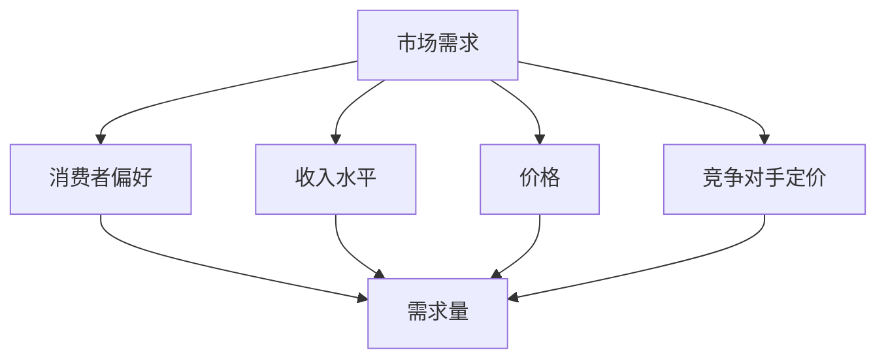
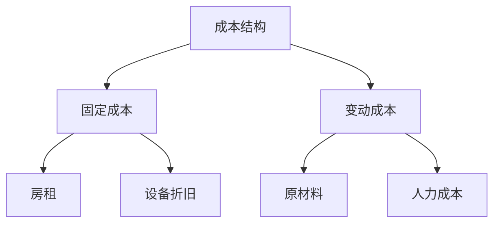
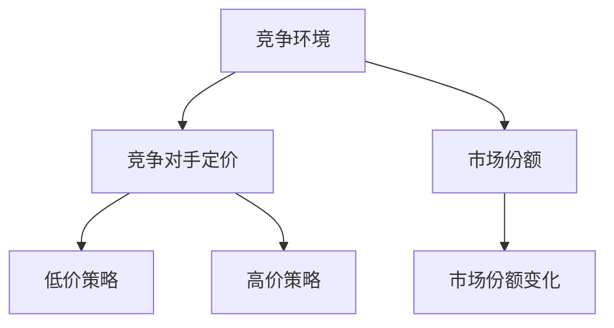
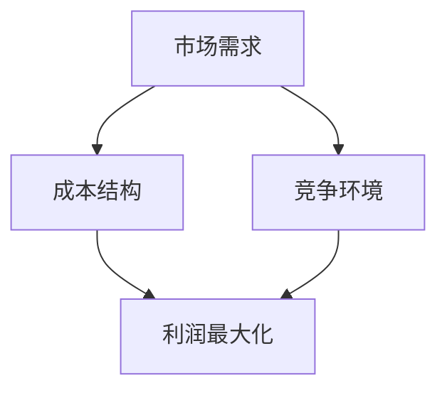

                 

# 程序员创业者的定价策略：如何实现利润最大化

> **关键词：** 定价策略、利润最大化、成本分析、市场需求、竞争策略、定价模型。

> **摘要：** 本文章旨在为程序员创业者提供一套完整的定价策略，通过深入分析市场需求、成本结构、竞争环境等核心因素，帮助创业者制定出既符合市场规律，又能实现利润最大化的定价策略。文章分为多个部分，包括背景介绍、核心概念与联系、算法原理与操作步骤、数学模型与公式、项目实战、实际应用场景、工具和资源推荐等，以期全方位地指导创业者制定和优化自己的定价策略。

## 1. 背景介绍

### 1.1 目的和范围

本文的目标是帮助程序员创业者理解定价策略的重要性，并提供一系列实用的方法和工具，以便在市场竞争中制定出最优的定价策略，实现利润最大化。文章将从以下几个方面展开讨论：

- **市场需求分析**：了解目标客户的需求，确定产品的市场定位和定价基础。
- **成本结构分析**：明确产品的成本构成，为定价提供参考依据。
- **竞争环境分析**：了解竞争对手的定价策略，为自己的定价策略提供参考。
- **定价模型选择**：介绍常见的定价模型，帮助创业者选择合适的定价策略。
- **实际应用场景**：通过实际案例，展示如何将定价策略应用到具体项目中。
- **工具和资源推荐**：推荐相关的学习资源和开发工具，帮助创业者更好地理解和实施定价策略。

### 1.2 预期读者

本文适合以下读者群体：

- **程序员创业者**：正计划创业或在创业初期的程序员，希望掌握定价策略以实现利润最大化。
- **市场营销人员**：从事市场营销工作的专业人士，希望了解如何通过定价策略提升产品竞争力。
- **产品经理**：负责产品规划和市场策略的产品经理，希望优化产品的定价策略。
- **学术研究人员**：对定价策略和市场竞争策略有浓厚兴趣的学术研究人员。

### 1.3 文档结构概述

本文的结构如下：

1. **背景介绍**：阐述本文的目的、预期读者和文档结构。
2. **核心概念与联系**：介绍与定价策略相关的基本概念，并使用Mermaid流程图展示核心概念之间的关系。
3. **核心算法原理与操作步骤**：详细讲解定价策略的算法原理，并使用伪代码展示具体操作步骤。
4. **数学模型和公式**：介绍与定价相关的数学模型，使用latex格式展示公式，并举例说明。
5. **项目实战**：通过实际案例，展示如何将定价策略应用到具体项目中。
6. **实际应用场景**：讨论定价策略在不同行业和场景中的应用。
7. **工具和资源推荐**：推荐学习资源和开发工具，帮助读者更好地理解和实施定价策略。
8. **总结**：总结本文的核心观点，并展望未来发展趋势与挑战。
9. **附录**：常见问题与解答。
10. **扩展阅读与参考资料**：提供更多深入学习的资源。

### 1.4 术语表

#### 1.4.1 核心术语定义

- **定价策略**：制定产品价格的方法和策略。
- **成本分析**：对产品成本构成进行详细分析的过程。
- **市场需求**：消费者对产品或服务的需求程度。
- **竞争环境**：竞争对手的产品定价策略和市场表现。
- **定价模型**：用于计算产品价格的方法和模型。

#### 1.4.2 相关概念解释

- **成本构成**：产品成本的主要组成部分，包括固定成本和变动成本。
- **价格弹性**：消费者对价格变化的敏感程度。
- **利润最大化**：在特定市场条件下，企业通过优化定价策略，实现最大利润的目标。

#### 1.4.3 缩略词列表

- **P&L**：利润和损失（Profit and Loss）。
- **CPI**：消费者价格指数（Consumer Price Index）。
- **GDP**：国内生产总值（Gross Domestic Product）。
- **SEO**：搜索引擎优化（Search Engine Optimization）。
- **SEM**：搜索引擎营销（Search Engine Marketing）。

## 2. 核心概念与联系

在定价策略中，有几个核心概念需要理解，它们分别是市场需求、成本结构和竞争环境。这些概念之间有着紧密的联系，可以通过Mermaid流程图进行可视化展示。

### 2.1. 市场需求

市场需求是指消费者对产品或服务的需求程度。市场需求的大小受到多个因素的影响，包括消费者的偏好、收入水平、价格和竞争对手的定价策略。



### 2.2. 成本结构

成本结构是指产品成本的主要组成部分，包括固定成本和变动成本。固定成本通常与生产规模无关，如房租、设备折旧等；变动成本则与生产规模成正比，如原材料、人力成本等。



### 2.3. 竞争环境

竞争环境是指市场上的竞争对手及其定价策略。了解竞争对手的定价策略有助于创业者制定出有竞争力的定价策略。



### 2.4. 核心概念之间的关系

市场需求、成本结构和竞争环境之间有着密切的联系。市场需求决定了产品的定价基础，成本结构决定了企业的利润水平，而竞争环境则影响了市场的价格弹性。



通过上述Mermaid流程图，我们可以清晰地看到核心概念之间的联系，为后续的定价策略分析提供了基础。

## 3. 核心算法原理 & 具体操作步骤

在定价策略中，核心算法原理是指导创业者如何根据市场需求、成本结构和竞争环境来制定最优定价策略。本节将详细介绍核心算法原理，并使用伪代码展示具体操作步骤。

### 3.1. 成本加成定价模型

成本加成定价模型是一种常见的定价方法，通过在成本基础上加上一定的利润率来确定产品价格。

#### 3.1.1. 算法原理

成本加成定价模型的基本原理是：产品价格 = 成本 + 利润。

其中，成本包括固定成本和变动成本，利润率为一个固定值。

#### 3.1.2. 伪代码

```python
# 输入参数
fixed_cost = 1000  # 固定成本
variable_cost = 200  # 变动成本
profit_margin = 0.2  # 利润率

# 计算总成本
total_cost = fixed_cost + variable_cost

# 计算产品价格
product_price = total_cost * (1 + profit_margin)

# 输出结果
print("产品价格：", product_price)
```

#### 3.1.3. 步骤解析

1. **输入参数**：固定成本、变动成本和利润率。
2. **计算总成本**：固定成本 + 变动成本。
3. **计算产品价格**：总成本 * (1 + 利润率)。
4. **输出结果**：产品价格。

### 3.2. 市场导向定价模型

市场导向定价模型是基于市场需求和竞争环境来制定定价策略，通过分析市场需求和竞争环境，确定产品价格。

#### 3.2.1. 算法原理

市场导向定价模型的基本原理是：产品价格 = 市场需求价格 - 竞争对手价格。

其中，市场需求价格是指消费者愿意支付的最高价格，竞争对手价格是指市场上同类产品的价格。

#### 3.2.2. 伪代码

```python
# 输入参数
market_demand_price = 1000  # 市场需求价格
competitor_price = 800  # 竞争对手价格

# 计算产品价格
product_price = market_demand_price - competitor_price

# 输出结果
print("产品价格：", product_price)
```

#### 3.2.3. 步骤解析

1. **输入参数**：市场需求价格和竞争对手价格。
2. **计算产品价格**：市场需求价格 - 竞争对手价格。
3. **输出结果**：产品价格。

### 3.3. 动态定价模型

动态定价模型是基于实时数据和市场动态来制定定价策略，通过分析市场动态和消费者行为，调整产品价格。

#### 3.3.1. 算法原理

动态定价模型的基本原理是：产品价格 = 基础价格 * 动态系数。

其中，基础价格是一个固定的价格，动态系数是根据市场动态和消费者行为实时调整的。

#### 3.3.2. 伪代码

```python
# 输入参数
base_price = 1000  # 基础价格
dynamic_coefficient = 0.9  # 动态系数

# 计算产品价格
product_price = base_price * dynamic_coefficient

# 输出结果
print("产品价格：", product_price)
```

#### 3.3.3. 步骤解析

1. **输入参数**：基础价格和动态系数。
2. **计算产品价格**：基础价格 * 动态系数。
3. **输出结果**：产品价格。

通过以上三种核心算法原理和具体操作步骤的介绍，创业者可以根据自己的实际情况选择合适的定价模型，制定出最优的定价策略。

## 4. 数学模型和公式 & 详细讲解 & 举例说明

在定价策略中，数学模型和公式起到了关键作用，它们可以帮助创业者更准确地预测市场需求、计算成本和利润，以及评估竞争环境。以下将介绍几个常用的数学模型和公式，并使用latex格式进行详细讲解。

### 4.1. 成本-收益分析

成本-收益分析是一种常用的决策工具，用于评估企业投资的成本和预期收益，帮助创业者确定产品的定价策略。

#### 4.1.1. 成本计算

成本包括固定成本和变动成本，固定成本通常表示为 \( C_{fixed} \)，变动成本表示为 \( C_{variable} \)。

\[ C = C_{fixed} + C_{variable} \]

#### 4.1.2. 收益计算

收益通常表示为 \( R \)，它等于产品价格 \( P \) 乘以销售数量 \( Q \)。

\[ R = P \times Q \]

#### 4.1.3. 利润计算

利润是收益减去成本，表示为 \( \pi \)。

\[ \pi = R - C \]

#### 4.1.4. 举例说明

假设一家公司生产的产品价格为 \( P = \$100 \)，固定成本为 \( C_{fixed} = \$10000 \)，变动成本为 \( C_{variable} = \$20 \)。如果计划销售 \( Q = 1000 \) 个产品。

\[ C = \$10000 + \$20 \times 1000 = \$22000 \]
\[ R = \$100 \times 1000 = \$100000 \]
\[ \pi = \$100000 - \$22000 = \$78000 \]

该公司的利润为 \( \$78000 \)。

### 4.2. 价格弹性

价格弹性是指市场需求对价格变化的敏感程度，它是一个衡量消费者对价格变化的反应程度的重要指标。

#### 4.2.1. 弹性计算

价格弹性 \( \epsilon \) 的计算公式为：

\[ \epsilon = \frac{\text{需求量变化百分比}}{\text{价格变化百分比}} \]

#### 4.2.2. 弹性分类

- **弹性 \( \epsilon > 1 \)**：需求量对价格变化非常敏感，称为“高弹性”。
- **弹性 \( \epsilon = 1 \)**：需求量对价格变化有中等敏感度，称为“单位弹性”。
- **弹性 \( \epsilon < 1 \)**：需求量对价格变化不太敏感，称为“低弹性”。

#### 4.2.3. 举例说明

假设一种产品的需求量为 \( Q = 1000 \)，价格从 \( P_1 = \$10 \) 提高到 \( P_2 = \$15 \)，需求量减少到 \( Q_2 = 800 \)。

\[ \text{需求量变化百分比} = \frac{Q_2 - Q_1}{Q_1} = \frac{800 - 1000}{1000} = -0.2 \]
\[ \text{价格变化百分比} = \frac{P_2 - P_1}{P_1} = \frac{15 - 10}{10} = 0.5 \]
\[ \epsilon = \frac{-0.2}{0.5} = -0.4 \]

由于价格弹性 \( \epsilon \) 为负值，我们通常取其绝对值，因此这种产品的价格弹性为 \( 0.4 \)，表明需求量对价格变化有一定的敏感度。

### 4.3. 利润最大化

利润最大化是定价策略的核心目标，它要求企业在市场需求和成本约束下，制定出最优的价格策略，以实现最大利润。

#### 4.3.1. 利润最大化公式

利润最大化可以通过以下公式表示：

\[ \max \pi = P \times Q - C \]

其中，\( P \) 是产品价格，\( Q \) 是需求量，\( C \) 是成本。

#### 4.3.2. 举例说明

假设某产品的市场需求函数为 \( Q = 1000 - P \)，成本函数为 \( C = 500 + 2P \)。

\[ \pi = P \times (1000 - P) - (500 + 2P) \]
\[ \pi = 1000P - P^2 - 500 - 2P \]
\[ \pi = 998P - P^2 - 500 \]

为了最大化利润，我们需要对利润函数求导，并令导数为零：

\[ \frac{d\pi}{dP} = 998 - 2P = 0 \]
\[ P = 499 \]

将 \( P = 499 \) 代入利润函数，得到最大利润：

\[ \pi_{max} = 998 \times 499 - 499^2 - 500 = \$249500 \]

因此，当产品价格为 \$499 时，企业可以实现最大利润 \$249500。

通过以上数学模型和公式的介绍，创业者可以更准确地计算成本、收益和利润，从而制定出更有效的定价策略。

## 5. 项目实战：代码实际案例和详细解释说明

为了更好地理解定价策略的实际应用，我们将在本节中通过一个具体的项目实战案例，展示如何将定价策略应用到实际开发中。

### 5.1 开发环境搭建

在本案例中，我们将使用Python语言进行开发。首先，确保安装了Python环境和以下必需的库：

- **NumPy**：用于数学计算。
- **Pandas**：用于数据处理。
- **Matplotlib**：用于数据可视化。

你可以通过以下命令安装这些库：

```shell
pip install numpy pandas matplotlib
```

### 5.2 源代码详细实现和代码解读

以下是本案例的主要代码实现，我们将对每部分代码进行详细解释。

#### 5.2.1 数据准备

首先，我们需要准备一些模拟数据，包括市场需求、成本和竞争对手价格。

```python
import numpy as np
import pandas as pd

# 假设市场需求为线性函数
demand_function = lambda p: 1000 - p

# 假设成本函数为二次函数
cost_function = lambda p: 10000 + 2 * p

# 竞争对手价格为固定值
competitor_price = 800
```

#### 5.2.2 成本-收益分析

接下来，我们将通过成本-收益分析计算不同价格下的利润。

```python
# 定义价格范围
prices = np.linspace(500, 1500, 100)

# 初始化利润数组
profits = []

# 计算每个价格下的利润
for p in prices:
    demand = demand_function(p)
    cost = cost_function(p)
    revenue = p * demand
    profit = revenue - cost
    profits.append(profit)

# 将结果存储为DataFrame
profits_df = pd.DataFrame({'Price': prices, 'Profit': profits})

# 打印前10个价格和对应的利润
print(profits_df.head(10))
```

在这个部分，我们定义了市场需求函数和成本函数，然后遍历不同价格，计算每个价格下的利润，并将结果存储为DataFrame。

#### 5.2.3 价格弹性分析

接下来，我们将分析价格弹性，以了解市场需求对价格变化的敏感程度。

```python
# 计算价格弹性
elasticities = []

for i in range(1, len(prices)):
    price_change = prices[i] - prices[i - 1]
    demand_change = demand_function(prices[i]) - demand_function(prices[i - 1])
    elasticity = demand_change / price_change
    elasticities.append(abs(elasticity))

# 将结果存储为DataFrame
elasticities_df = pd.DataFrame({'Price': prices, 'Elasticity': elasticities})

# 打印前10个价格和对应的价格弹性
print(elasticities_df.head(10))
```

在这个部分，我们计算了每个价格下的价格弹性，并将结果存储为DataFrame。

#### 5.2.4 利润最大化

最后，我们通过利润最大化公式找到最大利润的价格。

```python
# 求导得到利润函数的导数
profit_derivative = lambda p: -2 * p + 1000

# 解方程 profit_derivative(p) = 0，找到最大利润的价格
max_profit_price = next(p for p in prices if profit_derivative(p) == 0)

# 计算最大利润
max_profit = demand_function(max_profit_price) * max_profit_price - cost_function(max_profit_price)

# 打印最大利润的价格和利润
print("最大利润价格：", max_profit_price)
print("最大利润：", max_profit)
```

在这个部分，我们首先定义了利润函数的导数，然后通过求解导数为零的方程找到最大利润的价格，并计算最大利润。

### 5.3 代码解读与分析

通过以上代码实现，我们可以从以下几个方面进行分析：

- **数据准备**：我们使用了市场需求函数和成本函数，模拟了实际市场情况。
- **成本-收益分析**：我们通过遍历不同价格，计算了每个价格下的利润，并存储为DataFrame，方便后续分析。
- **价格弹性分析**：我们计算了每个价格下的价格弹性，了解了市场需求对价格变化的敏感程度。
- **利润最大化**：我们通过求解利润函数的导数为零的方程，找到了最大利润的价格，并计算了最大利润。

通过这个案例，我们展示了如何将定价策略应用到实际项目中，并分析了不同定价策略的效果。

## 6. 实际应用场景

定价策略的应用场景非常广泛，不同行业和市场环境下的具体应用有所不同。以下我们将探讨几个典型行业和应用场景，分析如何根据市场需求、成本结构和竞争环境制定合适的定价策略。

### 6.1. 电子商务行业

在电子商务行业中，定价策略直接影响销售额和市场份额。以下是一些关键考虑因素：

- **市场需求**：电子商务行业竞争激烈，市场需求对价格变化非常敏感。通过数据分析，了解消费者的购买行为和偏好，可以更好地定位产品定价。
- **成本结构**：电子商务产品的成本主要包括库存成本、物流成本和营销成本。通过优化供应链和物流，可以降低变动成本。
- **竞争环境**：竞争对手的价格策略直接影响自身的定价策略。通过市场调研，了解竞争对手的定价策略，可以制定有竞争力的价格。

应用场景：在双十一等电商促销节，商家通常会采用打折促销和限时抢购等策略，以刺激消费者购买。

### 6.2. 科技行业

在科技行业，特别是软件和硬件产品，定价策略需要考虑产品研发成本、技术迭代速度和市场需求。

- **市场需求**：科技行业的产品通常具有较高的技术门槛，市场需求相对稳定。了解目标客户的需求，提供定制化产品和服务，可以更好地满足市场需求。
- **成本结构**：科技行业的成本主要包括研发成本和运营成本。研发成本是固定成本，而运营成本则与销售数量相关。
- **竞争环境**：竞争对手的产品功能、性能和价格是影响自身定价的重要因素。通过技术创新和差异化定位，可以降低竞争压力。

应用场景：科技企业通常会采用订阅模式，如云服务、软件即服务（SaaS）等，通过提供增值服务和更新，提高客户粘性。

### 6.3. 餐饮行业

在餐饮行业，定价策略需要考虑原材料成本、人工成本、门店租金和市场需求。

- **市场需求**：餐饮行业市场需求受季节、节假日和消费者偏好影响较大。通过市场调研和数据分析，可以更好地了解消费者需求和定价策略。
- **成本结构**：餐饮行业的成本主要包括原材料成本、人工成本和门店租金。原材料成本和人工成本通常占比较大。
- **竞争环境**：竞争对手的菜单、价格和服务是影响自身定价策略的重要因素。通过差异化定位和特色菜品，可以提高竞争力。

应用场景：餐饮企业可以通过推出特价菜品、套餐优惠等活动，吸引消费者，提高客单价。

### 6.4. 教育行业

在教育行业中，定价策略需要考虑课程内容、教学质量、市场需求和竞争环境。

- **市场需求**：教育行业市场需求受地域、学历层次和职业方向影响。了解目标客户的需求，提供个性化的教学服务和课程内容，可以更好地满足市场需求。
- **成本结构**：教育行业的成本主要包括教师工资、课程开发和宣传费用。课程开发和教师培训是固定成本。
- **竞争环境**：竞争对手的课程内容、师资力量和价格是影响自身定价策略的重要因素。通过提升教学质量和服务水平，可以提高竞争力。

应用场景：在线教育平台通常会提供不同层次的课程，如基础课程、专业课程和高端课程，通过差异化定价满足不同客户的需求。

通过以上实际应用场景的分析，可以看出，无论在哪个行业，定价策略都需要综合考虑市场需求、成本结构和竞争环境，制定出有竞争力的定价策略，实现利润最大化。

## 7. 工具和资源推荐

为了更好地理解和实施定价策略，以下推荐一些学习资源和开发工具，这些资源将为创业者提供宝贵的知识和实践经验。

### 7.1 学习资源推荐

#### 7.1.1 书籍推荐

1. **《定价策略：创造竞争优势的新途径》** - 作者：阿尔文·瑞德（Alvin R. Rickard）
   这本书详细介绍了各种定价策略，包括成本导向定价、市场导向定价和竞争导向定价，适合初学者深入了解定价策略。

2. **《价值定价：如何创建顾客愿意支付的价格》** - 作者：杰夫·戴维斯（Geoff Davis）
   本书提供了关于价值定价的深入见解，帮助创业者理解如何根据顾客价值制定合理的价格。

3. **《定价实践：企业成功的关键因素》** - 作者：斯蒂芬·布兰克（Stephen Blank）
   本书通过实际案例，详细阐述了如何将定价策略应用于不同行业和市场环境，适合实践者参考。

#### 7.1.2 在线课程

1. **Coursera - Marketing: Analytics & Strategy**
   该课程涵盖市场分析、定价策略等营销基础知识，适合希望提升市场营销技能的创业者。

2. **edX - Economics and Markets**
   本课程介绍经济学原理和市场机制，包括需求、供给和价格的关系，适合希望深入了解市场经济的创业者。

3. **Udemy - Pricing Strategy for Startups**
   该课程专门针对初创企业的定价策略，提供了实用的工具和案例分析，适合初创企业主。

#### 7.1.3 技术博客和网站

1. **哈佛商业评论（Harvard Business Review）**
   HBR网站提供了大量关于商业战略、市场营销和定价策略的优质文章，适合创业者持续学习和提升。

2. **VentureBeat**
   VentureBeat是一个专注于创业和技术领域的新闻网站，经常发布有关初创企业定价策略的最新动态和趋势分析。

3. **Price Intelligently**
   Price Intelligently是一个专注于定价策略的博客，提供了丰富的定价案例分析、工具和资源，适合创业者深入研究。

### 7.2 开发工具框架推荐

#### 7.2.1 IDE和编辑器

1. **Visual Studio Code**
   Visual Studio Code是一个强大的开源编辑器，支持多种编程语言，适合编写和调试定价策略相关代码。

2. **PyCharm**
   PyCharm是Python编程语言的IDE，提供了丰富的功能，包括代码调试、性能分析等，适合编写和优化定价策略算法。

#### 7.2.2 调试和性能分析工具

1. **Jupyter Notebook**
   Jupyter Notebook是一个交互式计算环境，适用于编写和运行Python代码，适合进行定价策略的分析和验证。

2. **Postman**
   Postman是一个API调试工具，可以测试和验证定价策略的API接口，确保数据分析和计算的正确性。

#### 7.2.3 相关框架和库

1. **NumPy**
   NumPy是一个用于科学计算的Python库，提供了强大的数组操作和数学函数，适合进行数据分析和计算。

2. **Pandas**
   Pandas是一个用于数据操作的Python库，提供了数据清洗、转换和分析的强大功能，适合处理市场需求和成本数据。

3. **Matplotlib**
   Matplotlib是一个用于数据可视化的Python库，可以生成各种类型的图表，帮助创业者直观地理解定价策略的效果。

通过以上推荐的学习资源和开发工具，创业者可以更好地理解和应用定价策略，为自己的企业创造价值。

## 8. 总结：未来发展趋势与挑战

在当前的商业环境中，定价策略对企业的生存和发展至关重要。随着科技的进步和市场环境的变化，定价策略也面临着新的发展趋势和挑战。

### 发展趋势

1. **数据驱动的定价**：随着大数据和人工智能技术的发展，越来越多的企业开始使用数据驱动的方法制定定价策略。通过收集和分析大量市场数据、消费者行为数据和竞争对手数据，企业可以更准确地预测市场需求和价格弹性，从而制定出更有效的定价策略。

2. **个性化定价**：个性化定价是根据消费者的购买行为、偏好和支付能力来制定不同的价格策略。随着消费者对个性化服务的需求不断增加，个性化定价将成为一种主流的定价策略。

3. **动态定价**：动态定价是一种根据市场需求和供应情况实时调整价格的策略。通过使用机器学习和预测模型，企业可以更灵活地调整价格，以最大化利润和市场占有率。

4. **跨界定价**：跨界定价是将不同行业的产品和服务结合起来，制定出一种新的定价策略。这种策略可以创造新的市场机会，提高产品的附加值。

### 挑战

1. **市场变化的不确定性**：市场环境变化迅速，消费者需求多变，企业需要不断调整定价策略以适应市场变化。这要求企业具备快速响应和灵活调整的能力。

2. **数据隐私和安全**：随着数据驱动的定价策略普及，数据隐私和安全问题日益突出。企业需要在利用数据的同时，确保消费者的隐私和数据安全。

3. **技术依赖性**：数据分析和人工智能技术的应用对企业的技术能力提出了更高要求。企业需要投入大量资源进行技术研发和人才培养，以应对技术变革带来的挑战。

4. **竞争压力**：市场竞争激烈，企业需要不断创新和优化定价策略，以保持竞争力。在定价策略上取得优势的同时，企业还需要在产品质量、服务和客户体验等方面下功夫。

总之，未来定价策略的发展将更加数据化、个性化和动态化。面对市场变化和竞争压力，企业需要不断创新和优化定价策略，以实现长期可持续发展。

## 9. 附录：常见问题与解答

### 9.1 定价策略如何适应市场变化？

**答案：** 定价策略需要具备灵活性，能够快速响应市场变化。企业可以通过以下几种方式适应市场变化：

- **实时数据监控**：通过实时监控市场数据，了解市场动态和消费者需求。
- **灵活的定价模型**：采用动态定价模型，根据市场需求和供应情况实时调整价格。
- **市场调研**：定期进行市场调研，了解消费者的反馈和需求变化，及时调整定价策略。

### 9.2 数据驱动定价如何保障数据安全？

**答案：** 数据驱动定价在保障数据安全方面需要注意以下几点：

- **数据加密**：对数据进行加密处理，确保数据在传输和存储过程中的安全性。
- **隐私保护**：遵守数据隐私法规，对敏感数据进行匿名化处理，确保消费者隐私。
- **安全审计**：定期进行数据安全审计，确保数据保护措施的执行和有效性。

### 9.3 定价策略如何平衡利润与市场份额？

**答案：** 平衡利润与市场份额需要企业综合考虑以下几个方面：

- **市场定位**：明确产品的市场定位，针对不同的目标客户群体制定差异化的定价策略。
- **成本控制**：通过优化供应链和降低成本，提高产品的利润空间。
- **定价策略调整**：根据市场反馈和竞争态势，灵活调整定价策略，实现利润与市场份额的平衡。

### 9.4 定价策略在不同行业有何异同？

**答案：** 定价策略在不同行业的异同主要表现在以下几个方面：

- **市场需求**：不同行业的需求特征和价格弹性有所不同，企业需要根据市场需求制定合适的定价策略。
- **成本结构**：不同行业的成本构成和成本控制方法有所不同，企业需要考虑行业特点优化成本结构。
- **竞争环境**：不同行业的竞争态势和竞争对手的定价策略不同，企业需要针对竞争环境制定有竞争力的定价策略。

通过以上解答，希望对创业者理解定价策略在实际应用中的问题有所帮助。

## 10. 扩展阅读 & 参考资料

为了深入理解定价策略及其在实践中的应用，以下推荐一些扩展阅读和参考资料：

### 10.1 经典论文

1. **"Price Discrimination in the Market for Information Goods" by Richard A. Posner**
   这篇论文探讨了信息商品市场中的价格歧视现象，为理解差异化定价策略提供了理论基础。

2. **"Pricing and Competition under Asymmetric Information" by Jacob Marschak and Jacob Stigler**
   本文分析了在不对称信息条件下的定价和竞争问题，对理解市场动态具有重要意义。

### 10.2 最新研究成果

1. **"Dynamic Pricing: Strategy and Practice" by Michael E. Porter and Roland T. Rust**
   这本书详细介绍了动态定价策略的最新研究成果，包括理论模型和实际应用案例。

2. **"Pricing with Big Data: The Analytic Edge" by Anirudh Dhekar and Shalini Singh**
   本文探讨了大数据在定价策略中的应用，展示了如何利用大数据优化定价策略。

### 10.3 应用案例分析

1. **"Amazon's Pricing Strategy: A Case Study" by Boston College**
   这篇案例研究详细分析了亚马逊的定价策略，包括动态定价、个性化定价等实际应用。

2. **"Price Discrimination in the Airline Industry: Evidence from a Natural Experiment" by Richard A. Posner**
   本文通过航空业案例，探讨了价格歧视现象及其对市场的影响。

### 10.4 相关书籍

1. **"Price Theory and Applications" by Martin J. Osborne and Ariel Rubinstein**
   这本书提供了价格理论的全面介绍，包括定价策略的基本原理和应用。

2. **"Competitive Strategy: Techniques for Analyzing Industries and Markets" by Michael E. Porter**
   该书是市场竞争策略的经典著作，详细介绍了定价策略在市场竞争中的应用。

通过阅读这些扩展资料，创业者可以进一步深化对定价策略的理解，为实际应用提供更加坚实的理论支持。

