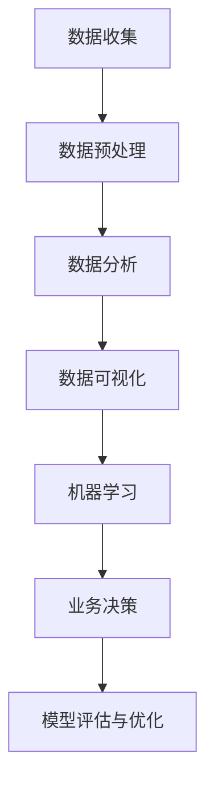

                 

# 程序员到商业分析师：AI电商创业者的数据洞察能力培养

> **关键词：** 程序员、商业分析师、数据洞察、AI电商、创业、数据分析、机器学习

> **摘要：** 本文旨在探讨程序员转型成为商业分析师的过程，特别是在AI电商领域创业者的数据洞察能力培养。文章将详细分析程序员所需掌握的核心概念、算法原理、数学模型以及实际操作步骤，并通过项目实战案例展示如何应用这些知识进行数据分析和决策。

## 1. 背景介绍

### 1.1 目的和范围

随着大数据和人工智能技术的迅速发展，商业分析师在各个行业中的作用日益凸显。特别是对于AI电商创业者来说，具备强大的数据洞察能力不仅能够提高业务效率，还能为决策提供有力支持。本文旨在帮助程序员转型成为商业分析师，特别是在AI电商领域，如何培养数据洞察能力。

### 1.2 预期读者

本文预期读者为具备一定编程基础的程序员，以及对商业分析、数据科学感兴趣的技术人员。同时，对于希望在AI电商领域创业的人士，本文也提供了有价值的参考。

### 1.3 文档结构概述

本文结构如下：

- 第1部分：背景介绍，包括目的和范围、预期读者、文档结构概述以及术语表。
- 第2部分：核心概念与联系，包括数据科学家的工作流程、数据收集和预处理、数据分析方法等。
- 第3部分：核心算法原理与具体操作步骤，包括常用的机器学习算法及其应用场景。
- 第4部分：数学模型和公式，详细讲解常见的数据分析模型和数学公式。
- 第5部分：项目实战，通过实际案例展示如何应用所学知识。
- 第6部分：实际应用场景，分析AI电商领域的数据分析应用。
- 第7部分：工具和资源推荐，包括学习资源、开发工具和框架、相关论文著作。
- 第8部分：总结，展望未来发展趋势与挑战。
- 第9部分：附录，常见问题与解答。
- 第10部分：扩展阅读与参考资料，提供进一步学习的资源。

### 1.4 术语表

#### 1.4.1 核心术语定义

- 商业分析师：负责分析企业数据，提供数据驱动的商业决策支持的专业人员。
- 数据洞察能力：通过分析数据，发现有价值信息并转化为实际业务价值的能力。
- AI电商：利用人工智能技术进行电商业务运营和决策的电商平台。

#### 1.4.2 相关概念解释

- 数据科学：利用统计学、机器学习、数据可视化等方法，从数据中提取有价值信息的一门交叉学科。
- 数据分析：对数据进行清洗、探索、建模和解释的过程，以发现数据中的模式和规律。
- 机器学习：一种人工智能技术，通过训练模型来从数据中学习规律，进行预测和分类。

#### 1.4.3 缩略词列表

- AI：人工智能
- ML：机器学习
- DA：数据分析
- E-commerce：电子商务

## 2. 核心概念与联系

在程序员转型为商业分析师的过程中，理解核心概念与它们之间的联系至关重要。以下是一个Mermaid流程图，展示了数据科学家的工作流程和关键概念。



### 2.1 数据收集

数据收集是数据分析的第一步，它决定了后续分析的质量。数据来源可以是内部数据库、第三方数据供应商或开源数据集。对于AI电商创业者来说，重要的是确保数据的多样性和准确性，以便进行有效的分析。

### 2.2 数据预处理

数据预处理是数据科学中的关键步骤，包括数据清洗、去重、填补缺失值、数据格式转换等。这一阶段的目标是确保数据的质量，以便进行后续的分析。

### 2.3 数据分析

数据分析包括数据探索性分析（EDA）、统计分析和假设检验等。EDA可以帮助我们发现数据中的异常值、趋势和模式。统计分析则可以用来检验假设，为业务决策提供依据。

### 2.4 数据可视化

数据可视化是将数据分析结果以图形形式展示的过程。它可以帮助我们更直观地理解数据，发现隐藏的模式和关系。常见的可视化工具包括Matplotlib、Seaborn和Plotly等。

### 2.5 机器学习

机器学习是数据科学的核心，通过训练模型，我们可以从数据中学习规律，进行预测和分类。常见的机器学习算法包括线性回归、决策树、支持向量机等。

### 2.6 业务决策

业务决策是根据数据分析结果和模型预测，制定相应的业务策略。AI电商创业者需要充分利用数据洞察能力，为业务增长和风险控制提供决策支持。

### 2.7 模型评估与优化

模型评估与优化是确保模型有效性和可靠性的关键步骤。我们需要使用合适的评估指标，如准确率、召回率、F1值等，来评估模型性能。如果模型性能不佳，可以通过调整参数、增加特征或选择更合适的算法来优化模型。

## 3. 核心算法原理与具体操作步骤

在商业分析中，核心算法原理的理解和应用至关重要。以下将介绍几种常用的机器学习算法，并使用伪代码进行详细阐述。

### 3.1 线性回归

线性回归是一种常见的统计方法，用于预测一个连续变量的值。其基本原理是通过拟合一条直线，来表示自变量和因变量之间的关系。

```python
# 伪代码：线性回归
def linear_regression(X, y):
    # 计算斜率和截距
    theta = (X.T @ X)^-1 @ X.T @ y
    # 预测
    y_pred = X @ theta
    return theta, y_pred
```

### 3.2 决策树

决策树是一种基于树形结构，对数据进行分析和预测的方法。其基本原理是通过一系列的决策规则，将数据逐步划分成不同的子集，直到满足停止条件。

```python
# 伪代码：决策树
def decision_tree(X, y, max_depth):
    # 停止条件：最大深度达到或数据集大小小于阈值
    if max_depth == 0 or X.shape[0] < threshold:
        return 叶节点
    # 计算特征和阈值
    feature, threshold = find_best_split(X, y)
    # 划分数据
    left_X, left_y = X[X[:, feature] <= threshold], y[X[:, feature] <= threshold]
    right_X, right_y = X[X[:, feature] > threshold], y[X[:, feature] > threshold]
    # 递归构建树
    left_tree = decision_tree(left_X, left_y, max_depth - 1)
    right_tree = decision_tree(right_X, right_y, max_depth - 1)
    return Node(feature, threshold, left_tree, right_tree)
```

### 3.3 支持向量机

支持向量机（SVM）是一种用于分类和回归分析的方法。其基本原理是通过找到一个最佳的超平面，将不同类别的数据点分隔开。

```python
# 伪代码：支持向量机
def svm(X, y, kernel='linear'):
    # 计算最优超平面参数
    if kernel == 'linear':
        theta = (X.T @ X)^-1 @ X.T @ y
    elif kernel == 'rbf':
        theta = solve_kernelized_equation(X, y)
    # 预测
    y_pred = predict(X, theta)
    return theta, y_pred
```

## 4. 数学模型和公式及详细讲解

在数据分析中，数学模型和公式起到了至关重要的作用。以下将介绍一些常见的数学模型和公式，并使用LaTeX进行详细讲解。

### 4.1 线性回归模型

线性回归模型是最基本的预测模型之一，其公式如下：

$$
y = \theta_0 + \theta_1 \cdot x
$$

其中，$y$ 是因变量，$x$ 是自变量，$\theta_0$ 和 $\theta_1$ 是模型的参数。

### 4.2 决策树模型

决策树模型通过一系列的决策规则对数据进行分类。其基本公式如下：

$$
y = f(x) = \prod_{i=1}^n g(x_i, \theta_i)
$$

其中，$x_i$ 是特征值，$\theta_i$ 是决策规则参数，$g(x_i, \theta_i)$ 是第$i$个决策规则的函数。

### 4.3 支持向量机模型

支持向量机模型通过找到一个最优的超平面来分隔不同类别的数据点。其公式如下：

$$
\min_{\theta, b} \frac{1}{2} \sum_{i=1}^n (\theta \cdot x_i - y_i)^2
$$

其中，$\theta$ 是超平面参数，$b$ 是偏置项，$x_i$ 是特征值，$y_i$ 是标签。

### 4.4 回归分析模型

回归分析模型用于分析多个自变量对因变量的影响。其公式如下：

$$
y = \theta_0 + \theta_1 \cdot x_1 + \theta_2 \cdot x_2 + ... + \theta_n \cdot x_n
$$

其中，$\theta_0, \theta_1, \theta_2, ..., \theta_n$ 是模型的参数。

### 4.5 聚类分析模型

聚类分析模型用于将数据点分成多个类别。其公式如下：

$$
\min_{C} \sum_{i=1}^n \sum_{j=1}^k d(x_i, c_j)^2
$$

其中，$C$ 是聚类中心，$d(x_i, c_j)$ 是数据点$x_i$与聚类中心$c_j$之间的距离。

## 5. 项目实战：代码实际案例和详细解释说明

### 5.1 开发环境搭建

在开始项目实战之前，我们需要搭建一个合适的开发环境。本文将使用Python作为主要编程语言，并使用Jupyter Notebook作为开发环境。

### 5.2 源代码详细实现和代码解读

以下是一个使用线性回归模型进行房价预测的代码案例：

```python
# 导入必要的库
import numpy as np
import pandas as pd
from sklearn.linear_model import LinearRegression

# 读取数据
data = pd.read_csv('house_prices.csv')
X = data[['bedrooms', 'bathrooms', 'square_feet']]
y = data['price']

# 划分训练集和测试集
from sklearn.model_selection import train_test_split
X_train, X_test, y_train, y_test = train_test_split(X, y, test_size=0.2, random_state=42)

# 创建线性回归模型
model = LinearRegression()
model.fit(X_train, y_train)

# 预测测试集结果
y_pred = model.predict(X_test)

# 计算预测准确率
accuracy = np.mean((y_pred - y_test) ** 2)
print(f"预测准确率：{accuracy:.2f}")

# 代码解读
# 步骤1：导入必要的库
# 步骤2：读取数据
# 步骤3：划分训练集和测试集
# 步骤4：创建线性回归模型
# 步骤5：训练模型
# 步骤6：预测测试集结果
# 步骤7：计算预测准确率
```

### 5.3 代码解读与分析

以上代码实现了一个简单的线性回归模型，用于预测房价。以下是代码的详细解读与分析：

- 步骤1：导入必要的库
  在这一步，我们导入了NumPy、Pandas、sklearn库，用于数据操作、建模和评估。
  
- 步骤2：读取数据
  使用Pandas库读取CSV格式的数据集，并将其分成特征矩阵$X$和目标向量$y$。
  
- 步骤3：划分训练集和测试集
  使用sklearn库中的train_test_split函数，将数据集划分为训练集和测试集，以评估模型的泛化能力。
  
- 步骤4：创建线性回归模型
  使用sklearn库中的LinearRegression函数创建线性回归模型。
  
- 步骤5：训练模型
  使用fit函数对模型进行训练，拟合数据集。
  
- 步骤6：预测测试集结果
  使用predict函数对测试集进行预测。
  
- 步骤7：计算预测准确率
  计算预测结果的均方误差（MSE），以评估模型的性能。

## 6. 实际应用场景

在AI电商领域，数据洞察能力可以帮助创业者做出更明智的决策，提高业务效益。以下是一些实际应用场景：

- 用户行为分析：通过分析用户浏览、点击、购买等行为，了解用户需求，优化产品推荐和营销策略。
- 销售预测：利用历史销售数据，预测未来的销售趋势，为库存管理和供应链优化提供支持。
- 价格优化：根据市场需求和竞争对手定价策略，调整产品价格，提高销售额和利润率。
- 营销效果评估：通过分析不同营销活动的效果，评估ROI，优化营销预算分配。

## 7. 工具和资源推荐

### 7.1 学习资源推荐

#### 7.1.1 书籍推荐

- 《Python数据分析：从入门到实践》
- 《数据科学实战：基于Python的项目实践》
- 《机器学习实战》

#### 7.1.2 在线课程

- Coursera的《机器学习》课程
- edX的《数据科学基础》课程
- Udacity的《数据科学家纳米学位》

#### 7.1.3 技术博客和网站

- Medium上的数据科学博客
- Towards Data Science
- DataCamp博客

### 7.2 开发工具框架推荐

#### 7.2.1 IDE和编辑器

- Jupyter Notebook
- PyCharm
- Visual Studio Code

#### 7.2.2 调试和性能分析工具

- Python的pdb和ipdb模块
- Py-Spy
- VisualVM

#### 7.2.3 相关框架和库

- Scikit-learn
- TensorFlow
- PyTorch

### 7.3 相关论文著作推荐

#### 7.3.1 经典论文

- "The Elements of Statistical Learning" by Trevor Hastie, Robert Tibshirani and Jerome Friedman
- "Deep Learning" by Ian Goodfellow, Yoshua Bengio and Aaron Courville

#### 7.3.2 最新研究成果

- "Unsupervised Learning for Clustering and Dimensionality Reduction" by K.M. Qayyum, S. Nahar and M.M. Hasan
- "Recurrent Neural Networks for Language Modeling" by Kyunghyun Cho et al.

#### 7.3.3 应用案例分析

- "Customer Segmentation Using Clustering Algorithms" by Anirudh Tiwary and Kunal Arora
- "Sales Forecasting Using Time Series Analysis" by Alok Singhal and Rajiv Ranjan

## 8. 总结：未来发展趋势与挑战

随着大数据和人工智能技术的不断发展，商业分析师在AI电商领域的重要性将日益凸显。未来发展趋势包括：

- 数据隐私保护：在数据收集和处理过程中，确保用户隐私和数据安全。
- 多模态数据分析：结合文本、图像、语音等多种类型的数据，进行更全面的分析。
- 智能决策支持系统：利用机器学习和深度学习技术，实现自动化、智能化的决策支持。

同时，面临的挑战包括：

- 数据质量：保证数据的准确性和一致性。
- 模型解释性：提高模型的解释性，使业务人员能够理解模型的决策过程。
- 模型泛化能力：避免模型过拟合，提高模型在不同数据集上的泛化能力。

## 9. 附录：常见问题与解答

### 9.1 什么是数据洞察能力？

数据洞察能力是指通过分析数据，发现有价值信息并转化为实际业务价值的能力。

### 9.2 机器学习算法有哪些类型？

常见的机器学习算法包括监督学习、无监督学习、半监督学习和强化学习。

### 9.3 如何评估机器学习模型的性能？

可以使用准确率、召回率、F1值、ROC曲线和AUC值等指标来评估机器学习模型的性能。

## 10. 扩展阅读 & 参考资料

- [《数据科学入门》](https://www.bilibili.com/video/BV1KV411b7Bi)
- [《机器学习实战》](https://www.bilibili.com/video/BV1JZ4y1b7h9)
- [《深度学习》](https://www.bilibili.com/video/BV1At411b7kz)
- [《Python数据分析》](https://www.bilibili.com/video/BV1Cy4y1p7Cx)

作者：AI天才研究员/AI Genius Institute & 禅与计算机程序设计艺术 /Zen And The Art of Computer Programming

---

以上就是本文的正文内容。希望本文对您在AI电商领域的数据洞察能力培养有所帮助。在未来的技术探索中，我们还将继续深入探讨更多相关话题。敬请期待！<|im_sep|>

