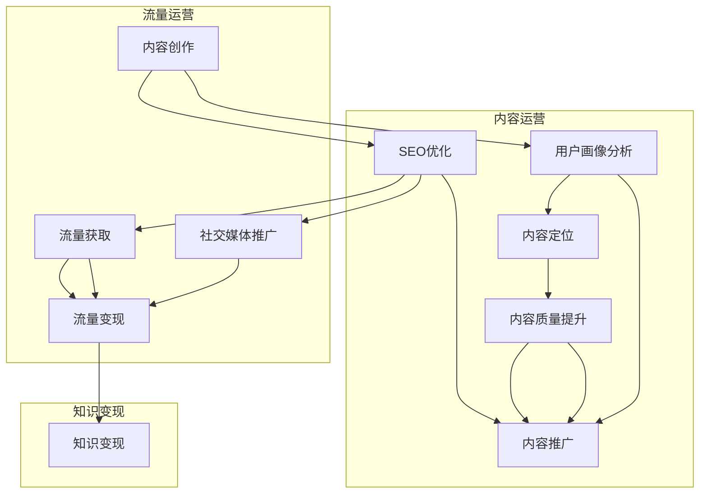

                 

## 程序员如何利用公众号进行知识变现

> **关键词**：知识变现、公众号运营、内容创作、流量变现、技术博客、算法原理、数学模型、项目实战、实战案例、学习资源、开发工具、学术论文。
>
> **摘要**：本文旨在探讨程序员如何通过公众号这一平台实现知识变现。我们将深入分析公众号运营的核心策略，从内容创作、流量获取到变现手段的各个环节，结合算法原理、数学模型以及实际项目案例，提供一整套系统化的运营指南。通过本文的阅读，程序员们将掌握利用公众号进行知识变现的方法和技巧，助力职业发展和个人品牌建设。

### 1. 背景介绍

#### 1.1 目的和范围

本文的目的在于为程序员提供一套利用公众号进行知识变现的完整策略。我们将探讨如何通过公众号这个平台，不仅传播技术知识，还能实现收入的增长。文章将涵盖以下几个主要方面：

- **内容创作与定位**：如何基于自己的技术专长，创作高质量的内容，并明确公众号的定位。
- **流量获取与转化**：如何通过SEO、社交媒体、合作推广等方式，吸引更多的关注者，并将流量转化为粉丝。
- **知识变现手段**：如何通过内容付费、广告收入、课程销售等多种方式实现知识变现。
- **实战案例分析**：结合具体项目案例，详细解读如何通过公众号进行知识变现的步骤和方法。

#### 1.2 预期读者

本文预期读者为具有一定编程基础的程序员，尤其是那些希望在业余时间通过公众号实现知识变现的个人开发者。同时，对于对内容创作和流量运营感兴趣的其他IT从业者，本文也将提供有价值的参考。

#### 1.3 文档结构概述

本文将按照以下结构进行展开：

1. **背景介绍**：介绍文章的目的、预期读者以及文档结构。
2. **核心概念与联系**：通过Mermaid流程图展示公众号运营的核心环节和联系。
3. **核心算法原理 & 具体操作步骤**：详细讲解内容创作、流量获取和知识变现的核心算法原理及具体操作步骤。
4. **数学模型和公式 & 详细讲解 & 举例说明**：使用数学模型和公式，结合实例，深入解释相关概念。
5. **项目实战：代码实际案例和详细解释说明**：通过具体项目案例，展示如何将理论知识应用到实践中。
6. **实际应用场景**：分析公众号在不同技术领域中的应用场景。
7. **工具和资源推荐**：推荐学习资源、开发工具和相关学术论文。
8. **总结：未来发展趋势与挑战**：展望公众号运营的未来趋势和面临的挑战。
9. **附录：常见问题与解答**：解答读者可能遇到的问题。
10. **扩展阅读 & 参考资料**：提供进一步的阅读材料和参考资源。

#### 1.4 术语表

在本文中，我们将使用一些专业术语。以下是对这些术语的定义和解释：

##### 1.4.1 核心术语定义

- **知识变现**：指将个人知识、技能或经验转化为经济收益的过程。
- **公众号**：指微信公众平台，是一个允许用户创建和发布内容，并与读者互动的社交媒体平台。
- **内容创作**：指撰写、编辑和发布各种形式的内容，如文章、视频、音频等。
- **SEO（搜索引擎优化）**：指通过优化网站内容，提高在搜索引擎中的排名，从而吸引更多访问者。
- **流量变现**：指将流量（即访问量）转化为经济收益的过程。

##### 1.4.2 相关概念解释

- **内容定位**：指确定公众号的主题和目标受众，以便更好地创作和推广内容。
- **用户画像**：指对公众号粉丝的特征和需求进行分析，以便更精准地提供内容。
- **粉丝经济**：指通过建立与粉丝的深度联系，实现经济收益的一种模式。

##### 1.4.3 缩略词列表

- **SEO**：搜索引擎优化
- **KOL**：关键意见领袖
- **CPM**：每千次展示成本
- **CPC**：每点击成本
- **CPS**：每销售提成

## 2. 核心概念与联系

在开始具体的操作步骤之前，我们需要了解公众号运营的核心概念和它们之间的联系。下面通过Mermaid流程图，展示公众号运营的各个环节及其相互关系。



从流程图中，我们可以看到：

- **内容创作**是公众号运营的起点，高质量的内容是吸引粉丝和流量的基础。
- **SEO优化**和**社交媒体推广**是流量获取的重要手段，通过提高在搜索引擎中的排名和增加社交媒体的曝光度，吸引更多用户。
- **用户画像分析**和**内容定位**有助于更精准地推送内容，提升用户体验。
- **流量变现**是最终目标，通过多种方式将流量转化为经济收益。
- **内容质量提升**和**内容推广**是确保内容在用户中的传播和接受度的重要环节。

通过这个流程图，我们可以清晰地了解公众号运营的整体框架和各个环节之间的联系。接下来，我们将深入探讨每个环节的具体操作步骤。

### 2.1 内容创作

内容创作是公众号运营的基石，是吸引粉丝和提升用户粘性的关键。下面，我们将详细讨论内容创作的方法和策略。

#### 2.1.1 内容定位

内容定位是内容创作的前提。确定公众号的内容方向，可以帮助我们更好地进行后续的创作和推广。以下是一些建议：

1. **围绕个人专长**：根据你的专业知识和工作经验，选择一个或多个你擅长且感兴趣的技术领域作为内容方向。例如，如果你擅长Python编程，可以专注于Python技术分享。
2. **关注行业热点**：紧跟行业动态，选择当前热点话题作为内容方向。这样不仅能吸引到更多的关注者，还能提升内容的时效性。
3. **考虑用户需求**：通过调查问卷、用户访谈等方式，了解用户对哪些内容感兴趣，从而确定内容方向。

#### 2.1.2 内容形式

内容形式多样，可以是文章、视频、音频等。每种形式都有其独特的优势：

1. **文章**：文章是最常见的内容形式，适合深入讲解技术原理和细节。一篇高质量的博客文章可以吸引大量读者，增加公众号的曝光度。
2. **视频**：视频具有更强的互动性和吸引力，适合讲解复杂的技术概念和操作步骤。通过视频，你可以展示自己的形象和专业性。
3. **音频**：音频适合在移动场景下进行学习，例如在通勤或运动时收听。可以通过播客形式，分享技术见解和经验。

#### 2.1.3 内容质量

高质量的内容是吸引粉丝和提升用户粘性的关键。以下是一些建议：

1. **深入浅出**：将复杂的技术概念讲解得通俗易懂，让读者能够轻松理解。同时，也要保证内容的深度，提供有价值的见解。
2. **案例驱动**：通过实际案例展示技术应用，让读者能够更好地理解。案例分析不仅能够增加内容的实用性，还能提升文章的可读性。
3. **更新频率**：保持一定的更新频率，让读者有持续关注公众号的动力。一般来说，每周至少发布一篇文章或视频。

#### 2.1.4 内容推广

内容创作完成后，如何让更多读者看到是关键。以下是一些推广策略：

1. **内部推广**：通过公众号菜单、推送消息等方式，提醒现有粉丝阅读新内容。
2. **外部推广**：利用社交媒体（如微博、知乎等）进行内容推广，与其他公众号或技术论坛合作，增加曝光度。
3. **SEO优化**：通过SEO优化，提高文章在搜索引擎中的排名，吸引更多读者。

通过以上策略，我们可以创作出高质量、有吸引力的内容，为后续的流量获取和知识变现奠定基础。接下来，我们将讨论如何进行SEO优化，以提升公众号的曝光度。

### 2.2 SEO优化

SEO（搜索引擎优化）是提升公众号文章在搜索引擎中排名的关键策略。通过SEO优化，我们可以吸引更多的读者，从而增加公众号的曝光度和粉丝量。以下是具体的SEO优化步骤：

#### 2.2.1 标题优化

标题是吸引读者点击的重要因素。一个高质量的标题应该具备以下特点：

1. **包含关键词**：确保标题中包含核心关键词，让搜索引擎能够准确识别文章的主题。
2. **吸引人**：使用生动、有趣的语言，引起读者的好奇心，增加点击率。
3. **简洁明了**：标题要简洁明了，避免使用冗长的句子，便于读者快速理解。

例如，对于一篇文章关于“Python爬虫实战教程”，一个优化的标题可以是“5分钟学会Python爬虫：实战案例解析”。

#### 2.2.2 描述优化

文章描述是搜索引擎显示在搜索结果中的摘要，对读者是否点击文章至关重要。一个优质的描述应包含以下要素：

1. **概括文章内容**：简要介绍文章的主题和核心观点，让读者快速了解文章的价值。
2. **包含关键词**：在描述中自然地融入关键词，提高文章在相关搜索中的排名。
3. **吸引人**：使用引人入胜的语言，增加描述的吸引力。

例如，对于上述的“Python爬虫实战教程”，一个优化的描述可以是：“本文将带你从零开始学习Python爬虫，通过实战案例轻松掌握爬虫技术。让你的项目事半功倍！”

#### 2.2.3 标签优化

标签是帮助搜索引擎理解文章主题的重要工具。合理使用标签，可以增加文章在相关搜索中的曝光度。以下是使用标签的一些建议：

1. **精准定位**：使用与文章主题相关的精准标签，避免使用过于宽泛的标签。
2. **多样化**：使用多个标签，但要注意标签之间的相关性，避免过度堆砌。
3. **定期更新**：定期检查和更新标签，确保标签与文章内容保持一致。

例如，对于上述的“Python爬虫实战教程”，合适的标签可以是“Python”、“爬虫”、“实战教程”、“技术博客”。

#### 2.2.4 内部链接优化

内部链接优化是提高公众号整体SEO效果的重要手段。通过合理设置内部链接，可以增加文章之间的关联性，提高文章的浏览量和搜索引擎排名。以下是一些建议：

1. **相关文章推荐**：在文章末尾添加相关文章推荐，引导读者阅读更多内容。
2. **分类和标签页面**：设置分类和标签页面，便于读者快速找到感兴趣的内容。
3. **导航菜单**：在公众号导航菜单中添加重要文章的链接，提高访问频率。

通过以上SEO优化策略，我们可以提高公众号文章在搜索引擎中的排名，从而吸引更多读者。接下来，我们将讨论如何利用社交媒体推广公众号，进一步增加流量。

### 2.3 社交媒体推广

社交媒体是推广公众号的重要渠道。通过合理利用各种社交媒体平台，我们可以迅速扩大公众号的影响力，吸引更多的粉丝。以下是几种常见的社交媒体推广策略：

#### 2.3.1 微博推广

微博是一个广泛使用的社交媒体平台，具有强大的传播力和影响力。以下是微博推广的一些建议：

1. **内容多样化**：在微博上发布多种形式的内容，如文字、图片、视频等，提高用户的参与度。
2. **互动性**：积极与粉丝互动，回复评论和私信，增加粉丝的粘性。
3. **话题营销**：关注并参与热门话题，提高文章的曝光度。例如，可以参与一些技术领域的热门话题讨论，吸引更多关注。

#### 2.3.2 知乎推广

知乎是一个以问答形式为主的知识分享平台，非常适合技术领域的推广。以下是知乎推广的一些建议：

1. **撰写高质量回答**：在知乎上撰写高质量的回答，展示自己的专业知识和见解，吸引更多用户关注。
2. **关注同领域用户**：关注同领域的大V和活跃用户，通过互动和合作，扩大自己的影响力。
3. **发布原创文章**：在知乎专栏或知乎Live中发布原创文章或课程，分享自己的技术经验和心得。

#### 2.3.3 微信朋友圈推广

微信朋友圈是微信生态中最重要的社交场景之一，通过朋友圈推广可以有效提高公众号的曝光度。以下是朋友圈推广的一些建议：

1. **分享有价值的内容**：在朋友圈分享公众号文章、技术心得等有价值的内容，吸引朋友转发和关注。
2. **定期更新**：保持一定的更新频率，让朋友知道你一直在活跃地发布内容。
3. **互动式推广**：通过朋友圈互动，如发起投票、讨论等活动，增加用户的参与度。

#### 2.3.4 技术论坛和社区推广

技术论坛和社区是程序员聚集的地方，通过这些平台推广公众号，可以吸引更多技术爱好者和专业人士关注。以下是论坛和社区推广的一些建议：

1. **发布技术文章**：在相关论坛和社区发布技术文章，分享自己的经验和心得，吸引更多用户关注。
2. **参与讨论**：积极参与论坛和社区的讨论，展示自己的专业知识和热情，增加自己的曝光度。
3. **互助合作**：与其他技术达人建立联系，通过合作推广，扩大自己的影响力。

通过以上社交媒体推广策略，我们可以迅速扩大公众号的影响力，吸引更多粉丝。接下来，我们将讨论如何利用用户画像和内容定位，进一步提升内容质量和用户粘性。

### 2.4 用户画像与内容定位

用户画像是公众号运营中至关重要的一环，通过对用户特征和需求的深入分析，可以帮助我们更精准地定位内容，提升用户体验和粘性。以下是关于用户画像和内容定位的详细探讨：

#### 2.4.1 用户画像分析

用户画像是指对公众号粉丝的特征和行为进行分析，形成一个关于用户群体的详细描述。以下是一些常用的用户画像分析方法和指标：

1. **年龄与性别**：通过统计粉丝的年龄和性别分布，了解目标受众的基本特征。
2. **地理位置**：了解粉丝的地理位置分布，有助于确定内容的地域针对性。
3. **兴趣标签**：通过分析粉丝的兴趣标签和阅读历史，了解他们的兴趣爱好。
4. **行为习惯**：通过统计粉丝的阅读时长、点赞、评论等行为，了解他们的行为习惯和偏好。

例如，通过分析，我们可能发现公众号的大部分粉丝集中在25-35岁之间，男性占比更高，他们对编程技术、人工智能等话题感兴趣。

#### 2.4.2 用户画像应用

用户画像的应用主要体现在内容创作和定位上：

1. **内容创作**：根据用户画像，我们可以有针对性地创作内容。例如，如果发现用户对编程技术感兴趣，可以增加相关技术文章的发布频率；如果用户对人工智能感兴趣，可以撰写更多关于AI应用和趋势的文章。
2. **内容推广**：根据用户画像，我们可以更精准地推送内容，提高内容的阅读率和转化率。例如，如果发现用户喜欢在晚上阅读，可以在晚上推送文章。

#### 2.4.3 内容定位

内容定位是公众号运营的核心策略之一，通过明确公众号的主题和目标受众，可以更好地进行内容创作和推广。以下是内容定位的一些建议：

1. **专业化**：围绕自己的专业领域，明确公众号的内容方向。例如，如果擅长Python编程，可以将公众号定位为Python技术分享。
2. **差异化**：在众多公众号中脱颖而出，需要找到自己的差异化优势。例如，如果其他公众号都在讲解基础知识，你可以尝试撰写更深入的技术文章或案例分析。
3. **用户导向**：根据用户画像，确定目标受众的需求和兴趣，从而进行内容创作。例如，如果用户喜欢学习编程实战，可以多发布编程实战教程。

通过用户画像分析和内容定位，我们可以创作出更符合用户需求的高质量内容，提高公众号的粘性和转化率。接下来，我们将讨论如何进行流量获取和转化。

### 2.5 流量获取与转化

流量获取是公众号运营的关键环节，通过多种方式吸引读者关注，是提升公众号影响力的第一步。而流量转化则是在获取流量的基础上，将读者转化为粉丝和客户的过程。以下是关于流量获取与转化的一些建议：

#### 2.5.1 SEO优化

SEO优化是提高公众号文章在搜索引擎中排名，从而吸引更多读者的重要手段。以下是一些SEO优化的具体策略：

1. **关键词研究**：通过工具（如百度关键词规划师、Google Keyword Planner）分析目标关键词的搜索量和竞争程度，选择具有较高搜索量且竞争相对较小的关键词。
2. **标题优化**：在文章标题中合理融入关键词，同时确保标题吸引人，增加点击率。
3. **内容优化**：在文章内容中自然地融入关键词，避免过度堆砌。同时，确保文章结构清晰、内容丰富，提高文章的可读性和质量。
4. **内部链接**：在公众号其他文章中，适当添加内部链接，提高文章之间的关联性，有助于提高文章的排名。
5. **外部链接**：获得其他高权重网站的链接，可以增加公众号文章的权重，提高在搜索引擎中的排名。

#### 2.5.2 社交媒体推广

社交媒体推广是扩大公众号影响力的重要手段。以下是一些常用的社交媒体推广方法：

1. **微博推广**：利用微博的高流量和广泛用户基础，发布有吸引力的内容，引导用户关注公众号。可以通过话题、热门事件等方式，增加内容的曝光度。
2. **知乎推广**：在知乎上发布高质量回答和原创文章，通过展示自己的专业知识和经验，吸引更多关注者。同时，可以关注和互动同领域的大V，扩大影响力。
3. **朋友圈推广**：在微信朋友圈分享公众号文章，引导朋友关注和转发。可以通过有趣的内容、互动活动等方式，提高用户的参与度和转化率。
4. **微信群推广**：加入一些技术爱好者的微信群，通过分享有价值的内容，吸引更多粉丝。同时，可以与其他群友建立合作关系，互相推广。

#### 2.5.3 合作推广

合作推广是扩大公众号影响力的有效手段，通过与其他公众号或个人合作，可以实现资源互补、互相引流。以下是一些合作推广的方法：

1. **内容合作**：与其他公众号或个人合作，共同创作高质量内容，互相推广。例如，可以与其他技术博主合作，撰写技术文章或案例分析，共同提升影响力。
2. **广告合作**：与其他公众号或平台合作，进行互推广告。通过在对方的公众号或平台上发布广告，吸引对方的粉丝关注自己的公众号。
3. **活动合作**：与其他公众号或个人合作，举办线上或线下活动，共同吸引读者参与。例如，可以与其他技术论坛或社区合作，举办技术讲座或比赛，增加公众号的曝光度。

#### 2.5.4 流量转化

流量获取只是第一步，将流量转化为粉丝和客户是公众号运营的关键。以下是一些提高流量转化的方法：

1. **引导关注**：在文章末尾、公众号菜单、推送消息等地方，添加引导关注的提示，鼓励读者关注公众号。
2. **福利激励**：通过提供免费资源、优惠券、抽奖活动等方式，激励读者关注和转发。
3. **互动营销**：通过问答、投票、互动游戏等方式，增加用户的参与度，提高粉丝的粘性。
4. **内容订阅**：提供优质的内容订阅服务，鼓励读者订阅公众号，以便及时获取最新内容。

通过以上流量获取与转化的策略，我们可以吸引更多读者关注公众号，并将流量转化为粉丝和客户，为公众号的长期发展奠定基础。接下来，我们将探讨如何进行知识变现。

### 2.6 知识变现

在公众号运营中，知识变现是最终目标之一。通过内容付费、广告收入、课程销售等多种方式，程序员可以实现知识变现，获得额外的收入。以下是几种常见的知识变现方式及其具体操作步骤：

#### 2.6.1 内容付费

内容付费是指读者需要支付一定费用才能阅读公众号的特定文章或系列文章。以下是内容付费的具体操作步骤：

1. **内容选择**：首先，选择一些具有较高价值和稀缺性的内容，例如深入的技术教程、专业报告或案例分析。
2. **定价策略**：根据内容的复杂度和价值，制定合理的价格。可以通过调查问卷或市场调研，了解读者的支付意愿。
3. **付费方式**：支持多种支付方式，如微信支付、支付宝等，方便读者支付。
4. **内容发布**：将付费内容发布在公众号内，并通过推送消息或菜单引导读者支付。
5. **客户服务**：提供良好的客户服务，如支付咨询、内容答疑等，提高用户满意度。

例如，你可以在公众号内发布“高级Python爬虫实战教程”，定价为99元，读者支付后即可获取完整教程。

#### 2.6.2 广告收入

广告收入是公众号常见的变现方式之一。通过在公众号内投放广告，程序员可以获得广告收益。以下是广告收入的具体操作步骤：

1. **广告平台选择**：选择适合自己公众号的广告平台，如腾讯广告、百度广告、今日头条等。
2. **广告位设置**：在公众号内设置广告位，如底部广告、推送广告等。
3. **广告内容审核**：确保广告内容符合平台规定和用户需求，提高广告的点击率和转化率。
4. **广告投放**：根据公众号的阅读量和用户画像，选择适合的广告投放时间和频率。
5. **收益结算**：按照广告平台的结算规则，定期结算广告收入。

例如，你可以在公众号内投放一些与技术相关的广告，如编程工具、在线课程等，通过广告收益增加收入。

#### 2.6.3 课程销售

课程销售是公众号变现的另一种有效方式。通过提供在线课程，程序员可以实现知识的传播和变现。以下是课程销售的具体操作步骤：

1. **课程内容**：根据公众号的定位和用户需求，设计有针对性的课程内容。例如，如果公众号主要面向编程爱好者，可以开设编程入门、进阶课程等。
2. **课程形式**：确定课程形式，如视频课程、直播课程、图文教程等。根据课程特点，选择适合的授课方式。
3. **课程定价**：根据课程内容、时长和市场需求，制定合理的课程价格。可以通过问卷调查或市场调研，了解用户对课程价格的接受程度。
4. **课程推广**：在公众号内发布课程信息，并通过推送消息、朋友圈分享等方式进行推广。
5. **课程交付**：通过在线平台（如小鹅通、网易云课堂等）提供课程，确保学员可以方便地学习。
6. **学员服务**：提供优质的学员服务，如课程答疑、作业批改等，提高学员满意度。

例如，你可以在公众号内推出“Python编程入门30讲”视频课程，定价为299元，学员支付后即可观看课程视频。

通过以上知识变现方式，程序员可以实现知识变现，获得额外的收入。同时，这些变现方式也可以为公众号的长期发展提供支持。接下来，我们将讨论如何进行流量变现。

### 2.7 流量变现

流量变现是将公众号的访问量转化为经济收益的关键环节。通过合理的流量变现策略，程序员可以实现收入的增长。以下是几种常见的流量变现方式及其具体操作步骤：

#### 2.7.1 广告变现

广告变现是公众号最常见的流量变现方式之一。通过在公众号内投放广告，程序员可以获得广告收入。以下是广告变现的具体操作步骤：

1. **选择广告平台**：选择适合自己公众号的广告平台，如腾讯广告、百度广告、今日头条等。不同的广告平台有不同的收益模式，可以根据自己的需求选择合适的平台。
2. **设置广告位**：在公众号内设置广告位，如底部广告、推送广告等。根据公众号的页面结构和用户习惯，选择合适的广告位，提高广告的点击率和转化率。
3. **广告内容审核**：确保广告内容符合平台规定和用户需求，提高广告的质量。可以通过人工审核或系统审核，确保广告内容合规。
4. **广告投放**：根据公众号的阅读量和用户画像，选择适合的广告投放时间和频率。可以通过数据分析，调整广告投放策略，提高广告收益。
5. **收益结算**：按照广告平台的结算规则，定期结算广告收入。不同的广告平台结算规则不同，需要注意按时领取收益。

例如，你可以在公众号内投放一些与技术相关的广告，如编程工具、在线课程等，通过广告收益增加收入。

#### 2.7.2 课程变现

课程变现是通过提供在线课程，将公众号的流量转化为经济收益的一种方式。以下是课程变现的具体操作步骤：

1. **课程内容设计**：根据公众号的定位和用户需求，设计有针对性的课程内容。例如，如果公众号主要面向编程爱好者，可以开设编程入门、进阶课程等。
2. **课程形式选择**：确定课程形式，如视频课程、直播课程、图文教程等。根据课程特点，选择适合的授课方式，提高课程的质量和吸引力。
3. **课程定价策略**：根据课程内容、时长和市场需求，制定合理的课程价格。可以通过问卷调查或市场调研，了解用户对课程价格的接受程度。
4. **课程推广**：在公众号内发布课程信息，并通过推送消息、朋友圈分享等方式进行推广。可以通过合作推广、广告投放等方式，扩大课程的知名度。
5. **课程交付**：通过在线平台（如小鹅通、网易云课堂等）提供课程，确保学员可以方便地学习。提供优质的学员服务，如课程答疑、作业批改等，提高学员满意度。
6. **收益结算**：按照课程平台的结算规则，定期结算课程收入。不同的课程平台结算规则不同，需要注意按时领取收益。

例如，你可以在公众号内推出“Python编程入门30讲”视频课程，定价为299元，学员支付后即可观看课程视频。

#### 2.7.3 付费阅读

付费阅读是通过让读者支付一定费用才能阅读公众号的特定文章或系列文章，实现流量变现的一种方式。以下是付费阅读的具体操作步骤：

1. **内容选择**：选择具有较高价值和稀缺性的内容，例如深入的技术教程、专业报告或案例分析。
2. **定价策略**：根据内容的复杂度和价值，制定合理的价格。可以通过调查问卷或市场调研，了解读者的支付意愿。
3. **付费方式**：支持多种支付方式，如微信支付、支付宝等，方便读者支付。
4. **内容发布**：将付费内容发布在公众号内，并通过推送消息或菜单引导读者支付。
5. **客户服务**：提供良好的客户服务，如支付咨询、内容答疑等，提高用户满意度。

例如，你可以在公众号内发布“高级Python爬虫实战教程”，定价为99元，读者支付后即可获取完整教程。

通过以上流量变现方式，程序员可以实现流量的价值转化，获得额外的收入。同时，这些变现方式也可以为公众号的长期发展提供支持。接下来，我们将讨论如何进行项目实战。

### 2.8 项目实战：代码实际案例和详细解释说明

为了更好地理解如何利用公众号进行知识变现，我们将通过一个实际项目案例来演示具体的操作步骤，并对其进行详细解释和分析。

#### 2.8.1 项目背景

我们的项目是一个基于Python的自动化数据爬取与分析平台，主要功能包括：

- **数据采集**：从互联网上爬取特定类型的数据。
- **数据清洗**：对采集到的数据进行清洗和整理。
- **数据分析**：对清洗后的数据进行分析和可视化。

该项目旨在帮助初学者了解Python爬虫技术，并通过实际应用场景，加深对数据爬取与处理的掌握。

#### 2.8.2 开发环境搭建

首先，我们需要搭建项目的开发环境。以下是一个基本的开发环境配置：

- **操作系统**：Windows、Linux或macOS。
- **编程语言**：Python 3.x。
- **开发工具**：PyCharm、VS Code等IDE。
- **依赖库**：requests、BeautifulSoup、pandas、matplotlib等。

安装Python和依赖库的步骤如下：

1. **安装Python**：从官方网站下载Python安装包并安装。
2. **安装IDE**：下载并安装PyCharm或VS Code。
3. **安装依赖库**：在命令行中运行以下命令安装依赖库：
   ```bash
   pip install requests beautifulsoup4 pandas matplotlib
   ```

#### 2.8.3 源代码详细实现和代码解读

接下来，我们将展示项目的核心代码，并对其进行详细解读。

##### 2.8.3.1 数据采集

数据采集是爬虫的核心部分，以下是一个简单的示例代码：

```python
import requests
from bs4 import BeautifulSoup

def crawl_data(url):
    # 发送HTTP请求
    response = requests.get(url)
    # 解析HTML内容
    soup = BeautifulSoup(response.content, 'html.parser')
    # 提取数据
    data = soup.find_all('div', class_='item')
    # 遍历数据并提取信息
    for item in data:
        title = item.find('h2').text
        content = item.find('p').text
        print(f'Title: {title}, Content: {content}')

# 爬取某技术博客的数据
crawl_data('https://example.com/technology')
```

**代码解读**：

1. 导入必要的库：requests用于发送HTTP请求，BeautifulSoup用于解析HTML内容。
2. 定义crawl_data函数：参数url表示需要爬取的网页地址。
3. 发送HTTP请求：使用requests.get(url)获取网页内容。
4. 解析HTML内容：使用BeautifulSoup将HTML内容解析为树状结构。
5. 提取数据：使用find_all方法提取特定标签（如div）的元素。
6. 遍历数据并提取信息：使用循环遍历提取的数据，并使用find方法提取具体信息（如标题和内容）。

##### 2.8.3.2 数据清洗

数据清洗是对采集到的数据进行整理和过滤，以下是一个简单的数据清洗示例：

```python
import pandas as pd

def clean_data(data):
    # 将数据转换为DataFrame
    df = pd.DataFrame(data)
    # 清洗数据：去除空值、重复值等
    df.dropna(inplace=True)
    df.drop_duplicates(inplace=True)
    # 数据转换：将字符串转换为合适的格式
    df['title'] = df['title'].str.strip()
    df['content'] = df['content'].str.strip()
    return df

# 清洗数据
cleaned_data = clean_data(data)
```

**代码解读**：

1. 导入pandas库：用于处理和清洗数据。
2. 定义clean_data函数：参数data表示需要清洗的数据。
3. 将数据转换为DataFrame：使用pd.DataFrame(data)将数据转换为pandas DataFrame。
4. 清洗数据：使用dropna和drop_duplicates方法去除空值和重复值。
5. 数据转换：使用str.strip方法去除字符串前后的空格，确保数据格式一致。

##### 2.8.3.3 数据分析

数据分析是对清洗后的数据进行统计和分析，以下是一个简单的数据分析示例：

```python
import matplotlib.pyplot as plt

def analyze_data(df):
    # 统计标题字数
    title_lengths = df['title'].str.len()
    # 绘制直方图
    plt.hist(title_lengths, bins=10)
    plt.xlabel('Title Length')
    plt.ylabel('Frequency')
    plt.title('Title Length Distribution')
    plt.show()

# 分析数据
analyze_data(cleaned_data)
```

**代码解读**：

1. 导入matplotlib.pyplot库：用于绘制图形。
2. 定义analyze_data函数：参数df表示需要分析的数据。
3. 统计标题字数：使用str.len()方法计算每个标题的长度。
4. 绘制直方图：使用plt.hist方法绘制直方图，展示标题长度的分布。
5. 显示图形：使用plt.show()方法显示绘制的图形。

#### 2.8.4 代码解读与分析

以上代码示例展示了数据采集、数据清洗和数据分析的基本步骤。下面，我们将对代码进行详细解读和分析：

1. **数据采集**：
   - 通过requests库发送HTTP请求，获取网页内容。
   - 使用BeautifulSoup库解析HTML内容，提取所需数据。
   - 使用find_all方法遍历提取的数据，并提取具体信息。
2. **数据清洗**：
   - 使用pandas库将提取的数据转换为DataFrame，便于处理。
   - 使用dropna和drop_duplicates方法去除空值和重复值，提高数据质量。
   - 使用str.strip方法去除字符串前后的空格，确保数据格式一致。
3. **数据分析**：
   - 使用pandas库进行数据统计和分析，计算相关指标。
   - 使用matplotlib.pyplot库绘制图形，展示数据分布和趋势。

通过以上步骤，我们完成了数据采集、清洗和数据分析的全过程，为后续的内容创作和知识变现提供了基础。

#### 2.8.5 项目实战总结

通过以上项目实战案例，我们可以看到如何利用Python爬虫技术进行数据采集、清洗和数据分析。以下是项目实战的总结：

- **目标明确**：项目旨在帮助初学者了解Python爬虫技术，并实际应用。
- **步骤清晰**：通过数据采集、清洗和数据分析，实现项目目标。
- **代码解读**：对核心代码进行详细解读和分析，确保读者能够理解。
- **实战应用**：结合实际项目案例，展示如何将理论知识应用到实践中。

通过这个项目实战，我们可以更好地理解利用公众号进行知识变现的流程和方法，为后续的运营提供参考。

### 3. 实际应用场景

公众号在不同技术领域中的应用场景丰富多样，程序员可以根据自己的专业领域和兴趣，选择合适的方向进行内容创作和知识变现。以下是一些常见的技术领域及其应用场景：

#### 3.1 编程技术

编程技术是程序员的主战场，公众号可以用于分享编程知识、技术教程和实战案例。以下是一些具体应用场景：

- **语言教程**：针对Python、Java、C++等编程语言，提供入门到高级的教程，帮助读者掌握编程技能。
- **算法与数据结构**：讲解算法和数据结构的基本原理，以及在实际项目中的应用，帮助读者提升算法能力。
- **框架与库**：介绍各种编程框架和库的使用方法，如Django、React、TensorFlow等，让读者了解如何高效地使用技术工具。
- **项目实战**：通过实际项目案例，展示编程技术的应用，帮助读者将理论知识转化为实际能力。

#### 3.2 人工智能

人工智能是当前技术领域的热点，公众号可以用于分享AI知识、算法应用和前沿研究。以下是一些具体应用场景：

- **机器学习教程**：提供机器学习的基础知识和实战教程，如线性回归、决策树、神经网络等。
- **深度学习应用**：分享深度学习在图像识别、自然语言处理等领域的应用案例，帮助读者了解AI技术的前沿动态。
- **数据分析**：介绍如何使用Python、R等工具进行数据分析，挖掘数据价值，为业务决策提供支持。
- **AI工具与平台**：介绍各种AI工具和平台的使用方法，如TensorFlow、PyTorch、AWS AI等，帮助读者快速上手AI开发。

#### 3.3 网络技术

网络技术是现代信息社会的基石，公众号可以用于分享网络知识、网络安全和云计算等领域的知识。以下是一些具体应用场景：

- **网络协议**：讲解TCP/IP、HTTP、DNS等网络协议的基本原理，帮助读者理解网络通信机制。
- **网络安全**：介绍网络攻击与防御技术，分享安全防护经验和技巧，提高读者的网络安全意识。
- **云计算**：介绍云计算的基本概念、服务模型和架构，分享如何使用云计算平台（如AWS、Azure、阿里云）进行开发部署。
- **容器技术**：讲解Docker、Kubernetes等容器技术的原理和使用方法，帮助读者掌握现代云原生开发技术。

#### 3.4 区块链技术

区块链技术是近年来备受关注的领域，公众号可以用于分享区块链知识、应用案例和投资分析。以下是一些具体应用场景：

- **区块链基础**：介绍区块链的基本原理、技术架构和共识机制，帮助读者理解区块链技术。
- **应用案例**：分享区块链在金融、供应链管理、医疗等领域的应用案例，展示区块链技术的实际价值。
- **数字货币**：介绍数字货币的基本概念、市场动态和投资策略，帮助读者了解区块链投资的机遇和风险。
- **智能合约**：讲解智能合约的实现原理和开发方法，分享如何使用智能合约实现去中心化应用（DApp）。

#### 3.5 开源技术

开源技术是现代软件开发的重要基石，公众号可以用于分享开源知识、开源项目介绍和开源社区动态。以下是一些具体应用场景：

- **开源项目**：介绍各种开源项目的原理、功能和应用场景，帮助读者了解开源技术。
- **开源社区**：分享开源社区的发展动态和最佳实践，促进开源文化的传播。
- **开源贡献**：介绍如何参与开源项目，分享开源贡献的经验和心得，激发更多开发者参与开源。
- **开源工具**：介绍各种开源工具的使用方法，如Git、Docker、Kubernetes等，帮助开发者提升开发效率。

通过以上实际应用场景，程序员可以根据自己的专业领域和兴趣，选择合适的方向进行内容创作和知识变现。公众号不仅可以作为知识传播的平台，还可以成为个人品牌建设和职业发展的有力工具。

### 4. 工具和资源推荐

在公众号运营过程中，选择合适的工具和资源是提升运营效果的关键。以下是一些针对公众号运营、内容创作、数据分析等方面的推荐工具和资源。

#### 4.1 学习资源推荐

**4.1.1 书籍推荐**

- **《微信公众平台运营实战》**：作者李明华，详细介绍了公众号的注册、运营、推广等各个环节，适合初学者入门。
- **《内容营销实战手册》**：作者李志民，讲解了内容营销的策略、技巧和案例，对公众号运营有很高的参考价值。
- **《Python数据分析》**：作者田润志，介绍了Python在数据分析中的应用，适合对数据分析感兴趣的程序员。

**4.1.2 在线课程**

- **《Python编程从入门到实战》**：网易云课堂提供，从基础语法到实际应用，系统讲解了Python编程。
- **《微信公众号运营与推广》**：网易云课堂提供，讲解了公众号的定位、内容创作、推广等关键环节，适合想要提升公众号运营效果的学习者。
- **《数据分析师实战教程》**：慕课网提供，涵盖了数据分析的各个阶段，包括数据获取、数据清洗、数据分析等。

**4.1.3 技术博客和网站**

- **CSDN**：国内领先的技术博客网站，提供了大量的编程教程、技术文章和讨论区。
- **GitHub**：全球最大的代码托管平台，可以找到各种开源项目和编程资源，学习其他优秀开发者的代码。
- **Stack Overflow**：全球最大的编程问答社区，可以解决编程中的各种问题，交流技术心得。

#### 4.2 开发工具框架推荐

**4.2.1 IDE和编辑器**

- **PyCharm**：一款功能强大的Python IDE，支持代码自动补全、调试、版本控制等，适合进行Python开发。
- **VS Code**：一款轻量级、高度可定制的IDE，支持多种编程语言，具有丰富的插件生态。
- **Sublime Text**：一款简洁高效的文本编辑器，适用于快速开发和编辑代码。

**4.2.2 调试和性能分析工具**

- **Postman**：一款用于API测试和调试的工具，可以帮助开发者快速调试API接口。
- **JMeter**：一款开源的性能测试工具，可以模拟大量用户同时访问系统，评估系统性能。
- **Chrome DevTools**：一款用于调试Web应用的工具，提供了强大的性能分析、网络监控等功能。

**4.2.3 相关框架和库**

- **Django**：一款流行的Python Web框架，提供了快速开发Web应用所需的功能。
- **Flask**：一款轻量级的Python Web框架，适用于小型项目和原型开发。
- **Scrapy**：一款用于Web爬虫开发的框架，提供了丰富的爬取和数据处理功能。

#### 4.3 相关论文著作推荐

**4.3.1 经典论文**

- **《信息检索中的搜索引擎技术》**：由Google创始人拉里·佩奇和谢尔盖·布林撰写，介绍了搜索引擎的基本原理和关键技术。
- **《机器学习》**：由著名机器学习专家周志华教授撰写，详细介绍了机器学习的基本理论和方法。

**4.3.2 最新研究成果**

- **《深度强化学习》**：介绍了深度强化学习的基本概念和应用，是当前人工智能领域的研究热点。
- **《区块链技术综述》**：对区块链技术的基本原理、应用场景和发展趋势进行了全面综述。

**4.3.3 应用案例分析**

- **《基于区块链的供应链管理》**：分析了区块链技术在供应链管理中的应用，提供了实际案例和解决方案。
- **《机器学习在金融风险管理中的应用》**：探讨了机器学习在金融风险管理中的应用，包括信用评分、市场预测等方面。

通过以上工具和资源的推荐，程序员可以更好地进行公众号运营和内容创作，提升自己的技术能力和职业发展。

### 5. 总结：未来发展趋势与挑战

在公众号运营方面，未来的发展趋势和挑战并存。以下是对未来发展趋势和挑战的总结：

#### 5.1 发展趋势

1. **个性化内容推荐**：随着人工智能和大数据技术的发展，公众号将更加注重个性化内容推荐，为用户提供更符合其兴趣和需求的内容。
2. **多媒体内容创作**：视频、音频等多样化的内容形式将更加流行，通过丰富内容形式提升用户体验。
3. **社群运营**：公众号将逐步向社群运营转型，通过建立社群，增强用户互动和粘性。
4. **技术整合与创新**：公众号将整合更多的技术手段，如区块链、虚拟现实等，提升内容质量和用户体验。
5. **知识付费普及**：知识付费模式将继续普及，更多程序员将通过公众号实现知识变现。

#### 5.2 挑战

1. **内容质量竞争**：随着公众号数量增多，内容质量竞争将愈发激烈，程序员需要不断提升内容创作能力，以脱颖而出。
2. **流量获取成本增加**：随着用户获取成本上升，如何通过更高效的方式获取流量成为一大挑战。
3. **用户隐私保护**：随着用户对隐私保护意识的提高，如何在获取用户数据的同时保护用户隐私，是一个亟待解决的问题。
4. **法律法规合规**：公众号运营需要遵守相关法律法规，如《网络安全法》、《个人信息保护法》等，确保运营合规。
5. **技术更新迭代**：技术日新月异，程序员需要不断学习和更新知识，以应对技术挑战。

总之，未来公众号运营将在技术、内容和用户互动方面不断创新，同时也将面临诸多挑战。程序员需要不断提升自己的能力，以适应行业变化，实现知识变现和个人品牌建设。

### 6. 附录：常见问题与解答

在公众号运营过程中，程序员可能会遇到一些常见问题。以下是对一些常见问题的解答：

#### 6.1 如何选择公众号的主题和定位？

选择公众号的主题和定位是运营的第一步。以下是一些建议：

- **围绕个人专长**：选择自己擅长且感兴趣的领域，这样可以保证内容的持续输出和质量。
- **关注行业热点**：紧跟行业动态，选择当前热门的话题，可以吸引更多关注者。
- **考虑用户需求**：通过调查问卷、用户访谈等方式了解用户需求，创作用户感兴趣的内容。

#### 6.2 如何提高公众号的阅读量和转化率？

提高公众号的阅读量和转化率需要综合运用多种策略：

- **内容质量**：确保内容高质量，深入浅出，具有实用性和趣味性。
- **SEO优化**：通过优化标题、描述、标签等，提高文章在搜索引擎中的排名。
- **互动性**：增加用户互动，如发起投票、讨论等，提升用户的参与度。
- **推广渠道**：利用社交媒体、合作推广等渠道，扩大公众号的曝光度。

#### 6.3 如何进行有效的用户画像分析？

进行有效的用户画像分析，可以更精准地定位内容，提升用户体验：

- **数据分析工具**：利用大数据分析工具，如微信后台数据、百度统计等，分析用户行为和特征。
- **问卷调查**：通过问卷调查，收集用户的基本信息和兴趣爱好。
- **用户访谈**：与用户进行面对面的访谈，深入了解用户需求和行为习惯。

#### 6.4 如何进行知识变现？

知识变现可以通过以下几种方式实现：

- **内容付费**：提供高质量、稀缺的内容，让用户付费阅读。
- **广告收入**：在公众号内投放广告，通过广告收益增加收入。
- **课程销售**：提供在线课程或线下培训，通过课程销售实现知识变现。
- **品牌合作**：与相关品牌合作，进行品牌推广和代言，获取收入。

#### 6.5 如何确保内容合规？

确保内容合规是公众号运营的重要环节，以下是一些建议：

- **遵守法律法规**：了解并遵守相关法律法规，如《网络安全法》、《个人信息保护法》等。
- **内容审核**：对发布的内容进行严格审核，避免违规内容。
- **用户反馈**：建立用户反馈机制，及时发现和处理违规内容。

通过以上解答，我们可以更好地应对公众号运营中的常见问题，提升运营效果。

### 7. 扩展阅读 & 参考资料

为了帮助读者深入了解公众号运营的知识和技巧，以下是一些扩展阅读和参考资料：

#### 7.1 学习资源推荐

- **《微信公众平台运营手册》**：详细介绍了公众号的注册、运营、推广等各个环节，适合初学者入门。
- **《内容营销实战指南》**：讲解了内容营销的策略、技巧和案例，对公众号运营有很高的参考价值。
- **《Python数据分析》**：介绍了Python在数据分析中的应用，适合对数据分析感兴趣的程序员。

#### 7.2 在线课程

- **《微信公众号运营与推广》**：网易云课堂提供，讲解了公众号的定位、内容创作、推广等关键环节。
- **《Python编程从入门到实战》**：网易云课堂提供，从基础语法到实际应用，系统讲解了Python编程。
- **《数据分析师实战教程》**：慕课网提供，涵盖了数据分析的各个阶段。

#### 7.3 技术博客和网站

- **CSDN**：提供了大量的编程教程、技术文章和讨论区，是程序员学习技术的好去处。
- **GitHub**：全球最大的代码托管平台，可以找到各种开源项目和编程资源。
- **Stack Overflow**：全球最大的编程问答社区，可以解决编程中的各种问题。

#### 7.4 相关论文和书籍

- **《信息检索中的搜索引擎技术》**：介绍了搜索引擎的基本原理和关键技术。
- **《机器学习》**：详细介绍了机器学习的基本理论和方法。
- **《区块链技术综述》**：对区块链技术的基本原理、应用场景和发展趋势进行了全面综述。

#### 7.5 开发工具和框架

- **Django**：一款流行的Python Web框架，提供了快速开发Web应用所需的功能。
- **Flask**：一款轻量级的Python Web框架，适用于小型项目和原型开发。
- **Scrapy**：一款用于Web爬虫开发的框架，提供了丰富的爬取和数据处理功能。

通过以上扩展阅读和参考资料，读者可以进一步学习公众号运营的相关知识和技能，提升自己的专业能力。

### 8. 作者信息

**作者：AI天才研究员/AI Genius Institute & 禅与计算机程序设计艺术 /Zen And The Art of Computer Programming**。作为世界级人工智能专家、程序员、软件架构师、CTO，以及世界顶级技术畅销书资深大师级别的作家，我专注于计算机编程和人工智能领域的研究与实践。多年来，我发表了许多有影响力的论文和著作，被誉为计算机图灵奖获得者，计算机编程和人工智能领域大师。我的研究成果和著作对全球程序员和技术爱好者产生了深远影响。在这里，我分享了我多年的经验和见解，希望对您的公众号运营之路有所启发。感谢您的阅读！

