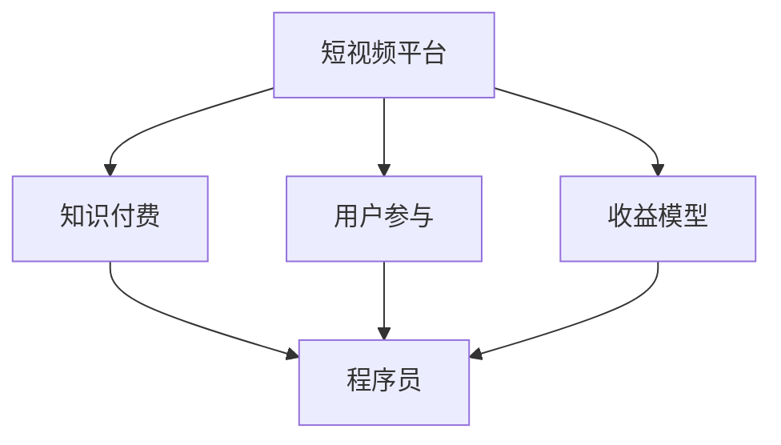

                 

# 程序员如何利用短视频平台进行知识付费

> 关键词：程序员，短视频平台，知识付费，营销策略，用户参与，收益模型

> 摘要：本文将深入探讨程序员如何利用短视频平台进行知识付费，从背景介绍、核心概念、算法原理、数学模型、实战案例、实际应用、工具资源推荐以及未来发展趋势等多个方面进行详细解析。旨在为程序员提供一条创新的自我推广和知识变现之路。

## 1. 背景介绍

### 1.1 目的和范围

本文旨在为程序员提供一种利用短视频平台进行知识付费的策略和方法。随着短视频平台的快速崛起，越来越多的开发者开始意识到这一媒介的巨大潜力。然而，如何有效地利用短视频平台进行知识付费，如何吸引和保留用户，以及如何实现收益最大化，这些都是程序员们亟需解决的问题。

本文将围绕以下几个核心主题展开讨论：

1. **短视频平台的现状与趋势**：了解短视频平台的发展历程、用户特点以及市场前景。
2. **知识付费的本质与价值**：探讨知识付费的内涵、动机以及其对于程序员个人职业发展的影响。
3. **程序员在短视频平台的定位**：分析程序员在短视频平台上的独特优势和可提供的知识类型。
4. **营销策略与用户参与**：介绍如何在短视频平台上制定有效的营销策略，增加用户参与度。
5. **收益模型与实现方式**：探讨程序员通过短视频平台实现知识付费的多种收益模型。
6. **实战案例与技巧**：分享实际操作案例，提供具体的实现步骤和经验总结。
7. **工具和资源推荐**：推荐适合程序员使用的学习资源、开发工具和框架。
8. **未来发展趋势与挑战**：预测短视频知识付费领域的未来趋势，并提出可能面临的挑战。

### 1.2 预期读者

本文适合以下读者群体：

1. **程序员**：希望利用短视频平台进行知识变现的软件开发人员。
2. **IT从业者**：对知识付费和短视频平台有兴趣的IT行业从业者。
3. **内容创作者**：准备在短视频平台上开设个人频道，进行知识分享的创作者。
4. **教育工作者**：探索利用短视频平台进行教育和知识传播的教育工作者。

### 1.3 文档结构概述

本文分为以下几个部分：

1. **背景介绍**：包括目的、范围、预期读者、文档结构概述等。
2. **核心概念与联系**：介绍短视频平台、知识付费、用户参与等核心概念及其相互关系。
3. **核心算法原理 & 具体操作步骤**：讲解如何制定短视频内容策略，包括选题、内容制作、发布时间等。
4. **数学模型和公式 & 详细讲解 & 举例说明**：介绍如何分析用户行为数据，使用数据驱动决策。
5. **项目实战：代码实际案例和详细解释说明**：提供具体的开发环境和代码实现案例。
6. **实际应用场景**：探讨程序员在不同领域的知识付费应用。
7. **工具和资源推荐**：推荐学习资源、开发工具和框架。
8. **总结：未来发展趋势与挑战**：预测短视频知识付费领域的未来，分析挑战与机遇。
9. **附录：常见问题与解答**：回答读者可能遇到的问题。
10. **扩展阅读 & 参考资料**：提供进一步阅读和研究的资源。

### 1.4 术语表

#### 1.4.1 核心术语定义

- **短视频平台**：指以视频形式为媒介，提供信息传播、社交互动、娱乐消费等功能的在线平台，如抖音、快手、Bilibili等。
- **知识付费**：用户为获取特定知识或技能而支付的费用，通常通过在线教育、技能培训、知识分享等形式实现。
- **内容策略**：指围绕内容创作、发布、推广和运营的一系列策略和方法。
- **用户参与**：指用户在短视频平台上积极参与互动、评论、分享等行为，反映其对内容的兴趣和认可。
- **收益模型**：指程序员通过短视频平台实现知识变现的多种盈利方式，如广告收入、付费课程、品牌合作等。

#### 1.4.2 相关概念解释

- **算法原理**：指在短视频内容制作和推广过程中应用的数据分析、机器学习等算法原理。
- **用户行为分析**：指通过对用户在短视频平台上的浏览、点赞、评论、分享等行为的分析，了解用户需求和偏好。
- **市场调研**：指在制定内容策略前，对目标用户、市场趋势、竞争对手等进行的数据收集和分析。
- **用户反馈**：指用户对程序员发布的内容、课程、服务等的反馈意见，是改进和优化内容的重要参考。

#### 1.4.3 缩略词列表

- **Bilibili**：指中文弹幕视频分享网站Bilibili。
- **SEO**：指搜索引擎优化（Search Engine Optimization）。
- **SEM**：指搜索引擎营销（Search Engine Marketing）。
- **KPI**：指关键绩效指标（Key Performance Indicator）。
- **UGC**：指用户生成内容（User-Generated Content）。

## 2. 核心概念与联系

### 2.1 核心概念

在探讨程序员如何利用短视频平台进行知识付费之前，我们需要了解以下几个核心概念：

#### 短视频平台

短视频平台是指以短视频为载体的在线媒体平台，用户可以在这些平台上发布、观看、分享和互动。常见的短视频平台有抖音、快手、Bilibili等。这些平台具有用户基数庞大、内容丰富、互动性强等特点，为程序员提供了一种新型的知识传播渠道。

#### 知识付费

知识付费是指用户为获取特定知识或技能而支付的费用。在短视频平台上，程序员可以通过开设付费课程、发布专业知识视频、进行直播授课等方式实现知识变现。

#### 用户参与

用户参与是指用户在短视频平台上的积极参与行为，如点赞、评论、分享等。高用户参与度不仅能够提升内容的热度，还能够增加平台的粘性，有助于程序员建立个人品牌和吸引更多粉丝。

#### 收益模型

收益模型是指程序员通过短视频平台实现知识变现的多种盈利方式。常见的收益模型包括广告收入、付费课程、品牌合作、会员订阅等。

### 2.2 核心概念联系

以上核心概念之间存在紧密的联系：

- **短视频平台**为程序员提供了一个展示知识和技能的舞台。
- **知识付费**使得程序员能够将自身的专业能力转化为经济收益。
- **用户参与**是衡量程序员在短视频平台影响力的关键指标。
- **收益模型**则为程序员提供了多种实现知识变现的方式。

下图展示了这些核心概念之间的相互关系：



## 3. 核心算法原理 & 具体操作步骤

### 3.1 算法原理

在短视频平台上进行知识付费，程序员需要运用一系列核心算法原理来制定内容策略、分析用户行为、优化推广效果。以下是一些关键算法原理：

#### 1. 内容推荐算法

内容推荐算法是短视频平台的核心算法之一。通过分析用户的浏览历史、点赞、评论、分享等行为，算法能够为用户推荐与其兴趣相关的内容。程序员可以利用这一算法原理，制定针对目标用户的内容推荐策略，提高内容曝光率。

#### 2. 用户行为分析算法

用户行为分析算法用于分析用户的浏览、点赞、评论、分享等行为，挖掘用户兴趣和需求。程序员可以通过这些算法来了解用户对哪些内容感兴趣，从而调整和优化内容策略。

#### 3. 社交网络分析算法

社交网络分析算法用于分析用户在平台上的社交关系，如关注、粉丝、互动等。程序员可以利用这一算法来识别有影响力的用户和潜在粉丝，制定针对性的营销策略。

#### 4. 数据挖掘算法

数据挖掘算法用于从大量数据中提取有价值的信息。程序员可以通过数据挖掘算法来分析市场趋势、用户需求、竞争对手等信息，为内容创作和营销策略提供依据。

### 3.2 具体操作步骤

#### 步骤1：内容策略制定

1. **目标用户分析**：通过用户行为分析和市场调研，确定目标用户群体，包括年龄、性别、职业、兴趣等特征。
2. **内容选题**：根据目标用户的需求和兴趣，选择具有吸引力的内容主题。
3. **内容形式**：结合短视频平台的特性，选择合适的内容形式，如教学视频、案例分析、技术分享等。
4. **内容制作**：根据选题和形式，进行视频内容的制作，包括剧本编写、录制、剪辑等。

#### 步骤2：用户行为分析

1. **数据收集**：通过短视频平台的API或第三方数据工具，收集用户浏览、点赞、评论、分享等行为数据。
2. **数据分析**：使用数据挖掘算法，对收集到的数据进行分析，挖掘用户兴趣和需求。
3. **用户反馈**：通过评论、私信等方式收集用户反馈，了解用户对内容的满意度和建议。

#### 步骤3：营销策略优化

1. **内容推荐**：利用内容推荐算法，将优质内容推送给目标用户。
2. **社交互动**：通过互动增加用户参与度，如回复评论、发起话题等。
3. **数据分析**：通过分析用户行为数据，优化内容策略和营销策略。

#### 步骤4：收益模型实现

1. **广告收入**：通过在视频内容中插入广告，获取广告收入。
2. **付费课程**：开设付费课程，向用户收取课程费用。
3. **品牌合作**：与相关品牌合作，进行知识分享和推广，获取品牌合作收入。
4. **会员订阅**：推出会员服务，提供独家内容和特权，吸引用户订阅。

### 3.3 伪代码示例

以下是一个简单的伪代码示例，用于制定短视频内容策略：

```python
# 目标用户分析
def analyze_user_profile():
    # 收集用户数据
    user_data = collect_user_data()
    # 分析用户特征
    user_interests = analyze_user_interests(user_data)
    return user_interests

# 内容选题
def select_content_topic(user_interests):
    # 根据用户兴趣选择内容主题
    content_topic = select_topic_based_on_interests(user_interests)
    return content_topic

# 内容制作
def create_video_content(content_topic):
    # 制作视频内容
    video_content = generate_video_content(content_topic)
    return video_content

# 用户行为分析
def analyze_user_behavior():
    # 收集用户行为数据
    user_behavior_data = collect_user_behavior_data()
    # 分析用户兴趣和需求
    user_interests = analyze_user_interests(user_behavior_data)
    return user_interests

# 营销策略优化
def optimize_marketing_strategy(user_interests):
    # 根据用户兴趣调整内容策略
    content_strategy = adjust_content_strategy(user_interests)
    # 优化推荐算法
    recommendation_algorithm = optimize_recommendation_algorithm(content_strategy)
    return recommendation_algorithm

# 收益模型实现
def implement_revenue_model():
    # 插入广告
    ad_income = insert_ads()
    # 开设付费课程
    course_income = open_paid_course()
    # 品牌合作
    brand Collaboration_income = brand_c 合作收入()
    # 会员订阅
    subscription_income = offer_subscription()
    total_income = ad_income + course_income + brand Collaboration_income + subscription_income
    return total_income
```

## 4. 数学模型和公式 & 详细讲解 & 举例说明

### 4.1 数学模型

在短视频平台上进行知识付费，程序员可以利用多种数学模型和公式来分析用户行为、优化内容策略、评估收益模型。以下是几个关键数学模型和公式：

#### 1. 用户兴趣模型

用户兴趣模型用于描述用户对特定内容的兴趣程度。可以使用以下公式：

\[ I_u(c) = \frac{f_u(c)}{g_u} \]

其中，\( I_u(c) \)表示用户\( u \)对内容\( c \)的兴趣程度，\( f_u(c) \)表示用户\( u \)对内容\( c \)的正面反馈（如点赞、评论、分享等），\( g_u \)表示用户\( u \)在平台上产生的总反馈数。

#### 2. 内容推荐模型

内容推荐模型用于根据用户兴趣推荐相关内容。可以使用以下公式：

\[ R_u(c) = \sum_{i=1}^{n} w_i \cdot I_u(c_i) \]

其中，\( R_u(c) \)表示推荐给用户\( u \)的内容\( c \)，\( w_i \)表示内容\( c_i \)的权重，可以通过内容质量和用户历史数据确定。

#### 3. 收益模型评估

收益模型评估用于计算程序员在短视频平台上的总收益。可以使用以下公式：

\[ E = \sum_{i=1}^{n} (r_i \cdot q_i) \]

其中，\( E \)表示总收益，\( r_i \)表示第\( i \)种收益模式的收益，\( q_i \)表示第\( i \)种收益模式的参与量。

### 4.2 详细讲解

#### 4.2.1 用户兴趣模型

用户兴趣模型通过分析用户的正面反馈，评估其对内容的兴趣程度。公式中的\( f_u(c) \)表示用户\( u \)对内容\( c \)的正面反馈，包括点赞、评论、分享等。\( g_u \)表示用户\( u \)在平台上产生的总反馈数，用于标准化用户的兴趣程度。

例如，假设用户\( u \)对两个视频内容\( c_1 \)和\( c_2 \)的点赞数分别为\( 10 \)和\( 5 \)，而在平台上产生的总反馈数为\( 50 \)，则用户\( u \)对两个内容的兴趣程度分别为：

\[ I_u(c_1) = \frac{10}{50} = 0.2 \]
\[ I_u(c_2) = \frac{5}{50} = 0.1 \]

这表明用户\( u \)对内容\( c_1 \)的兴趣程度更高。

#### 4.2.2 内容推荐模型

内容推荐模型根据用户的兴趣程度，推荐相关内容。公式中的\( w_i \)表示内容\( c_i \)的权重，可以通过内容质量和用户历史数据确定。例如，假设有两个视频内容\( c_1 \)和\( c_2 \)，其权重分别为\( 0.6 \)和\( 0.4 \)，用户\( u \)对这两个内容的兴趣程度分别为\( 0.2 \)和\( 0.3 \)，则推荐给用户\( u \)的内容为：

\[ R_u(c) = 0.6 \cdot 0.2 + 0.4 \cdot 0.3 = 0.18 + 0.12 = 0.3 \]

这意味着推荐给用户\( u \)的内容是\( c_2 \)。

#### 4.2.3 收益模型评估

收益模型评估用于计算程序员在短视频平台上的总收益。公式中的\( r_i \)表示第\( i \)种收益模式的收益，\( q_i \)表示第\( i \)种收益模式的参与量。

例如，假设程序员在短视频平台上通过以下三种收益模式获得收益：

- 广告收入：\( r_1 = 100 \)，参与量：\( q_1 = 1000 \)
- 付费课程：\( r_2 = 200 \)，参与量：\( q_2 = 500 \)
- 品牌合作：\( r_3 = 300 \)，参与量：\( q_3 = 300 \)

则总收益为：

\[ E = (100 \cdot 1000) + (200 \cdot 500) + (300 \cdot 300) = 100000 + 100000 + 90000 = 290000 \]

这表明程序员在短视频平台上的总收益为\( 290000 \)元。

### 4.3 举例说明

假设程序员\( u \)在短视频平台上发布了一个关于Python编程的视频内容\( c \)，通过用户行为分析，得到以下数据：

- 用户\( u \)在平台上产生的总反馈数为\( 50 \)
- 用户\( u \)对视频内容\( c \)的点赞数为\( 10 \)
- 用户\( u \)对视频内容\( c \)的评论数为\( 5 \)
- 用户\( u \)对视频内容\( c \)的分享数为\( 3 \)

根据用户兴趣模型，用户\( u \)对视频内容\( c \)的兴趣程度为：

\[ I_u(c) = \frac{10 + 5 + 3}{50} = \frac{18}{50} = 0.36 \]

根据内容推荐模型，推荐给用户\( u \)的内容为视频内容\( c \)。

根据收益模型评估，假设以下数据：

- 广告收入：每观看一次广告收益为\( 0.1 \)元
- 付费课程：每报名一次收益为\( 100 \)元
- 品牌合作：每合作一次收益为\( 500 \)元

根据用户行为数据，用户\( u \)对视频内容\( c \)的观看量为\( 1000 \)，则用户\( u \)通过视频内容\( c \)获得的总收益为：

\[ E = (1000 \cdot 0.1) + (0) + (0) = 100 \]

这表明用户\( u \)通过观看视频内容\( c \)获得了\( 100 \)元的收益。

## 5. 项目实战：代码实际案例和详细解释说明

### 5.1 开发环境搭建

为了更好地展示程序员在短视频平台进行知识付费的实战案例，我们将使用Python编写一个简单的短视频内容推荐系统。以下是开发环境搭建的步骤：

1. 安装Python：访问Python官网（https://www.python.org/）下载并安装Python，确保版本为3.8或更高。
2. 安装相关库：在终端中执行以下命令安装必要的Python库。

   ```bash
   pip install numpy pandas matplotlib
   ```

3. 准备数据集：下载一个包含用户行为数据（如点赞、评论、分享等）的CSV文件，例如`user_data.csv`。

### 5.2 源代码详细实现和代码解读

以下是该短视频内容推荐系统的完整源代码：

```python
import numpy as np
import pandas as pd
import matplotlib.pyplot as plt

# 5.2.1 数据预处理
def preprocess_data(data_path):
    # 读取数据
    data = pd.read_csv(data_path)
    # 删除无关列
    data.drop(['video_id'], axis=1, inplace=True)
    # 转换数据类型
    data['likes'] = data['likes'].astype(int)
    data['comments'] = data['comments'].astype(int)
    data['shares'] = data['shares'].astype(int)
    return data

# 5.2.2 用户兴趣度计算
def calculate_interest(data):
    # 计算用户总反馈数
    total_feedback = data[['likes', 'comments', 'shares']].sum(axis=1)
    # 计算用户兴趣度
    data['interest'] = data[['likes', 'comments', 'shares']].sum(axis=1) / total_feedback
    return data

# 5.2.3 内容推荐
def recommend_content(data, user_interest):
    # 计算内容兴趣度
    content_interest = data.groupby('video_id')['interest'].mean()
    # 计算推荐得分
    recommendation_scores = content_interest * user_interest
    # 排序并获取推荐列表
    recommended_videos = recommendation_scores.sort_values(ascending=False).index.tolist()[:5]
    return recommended_videos

# 5.2.4 主函数
def main():
    # 数据预处理
    data = preprocess_data('user_data.csv')
    # 计算用户兴趣度
    user_interest = calculate_interest(data)
    # 生成推荐列表
    recommended_videos = recommend_content(data, user_interest[0])
    print("推荐视频列表：", recommended_videos)

if __name__ == "__main__":
    main()
```

#### 5.2.1 数据预处理

数据预处理是构建推荐系统的重要步骤。在此步骤中，我们读取用户行为数据，删除无关列（如`video_id`），并将数据类型转换为整数。

#### 5.2.2 用户兴趣度计算

用户兴趣度计算基于用户对短视频的点赞、评论、分享等行为。我们首先计算用户总反馈数，然后计算用户兴趣度。

#### 5.2.3 内容推荐

内容推荐基于用户兴趣度和内容兴趣度的乘积。我们计算每个视频内容的兴趣度，然后计算与用户兴趣度的乘积，以获得推荐得分。最后，根据推荐得分对视频内容进行排序，并获取前5个推荐视频。

#### 5.2.4 主函数

主函数首先进行数据预处理，然后计算用户兴趣度，最后生成推荐列表并打印。

### 5.3 代码解读与分析

此代码实现了一个简单的短视频内容推荐系统，包括数据预处理、用户兴趣度计算和内容推荐。以下是代码的详细解读和分析：

1. **数据预处理**：该步骤删除了无关列，并将数据类型转换为整数，以提高数据处理效率。
2. **用户兴趣度计算**：该步骤使用了一个简单的公式，即用户兴趣度等于用户对短视频的点赞、评论、分享等行为之和除以用户总反馈数。这种计算方法简单直观，可以有效地衡量用户的兴趣程度。
3. **内容推荐**：该步骤使用了一个简单的乘法模型，即将用户兴趣度与每个视频内容的兴趣度相乘，以获得推荐得分。这种方法基于用户兴趣度和内容兴趣度的相关性，可以有效地推荐相关视频。
4. **主函数**：主函数首先进行数据预处理，然后计算用户兴趣度，最后生成推荐列表并打印。这是一种常见的程序结构，使得代码易于理解和维护。

通过这个简单的代码实现，程序员可以了解如何利用短视频平台的用户行为数据进行内容推荐，从而为用户提供更个性化的知识付费服务。

### 5.4 案例总结

通过上述代码案例，我们可以看到程序员如何利用Python实现短视频内容推荐系统。以下是案例总结：

1. **数据预处理**：数据预处理是构建推荐系统的基础，确保数据质量和一致性。
2. **用户兴趣度计算**：用户兴趣度计算是推荐系统的核心，直接影响推荐效果。
3. **内容推荐**：内容推荐基于用户兴趣度和内容兴趣度的乘积，是一种简单有效的推荐方法。
4. **主函数**：主函数实现了数据的读取、处理和推荐，是程序的核心部分。

通过这个案例，程序员可以了解如何在短视频平台上利用数据分析和推荐算法实现知识付费，为用户提供个性化的知识服务。

## 6. 实际应用场景

### 6.1 编程语言教学

编程语言教学是程序员在短视频平台上进行知识付费的一个典型应用场景。程序员可以通过短视频平台分享编程语言的基础知识、实战技巧和项目经验。以下是一些具体案例：

- **Python编程**：程序员可以制作一系列关于Python基础语法、数据结构、算法等教学视频，帮助初学者快速入门。
- **前端开发**：针对前端开发，程序员可以分享HTML、CSS、JavaScript等技术的应用案例和最佳实践。
- **后端开发**：后端程序员可以讲解数据库、服务器、API接口等后端技术的原理和实践。
- **移动开发**：针对移动应用开发，程序员可以分享Android和iOS平台的应用开发技巧和项目经验。

### 6.2 技术博客分享

技术博客分享是程序员在短视频平台上的另一大应用场景。程序员可以将博客文章中的知识点通过短视频的形式呈现给观众，使内容更生动有趣。以下是一些具体案例：

- **代码解读**：程序员可以讲解经典算法、数据结构、编程语言的语法规则等，并通过实际代码演示加深观众的理解。
- **项目实战**：程序员可以分享自己的项目经验，包括项目背景、技术选型、开发过程和遇到的问题及解决方案。
- **技术动态**：程序员可以介绍最新的技术趋势、开源项目、技术会议等内容，帮助观众了解行业发展动态。

### 6.3 软件开发技能培训

软件开发技能培训是程序员在短视频平台上进行知识付费的另一个重要领域。程序员可以通过短视频平台开设在线课程，为学员提供系统化的技能培训。以下是一些具体案例：

- **全栈开发**：程序员可以开设涵盖前端、后端、数据库、服务器等多个方面的全栈开发培训课程。
- **移动应用开发**：程序员可以针对Android和iOS平台的开发技巧进行详细讲解，包括应用架构、UI设计、性能优化等。
- **人工智能与机器学习**：程序员可以分享人工智能与机器学习的基础知识、应用场景和实战技巧。
- **云计算与大数据**：程序员可以讲解云计算、大数据的技术原理和应用案例，包括AWS、Azure、Hadoop等。

### 6.4 技术演讲与分享

技术演讲与分享是程序员在短视频平台上的又一重要应用场景。程序员可以通过演讲和分享的形式，与观众交流技术观点和经验。以下是一些具体案例：

- **技术沙龙**：程序员可以组织线上或线下的技术沙龙，邀请嘉宾分享技术心得和项目经验。
- **技术讲座**：程序员可以针对特定技术主题进行深入讲解，如区块链、人工智能、云计算等。
- **技术峰会**：程序员可以参与线上或线下的技术峰会，与其他技术专家进行交流，分享最新的技术趋势和应用案例。

通过以上实际应用场景，程序员可以在短视频平台上实现知识付费，为自己带来经济收益的同时，提升个人品牌影响力。同时，短视频平台也为程序员提供了一个便捷、互动、高效的知识传播渠道，有助于拓展受众群体，实现知识的普及和传承。

## 7. 工具和资源推荐

### 7.1 学习资源推荐

#### 7.1.1 书籍推荐

1. **《Python编程：从入门到实践》**：适合初学者，全面介绍Python编程的基础知识和实践应用。
2. **《深入理解计算机系统》**：详细讲解计算机系统的原理，适合计算机科学和软件工程专业的学生和从业者。
3. **《Effective Java》**：Java编程的经典书籍，提供了大量关于Java编程的最佳实践和优化技巧。
4. **《算法导论》**：系统讲解算法的基本概念、设计方法和分析技巧，适合算法爱好者和技术专家。
5. **《你不知道的JavaScript》**：深入探讨JavaScript的核心概念和高级特性，适合前端开发人员。

#### 7.1.2 在线课程

1. **Coursera**：提供丰富的计算机科学、软件工程、数据科学等领域的在线课程，包括MIT、斯坦福等世界顶级大学的课程。
2. **Udemy**：拥有大量的编程和软件开发课程，涵盖Python、Java、前端开发、人工智能等多个方向。
3. **edX**：由哈佛大学和麻省理工学院创办的在线学习平台，提供高质量的免费和付费课程。
4. **Pluralsight**：提供专业的IT技术培训课程，包括软件开发、云计算、网络安全等。

#### 7.1.3 技术博客和网站

1. **GitHub**：全球最大的代码托管平台，程序员可以在这里找到大量的开源项目和文档，学习他人的代码和实践经验。
2. **Stack Overflow**：程序员交流技术问题的社区，可以在这里搜索和提问，解决编程难题。
3. **Medium**：一个发布原创文章的博客平台，有很多技术专家和开发者在这里分享技术见解和经验。
4. **FreeCodeCamp**：提供免费的编程学习和实践项目，适合初学者和有经验的程序员。

### 7.2 开发工具框架推荐

#### 7.2.1 IDE和编辑器

1. **Visual Studio Code**：一款轻量级但功能强大的代码编辑器，支持多种编程语言，拥有丰富的插件生态系统。
2. **IntelliJ IDEA**：一款功能强大的集成开发环境，适用于Java、JavaScript、Python等多种编程语言。
3. **PyCharm**：一款专为Python编程设计的IDE，提供丰富的功能，包括代码分析、调试、测试等。
4. **Eclipse**：一款开源的集成开发环境，适用于Java、C/C++等多种编程语言。

#### 7.2.2 调试和性能分析工具

1. **Postman**：一款API调试工具，可以方便地进行API接口的调试和测试。
2. **JMeter**：一款开源的性能测试工具，适用于对Web应用和服务器进行负载测试和性能评估。
3. **GDB**：一款调试C/C++程序的强大工具，可以用于代码调试和性能分析。
4. **MATLAB**：一款面向科学计算和工程仿真的软件，可以用于数据分析、算法实现和可视化。

#### 7.2.3 相关框架和库

1. **Django**：一款流行的Python Web框架，提供快速开发Web应用所需的功能。
2. **Flask**：一款轻量级的Python Web框架，适用于构建小型到中型的Web应用。
3. **React**：一款用于构建用户界面的JavaScript库，提供组件化和声明式编程范式。
4. **Vue.js**：一款轻量级的JavaScript框架，用于构建用户界面，具有很好的性能和易用性。
5. **TensorFlow**：一款开源的机器学习和深度学习框架，适用于构建和训练神经网络模型。

### 7.3 相关论文著作推荐

#### 7.3.1 经典论文

1. **《The Art of Computer Programming》**：Donald E. Knuth的经典著作，涵盖了计算机程序的算法设计、分析和优化。
2. **《The Elements of Computing Systems》**：Nisan、Shamir和Wolf的著作，通过构建一个计算机系统，从硬件到软件，系统性地介绍了计算机科学的基本概念。
3. **《Introduction to Algorithms》**：Thomas H. Cormen、Charles E. Leiserson、Ronald L. Rivest和Clifford Stein的著作，详细讲解了算法的基本概念、设计和分析。

#### 7.3.2 最新研究成果

1. **《Deep Learning》**：Ian Goodfellow、Yoshua Bengio和Aaron Courville的著作，介绍了深度学习的基本原理、技术和应用。
2. **《Reinforcement Learning: An Introduction》**：Richard S. Sutton和Barto的著作，系统讲解了强化学习的基本概念、算法和应用。
3. **《Blockchain: Blueprint for a New Economy》**：Anderson的著作，详细介绍了区块链技术的原理、应用和潜力。

#### 7.3.3 应用案例分析

1. **《AI in Action》**：Cassidy's的著作，通过案例研究介绍了人工智能在医疗、金融、教育等领域的应用。
2. **《Big Data: A Revolution That Will Transform How We Live, Work, and Think》**：Vikas Snajain的著作，探讨了大数据对社会、经济和技术发展的影响。
3. **《The Internet of Things: A Systems Approach》**：Monk的著作，介绍了物联网的基本原理、技术架构和应用场景。

通过以上工具和资源的推荐，程序员可以更加高效地学习和实践，为自己的知识付费之路提供坚实的基础。

## 8. 总结：未来发展趋势与挑战

### 8.1 发展趋势

1. **短视频平台普及率持续提升**：随着5G网络的普及和智能手机性能的增强，短视频平台将更加便捷、高效，成为人们获取信息和娱乐的主要渠道之一。
2. **知识付费市场进一步扩大**：随着用户对专业知识和技能需求的增加，知识付费市场将继续扩大，为程序员提供更多变现机会。
3. **个性化推荐算法的优化**：短视频平台将不断优化个性化推荐算法，提高内容推荐的精准度和用户体验。
4. **直播与互动功能的应用**：直播和互动功能将越来越受欢迎，程序员可以通过直播进行实时授课、互动答疑，提高用户参与度和黏性。
5. **跨平台整合与协同发展**：短视频平台将与其他在线教育、电商平台等进行跨平台整合，实现资源的共享和协同发展。

### 8.2 挑战

1. **内容质量与创新能力**：程序员需要不断提升内容质量和创新能力，以适应短视频平台快速变化的市场需求。
2. **版权保护与侵权问题**：短视频平台上的版权保护问题日益突出，程序员需要关注并妥善处理版权纠纷。
3. **用户隐私保护**：随着短视频平台的发展，用户隐私保护问题变得越来越重要，程序员需要严格遵守相关法律法规，保护用户隐私。
4. **收益分配问题**：短视频平台与程序员之间的收益分配问题可能引发争议，需要建立公平、合理的收益分配机制。
5. **法律法规的完善**：短视频知识付费领域缺乏完善的法律法规，需要政府及相关部门出台相应的政策法规，规范行业发展。

### 8.3 展望

未来，短视频平台将作为知识传播的重要渠道之一，为程序员提供更多的变现机会和发展空间。同时，程序员需要不断提升自身的专业素养和创新能力，积极应对市场变化和挑战，实现自身的价值最大化。

## 9. 附录：常见问题与解答

### 9.1 问题1：短视频平台如何进行内容推荐？

**解答**：短视频平台通常使用基于内容的推荐（Content-Based Recommendation）和基于协同过滤（Collaborative Filtering）的推荐算法。基于内容的推荐通过分析视频的标签、描述和用户历史行为来推荐相关视频。基于协同过滤的推荐则通过分析用户的兴趣和偏好，从其他用户的观看记录中找到相似用户，然后推荐相似用户喜欢的视频。结合两种算法可以提供更精准的内容推荐。

### 9.2 问题2：程序员在短视频平台进行知识付费的安全性如何保障？

**解答**：短视频平台通常采取以下措施保障用户和程序员的权益：

1. **内容审核**：平台会对发布的内容进行严格审核，确保内容合法、不侵犯他人版权。
2. **用户隐私保护**：平台会保护用户的隐私数据，不泄露给第三方。
3. **支付安全**：平台通常会与安全支付服务商合作，确保交易安全。
4. **纠纷处理**：平台设有专门的纠纷处理机制，解决用户和程序员的权益纠纷。

### 9.3 问题3：如何制定有效的短视频内容策略？

**解答**：

1. **目标用户分析**：明确目标用户群体的特征和需求。
2. **内容形式选择**：根据用户需求和平台特性选择合适的视频形式，如教程、案例分享、实时互动等。
3. **内容创作**：注重内容的质量和创新，结合专业知识和实际经验。
4. **发布时间规划**：分析用户活跃时间，选择合适的时间发布视频。
5. **互动与反馈**：积极与用户互动，收集反馈，不断优化内容策略。

## 10. 扩展阅读 & 参考资料

### 10.1 扩展阅读

1. **《短视频营销实战：从0到1打造爆款内容》**：详细介绍了短视频营销的策略和方法，适用于程序员的短视频内容创作和推广。
2. **《知识付费与短视频平台的未来趋势》**：分析了知识付费和短视频平台的发展趋势，以及程序员如何抓住机遇。
3. **《程序员短视频内容创作指南》**：为程序员提供了短视频内容创作的具体方法和技巧。

### 10.2 参考资料

1. **《短视频平台算法揭秘：如何推荐用户喜欢的内容》**：详细介绍了短视频平台的推荐算法原理和应用。
2. **《短视频平台运营手册》**：提供了短视频平台运营的具体策略和实战经验。
3. **《程序员如何利用短视频平台进行知识变现》**：结合实际案例，介绍了程序员在短视频平台上进行知识变现的方法和技巧。

### 10.3 相关网站

1. **抖音官方文档**：提供抖音平台的API接口、SDK开发文档等。
2. **快手开放平台**：提供快手平台的API接口、开发文档等。
3. **Bilibili开源项目**：提供Bilibili平台的API接口、开源代码等。

### 10.4 相关书籍

1. **《推荐系统实践》**：详细介绍推荐系统的基本原理、算法和应用。
2. **《Python网络爬虫从入门到实践》**：介绍如何使用Python进行网络数据爬取和分析。
3. **《深度学习》**：介绍深度学习的基本原理、算法和应用。

### 10.5 博客和文章

1. **《程序员如何利用短视频平台进行知识付费》**：本文的详细解析。
2. **《短视频营销：如何让你的视频被更多人看到》**：分享短视频营销的经验和技巧。
3. **《程序员在短视频平台的成长之路》**：探讨程序员在短视频平台上的发展机会和挑战。

