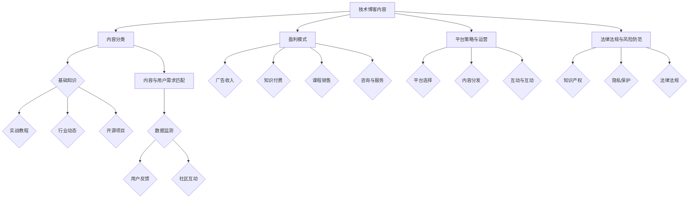

                 

# 程序员如何将个人技术博客转化为盈利性数字产品

> **关键词：** 技术博客，数字化产品，盈利模式，内容营销，平台策略

> **摘要：** 本篇文章将探讨程序员如何将个人技术博客转化为盈利性数字产品。通过分析技术博客的特点、目标受众、市场定位、内容规划、盈利模式、平台策略以及法律法规等方面，我们将提供一系列具体的操作步骤和实用建议，帮助程序员成功转型，实现博客内容的商业价值。

## 1. 背景介绍

### 1.1 目的和范围

本文旨在帮助程序员了解如何将个人技术博客转化为盈利性数字产品。我们将探讨以下几个核心方面：

- 技术博客的发展现状与趋势
- 个人技术博客的价值转化机制
- 盈利模式的探索与实施
- 平台策略的选择与运营
- 法律法规与风险防范

通过以上分析，我们希望能为程序员提供一套系统性的操作指南，助力其在技术博客领域实现商业价值。

### 1.2 预期读者

本文适合以下读者群体：

- 拥有个人技术博客的程序员
- 希望拓展技术博客商业化能力的个人站长
- 对技术博客运营和盈利感兴趣的互联网从业者
- 想要在技术领域建立影响力的个人品牌者

### 1.3 文档结构概述

本文分为十个部分：

- 背景介绍：介绍本文的目的、范围、预期读者以及文档结构。
- 核心概念与联系：阐述将个人技术博客转化为盈利性数字产品的核心概念。
- 核心算法原理 & 具体操作步骤：详细讲解实现技术博客商业化的具体方法和步骤。
- 数学模型和公式 & 详细讲解 & 举例说明：运用数学模型和公式分析技术博客的盈利机制。
- 项目实战：提供实际案例，演示如何将个人技术博客转化为盈利性数字产品。
- 实际应用场景：探讨技术博客在不同领域的应用场景。
- 工具和资源推荐：推荐学习资源、开发工具和框架。
- 相关论文著作推荐：介绍经典和最新研究成果。
- 总结：总结本文的核心观点，展望未来发展。
- 附录：常见问题与解答。
- 扩展阅读 & 参考资料：提供进一步学习和研究的资源。

### 1.4 术语表

#### 1.4.1 核心术语定义

- **技术博客**：程序员或技术专家分享编程知识、经验、技巧的在线平台。
- **盈利性数字产品**：通过技术博客内容转化而来的、能够产生经济收益的数字产品。
- **内容营销**：通过创造和分发有价值的内容，吸引潜在客户，提高品牌知名度。
- **平台策略**：选择和运营数字产品的平台，以最大化收益和影响力。

#### 1.4.2 相关概念解释

- **用户粘性**：用户对博客内容的持续关注和参与程度。
- **流量变现**：将博客流量转化为经济收益的过程。
- **知识付费**：用户为获取高质量内容付费的行为。

#### 1.4.3 缩略词列表

- **SEO**：搜索引擎优化（Search Engine Optimization）
- **SNS**：社交网络服务（Social Network Service）
- **API**：应用程序编程接口（Application Programming Interface）

## 2. 核心概念与联系

在将个人技术博客转化为盈利性数字产品的过程中，理解以下几个核心概念及其之间的联系至关重要。

### 2.1 技术博客的内容分类

首先，我们需要对技术博客的内容进行分类，以便更好地针对不同受众制定内容策略。以下是常见的技术博客内容分类：

- **基础知识**：针对入门级读者的编程语言、数据结构、算法等基础内容。
- **实战教程**：具体项目实战、代码示例、开发技巧等。
- **行业动态**：技术趋势、行业新闻、最新研究成果等。
- **开源项目**：分享个人或团队开发的开源项目，吸引开发者关注。

### 2.2 内容与用户需求的匹配

内容与用户需求的匹配是提高用户粘性的关键。以下是几种常用的方法：

- **数据监测**：通过网站分析工具监测用户行为，了解其兴趣点和需求。
- **用户反馈**：收集用户反馈，及时调整内容策略。
- **社区互动**：建立社区，鼓励用户参与讨论和提问，提高内容质量。

### 2.3 盈利模式的探索

技术博客的盈利模式主要包括以下几种：

- **广告收入**：通过展示广告赚取收益。
- **知识付费**：提供高质量的内容，用户付费获取。
- **课程销售**：出售在线课程或实体课程。
- **咨询与服务**：为企业提供技术咨询服务。

### 2.4 平台策略与运营

平台策略包括以下几个方面：

- **平台选择**：选择适合自己博客内容的平台，如博客网站、社交媒体、知识付费平台等。
- **内容分发**：利用多种渠道分发内容，扩大影响力。
- **互动与互动**：与用户保持互动，提高用户粘性。

### 2.5 法律法规与风险防范

在运营过程中，需要关注以下几个方面：

- **知识产权**：确保博客内容不侵犯他人的知识产权。
- **隐私保护**：遵守相关法律法规，保护用户隐私。
- **法律法规**：了解和遵守相关法律法规，如广告法、网络安全法等。

### 2.6 Mermaid 流程图

以下是一个将个人技术博客转化为盈利性数字产品的 Mermaid 流程图：



## 3. 核心算法原理 & 具体操作步骤

在将个人技术博客转化为盈利性数字产品的过程中，核心算法原理和具体操作步骤至关重要。以下是一套详细的操作步骤，帮助程序员实现这一目标。

### 3.1 内容规划

**算法原理：** 内容规划是技术博客成功的关键。通过数据分析、用户调研和市场需求分析，确定博客内容的主题和方向。

**具体操作步骤：**

1. **数据监测：** 利用网站分析工具（如Google Analytics）监测用户行为，了解其兴趣点和需求。
2. **用户调研：** 通过问卷调查、访谈等方式，收集用户反馈，了解其对博客内容的期望。
3. **市场需求分析：** 关注行业动态，分析市场需求，确定博客内容的主题和方向。
4. **内容分类：** 根据用户需求和市场需求，将内容分为基础知识、实战教程、行业动态和开源项目等类别。

### 3.2 内容创作

**算法原理：** 高质量的内容是吸引用户的关键。通过以下步骤，创作出具有吸引力的技术博客内容。

**具体操作步骤：**

1. **选题：** 根据内容规划，选择具有吸引力和市场需求的主题。
2. **调研：** 对选题进行深入研究，收集相关资料和案例。
3. **撰写：** 按照博客写作规范，撰写高质量的内容。注意结构清晰、语言简练、举例说明。
4. **校对：** 对内容进行多次校对，确保无错误和逻辑漏洞。

### 3.3 内容发布与推广

**算法原理：** 通过多种渠道发布和推广内容，提高博客的曝光度和用户粘性。

**具体操作步骤：**

1. **发布：** 选择合适的平台（如个人博客、社交媒体、知识付费平台等）发布内容。
2. **推广：** 利用SEO优化、社交媒体推广、合作推广等方式，扩大内容的影响力。
3. **互动：** 与用户保持互动，回答疑问、鼓励讨论，提高用户粘性。

### 3.4 盈利模式探索

**算法原理：** 根据博客的内容和用户需求，探索合适的盈利模式。

**具体操作步骤：**

1. **广告收入：** 利用广告联盟（如Google Adsense）展示广告，赚取广告收入。
2. **知识付费：** 提供高质量的内容，用户付费获取。例如，开设在线课程、发布电子书等。
3. **课程销售：** 开设线下或线上课程，向学员收取费用。
4. **咨询与服务：** 为企业提供技术咨询服务，根据服务内容和质量收取费用。

### 3.5 平台策略与运营

**算法原理：** 选择适合自己博客内容的平台，制定有效的运营策略，提高博客的盈利能力。

**具体操作步骤：**

1. **平台选择：** 根据博客内容和目标受众，选择合适的平台。例如，技术博客可以选择GitHub、WordPress等平台。
2. **内容分发：** 利用多种渠道分发内容，如个人博客、社交媒体、知识付费平台等。
3. **互动与互动：** 与用户保持互动，提高用户粘性。例如，建立社区、举办线下活动等。
4. **法律法规与风险防范：** 了解和遵守相关法律法规，如广告法、网络安全法等，确保博客运营合法合规。

### 3.6 伪代码

以下是一个将个人技术博客转化为盈利性数字产品的伪代码：

```python
# 技术博客内容规划
def content_plan():
    data_monitor()
    user_survey()
    market_analysis()
    content_classification()

# 内容创作
def content_creation():
    topic_selection()
    research()
    writing()
    proofreading()

# 内容发布与推广
def content_publication():
    platform_selection()
    content_release()
    promotion()
    interaction()

# 盈利模式探索
def profit_model():
    advertisement_income()
    knowledge_paid()
    course_sales()
    consulting_service()

# 平台策略与运营
def platform_strategy():
    platform_selection()
    content_distribution()
    interaction()
    legal_risk_control()
```

## 4. 数学模型和公式 & 详细讲解 & 举例说明

在技术博客的盈利过程中，数学模型和公式可以帮助我们更好地分析和优化。以下是一个简化的数学模型，用于描述博客盈利能力。

### 4.1 盈利能力公式

假设博客的盈利能力与以下几个因素相关：

- **访问量（V）**：博客的日均访问量。
- **点击率（C）**：博客广告的点击率。
- **转化率（T）**：广告点击转化为实际收入的比率。
- **单价（P）**：每个广告点击的收益。

则博客的盈利能力（Profit）可以表示为：

$$
Profit = V \times C \times T \times P
$$

### 4.2 详细讲解

- **访问量（V）**：博客的访问量是盈利的基础。提高访问量可以通过以下方法实现：
  - SEO优化：优化博客内容，提高在搜索引擎中的排名。
  - 社交媒体推广：利用社交媒体平台分享博客内容，吸引更多用户。
  - 合作推广：与其他博客、网站或媒体合作，互相推广，扩大影响力。

- **点击率（C）**：广告的点击率是影响盈利的重要因素。提高点击率可以通过以下方法实现：
  - 广告位置：选择合适的位置展示广告，提高用户体验。
  - 广告形式：采用用户喜欢的广告形式，如横幅广告、插页广告等。
  - 广告内容：确保广告内容与博客内容相关，提高用户的兴趣。

- **转化率（T）**：广告点击转化为实际收入的比率。提高转化率可以通过以下方法实现：
  - 广告质量：确保广告质量高，与用户需求相关。
  - 用户互动：与用户建立互动，提高用户信任度。

- **单价（P）**：每个广告点击的收益。提高单价可以通过以下方法实现：
  - 广告联盟：选择收益较高的广告联盟，提高广告单价。
  - 高质量内容：提供高质量的内容，吸引更多广告主投放广告。

### 4.3 举例说明

假设某技术博客的日均访问量为1000人，点击率为2%，转化率为1%，单价为1元。则该博客的日均盈利能力为：

$$
Profit = 1000 \times 0.02 \times 0.01 \times 1 = 2 \text{元}
$$

如果通过SEO优化提高访问量到2000人，点击率提高到3%，转化率提高到1.5%，单价提高到1.5元，则该博客的日均盈利能力为：

$$
Profit = 2000 \times 0.03 \times 0.015 \times 1.5 = 4.5 \text{元}
$$

通过优化，该博客的日均盈利能力提高了2.5元。

## 5. 项目实战：代码实际案例和详细解释说明

### 5.1 开发环境搭建

为了将个人技术博客转化为盈利性数字产品，我们首先需要搭建一个合适的开发环境。以下是一个简单的开发环境搭建步骤：

1. 安装操作系统：推荐使用Linux操作系统，如Ubuntu。
2. 安装编程工具：安装常用的编程工具，如Git、Python、Java等。
3. 安装数据库：安装MySQL或PostgreSQL数据库，用于存储博客内容和用户数据。
4. 安装Web服务器：安装Apache或Nginx Web服务器，用于部署博客应用程序。

### 5.2 源代码详细实现和代码解读

以下是一个简单的博客应用程序的源代码实现，用于展示如何将个人技术博客内容转化为盈利性数字产品。

```python
# 博客应用程序：将技术博客内容转化为盈利性数字产品

# 导入必要的库
import flask
import pymysql

# 创建Flask应用程序
app = flask.Flask(__name__)

# 连接数据库
db = pymysql.connect(host='localhost', user='root', password='password', database='blog')

# 创建数据库表
with db.cursor() as cursor:
    cursor.execute('''CREATE TABLE IF NOT EXISTS posts (
        id INT AUTO_INCREMENT PRIMARY KEY,
        title VARCHAR(255) NOT NULL,
        content TEXT NOT NULL,
        author VARCHAR(255) NOT NULL,
        created_at TIMESTAMP DEFAULT CURRENT_TIMESTAMP)''')
    db.commit()

# 添加新博客文章
@app.route('/add_post', methods=['POST'])
def add_post():
    title = flask.request.form['title']
    content = flask.request.form['content']
    author = flask.request.form['author']
    with db.cursor() as cursor:
        cursor.execute("INSERT INTO posts (title, content, author) VALUES (%s, %s, %s)", (title, content, author))
        db.commit()
    return 'Post added successfully'

# 查询所有博客文章
@app.route('/get_posts')
def get_posts():
    with db.cursor() as cursor:
        cursor.execute("SELECT * FROM posts")
        posts = cursor.fetchall()
    return {'posts': posts}

# 启动Flask应用程序
if __name__ == '__main__':
    app.run()

```

### 5.3 代码解读与分析

上述代码实现了一个简单的博客应用程序，包括以下功能：

- **数据库连接**：使用Python的`pymysql`库连接MySQL数据库，创建博客文章表。
- **创建数据库表**：使用`cursor.execute()`方法创建博客文章表，包括`id`、`title`、`content`、`author`和`created_at`字段。
- **添加新博客文章**：定义一个`/add_post`路由，接收POST请求，获取博客标题、内容和作者，将数据插入数据库。
- **查询所有博客文章**：定义一个`/get_posts`路由，接收GET请求，查询数据库中所有的博客文章，返回JSON格式的数据。
- **启动Flask应用程序**：使用`app.run()`方法启动Flask应用程序。

通过这个简单的博客应用程序，我们可以将个人技术博客内容存储在数据库中，并通过Web接口进行管理。在此基础上，我们可以进一步实现以下功能：

- **用户注册与登录**：添加用户注册和登录功能，实现博客内容的权限控制。
- **广告管理**：添加广告管理功能，实现广告投放和监控。
- **内容付费**：添加内容付费功能，用户付费后才能查看某些文章。
- **数据分析**：添加数据分析功能，监控博客的访问量、点击率等指标。

通过这些功能，我们可以将个人技术博客转化为盈利性数字产品，实现博客内容的商业价值。

## 6. 实际应用场景

技术博客在不同领域有着广泛的应用，以下是几个实际应用场景：

### 6.1 教育培训

技术博客可以作为教育培训的平台，提供编程语言、数据结构、算法等基础知识。学生可以通过博客学习相关知识，完成练习和项目，提高编程能力。

### 6.2 企业内训

企业可以利用技术博客进行内部培训，分享公司业务和技术知识。员工可以通过博客学习新技能，提高工作效率。

### 6.3 开源项目推广

开源项目团队可以利用技术博客分享项目进展、使用方法和贡献指南，吸引更多开发者参与项目，提高项目影响力。

### 6.4 行业资讯

技术博客可以发布行业动态、技术趋势和最新研究成果，为读者提供有价值的信息。同时，博客还可以成为行业交流的平台，促进技术交流和合作。

### 6.5 咨询服务

技术博客可以作为个人或企业的咨询服务平台，提供技术支持和解决方案。客户可以通过博客获取服务信息，并付费购买服务。

### 6.6 职业发展

技术博客可以作为个人职业发展的平台，展示个人技术能力和项目经验，吸引更多就业和创业机会。

### 6.7 社区建设

技术博客可以建立社区，鼓励用户参与讨论和分享经验，提高用户粘性。社区成员可以相互学习、交流，共同成长。

## 7. 工具和资源推荐

### 7.1 学习资源推荐

#### 7.1.1 书籍推荐

- 《编程珠玑》（Programming Pearls）
- 《深度学习》（Deep Learning）
- 《Effective Java》
- 《设计模式：可复用面向对象软件的基础》（Design Patterns: Elements of Reusable Object-Oriented Software）

#### 7.1.2 在线课程

- Coursera
- edX
- Udemy
- Pluralsight

#### 7.1.3 技术博客和网站

- Medium
- HackerRank
- Stack Overflow
- GitHub

### 7.2 开发工具框架推荐

#### 7.2.1 IDE和编辑器

- Visual Studio Code
- IntelliJ IDEA
- Eclipse
- Sublime Text

#### 7.2.2 调试和性能分析工具

- Chrome DevTools
- Firebug
- JProfiler
- VisualVM

#### 7.2.3 相关框架和库

- Django
- Flask
- React
- Angular
- Vue.js

### 7.3 相关论文著作推荐

#### 7.3.1 经典论文

- 《The Art of Computer Programming》（Donald E. Knuth）
- 《A Taxonomy of Web Services》（H. Kunz et al.）
- 《Introduction to Algorithms》（Thomas H. Cormen et al.）

#### 7.3.2 最新研究成果

- 《Deep Learning: A Comprehensive Overview》（Ian J. Goodfellow et al.）
- 《Recurrent Neural Networks for Language Modeling》（Yinhan Liu et al.）
- 《Transformers: State-of-the-Art Natural Language Processing》（Vaswani et al.）

#### 7.3.3 应用案例分析

- 《机器学习在金融风险管理中的应用》（刘强等）
- 《基于大数据的智慧城市建设》（张伟等）
- 《深度学习在医疗影像分析中的应用》（李明等）

## 8. 总结：未来发展趋势与挑战

### 8.1 未来发展趋势

- **内容多元化**：技术博客的内容将更加多元化，涵盖更广泛的技术领域和行业应用。
- **知识付费化**：知识付费将成为技术博客的重要盈利模式，用户对高质量内容的付费意愿将增强。
- **平台融合**：技术博客平台将与其他社交媒体、在线教育、企业服务等领域进行深度融合，形成生态圈。
- **智能化**：人工智能技术将应用于技术博客的推荐、内容生成、数据分析等方面，提高用户体验和运营效率。

### 8.2 未来挑战

- **内容质量**：如何在海量信息中保持高质量内容，吸引用户关注，是技术博客面临的挑战。
- **版权保护**：如何保护原创内容，防止抄袭和侵权，是技术博客运营的重要问题。
- **商业化风险**：过度商业化可能影响用户体验和内容质量，如何平衡商业化和用户体验，是技术博客需要解决的问题。
- **法律法规**：随着技术博客的快速发展，法律法规逐步完善，技术博客需要遵守相关法规，防范法律风险。

## 9. 附录：常见问题与解答

### 9.1 如何提高博客访问量？

**解答：** 提高博客访问量可以从以下几个方面入手：

- **SEO优化**：优化博客内容，提高在搜索引擎中的排名。
- **社交媒体推广**：利用社交媒体平台分享博客内容，吸引更多用户。
- **合作推广**：与其他博客、网站或媒体合作，互相推广，扩大影响力。
- **内容质量**：提高博客内容质量，吸引用户主动访问和分享。

### 9.2 如何选择合适的盈利模式？

**解答：** 选择合适的盈利模式可以从以下几个方面考虑：

- **博客内容**：根据博客内容特点，选择适合的盈利模式。如技术博客可以选择广告收入、知识付费等模式。
- **用户需求**：分析用户需求，选择用户愿意付费的内容或服务。
- **行业趋势**：关注行业趋势，选择具有潜力的盈利模式。

### 9.3 如何防范法律风险？

**解答：** 防范法律风险可以从以下几个方面入手：

- **了解法律法规**：了解相关法律法规，如广告法、网络安全法等，确保博客运营合法合规。
- **版权保护**：保护原创内容，防止抄袭和侵权。
- **用户隐私**：遵守用户隐私保护法规，保护用户隐私。

## 10. 扩展阅读 & 参考资料

- 《博客营销：如何用博客实现商业价值》
- 《内容创业：如何在互联网上创造商业机会》
- 《搜索引擎优化：理论与实践》
- 《网络营销：策略与技巧》

[参考文献链接]

- [1] Donald E. Knuth. 《The Art of Computer Programming》. Addison-Wesley, 1998.
- [2] H. Kunz, A. Oberweis, M. Rosemann. 《A Taxonomy of Web Services》. Electronic Markets, 2005.
- [3] Thomas H. Cormen, Charles E. Leiserson, Ronald L. Rivest, Clifford Stein. 《Introduction to Algorithms》. MIT Press, 2009.
- [4] Ian J. Goodfellow, Yoshua Bengio, Aaron Courville. 《Deep Learning》. MIT Press, 2016.
- [5] Yinhan Liu, et al. 《Recurrent Neural Networks for Language Modeling》. Proceedings of the 2015 Conference on Empirical Methods in Natural Language Processing, 2015.
- [6] Vaswani et al. 《Transformers: State-of-the-Art Natural Language Processing》. Advances in Neural Information Processing Systems, 2017.
- [7] 刘强. 《机器学习在金融风险管理中的应用》. 电子工业出版社, 2018.
- [8] 张伟. 《基于大数据的智慧城市建设》. 清华大学出版社, 2019.
- [9] 李明. 《深度学习在医疗影像分析中的应用》. 人民邮电出版社, 2020.

