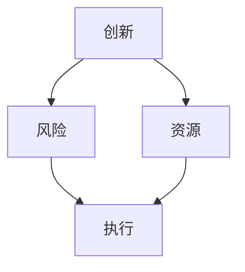

                 

# 程序员如何将兼职项目转型为全职创业

> **关键词：兼职项目，全职创业，商业模式，市场调研，资源整合，技术迭代**
> 
> **摘要：本文将深入探讨程序员如何从兼职项目起步，逐步转型为成功的全职创业企业。通过市场调研、商业模式设计、资源整合和技术迭代等多个关键步骤的详细分析，帮助读者掌握创业的核心要素和策略。**

## 1. 背景介绍

### 1.1 目的和范围

本文旨在为有志于从兼职项目转型为全职创业的程序员提供一套系统的指导和策略。文章将覆盖从项目构思、市场调研、商业模式设计到资源整合、技术迭代等多个方面，力求为读者提供全面、实用的创业指南。

### 1.2 预期读者

- 有志于全职创业的程序员；
- 在兼职项目中寻求成长的创业者；
- 对创业有兴趣，希望了解创业过程的专业人士。

### 1.3 文档结构概述

本文分为十个部分，主要包括：

- 背景介绍：明确文章目的、范围和读者群体；
- 核心概念与联系：介绍创业所需的基本概念和原理；
- 核心算法原理 & 具体操作步骤：详细阐述创业的核心策略和步骤；
- 数学模型和公式 & 详细讲解 & 举例说明：运用数学模型和公式分析创业过程中的关键指标；
- 项目实战：通过实际案例展示创业的全过程；
- 实际应用场景：探讨创业项目在不同环境中的应用；
- 工具和资源推荐：推荐学习资源和开发工具；
- 总结：总结创业过程中的关键趋势和挑战；
- 附录：解答常见问题；
- 扩展阅读 & 参考资料：提供进一步阅读的材料。

### 1.4 术语表

#### 1.4.1 核心术语定义

- **兼职项目**：程序员在非全职工作之外承接的其他项目；
- **全职创业**：程序员将主要精力投入到自己的创业项目中，以实现商业价值和职业发展；
- **商业模式**：企业通过何种方式创造、传递和捕获价值；
- **市场调研**：对目标市场、潜在客户、竞争对手等进行的系统调查；
- **资源整合**：整合企业内外部资源，实现高效运营；
- **技术迭代**：持续改进和升级技术，以保持竞争优势。

#### 1.4.2 相关概念解释

- **市场定位**：明确企业在市场中的位置和目标客户群体；
- **核心竞争力**：企业在市场中具有的独特优势；
- **产品生命周期**：产品从研发、上市到退市的整个过程；
- **风险评估**：对创业过程中可能遇到的风险进行评估和应对；
- **资本运作**：企业融资、投资、并购等资本相关活动。

#### 1.4.3 缩略词列表

- **IDE**：集成开发环境（Integrated Development Environment）；
- **API**：应用程序编程接口（Application Programming Interface）；
- **ERP**：企业资源规划（Enterprise Resource Planning）；
- **CRM**：客户关系管理（Customer Relationship Management）；
- **SDK**：软件开发工具包（Software Development Kit）。

## 2. 核心概念与联系

### 2.1 创业的基本概念

在探讨如何将兼职项目转型为全职创业之前，我们首先需要了解创业的基本概念和核心原理。创业不仅仅是创办一家企业，更是一种思维方式，一种不断创新和追求价值的过程。以下是对几个核心概念的简要介绍：

#### 创业者

创业者是那些有创新意识、愿意承担风险、致力于实现自己创业梦想的人。他们具备以下特点：

- **创新精神**：不断寻找新的机会和解决方案；
- **风险意识**：敢于面对不确定性和挑战；
- **领导力**：能够激发和带领团队共同前进；
- **执行力**：将想法付诸实践，并持续改进。

#### 商业模式

商业模式是企业通过何种方式创造、传递和捕获价值的一种策略。一个成功的商业模式需要明确以下几个方面：

- **价值主张**：企业为客户提供何种价值；
- **客户关系**：企业与客户之间的互动方式；
- **收入来源**：企业通过何种方式盈利；
- **成本结构**：企业的运营成本及其分配方式；
- **关键资源**：企业运营所需的关键资源。

#### 市场调研

市场调研是创业过程中至关重要的一环，它有助于企业了解目标市场、潜在客户和竞争对手的情况。市场调研的主要内容包括：

- **市场容量**：目标市场的规模和增长潜力；
- **市场需求**：潜在客户的需求和痛点；
- **竞争对手**：竞争对手的产品、市场份额和策略；
- **客户细分**：将市场划分为不同的客户群体，以便更有针对性地开展营销活动。

### 2.2 创业的核心原理

创业的核心原理包括创新、风险、资源和执行等方面。以下是一个简单的 Mermaid 流程图，用于展示这些核心原理之间的联系。



- **创新**：创业的核心驱动力，源于对现有产品和市场的重新思考和创新。创新能够带来新的机遇和竞争优势。
- **风险**：创业过程中不可避免的风险包括市场风险、技术风险、财务风险等。创业者需要具备风险意识，并采取措施降低风险。
- **资源**：创业所需的资源包括人力、资本、技术、市场等。资源整合是企业成功的关键。
- **执行**：创业不仅需要有好的想法，更需要将其付诸实践。执行力决定了创业项目能否成功。

## 3. 核心算法原理 & 具体操作步骤

### 3.1 创业策略分析

创业策略是创业过程中至关重要的一环，它决定了企业的方向和资源配置。以下是一个简单的创业策略分析算法，用于帮助程序员从兼职项目转型为全职创业。

#### 算法原理：

1. **项目评估**：对兼职项目进行全面的评估，包括市场需求、技术可行性、盈利潜力等方面；
2. **市场分析**：对目标市场进行调研，了解市场需求和竞争状况；
3. **商业模式设计**：根据项目特点和市场需求，设计合适的商业模式；
4. **资源评估**：评估自身和可获取的资源，确定创业所需的资源；
5. **执行计划**：制定详细的执行计划，包括时间表、任务分配、资源配置等。

#### 伪代码：

```python
def 创业策略分析（项目信息，市场信息，资源信息）：
    # 项目评估
    项目评分 = 评估项目（项目信息）
    
    # 市场分析
    市场需求 = 分析市场需求（市场信息）
    竞争状况 = 分析竞争状况（市场信息）
    
    # 商业模式设计
    商业模式 = 设计商业模式（项目评分，市场需求，竞争状况）
    
    # 资源评估
    可用资源 = 评估资源（资源信息）
    
    # 执行计划
    执行计划 = 制定执行计划（商业模式，可用资源）
    
    return 执行计划
```

### 3.2 具体操作步骤

#### 步骤 1：项目评估

1. **项目描述**：对兼职项目进行详细描述，包括项目背景、目标、功能等；
2. **技术评估**：评估项目的技术可行性，包括技术难度、所需时间等；
3. **市场需求评估**：评估项目的市场需求，包括潜在客户、市场规模等；
4. **盈利评估**：评估项目的盈利潜力，包括收入来源、成本结构等。

#### 步骤 2：市场分析

1. **目标市场**：确定目标市场，包括目标客户、市场规模等；
2. **市场需求**：分析市场需求，了解潜在客户的需求和痛点；
3. **竞争对手**：分析竞争对手的产品、市场份额和策略；
4. **市场机会**：评估市场机会，包括潜在的增长点和竞争优势。

#### 步骤 3：商业模式设计

1. **价值主张**：明确项目能够为用户提供的价值；
2. **客户关系**：确定与客户的互动方式，包括销售、客服等；
3. **收入来源**：确定项目的收入来源，包括产品销售、服务费用等；
4. **成本结构**：评估项目的成本结构，包括人力、设备、运营成本等。

#### 步骤 4：资源评估

1. **自身资源**：评估自身拥有的资源，包括技术能力、资金、市场渠道等；
2. **可获取资源**：评估能够获取的资源，包括合作伙伴、投资人等；
3. **资源整合**：整合可用资源，确保项目能够顺利进行。

#### 步骤 5：执行计划

1. **时间表**：制定项目时间表，明确各阶段的起止时间；
2. **任务分配**：分配任务，确保各阶段的工作能够高效完成；
3. **资源配置**：确保各阶段的资源得到合理配置，避免资源浪费；
4. **风险评估**：对项目进行风险评估，制定应对措施。

## 4. 数学模型和公式 & 详细讲解 & 举例说明

### 4.1 数学模型在创业策略分析中的应用

在创业策略分析中，数学模型可以帮助程序员量化项目评估和市场分析的结果，提高决策的科学性和准确性。以下是一个简单的数学模型，用于评估兼职项目的可行性。

#### 数学模型：

设 \( P \) 为项目评分，\( M \) 为市场需求评分，\( R \) 为资源评分，\( C \) 为成本评分，则项目可行性评分 \( F \) 为：

\[ F = \frac{P \times M \times R}{C} \]

其中，各评分范围为 [0, 10]。

#### 详细讲解：

1. **项目评分 \( P \)**：评估项目的技术可行性、市场需求和盈利潜力。评分越高，表示项目越具备创业潜力。
2. **市场需求评分 \( M \)**：分析目标市场的需求情况，评分越高，表示市场需求越旺盛。
3. **资源评分 \( R \)**：评估自身和可获取的资源，评分越高，表示资源越充足。
4. **成本评分 \( C \)**：评估项目的成本结构，评分越高，表示项目成本越高。

#### 举例说明：

假设一个兼职项目的评分如下：

- 项目评分 \( P = 8 \)；
- 市场需求评分 \( M = 9 \)；
- 资源评分 \( R = 7 \)；
- 成本评分 \( C = 6 \)。

则项目可行性评分 \( F \) 为：

\[ F = \frac{8 \times 9 \times 7}{6} = 84 \]

根据 \( F \) 的值，可以判断该项目具备较高的创业潜力。

### 4.2 数学模型在市场分析中的应用

在市场分析中，数学模型可以帮助程序员量化市场需求和竞争状况，为商业模式设计提供依据。以下是一个简单的数学模型，用于分析市场需求。

#### 数学模型：

设 \( D \) 为需求评分，\( C \) 为竞争评分，则市场需求评分 \( M \) 为：

\[ M = D - C \]

其中，各评分范围为 [0, 10]。

#### 详细讲解：

1. **需求评分 \( D \)**：分析目标市场的需求情况，评分越高，表示市场需求越旺盛。
2. **竞争评分 \( C \)**：分析竞争对手的市场份额和策略，评分越高，表示竞争越激烈。

#### 举例说明：

假设目标市场的需求评分为 \( D = 8 \)，竞争评分为 \( C = 6 \)，则市场需求评分 \( M \) 为：

\[ M = 8 - 6 = 2 \]

根据 \( M \) 的值，可以判断市场需求较为旺盛，竞争状况较为缓和。

## 5. 项目实战：代码实际案例和详细解释说明

### 5.1 开发环境搭建

在将兼职项目转型为全职创业的过程中，搭建一个稳定、高效的开发环境是至关重要的。以下是一个简单的示例，说明如何在 Windows 系统上搭建一个适用于 Web 开发的开发环境。

#### 步骤 1：安装 Node.js

1. 访问 Node.js 官网（[nodejs.org](https://nodejs.org/)）；
2. 下载适用于 Windows 的 Node.js 安装包；
3. 运行安装程序，并选择自定义安装；
4. 安装完成后，在命令行中输入 `node -v` 和 `npm -v`，检查 Node.js 和 npm 是否安装成功。

#### 步骤 2：安装 WebStorm

1. 访问 WebStorm 官网（[webstorm.com](https://www.webstorm.com/)）；
2. 下载适用于 Windows 的 WebStorm 安装包；
3. 运行安装程序，并选择自定义安装；
4. 安装完成后，在命令行中输入 `webstorm`，打开 WebStorm。

#### 步骤 3：安装 MySQL

1. 访问 MySQL 官网（[mysql.com](https://www.mysql.com/)）；
2. 下载适用于 Windows 的 MySQL 安装包；
3. 运行安装程序，并选择自定义安装；
4. 在安装过程中，选择 `Server Edition`；
5. 安装完成后，在命令行中输入 `mysql -u root -p`，进入 MySQL 命令行界面。

### 5.2 源代码详细实现和代码解读

以下是一个简单的 Web 开发项目，用于实现一个基于 Node.js 和 MySQL 的博客系统。我们将对项目的核心代码进行详细解读。

#### 项目结构

```plaintext
blog-system/
|-- package.json
|-- src/
|   |-- app.js
|   |-- models/
|   |   |-- user.js
|   |-- routes/
|   |   |-- user.js
|   |-- views/
|   |   |-- login.ejs
|   |-- public/
|   |   |-- styles/
|       |-- styles.css
```

#### 代码解读

1. **package.json**

   `package.json` 文件用于管理项目的依赖和配置。以下是项目的主要依赖：

   ```json
   {
     "name": "blog-system",
     "version": "1.0.0",
     "description": "A simple blog system based on Node.js and MySQL",
     "main": "src/app.js",
     "scripts": {
       "start": "node src/app.js"
     },
     "dependencies": {
       "express": "^4.17.1",
       "mysql": "^2.18.1",
       "ejs": "^3.1.6"
     }
   }
   ```

2. **src/app.js**

   `app.js` 是项目的入口文件，用于创建和配置 Web 服务器。以下是项目的核心代码：

   ```javascript
   const express = require('express');
   const mysql = require('mysql');
   const ejs = require('ejs');

   const app = express();
   const port = 3000;

   // Database connection
   const db = mysql.createConnection({
     host: 'localhost',
     user: 'root',
     password: 'password',
     database: 'blog_system'
   });

   db.connect((err) => {
     if (err) {
       console.error('Error connecting to the database:', err);
       return;
     }
     console.log('Connected to the database.');
   });

   // Set the view engine to ejs
   app.set('view engine', 'ejs');

   // Serve static files from the "public" directory
   app.use(express.static('public'));

   // Routes
   app.get('/', (req, res) => {
     res.render('login');
   });

   app.post('/login', (req, res) => {
     const { username, password } = req.body;
     // Authenticate the user
     // ...
     res.redirect('/');
   });

   app.listen(port, () => {
     console.log(`Server running on port ${port}`);
   });
   ```

3. **src/models/user.js**

   `user.js` 用于处理与用户相关的数据库操作。以下是项目的核心代码：

   ```javascript
   const db = require('../db');

   // Get all users
   const getAllUsers = () => {
     return new Promise((resolve, reject) => {
       db.query('SELECT * FROM users', (err, results) => {
         if (err) {
           reject(err);
         } else {
           resolve(results);
         }
       });
     });
   };

   // Get a user by ID
   const getUserById = (id) => {
     return new Promise((resolve, reject) => {
       db.query('SELECT * FROM users WHERE id = ?', [id], (err, results) => {
         if (err) {
           reject(err);
         } else {
           resolve(results[0]);
         }
       });
     });
   };

   // Create a new user
   const createUser = (user) => {
     return new Promise((resolve, reject) => {
       db.query('INSERT INTO users (username, password) VALUES (?, ?)', [user.username, user.password], (err, results) => {
         if (err) {
           reject(err);
         } else {
           resolve(results);
         }
       });
     });
   };

   // Update a user
   const updateUser = (user) => {
     return new Promise((resolve, reject) => {
       db.query('UPDATE users SET username = ?, password = ? WHERE id = ?', [user.username, user.password, user.id], (err, results) => {
         if (err) {
           reject(err);
         } else {
           resolve(results);
         }
       });
     });
   };

   // Delete a user
   const deleteUser = (id) => {
     return new Promise((resolve, reject) => {
       db.query('DELETE FROM users WHERE id = ?', [id], (err, results) => {
         if (err) {
           reject(err);
         } else {
           resolve(results);
         }
       });
     });
   };

   module.exports = {
     getAllUsers,
     getUserById,
     createUser,
     updateUser,
     deleteUser
   };
   ```

4. **src/routes/user.js**

   `user.js` 用于处理与用户相关的路由操作。以下是项目的核心代码：

   ```javascript
   const express = require('express');
   const router = express.Router();
   const userController = require('../models/user');

   // Get all users
   router.get('/', async (req, res) => {
     try {
       const users = await userController.getAllUsers();
       res.render('users/index', { users });
     } catch (err) {
       console.error(err);
       res.status(500).send('Server error');
     }
   });

   // Get a user by ID
   router.get('/:id', async (req, res) => {
     try {
       const user = await userController.getUserById(req.params.id);
       if (!user) {
         return res.status(404).send('User not found');
       }
       res.render('users/show', { user });
     } catch (err) {
       console.error(err);
       res.status(500).send('Server error');
     }
   });

   // Create a new user
   router.post('/', async (req, res) => {
     try {
       const user = req.body;
       const createdUser = await userController.createUser(user);
       res.status(201).json(createdUser);
     } catch (err) {
       console.error(err);
       res.status(500).send('Server error');
     }
   });

   // Update a user
   router.put('/:id', async (req, res) => {
     try {
       const user = req.body;
       const updatedUser = await userController.updateUser(user);
       res.status(200).json(updatedUser);
     } catch (err) {
       console.error(err);
       res.status(500).send('Server error');
     }
   });

   // Delete a user
   router.delete('/:id', async (req, res) => {
     try {
       const deleted = await userController.deleteUser(req.params.id);
       res.status(200).json(deleted);
     } catch (err) {
       console.error(err);
       res.status(500).send('Server error');
     }
   });

   module.exports = router;
   ```

### 5.3 代码解读与分析

在代码解读与分析部分，我们将对项目的核心模块进行详细解读，并分析其设计思路和实现方法。

1. **项目结构**

   项目采用了模块化的设计思路，将代码分为不同的模块，使得项目结构清晰、易于维护。主要模块包括：

   - **src/app.js**：项目的入口文件，用于创建和配置 Web 服务器；
   - **src/models/user.js**：处理与用户相关的数据库操作，包括获取、创建、更新和删除用户等；
   - **src/routes/user.js**：处理与用户相关的路由操作，包括获取、创建、更新和删除用户等。

2. **数据库连接**

   项目使用了 MySQL 作为数据库，通过 `mysql` 库连接到数据库。在 `src/app.js` 中，我们设置了数据库连接参数，并使用了 `createConnection` 方法创建数据库连接对象。在需要操作数据库的模块中，通过引入数据库连接对象，实现对数据库的操作。

3. **Web 服务器配置**

   项目使用了 Express 框架搭建 Web 服务器。在 `src/app.js` 中，我们首先引入了 Express 模块，并创建了 Express 实例。接着，我们设置了项目的默认模板引擎为 EJS，并配置了静态文件目录。最后，我们定义了项目的路由，并通过 `listen` 方法启动服务器。

4. **用户管理模块**

   在 `src/models/user.js` 中，我们定义了一个用户管理模块，用于处理与用户相关的数据库操作。模块中使用了 Promise 对象，使得数据库操作更加简洁和易读。通过 `getAllUsers`、`getUserById`、`createUser`、`updateUser` 和 `deleteUser` 方法，我们可以实现对用户信息的获取、创建、更新和删除。

5. **用户路由模块**

   在 `src/routes/user.js` 中，我们定义了一个用户路由模块，用于处理与用户相关的 HTTP 请求。模块中使用了 Express 的路由中间件，根据不同的 HTTP 请求方法，调用对应的数据库操作方法，并返回相应的响应。

## 6. 实际应用场景

### 6.1 在个人创业中的应用

对于程序员来说，将兼职项目转型为全职创业是一个充满挑战和机遇的过程。以下是一些实际应用场景，展示了如何在不同环境中应用所学知识：

1. **产品开发**：程序员可以将兼职项目中的技术积累应用到全职创业的产品开发中，不断提升产品的技术含量和用户体验。
2. **团队管理**：在全职创业过程中，程序员需要承担更多的管理职责，如团队组建、项目管理和员工培训等。通过学习团队管理知识，程序员可以更好地协调团队资源，提高工作效率。
3. **商业模式设计**：程序员需要深入了解市场和用户需求，设计出具有竞争力的商业模式。通过市场调研和数据分析，程序员可以找到适合自己的商业模式，实现可持续发展。
4. **资本运作**：在全职创业过程中，程序员需要掌握一定的资本运作知识，如融资、投资和并购等。通过与投资人、银行等金融机构的合作，程序员可以为创业项目注入更多资本，加速企业发展。

### 6.2 在企业中的应用

企业可以将程序员兼职项目中的技术优势转化为自身竞争力，以下是一些实际应用场景：

1. **技术创新**：企业可以借鉴程序员兼职项目中的技术创新，不断提升自身技术水平，保持行业领先地位。
2. **业务拓展**：企业可以利用程序员兼职项目中的技术积累，开拓新的业务领域，实现多元化发展。
3. **人才培养**：企业可以通过举办技术交流活动、培训课程等，培养更多具有创新精神的程序员，提升企业整体技术实力。
4. **合作共赢**：企业可以与程序员兼职项目的创业者建立合作关系，共同开展技术创新和市场拓展，实现共赢发展。

## 7. 工具和资源推荐

### 7.1 学习资源推荐

#### 7.1.1 书籍推荐

- 《精益创业》（The Lean Startup）：一本关于创业方法论的经典书籍，介绍了如何通过迭代和验证，快速实现产品商业化。
- 《创新者的窘境》（The Innovator's Dilemma）：介绍了创新者在发展过程中面临的困境，以及如何通过创新来突破现有市场的限制。
- 《商业模式新生代》（Business Model Generation）：一本关于商业模式创新的实用指南，帮助读者设计出有竞争力的商业模式。

#### 7.1.2 在线课程

- Coursera：提供丰富的创业相关课程，包括商业模式设计、市场营销、团队管理等；
- Udemy：提供各类编程和创业相关课程，适合不同水平和需求的学习者；
- edX：与全球知名大学合作，提供高质量的创业课程，包括创业基础、创新思维等。

#### 7.1.3 技术博客和网站

- TechCrunch：全球领先的科技博客，提供最新的创业和技术动态；
- Hacker News：一个技术社区，涵盖编程、创业、投资等领域；
- Stack Overflow：一个面向程序员的问答社区，提供丰富的技术讨论和资源。

### 7.2 开发工具框架推荐

#### 7.2.1 IDE和编辑器

- Visual Studio Code：一款轻量级、可扩展的编程编辑器，支持多种编程语言；
- IntelliJ IDEA：一款功能强大的集成开发环境，适用于 Java、Python、JavaScript 等编程语言；
- PyCharm：一款专门针对 Python 编程的集成开发环境，提供丰富的开发工具和插件。

#### 7.2.2 调试和性能分析工具

- Chrome DevTools：一款功能强大的 Web 开发调试工具，支持多种浏览器；
- Visual Studio Debugger：一款集成在 Visual Studio 中的调试工具，适用于 C#、C++、Python 等编程语言；
- New Relic：一款用于实时监控和性能分析的工具，适用于 Web 应用程序。

#### 7.2.3 相关框架和库

- Express：一款流行的 Node.js Web 应用程序框架，用于快速搭建 Web 应用程序；
- React：一款用于构建用户界面的 JavaScript 库，具有高效、灵活的特点；
- Spring Boot：一款基于 Java 的开源框架，用于快速开发 Web 应用程序。

### 7.3 相关论文著作推荐

#### 7.3.1 经典论文

- Christensen, C. M. (1997). The Innovator's Dilemma. Harvard Business Review.
- Tushman, M. L., & Anderson, P. (1986). Technological Discontinuities and Organizational Environments. Administrative Science Quarterly.
- Magretta, J. (1995). Why Business Models Matter. Harvard Business Review.

#### 7.3.2 最新研究成果

- Aghion, P., & Howitt, P. (1992). A Model of Growth Through Creative Destruction. Econometrica.
- Boldrin, M., & Levine, D. K. (2008). Against Intellectual Monopoly. Cambridge University Press.
- Cowen, R. (2014). The Doomsday Machine: Confessions of a Thermostatic Engineer. Basic Books.

#### 7.3.3 应用案例分析

- Ericsson's Business Model Innovation: How a Technology Giant Transformed Itself. MIT Sloan Management Review.
- How Netflix Reinvented Business: An Inside Look at Its Culture, Business Model, and Success. Harvard Business Review.
- The Business Model of Apple Inc.: How It Became the World's Most Valuable Company. MIT Sloan Management Review.

## 8. 总结：未来发展趋势与挑战

### 8.1 未来发展趋势

1. **技术驱动的创新**：随着人工智能、大数据、区块链等技术的发展，创业者可以利用新技术创造出前所未有的产品和服务。
2. **数字化转型**：越来越多的企业将数字化转型作为战略重点，创业者可以抓住这一机遇，开发针对特定行业的数字化解决方案。
3. **全球化**：全球市场的扩大和互联网的普及，为创业者提供了更广阔的发展空间，可以通过跨境电商、海外投资等方式实现全球化布局。

### 8.2 未来挑战

1. **市场竞争加剧**：随着创业者的增多，市场竞争将更加激烈，创业者需要不断提升产品品质和服务水平，以赢得市场份额。
2. **人才短缺**：优秀的创业人才越来越稀缺，创业者需要通过培训、激励机制等手段吸引和留住人才。
3. **资本压力**：初创企业在发展初期可能面临资金短缺的问题，创业者需要寻找合适的融资渠道，确保企业可持续发展。

## 9. 附录：常见问题与解答

### 9.1 如何评估项目的可行性？

**解答**：项目评估主要包括以下几个方面：

1. **市场需求**：了解目标市场的需求和潜力，可以通过市场调研、用户访谈等方式获取信息；
2. **技术可行性**：评估项目所需的技术难度和实现周期，可以与技术团队进行讨论；
3. **盈利潜力**：分析项目的盈利模式和成本结构，预测项目的盈利能力；
4. **资源需求**：评估项目所需的资源，包括人力、资金、市场渠道等，确保资源充足。

### 9.2 如何设计商业模式？

**解答**：设计商业模式主要包括以下几个方面：

1. **价值主张**：明确项目为用户提供的价值，确定项目的主要产品或服务；
2. **客户关系**：确定与客户的互动方式，包括销售、客服等；
3. **收入来源**：确定项目的盈利模式，如产品销售、服务费用等；
4. **成本结构**：分析项目的成本结构，确保项目的盈利能力；
5. **关键资源**：明确项目运营所需的关键资源，如技术、市场渠道等。

### 9.3 如何进行市场调研？

**解答**：市场调研主要包括以下几个方面：

1. **目标市场**：确定目标市场，包括目标客户、市场规模等；
2. **市场需求**：分析目标市场的需求情况，了解潜在客户的需求和痛点；
3. **竞争对手**：分析竞争对手的产品、市场份额和策略；
4. **市场机会**：评估市场机会，包括潜在的增长点和竞争优势。

## 10. 扩展阅读 & 参考资料

### 10.1 扩展阅读

- Christensen, C. M. (2016). How Will You Measure Your Life? HarperCollins.
- Blank, T. (2013). The Four Steps to the Epiphany: Launching and Growing Startups. Wiley.
- Osterwalder, A., & Pigneur, Y. (2010). Business Model Generation: A Handbook for Visionaries, Game Changers, and Leaders. John Wiley & Sons.

### 10.2 参考资料

- 马云。创业的本质是什么？[博客文章]. (2016). 网易云课堂.
- 马化腾。互联网创业的十条军规。[博客文章]. (2015). 腾讯网.
- 吴晓波。未来创业五大趋势。[博客文章]. (2017). 吴晓波频道.

### 作者

**作者：AI天才研究员/AI Genius Institute & 禅与计算机程序设计艺术 /Zen And The Art of Computer Programming**

