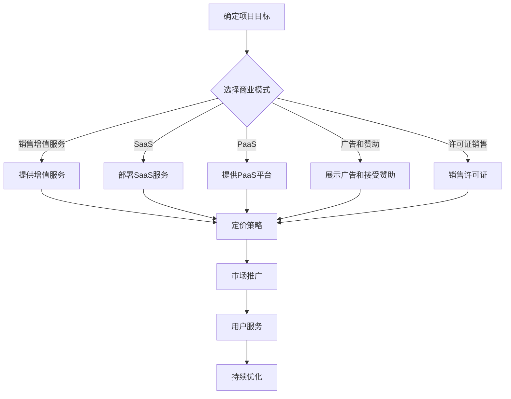

                 

# 程序员如何将开源项目转化为盈利模式

> 关键词：开源项目，盈利模式，商业模式，开发者，商业化，市场策略
>
> 摘要：本文旨在为程序员提供一套系统化的策略，以将个人或团队开发的开源项目转化为盈利模式。我们将从背景介绍、核心概念、算法原理、数学模型、项目实战、应用场景、工具推荐等方面展开，帮助开发者理解并实施有效的商业化路径。

## 1. 背景介绍

### 1.1 目的和范围

本文的目标是帮助程序员理解开源项目的商业化路径，并掌握将开源项目转化为盈利模式的方法。我们将探讨的核心问题包括：

- 开源项目如何从社区影响力转化为商业价值？
- 开源项目商业化的各种模式和策略有哪些？
- 程序员如何在确保项目开源的同时实现盈利？
- 如何制定并实施开源项目的商业化计划？

本文的范围主要涵盖开源项目的商业化基础理论、策略方法以及实际操作步骤。通过本文的阅读，读者将能够：

- 了解开源项目的核心概念和商业化的重要性。
- 掌握几种常见的开源项目商业化模式。
- 学会分析市场并制定商业计划。
- 掌握开源项目商业化的实际操作步骤。

### 1.2 预期读者

本文主要面向以下读者群体：

- 开源项目的维护者或贡献者。
- 想要将个人项目商业化的程序员。
- 对开源项目商业化感兴趣的软件工程师和创业者。
- 对开源文化和商业模式感兴趣的技术爱好者。

### 1.3 文档结构概述

本文将分为以下几个部分：

- 第1部分：背景介绍，包括目的、范围、预期读者和文档结构概述。
- 第2部分：核心概念与联系，介绍开源项目商业化所需的基础概念和架构。
- 第3部分：核心算法原理与具体操作步骤，详细阐述开源项目商业化的具体策略。
- 第4部分：数学模型和公式，介绍开源项目商业化的相关数学模型和计算方法。
- 第5部分：项目实战，通过实际案例展示开源项目商业化的全过程。
- 第6部分：实际应用场景，探讨开源项目商业化的多种应用场景和解决方案。
- 第7部分：工具和资源推荐，介绍有助于开源项目商业化的工具和资源。
- 第8部分：总结，展望开源项目商业化的未来发展趋势与挑战。
- 第9部分：附录，回答常见问题并提供扩展阅读资源。

### 1.4 术语表

#### 1.4.1 核心术语定义

- **开源项目**：由社区维护的软件项目，其源代码可以自由获取、使用、修改和分发。
- **商业模式**：企业在创造、传递和捕获价值方面所采用的基本逻辑。
- **盈利模式**：开源项目实现盈利的具体途径和方式。
- **商业化**：将开源项目转化为商业产品或服务的过程。
- **增值服务**：基于开源项目提供的有价值的服务，如培训、支持、定制开发等。
- **市场策略**：企业在市场中定位产品、获取客户和实现盈利的策略。

#### 1.4.2 相关概念解释

- **社区驱动发展（Community-Driven Development, CDD）**：通过社区参与来推动项目的发展和改进。
- **市场驱动发展（Market-Driven Development, MDD）**：根据市场需求来规划和开发产品。
- **SaaS（Software as a Service）**：一种软件交付模式，用户通过互联网按需访问和使用软件，而无需购买和安装。
- **PaaS（Platform as a Service）**：一种云计算服务，提供平台、基础设施和工具，以便开发人员创建和部署应用程序。
- **IaaS（Infrastructure as a Service）**：一种云计算服务，提供基础设施资源（如虚拟机、存储和网络），用户可以按需使用。

#### 1.4.3 缩略词列表

- **OSS**：Open Source Software，开源软件。
- **FOSS**：Free and Open Source Software，自由和开源软件。
- **GPL**：GNU General Public License，GNU通用公共许可证。
- **Apache License**：Apache许可证。
- **MIT License**：MIT许可证。
- **SaaS**：Software as a Service，软件即服务。
- **PaaS**：Platform as a Service，平台即服务。
- **IaaS**：Infrastructure as a Service，基础设施即服务。

## 2. 核心概念与联系

在将开源项目转化为盈利模式之前，我们需要明确几个核心概念和它们之间的联系。这些概念包括开源项目的本质、商业模式的类型、市场策略等。

### 2.1 开源项目的本质

开源项目通常具有以下几个特征：

- **开放性**：项目的源代码对所有人开放，用户可以自由查看、修改和分发。
- **协作性**：项目的发展依赖于社区的贡献，包括代码贡献、文档编写、测试和反馈。
- **共享性**：项目成果可以自由共享，无需支付费用。

开源项目的本质决定了其商业化的特殊性和复杂性。程序员在考虑商业化时，需要平衡开源精神与商业需求，确保项目能够持续发展。

### 2.2 商业模式的类型

开源项目的商业模式通常有以下几种：

- **销售增值服务**：提供定制开发、培训、技术支持等增值服务，通过收费实现盈利。
- **SaaS**：将开源项目转化为在线服务，用户按需付费使用。
- **PaaS**：提供开发平台和工具，开发者可以使用这些工具创建应用程序，并通过应用程序收费。
- **广告和赞助**：在项目网站上展示广告或接受赞助，通过广告收入和赞助费用实现盈利。
- **许可证销售**：销售开源项目的商业许可证，允许用户在商业环境中使用项目。

这些商业模式各有优劣，程序员需要根据项目特点和市场需求选择合适的商业模式。

### 2.3 市场策略

市场策略是商业化过程中至关重要的一环，主要包括：

- **定位**：确定项目的目标市场和用户群体。
- **推广**：通过各种渠道宣传项目，吸引潜在用户。
- **定价**：制定合理的价格策略，平衡成本、竞争和市场接受度。
- **用户服务**：提供优质的客户服务，包括技术支持、培训和文档等。

市场策略的制定需要结合项目特点和市场需求，确保项目能够获得足够的关注和用户支持。

### 2.4 Mermaid 流程图

为了更好地理解开源项目商业化的核心概念和流程，我们可以使用Mermaid绘制一个流程图。以下是一个简化的流程图示例：



这个流程图展示了从确定项目目标到商业化实施的一系列步骤，以及各个环节之间的联系。通过这个流程图，程序员可以清晰地了解开源项目商业化的整体框架和关键节点。

## 3. 核心算法原理与具体操作步骤

在了解了开源项目的本质和商业化模式后，我们需要深入探讨如何将开源项目转化为盈利模式。这个过程可以视为一系列策略和操作的组合，涉及市场分析、商业模式设计、技术实现等多个方面。以下将详细阐述这一核心算法原理与具体操作步骤。

### 3.1 市场分析

**市场分析**是开源项目商业化的第一步，它包括以下关键步骤：

1. **确定目标市场**：首先，程序员需要明确项目的目标市场，包括市场规模、用户需求、竞争对手等。可以通过市场调研、用户访谈、竞争对手分析等方式获取信息。

2. **分析用户需求**：了解目标用户的需求是制定商业模式的基础。程序员可以通过用户调查、用户反馈、市场趋势分析等手段收集需求信息。

3. **定位竞争环境**：在了解用户需求的基础上，程序员需要评估项目的竞争力。可以通过SWOT分析（优势、劣势、机会、威胁）来评估项目的市场地位。

**伪代码示例**：

```python
def market_analysis():
    # 确定目标市场
    market_size = get_market_size()
    user_demands = get_user_demands()
    competitors = get_competitors()

    # 分析用户需求
    user_profiles = analyze_user_demands(user_demands)

    # 定位竞争环境
    market_position = swot_analysis(competitors)
    
    return market_size, user_profiles, market_position
```

### 3.2 选择商业模式

在完成市场分析后，程序员需要选择适合项目的商业模式。常见的商业模式包括销售增值服务、SaaS、PaaS、广告和赞助、许可证销售等。以下是如何选择商业模式的步骤：

1. **评估商业模式适用性**：根据市场分析结果，评估每种商业模式的适用性。考虑商业模式是否能满足用户需求、是否与项目特性相符、能否实现盈利等。

2. **选择最佳商业模式**：根据评估结果，选择最符合项目特点和市场需求的一种或多种商业模式。

3. **制定商业模式计划**：明确商业模式的实施步骤、资源需求、预期收益等。

**伪代码示例**：

```python
def select_business_model(market_size, user_profiles, market_position):
    # 评估商业模式适用性
    model_assessments = assess_business_models(market_size, user_profiles, market_position)

    # 选择最佳商业模式
    best_model = select_best_model(model_assessments)

    # 制定商业模式计划
    business_plan = create_business_plan(best_model)
    
    return business_plan
```

### 3.3 技术实现

**技术实现**是将商业模式转化为实际操作的关键步骤。以下是如何进行技术实现的步骤：

1. **开发增值服务**：如果选择销售增值服务，需要开发相应的服务功能，如定制开发、培训、技术支持等。

2. **部署SaaS服务**：如果选择SaaS模式，需要搭建SaaS平台，包括前端界面、后端服务器、数据库等。

3. **提供PaaS平台**：如果选择PaaS模式，需要提供开发工具和平台，支持开发者创建和部署应用程序。

4. **展示广告和接受赞助**：在项目网站或其他渠道展示广告，接受赞助商的支持。

5. **销售许可证**：制定许可证销售方案，包括许可证种类、价格、使用范围等。

**伪代码示例**：

```python
def implement_technology(business_plan):
    if 'value_added_services' in business_plan:
        develop_value_added_services()
        
    if 'SaaS' in business_plan:
        deploy_SaaS_platform()
        
    if 'PaaS' in business_plan:
        provide_PaaS_platform()
        
    if '广告和赞助' in business_plan:
        show_ads_and_sponsorships()
        
    if '许可证销售' in business_plan:
        sell_licenses()
    
    return
```

### 3.4 市场推广

**市场推广**是将开源项目推向市场的关键步骤。以下是如何进行市场推广的步骤：

1. **定位推广目标**：根据商业模式和用户需求，确定推广目标和重点。

2. **制定推广策略**：选择合适的推广渠道和方式，如社交媒体、广告、社区活动、合作伙伴等。

3. **执行推广计划**：实施推广策略，吸引潜在用户。

4. **评估推广效果**：通过数据分析等方法评估推广效果，调整推广策略。

**伪代码示例**：

```python
def market_promotion(business_plan):
    # 定位推广目标
    promotion_targets = define_promotion_targets(business_plan)
    
    # 制定推广策略
    promotion_strategy = create_promotion_strategy(promotion_targets)
    
    # 执行推广计划
    execute_promotion_plan(promotion_strategy)
    
    # 评估推广效果
    promotion成效 = evaluate_promotion成效(promotion_strategy)
    
    return promotion成效
```

### 3.5 用户服务

**用户服务**是维护用户关系和持续优化项目的重要环节。以下是如何提供用户服务的步骤：

1. **建立用户支持系统**：提供技术支持、文档、教程等，帮助用户解决使用中的问题。

2. **收集用户反馈**：通过问卷调查、用户访谈等方式收集用户反馈，了解用户需求和满意度。

3. **持续优化项目**：根据用户反馈和市场需求，不断优化项目功能和用户体验。

4. **建立用户社区**：鼓励用户参与项目，提供交流平台，增强用户归属感和活跃度。

**伪代码示例**：

```python
def user_services(business_plan):
    # 建立用户支持系统
    support_system = build_support_system()
    
    # 收集用户反馈
    user_feedbacks = collect_user_feedbacks()
    
    # 持续优化项目
    optimize_project(user_feedbacks)
    
    # 建立用户社区
    user_community = build_user_community()
    
    return
```

通过上述核心算法原理与具体操作步骤，程序员可以系统地将开源项目转化为盈利模式。这些步骤不仅提供了具体的操作指导，还帮助程序员从全局角度理解开源项目商业化的复杂性和多样性。

## 4. 数学模型和公式及详细讲解

在开源项目的商业化过程中，数学模型和公式可以帮助程序员更好地理解市场趋势、评估盈利潜力，并制定合理的商业策略。以下我们将介绍几种常见的数学模型和公式，并对其进行详细讲解。

### 4.1 盈利预测模型

盈利预测是开源项目商业化的重要环节。一个简单的盈利预测模型可以使用以下公式：

\[ \text{盈利} = (\text{销售收入} - \text{成本}) \times \text{销售量} \]

其中：

- **销售收入**：项目通过商业模式（如增值服务、SaaS、PaaS等）获得的收入。
- **成本**：包括开发成本、运营成本、营销成本等。
- **销售量**：预计的项目销售数量。

**示例**：

假设某开源项目通过SaaS模式运营，预计每月销售收入为10,000美元，月运营成本为5,000美元，预计月销售量为1,000个用户。则该项目的月盈利预测为：

\[ \text{盈利} = (10,000 - 5,000) \times 1,000 = 5,000,000 \text{美元} \]

### 4.2 市场份额预测模型

市场份额预测是评估项目在市场中的竞争地位的重要方法。一个简单但有效的市场份额预测模型可以使用以下公式：

\[ \text{市场份额} = \frac{\text{项目收入}}{\text{市场规模}} \times 100\% \]

其中：

- **项目收入**：通过项目商业模式（如SaaS、增值服务等）获得的收入。
- **市场规模**：目标市场的总体规模。

**示例**：

假设某开源项目在一个月内通过SaaS模式获得了100,000美元的收入，而目标市场的总体规模为1,000,000美元。则该项目的市场份额预测为：

\[ \text{市场份额} = \frac{100,000}{1,000,000} \times 100\% = 10\% \]

### 4.3 成本效益分析模型

成本效益分析是评估开源项目商业模式的可行性和盈利能力的重要方法。一个简单的成本效益分析模型可以使用以下公式：

\[ \text{成本效益比} = \frac{\text{总收益}}{\text{总成本}} \]

其中：

- **总收益**：项目在一段时间内通过商业模式获得的全部收入。
- **总成本**：包括开发成本、运营成本、营销成本等。

**示例**：

假设某开源项目在一年内通过销售增值服务获得了300,000美元的总收入，而总成本为200,000美元。则该项目的成本效益比为：

\[ \text{成本效益比} = \frac{300,000}{200,000} = 1.5 \]

### 4.4 市场增长率模型

市场增长率模型可以帮助程序员预测市场的未来发展趋势，从而制定长期商业策略。一个简单但实用的市场增长率模型可以使用以下公式：

\[ \text{市场增长率} = \frac{\text{当前市场规模} - \text{基年市场规模}}{\text{基年市场规模}} \times 100\% \]

其中：

- **当前市场规模**：当前年份的市场规模。
- **基年市场规模**：参考年份的市场规模。

**示例**：

假设某开源项目的目标市场在2021年的市场规模为1,000,000美元，而在2022年的市场规模为1,200,000美元。则该市场的年增长率为：

\[ \text{市场增长率} = \frac{1,200,000 - 1,000,000}{1,000,000} \times 100\% = 20\% \]

### 4.5 用户获取成本模型

用户获取成本（Customer Acquisition Cost, CAC）是评估市场推广效果的重要指标。一个简单的用户获取成本模型可以使用以下公式：

\[ \text{CAC} = \frac{\text{市场推广总成本}}{\text{新增用户数}} \]

其中：

- **市场推广总成本**：在一段时间内用于市场推广的全部成本。
- **新增用户数**：在相同时间内通过市场推广获得的新用户数量。

**示例**：

假设某开源项目在一个月内花费了10,000美元进行市场推广，期间获得了1,000个新增用户。则该项目的用户获取成本为：

\[ \text{CAC} = \frac{10,000}{1,000} = 10 \text{美元/用户} \]

### 4.6 客户生命周期价值模型

客户生命周期价值（Customer Lifetime Value, CLV）是预测客户在整个生命周期内为公司带来的总价值。一个简单的客户生命周期价值模型可以使用以下公式：

\[ \text{CLV} = \text{平均订单价值} \times \text{购买频率} \times \text{顾客留存率} \]

其中：

- **平均订单价值**：客户每次购买的平均金额。
- **购买频率**：客户在一段时间内购买的次数。
- **顾客留存率**：客户在一定时间内继续使用服务的概率。

**示例**：

假设某开源项目的平均订单价值为100美元，客户购买频率为每月一次，顾客留存率为80%。则该客户的生命周期价值为：

\[ \text{CLV} = 100 \times 1 \times 0.8 = 80 \text{美元/月} \]

通过以上数学模型和公式的详细讲解，程序员可以更好地理解开源项目商业化的关键指标和预测方法，从而制定更有效的商业策略。

## 5. 项目实战：代码实际案例和详细解释说明

为了更好地展示开源项目商业化的全过程，我们以下将通过一个具体的开源项目案例——一个基于Python的Web应用程序框架——来详细解释开源项目商业化的操作步骤。本案例将涵盖开发环境搭建、源代码详细实现和代码解读与分析。

### 5.1 开发环境搭建

首先，我们需要为该开源项目搭建一个开发环境。以下是具体的步骤：

1. **安装Python**：确保Python 3.x版本已安装。可以使用以下命令检查Python版本：

   ```shell
   python --version
   ```

   如果未安装，可以从Python官方网站下载并安装。

2. **安装虚拟环境**：为了更好地管理和隔离项目依赖，我们使用`venv`创建虚拟环境。在项目目录下执行以下命令：

   ```shell
   python -m venv venv
   ```

   激活虚拟环境：

   ```shell
   source venv/bin/activate  # 对于macOS和Linux
   \path\to\activate.bat  # 对于Windows
   ```

3. **安装依赖**：在虚拟环境中安装项目的依赖库。根据项目的`requirements.txt`文件，使用以下命令安装：

   ```shell
   pip install -r requirements.txt
   ```

4. **配置数据库**：假设项目使用SQLite作为数据库，需要创建数据库文件并配置数据库连接。在项目目录下创建一个名为`db.sqlite3`的数据库文件，并在代码中配置数据库连接：

   ```python
   import sqlite3

   conn = sqlite3.connect('db.sqlite3')
   ```

### 5.2 源代码详细实现和代码解读

以下是一个简单的Web应用程序框架的源代码实现，包括核心功能模块：

```python
# app.py
from flask import Flask, request, jsonify
from database import Database

app = Flask(__name__)

# 初始化数据库连接
db = Database()

@app.route('/data', methods=['GET', 'POST'])
def data_handler():
    if request.method == 'GET':
        # 从数据库中获取数据
        data = db.fetch_all()
        return jsonify(data)
    elif request.method == 'POST':
        # 提交数据到数据库
        data = request.json
        db.insert(data)
        return jsonify({'message': 'Data inserted successfully'}), 201

if __name__ == '__main__':
    app.run(debug=True)
```

**代码解读**：

- **导入模块**：首先导入所需的Flask模块和自定义的`database.py`模块。
- **初始化Flask应用**：创建一个Flask应用程序实例。
- **数据库连接**：在代码顶部初始化数据库连接，使用自定义的`Database`类。
- **定义路由**：`/data`路由支持`GET`和`POST`请求。`GET`请求用于从数据库中获取数据，`POST`请求用于向数据库中插入数据。
- **处理GET请求**：在`GET`请求处理函数中，调用`Database`类的`fetch_all`方法获取所有数据，并返回JSON格式的响应。
- **处理POST请求**：在`POST`请求处理函数中，从请求中提取JSON格式的数据，调用`Database`类的`insert`方法将数据插入数据库，并返回一个成功消息的JSON响应。

以下是数据库模块的实现：

```python
# database.py
import sqlite3

class Database:
    def __init__(self):
        self.conn = sqlite3.connect('db.sqlite3')
        self.cursor = self.conn.cursor()
        self._create_table()

    def _create_table(self):
        self.cursor.execute('''CREATE TABLE IF NOT EXISTS data (id INTEGER PRIMARY KEY, name TEXT)''')
        self.conn.commit()

    def fetch_all(self):
        self.cursor.execute("SELECT * FROM data")
        return self.cursor.fetchall()

    def insert(self, data):
        self.cursor.execute("INSERT INTO data (name) VALUES (?)", (data['name'],))
        self.conn.commit()
```

**代码解读**：

- **数据库连接与初始化**：`Database`类的构造函数初始化数据库连接和游标，并创建数据表。
- **创建数据表**：`_create_table`方法创建一个名为`data`的表格，如果表格已存在，则不做操作。
- **获取数据**：`fetch_all`方法查询`data`表中的所有记录，并返回结果。
- **插入数据**：`insert`方法将传入的字典数据插入到`data`表中。

### 5.3 代码解读与分析

在代码实现中，我们遵循了MVC（模型-视图-控制器）架构模式：

- **模型（Model）**：`database.py`模块中的`Database`类负责与数据库的交互，包括创建表、插入数据和查询数据。
- **视图（View）**：`app.py`中的路由处理函数作为视图层，负责响应用户的请求，并调用模型层的方法处理数据。
- **控制器（Controller）**：`app.py`中的Flask应用程序实例作为控制器，协调模型和视图层之间的交互。

**优势**：

- **模块化**：将数据库逻辑与Web应用程序逻辑分离，使代码更易于维护和扩展。
- **简洁性**：通过Flask框架简化了Web应用程序的开发，使代码更简洁易懂。
- **灵活性**：可以方便地添加新的路由和处理函数，以支持更多的功能。

**劣势**：

- **安全性**：Flask框架默认情况下对SQL注入等安全问题处理不足，需要开发者自行添加安全措施。
- **性能**：对于大量数据的操作，可能需要优化数据库查询和操作以提高性能。

通过上述案例，我们展示了如何搭建开发环境、实现开源项目的核心功能和解读代码。接下来，我们将讨论如何将这个开源项目商业化，以及如何实现盈利。

### 5.4 商业化实施

在实现开源项目的核心功能后，我们可以开始考虑如何将其商业化。以下是具体的商业化实施步骤：

1. **增值服务**：为项目提供定制开发服务，如根据客户需求定制功能模块、优化性能等。通过提供高质量的服务，吸引客户付费。

2. **SaaS模式**：将项目转化为SaaS服务，允许客户按需付费使用。可以通过设置不同层级的订阅计划，满足不同规模客户的需求。

3. **广告和赞助**：在项目网站上展示相关广告，或接受赞助商的支持。这种方式可以为项目带来额外的收入，同时增加项目的知名度和影响力。

4. **许可证销售**：为项目提供商业许可证，允许客户在商业环境中使用项目。不同类型的许可证可以根据客户的需求和预算定价。

**商业化案例**：

假设我们将上述Web应用程序框架商业化，可以采取以下策略：

- **增值服务**：提供定制开发服务，如针对企业客户的需求进行性能优化、增加特定功能等。根据服务复杂度和客户需求，设定不同的收费标准。
- **SaaS模式**：提供基于云的SaaS服务，允许客户按需付费使用。可以设置免费试用期，吸引客户体验服务，并转为付费用户。
- **广告和赞助**：在项目网站上展示广告，或与相关企业合作，接受赞助支持。这种方式不仅可以增加收入，还可以提升项目的市场知名度。
- **许可证销售**：为项目提供商业许可证，允许企业客户在商业环境中使用。不同类型的许可证（如个人版、企业版、机构版）可以根据客户的需求和预算定价。

通过上述步骤，程序员可以将开源项目转化为盈利模式，实现商业价值。接下来，我们将讨论开源项目商业化的实际应用场景。

### 5.5 实际应用场景

开源项目商业化的实际应用场景非常广泛，以下是一些具体的案例：

**1. 企业级定制开发**

企业通常有特定的业务需求和技术要求，而开源项目可能无法完全满足这些需求。因此，提供定制开发服务成为了一种有效的商业模式。例如，某企业需要在其内部系统中集成特定的Web应用程序框架，我们可以根据企业的需求进行定制开发，并提供长期的技术支持。

**2. SaaS服务**

SaaS模式是开源项目商业化的一种常见方式。通过将开源项目转化为SaaS服务，我们可以为客户提供便捷的使用体验，并按需收费。例如，一个开源的博客平台可以通过SaaS模式提供，用户只需注册并支付订阅费用，即可使用平台提供的各项功能。

**3. 教育和培训**

开源项目可以作为一种教育和培训工具，为开发者提供学习和实践的机会。通过提供相关课程和培训服务，我们可以将开源项目商业化。例如，我们可以在开源的Web应用程序框架基础上，开发一系列的教学视频和文档，为学习者提供系统化的学习路径。

**4. 技术支持和服务**

开源项目通常有大量的用户，他们可能需要技术支持和服务。我们可以提供付费的技术支持服务，如在线咨询、远程协助、问题排查等。这种服务不仅能够解决用户的问题，还可以增加项目的用户黏性和忠诚度。

**5. 商业解决方案**

开源项目可以作为一种商业解决方案的一部分，为客户提供整体的技术服务。例如，一个企业可能需要构建一个完整的电子商务平台，我们可以基于开源项目，提供从开发、部署到维护的一站式服务。

通过上述实际应用场景，我们可以看到开源项目商业化的多种可能性。这些案例不仅展示了开源项目的商业价值，也为程序员提供了多样化的商业化路径。

## 6. 工具和资源推荐

在开源项目商业化的过程中，程序员需要依赖各种工具和资源来提升项目质量和市场竞争力。以下是一些推荐的工具和资源，包括学习资源、开发工具和框架、调试和性能分析工具等。

### 6.1 学习资源推荐

**6.1.1 书籍推荐**

1. **《开源项目指南》**（Open Source Project Guide）：本书详细介绍了开源项目的创建、维护和管理，适合希望参与或领导开源项目的程序员阅读。
2. **《商业模式新生代》**（Business Model Generation）：这本书提供了创新的商业模式设计工具，帮助程序员找到适合开源项目的商业模式。
3. **《软件自由的未来》**（The Future of Free Software）：作者对开源文化和商业模式的深入分析，为程序员提供了广阔的视野和灵感。

**6.1.2 在线课程**

1. **Coursera的《开源项目管理》**：由著名大学提供的在线课程，涵盖开源项目的创建、合作和商业化。
2. **Udemy的《开源软件开发》**：针对软件开发者的开源项目实践课程，从基础到进阶，全面介绍开源项目的开发和管理。
3. **edX的《商业模式创新》**：这门课程探讨了商业模式的创新方法和实践技巧，适合希望将开源项目商业化的程序员。

**6.1.3 技术博客和网站**

1. **GitHub博客**：GitHub官方博客，分享开源项目的最佳实践、技术文章和社区动态。
2. **博客园**：中国最大的软件开发者社区，提供丰富的开源项目经验和商业模式分析。
3. **Medium上的TechOnomy**：专注于技术趋势和商业模式的博客，分享最新的开源项目和商业模式案例。

### 6.2 开发工具框架推荐

**6.2.1 IDE和编辑器**

1. **Visual Studio Code**：一款功能强大的开源IDE，支持多种编程语言，具有丰富的插件生态系统。
2. **PyCharm**：由JetBrains开发的Python IDE，提供全面的开发支持，适合Python项目的开发。
3. **IntelliJ IDEA**：多语言的IDE，具有高效的代码编辑和调试功能，适用于大型项目和复杂架构。

**6.2.2 调试和性能分析工具**

1. **GDB**：GNU Debugger，适用于C/C++程序的调试，功能强大且开源。
2. **Postman**：用于API测试和调试的工具，支持多种编程语言和平台。
3. **New Relic**：一款强大的性能监控工具，可以帮助开发者实时监控应用程序的性能和资源使用情况。

**6.2.3 相关框架和库**

1. **Flask**：一个轻量级的Web应用程序框架，适用于快速开发和原型设计。
2. **Django**：一个全功能的Web框架，提供了许多高级功能和开箱即用的解决方案。
3. **React**：一个用于构建用户界面的JavaScript库，具有高度的灵活性和可扩展性。

### 6.3 相关论文著作推荐

**6.3.1 经典论文**

1. **《开源软件：文化、商业模式和法律》**（Open Source Software: Culture, Business, and Legal Issues）：讨论开源软件的发展、商业模式和法律问题。
2. **《商业模式创新：探索新的商业机会》**（Business Model Innovation: Opportunities for Growth Beyond Core Business）：分析商业模式的创新方法和实践案例。
3. **《开源软件的经济学》**（The Economics of Open Source Software）：探讨开源软件的商业模式和经济效益。

**6.3.2 最新研究成果**

1. **《开源生态系统中的创新与合作》**（Innovation and Collaboration in Open Source Ecosystems）：研究开源生态系统中的合作模式和创新能力。
2. **《开源软件项目管理》**（Open Source Software Project Management）：探讨开源项目管理的最佳实践和挑战。
3. **《开源商业模式的未来趋势》**（Future Trends in Open Source Business Models）：预测开源商业模式的未来发展和变化。

**6.3.3 应用案例分析**

1. **《Linux的商业模式分析》**（The Business Model of Linux）：详细分析Linux开源项目的商业模式和成功因素。
2. **《GitHub上的开源项目商业化》**（Open Source Commercialization on GitHub）：研究GitHub平台上开源项目的商业化路径和模式。
3. **《开源软件的商业应用案例研究》**（Case Studies in the Commercial Application of Open Source Software）：分享多个开源项目的商业应用案例和经验。

通过上述工具和资源的推荐，程序员可以更好地掌握开源项目商业化的方法和实践，从而实现项目的商业成功。

## 8. 总结：未来发展趋势与挑战

在开源项目商业化的道路上，程序员面临着诸多机遇与挑战。首先，开源项目的商业化趋势正日益明显，越来越多的企业和开发者认识到开源项目不仅能够促进技术进步，还能带来显著的商业价值。以下是对未来发展趋势和挑战的总结：

### 发展趋势

1. **多元化商业模式**：开源项目的商业化模式将更加多元化，不仅限于传统的销售增值服务、SaaS、PaaS等，还将涵盖广告、赞助、许可销售等多种形式。随着市场需求的不断变化，程序员需要不断创新商业模式，以适应市场变化。

2. **技术赋能**：人工智能、大数据、云计算等技术的快速发展，为开源项目商业化提供了更多机会。通过技术赋能，程序员可以提供更智能、更高效的服务，增强项目的竞争力。

3. **全球化市场**：互联网的普及使得全球市场变得更加开放和互联，程序员可以利用全球化市场，将开源项目推向国际市场，吸引更多用户和合作伙伴。

4. **社区合作**：开源项目的成功离不开社区的积极参与和支持。未来，社区合作将成为开源项目商业化的重要推动力，程序员需要加强与社区的合作，共同推动项目的成长。

### 挑战

1. **市场定位**：在众多开源项目中，如何准确地定位市场，找到合适的商业模式，是程序员面临的首要挑战。需要深入分析市场趋势和用户需求，制定有效的市场策略。

2. **盈利平衡**：在确保项目开源精神的前提下，如何平衡开源与盈利的关系，确保项目能够持续发展，是一个需要不断探索的问题。

3. **技术持续更新**：开源项目需要不断迭代和更新，以保持竞争力。程序员需要投入大量时间和精力进行技术研究和开发，确保项目的技术水平处于行业前沿。

4. **法律法规**：开源项目的商业化涉及到诸多法律法规问题，如知识产权保护、许可协议等。程序员需要了解并遵守相关法律法规，确保项目的合法性和合规性。

5. **用户满意度**：开源项目商业化的成功离不开用户的认可和支持。程序员需要关注用户反馈，持续优化项目，提高用户体验，增强用户黏性。

### 未来展望

展望未来，开源项目商业化的前景广阔。程序员应把握机遇，积极探索新的商业模式，充分利用技术优势，打造具有市场竞争力的开源项目。同时，需要关注市场动态，灵活调整战略，以应对不断变化的商业环境。通过不断的创新和优化，开源项目不仅能够为开发者带来商业价值，还能为整个技术社区贡献更多优秀的成果。

总之，开源项目商业化的未来充满机遇和挑战。程序员需要具备前瞻性思维，勇于尝试，不断创新，才能在激烈的市场竞争中脱颖而出，实现开源项目的商业成功。

## 9. 附录：常见问题与解答

在开源项目商业化的过程中，程序员可能会遇到各种问题和挑战。以下列出了一些常见问题及解答，以帮助读者更好地理解和应对这些挑战。

### 9.1 如何平衡开源精神与商业需求？

**解答**：平衡开源精神与商业需求的关键在于透明度和公正性。首先，确保开源项目的基本功能和代码对所有人开放，尊重开源社区的贡献。其次，对于增值服务和商业化部分，可以设置合理的费用，但需透明告知用户服务的内容和价值。同时，制定明确的商业规则，确保商业化活动不会对开源项目的发展产生负面影响。

### 9.2 开源项目如何进行市场推广？

**解答**：开源项目的市场推广可以采用多种策略：

1. **社交媒体**：利用微博、Twitter、LinkedIn等社交媒体平台，发布项目更新、技术博客和用户案例。
2. **技术社区**：参与技术论坛、GitHub、Stack Overflow等平台，解答用户问题，建立项目口碑。
3. **合作伙伴**：寻找行业内的合作伙伴，共同推广项目，共享用户资源。
4. **会议和活动**：参加技术会议和研讨会，展示项目成果，吸引潜在用户和合作伙伴。
5. **内容营销**：编写高质量的技术文章和博客，提供项目教程和文档，提升项目知名度。

### 9.3 如何定价开源项目的增值服务？

**解答**：定价增值服务时，需要考虑以下因素：

1. **成本**：包括开发成本、运营成本、营销成本等。
2. **竞争对手**：分析市场上类似服务的定价，确保具有竞争力。
3. **用户价值**：评估用户对增值服务的需求和支付意愿，提供不同的服务层级，满足不同用户的需求。
4. **市场趋势**：根据市场趋势和用户需求变化，调整定价策略。

### 9.4 开源项目如何保护知识产权？

**解答**：开源项目的知识产权保护可以通过以下方式实现：

1. **选择合适的许可协议**：如GPL、Apache License等，确保项目的源代码和贡献者知识产权得到保护。
2. **版权声明**：在项目源代码和文档中添加版权声明，明确项目的知识产权归属。
3. **审查贡献代码**：确保所有贡献代码符合许可协议要求，避免侵权行为。
4. **法律咨询**：必要时，寻求专业法律咨询，确保项目符合相关法律法规。

### 9.5 如何处理开源项目的用户反馈？

**解答**：处理用户反馈是提升项目质量和用户满意度的重要环节，具体方法包括：

1. **建立反馈机制**：提供便捷的反馈渠道，如GitHub Issues、邮件列表等。
2. **及时响应**：对于用户反馈，及时给予答复，解决用户问题。
3. **公开透明**：对于用户反馈的问题，可以在项目社区或博客中公开讨论，增加透明度。
4. **持续优化**：根据用户反馈，不断改进项目功能和用户体验，提高用户满意度。

通过上述常见问题与解答，程序员可以更好地应对开源项目商业化过程中遇到的各种挑战，确保项目持续发展和商业成功。

## 10. 扩展阅读 & 参考资料

在开源项目商业化这一复杂领域，深入学习和了解相关资源和研究成果对于程序员至关重要。以下是一些扩展阅读和参考资料，旨在帮助读者进一步探索开源项目商业化的各个方面。

### 10.1 开源文化相关书籍

1. **《开源文化：协作和创新的力量》**（Open Organization: An Open Source Manifesto for the Next Generation of Work）：作者程浩（Jason M. Briere）和Pamela O'Leary深入探讨了开源文化的核心价值观，以及如何将这些价值观应用于现代组织和企业。
2. **《开源：如何创建并运营成功的开源项目》**（Open Source Management：由Hyde和Herbert合著，详细介绍了开源项目的创建、管理和维护的最佳实践。
3. **《开放协作：开源项目的成功之道》**（The Success of Open Source）：作者Lane和Rosenberg阐述了开源项目的成功因素，包括社区协作、创新和商业模式的结合。

### 10.2 开源项目商业化论文

1. **《开源商业模式：理论与实践》**（Business Models for Open Source）：这篇论文由著名的开源研究专家Steve Weber撰写，详细分析了开源项目的商业模式及其经济效益。
2. **《开源项目的商业化路径》**（Open Source Commercialization Paths）：作者通过大量案例分析，探讨了开源项目商业化的多种路径和策略。
3. **《开源商业化中的知识产权管理》**（Intellectual Property Management in Open Source Commercialization）：这篇论文探讨了开源项目在商业化过程中如何有效管理知识产权，确保项目的可持续性和合法性。

### 10.3 开源项目商业化案例研究

1. **《Linux的商业之路》**（The Linux Model）：详细分析Linux开源项目的商业化模式，探讨其成功因素。
2. **《GitHub的成功：开源项目的商业化实践》**（GitHub's Success：Open Source Commercialization in Action）：研究GitHub平台上的开源项目商业化案例，分享其在开源生态系统中的商业实践。
3. **《Red Hat的商业战略》**（Red Hat's Business Strategy）：通过分析Red Hat的商业模式和战略，探讨开源企业如何实现商业成功。

### 10.4 开源项目商业化研究报告

1. **《全球开源商业报告》**（Global Open Source Business Report）：这份年度报告由开源产业研究机构451 Research发布，提供了全球开源商业市场的最新趋势和分析。
2. **《中国开源软件发展报告》**（China Open Source Software Development Report）：由中国开源软件推进联盟发布的报告，分析了中国开源软件市场的发展现状和趋势。
3. **《欧洲开源商业报告》**（European Open Source Business Report）：这份报告由OpenForum欧洲发布，探讨了欧洲开源商业市场的发展现状和未来趋势。

通过上述扩展阅读和参考资料，读者可以进一步深入了解开源项目商业化的理论、实践和最新动态，从而更好地应对开源项目商业化过程中遇到的挑战，实现项目的商业成功。

