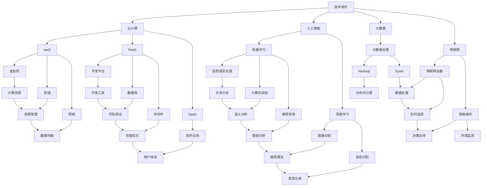

                 


## 1. 背景介绍

### 1.1 目的和范围

在当今快速发展的科技时代，IT行业的变革与转型已经成为不可避免的趋势。从云计算到人工智能，从大数据到物联网，每一次技术的革新都给程序员带来了新的挑战和机遇。本文旨在探讨程序员如何应对这一行业的变革与转型，提供一系列实用的策略和思路，帮助程序员在技术发展的浪潮中站稳脚跟，不断提升自身竞争力。

本文将围绕以下几个核心问题展开：

- **行业变革的驱动因素**：分析推动IT行业变革的关键因素，包括技术进步、市场需求和竞争环境等。
- **程序员的转型路径**：探讨程序员在不同技术领域的转型路径，包括云计算、人工智能、大数据等。
- **技能提升与学习策略**：介绍程序员如何通过持续学习、实践项目和社区参与来提升自身技能。
- **适应变化的能力培养**：探讨程序员如何培养适应行业变化的能力，包括思维模式的转变和灵活性的提升。
- **未来趋势与挑战**：展望IT行业未来的发展趋势和程序员可能面临的挑战。

### 1.2 预期读者

本文的预期读者主要是：

- **程序员**：对自身职业发展有较高追求的程序员，希望了解如何应对行业变革与转型。
- **技术爱好者**：对IT行业有一定了解的技术爱好者，希望深入了解行业动态和趋势。
- **学生**：计算机科学和信息技术专业的学生，希望为未来的职业生涯做好准备。

### 1.3 文档结构概述

本文结构如下：

- **第1章** 背景介绍：阐述本文的目的、范围和预期读者。
- **第2章** 核心概念与联系：介绍IT行业变革的核心概念，并使用Mermaid流程图展示其关系。
- **第3章** 核心算法原理 & 具体操作步骤：详细讲解应对行业变革的算法原理，并用伪代码阐述操作步骤。
- **第4章** 数学模型和公式 & 详细讲解 & 举例说明：介绍相关数学模型和公式，并通过实例进行详细讲解。
- **第5章** 项目实战：代码实际案例和详细解释说明：通过一个实际项目案例，展示如何应对行业变革。
- **第6章** 实际应用场景：分析行业变革在不同应用场景中的具体表现。
- **第7章** 工具和资源推荐：推荐学习和开发相关的工具和资源。
- **第8章** 总结：未来发展趋势与挑战：展望IT行业的未来趋势和程序员可能面临的挑战。
- **第9章** 附录：常见问题与解答：针对文章内容提供常见问题的解答。
- **第10章** 扩展阅读 & 参考资料：提供进一步学习的参考资料。

### 1.4 术语表

#### 1.4.1 核心术语定义

- **行业变革**：指IT行业在技术、市场、政策等方面发生的重大变化。
- **转型**：指程序员在现有技术基础上，向新的技术领域或角色转换的过程。
- **云计算**：指通过互联网提供计算资源的服务模式，包括基础设施即服务（IaaS）、平台即服务（PaaS）和软件即服务（SaaS）。
- **人工智能**：指通过计算机程序实现人类智能行为的技术，包括机器学习、深度学习等。
- **大数据**：指无法用传统数据库工具进行有效管理和处理的大量数据。
- **物联网**：指通过互联网将各种物理设备连接起来，实现智能感知、识别和管理的技术。

#### 1.4.2 相关概念解释

- **技术栈**：指程序员在工作中所使用的技术、语言和工具的集合。
- **编程范式**：指编程语言的语法和语义组织方式，包括面向对象、函数式编程等。
- **持续集成与持续部署（CI/CD）**：指通过自动化工具实现代码的集成、测试和部署过程。
- **敏捷开发**：指一种注重迭代、反馈和适应变化的软件开发方法。

#### 1.4.3 缩略词列表

- **IaaS**：基础设施即服务（Infrastructure as a Service）
- **PaaS**：平台即服务（Platform as a Service）
- **SaaS**：软件即服务（Software as a Service）
- **AI**：人工智能（Artificial Intelligence）
- **ML**：机器学习（Machine Learning）
- **DL**：深度学习（Deep Learning）
- **IoT**：物联网（Internet of Things）
- **SDLC**：软件开发生命周期（Software Development Life Cycle）
- **CI/CD**：持续集成与持续部署（Continuous Integration/Continuous Deployment）
- **TDD**：测试驱动开发（Test-Driven Development）
- **BDD**：行为驱动开发（Behavior-Driven Development）
- **IDE**：集成开发环境（Integrated Development Environment）
- **API**：应用程序编程接口（Application Programming Interface）

## 2. 核心概念与联系

在探讨程序员如何应对行业变革与转型之前，我们需要明确几个核心概念，并理解它们之间的关系。以下是IT行业变革中的关键概念及其关系：

### 2.1 技术进步

技术进步是推动行业变革的最重要因素之一。以下是几个核心技术领域的简要介绍：

#### 2.1.1 云计算

云计算提供了一种灵活的资源分配和管理方式，使程序员能够快速构建和部署应用。云计算包括以下三个主要服务模式：

- **基础设施即服务（IaaS）**：提供虚拟化计算资源，如虚拟机、存储和网络。
- **平台即服务（PaaS）**：提供一个开发和部署应用的平台，包括数据库、中间件和开发工具。
- **软件即服务（SaaS）**：提供完整的软件应用，用户通过互联网按需使用。

#### 2.1.2 人工智能

人工智能（AI）通过机器学习和深度学习等技术，使计算机能够模拟人类智能行为。AI在各个领域都有广泛的应用，如自然语言处理、计算机视觉和推荐系统等。

#### 2.1.3 大数据和物联网

大数据处理技术使程序员能够从海量数据中提取有价值的信息。物联网（IoT）通过连接各种物理设备，实现数据的实时收集和远程控制。

### 2.2 市场需求

市场需求也是推动行业变革的重要因素。随着企业数字化转型和消费者对智能应用的期望不断提高，程序员需要不断适应市场需求的变化。

#### 2.2.1 云服务和云计算

随着企业对云计算的需求增加，程序员需要掌握云计算基础设施的管理和维护技能，包括云服务提供商（如AWS、Azure、Google Cloud）的使用和配置。

#### 2.2.2 人工智能和大数据

人工智能和大数据在各个行业都有广泛应用，如金融、医疗和零售。程序员需要掌握相关技术，如机器学习算法、大数据处理框架（如Hadoop、Spark）等。

#### 2.2.3 物联网和智能家居

物联网技术的普及带来了智能家居、智能城市等新应用场景，程序员需要掌握物联网设备的数据处理和通信技术。

### 2.3 竞争环境

竞争环境是程序员转型的另一个关键因素。随着新技术的不断涌现，程序员需要不断更新自己的技能，以保持竞争力。

#### 2.3.1 技术更新速度

技术的快速更新使得程序员需要不断学习新的编程语言、框架和工具，以跟上行业的发展。

#### 2.3.2 市场饱和度

某些技术领域可能已经达到市场饱和，程序员需要寻找新的机会和领域，如新兴的区块链技术、边缘计算等。

#### 2.3.3 跨领域合作

跨领域合作成为新的趋势，程序员需要具备跨学科的知识和技能，如数据科学与人工智能、物联网与云计算等。

### 2.4 Mermaid流程图

为了更清晰地展示核心概念之间的关系，我们可以使用Mermaid流程图来表示：



通过这个流程图，我们可以看到技术进步如何推动云计算、人工智能、大数据和物联网等技术的发展，以及它们在各个领域的具体应用。这些核心概念之间的联系为程序员提供了丰富的转型机会和挑战。

## 3. 核心算法原理 & 具体操作步骤

为了更好地理解程序员如何应对行业变革与转型，我们需要深入探讨几个核心算法原理，并通过伪代码来详细阐述其操作步骤。以下是几个关键算法及其应用场景的介绍。

### 3.1 机器学习算法

#### 3.1.1 逻辑回归（Logistic Regression）

逻辑回归是一种常用的分类算法，用于预测二分类结果。其核心原理是利用线性模型计算概率，并通过 sigmoid 函数将输出转换为概率值。

```pseudo
function logistic_regression(features, labels, learning_rate, iterations):
    w = initialize_weights(features)
    for i in 1 to iterations:
        for each sample in data:
            prediction = sigmoid(dot_product(w, features[sample]))
            gradient = (prediction - labels[sample]) * features[sample]
            w = w - learning_rate * gradient
    return w

function sigmoid(x):
    return 1 / (1 + exp(-x))
```

#### 3.1.2 决策树（Decision Tree）

决策树是一种树形结构，通过一系列规则对数据进行分类。其核心原理是递归地将数据集划分成子集，直到满足终止条件。

```pseudo
function decision_tree(data, target_attribute, maximum_depth):
    if data meets termination condition:
        return majority vote of target_attribute
    else if maximum_depth reached:
        return entropy-based split
    else:
        best_attribute, best_value = find_best_split(data)
        left subtree = decision_tree(split_left(data, best_attribute, best_value), target_attribute, maximum_depth + 1)
        right subtree = decision_tree(split_right(data, best_attribute, best_value), target_attribute, maximum_depth + 1)
        return Node(best_attribute, best_value, left subtree, right subtree)
```

### 3.2 大数据处理算法

#### 3.2.1 MapReduce

MapReduce 是一种分布式数据处理模型，用于处理海量数据。其核心原理是将任务划分为 map 和 reduce 两个阶段，分别对数据进行映射和归约。

```pseudo
function mapreduce(data, mapper, reducer, num_reduces):
    map_outputs = []
    for each map_task in mappers:
        map_outputs.append(mapper(data, map_task))
    shuffled_outputs = shuffle(map_outputs)
    reduce_outputs = []
    for i in 0 to num_reduces - 1:
        reduce_outputs.append(reducer(shuffled_outputs[i * chunk_size:(i + 1) * chunk_size]))
    return reduce_outputs
```

#### 3.2.2 数据流处理（Data Stream Processing）

数据流处理是一种实时处理数据的技术，用于处理连续的数据流。其核心原理是使用滑动窗口和在线学习算法来分析数据。

```pseudo
function stream_processor(stream, window_size, learning_algorithm):
    buffer = []
    for each data_point in stream:
        buffer.append(data_point)
        if length(buffer) > window_size:
            output = learning_algorithm(buffer)
            buffer = buffer[1:]
            return output
```

### 3.3 人工智能算法

#### 3.3.1 反向传播（Backpropagation）

反向传播是一种训练神经网络的算法，用于优化网络权重。其核心原理是通过计算误差的梯度，更新网络权重。

```pseudo
function backpropagation(network, input, expected_output):
    output = forward_pass(input, network)
    error = expected_output - output
    delta = error * activation_derivative(output)
    for each layer in network:
        for each weight in layer:
            gradient = dot_product(delta, previous_layer)
            delta = gradient * activation_derivative(previous_layer)
    update_weights(network, learning_rate * gradient)
    return updated_network
```

通过这些核心算法的原理和操作步骤，我们可以看到程序员如何通过算法来应对行业变革。这些算法不仅为程序员提供了强大的工具，还为他们提供了不断学习和适应新技术的能力。程序员需要掌握这些算法，并能够灵活运用到实际项目中，以应对不断变化的行业环境。

### 4. 数学模型和公式 & 详细讲解 & 举例说明

在应对行业变革的过程中，程序员不仅需要掌握核心算法，还需要理解相关的数学模型和公式。以下是几个重要数学模型和公式的详细讲解及举例说明。

#### 4.1 逻辑回归（Logistic Regression）

逻辑回归是一种常用的分类算法，其数学模型如下：

$$
\text{Logistic Regression:} \quad \hat{y}(x) = \frac{1}{1 + e^{-(\beta_0 + \beta_1 x_1 + \beta_2 x_2 + \ldots + \beta_n x_n)}
$$

其中，$\hat{y}(x)$ 表示预测的概率，$x_i$ 表示特征值，$\beta_i$ 表示模型参数。

**示例**：

假设我们有一个二分类问题，特征为年龄（$x_1$）和收入（$x_2$）。给定一组数据，我们希望预测某人是否为高收入者。

首先，我们通过训练数据得到参数 $\beta_0, \beta_1, \beta_2$。然后，对于新的样本，我们可以计算其预测概率：

$$
\hat{y}(x) = \frac{1}{1 + e^{-(\beta_0 + \beta_1 x_1 + \beta_2 x_2)}}
$$

如果 $\hat{y}(x) > 0.5$，则预测为高收入者；否则，预测为低收入者。

#### 4.2 决策树（Decision Tree）

决策树的数学模型基于信息熵（Entropy）和基尼不纯度（Gini Impurity）。

**信息熵**：

$$
H(X) = -\sum_{i} p_i \log_2 p_i
$$

其中，$p_i$ 表示样本属于类别 $i$ 的概率。

**基尼不纯度**：

$$
Gini(X) = 1 - \sum_{i} p_i^2
$$

决策树通过递归划分数据集，直到满足某些终止条件。在每一步，我们选择具有最大信息增益的属性进行划分。

**示例**：

假设我们有一个包含年龄、收入和职业的样本数据集，我们需要构建一个决策树来预测高收入者。

首先，我们计算每个属性的信息熵或基尼不纯度，然后选择具有最大信息增益的属性进行划分。例如，如果我们选择年龄作为划分属性，我们可以将数据划分为年龄小于30和年龄大于等于30的两个子集。接着，对于每个子集，我们继续选择具有最大信息增益的属性进行划分，直到达到终止条件。

#### 4.3 支持向量机（Support Vector Machine，SVM）

支持向量机是一种二分类算法，其数学模型如下：

$$
\text{SVM:} \quad \hat{y}(x) = \text{sign}(\sum_{i} \alpha_i y_i (x_i \cdot x) + b)
$$

其中，$x_i$ 和 $y_i$ 分别为训练样本和对应标签，$\alpha_i$ 为拉格朗日乘子，$b$ 为偏置项。

**示例**：

假设我们有一个包含特征 $x_1, x_2$ 的二分类问题，我们需要训练一个SVM模型来预测类别。

首先，我们通过最小化损失函数来求解拉格朗日乘子 $\alpha_i$ 和偏置项 $b$。训练完成后，我们可以使用SVM模型对新的样本进行预测：

$$
\hat{y}(x) = \text{sign}(\sum_{i} \alpha_i y_i (x_i \cdot x) + b)
$$

如果预测结果大于0，则预测为正类；否则，预测为负类。

#### 4.4 神经网络（Neural Network）

神经网络的数学模型基于多层感知器（Multilayer Perceptron，MLP），其基本形式如下：

$$
\text{Neural Network:} \quad a_{l}^{(i)} = \sigma(\sum_{j=1}^{n} w_{l}^{(i)} a_{l-1}^{(j)})
$$

其中，$a_{l}^{(i)}$ 为第 $l$ 层第 $i$ 个神经元的激活值，$\sigma$ 为激活函数，$w_{l}^{(i)}$ 为连接权重。

**示例**：

假设我们有一个包含输入特征 $x_1, x_2$ 的二分类问题，我们需要训练一个神经网络来预测类别。

首先，我们定义输入层、隐藏层和输出层的结构，并初始化权重和偏置。然后，通过反向传播算法不断更新权重和偏置，直到模型收敛。最后，对于新的样本，我们可以计算其输出层的激活值，并根据激活值判断类别。

$$
a_{2}^{(i)} = \sigma(\sum_{j=1}^{n} w_{1}^{(i)} a_1^{(j)})
$$
$$
a_{3}^{(i)} = \sigma(\sum_{j=1}^{n} w_{2}^{(i)} a_2^{(j)})
$$
$$
\hat{y}(x) = a_{3}^{(i)}
$$

如果 $\hat{y}(x) > 0.5$，则预测为正类；否则，预测为负类。

通过以上数学模型和公式的讲解，我们可以看到程序员在应对行业变革时，需要具备扎实的数学基础，以便理解和应用各种算法。掌握这些模型和公式，不仅有助于提高编程技能，还能为解决实际问题提供强有力的工具。

### 5. 项目实战：代码实际案例和详细解释说明

为了更好地展示程序员如何应对行业变革，我们将通过一个实际项目案例来详细解释说明。本项目将基于Python语言，使用机器学习技术实现一个简单的垃圾邮件分类器。

#### 5.1 开发环境搭建

1. 安装Python（建议使用3.8或更高版本）。
2. 安装必要的Python库，包括`scikit-learn`、`pandas`、`numpy`和`matplotlib`。

```bash
pip install scikit-learn pandas numpy matplotlib
```

#### 5.2 源代码详细实现和代码解读

**5.2.1 数据集准备**

首先，我们需要准备一个垃圾邮件数据集。这里我们使用`scikit-learn`中自带的数据集`fetch_20newsgroups`。

```python
from sklearn.datasets import fetch_20newsgroups
from sklearn.model_selection import train_test_split

# 加载数据集
newsgroups_data = fetch_20newsgroups(subset='all')

# 划分训练集和测试集
X_train, X_test, y_train, y_test = train_test_split(newsgroups_data.data, newsgroups_data.target, test_size=0.2, random_state=42)
```

**5.2.2 数据预处理**

接下来，我们对文本数据进行预处理，包括分词、去除停用词和词干提取。

```python
from sklearn.feature_extraction.text import TfidfVectorizer

# 创建TF-IDF向量器
vectorizer = TfidfVectorizer(stop_words='english', ngram_range=(1, 2))

# 将文本转换为TF-IDF向量
X_train_tfidf = vectorizer.fit_transform(X_train)
X_test_tfidf = vectorizer.transform(X_test)
```

**5.2.3 模型训练**

我们选择逻辑回归算法进行训练。

```python
from sklearn.linear_model import LogisticRegression

# 创建逻辑回归模型
model = LogisticRegression()

# 训练模型
model.fit(X_train_tfidf, y_train)
```

**5.2.4 模型评估**

使用测试集对模型进行评估。

```python
from sklearn.metrics import accuracy_score, classification_report

# 预测测试集
y_pred = model.predict(X_test_tfidf)

# 计算准确率
accuracy = accuracy_score(y_test, y_pred)
print(f"Accuracy: {accuracy:.2f}")

# 打印分类报告
print(classification_report(y_test, y_pred))
```

**5.2.5 可视化分析**

最后，我们使用`matplotlib`对模型效果进行可视化分析。

```python
import matplotlib.pyplot as plt
from sklearn.metrics import confusion_matrix

# 计算混淆矩阵
conf_matrix = confusion_matrix(y_test, y_pred)

# 绘制混淆矩阵
plt.figure(figsize=(8, 6))
sns.heatmap(conf_matrix, annot=True, fmt=".2f", cmap="Blues")
plt.xlabel("Predicted Labels")
plt.ylabel("True Labels")
plt.title("Confusion Matrix")
plt.show()
```

#### 5.3 代码解读与分析

- **数据集准备**：使用`fetch_20newsgroups`加载数据集，并划分训练集和测试集。
- **数据预处理**：使用`TfidfVectorizer`对文本数据进行TF-IDF转换，去除停用词和词干提取。
- **模型训练**：选择逻辑回归算法，使用`LogisticRegression`进行训练。
- **模型评估**：使用测试集对模型进行评估，计算准确率和分类报告。
- **可视化分析**：使用`matplotlib`和`seaborn`绘制混淆矩阵，对模型效果进行可视化分析。

通过这个实际项目，我们可以看到程序员如何利用机器学习技术应对行业变革。在项目开发过程中，我们需要熟悉数据预处理、模型训练和评估等基本步骤，并能够灵活运用相关工具和库。这个项目不仅展示了如何应对垃圾邮件分类这样的具体问题，还为我们提供了一个实践平台，以不断学习和提升自身技能。

### 6. 实际应用场景

在了解了行业变革的背景、核心概念和实际项目后，我们来看看程序员在哪些实际应用场景中需要应对这些变革。

#### 6.1 云计算

云计算是当前IT行业的一大变革，程序员需要掌握云计算的基础设施、平台和软件服务。以下是云计算在实际应用中的几个例子：

- **企业数字化转型**：企业将业务系统迁移到云平台，以提高灵活性、降低成本。程序员需要掌握云服务提供商（如AWS、Azure、Google Cloud）的使用，包括虚拟机、存储、数据库等。
- **微服务架构**：通过云平台部署微服务架构，实现服务的模块化和解耦。程序员需要了解容器化技术（如Docker、Kubernetes）以及持续集成和持续部署（CI/CD）流程。
- **大数据处理**：利用云平台进行大规模数据处理，如使用AWS的EMR或Azure的HDInsight。程序员需要熟悉大数据处理框架（如Hadoop、Spark）以及数据存储和查询技术。

#### 6.2 人工智能

人工智能在各个行业都有广泛应用，程序员需要掌握人工智能的基本原理和应用场景。以下是几个例子：

- **自然语言处理**：在社交媒体分析、客户服务、内容推荐等领域，程序员需要掌握NLP技术，如文本分类、情感分析、机器翻译等。
- **计算机视觉**：在图像识别、自动驾驶、医疗影像分析等领域，程序员需要熟悉深度学习技术，如卷积神经网络（CNN）、生成对抗网络（GAN）等。
- **智能助手和机器人**：在智能家居、智能客服、金融理财等领域，程序员需要开发智能助手和机器人，实现语音交互、情感识别和任务自动化。

#### 6.3 大数据和物联网

大数据和物联网是推动行业变革的重要力量，程序员需要掌握相关技术。以下是几个例子：

- **物联网平台**：在智能家居、智能城市、智能工厂等领域，程序员需要开发物联网平台，实现设备数据采集、分析和远程控制。
- **大数据分析**：在金融、医疗、零售等领域，程序员需要使用大数据技术进行数据挖掘、分析和可视化，为决策提供支持。
- **实时数据处理**：在实时交易、实时监控、实时推荐等领域，程序员需要使用实时数据处理技术，如Apache Kafka、Flink等。

#### 6.4 区块链

区块链技术是一种新兴的分布式数据库技术，程序员需要了解其基本原理和应用。以下是几个例子：

- **数字货币**：在比特币、以太坊等数字货币领域，程序员需要掌握区块链技术，参与区块链开发和运维。
- **供应链管理**：在供应链金融、溯源认证等领域，程序员可以应用区块链技术，提高供应链的透明度和安全性。
- **智能合约**：在金融、法律、游戏等领域，程序员需要开发智能合约，实现自动执行和验证合同条款。

通过这些实际应用场景，我们可以看到程序员如何在不同领域应对行业变革。这些变革不仅带来了新的技术和挑战，也为我们提供了丰富的职业发展机会。程序员需要不断学习新知识，提升自身技能，以应对不断变化的行业环境。

### 7. 工具和资源推荐

在应对IT行业的变革与转型过程中，程序员需要借助各种工具和资源来提升自己的技能和效率。以下是学习资源、开发工具框架和相关论文著作的推荐。

#### 7.1 学习资源推荐

##### 7.1.1 书籍推荐

- 《深度学习》（Deep Learning） - Ian Goodfellow、Yoshua Bengio、Aaron Courville
- 《机器学习》（Machine Learning） - Tom Mitchell
- 《算法导论》（Introduction to Algorithms） - Thomas H. Cormen、Charles E. Leiserson、Ronald L. Rivest、Clifford Stein
- 《编程珠玑》（Code：The Hidden Language of Computer Hardware and Software） - Charles Petzold

##### 7.1.2 在线课程

- Coursera（https://www.coursera.org/）
- edX（https://www.edx.org/）
- Udacity（https://www.udacity.com/）
- Pluralsight（https://www.pluralsight.com/）

##### 7.1.3 技术博客和网站

- Medium（https://medium.com/）
- HackerRank（https://www.hackerrank.com/）
- Stack Overflow（https://stackoverflow.com/）
- GitHub（https://github.com/）

#### 7.2 开发工具框架推荐

##### 7.2.1 IDE和编辑器

- Visual Studio Code（https://code.visualstudio.com/）
- IntelliJ IDEA（https://www.jetbrains.com/idea/）
- Eclipse（https://www.eclipse.org/）

##### 7.2.2 调试和性能分析工具

- GDB（GNU Debugger，https://www.gnu.org/software/gdb/）
- Valgrind（https://www.valgrind.org/）
- JProfiler（https://www.ej-technologies.com/products/jprofiler/index.html）

##### 7.2.3 相关框架和库

- TensorFlow（https://www.tensorflow.org/）
- PyTorch（https://pytorch.org/）
- Scikit-learn（https://scikit-learn.org/）
- NumPy（https://numpy.org/）
- Pandas（https://pandas.pydata.org/）
- Matplotlib（https://matplotlib.org/）

#### 7.3 相关论文著作推荐

##### 7.3.1 经典论文

- 《A Mathematical Theory of Communication》 - Claude Shannon
- 《Pattern Classification》 - Richard O. Duda, Peter E. Hart, David G. Stork
- 《Introduction to Algorithms》 - Thomas H. Cormen, Charles E. Leiserson, Ronald L. Rivest, Clifford Stein

##### 7.3.2 最新研究成果

- arXiv（https://arxiv.org/）
- IEEE Xplore（https://ieeexplore.ieee.org/）
- SpringerLink（https://link.springer.com/）

##### 7.3.3 应用案例分析

- 《The Elements of Computing Systems》 - Noam Nisan, Shimon Schocken
- 《Building Big: The Life of the World's Greatest Blockbuster Developer》 - Ed Lazowska
- 《How Google Works》 - Eric Schmidt, Jonathan Rosenberg, Alan Eagle

通过这些工具和资源的推荐，程序员可以更好地应对行业变革，不断提升自身技能，保持竞争力。

### 8. 总结：未来发展趋势与挑战

在快速发展的科技时代，IT行业正经历着前所未有的变革与转型。未来，程序员需要关注以下发展趋势和面临的挑战：

#### 发展趋势

1. **人工智能与机器学习的深化应用**：随着人工智能技术的不断成熟，其将在更多领域得到应用，如医疗、金融、零售等。程序员需要掌握深度学习、强化学习等先进技术，以应对这些领域的需求。

2. **云计算与边缘计算的结合**：云计算和边缘计算的结合将带来更高效、更安全的计算环境。程序员需要了解云计算基础设施和边缘计算技术，以便在新兴领域找到机会。

3. **大数据处理与实时分析**：随着数据量的爆炸式增长，大数据处理和实时分析将成为重要趋势。程序员需要熟悉大数据处理框架（如Hadoop、Spark）和实时数据处理技术，以提高数据处理能力。

4. **区块链技术的普及**：区块链技术将在金融、供应链管理、智能合约等领域得到广泛应用。程序员需要掌握区块链的基本原理和应用，以开发新型应用。

#### 面临的挑战

1. **技术更新的速度**：随着技术的快速发展，程序员需要不断学习新的编程语言、框架和工具。这种快速变化可能导致技能过时，程序员需要保持持续学习的动力。

2. **跨领域合作与技能融合**：跨领域合作将变得越来越重要，程序员需要具备跨学科的知识和技能，如数据科学与人工智能、物联网与云计算等。这要求程序员具备更高的综合能力。

3. **隐私和安全问题**：随着数据隐私和安全问题的日益突出，程序员需要关注数据保护和加密技术，确保应用的安全性。

4. **职业发展的不确定性**：在技术快速变革的背景下，程序员可能会面临职业发展的不确定性。需要保持灵活性和适应性，不断寻找新的机会和领域。

总之，未来的IT行业将继续快速发展，程序员需要不断提升自身技能，保持敏锐的洞察力，以应对不断变化的行业趋势和挑战。

### 9. 附录：常见问题与解答

为了帮助读者更好地理解本文内容，我们整理了一些常见问题及其解答。

#### 问题1：如何选择适合自己的技术领域进行转型？

**解答**：选择转型领域时，可以考虑以下几点：

- **个人兴趣**：选择自己感兴趣的技术领域，有助于保持持续的学习动力。
- **市场需求**：研究当前和未来市场需求，选择有潜力的领域。
- **个人技能**：评估自己的现有技能，选择能够充分发挥自身优势的领域。
- **资源支持**：了解相关领域的学习资源和支持，确保有足够的资源和时间进行学习和实践。

#### 问题2：如何保持持续学习的动力？

**解答**：以下是一些保持持续学习动力的方法：

- **设定明确的目标**：为自己设定短期和长期的学习目标，并制定计划。
- **建立学习小组**：与志同道合的人一起学习，互相激励和监督。
- **参加在线课程和社区**：通过参加在线课程和加入技术社区，与更多专业人士交流和学习。
- **实践项目**：通过实际项目来巩固所学知识，不断提升自己的技能。

#### 问题3：如何应对快速变化的技术环境？

**解答**：以下是一些建议来应对快速变化的技术环境：

- **保持好奇心**：对新技术保持好奇心，积极关注行业动态。
- **持续学习**：保持学习的习惯，不断更新自己的知识体系。
- **灵活性和适应性**：培养灵活性和适应性，能够快速适应新技术和环境。
- **跨学科学习**：掌握跨学科的知识和技能，以提高综合能力。

通过以上解答，我们希望读者能够更好地应对行业变革和转型中的各种挑战。

### 10. 扩展阅读 & 参考资料

为了帮助读者进一步深入了解IT行业的变革与转型，我们提供以下扩展阅读和参考资料。

#### 10.1 经典书籍

- 《深度学习》 - Ian Goodfellow、Yoshua Bengio、Aaron Courville
- 《机器学习实战》 - Peter Harrington
- 《大数据应用实践》 - 赵世臣
- 《区块链技术指南》 - 段永鹏

#### 10.2 在线课程

- Coursera（《深度学习》专项课程）
- edX（《计算机科学基础》课程）
- Udacity（《机器学习纳米学位》）

#### 10.3 技术博客和网站

- Medium（《深度学习与人工智能》专栏）
- Medium（《大数据应用案例与实践》专栏）
- HackerRank（《编程挑战与算法教程》）

#### 10.4 学术论文和期刊

- arXiv（《深度学习与自然语言处理》论文集）
- IEEE Xplore（《物联网与边缘计算》论文集）
- SpringerLink（《区块链技术研究》期刊）

通过这些扩展阅读和参考资料，读者可以进一步深入学习相关技术领域的知识，掌握更多实战技巧，以应对行业变革和转型中的各种挑战。

---

**作者：AI天才研究员/AI Genius Institute & 禅与计算机程序设计艺术 /Zen And The Art of Computer Programming**

