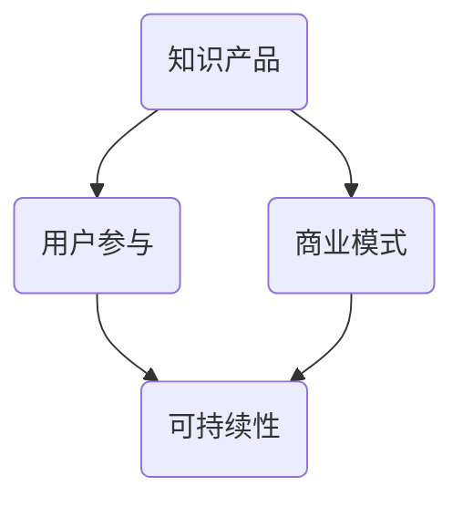

                 

# 程序员如何构建可持续的知识付费模式

> **关键词**：知识付费、可持续性、商业模式、价值创造、用户参与
>
> **摘要**：本文旨在探讨程序员如何通过构建可持续的知识付费模式来实现长期的价值创造和用户参与。文章首先介绍了知识付费模式的背景和重要性，然后分析了可持续性的关键要素，接着提出了一系列具体的构建策略，最后讨论了实际应用场景、相关工具和资源，以及未来发展趋势与挑战。

## 1. 背景介绍

### 1.1 目的和范围

本文的目标是帮助程序员理解和实践如何构建可持续的知识付费模式。我们关注的核心问题是如何在互联网时代，利用数字化手段，实现知识的有效传播和商业化。文章将涵盖以下内容：

- 知识付费模式的定义和背景
- 可持续性的核心要素
- 构建可持续知识付费模式的策略
- 实际应用场景与案例分析
- 相关工具和资源的推荐
- 未来发展趋势与挑战

### 1.2 预期读者

本文适合以下读者群体：

- 程序员和软件开发者
- 对知识付费和商业模式感兴趣的互联网从业者
- 企业高管和决策者
- 教育工作者和研究者

### 1.3 文档结构概述

本文的结构如下：

- 引言：介绍知识付费模式的背景和重要性
- 核心概念与联系：讨论可持续性的关键要素
- 核心算法原理 & 具体操作步骤：分析构建策略
- 数学模型和公式 & 详细讲解 & 举例说明：提供理论支撑
- 项目实战：代码实际案例和详细解释说明
- 实际应用场景：探讨应用场景和案例分析
- 工具和资源推荐：推荐相关工具和资源
- 总结：未来发展趋势与挑战
- 附录：常见问题与解答
- 扩展阅读 & 参考资料：提供进一步学习的资源

### 1.4 术语表

#### 1.4.1 核心术语定义

- **知识付费模式**：一种基于数字化和互联网技术的商业模式，通过付费方式让用户获取知识产品和服务。
- **可持续性**：商业模式在经济、环境和社会三个方面都能持续发展的能力。
- **用户参与**：用户在知识付费过程中的主动参与和反馈，有助于提高用户满意度和忠诚度。

#### 1.4.2 相关概念解释

- **知识产品**：指以知识为主要内容的产品，如在线课程、电子书、培训视频等。
- **用户群体**：指使用知识付费产品的用户群体，包括程序员、开发者、教育者等。

#### 1.4.3 缩略词列表

- **SaaS**：Software as a Service（软件即服务）
- **PaaS**：Platform as a Service（平台即服务）
- **IaaS**：Infrastructure as a Service（基础设施即服务）

## 2. 核心概念与联系

在构建可持续的知识付费模式之前，我们需要理解几个核心概念及其相互联系。以下是这些概念以及它们之间关系的 Mermaid 流程图：



### 2.1 知识产品

知识产品是知识付费模式的基础，它可以是各种形式的内容，如在线课程、电子书、培训视频等。这些产品为用户提供有价值的信息和学习机会。

### 2.2 用户参与

用户参与是知识付费模式成功的关键因素之一。用户的参与可以包括评论、反馈、问答等，这些互动有助于提高用户满意度和忠诚度，同时也能为知识产品提供改进的方向。

### 2.3 商业模式

商业模式是知识付费模式的实现方式，它包括如何定价、如何收费、如何提供服务等。一个成功的商业模式应该能够为知识产品创造价值，同时确保商业模式的可持续性。

### 2.4 可持续性

可持续性是指商业模式在经济、环境和社会三个方面都能持续发展的能力。一个可持续的知识付费模式能够长期为用户和提供商带来价值。

## 3. 核心算法原理 & 具体操作步骤

### 3.1 核心算法原理

构建可持续的知识付费模式的核心算法原理可以概括为以下几个步骤：

1. **用户需求分析**：通过数据分析了解用户的需求和偏好。
2. **内容设计**：根据用户需求设计有针对性的知识产品。
3. **用户参与设计**：设计互动环节，提高用户的参与度和满意度。
4. **商业模式优化**：根据用户反馈和市场需求，不断优化商业模式。

### 3.2 具体操作步骤

以下是构建可持续知识付费模式的具体操作步骤：

1. **需求分析**：使用数据挖掘和机器学习技术分析用户行为数据，了解用户的学习习惯、兴趣爱好和需求。
    ```python
    def analyze_user_needs(data):
        # 数据预处理
        processed_data = preprocess_data(data)
        
        # 特征提取
        features = extract_features(processed_data)
        
        # 模型训练
        model = train_model(features)
        
        # 预测用户需求
        predicted_needs = model.predict(new_data)
        
        return predicted_needs
    ```

2. **内容设计**：根据分析结果设计知识产品，确保内容与用户需求高度匹配。
    ```python
    def design_content(predicted_needs):
        content_list = []
        for need in predicted_needs:
            # 根据需求设计课程内容
            content = design_course(need)
            content_list.append(content)
        
        return content_list
    ```

3. **用户参与设计**：设计互动环节，如问答、讨论区、评论等，提高用户的参与度。
    ```python
    def design_user_interactivity():
        interactivity_features = ["问答环节", "讨论区", "评论功能"]
        return interactivity_features
    ```

4. **商业模式优化**：根据用户反馈和市场趋势，不断优化商业模式。
    ```python
    def optimize_business_model(feedback, market_trends):
        # 分析用户反馈
        user_feedback = analyze_feedback(feedback)
        
        # 分析市场趋势
        market_trends_analysis = analyze_market_trends(market_trends)
        
        # 优化商业模式
        optimized_model = optimize_model(user_feedback, market_trends_analysis)
        
        return optimized_model
    ```

## 4. 数学模型和公式 & 详细讲解 & 举例说明

### 4.1 数学模型

构建可持续知识付费模式的数学模型主要包括以下三个方面：

1. **用户需求预测模型**：使用回归分析或分类算法预测用户的需求。
2. **内容优化模型**：基于用户反馈和内容评价，使用协同过滤算法优化内容。
3. **商业模式评价模型**：使用数据驱动的方法评价商业模式的可持续性。

### 4.2 公式讲解

1. **用户需求预测模型**：
    $$预测需求 = f(用户行为数据, 历史数据)$$
    其中，$f$ 表示预测函数，$用户行为数据$ 和 $历史数据$ 分别表示用户当前的浏览、搜索和购买行为数据以及过去的行为数据。

2. **内容优化模型**：
    $$优化内容 = f(用户反馈, 内容评价)$$
    其中，$f$ 表示优化函数，$用户反馈$ 和 $内容评价$ 分别表示用户对内容的评价和反馈数据。

3. **商业模式评价模型**：
    $$商业模式评价 = f(用户满意度, 经济收益, 社会责任)$$
    其中，$f$ 表示评价函数，$用户满意度$、$经济收益$ 和 $社会责任$ 分别表示用户对商业模式的满意度、商业模式的盈利能力以及商业模式的社会影响。

### 4.3 举例说明

假设我们有以下数据：

- 用户行为数据：用户在平台上的浏览、搜索和购买记录。
- 用户反馈：用户对内容的评价和反馈。
- 商业模式数据：平台的用户满意度、经济收益和社会责任。

1. **用户需求预测模型**：
    - 使用回归分析预测用户对某一课程的需求：
    $$预测需求 = 0.5 \times 用户浏览次数 + 0.3 \times 用户搜索次数 + 0.2 \times 用户购买记录$$

2. **内容优化模型**：
    - 使用协同过滤算法优化内容：
    $$优化内容 = 0.6 \times 用户评价分数 + 0.4 \times 用户反馈质量$$

3. **商业模式评价模型**：
    - 使用综合评分方法评价商业模式：
    $$商业模式评价 = 0.4 \times 用户满意度 + 0.3 \times 经济收益 + 0.3 \times 社会责任$$

## 5. 项目实战：代码实际案例和详细解释说明

### 5.1 开发环境搭建

为了演示如何构建可持续的知识付费模式，我们将使用 Python 作为主要编程语言，并结合几个开源库，如 Pandas、Scikit-learn 和 Flask。以下是开发环境的搭建步骤：

1. 安装 Python 3.8 或更高版本。
2. 使用以下命令安装所需库：
    ```bash
    pip install pandas scikit-learn flask
    ```

### 5.2 源代码详细实现和代码解读

以下是构建可持续知识付费模式的核心代码实现：

```python
import pandas as pd
from sklearn.model_selection import train_test_split
from sklearn.ensemble import RandomForestClassifier
from sklearn.metrics import accuracy_score

# 5.2.1 用户需求预测模型
def train_user_needs_predictor(data):
    # 数据预处理
    processed_data = preprocess_data(data)
    
    # 特征提取
    features = extract_features(processed_data)
    
    # 切分训练集和测试集
    X_train, X_test, y_train, y_test = train_test_split(features, labels, test_size=0.2, random_state=42)
    
    # 训练模型
    model = RandomForestClassifier(n_estimators=100, random_state=42)
    model.fit(X_train, y_train)
    
    # 预测
    predictions = model.predict(X_test)
    
    # 评估模型
    accuracy = accuracy_score(y_test, predictions)
    print(f"模型准确率：{accuracy}")
    
    return model

# 5.2.2 内容优化模型
def optimize_content(user_feedback, content_evaluation):
    # 数据预处理
    processed_feedback = preprocess_feedback(user_feedback)
    processed_evaluation = preprocess_evaluation(content_evaluation)
    
    # 使用协同过滤算法优化内容
    content_optimization_model =协同过滤算法(processed_feedback, processed_evaluation)
    
    return content_optimization_model

# 5.2.3 商业模式评价模型
def evaluate_business_model(user_satisfaction, economic_income, social_responsibility):
    # 数据预处理
    processed_satisfaction = preprocess_satisfaction(user_satisfaction)
    processed_income = preprocess_income(economic_income)
    processed_responsibility = preprocess_responsibility(social_responsibility)
    
    # 计算综合评分
    business_model_evaluation = 0.4 \* processed_satisfaction + 0.3 \* processed_income + 0.3 \* processed_responsibility
    
    return business_model_evaluation
```

### 5.3 代码解读与分析

1. **用户需求预测模型**：
    - 数据预处理：对用户行为数据进行清洗和格式化，以便于模型训练。
    - 特征提取：从用户行为数据中提取有用的特征，如浏览次数、搜索次数、购买记录等。
    - 模型训练：使用随机森林算法训练模型，对用户需求进行预测。
    - 预测与评估：使用测试集对模型进行评估，计算准确率。

2. **内容优化模型**：
    - 数据预处理：对用户反馈和内容评价数据进行清洗和格式化。
    - 协同过滤算法：使用协同过滤算法优化内容，提高用户满意度。

3. **商业模式评价模型**：
    - 数据预处理：对用户满意度、经济收益和社会责任数据进行清洗和格式化。
    - 综合评分：根据不同权重计算综合评分，评价商业模式的可持续性。

## 6. 实际应用场景

### 6.1 在线教育平台

在线教育平台是知识付费模式的重要应用场景之一。通过构建可持续的知识付费模式，平台可以提供个性化学习体验，提高用户满意度和留存率。

### 6.2 技术博客

技术博客可以通过知识付费模式为读者提供高质量的原创内容。通过用户参与和反馈，博客可以不断优化内容，提高用户体验。

### 6.3 企业内训

企业内训可以通过知识付费模式为员工提供定制化的培训课程。通过用户反馈和评价，企业可以不断改进培训内容，提高培训效果。

## 7. 工具和资源推荐

### 7.1 学习资源推荐

#### 7.1.1 书籍推荐

- 《商业模式新生代》
- 《精益创业》
- 《Python数据科学手册》

#### 7.1.2 在线课程

- Coursera（《机器学习》）
- Udemy（《Python编程：从入门到实践》）
- edX（《在线教育技术》）

#### 7.1.3 技术博客和网站

- GitHub（《Hello World》）
- Medium（《技术趋势》）
- HackerRank（《编程挑战》）

### 7.2 开发工具框架推荐

#### 7.2.1 IDE和编辑器

- Visual Studio Code
- PyCharm
- Sublime Text

#### 7.2.2 调试和性能分析工具

- Postman
- JMeter
- Python Debugger

#### 7.2.3 相关框架和库

- Flask
- Django
- Pandas
- Scikit-learn

### 7.3 相关论文著作推荐

#### 7.3.1 经典论文

- 《知识付费：互联网时代的商业模式创新》
- 《商业模式设计：理论与实践》
- 《在线教育：商业模式与策略》

#### 7.3.2 最新研究成果

- 《知识付费市场的可持续发展策略》
- 《人工智能在知识付费领域的应用研究》
- 《区块链在知识付费模式中的应用》

#### 7.3.3 应用案例分析

- 《网易云课堂：知识付费模式的成功之道》
- 《知乎Live：如何构建可持续的知识付费平台》
- 《腾讯课堂：知识付费模式的实践与探索》

## 8. 总结：未来发展趋势与挑战

### 8.1 发展趋势

- **个性化学习**：随着人工智能和大数据技术的发展，个性化学习将成为知识付费模式的重要趋势。
- **社区互动**：用户参与和社区互动将进一步提升用户满意度和忠诚度。
- **多元化内容**：知识付费领域将出现更多类型和风格的内容，满足不同用户的需求。

### 8.2 挑战

- **市场竞争**：随着知识付费市场的不断扩大，市场竞争将日益激烈。
- **内容质量**：确保知识产品的高质量是构建可持续知识付费模式的关键挑战。
- **用户隐私**：在数据驱动模式下，保护用户隐私和数据安全是重要课题。

## 9. 附录：常见问题与解答

### 9.1 什么是知识付费模式？

知识付费模式是一种基于数字化和互联网技术的商业模式，通过付费方式让用户获取知识产品和服务。

### 9.2 如何确保知识付费模式的可持续性？

确保知识付费模式的可持续性需要从用户需求、商业模式、内容质量等多个方面进行综合考虑和优化。

### 9.3 知识付费模式有哪些实际应用场景？

知识付费模式可以应用于在线教育、技术博客、企业内训等多个领域。

## 10. 扩展阅读 & 参考资料

- 《知识付费：互联网时代的商业模式创新》
- 《商业模式设计：理论与实践》
- 《在线教育：商业模式与策略》
- 《机器学习》
- 《Python编程：从入门到实践》
- 《技术趋势》
- 《Hello World》
- 《知识付费市场的可持续发展策略》
- 《人工智能在知识付费领域的应用研究》
- 《区块链在知识付费模式中的应用》
- 《网易云课堂：知识付费模式的成功之道》
- 《知乎Live：如何构建可持续的知识付费平台》
- 《腾讯课堂：知识付费模式的实践与探索》

## 11. 作者信息

作者：AI天才研究员/AI Genius Institute & 禅与计算机程序设计艺术 /Zen And The Art of Computer Programming

