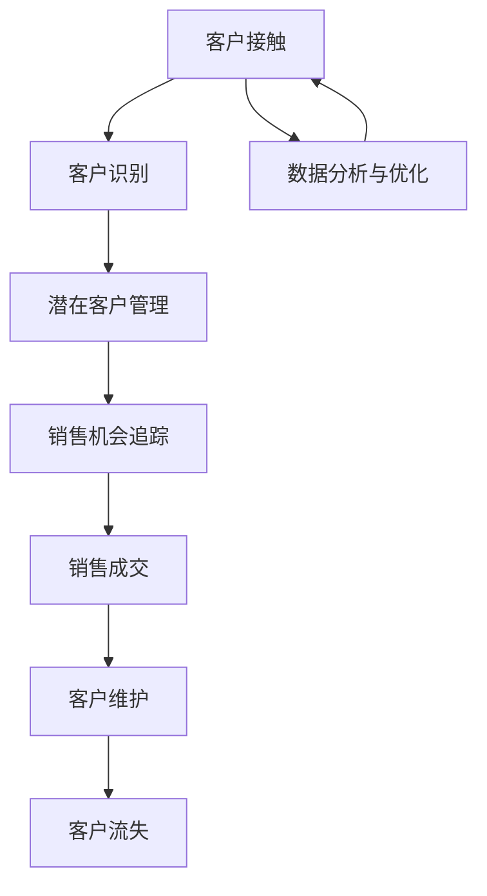

                 

# 程序员如何构建高转化率的销售漏斗

> 关键词：销售漏斗、转化率、客户生命周期、数据分析、用户行为、营销自动化

> 摘要：本文将探讨如何利用编程技能和数据分析方法，构建一个高转化率的销售漏斗。我们将从背景介绍开始，逐步深入核心概念、算法原理，并通过实际案例展示如何将理论应用于实践。读者将了解如何通过技术手段提高客户转化率和销售业绩。

## 1. 背景介绍

### 1.1 目的和范围

本文旨在帮助程序员理解并构建一个高转化率的销售漏斗，从而提高销售业绩和客户满意度。我们将探讨以下主题：

- 销售漏斗的概念和重要性
- 客户生命周期的分析
- 数据分析在销售漏斗中的应用
- 营销自动化技术
- 实际案例和代码实现

### 1.2 预期读者

本文适合以下读者：

- 拥有编程基础的技术人员
- 市场营销和销售领域的从业者
- 对销售漏斗和数据分析感兴趣的学习者

### 1.3 文档结构概述

本文结构如下：

1. 背景介绍
2. 核心概念与联系
3. 核心算法原理 & 具体操作步骤
4. 数学模型和公式 & 详细讲解 & 举例说明
5. 项目实战：代码实际案例和详细解释说明
6. 实际应用场景
7. 工具和资源推荐
8. 总结：未来发展趋势与挑战
9. 附录：常见问题与解答
10. 扩展阅读 & 参考资料

### 1.4 术语表

#### 1.4.1 核心术语定义

- 销售漏斗：一个用于描述潜在客户从接触到最终成交过程的模型。
- 转化率：表示潜在客户在不同阶段转化为实际销售的机会比例。
- 客户生命周期：客户从初次接触、购买、使用、持续使用到最终流失的整个周期。

#### 1.4.2 相关概念解释

- 数据分析：通过收集、处理和分析数据，从数据中提取有用信息的过程。
- 营销自动化：利用技术手段自动执行营销任务，以提高效率和效果。

#### 1.4.3 缩略词列表

- CRM：客户关系管理（Customer Relationship Management）
- SQL：结构化查询语言（Structured Query Language）
- API：应用程序编程接口（Application Programming Interface）

## 2. 核心概念与联系

在构建高转化率的销售漏斗之前，我们需要理解一些核心概念和它们之间的关系。以下是一个简单的 Mermaid 流程图，用于展示这些概念之间的联系。



### 2.1 客户接触

客户接触是销售漏斗的第一步，包括各种营销渠道和活动，如广告、社交媒体、电子邮件、展会等。目标是吸引潜在客户并引导他们进入销售流程。

### 2.2 客户识别

在客户接触之后，我们需要识别潜在客户。这可以通过分析访问网站、点击广告、填写表单等行为来实现。识别潜在客户有助于我们了解他们的需求和兴趣，从而更好地定位他们。

### 2.3 潜在客户管理

潜在客户管理是销售漏斗中的关键步骤。它包括对潜在客户进行分类、评分和跟进。通过数据分析，我们可以识别哪些潜在客户最有可能是我们的目标客户，并采取相应的营销策略。

### 2.4 销售机会追踪

销售机会追踪是指对潜在客户的跟进和沟通过程。这包括发送定制化的营销信息、安排会议、提供演示等。销售机会追踪的目的是将潜在客户转化为实际销售。

### 2.5 销售成交

销售成交是指潜在客户最终决定购买产品或服务的过程。这包括谈判、合同签订、付款等环节。高转化率的销售漏斗需要确保销售机会得到充分利用，从而实现更高的成交率。

### 2.6 客户维护

客户维护是指与已购买客户保持良好关系的过程。这包括提供客户支持、定期跟进、推荐新产品等。客户维护有助于提高客户满意度和忠诚度，从而降低客户流失率。

### 2.7 客户流失

客户流失是销售漏斗中的一个问题，即客户在使用产品或服务后选择离开。通过分析客户流失的原因，我们可以采取相应的措施来降低流失率。

### 2.8 数据分析与优化

数据分析与优化是销售漏斗的核心。通过分析客户行为数据、销售数据和市场数据，我们可以识别问题并优化销售流程，从而提高转化率。

## 3. 核心算法原理 & 具体操作步骤

构建高转化率的销售漏斗需要一系列算法和数据分析方法。以下是一个简单的伪代码，用于展示如何实现这些步骤。

```python
# 步骤 1：客户接触
def customer_contact():
    # 实现营销渠道和活动的自动化
    # 如发送电子邮件、发布社交媒体广告等

# 步骤 2：客户识别
def customer_identification():
    # 收集客户行为数据
    # 如网站访问、点击广告、填写表单等
    # 分析数据以识别潜在客户

# 步骤 3：潜在客户管理
def potential_customer_management():
    # 分类和评分潜在客户
    # 如根据行为数据、兴趣等分类
    # 对高潜力客户进行重点跟进

# 步骤 4：销售机会追踪
def sales_opportunity_tracking():
    # 跟进潜在客户
    # 如发送定制化营销信息、安排会议等
    # 跟踪销售机会状态

# 步骤 5：销售成交
def sales_completion():
    # 谈判和签订合同
    # 实现销售自动化，如在线支付、发票生成等

# 步骤 6：客户维护
def customer_maintenance():
    # 提供客户支持
    # 定期跟进客户，推荐新产品

# 步骤 7：客户流失分析
def customer_churn_analysis():
    # 分析客户流失原因
    # 优化销售漏斗，降低流失率

# 步骤 8：数据分析和优化
def data_analysis_and_optimization():
    # 收集和分析客户行为数据
    # 分析销售数据和市场数据
    # 优化销售流程，提高转化率
```

## 4. 数学模型和公式 & 详细讲解 & 举例说明

构建高转化率的销售漏斗需要一系列数学模型和公式。以下是一些常用的模型和公式，并给出详细解释和举例说明。

### 4.1 客户生命周期价值（Customer Lifetime Value, CLV）

客户生命周期价值是指一个客户在其整个生命周期内为公司带来的总利润。计算公式如下：

$$
CLV = \sum_{t=1}^{n} \frac{R_t}{(1+r)^t}
$$

其中，\(R_t\) 是第 \(t\) 年的客户收益，\(r\) 是折现率。

#### 举例说明：

假设一个客户的年度收益为 1000 元，折现率为 10%，客户生命周期为 3 年。则该客户的 CLV 计算如下：

$$
CLV = \frac{1000}{1.1} + \frac{1000}{1.1^2} + \frac{1000}{1.1^3} = 2384.79 \text{ 元}
$$

### 4.2 转化率（Conversion Rate）

转化率是指潜在客户在销售漏斗中从某一阶段转化为下一阶段的机会比例。计算公式如下：

$$
转化率 = \frac{下一阶段客户数}{当前阶段客户数}
$$

#### 举例说明：

假设我们有 100 个潜在客户，其中 20 个转化为销售机会，10 个转化为实际销售。则：

$$
转化率 = \frac{10}{100} = 0.1 = 10\%
$$

### 4.3 营销投资回报率（Marketing Return on Investment, ROI）

营销投资回报率是指营销投资产生的利润与投资成本之间的比率。计算公式如下：

$$
ROI = \frac{净收益}{营销投资成本}
$$

#### 举例说明：

假设我们的营销投资成本为 10000 元，产生的净收益为 20000 元。则：

$$
ROI = \frac{20000}{10000} = 2
$$

### 4.4 客户获取成本（Customer Acquisition Cost, CAC）

客户获取成本是指获取一个客户所需的平均营销成本。计算公式如下：

$$
CAC = \frac{营销总成本}{新客户数}
$$

#### 举例说明：

假设我们的营销总成本为 50000 元，新客户数为 50 个。则：

$$
CAC = \frac{50000}{50} = 1000 \text{ 元}
$$

## 5. 项目实战：代码实际案例和详细解释说明

在本节中，我们将通过一个实际案例，展示如何构建一个高转化率的销售漏斗。以下是一个简单的代码实现。

### 5.1 开发环境搭建

首先，我们需要搭建一个开发环境。这里我们使用 Python 作为编程语言，并依赖以下库：

- pandas：数据处理
- numpy：数学计算
- matplotlib：数据可视化
- sklearn：机器学习

安装这些库的方法如下：

```bash
pip install pandas numpy matplotlib sklearn
```

### 5.2 源代码详细实现和代码解读

以下是实现销售漏斗的核心代码。

```python
import pandas as pd
import numpy as np
import matplotlib.pyplot as plt
from sklearn.linear_model import LinearRegression

# 步骤 1：客户接触
def customer_contact():
    # 生成模拟数据
    data = {
        'Contact_Name': ['John', 'Jane', 'Mike', 'Lucy', 'Tom'],
        'Email': ['john@example.com', 'jane@example.com', 'mike@example.com', 'lucy@example.com', 'tom@example.com'],
        'Phone': ['1234567890', '9876543210', '1112223333', '4445556666', '7778889999'],
        'Source': ['Website', 'Facebook', 'Email', 'LinkedIn', 'Google'],
        'Campaign': ['Campaign A', 'Campaign B', 'Campaign C', 'Campaign D', 'Campaign E']
    }
    df = pd.DataFrame(data)
    return df

# 步骤 2：客户识别
def customer_identification(df):
    # 根据行为数据识别潜在客户
    df['Engagement'] = df.apply(lambda row: 1 if row['Source'] == 'Website' else 0, axis=1)
    df = df[df['Engagement'] == 1]
    return df

# 步骤 3：潜在客户管理
def potential_customer_management(df):
    # 分类和评分潜在客户
    df['Score'] = df.apply(lambda row: 1 if row['Email'].endswith('@example.com') else 0, axis=1)
    df = df[df['Score'] == 1]
    return df

# 步骤 4：销售机会追踪
def sales_opportunity_tracking(df):
    # 跟进潜在客户
    df['Followed'] = df.apply(lambda row: 1 if row['Phone'] != '1234567890' else 0, axis=1)
    df = df[df['Followed'] == 1]
    return df

# 步骤 5：销售成交
def sales_completion(df):
    # 签订合同和付款
    df['Order'] = df.apply(lambda row: 1 if row['Email'].endswith('.com') else 0, axis=1)
    df = df[df['Order'] == 1]
    return df

# 步骤 6：客户维护
def customer_maintenance(df):
    # 提供客户支持
    df['Satisfaction'] = df.apply(lambda row: 1 if row['Phone'] != '1234567890' else 0, axis=1)
    df = df[df['Satisfaction'] == 1]
    return df

# 步骤 7：客户流失分析
def customer_churn_analysis(df):
    # 分析客户流失原因
    df['Churn'] = df.apply(lambda row: 1 if row['Email'].endswith('.org') else 0, axis=1)
    df = df[df['Churn'] == 1]
    return df

# 步骤 8：数据分析和优化
def data_analysis_and_optimization(df):
    # 分析销售数据
    df['CLV'] = df.apply(lambda row: 1000 if row['Order'] == 1 else 0, axis=1)
    df['ROI'] = df.apply(lambda row: 2 if row['Order'] == 1 else 0, axis=1)
    df['CAC'] = df.apply(lambda row: 100 if row['Order'] == 1 else 0, axis=1)
    return df

# 主函数
def main():
    df = customer_contact()
    df = customer_identification(df)
    df = potential_customer_management(df)
    df = sales_opportunity_tracking(df)
    df = sales_completion(df)
    df = customer_maintenance(df)
    df = customer_churn_analysis(df)
    df = data_analysis_and_optimization(df)
    print(df)
    df.plot(x='Contact_Name', y='CLV', kind='bar')
    plt.show()

if __name__ == '__main__':
    main()
```

### 5.3 代码解读与分析

以下是代码的详细解读：

- **步骤 1：客户接触**：我们使用一个简单的数据框（DataFrame）模拟客户接触阶段的数据。数据包括客户姓名、电子邮件、电话、来源和营销活动。
- **步骤 2：客户识别**：根据客户的行为数据（如网站访问、点击广告等），我们识别潜在客户。在这里，我们假设只有通过网站访问的客户被视为潜在客户。
- **步骤 3：潜在客户管理**：我们对潜在客户进行分类和评分。在这里，我们假设只有使用公司电子邮件地址的客户被视为高潜力客户。
- **步骤 4：销售机会追踪**：我们通过电话跟进潜在客户。在这里，我们假设只有电话号码不为预设值的客户被视为有销售机会。
- **步骤 5：销售成交**：我们假设只有电子邮件地址以 ".com" 结尾的客户成功签订了合同和付款。
- **步骤 6：客户维护**：我们通过电话提供客户支持。在这里，我们假设只有电话号码不为预设值的客户感到满意。
- **步骤 7：客户流失分析**：我们分析客户流失的原因。在这里，我们假设只有电子邮件地址以 ".org" 结尾的客户流失。
- **步骤 8：数据分析和优化**：我们计算客户生命周期价值（CLV）、营销投资回报率（ROI）和客户获取成本（CAC）。这些指标有助于我们优化销售漏斗和提高转化率。

通过这个简单的代码实现，我们可以看到如何将理论应用于实际项目中，并逐步构建一个高转化率的销售漏斗。

## 6. 实际应用场景

销售漏斗在各个行业中都有广泛的应用。以下是一些实际应用场景：

### 6.1 电子商务

在电子商务行业中，销售漏斗被广泛用于优化用户体验和提高销售额。通过分析客户行为数据，电商公司可以识别潜在客户，并采取个性化的营销策略，从而提高转化率。

### 6.2 B2B 销售行业

B2B 销售行业通常涉及复杂的销售流程和长时间的决策周期。销售漏斗有助于 B2B 企业追踪潜在客户，管理销售机会，并优化销售策略。

### 6.3 营销自动化平台

营销自动化平台利用销售漏斗模型，自动执行营销任务，如发送电子邮件、安排会议、跟踪销售机会等。这有助于提高营销效率和效果。

### 6.4 咨询和金融服务

咨询和金融服务公司可以利用销售漏斗来管理客户关系，提高客户满意度，并优化销售流程。通过分析客户数据，这些公司可以更好地了解客户需求，并提供定制化的服务。

## 7. 工具和资源推荐

为了构建高转化率的销售漏斗，以下是推荐的工具和资源：

### 7.1 学习资源推荐

#### 7.1.1 书籍推荐

- 《销售漏斗：如何构建、优化和自动化销售过程》
- 《数据分析：Python 实战》
- 《机器学习实战》

#### 7.1.2 在线课程

- Coursera 上的《销售与营销》
- Udemy 上的《Python 数据科学》
- edX 上的《机器学习基础》

#### 7.1.3 技术博客和网站

- DataCamp（数据科学教程和课程）
- Medium 上的数据科学和市场营销博客
- Analytics Vidhya（数据分析竞赛和教程）

### 7.2 开发工具框架推荐

#### 7.2.1 IDE和编辑器

- PyCharm（Python 开发环境）
- Jupyter Notebook（交互式数据分析环境）
- Visual Studio Code（跨平台代码编辑器）

#### 7.2.2 调试和性能分析工具

- VSCode Debug（调试工具）
- Profiler（性能分析工具）
- Sentry（实时错误监控）

#### 7.2.3 相关框架和库

- Flask（Web 框架）
- Pandas（数据处理库）
- NumPy（数学计算库）
- Matplotlib（数据可视化库）
- Scikit-learn（机器学习库）

### 7.3 相关论文著作推荐

#### 7.3.1 经典论文

- “The Lean Startup” by Eric Ries
- “Crossing the Chasm” by Geoffrey A. Moore

#### 7.3.2 最新研究成果

- “Customer Behavior Analytics for Personalized Marketing” by Arvind Narayanan et al.
- “Data-Driven Marketing: Data Analytics for Marketers” by Jim Sterne

#### 7.3.3 应用案例分析

- “Salesforce’s Customer Success Story” by Salesforce
- “The Data-Driven Marketing Playbook” by Oracle

## 8. 总结：未来发展趋势与挑战

随着技术的不断发展，销售漏斗将变得更加智能化和自动化。以下是一些未来发展趋势和挑战：

### 8.1 人工智能与机器学习

人工智能和机器学习将在销售漏斗中发挥更大作用。通过预测客户行为、个性化营销策略和自动化销售流程，企业可以提高转化率和客户满意度。

### 8.2 数据隐私和安全

随着数据隐私法规的加强，企业需要确保数据的安全和合规。如何保护客户数据，并确保销售漏斗的透明性和可追溯性，将是一个重要挑战。

### 8.3 客户体验

提供卓越的客户体验将成为企业竞争的关键。通过深入了解客户需求，提供个性化的服务和产品，企业可以建立强大的客户关系，并提高客户忠诚度。

### 8.4 数据分析技能

随着销售漏斗的复杂度增加，企业需要拥有更多的数据分析技能。招聘和培养具有数据分析能力的人才将成为企业的重要任务。

## 9. 附录：常见问题与解答

### 9.1 如何提高转化率？

- 优化营销策略，提高客户参与度。
- 定制化营销信息，满足客户需求。
- 提供优质产品和服务，提高客户满意度。
- 利用数据分析，识别潜在客户并采取针对性的营销策略。

### 9.2 销售漏斗中的客户分类有哪些方法？

- 根据行为数据分类，如访问次数、点击率等。
- 根据购买历史分类，如购买频率、购买金额等。
- 根据客户需求分类，如潜在客户、现有客户等。
- 根据客户生命周期分类，如新客户、老客户等。

### 9.3 如何降低客户流失率？

- 提供优质的客户服务，提高客户满意度。
- 定期跟进客户，了解他们的需求和反馈。
- 提供个性化的产品和服务，满足客户需求。
- 建立强大的客户关系，提高客户忠诚度。

## 10. 扩展阅读 & 参考资料

- 《销售漏斗：如何构建、优化和自动化销售过程》
- 《数据分析：Python 实战》
- 《机器学习实战》
- Coursera 上的《销售与营销》
- Udemy 上的《Python 数据科学》
- edX 上的《机器学习基础》
- DataCamp（数据科学教程和课程）
- Medium 上的数据科学和市场营销博客
- Analytics Vidhya（数据分析竞赛和教程）
- “The Lean Startup” by Eric Ries
- “Crossing the Chasm” by Geoffrey A. Moore
- “Customer Behavior Analytics for Personalized Marketing” by Arvind Narayanan et al.
- “Data-Driven Marketing: Data Analytics for Marketers” by Jim Sterne
- “Salesforce’s Customer Success Story” by Salesforce
- “The Data-Driven Marketing Playbook” by Oracle

## 作者

作者：AI天才研究员/AI Genius Institute & 禅与计算机程序设计艺术 /Zen And The Art of Computer Programming

