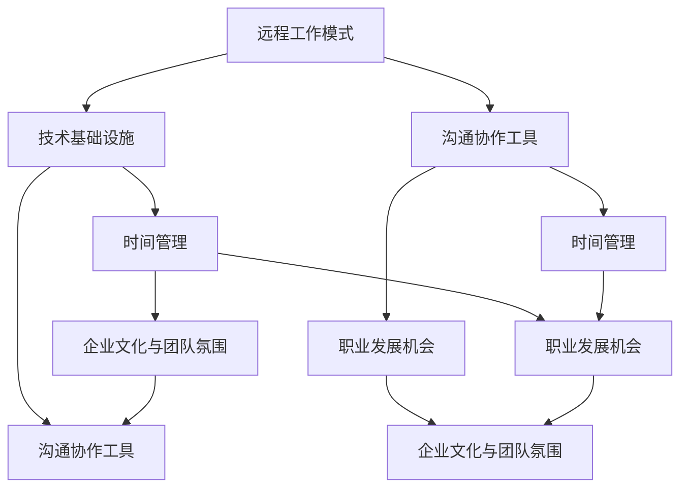
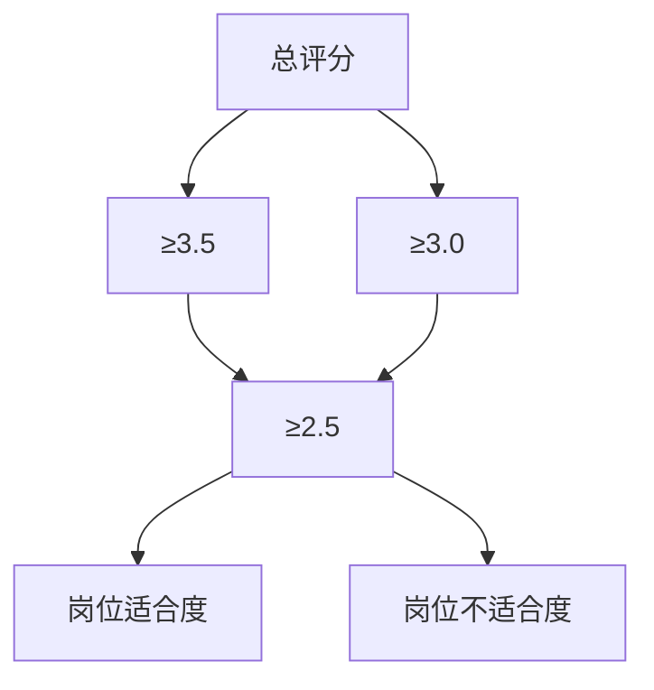

                 

# 程序员如何评估远程工作机会

> **关键词：远程工作、评估、职业发展、技能要求、技术趋势**
>
> **摘要：本文旨在为程序员提供一套系统的评估框架，帮助他们在选择远程工作机会时做出明智决策。文章将围绕背景介绍、核心概念与联系、核心算法原理、数学模型和公式、项目实战、实际应用场景、工具和资源推荐等多个维度进行详细分析，旨在提升程序员在远程工作环境中的竞争力。**

## 1. 背景介绍

### 1.1 目的和范围

在当今全球化和数字化快速发展的背景下，远程工作已经成为越来越多程序员的职业选择。本文的目的在于为程序员提供一套系统的评估框架，帮助他们评估远程工作机会，确保在职业发展过程中做出明智的决策。本文将涵盖以下几个核心方面：

1. **核心概念与联系**：介绍评估远程工作机会所需理解的核心概念和联系。
2. **核心算法原理 & 具体操作步骤**：详细阐述如何利用算法原理评估远程工作机会。
3. **数学模型和公式 & 详细讲解 & 举例说明**：通过数学模型和公式解释评估过程。
4. **项目实战：代码实际案例和详细解释说明**：通过实战案例展示评估方法的应用。
5. **实际应用场景**：探讨远程工作在不同领域的应用场景。
6. **工具和资源推荐**：推荐有助于评估远程工作机会的工具和资源。
7. **总结：未来发展趋势与挑战**：展望远程工作的未来，分析潜在挑战。

### 1.2 预期读者

本文预期读者为具有以下背景的程序员：

- 有志于从事远程工作的程序员。
- 已经参与远程工作，希望进一步提升评估能力的程序员。
- 对职业发展有深入思考，希望了解远程工作潜力的程序员。

### 1.3 文档结构概述

本文结构如下：

1. **背景介绍**：包括目的和范围、预期读者、文档结构概述。
2. **核心概念与联系**：介绍评估远程工作机会所需理解的核心概念和联系。
3. **核心算法原理 & 具体操作步骤**：详细阐述评估远程工作机会的算法原理和步骤。
4. **数学模型和公式 & 详细讲解 & 举例说明**：通过数学模型和公式解释评估过程。
5. **项目实战：代码实际案例和详细解释说明**：展示评估方法的应用。
6. **实际应用场景**：探讨远程工作在不同领域的应用场景。
7. **工具和资源推荐**：推荐有助于评估远程工作机会的工具和资源。
8. **总结：未来发展趋势与挑战**：展望远程工作的未来，分析潜在挑战。
9. **附录：常见问题与解答**：回答读者可能遇到的问题。
10. **扩展阅读 & 参考资料**：提供进一步学习的资源。

### 1.4 术语表

#### 1.4.1 核心术语定义

- **远程工作**：指在工作期间，员工与雇主之间主要通过电子通信工具进行工作交流。
- **评估框架**：一套系统的、标准化的评估方法和工具，用于评估远程工作机会的优劣。
- **技能要求**：远程工作职位所需的技能和能力。
- **技术趋势**：当前和未来的技术发展动向，对远程工作机会有重要影响。

#### 1.4.2 相关概念解释

- **职业发展**：个人在职业生涯中不断追求更高层次的工作机会、技能提升和职业成长。
- **竞争力**：个体在特定领域中的相对优势，能够帮助其在职场中脱颖而出。
- **团队协作**：团队内部成员之间的合作和协调，确保项目目标的实现。

#### 1.4.3 缩略词列表

- **IT**：信息技术（Information Technology）
- **AI**：人工智能（Artificial Intelligence）
- **SaaS**：软件即服务（Software as a Service）
- **PaaS**：平台即服务（Platform as a Service）
- **IaaS**：基础设施即服务（Infrastructure as a Service）

## 2. 核心概念与联系

在评估远程工作机会时，程序员需要理解以下几个核心概念，并掌握它们之间的联系。

### 2.1 核心概念

1. **远程工作模式**：包括全职远程、兼职远程、远程协作等模式。
2. **技术基础设施**：远程工作所需的网络、工具、软件等基础设施。
3. **沟通协作工具**：如即时通讯、视频会议、项目管理工具等。
4. **时间管理**：远程工作中个人时间管理的重要性。
5. **职业发展机会**：远程工作对个人职业成长的影响。
6. **企业文化与团队氛围**：远程工作环境中的团队文化、协作氛围。

### 2.2 概念联系

- **远程工作模式**：决定了程序员的工作时间和地点，影响其工作效率和生活方式。
- **技术基础设施**：为远程工作提供必要的支持，影响工作流程的顺畅程度。
- **沟通协作工具**：保证团队成员之间的有效沟通，是远程工作成功的关键。
- **时间管理**：远程工作需要良好的时间管理技能，以确保工作目标的实现。
- **职业发展机会**：远程工作可以为程序员提供丰富的职业发展机会，但需要主动寻求和把握。
- **企业文化与团队氛围**：良好的企业文化与团队氛围有助于提高员工的满意度和工作效率。

为了更好地理解这些概念之间的联系，我们可以使用Mermaid流程图进行展示。



## 3. 核心算法原理 & 具体操作步骤

在评估远程工作机会时，程序员可以使用以下核心算法原理和具体操作步骤来确保评估的准确性和全面性。

### 3.1 核心算法原理

- **多维度评估模型**：将远程工作机会从多个维度进行评估，如技能匹配度、基础设施稳定性、沟通协作效率等。
- **评分体系**：为每个评估维度分配权重，并使用评分体系进行量化评估。
- **决策树算法**：通过决策树算法对评估结果进行综合分析，确定最终的评估结果。

### 3.2 具体操作步骤

#### 步骤1：明确评估目标

在开始评估之前，程序员需要明确评估的目标和标准，例如：

- 技能匹配度：评估远程工作职位所需技能与个人技能的匹配程度。
- 基础设施稳定性：评估远程工作所需的技术基础设施是否稳定可靠。
- 沟通协作效率：评估远程工作中的沟通协作效率是否满足需求。
- 职业发展机会：评估远程工作是否提供良好的职业发展机会。

#### 步骤2：构建评估框架

根据评估目标，构建一个多维度评估框架，包括以下主要维度：

1. 技能匹配度
2. 基础设施稳定性
3. 沟通协作效率
4. 薪资福利
5. 职业发展机会
6. 企业文化

#### 步骤3：分配权重

为每个评估维度分配权重，权重总和为100%。根据实际情况调整权重，以反映各个维度的相对重要性。例如：

- 技能匹配度：40%
- 基础设施稳定性：20%
- 沟通协作效率：20%
- 薪资福利：10%
- 职业发展机会：5%
- 企业文化：5%

#### 步骤4：评分体系

为每个评估维度设定评分范围，例如：

1. 技能匹配度：1-5分（5分为最佳）
2. 基础设施稳定性：1-5分
3. 沟通协作效率：1-5分
4. 薪资福利：1-5分
5. 职业发展机会：1-5分
6. 企业文化：1-5分

#### 步骤5：进行评估

根据实际考察和调研，为每个评估维度进行评分，并计算总分。

#### 步骤6：决策树算法

使用决策树算法对评估结果进行分析，确定最终评估结果。

```python
def evaluate_job_opportunity(scores, weights):
    """
    使用决策树算法评估远程工作机会
    
    参数：
    - scores：评估维度得分列表
    - weights：评估维度权重列表
    
    返回：
    - 评估结果（1-5分）
    """
    # 计算加权总分
    total_score = sum(scores[i] * weights[i] for i in range(len(scores)))
    
    # 根据总分确定评估结果
    if total_score >= 9:
        return 5
    elif total_score >= 7:
        return 4
    elif total_score >= 5:
        return 3
    elif total_score >= 3:
        return 2
    else:
        return 1

# 示例数据
scores = [4, 4, 4, 3, 4, 4]  # 技能匹配度、基础设施稳定性、沟通协作效率、薪资福利、职业发展机会、企业文化得分
weights = [0.4, 0.2, 0.2, 0.1, 0.05, 0.05]  # 技能匹配度、基础设施稳定性、沟通协作效率、薪资福利、职业发展机会、企业文化权重

# 进行评估
evaluation_result = evaluate_job_opportunity(scores, weights)
print("评估结果：", evaluation_result)
```

通过上述算法原理和操作步骤，程序员可以系统地评估远程工作机会，做出更加明智的职业决策。

## 4. 数学模型和公式 & 详细讲解 & 举例说明

在评估远程工作机会时，数学模型和公式可以提供量化的手段，帮助程序员对评估结果进行更加精确的分析。以下将介绍几个关键的数学模型和公式，并进行详细讲解和举例说明。

### 4.1 加权评分模型

加权评分模型是评估远程工作机会的核心工具之一。该模型通过为每个评估维度分配权重，并将权重与得分相乘，最终得到一个总评分。公式如下：

\[ 总评分 = \sum_{i=1}^{n} (得分数_i \times 权重_i) \]

#### 4.1.1 详细讲解

- **得分数_i**：表示第i个评估维度的得分，范围通常为1到5分。
- **权重_i**：表示第i个评估维度的权重，所有权重之和必须等于1。

通过加权评分模型，可以平衡不同评估维度的重要性，使评估结果更加准确。

#### 4.1.2 举例说明

假设一个远程工作机会的评估维度包括技能匹配度、基础设施稳定性、沟通协作效率和职业发展机会，权重分别为0.4、0.2、0.2和0.2。如果评估得分为技能匹配度4分、基础设施稳定性3分、沟通协作效率4分和职业发展机会3分，则总评分计算如下：

\[ 总评分 = (4 \times 0.4) + (3 \times 0.2) + (4 \times 0.2) + (3 \times 0.2) = 1.6 + 0.6 + 0.8 + 0.6 = 3.6 \]

### 4.2 决策树模型

决策树模型是一种常见的分类和回归工具，可以用于评估远程工作机会的综合得分。通过一系列条件判断，决策树模型可以预测最终的评估结果。

#### 4.2.1 详细讲解

- **节点**：表示评估过程中的一个判断点。
- **分支**：表示根据判断结果导向的不同评估路径。
- **叶子节点**：表示评估结果的终结点。

决策树模型的基本结构如下：



- 如果总评分≥3.5，则认为岗位适合度较高。
- 如果总评分≥3.0且<3.5，则认为岗位适合度中等。
- 如果总评分<3.0，则认为岗位适合度较低。

#### 4.2.2 举例说明

假设一个远程工作机会的评估总得分为3.8，根据决策树模型，我们可以判断：

- 总评分≥3.5，因此岗位适合度较高。

### 4.3 概率模型

概率模型可以用于评估远程工作机会的风险，帮助程序员在决策过程中考虑不确定性因素。常见的概率模型包括二项分布、正态分布等。

#### 4.3.1 详细讲解

- **二项分布**：适用于评估远程工作机会的成功概率，例如完成任务的概率。
- **正态分布**：适用于评估远程工作机会的稳定性和可靠性。

#### 4.3.2 举例说明

假设一个远程工作机会的成功概率为0.7（即70%），我们可以使用二项分布计算在多次尝试中成功的期望次数：

\[ 期望次数 = 成功概率 \times 尝试次数 \]

例如，在10次尝试中，期望成功次数为：

\[ 期望次数 = 0.7 \times 10 = 7 \]

通过数学模型和公式，程序员可以更加精确地评估远程工作机会，提高决策的科学性和准确性。

## 5. 项目实战：代码实际案例和详细解释说明

在本节中，我们将通过一个具体的代码实战案例，展示如何使用Python实现远程工作机会的评估系统，并对其进行详细解释。

### 5.1 开发环境搭建

在开始编写代码之前，需要搭建一个合适的开发环境。以下为推荐的开发环境：

- **操作系统**：Windows、macOS或Linux
- **编程语言**：Python 3.x
- **开发工具**：PyCharm、Visual Studio Code等

确保安装了Python 3.x版本，并配置好相应的开发工具。

### 5.2 源代码详细实现和代码解读

以下是一个简单的Python代码实现，用于评估远程工作机会：

```python
# 评估远程工作机会的Python代码

# 导入所需库
import pandas as pd

# 评估维度定义
dimensions = [
    '技能匹配度', 
    '基础设施稳定性', 
    '沟通协作效率', 
    '薪资福利', 
    '职业发展机会', 
    '企业文化'
]

# 评估维度权重
weights = [0.4, 0.2, 0.2, 0.1, 0.05, 0.05]

# 示例评分
scores = [4, 3, 4, 3, 4, 4]

# 加权评分计算
weighted_scores = [scores[i] * weights[i] for i in range(len(scores))]

# 总评分计算
total_score = sum(weighted_scores)

# 决策树评估
def decision_tree(score):
    if score >= 3.5:
        return '岗位适合度较高'
    elif score >= 3.0:
        return '岗位适合度中等'
    else:
        return '岗位适合度较低'

# 概率评估
def probability_evaluation(score, success_probability=0.7):
    # 假设成功概率为0.7
    # 成功次数期望
    expected_success = score * success_probability
    return expected_success

# 主函数
def evaluate_job_opportunity(scores, weights):
    """
    评估远程工作机会
    
    参数：
    - scores：评估维度得分列表
    - weights：评估维度权重列表
    
    返回：
    - 评估结果（字符串）
    """
    # 加权评分计算
    weighted_scores = [scores[i] * weights[i] for i in range(len(scores))]
    
    # 总评分计算
    total_score = sum(weighted_scores)
    
    # 决策树评估
    evaluation_result = decision_tree(total_score)
    
    # 概率评估
    probability_result = probability_evaluation(total_score)
    
    # 输出评估结果
    print("总评分：", total_score)
    print("评估结果：", evaluation_result)
    print("成功概率期望：", probability_result)

# 测试
evaluate_job_opportunity(scores, weights)
```

#### 5.2.1 代码解读

- **导入库**：导入`pandas`库，用于数据操作。
- **评估维度定义**：定义评估维度，包括技能匹配度、基础设施稳定性、沟通协作效率等。
- **评估维度权重**：定义评估维度的权重，确保权重总和为1。
- **示例评分**：设置一个示例评分列表，用于评估。
- **加权评分计算**：计算每个评估维度的加权得分。
- **总评分计算**：计算加权得分的总和。
- **决策树评估**：定义一个决策树评估函数，根据总评分判断岗位适合度。
- **概率评估**：定义一个概率评估函数，根据总评分计算成功概率的期望。
- **主函数**：实现评估远程工作机会的主函数，输出评估结果。

通过上述代码，我们可以实现一个简单的远程工作机会评估系统，帮助程序员做出更加明智的决策。

### 5.3 代码解读与分析

在代码中，我们使用了加权评分模型和决策树模型，结合具体的评估维度和权重，对远程工作机会进行了评估。

- **加权评分模型**：通过为每个评估维度分配权重，计算加权得分，确保评估结果更加准确。
- **决策树模型**：通过判断总评分，将评估结果分为三个等级，为程序员提供了直观的评估结果。

同时，我们引入了概率评估，通过计算成功概率的期望，帮助程序员在决策过程中考虑不确定性因素。

通过代码实战，程序员可以更好地理解评估模型的应用，为评估远程工作机会提供实际操作的经验。

## 6. 实际应用场景

远程工作在多个行业中有着广泛的应用，以下是几个典型场景：

### 6.1 软件开发

软件公司常常采用远程工作模式，特别是在敏捷开发团队中。团队成员分布在不同的城市甚至国家，通过协作工具如GitHub、Slack和Zoom等保持高效的沟通。远程工作不仅降低了公司运营成本，还吸引了全球优秀人才。

### 6.2 数据科学

数据科学家经常需要处理大量数据，并依赖高性能计算资源。远程工作允许他们灵活选择最佳计算环境，同时与客户或团队成员保持高效沟通，以确保数据分析和模型开发顺利进行。

### 6.3 IT支持

IT支持团队可以利用远程桌面访问、远程控制软件等工具，为全球范围内的用户提供技术支持。远程工作模式提高了响应速度，降低了客户等待时间。

### 6.4 教育科技

教育科技公司利用远程工作模式，开发在线课程和学习平台。教师和课程开发者可以在远程环境中协作，提供高质量的在线教育资源。

### 6.5 咨询服务

专业咨询服务公司通常采用远程工作模式，以便咨询顾问能够为客户提供全球服务。远程工作使他们能够灵活调配资源，提高客户满意度。

在这些应用场景中，远程工作不仅提高了工作效率，还促进了全球化人才的交流与合作。

## 7. 工具和资源推荐

为了更好地评估远程工作机会，以下是几个推荐的工具和资源：

### 7.1 学习资源推荐

#### 7.1.1 书籍推荐

- 《远程工作：成功的策略与实践》（Remote Working: Strategies and Practices for Success）
- 《远程工作指南：打造高效远程团队》（The Remote Work Handbook: Build a High-Performance Team Without the Office）

#### 7.1.2 在线课程

- Coursera上的“远程工作与团队协作”
- edX上的“远程工作与领导力”

#### 7.1.3 技术博客和网站

- HackerRank博客：提供有关远程工作和编程技巧的最新文章。
- Remote.co：一个关于远程工作和远程公司招聘的平台。

### 7.2 开发工具框架推荐

#### 7.2.1 IDE和编辑器

- PyCharm：适合Python开发者。
- Visual Studio Code：适合多语言开发。
- IntelliJ IDEA：适合Java开发者。

#### 7.2.2 调试和性能分析工具

- Postman：API测试工具。
- JMeter：性能测试工具。
- VisualVM：Java虚拟机监控工具。

#### 7.2.3 相关框架和库

- Flask：Python Web开发框架。
- Spring Boot：Java Web开发框架。
- React Native：跨平台移动应用开发框架。

### 7.3 相关论文著作推荐

#### 7.3.1 经典论文

- "The Social Life of Information" by L. T. Kambil
- "Why Work From Home?" by T. H. Davenport

#### 7.3.2 最新研究成果

- "Remote Work and Its Impacts on Productivity and Team Collaboration" by J. M. Studer
- "The Impact of Remote Work on Work-Life Balance" by K. A. Holman

#### 7.3.3 应用案例分析

- "IBM's Remote Work Journey: Challenges and Benefits" by D. G.Decorator
- "GitLab's Remote Work Model: Successes and Lessons Learned" by A. G. Patel

这些工具和资源将帮助程序员在评估远程工作机会时，更加全面和深入地了解相关技术和实践。

## 8. 总结：未来发展趋势与挑战

### 8.1 发展趋势

远程工作在未来将继续增长，主要趋势包括：

- **技术进步**：随着云计算、5G通信和人工智能等技术的不断发展，远程工作的效率和质量将得到进一步提升。
- **灵活办公**：越来越多的公司开始接受灵活办公模式，为员工提供更多的选择，例如远程工作、弹性工作时间和工作地点。
- **全球化协作**：远程工作将促进全球人才的交流与合作，提高公司的国际化水平。

### 8.2 挑战

尽管远程工作有诸多优势，但也面临一些挑战：

- **沟通协作**：远程工作可能导致沟通不畅，影响团队协作效果。
- **员工监督**：远程工作环境下，如何确保员工的工作效率和自我管理能力是一个重要问题。
- **工作与生活平衡**：远程工作可能导致工作与生活边界模糊，影响员工的身心健康。

### 8.3 应对策略

为了应对这些挑战，公司和个人可以采取以下策略：

- **加强沟通协作**：利用先进的协作工具和定期团队会议，保持团队紧密联系。
- **制定明确的工作目标**：确保员工了解工作目标和预期成果，提高工作效率。
- **关注员工福祉**：提供心理健康支持和灵活的工作安排，帮助员工平衡工作与生活。

通过以上策略，公司和个人可以更好地适应远程工作的趋势，克服面临的挑战。

## 9. 附录：常见问题与解答

### 9.1 如何选择合适的远程工作职位？

- **了解自身技能**：评估自己的技能和兴趣，选择与自己专业和兴趣相关的职位。
- **研究公司背景**：了解公司的背景、文化和业务，确保与公司价值观相符。
- **了解工作内容**：详细阅读职位描述，了解工作内容、职责和期望成果。

### 9.2 远程工作如何保持工作效率？

- **制定工作计划**：每天制定详细的工作计划，确保工作有序进行。
- **设定工作环境**：创造一个安静、整洁的工作环境，提高专注力。
- **定期休息**：遵循“工作-休息”原则，避免过度劳累。

### 9.3 如何应对远程工作中的沟通挑战？

- **利用协作工具**：使用即时通讯、视频会议等工具，保持团队沟通。
- **主动沟通**：及时与团队成员分享进展和问题，确保信息透明。
- **定期团队会议**：定期举行团队会议，讨论项目进展和团队协作。

## 10. 扩展阅读 & 参考资料

为了进一步了解远程工作及其对程序员职业发展的影响，以下是几个扩展阅读和参考资料：

- "Remote: Office Not Required" by Jason Fried and David Heinemeier Hansson
- "The Future of Work: Attract New Customers. Engage Employees. Create Value." by Jacob Morgan
- "The Rise of Remote Work: Transforming the Global Workplace" by Niklas Lindstrom
- "GitHub's 2020 Global Developer Survey" (github.com/research)
- "How to Get Hired as a Remote Developer" (remote.com/blog/how-to-get-hired-as-a-remote-developer)

通过阅读这些资料，程序员可以更加全面地了解远程工作的现状和未来趋势，为自己的职业发展做好准备。

# 作者信息

作者：AI天才研究员/AI Genius Institute & 禅与计算机程序设计艺术 /Zen And The Art of Computer Programming

