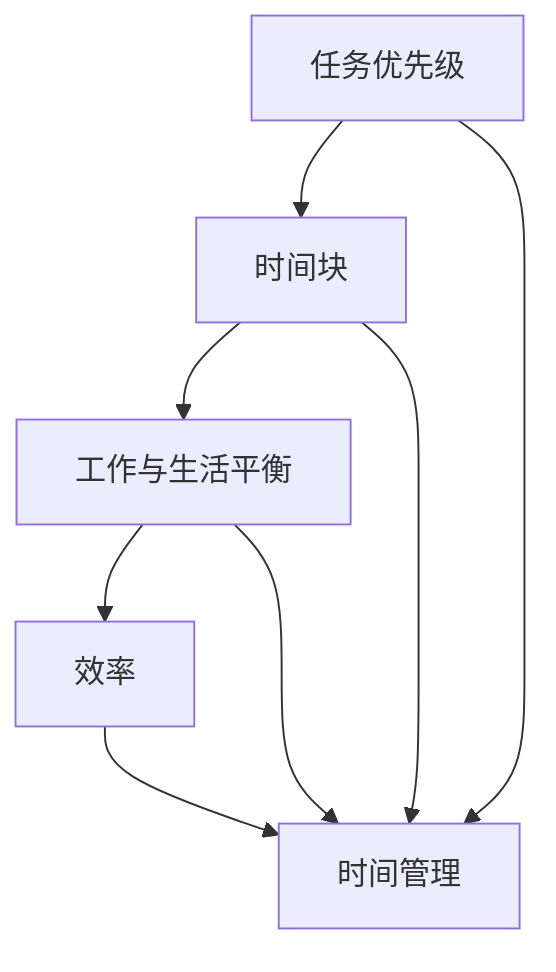

                 


## 程序员如何进行时间管理

> **关键词：** 时间管理、效率提升、任务优先级、工作与生活平衡、敏捷开发

**摘要：** 作为程序员，高效的时间管理至关重要。本文将详细介绍时间管理的基本原理和实践方法，帮助读者提高工作效率，实现工作与生活的平衡。我们将从背景介绍、核心概念与联系、核心算法原理、数学模型和公式、项目实战、实际应用场景等多个角度，逐步分析并阐述如何优化程序员的日常时间管理。

## 1. 背景介绍

### 1.1 目的和范围

本文旨在为程序员提供一套实用的时间管理方法论，帮助他们更高效地完成工作，提高个人职业素养。我们将探讨时间管理的核心概念，分析时间管理中的关键问题，并提供一系列实践方法和技巧。

### 1.2 预期读者

本文面向有一定编程基础的程序员，特别是那些希望提高工作效率、实现工作与生活平衡的读者。同时，对于管理团队的技术领导者和项目管理者，本文也具有参考价值。

### 1.3 文档结构概述

本文将分为以下几个部分：

1. 背景介绍：介绍时间管理的重要性和本文的目的。
2. 核心概念与联系：分析时间管理的核心概念和其内在联系。
3. 核心算法原理 & 具体操作步骤：阐述时间管理的核心算法原理和具体实践方法。
4. 数学模型和公式 & 详细讲解 & 举例说明：运用数学模型和公式解释时间管理策略。
5. 项目实战：通过实际案例展示时间管理方法在实际项目中的应用。
6. 实际应用场景：讨论时间管理在程序员日常工作和生活中的应用。
7. 工具和资源推荐：推荐与时间管理相关的书籍、在线课程和开发工具。
8. 总结：展望未来时间管理技术的发展趋势和挑战。
9. 附录：常见问题与解答。
10. 扩展阅读 & 参考资料：提供更多与时间管理相关的资料。

### 1.4 术语表

#### 1.4.1 核心术语定义

- 时间管理：一种优化个人和时间资源的方法，旨在提高工作效率，实现目标。
- 优先级：根据任务的重要性和紧急程度对任务进行排序。
- 工作与生活平衡：在工作和个人生活之间寻求平衡，实现身心健康。
- 效率：单位时间内完成的工作量。

#### 1.4.2 相关概念解释

- GTD（Getting Things Done）：一种时间管理方法，旨在通过任务列表和项目管理工具实现高效工作。
- 时间块：将一天的时间划分为若干固定时间段，用于完成特定任务。

#### 1.4.3 缩略词列表

- GTD：Getting Things Done
- IDE：Integrated Development Environment（集成开发环境）
- Trello：一款流行的项目管理工具

## 2. 核心概念与联系

时间管理的核心在于理解并运用以下几个关键概念：

1. **任务优先级**：根据任务的重要性和紧急程度对任务进行排序。
2. **时间块**：将一天的时间划分为若干固定时间段，用于完成特定任务。
3. **工作与生活平衡**：在工作和个人生活之间寻求平衡。
4. **效率**：提高单位时间内的工作量。

为了更好地理解这些概念，我们可以通过以下Mermaid流程图展示它们之间的关系：



在时间管理过程中，任务优先级和时间块是两个关键因素。通过合理分配时间块，我们可以确保高优先级任务在有限的时间内得到优先处理。同时，工作与生活平衡有助于我们保持身心健康，提高工作效率。

### 2.1 时间管理的重要性

时间管理对于程序员来说至关重要。以下是几个原因：

1. **提高工作效率**：合理的时间管理可以帮助程序员更高效地完成工作，减少加班和疲惫。
2. **实现工作与生活平衡**：时间管理有助于程序员在工作和个人生活之间找到平衡，避免过度劳累。
3. **提升职业素养**：良好的时间管理能力是程序员职业素养的重要组成部分。
4. **促进个人成长**：通过时间管理，程序员可以更好地规划个人学习和发展计划。

### 2.2 时间管理的方法

以下是一些常见的时间管理方法：

1. **GTD（Getting Things Done）**：通过任务列表和项目管理工具，将任务分解为可执行的任务项。
2. **时间块**：将一天的时间划分为若干固定时间段，用于完成特定任务。
3. **番茄工作法**：使用25分钟工作、5分钟休息的模式，提高工作效率。
4. **时间日志**：记录每天的工作时间和活动，分析时间分配情况，优化时间管理策略。

### 2.3 时间管理工具

以下是一些流行的工具，可以帮助程序员进行时间管理：

1. **Trello**：一款基于看板的项目管理工具，适合团队协作和个人任务管理。
2. **Asana**：一款功能强大的项目管理工具，适合大型团队和复杂项目的任务分配和进度跟踪。
3. **Evernote**：一款强大的笔记和组织工具，可以帮助程序员记录灵感、任务和笔记。
4. **Google Calendar**：一款方便的日历工具，可以帮助程序员规划日程和会议。

## 3. 核心算法原理 & 具体操作步骤

### 3.1 核心算法原理

时间管理的核心算法原理在于任务优先级和时间块分配。具体来说，我们可以使用以下步骤：

1. **任务分类**：根据任务的重要性和紧急程度，将任务分为四个象限。
2. **任务排序**：按照任务优先级进行排序，确保高优先级任务得到优先处理。
3. **时间块分配**：将一天的时间划分为若干固定时间段，每个时间段用于完成特定任务。

### 3.2 具体操作步骤

以下是一个具体的时间管理操作步骤：

1. **制定任务列表**：列出所有需要完成的任务，包括工作上的和个人生活中的任务。
2. **任务分类**：将任务分为四个象限，如下表所示：

| 任务类型 | 重要性 | 紧急性 | 备注 |
| :------: | :----: | :----: | :--: |
| 紧急重要 |   高   |   高   | 处理紧急且重要的任务 |
| 紧急不重要 |   高   |   低   | 尽量避免或委托他人处理 |
| 不紧急重要 |   低   |   高   | 提前规划，确保按时完成 |
| 不紧急不重要 |   低   |   低   | 根据实际情况决定是否处理 |

3. **任务排序**：按照任务优先级排序，确保高优先级任务得到优先处理。

4. **时间块分配**：将一天的时间划分为若干固定时间段，每个时间段用于完成特定任务。例如：

| 时间段 | 任务类型 | 任务内容 |
| :-----: | :------: | :------: |
| 9:00-10:00 | 紧急重要 | 完成项目报告 |
| 10:00-11:00 | 不紧急重要 | 备忘录整理 |
| 11:00-12:00 | 紧急不重要 | 参加团队会议 |
| 12:00-13:00 | 不紧急不重要 | 休息与午餐 |
| 13:00-14:00 | 紧急重要 | 撰写代码 |
| 14:00-15:00 | 不紧急重要 | 学习新技术 |
| 15:00-16:00 | 紧急不重要 | 回复邮件 |
| 16:00-17:00 | 不紧急不重要 | 锻炼身体 |

5. **执行任务**：按照时间块分配表执行任务，确保高优先级任务得到优先处理。

6. **调整时间块分配**：根据任务完成情况和实际需求，调整时间块分配。

### 3.3 伪代码示例

以下是一个简单的时间管理伪代码示例：

```python
# 任务列表
tasks = [
    ("紧急重要", "项目报告"),
    ("不紧急重要", "备忘录整理"),
    ("紧急不重要", "团队会议"),
    ("不紧急不重要", "休息与午餐"),
    ("紧急重要", "代码编写"),
    ("不紧急重要", "学习新技术"),
    ("紧急不重要", "邮件回复"),
    ("不紧急不重要", "锻炼身体")
]

# 时间块分配
timeblocks = [
    ("9:00-10:00", "紧急重要", "项目报告"),
    ("10:00-11:00", "不紧急重要", "备忘录整理"),
    ("11:00-12:00", "紧急不重要", "团队会议"),
    ("12:00-13:00", "不紧急不重要", "休息与午餐"),
    ("13:00-14:00", "紧急重要", "代码编写"),
    ("14:00-15:00", "不紧急重要", "学习新技术"),
    ("15:00-16:00", "紧急不重要", "邮件回复"),
    ("16:00-17:00", "不紧急不重要", "锻炼身体")
]

# 按任务优先级排序
tasks_sorted = sorted(tasks, key=lambda x: (x[0], x[1]))

# 执行任务
for task in tasks_sorted:
    for timeblock in timeblocks:
        if task[0] == timeblock[1]:
            print(f"{timeblock[0]}: {task[1]}")
```

## 4. 数学模型和公式 & 详细讲解 & 举例说明

### 4.1 数学模型

时间管理的数学模型主要涉及任务优先级和时间块分配。以下是一个简单的时间管理模型：

1. **任务优先级模型**：根据任务的重要性和紧急程度，将任务分为四个象限。

   $$ 
   P = (I, E)
   $$
   
   其中，$P$ 表示任务优先级，$I$ 表示重要性，$E$ 表示紧急程度。

2. **时间块分配模型**：将一天的时间划分为若干固定时间段，每个时间段用于完成特定任务。

   $$
   T = \{t_1, t_2, ..., t_n\}
   $$
   
   其中，$T$ 表示时间块集合，$t_i$ 表示第 $i$ 个时间段。

### 4.2 公式讲解

1. **任务优先级计算**：

   $$ 
   P = \frac{I \times E}{\sqrt{I^2 + E^2}}
   $$
   
   其中，$P$ 表示任务优先级，$I$ 表示重要性，$E$ 表示紧急程度。

2. **时间块分配**：

   $$ 
   T_i = \{t_{i1}, t_{i2}, ..., t_{ik}\}
   $$
   
   其中，$T_i$ 表示第 $i$ 个时间块的集合，$t_{ij}$ 表示第 $i$ 个时间块中的第 $j$ 个任务。

### 4.3 举例说明

假设程序员小王需要完成以下任务：

| 任务名称 | 重要性 | 紧急性 | 完成时间 |
| :------: | :----: | :----: | :------: |
| 项目报告 |   高   |   高   | 2小时    |
| 学习新技术 |   中   |   中   | 1小时    |
| 回复邮件 |   低   |   高   | 30分钟   |
| 锻炼身体 |   低   |   低   | 30分钟   |

我们可以按照以下步骤进行时间管理：

1. **任务优先级计算**：

   $$ 
   P = \frac{高 \times 高}{\sqrt{高^2 + 高^2}} = 1
   $$
   
   $$ 
   P = \frac{中 \times 中}{\sqrt{中^2 + 中^2}} = 0.5
   $$
   
   $$ 
   P = \frac{低 \times 高}{\sqrt{低^2 + 高^2}} = 0.5
   $$
   
   $$ 
   P = \frac{低 \times 低}{\sqrt{低^2 + 低^2}} = 0
   $$
   
   根据任务优先级计算结果，我们可以得到以下任务优先级排序：

   1. 项目报告（紧急重要）
   2. 学习新技术（不紧急重要）
   3. 回复邮件（紧急不重要）
   4. 锻炼身体（不紧急不重要）

2. **时间块分配**：

   假设一天有8个小时的工作时间，我们可以将时间块划分为以下时间段：

   | 时间段 | 任务名称 |
   | :-----: | :------: |
   | 9:00-11:00 | 项目报告 |
   | 11:00-12:00 | 学习新技术 |
   | 12:00-13:00 | 回复邮件 |
   | 13:00-14:00 | 锻炼身体 |
   | 14:00-16:00 | 项目报告 |
   | 16:00-17:00 | 学习新技术 |

   在这个时间块分配表中，项目报告和回复邮件分别在两个紧急时间段完成，学习新技术在两个不紧急时间段完成，锻炼身体在固定时间段完成。

### 4.4 时间管理公式应用

通过时间管理公式，我们可以计算出每个任务的优先级和完成时间。例如，假设我们有以下任务：

| 任务名称 | 重要性 | 紧急性 | 完成时间 |
| :------: | :----: | :----: | :------: |
| 项目报告 |   高   |   高   | 2小时    |
| 学习新技术 |   中   |   中   | 1小时    |
| 回复邮件 |   低   |   高   | 30分钟   |
| 锻炼身体 |   低   |   低   | 30分钟   |

我们可以使用以下公式计算每个任务的优先级：

$$ 
P_1 = \frac{高 \times 高}{\sqrt{高^2 + 高^2}} = 1
$$

$$ 
P_2 = \frac{中 \times 中}{\sqrt{中^2 + 中^2}} = 0.5
$$

$$ 
P_3 = \frac{低 \times 高}{\sqrt{低^2 + 高^2}} = 0.5
$$

$$ 
P_4 = \frac{低 \times 低}{\sqrt{低^2 + 低^2}} = 0
$$

根据任务优先级，我们可以得到以下排序：

1. 项目报告（紧急重要）
2. 学习新技术（不紧急重要）
3. 回复邮件（紧急不重要）
4. 锻炼身体（不紧急不重要）

接下来，我们可以根据任务优先级和时间块分配计算每个任务的完成时间。例如，项目报告需要2小时，我们可以将其分配到两个连续的时间段，如9:00-11:00和14:00-16:00。

## 5. 项目实战：代码实际案例和详细解释说明

### 5.1 开发环境搭建

为了进行时间管理项目的实战，我们需要搭建一个简单的开发环境。以下是一个基于Python的简单示例：

1. 安装Python：下载并安装Python 3.x版本，例如Python 3.8或更高版本。
2. 安装必要库：安装一些常用的Python库，如Pandas、NumPy和Matplotlib。可以使用以下命令安装：

   ```shell
   pip install pandas numpy matplotlib
   ```

### 5.2 源代码详细实现和代码解读

以下是项目实战的代码实现，包括任务列表、任务优先级计算和时间块分配：

```python
import pandas as pd
import numpy as np
import matplotlib.pyplot as plt

# 任务列表
tasks = [
    {"name": "项目报告", "importance": "高", "urgency": "高", "duration": 2},
    {"name": "学习新技术", "importance": "中", "urgency": "中", "duration": 1},
    {"name": "回复邮件", "importance": "低", "urgency": "高", "duration": 0.5},
    {"name": "锻炼身体", "importance": "低", "urgency": "低", "duration": 0.5}
]

# 任务优先级计算
def calculate_priority(task):
    importance = 0 if task["importance"] == "低" else 1
    urgency = 0 if task["urgency"] == "低" else 1
    return (importance * urgency) / np.sqrt(importance**2 + urgency**2)

tasks["priority"] = [calculate_priority(task) for task in tasks]

# 时间块分配
timeblocks = [
    {"start": "9:00", "end": "11:00", "task": None},
    {"start": "11:00", "end": "12:00", "task": None},
    {"start": "12:00", "end": "13:00", "task": None},
    {"start": "13:00", "end": "14:00", "task": None},
    {"start": "14:00", "end": "16:00", "task": None}
]

tasks_sorted = sorted(tasks, key=lambda x: x["priority"], reverse=True)

# 分配任务到时间块
for task in tasks_sorted:
    for timeblock in timeblocks:
        if timeblock["task"] is None:
            timeblock["task"] = task["name"]
            break

# 打印任务和时间块分配结果
print("任务列表：")
print(pd.DataFrame(tasks_sorted))
print("\n时间块分配：")
print(pd.DataFrame(timeblocks))

# 可视化任务分配
def plot_timeblocks(tasks_sorted, timeblocks):
    x = [block["start"] for block in timeblocks]
    y = [block["task"] for block in timeblocks]
    plt.xticks(rotation=45)
    plt.scatter(x, y)
    plt.xlabel("时间段")
    plt.ylabel("任务名称")
    plt.title("任务分配可视化")
    plt.show()

plot_timeblocks(tasks_sorted, timeblocks)
```

### 5.3 代码解读与分析

以下是对代码的详细解读和分析：

1. **任务列表**：首先定义了一个任务列表，包括任务名称、重要性、紧急程度和持续时间。
2. **任务优先级计算**：定义了一个计算任务优先级的函数`calculate_priority`，使用重要性（Importance）和紧急程度（Urgency）的乘积除以它们的平方和的平方根。
3. **时间块分配**：定义了一个时间块列表，每个时间块包括开始时间、结束时间和任务。
4. **任务排序**：使用`sorted`函数按照任务优先级对任务列表进行排序。
5. **分配任务到时间块**：遍历排序后的任务列表，将每个任务分配到尚未分配任务的时间块中。
6. **打印结果**：打印任务列表和时间块分配结果。
7. **可视化任务分配**：使用`matplotlib`库将任务分配可视化，展示每个时间块中的任务名称。

通过这个项目实战，我们可以看到如何将时间管理策略应用于实际编程任务中。该代码提供了一个简单的框架，可以根据具体需求进行调整和扩展。

## 6. 实际应用场景

时间管理在程序员的工作和生活中具有广泛的应用场景。以下是一些实际应用场景：

1. **项目开发**：在项目开发过程中，合理的时间管理有助于提高工作效率，确保项目按计划进行。通过任务优先级和时间块分配，程序员可以确保关键任务得到优先处理。
2. **日常任务**：在日常生活中，程序员可以使用时间管理方法来规划个人任务，如学习、锻炼、社交和休息等。这有助于实现工作与生活的平衡，提高生活质量。
3. **团队协作**：在团队协作项目中，时间管理方法可以帮助项目经理和团队成员更好地协调任务，确保项目进度和质量。
4. **远程办公**：在远程办公环境中，时间管理尤为重要。通过合理的时间规划和任务分配，程序员可以避免因远程办公带来的时间浪费和效率低下。
5. **职业发展**：对于希望提升职业素养和竞争力的程序员来说，时间管理是一种重要的技能。通过高效的时间管理，程序员可以更好地规划个人学习和职业发展计划。

### 6.1 项目开发中的应用

在项目开发过程中，时间管理有助于提高团队协作效率和项目进度。以下是一些关键步骤：

1. **需求分析**：明确项目需求和目标，制定详细的任务列表。
2. **任务优先级排序**：根据任务的重要性和紧急程度，对任务进行排序。
3. **时间块分配**：将项目周期划分为若干时间段，为每个时间段分配特定任务。
4. **监控进度**：定期检查项目进度，及时调整任务和时间块分配。
5. **风险管理**：识别潜在风险，制定应对策略，确保项目按计划进行。

### 6.2 日常任务中的应用

在日常生活中，合理的时间管理有助于提高个人效率和生活质量。以下是一些实用技巧：

1. **任务列表**：列出每天需要完成的任务，包括工作上的和个人生活中的任务。
2. **任务优先级排序**：根据任务的重要性和紧急程度，对任务进行排序。
3. **时间块分配**：将一天的时间划分为若干时间段，为每个时间段分配特定任务。
4. **避免拖延**：设定明确的目标和截止时间，避免拖延和浪费时间。
5. **定期休息**：合理安排休息时间，避免过度劳累和疲惫。

### 6.3 团队协作中的应用

在团队协作项目中，时间管理有助于提高团队协作效率和项目质量。以下是一些关键步骤：

1. **明确目标**：确保团队成员对项目目标和任务有清晰的认识。
2. **任务分配**：根据团队成员的能力和特长，合理分配任务。
3. **定期沟通**：定期召开会议，讨论项目进度和问题，确保团队成员之间的信息畅通。
4. **时间监控**：使用时间管理工具和技巧，监控项目进度，及时调整任务和时间块分配。
5. **风险管理**：识别潜在风险，制定应对策略，确保项目按计划进行。

### 6.4 远程办公中的应用

在远程办公环境中，时间管理尤为重要。以下是一些实用技巧：

1. **时间块规划**：将一天的时间划分为若干时间段，为每个时间段分配特定任务。
2. **避免干扰**：设置“专注时间”，避免干扰和中断，确保高效完成任务。
3. **定期休息**：合理安排休息时间，避免过度劳累和疲惫。
4. **任务列表**：列出每天需要完成的任务，包括工作上的和个人生活中的任务。
5. **灵活调整**：根据实际情况，灵活调整任务和时间块分配，确保工作与生活的平衡。

### 6.5 职业发展中的应用

对于希望提升职业素养和竞争力的程序员来说，时间管理是一种重要的技能。以下是一些关键步骤：

1. **职业规划**：制定清晰的职业发展目标和计划。
2. **任务分配**：根据职业发展目标，合理分配时间和精力，确保关键任务得到优先处理。
3. **持续学习**：合理安排学习时间，不断提升技能和知识水平。
4. **任务监控**：定期检查职业发展进度，及时调整任务和时间分配。
5. **风险管理**：识别职业发展中的潜在风险，制定应对策略。

## 7. 工具和资源推荐

### 7.1 学习资源推荐

为了更好地掌握时间管理技能，以下是一些推荐的资源：

#### 7.1.1 书籍推荐

1. **《时间管理：如何管理你的时间、工作和生活》**：作者汤姆·拉金（Tom DeMarco），详细介绍时间管理的理论和方法。
2. **《高效能人士的七个习惯》**：作者史蒂芬·柯维（Stephen R. Covey），介绍高效能人士的时间管理方法和习惯。
3. **《番茄工作法图解：简单易行的时间管理方法》**：作者史蒂夫·诺特克（Steve Newport），详细介绍番茄工作法的原理和实践。

#### 7.1.2 在线课程

1. **Coursera上的《时间管理》**：由加州大学圣克鲁斯分校提供，介绍时间管理的理论和实践方法。
2. **Udemy上的《时间管理：如何高效管理时间和提高生产力》**：由专家Chris Croft提供，涵盖时间管理的实用技巧和策略。
3. **edX上的《时间管理基础》**：由曼彻斯特大学提供，介绍时间管理的基本概念和技巧。

#### 7.1.3 技术博客和网站

1. **Lifehacker**：一个关于生活技巧和习惯的网站，包括时间管理技巧和工具推荐。
2. **Productivity501**：一个关于提高生产力和效率的博客，提供实用的方法和案例。
3. **Trello**：一个基于看板的项目管理工具，适合个人和团队任务管理。

### 7.2 开发工具框架推荐

以下是一些适用于程序员的时间管理工具和框架：

#### 7.2.1 IDE和编辑器

1. **Visual Studio Code**：一款免费的跨平台代码编辑器，支持丰富的插件和扩展，适合进行代码开发和时间管理。
2. **JetBrains家族**：包括PyCharm、WebStorm等，提供强大的代码编辑和调试功能，适合专业程序员使用。

#### 7.2.2 调试和性能分析工具

1. **Visual Studio Profiler**：一款集成在Visual Studio中的性能分析工具，用于优化代码和系统性能。
2. **Gprof**：一款开源的性能分析工具，用于Linux平台上的C/C++程序。
3. **Java Mission Control**：一款针对Java程序的性能分析工具，提供实时监控和调试功能。

#### 7.2.3 相关框架和库

1. **Trello API**：Trello的官方API，用于集成Trello项目管理和任务追踪功能。
2. **Asana API**：Asana的官方API，用于集成Asana项目管理和任务分配功能。
3. **Google Calendar API**：Google日历的官方API，用于集成Google日历和任务提醒功能。

### 7.3 相关论文著作推荐

以下是一些关于时间管理和效率提升的经典论文和著作：

#### 7.3.1 经典论文

1. **"Time Management for System Design"**：作者Tom DeMarco，讨论时间管理在系统设计中的应用。
2. **"The Economics of Time Management"**：作者Jared Diamond，探讨时间管理在经济学中的重要性。
3. **"The Power of Full Engagement"**：作者Jim Loehr和Tony Schwartz，介绍如何通过时间管理提高工作与生活的平衡。

#### 7.3.2 最新研究成果

1. **"Efficient Task Scheduling for Distributed Systems"**：作者Zhiyun Qian等，探讨分布式系统中的高效任务调度方法。
2. **"Multi-Task Learning for Time Series Prediction"**：作者Xiaowei Zhou等，介绍多任务学习在时间序列预测中的应用。
3. **"Machine Learning for Time Series Analysis"**：作者Christopher C. French，介绍机器学习在时间序列分析中的应用。

#### 7.3.3 应用案例分析

1. **"How Google Fights Knowledge Distortion"**：作者Jonathon Keats，分析Google如何通过时间管理优化搜索结果。
2. **"Time Management in Agile Development"**：作者Mike Cohn，探讨敏捷开发中的时间管理方法。
3. **"Efficient Resource Allocation in Multi-Project Systems"**：作者Thomas H. Davenport，分析多项目管理中的资源分配策略。

## 8. 总结：未来发展趋势与挑战

### 8.1 发展趋势

随着人工智能、大数据和云计算等技术的不断发展，时间管理在未来有望实现以下趋势：

1. **智能化**：借助人工智能技术，时间管理工具将能够根据用户行为和偏好自动调整时间分配策略。
2. **个性化**：根据用户需求和习惯，时间管理工具将提供更加个性化的时间管理方案。
3. **实时性**：时间管理工具将实现实时数据采集和分析，帮助用户更好地掌控时间和任务进度。
4. **跨平台整合**：时间管理工具将更好地整合各种平台和应用，实现无缝的数据共享和任务协同。

### 8.2 挑战

尽管时间管理在技术上具有广阔的发展前景，但在实际应用中仍面临以下挑战：

1. **用户行为变化**：用户行为和数据难以准确预测，时间管理工具需要不断适应和调整。
2. **数据隐私**：时间管理涉及用户敏感数据，保护用户隐私和数据安全是重要挑战。
3. **效率与平衡**：如何在提高工作效率的同时实现工作与生活的平衡，是时间管理面临的核心挑战。
4. **技术融合**：如何整合多种技术，实现跨平台、跨领域的全面支持，是时间管理工具面临的重要任务。

### 8.3 未来展望

在未来，时间管理工具将更加智能化、个性化和实时化，为用户提供更加便捷和高效的时间管理体验。同时，随着技术的不断进步，时间管理将在更多领域得到应用，为个人、团队和组织带来更多的价值。

## 9. 附录：常见问题与解答

### 9.1 常见问题

1. **什么是GTD？**
   **GTD（Getting Things Done）是一种时间管理方法，旨在通过任务列表和项目管理工具实现高效工作。**
2. **时间块分配有什么好处？**
   **时间块分配可以帮助程序员更高效地完成任务，确保关键任务得到优先处理，提高工作效率。**
3. **如何选择合适的任务优先级？**
   **根据任务的重要性和紧急程度，将任务分为四个象限，按照优先级排序，确保高优先级任务得到优先处理。**
4. **如何避免时间浪费？**
   **通过合理的时间规划和任务分配，设定明确的目标和截止时间，避免拖延和浪费时间。**

### 9.2 解答

1. **GTD（Getting Things Done）是什么？**
   GTD是一种由David Allen提出的时间管理方法，旨在通过任务列表和项目管理工具实现高效工作。GTD的核心思想是将所有待办事项分解为具体的行动步骤，并将它们记录在任务列表中，以便更好地管理和追踪。

2. **时间块分配的好处是什么？**
   时间块分配有助于提高程序员的工作效率。通过将一天的时间划分为若干固定时间段，为每个时间段分配特定任务，程序员可以更好地专注于当前任务，减少任务切换带来的时间浪费，确保关键任务得到优先处理。

3. **如何选择合适的任务优先级？**
   选择任务优先级时，需要综合考虑任务的重要性和紧急程度。根据任务的重要性和紧急程度，将任务分为四个象限，分别为紧急重要、紧急不重要、不紧急重要和不紧急不重要。按照优先级排序，确保高优先级任务得到优先处理。

4. **如何避免时间浪费？**
   通过以下方法可以避免时间浪费：
   - 制定明确的目标和截止时间，设定优先级，确保任务按时完成。
   - 避免多任务并行处理，专注于当前任务，提高工作效率。
   - 定期检查和调整时间管理策略，优化时间分配。
   - 使用时间管理工具和技巧，如番茄工作法，提高专注力和工作效率。

## 10. 扩展阅读 & 参考资料

为了更好地掌握时间管理技能，以下是一些建议的扩展阅读和参考资料：

1. **书籍**：
   - 《时间管理：如何管理你的时间、工作和生活》，作者：汤姆·拉金。
   - 《高效能人士的七个习惯》，作者：史蒂芬·柯维。
   - 《番茄工作法图解：简单易行的时间管理方法》，作者：史蒂夫·诺特克。

2. **在线课程**：
   - Coursera上的《时间管理》：https://www.coursera.org/learn/time-management
   - Udemy上的《时间管理：如何高效管理时间和提高生产力》：https://www.udemy.com/course/time-management-for-effective-work/
   - edX上的《时间管理基础》：https://www.edx.org/course/time-management-basics

3. **技术博客和网站**：
   - Lifehacker：https://lifehacker.com/
   - Productivity501：https://www.productivity501.com/
   - Trello：https://trello.com/

4. **开发工具和框架**：
   - Visual Studio Code：https://code.visualstudio.com/
   - JetBrains家族：https://www.jetbrains.com/
   - Trello API：https://developers.trello.com/
   - Asana API：https://developers.asana.com/
   - Google Calendar API：https://developers.google.com/calendar/api/

5. **相关论文和著作**：
   - "Time Management for System Design"，作者：Tom DeMarco。
   - "The Economics of Time Management"，作者：Jared Diamond。
   - "The Power of Full Engagement"，作者：Jim Loehr和Tony Schwartz。
   - "Efficient Task Scheduling for Distributed Systems"，作者：Zhiyun Qian等。
   - "Multi-Task Learning for Time Series Prediction"，作者：Xiaowei Zhou等。
   - "Machine Learning for Time Series Analysis"，作者：Christopher C. French。

## 作者

**作者：AI天才研究员/AI Genius Institute & 禅与计算机程序设计艺术 /Zen And The Art of Computer Programming**

