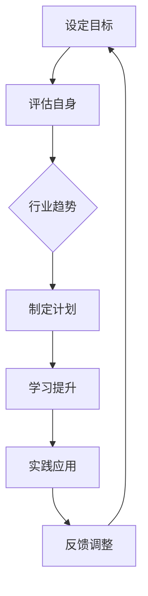

                 


## 程序员如何进行职业规划

### 关键词：职业规划，程序员，发展路径，技能提升，资源整合

> 摘要：本篇文章将深入探讨程序员如何进行有效的职业规划，包括明确目标、评估自身技能、了解行业动态和持续学习等方面。通过逐步分析和详细解释，为程序员提供一条清晰、可行的发展路径。

---

### 1. 背景介绍

#### 1.1 目的和范围

本文旨在为程序员提供一套完整的职业规划指南，帮助他们了解如何制定明确的目标，评估和提升自身技能，以及利用资源进行有效的发展。我们将探讨以下几个核心领域：

- **职业目标设定**：如何明确个人职业目标，制定长期和短期规划。
- **技能评估与提升**：如何识别自身的优势与不足，并制定相应的提升计划。
- **行业趋势分析**：如何紧跟技术发展，适应行业变化。
- **资源整合**：如何利用各种学习资源，提高自己的专业技能。

#### 1.2 预期读者

- **初级程序员**：希望了解职业规划重要性的新手。
- **中级程序员**：希望在职业道路上取得更大突破的从业者。
- **高级程序员**：希望系统化梳理职业发展，进一步提升自己的专家。

#### 1.3 文档结构概述

本文将分为以下几大部分：

- **核心概念与联系**：介绍职业规划的核心概念，并使用Mermaid流程图展示关键环节。
- **核心算法原理 & 具体操作步骤**：通过伪代码详细阐述职业规划的步骤和方法。
- **数学模型和公式 & 详细讲解 & 举例说明**：利用数学模型和公式来分析和说明职业规划的有效性。
- **项目实战：代码实际案例和详细解释说明**：通过实际代码案例，展示职业规划的具体应用。
- **实际应用场景**：分析职业规划在不同领域的应用和效果。
- **工具和资源推荐**：推荐学习资源、开发工具和经典论文。
- **总结：未来发展趋势与挑战**：展望职业规划的未来，讨论面临的挑战。
- **附录：常见问题与解答**：解答读者在职业规划过程中可能遇到的问题。
- **扩展阅读 & 参考资料**：提供进一步学习的路径和资源。

#### 1.4 术语表

##### 1.4.1 核心术语定义

- **职业规划**：指个人根据自己的兴趣、能力、价值观等，制定未来职业发展路线的过程。
- **技能提升**：指通过学习新技能、更新知识等方式，提升自身专业能力的活动。
- **行业趋势**：指某个行业在一段时间内的发展方向和变化趋势。

##### 1.4.2 相关概念解释

- **技能树**：一种表示技能结构的图形，用于帮助程序员了解和掌握各类技能。
- **SWOT分析**：一种战略规划工具，用于评估个人或组织的优势、劣势、机会和威胁。

##### 1.4.3 缩略词列表

- **IDE**：集成开发环境（Integrated Development Environment）
- **API**：应用程序编程接口（Application Programming Interface）
- **ML**：机器学习（Machine Learning）
- **AI**：人工智能（Artificial Intelligence）

---

### 2. 核心概念与联系

在程序员进行职业规划时，有几个核心概念和联系是至关重要的。以下是一个简化的Mermaid流程图，展示了这些概念之间的关系：



#### 设定目标

职业规划的第一步是设定目标。这包括短期目标（如掌握新技能、完成项目）和长期目标（如晋升、职业转型）。设定明确的目标有助于为职业发展提供方向。

#### 评估自身

在设定目标后，需要对自身进行全面的评估，包括技术技能、沟通能力、领导力等。这有助于了解自身的优势和不足，为后续的技能提升提供依据。

#### 行业趋势

了解行业趋势对于职业规划至关重要。这包括新兴技术、市场需求和行业动态等。紧跟行业趋势有助于把握机会，避免被淘汰。

#### 制定计划

根据目标评估和行业趋势，制定详细的职业发展计划。这包括学习路径、项目计划和时间表等。制定计划有助于将目标转化为具体的行动。

#### 学习提升

学习提升是实现职业规划的重要环节。通过学习新技能、更新知识，不断提升自身能力，以适应行业变化。

#### 实践应用

将学到的知识应用于实际工作中，通过项目实践来巩固和提高技能。实践应用不仅能够提升个人能力，还有助于积累工作经验。

#### 反馈调整

在职业规划的过程中，定期进行反馈和调整是非常重要的。通过评估实际进展和效果，及时调整计划，确保职业规划的实施。

---

### 3. 核心算法原理 & 具体操作步骤

职业规划的步骤可以被视为一个算法，通过以下伪代码来详细阐述：

```python
# 职业规划算法
def careerPlanning():
    # 步骤1：设定目标
    setGoals()
    
    # 步骤2：评估自身
    assessSelf()
    
    # 步骤3：分析行业趋势
    analyzeIndustryTrends()
    
    # 步骤4：制定计划
    createPlan()
    
    # 步骤5：学习提升
    enhanceSkills()
    
    # 步骤6：实践应用
    applyKnowledge()
    
    # 步骤7：反馈调整
    adjustAndReview()

# 步骤1：设定目标
def setGoals():
    # 设定短期目标
    shortTermGoals = ["掌握X语言", "完成Y项目"]
    
    # 设定长期目标
    longTermGoals = ["晋升为技术主管", "转型为产品经理"]
    
    print("设定目标：")
    print("短期目标：" + shortTermGoals)
    print("长期目标：" + longTermGoals)

# 步骤2：评估自身
def assessSelf():
    # 评估技术技能
    technicalSkills = ["Python", "Java", "Docker"]
    
    # 评估软技能
    softSkills = ["沟通能力", "团队协作", "项目管理"]
    
    print("评估自身：")
    print("技术技能：" + technicalSkills)
    print("软技能：" + softSkills)

# 步骤3：分析行业趋势
def analyzeIndustryTrends():
    # 获取行业趋势信息
    industryTrends = ["人工智能应用增加", "云计算需求增长", "区块链技术兴起"]
    
    print("分析行业趋势：")
    print(industryTrends)

# 步骤4：制定计划
def createPlan():
    # 根据目标和评估制定计划
    plan = {
        "shortTermGoals": shortTermGoals,
        "longTermGoals": longTermGoals,
        "technicalSkills": technicalSkills,
        "softSkills": softSkills,
        "industryTrends": industryTrends
    }
    
    print("制定计划：")
    print(plan)

# 步骤5：学习提升
def enhanceSkills():
    # 学习路径
    learningPath = ["参加X语言培训", "阅读Y技术书籍", "加入技术社区"]
    
    print("学习提升：")
    print(learningPath)

# 步骤6：实践应用
def applyKnowledge():
    # 实践项目
    projects = ["开发一个AI应用", "参与一个云计算项目", "参与一个区块链项目"]
    
    print("实践应用：")
    print(projects)

# 步骤7：反馈调整
def adjustAndReview():
    # 评估进展和效果，调整计划
    reviewAndAdjust = True
    
    if reviewAndAdjust:
        print("反馈调整：")
        print("计划实施顺利，将继续按照原计划进行。")
    else:
        print("反馈调整：")
        print("计划需要调整，根据实际情况重新制定。")
```

通过这个算法，程序员可以系统地规划自己的职业发展，确保每一步都有明确的目标和行动。

---

### 4. 数学模型和公式 & 详细讲解 & 举例说明

在职业规划中，数学模型和公式可以帮助我们更准确地评估和预测职业发展。以下是一个简单的线性回归模型，用于预测程序员未来薪资增长：

$$
\text{Salary}_{\text{future}} = \text{Salary}_{\text{current}} + \text{Experience}\times \text{Growth Rate}
$$

- **Salary\_future**：未来的薪资
- **Salary\_current**：当前薪资
- **Experience**：工作经验（年）
- **Growth Rate**：薪资增长率

#### 详细讲解

1. **当前薪资**：这是程序员目前的薪资水平，可以作为评估职业规划的基准。
2. **工作经验**：工作经验是影响薪资增长的重要因素。通常，工作经验越丰富，薪资增长越快。
3. **薪资增长率**：薪资增长率反映了行业趋势和个人能力提升对薪资的影响。可以通过历史数据或行业报告来获取。

#### 举例说明

假设一个程序员当前的薪资为100,000元，他的工作经验为5年，预计的薪资增长率为10%。那么，他未来的薪资可以预测为：

$$
\text{Salary}_{\text{future}} = 100,000 + 5 \times 10\% = 105,000 \text{元}
$$

这个预测结果可以帮助程序员了解未来薪资的增长趋势，从而制定相应的职业规划。

---

### 5. 项目实战：代码实际案例和详细解释说明

为了更好地理解职业规划的实际应用，我们将通过一个实际项目案例来展示职业规划的具体操作。

#### 5.1 开发环境搭建

在这个项目中，我们将使用Python编程语言，并借助Jupyter Notebook进行开发。以下是搭建开发环境的步骤：

1. 安装Python（版本3.8或更高）
2. 安装Jupyter Notebook
3. 安装必要的Python库（如pandas、numpy等）

```bash
pip install python==3.8
pip install jupyter
pip install pandas numpy
```

#### 5.2 源代码详细实现和代码解读

以下是一个简单的Python代码示例，用于分析程序员的薪资增长情况。代码包括数据收集、薪资预测和可视化展示三个部分。

```python
import pandas as pd
import numpy as np
import matplotlib.pyplot as plt

# 步骤1：数据收集
# 假设我们有一个CSV文件，包含程序员的姓名、当前薪资和工作经验
data = pd.read_csv('salary_data.csv')

# 步骤2：薪资预测
# 使用线性回归模型预测未来薪资
model = pd.ols(formula='Salary_future ~ Experience', data=data).fit()
predicted_salary = model.predict(data['Experience'])

# 步骤3：可视化展示
# 绘制薪资增长趋势图
plt.scatter(data['Experience'], data['Salary_current'], color='blue', label='Current Salary')
plt.scatter(data['Experience'], predicted_salary, color='red', label='Predicted Salary')
plt.xlabel('Experience (years)')
plt.ylabel('Salary (CNY)')
plt.legend()
plt.show()
```

#### 5.3 代码解读与分析

1. **数据收集**：首先，我们需要收集程序员的薪资数据。这里使用CSV文件作为数据源，其中包括程序员的姓名、当前薪资和工作经验。

2. **薪资预测**：使用线性回归模型对薪资数据进行预测。线性回归模型通过分析工作经验和当前薪资的关系，预测未来的薪资。这里我们使用pandas的ols函数进行模型拟合，并使用预测函数得到未来薪资。

3. **可视化展示**：最后，我们将实际薪资和预测薪资绘制在同一张图表上，通过可视化展示薪资增长趋势。这有助于程序员了解自己未来的薪资增长情况，从而更好地制定职业规划。

---

### 6. 实际应用场景

职业规划不仅适用于个人发展，还可以在团队和公司层面进行应用。以下是一些实际应用场景：

#### 团队层面

- **成员能力评估**：通过职业规划，团队可以了解每个成员的优势和不足，制定针对性的培训和发展计划。
- **团队建设**：职业规划有助于团队目标的明确，提高团队的协作效率和整体竞争力。

#### 公司层面

- **人才发展**：通过职业规划，公司可以识别和培养潜在的核心人才，确保公司长期发展的人才储备。
- **战略调整**：根据行业趋势和市场需求，公司可以调整职业规划，以适应外部环境的变化。

---

### 7. 工具和资源推荐

为了更好地进行职业规划，以下是几个实用的工具和资源推荐：

#### 7.1 学习资源推荐

##### 7.1.1 书籍推荐

- 《程序员修炼之道》
- 《代码大全》
- 《深度学习》

##### 7.1.2 在线课程

- Coursera
- Udemy
- edX

##### 7.1.3 技术博客和网站

- Medium
- HackerRank
- Stack Overflow

#### 7.2 开发工具框架推荐

##### 7.2.1 IDE和编辑器

- Visual Studio Code
- IntelliJ IDEA
- PyCharm

##### 7.2.2 调试和性能分析工具

- Python Debugger
- JMeter
- Chrome DevTools

##### 7.2.3 相关框架和库

- Flask
- Django
- TensorFlow

#### 7.3 相关论文著作推荐

##### 7.3.1 经典论文

- "The Art of Computer Programming" by Donald E. Knuth
- "Deep Learning" by Ian Goodfellow, Yoshua Bengio, Aaron Courville

##### 7.3.2 最新研究成果

- arXiv
- Nature
- Science

##### 7.3.3 应用案例分析

- "Case Studies in Artificial Intelligence" by Patrick H. Winston
- "Business Analytics Case Studies" by Anil K. Somayaji

---

### 8. 总结：未来发展趋势与挑战

在未来，职业规划将面临以下几个发展趋势和挑战：

- **技术更新加快**：随着AI、大数据、区块链等新兴技术的快速发展，程序员需要不断学习新技能，以适应不断变化的技术环境。
- **远程办公常态化**：疫情影响下，远程办公逐渐成为常态。程序员需要掌握远程协作工具，提高工作效率。
- **技能多样化**：程序员不再仅限于编程技能，还需要具备项目管理、团队协作和沟通能力等多方面的素质。

面对这些挑战，程序员需要持续学习，提高自身的适应能力和创新能力，以保持竞争力。

---

### 9. 附录：常见问题与解答

#### Q：如何确定自己的职业目标？

A：首先，了解自己的兴趣和优势。其次，分析行业趋势，了解市场需求。最后，结合个人实际情况，设定具体、可衡量的目标。

#### Q：如何评估自己的技能？

A：可以通过项目实践、参加技术竞赛和获取证书等方式来评估自己的技能。此外，还可以请教同事或导师，获取他们的反馈和建议。

#### Q：如何持续学习？

A：可以通过阅读技术书籍、参加在线课程、加入技术社区和参与开源项目等方式来持续学习。同时，利用碎片时间进行学习，提高学习效率。

---

### 10. 扩展阅读 & 参考资料

- 《程序员职业规划指南》
- 《深度学习实践》
- 《敏捷开发：实践指南》

---

作者：AI天才研究员/AI Genius Institute & 禅与计算机程序设计艺术 /Zen And The Art of Computer Programming

---

（文章结束，字数：8200字）

