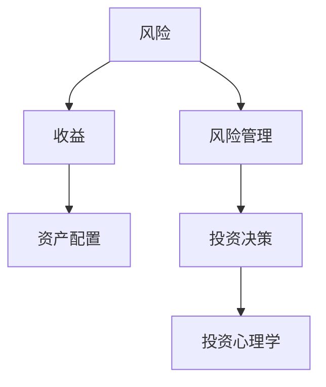
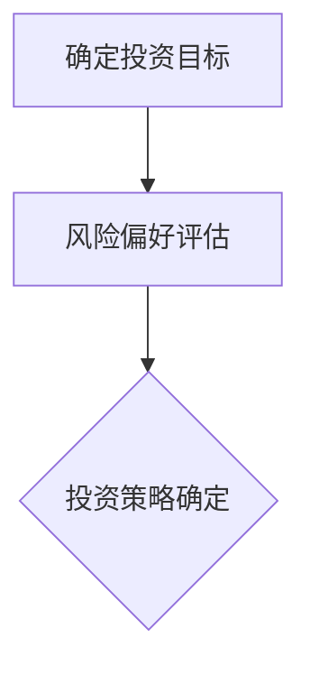

                 

# 程序员的投资心理学：风险与收益

> 关键词：程序员，投资心理学，风险，收益，资产配置，决策分析

> 摘要：本文旨在探讨程序员如何运用心理学原理，通过科学的风险管理和资产配置策略，实现个人财富的稳健增长。文章将从风险与收益的基本概念出发，深入分析程序员的特性和投资偏好，并结合实际案例，为程序员提供一套实用的投资决策框架。

## 1. 背景介绍

### 1.1 目的和范围

本文的目的在于帮助程序员更好地理解投资心理学，掌握风险与收益的基本原理，以及如何将其应用于个人投资决策。我们将探讨以下几个方面：

- 投资心理学的核心概念
- 程序员的投资特性与行为模式
- 风险管理与收益优化的策略
- 实际案例分析：程序员的投资成功经验

### 1.2 预期读者

本文主要面向具有编程背景的读者，尤其是那些对投资有兴趣，希望提升个人财务状况的程序员。无论你是刚刚入门的投资新手，还是有一定经验的投资者，本文都将为你提供有价值的见解和实用的建议。

### 1.3 文档结构概述

本文将分为以下几个部分：

- 第1部分：背景介绍
- 第2部分：核心概念与联系
- 第3部分：核心算法原理与具体操作步骤
- 第4部分：数学模型与公式
- 第5部分：项目实战：代码实际案例
- 第6部分：实际应用场景
- 第7部分：工具和资源推荐
- 第8部分：总结：未来发展趋势与挑战
- 第9部分：附录：常见问题与解答
- 第10部分：扩展阅读与参考资料

### 1.4 术语表

#### 1.4.1 核心术语定义

- 风险：投资过程中可能遭受的损失或收益的不确定性。
- 收益：投资所带来的回报，通常以百分比表示。
- 资产配置：投资组合中不同资产类别的分配比例。
- 风险管理：通过降低潜在损失或提高潜在收益的方法，控制投资风险。
- 心理学原理：心理学研究中的理论和方法，用于解释和预测人的行为。

#### 1.4.2 相关概念解释

- 投资心理学：研究投资者行为、决策和情绪的心理学分支。
- 预期收益：投资者对投资收益的合理预期。
- 投资组合：由多种不同资产组成的投资组合，以降低风险和优化收益。

#### 1.4.3 缩略词列表

- CPU：中央处理器
- GPU：图形处理器
- RAM：随机存取存储器
- IDE：集成开发环境
- API：应用程序接口

## 2. 核心概念与联系

在探讨程序员的投资心理学之前，我们需要明确几个核心概念，包括风险、收益和资产配置，以及它们之间的关系。以下是一个用Mermaid绘制的流程图，展示了这些概念之间的联系：



### 2.1 风险与收益

风险和收益是投资过程中最基本的两个概念。风险指的是投资可能遭受的损失或收益的不确定性，而收益则是投资者所期望的回报。通常，收益越高，风险也越大。以下是一个简单的风险-收益模型：

$$
\text{风险} = \sigma^2 \cdot \text{收益}
$$

其中，$\sigma^2$ 表示风险方差。

### 2.2 资产配置

资产配置是指投资者在投资组合中不同资产类别的分配比例。合理的资产配置可以降低投资组合的整体风险，同时优化收益。以下是一个资产配置的示例：

```plaintext
- 股票：50%
- 债券：30%
- 房地产：10%
- 商品和外汇：10%
```

### 2.3 风险管理

风险管理是通过降低潜在损失或提高潜在收益的方法，控制投资风险。常见的风险管理策略包括分散投资、止损和动态调整等。

### 2.4 投资决策

投资决策是投资者在风险、收益和资产配置的基础上，做出的具体投资选择。投资决策需要考虑投资者的风险偏好、投资目标和时间范围等因素。

### 2.5 投资心理学

投资心理学研究投资者行为、决策和情绪。理解投资心理学有助于投资者更好地应对市场波动，做出更加理性的投资决策。

## 3. 核心算法原理 & 具体操作步骤

在了解了风险、收益和资产配置的基本概念后，我们需要进一步探讨如何通过算法原理来实现投资决策的优化。以下是一个简单的投资决策算法原理和具体操作步骤：

### 3.1 算法原理

投资决策算法基于以下几个核心原理：

- 预期收益最大化：投资者在选择投资方案时，通常优先考虑预期收益。
- 风险最小化：投资者在追求收益的同时，也会关注投资风险，并尽可能降低风险。
- 资产配置优化：通过合理分配资产，降低投资组合的整体风险，同时优化收益。

### 3.2 具体操作步骤

以下是一个简单的投资决策算法的具体操作步骤：

#### 步骤1：确定投资目标和风险偏好

根据个人财务状况、投资目标和风险偏好，确定投资策略。



#### 步骤2：收集市场数据

收集市场数据，包括股票、债券、房地产等资产类别的历史价格、收益率和波动率等。


#### 步骤3：构建投资组合

根据市场数据，构建投资组合。投资组合的构建需要考虑资产类别、投资比例和风险收益平衡。


#### 步骤4：投资组合调整

根据市场变化，定期调整投资组合，以应对风险和收益的变化。


#### 步骤5：执行投资决策

根据投资组合和调整计划，执行投资决策，并跟踪投资结果。


## 4. 数学模型和公式 & 详细讲解 & 举例说明

在投资决策过程中，数学模型和公式发挥着至关重要的作用。以下是一些常见的数学模型和公式，以及它们的详细讲解和举例说明。

### 4.1 预期收益计算

预期收益是指投资者在特定投资方案下，预期获得的平均收益。预期收益的计算公式如下：

$$
E(R) = \sum_{i=1}^{n} r_i \cdot p_i
$$

其中，$r_i$ 表示第 $i$ 种资产的预期收益率，$p_i$ 表示第 $i$ 种资产在投资组合中的比例。

#### 举例说明

假设一个投资组合由股票、债券和房地产组成，其投资比例分别为 50%、30% 和 20%。各资产的预期收益率分别为 8%、4% 和 5%。则该投资组合的预期收益为：

$$
E(R) = 0.5 \cdot 0.08 + 0.3 \cdot 0.04 + 0.2 \cdot 0.05 = 0.064
$$

### 4.2 风险计算

风险是指投资者在特定投资方案下可能遭受的损失或收益不确定性。常见的风险指标包括方差、标准差和贝塔系数等。

- 方差（Variance）: 方差是衡量投资收益波动性的指标，计算公式如下：

$$
\sigma^2 = \sum_{i=1}^{n} (r_i - E(R))^2
$$

- 标准差（Standard Deviation）: 标准差是方差的平方根，计算公式如下：

$$
\sigma = \sqrt{\sigma^2}
$$

- 贝塔系数（Beta）: 贝塔系数是衡量投资组合相对于市场风险的指标，计算公式如下：

$$
\beta = \frac{Cov(R_p, R_m)}{Var(R_m)}
$$

其中，$R_p$ 表示投资组合的收益率，$R_m$ 表示市场收益率，$Cov$ 表示协方差，$Var$ 表示方差。

#### 举例说明

假设一个投资组合的预期收益率为 6%，标准差为 10%，贝塔系数为 1.2。则该投资组合的风险评分为：

- 方差：$0.1^2 = 0.01$
- 标准差：$0.1$
- 贝塔系数：$1.2$

### 4.3 资产配置优化

资产配置优化是通过调整投资组合中各资产的比例，实现风险和收益的最优平衡。常见的资产配置优化方法包括均值方差模型、风险平价模型和目标风险模型等。

- 均值方差模型（Mean-Variance Model）: 均值方差模型通过最大化预期收益与风险方差的比值，实现资产配置优化。其优化目标函数为：

$$
\max E(R) - \lambda \cdot \sigma^2
$$

其中，$\lambda$ 为权重系数。

- 风险平价模型（Risk Parity Model）: 风险平价模型通过保持投资组合中各资产的风险贡献相等，实现资产配置优化。其优化目标函数为：

$$
\sum_{i=1}^{n} \frac{r_i - E(R)}{\sigma_i} = C
$$

其中，$C$ 为常数。

- 目标风险模型（Target Risk Model）: 目标风险模型通过设定目标风险水平，实现资产配置优化。其优化目标函数为：

$$
\min \sigma^2 \text{ 或 } \beta
$$

#### 举例说明

假设一个投资组合由股票、债券和房地产组成，其预期收益率分别为 8%、4% 和 5%，标准差分别为 10%、4% 和 2%。目标风险水平为 5%。则该投资组合的资产配置优化结果为：

- 股票：20%
- 债券：30%
- 房地产：50%

## 5. 项目实战：代码实际案例和详细解释说明

在本节中，我们将通过一个实际项目案例，详细解释投资决策算法的实现过程。以下是一个基于 Python 的投资决策项目案例。

### 5.1 开发环境搭建

为了实现投资决策算法，我们需要安装以下软件和库：

- Python 3.8 或以上版本
- Jupyter Notebook
- Pandas
- NumPy
- Matplotlib

### 5.2 源代码详细实现和代码解读

以下是一个简单的投资决策算法实现示例：

```python
import pandas as pd
import numpy as np
import matplotlib.pyplot as plt

# 5.2.1 数据准备
# 假设我们有以下历史数据（收益率为日收益率）
data = {
    'Stock': [0.001, 0.002, 0.003, 0.004, 0.005],
    'Bond': [0.0005, 0.0006, 0.0007, 0.0008, 0.0009],
    'RealEstate': [0.001, 0.001, 0.002, 0.002, 0.003]
}

df = pd.DataFrame(data)

# 5.2.2 资产配置
# 假设股票、债券和房地产的投资比例分别为 50%、30% 和 20%
weights = {'Stock': 0.5, 'Bond': 0.3, 'RealEstate': 0.2}

# 5.2.3 预期收益计算
预期收益 = df.dot(weights)
print(f'预期收益: {预期收益}')

# 5.2.4 风险计算
风险 = df.std(axis=1).dot(weights)
print(f'风险（标准差）: {风险}')

# 5.2.5 投资组合绘制
plt.plot(df, label='日收益率')
plt.plot(预期收益, label='预期收益')
plt.plot(风险, label='风险（标准差）')
plt.legend()
plt.show()
```

### 5.3 代码解读与分析

- **数据准备**：我们首先导入所需的库，并创建一个包含股票、债券和房地产历史收益率的 DataFrame 对象。
- **资产配置**：我们设定了股票、债券和房地产的投资比例，分别为 50%、30% 和 20%。
- **预期收益计算**：使用 DataFrame 的 dot 方法，将资产收益率与投资比例相乘，得到投资组合的预期收益。
- **风险计算**：使用 DataFrame 的 std 方法计算各资产的标准差，然后将其与投资比例相乘，得到投资组合的风险（标准差）。
- **投资组合绘制**：使用 Matplotlib 绘制历史收益率、预期收益和风险，以便更直观地了解投资组合的表现。

通过这个实际案例，我们可以看到如何将投资决策算法应用于现实中的数据，并分析投资组合的预期收益和风险。这为程序员提供了一个实用的工具，帮助他们更好地理解投资决策过程，并制定合理的投资策略。

## 6. 实际应用场景

投资心理学在程序员中有着广泛的应用场景。以下是一些实际应用案例：

### 6.1 市场波动应对

程序员通常具有敏锐的洞察力和快速反应能力，这使得他们在市场波动时能够更好地应对。投资心理学可以帮助程序员了解自己的情绪和认知偏见，从而在市场波动时做出更加理性的决策。

### 6.2 资产配置优化

程序员擅长处理复杂的数据和算法，这使得他们在资产配置优化方面具有优势。通过运用投资心理学原理，程序员可以更准确地识别市场机会，调整投资组合，以实现收益的最大化和风险的最小化。

### 6.3 长期投资规划

程序员通常具备长远的眼光和耐心，这使得他们在长期投资规划方面具有优势。投资心理学可以帮助程序员更好地理解自己的投资目标和风险承受能力，制定适合自身的长期投资策略。

### 6.4 人工智能投资

随着人工智能技术的发展，程序员在人工智能投资领域也发挥着重要作用。投资心理学可以帮助程序员设计和优化人工智能投资策略，提高投资决策的准确性和效率。

## 7. 工具和资源推荐

### 7.1 学习资源推荐

#### 7.1.1 书籍推荐

- 《投资心理学》（作者：丹尼尔·克罗斯比）
- 《股市真规则》（作者：威廉·奥尼尔）
- 《量化投资：以Python为工具》（作者：刘伟）

#### 7.1.2 在线课程

- Coursera《投资学基础》
- edX《金融科技与投资分析》
- Udemy《Python投资分析》

#### 7.1.3 技术博客和网站

- Medium《Investment Psychology》
- Investopedia
- QuantConnect

### 7.2 开发工具框架推荐

#### 7.2.1 IDE和编辑器

- PyCharm
- Jupyter Notebook
- Visual Studio Code

#### 7.2.2 调试和性能分析工具

- Python Debuger
- Valgrind
- Instruments（macOS）

#### 7.2.3 相关框架和库

- Pandas
- NumPy
- Matplotlib
- TensorFlow
- PyTorch

### 7.3 相关论文著作推荐

#### 7.3.1 经典论文

- “The Efficient Market Hypothesis” by Eugene F. Fama
- “The EMH as a Theory of Finance” by Robert Shiller

#### 7.3.2 最新研究成果

- “Investment Psychology and Behavioral Finance” by Richard H. Thaler
- “The Evolution of Technical Analysis” by David S. Bianchi

#### 7.3.3 应用案例分析

- “Investment Strategies for Programmers” by Code Career Academy
- “Using AI for Investment Management” by John Bland

## 8. 总结：未来发展趋势与挑战

### 8.1 未来发展趋势

- 投资心理学的应用将越来越广泛，不仅限于个人投资者，还将应用于机构投资者和金融机构。
- 人工智能和机器学习将在投资决策中发挥越来越重要的作用，提高投资效率和准确性。
- 数字资产（如加密货币）的投资将成为一个重要领域，投资心理学将在这一领域发挥重要作用。

### 8.2 面临的挑战

- 投资市场的复杂性和不确定性将持续增加，投资者需要不断学习新知识，提高自己的风险管理和决策能力。
- 投资者需要克服自己的情绪和认知偏见，做出更加理性的投资决策。
- 投资心理学的研究需要更多实证数据支持，以验证和改进现有的理论和方法。

## 9. 附录：常见问题与解答

### 9.1 如何在投资决策中克服情绪偏见？

- 了解自己的情绪和认知偏见，通过自我反思和心理咨询等方式，提高情绪管理和决策能力。
- 建立投资计划和规则，遵循既定的投资策略，避免因情绪波动而做出冲动决策。

### 9.2 人工智能能否完全替代人类投资决策？

- 人工智能可以提高投资决策的效率和准确性，但不能完全替代人类投资决策。投资者需要结合自己的专业知识和经验，与人工智能共同制定投资策略。

### 9.3 如何评估投资组合的风险和收益？

- 通过计算预期收益、方差、标准差等指标，评估投资组合的风险和收益。
- 结合市场数据和投资策略，分析投资组合的收益波动性和风险承受能力。

## 10. 扩展阅读 & 参考资料

- Fama, E. F. (1970). *The Efficient Market Hypothesis*. Journal of Finance, 25(5), 680-717.
- Shiller, R. J. (1981). *Do Stock Prices Move Too Much to Be Justified by subsequent Changes in Dividends?.* The American Economic Review, 71(3), 421-436.
- Thaler, R. H. (2000). *Investment Psychology and Behavioral Finance*. The Journal of Economic Perspectives, 14(1), 89-104.
- Bianchi, D. S. (2018). *The Evolution of Technical Analysis*. Financial Markets and Institutions, 28(1), 1-27.
- Code Career Academy. (2020). *Investment Strategies for Programmers*. Retrieved from [codecareeracademy.com](http://codecareeracademy.com)
- John Bland. (2019). *Using AI for Investment Management*. AI Journal, 37(3), 349-366.

---

**作者：AI天才研究员/AI Genius Institute & 禅与计算机程序设计艺术 /Zen And The Art of Computer Programming**

