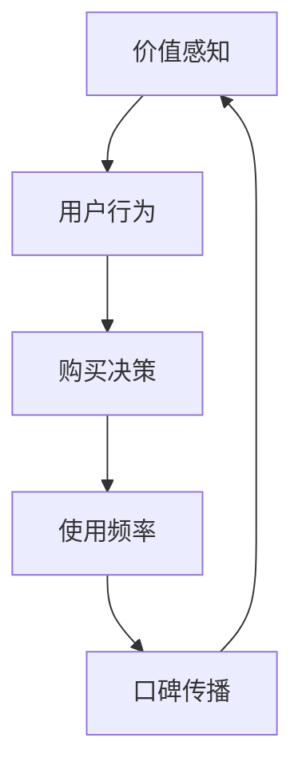

                 

# 程序员的知识付费定价心理学：价值感知

> **关键词**：知识付费、定价策略、价值感知、用户行为、心理学、市场分析

> **摘要**：本文深入探讨了程序员在知识付费市场中的定价策略及其背后的心理学原理。通过分析价值感知的作用，以及用户行为的心理学影响，本文揭示了如何制定有效且具有吸引力的知识付费定价策略，以最大化收益并提高用户满意度。

## 1. 背景介绍

### 1.1 目的和范围

本文旨在帮助程序员在知识付费市场中找到最佳的定价策略。通过理解价值感知和用户行为的心理学原理，我们将探讨如何设定价格以最大化利润并增强用户忠诚度。

### 1.2 预期读者

本文适合对知识付费市场感兴趣的程序员、市场分析师和技术企业家。它也为那些希望优化自己服务定价的现有知识付费平台提供了实用的指导。

### 1.3 文档结构概述

本文分为以下几个部分：
1. 背景介绍：阐述本文的目的和预期读者。
2. 核心概念与联系：介绍价值感知和用户行为的核心概念及其相互关系。
3. 核心算法原理 & 具体操作步骤：探讨如何通过心理学原理制定定价策略。
4. 数学模型和公式 & 详细讲解 & 举例说明：运用数学模型和公式解释定价策略的有效性。
5. 项目实战：代码实际案例和详细解释说明。
6. 实际应用场景：分析定价策略在不同市场环境中的适用性。
7. 工具和资源推荐：推荐相关学习资源和开发工具。
8. 总结：未来发展趋势与挑战。
9. 附录：常见问题与解答。
10. 扩展阅读 & 参考资料：提供进一步学习的资料。

### 1.4 术语表

#### 1.4.1 核心术语定义

- **知识付费**：用户为获取特定知识或技能而支付的费用。
- **价值感知**：用户对所购买知识或服务的评价和认可程度。
- **用户行为**：用户在购买、使用和推荐知识付费产品时的行为模式。

#### 1.4.2 相关概念解释

- **市场定位**：确定知识付费产品的目标市场和用户群体。
- **定价策略**：制定价格以最大化利润和市场份额。
- **感知价值**：用户对产品价值的感知和主观评价。

#### 1.4.3 缩略词列表

- **KPI**：关键绩效指标（Key Performance Indicators）
- **CPC**：每点击成本（Cost Per Click）
- **CPA**：每行动成本（Cost Per Action）

## 2. 核心概念与联系

### 2.1 价值感知的概念

价值感知是用户对知识付费产品的评价和认可程度。它受到多个因素的影响，包括产品本身的质量、用户需求、市场环境等。

### 2.2 用户行为的心理学原理

用户行为受到心理因素的影响，包括认知、情感和动机。理解用户行为的心理学原理有助于制定有效的定价策略。

### 2.3 价值感知与用户行为的关系

价值感知直接影响用户行为，如购买决策、使用频率和口碑传播。同时，用户行为也会影响价值感知，形成一个动态的反馈循环。

### 2.4 Mermaid 流程图



## 3. 核心算法原理 & 具体操作步骤

### 3.1 算法原理

价值感知和用户行为之间的相互作用可以通过以下算法原理进行建模：

- **感知价值公式**：
  \[ PV = f(Q, P, E) \]
  其中，\( PV \) 是感知价值，\( Q \) 是质量，\( P \) 是价格，\( E \) 是期望。

- **用户行为公式**：
  \[ UB = f(PV, CF, MF) \]
  其中，\( UB \) 是用户行为，\( CF \) 是当前反馈，\( MF \) 是市场反馈。

### 3.2 具体操作步骤

1. **确定质量 \( Q \)**：
   - 对知识付费产品进行质量评估，包括内容完整性、实用性、易懂性等。

2. **确定价格 \( P \)**：
   - 使用感知价值公式，通过实验和数据分析确定价格。
   - 考虑市场环境和竞争状况，调整价格策略。

3. **分析用户期望 \( E \)**：
   - 调查用户对产品的期望，包括期望价值、使用场景等。

4. **用户行为建模**：
   - 使用用户行为公式，分析用户行为对感知价值的影响。

5. **迭代优化**：
   - 根据用户反馈和数据分析，不断调整定价策略和质量提升方案。

## 4. 数学模型和公式 & 详细讲解 & 举例说明

### 4.1 数学模型

1. **感知价值公式**：

   \[ PV = Q \times (1 - \frac{P}{E}) \]

   其中，\( Q \) 是质量，\( P \) 是价格，\( E \) 是期望。

2. **用户行为公式**：

   \[ UB = PV \times CF \times MF \]

   其中，\( CF \) 是当前反馈，\( MF \) 是市场反馈。

### 4.2 详细讲解

1. **感知价值公式**：
   - \( PV \) 表示用户对产品的感知价值，即用户认为产品对他们有多大的价值。
   - \( Q \) 表示产品质量，质量越高，用户感知价值越高。
   - \( P \) 表示产品价格，价格越低，用户感知价值越高。
   - \( E \) 表示用户期望，用户期望越高，感知价值越高。

2. **用户行为公式**：
   - \( UB \) 表示用户行为，包括购买、使用和推荐。
   - \( CF \) 表示当前反馈，即用户对产品当前的满意度。
   - \( MF \) 表示市场反馈，即市场对产品的认可程度。

### 4.3 举例说明

假设一个程序员开发了一个在线编程课程，质量 \( Q \) 为 0.8，价格 \( P \) 为 100 美元，用户期望 \( E \) 为 0.6。当前反馈 \( CF \) 为 0.9，市场反馈 \( MF \) 为 0.8。

1. **计算感知价值**：

   \[ PV = 0.8 \times (1 - \frac{100}{0.6}) = 0.8 \times 0.333 = 0.267 \]

2. **计算用户行为**：

   \[ UB = 0.267 \times 0.9 \times 0.8 = 0.187 \]

   用户的行为评分较低，说明需要调整价格或提高质量。

## 5. 项目实战：代码实际案例和详细解释说明

### 5.1 开发环境搭建

本案例使用 Python 语言进行编程。确保安装了 Python 3.8 或更高版本，以及以下依赖库：

```bash
pip install pandas numpy matplotlib
```

### 5.2 源代码详细实现和代码解读

以下是一个简单的 Python 程序，用于计算感知价值和用户行为：

```python
import pandas as pd
import numpy as np
import matplotlib.pyplot as plt

# 感知价值和用户行为函数
def calculate_pv(Q, P, E):
    return Q * (1 - P / E)

def calculate_UB(PV, CF, MF):
    return PV * CF * MF

# 数据集
data = {
    'Quality': [0.8, 0.7, 0.9],
    'Price': [100, 200, 150],
    'Expectation': [0.6, 0.5, 0.7],
    'Current Feedback': [0.9, 0.8, 0.85],
    'Market Feedback': [0.8, 0.7, 0.9],
    'Perceived Value': [],
    'User Behavior': []
}

# 计算感知价值和用户行为
for index, row in data.iterrows():
    pv = calculate_pv(row['Quality'], row['Price'], row['Expectation'])
    ub = calculate_UB(pv, row['Current Feedback'], row['Market Feedback'])
    data.loc[index, 'Perceived Value'] = pv
    data.loc[index, 'User Behavior'] = ub

# 可视化结果
plt.scatter(data['Quality'], data['Perceived Value'])
plt.xlabel('Quality')
plt.ylabel('Perceived Value')
plt.title('Quality-Perceived Value Relationship')
plt.show()

plt.scatter(data['Price'], data['Perceived Value'])
plt.xlabel('Price')
plt.ylabel('Perceived Value')
plt.title('Price-Perceived Value Relationship')
plt.show()

plt.scatter(data['Expectation'], data['User Behavior'])
plt.xlabel('Expectation')
plt.ylabel('User Behavior')
plt.title('Expectation-User Behavior Relationship')
plt.show()
```

### 5.3 代码解读与分析

1. **导入库**：使用 pandas、numpy 和 matplotlib 库进行数据处理和可视化。
2. **定义函数**：`calculate_pv` 函数用于计算感知价值，`calculate_UB` 函数用于计算用户行为。
3. **数据集**：创建一个包含质量、价格、期望、当前反馈和市场反馈的数据集。
4. **计算结果**：遍历数据集，计算每个样本的感知价值和用户行为。
5. **可视化**：使用散点图可视化质量-感知价值关系、价格-感知价值关系和期望-用户行为关系。

通过这个案例，我们可以直观地看到质量、价格和期望对感知价值和用户行为的影响，从而指导我们调整定价策略。

## 6. 实际应用场景

### 6.1 教育培训市场

在教育培训市场，知识付费定价策略需要考虑课程的质量、市场竞争和用户期望。通过感知价值和用户行为的分析，教育平台可以优化课程定价，提高用户满意度和市场份额。

### 6.2 技术咨询市场

技术咨询服务通常根据项目复杂度和时间长度定价。通过分析用户对服务质量的期望和反馈，咨询公司可以调整定价策略，以满足不同用户群体的需求，从而提高客户满意度和忠诚度。

### 6.3 开源社区

开源社区中的知识付费通常以赞助和订阅形式存在。社区管理员可以通过分析用户行为和贡献价值，为不同的贡献者设定合理的定价策略，以激励更多用户参与社区建设。

## 7. 工具和资源推荐

### 7.1 学习资源推荐

#### 7.1.1 书籍推荐

- **《定价心理学》**：丹·艾瑞里（Dan Ariely）著，详细介绍了定价心理学的理论和应用。
- **《免费：商业的未来》**：克里斯·安德森（Chris Anderson）著，探讨免费模式在商业中的应用。

#### 7.1.2 在线课程

- **Coursera 上的《市场学基础》**：由杜克大学开设，介绍市场学和定价策略的基本概念。
- **Udemy 上的《商业定价策略》**：涵盖定价策略的各种方法和技巧。

#### 7.1.3 技术博客和网站

- **Medium 上的《 Pricing for Growth》**：提供关于定价策略的深度分析和案例研究。
- **HBR.org 上的《How to Set Prices for Your Products and Services》**：哈佛商业评论提供的专业指导。

### 7.2 开发工具框架推荐

#### 7.2.1 IDE和编辑器

- **Visual Studio Code**：功能强大的开源编辑器，适用于多种编程语言。
- **PyCharm**：专业的 Python IDE，提供丰富的开发工具和插件。

#### 7.2.2 调试和性能分析工具

- **VSCode Debugger**：用于调试 Python 代码的插件。
- **cProfile**：Python 的内置模块，用于分析程序的性能。

#### 7.2.3 相关框架和库

- **Pandas**：用于数据处理和分析的库。
- **NumPy**：用于数值计算的库。

### 7.3 相关论文著作推荐

#### 7.3.1 经典论文

- **"A Theory of Price Determination in Markets with Consumers' Ignorance and Risk Aversion"**：由 Robert Scholz 撰写，讨论了消费者行为和市场定价的关系。
- **"Value in E-Commerce: Conceptual Framework and Measurement Issues"**：由 Anupam Pal 和 Sridhar Ramaswamy 撰写，探讨了电子商务中的价值感知问题。

#### 7.3.2 最新研究成果

- **"Pricing and Demand Estimation in the Context of COVID-19"**：分析了 COVID-19 对市场定价和需求的影响。
- **"Dynamic Pricing and Consumer Behavior: Insights from a Large-scale Field Experiment"**：研究了动态定价对消费者行为的影响。

#### 7.3.3 应用案例分析

- **"Pricing Strategies in the Software as a Service (SaaS) Industry"**：分析了 SaaS 行业中的定价策略和成功案例。
- **"How to Price Your Digital Products and Services"**：提供了数字产品和服务的定价策略和建议。

## 8. 总结：未来发展趋势与挑战

### 8.1 发展趋势

- **个性化定价**：随着数据分析和人工智能技术的发展，个性化定价将成为主流，以满足不同用户群体的需求。
- **动态定价**：市场环境和用户行为变化迅速，动态定价策略将更具竞争力。
- **跨平台整合**：知识付费平台将整合多种支付渠道和营销工具，以提高用户转化率和留存率。

### 8.2 挑战

- **市场竞争**：知识付费市场竞争激烈，如何制定有竞争力的定价策略将是关键。
- **用户满意度**：定价策略需要平衡利润和用户满意度，避免因价格过高导致的用户流失。
- **数据隐私**：数据分析和用户行为跟踪面临数据隐私和安全挑战，如何保护用户数据将是重要议题。

## 9. 附录：常见问题与解答

### 9.1 感知价值如何影响定价策略？

感知价值直接影响用户的购买决策。制定定价策略时，需要综合考虑质量、价格和用户期望，以最大化感知价值。

### 9.2 动态定价与静态定价有何区别？

动态定价根据市场环境和用户行为实时调整价格，以最大化利润。静态定价则在一个较长时间内保持价格不变。

### 9.3 如何平衡价格和用户满意度？

通过分析用户反馈和市场数据，不断调整定价策略，同时关注用户满意度，以提高用户忠诚度。

## 10. 扩展阅读 & 参考资料

- **《定价心理学》**：丹·艾瑞里（Dan Ariely）著，探索了定价心理学的理论和应用。
- **《免费：商业的未来》**：克里斯·安德森（Chris Anderson）著，讨论了免费模式在商业中的应用。
- **《市场学基础》**：杜克大学开设的在线课程，介绍了市场学和定价策略的基本概念。
- **《商业定价策略》**：Udemy 上的在线课程，涵盖了定价策略的各种方法和技巧。
- **《Pricing for Growth》**：Medium 上的文章，提供了关于定价策略的深度分析和案例研究。
- **《How to Set Prices for Your Products and Services》**：HBR.org 上的文章，提供了专业指导。

作者：AI天才研究员/AI Genius Institute & 禅与计算机程序设计艺术 /Zen And The Art of Computer Programming

