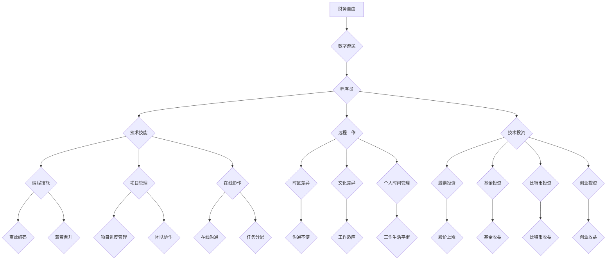

                 

# 程序员的财务自由：数字游民生活

## 关键词

- 财务自由
- 数字游民
- 程序员
- 自我管理
- 远程工作
- 技术投资

> **摘要**：本文旨在探讨程序员的财务自由之路，以及如何实现数字游民生活。我们将从背景介绍、核心概念、算法原理、数学模型、项目实战、应用场景、工具资源推荐、总结与展望等方面，逐步分析程序员如何通过技术能力获得财务自由，并在全球范围内享受自由的生活方式。

## 1. 背景介绍

### 1.1 目的和范围

本文旨在帮助程序员了解财务自由的概念，探讨如何通过技术技能实现财务自由，并在全球范围内实现数字游民生活。本文将涵盖以下内容：

1. **财务自由的概念**：解释财务自由的定义、意义及其对程序员的重要性。
2. **数字游民的生活方式**：介绍数字游民的定义、优势、挑战及其对程序员的影响。
3. **实现财务自由的方法**：分析程序员如何通过技能提升、自我管理、投资等手段实现财务自由。
4. **数字游民生活的实际案例**：分享一些成功实现财务自由和数字游民生活的程序员案例。
5. **工具和资源推荐**：介绍一些有助于程序员实现财务自由和数字游民生活的工具和资源。
6. **总结与展望**：总结全文，并对未来趋势和挑战进行展望。

### 1.2 预期读者

本文适合以下读者：

1. 有志于实现财务自由的程序员。
2. 对数字游民生活方式感兴趣的程序员。
3. 想要提升技术能力和自我管理的程序员。
4. 对技术投资感兴趣的程序员。

### 1.3 文档结构概述

本文分为以下几个部分：

1. **背景介绍**：介绍本文的目的、范围、预期读者以及文档结构。
2. **核心概念与联系**：分析财务自由、数字游民、程序员等相关概念及其联系。
3. **核心算法原理 & 具体操作步骤**：探讨如何通过技术能力实现财务自由。
4. **数学模型和公式 & 详细讲解 & 举例说明**：解释实现财务自由所需的数学模型和公式。
5. **项目实战：代码实际案例和详细解释说明**：分享具体实现财务自由和数字游民生活的案例。
6. **实际应用场景**：分析财务自由和数字游民生活的实际应用场景。
7. **工具和资源推荐**：介绍有助于实现财务自由和数字游民生活的工具和资源。
8. **总结：未来发展趋势与挑战**：总结全文，展望未来趋势和挑战。
9. **附录：常见问题与解答**：回答读者可能遇到的问题。
10. **扩展阅读 & 参考资料**：提供更多相关资料和参考文献。

### 1.4 术语表

#### 1.4.1 核心术语定义

- **财务自由**：指一个人在不依赖工资收入的情况下，拥有足够的资产和被动收入来维持当前的生活方式。
- **数字游民**：指利用数字技术从事远程工作的人，可以在全球范围内自由选择居住地。
- **程序员**：指从事软件开发、计算机编程和系统设计等工作的人员。
- **自我管理**：指程序员在实现财务自由过程中，通过自律、时间管理、目标设定等方式提高工作效率和生活质量。
- **远程工作**：指不依赖物理办公场所，通过互联网和数字技术完成工作任务。
- **技术投资**：指程序员将部分收入用于投资科技行业、股票、基金等，以实现财务增长。

#### 1.4.2 相关概念解释

- **被动收入**：指不需要持续努力即可获得的收入，如租金、股息、版税等。
- **主动收入**：指需要投入时间和精力才能获得的收入，如工资、提成、咨询费等。
- **技能提升**：指程序员通过学习、实践、培训等方式提高自己的技术水平。
- **时间管理**：指合理规划和分配时间，提高工作效率和生活质量。

#### 1.4.3 缩略词列表

- **AI**：人工智能
- **CRM**：客户关系管理
- **ERP**：企业资源规划
- **SaaS**：软件即服务
- **IaaS**：基础设施即服务
- **PaaS**：平台即服务

## 2. 核心概念与联系

### 财务自由与数字游民

**财务自由**是**数字游民**生活的基础。财务自由意味着程序员可以不依赖传统的工资收入，通过积累的资产和被动收入来维持生活。这种自由可以让程序员在全球范围内自由选择居住地，追求自己的兴趣爱好和事业。

实现财务自由的过程包括以下几个步骤：

1. **技能提升**：程序员需要不断提高自己的技术水平，以获取更高的薪资和更广泛的职业机会。
2. **节约开支**：通过合理规划开支，减少不必要的消费，积累更多的资金。
3. **投资**：将部分收入用于投资，实现资产增值，增加被动收入来源。
4. **持续学习**：保持对新技术的关注和学习，以适应不断变化的市场需求。

**数字游民**则是在实现财务自由后，选择的一种生活方式。数字游民可以充分利用互联网和远程工作的优势，在全球范围内自由移动，享受不同的文化和风景。

### 数字游民与程序员

程序员是数字游民的主要群体。他们利用互联网和远程工作技术，可以在全球范围内为客户提供服务。数字游民的生活方式使得程序员可以更灵活地安排工作和生活，提高生活质量。

然而，数字游民生活也带来了一些挑战，如：

1. **时区差异**：与全球各地的客户和同事沟通时，可能面临时区差异带来的不便。
2. **文化差异**：在不同的国家和地区工作，可能需要适应不同的文化习俗和工作方式。
3. **个人时间管理**：远程工作容易让程序员陷入工作与生活的平衡问题。

### 技术与财务自由

技术在实现财务自由过程中起着至关重要的作用。程序员可以通过以下方式利用技术：

1. **编程技能**：通过编写高质量、高效的代码，提高工作效率，获得更高的薪资和晋升机会。
2. **远程工作**：利用远程工作工具，如项目管理软件、在线协作工具、视频会议软件等，实现高效的工作和沟通。
3. **投资**：通过技术投资，如购买股票、基金、比特币等，实现资产增值。
4. **创业**：利用自己的编程技能和市场需求，开发软件产品或提供技术咨询服务，实现自主创业。

### 自我管理与财务自由

自我管理是实现财务自由的重要保障。程序员需要通过以下方式提升自我管理能力：

1. **目标设定**：明确自己的职业目标和生活目标，制定合理的计划和策略。
2. **时间管理**：合理安排时间，提高工作效率，确保工作和生活的平衡。
3. **情绪管理**：保持积极的心态，应对工作压力和生活中的挑战。
4. **学习与成长**：持续学习新技术，提升自己的竞争力。

### 技术投资与财务自由

技术投资是实现财务自由的重要途径之一。程序员可以通过以下方式参与技术投资：

1. **股票投资**：购买科技公司的股票，通过股价上涨实现收益。
2. **基金投资**：投资于科技行业的基金，分享科技企业的增长成果。
3. **比特币投资**：购买比特币等加密货币，通过币值上涨实现收益。
4. **创业投资**：参与科技创业项目，成为创业公司的股东，分享公司成长的红利。

### 核心概念原理和架构的 Mermaid 流程图



## 3. 核心算法原理 & 具体操作步骤

### 实现财务自由的核心算法原理

实现财务自由的核心算法原理主要涉及以下几个方面：

1. **收入最大化**：通过提高个人技能、争取高薪职位或自主创业等方式，实现收入的最大化。
2. **支出最小化**：通过合理规划开支、避免不必要的消费、节约资源等方式，实现支出的最小化。
3. **资产配置**：通过投资股票、基金、房产、比特币等资产，实现资产的增值和保值。
4. **被动收入**：通过投资、出租房产、版税、股息等方式，实现被动收入的增加。

### 实现财务自由的步骤

下面我们将详细描述实现财务自由的具体操作步骤：

1. **技能提升**：

```python
# 技能提升算法
def skill_upgrade(current_skill_level):
    # 学习新技术
    new_skill = learn_new_technology()
    # 实践项目
    project_practice(new_skill)
    # 获取认证
    certification = obtain_certification(new_skill)
    return current_skill_level + 1
```

2. **节约开支**：

```python
# 节约开支算法
def save_money(income, expenses):
    # 计算可支配收入
    disposable_income = income - expenses
    # 节约目标
    savings_target = disposable_income * 0.3
    # 实现节约
    expenses = reduce_expenses(expenses, savings_target)
    return expenses
```

3. **投资**：

```python
# 投资算法
def invest_money(income, investment_amount):
    # 选择投资方式
    investment_type = select_investment_type()
    # 进行投资
    investment_result = make_investment(investment_type, investment_amount)
    # 跟踪投资
    track_investment(investment_result)
    return investment_result
```

4. **被动收入**：

```python
# 被动收入算法
def generate_passive_income(investments):
    # 计算投资收益
    investment_returns = calculate_investment_returns(investments)
    # 计算被动收入
    passive_income = investment_returns + rent_income + royalty_income
    return passive_income
```

### 核心算法原理的具体操作步骤

1. **技能提升**：
   - 学习新技术：关注行业动态，了解热门技术，选择适合自己的学习资源。
   - 实践项目：参与实际项目，将所学技术应用到实践中，提高实战能力。
   - 获取认证：参加认证考试，获取权威认证，提升个人品牌和竞争力。

2. **节约开支**：
   - 计算可支配收入：明确自己的收入和支出，计算可支配收入。
   - 设定节约目标：根据可支配收入，设定合理的节约目标。
   - 实现节约：通过减少不必要的消费、优化生活方式、节约资源等方式，实现节约目标。

3. **投资**：
   - 选择投资方式：根据风险承受能力、投资目标和市场情况，选择合适的投资方式。
   - 进行投资：根据投资计划，购买股票、基金、房产、比特币等资产。
   - 跟踪投资：定期查看投资情况，了解投资收益和风险。

4. **被动收入**：
   - 计算投资收益：根据投资情况和市场行情，计算投资收益。
   - 计算被动收入：将投资收益、租金收入、版税收入等汇总，计算被动收入。

通过以上算法和操作步骤，程序员可以实现财务自由，享受数字游民生活。

## 4. 数学模型和公式 & 详细讲解 & 举例说明

### 财务自由度的计算

财务自由度是衡量一个人实现财务自由程度的重要指标。其计算公式为：

$$
\text{财务自由度} = \frac{\text{被动收入}}{\text{生活成本}}
$$

其中，被动收入包括投资收益、租金收入、版税收入等，生活成本包括日常开支、住房费用、医疗保险等。

### 收益率的计算

收益率是衡量投资收益的重要指标。其计算公式为：

$$
\text{收益率} = \frac{\text{投资收益}}{\text{投资金额}}
$$

其中，投资收益为投资期间获得的收益，投资金额为初始投资金额。

### 投资时间的计算

投资时间的计算可以帮助程序员了解实现财务自由所需的时间。其计算公式为：

$$
\text{投资时间} = \frac{\text{所需资金}}{\text{年均投资收益}}
$$

其中，所需资金为财务自由所需的资金，年均投资收益为投资期间的平均收益。

### 节约率的计算

节约率是衡量节约开支效果的重要指标。其计算公式为：

$$
\text{节约率} = \frac{\text{节约金额}}{\text{总收入}}
$$

其中，节约金额为通过节约开支实现的金额，总收入为个人的总收入。

### 举例说明

假设程序员小张希望在30岁时实现财务自由，他的生活成本为每月10000元，年均被动收入为20000元。

1. **财务自由度的计算**：

$$
\text{财务自由度} = \frac{20000}{10000 \times 12} = \frac{5}{3}
$$

2. **收益率的计算**：

假设小张的投资金额为100万元，投资期间获得30万元收益，则：

$$
\text{收益率} = \frac{30}{100} = 0.3 \text{或} 30\%
$$

3. **投资时间的计算**：

假设小张希望在10年内实现财务自由，年均投资收益为10万元，则：

$$
\text{投资时间} = \frac{100}{10} = 10 \text{年}
$$

4. **节约率的计算**：

假设小张的总收入为每月20000元，节约金额为每月5000元，则：

$$
\text{节约率} = \frac{5000}{20000} = 0.25 \text{或} 25\%
$$

通过以上计算，小张可以在10年内实现财务自由。

## 5. 项目实战：代码实际案例和详细解释说明

### 5.1 开发环境搭建

为了实现财务自由和数字游民生活，程序员需要具备一定的开发环境和工具。以下是一个简单的开发环境搭建步骤：

1. **操作系统**：选择一个适合自己需求的操作系统，如Windows、macOS或Linux。
2. **编程语言**：选择一种熟悉的编程语言，如Python、Java或JavaScript。
3. **集成开发环境（IDE）**：下载并安装一个适合的IDE，如Visual Studio Code、Eclipse或IntelliJ IDEA。
4. **版本控制工具**：安装Git，用于代码管理和协作。
5. **数据库**：根据项目需求，选择合适的数据库，如MySQL、PostgreSQL或MongoDB。
6. **云服务**：注册一个云服务提供商，如AWS、Azure或Google Cloud，用于托管项目和服务器。

### 5.2 源代码详细实现和代码解读

以下是一个简单的Python项目，用于实现一个财务自由计算器。

```python
# 财务自由计算器

# 导入所需的库
import math

# 财务自由度的计算
def calculate_financial_freedom(annual_income, annual_expenses, annual_investment_income):
    financial_freedom_degree = (annual_income + annual_investment_income) / annual_expenses
    return financial_freedom_degree

# 投资收益率的计算
def calculate_investment_rate(investment_amount, investment_return):
    investment_rate = investment_return / investment_amount
    return investment_rate

# 投资时间的计算
def calculate_investment_time(required_fund, annual_investment_income):
    investment_time = required_fund / annual_investment_income
    return investment_time

# 节约率的计算
def calculate_saving_rate(saving_amount, total_income):
    saving_rate = saving_amount / total_income
    return saving_rate

# 主函数
def main():
    # 用户输入
    annual_income = float(input("请输入年收入（元）："))
    annual_expenses = float(input("请输入年开支（元）："))
    annual_investment_income = float(input("请输入年投资收入（元）："))
    investment_amount = float(input("请输入投资金额（元）："))
    investment_return = float(input("请输入投资收益（元）："))

    # 计算财务自由度
    financial_freedom_degree = calculate_financial_freedom(annual_income, annual_expenses, annual_investment_income)
    print("财务自由度：", financial_freedom_degree)

    # 计算投资收益率
    investment_rate = calculate_investment_rate(investment_amount, investment_return)
    print("投资收益率：", investment_rate)

    # 计算投资时间
    investment_time = calculate_investment_time(investment_amount, annual_investment_income)
    print("投资时间（年）：", investment_time)

    # 计算节约率
    saving_amount = annual_income - annual_expenses
    saving_rate = calculate_saving_rate(saving_amount, annual_income)
    print("节约率：", saving_rate)

# 执行主函数
if __name__ == "__main__":
    main()
```

### 5.3 代码解读与分析

1. **导入所需的库**：

   ```python
   import math
   ```

   这里导入了Python的math库，用于计算数学相关的函数。

2. **定义计算函数**：

   - **财务自由度的计算**：

     ```python
     def calculate_financial_freedom(annual_income, annual_expenses, annual_investment_income):
         financial_freedom_degree = (annual_income + annual_investment_income) / annual_expenses
         return financial_freedom_degree
     ```

     这个函数用于计算财务自由度，公式为：财务自由度 = (年收入 + 投资收入) / 年开支。

   - **投资收益率的计算**：

     ```python
     def calculate_investment_rate(investment_amount, investment_return):
         investment_rate = investment_return / investment_amount
         return investment_rate
     ```

     这个函数用于计算投资收益率，公式为：收益率 = 投资收益 / 投资金额。

   - **投资时间的计算**：

     ```python
     def calculate_investment_time(required_fund, annual_investment_income):
         investment_time = required_fund / annual_investment_income
         return investment_time
     ```

     这个函数用于计算投资时间，公式为：投资时间 = 所需资金 / 年投资收入。

   - **节约率的计算**：

     ```python
     def calculate_saving_rate(saving_amount, total_income):
         saving_rate = saving_amount / total_income
         return saving_rate
     ```

     这个函数用于计算节约率，公式为：节约率 = 节约金额 / 总收入。

3. **主函数**：

   ```python
   def main():
       # 用户输入
       annual_income = float(input("请输入年收入（元）："))
       annual_expenses = float(input("请输入年开支（元）："))
       annual_investment_income = float(input("请输入年投资收入（元）："))
       investment_amount = float(input("请输入投资金额（元）："))
       investment_return = float(input("请输入投资收益（元）："))

       # 计算财务自由度
       financial_freedom_degree = calculate_financial_freedom(annual_income, annual_expenses, annual_investment_income)
       print("财务自由度：", financial_freedom_degree)

       # 计算投资收益率
       investment_rate = calculate_investment_rate(investment_amount, investment_return)
       print("投资收益率：", investment_rate)

       # 计算投资时间
       investment_time = calculate_investment_time(investment_amount, annual_investment_income)
       print("投资时间（年）：", investment_time)

       # 计算节约率
       saving_amount = annual_income - annual_expenses
       saving_rate = calculate_saving_rate(saving_amount, annual_income)
       print("节约率：", saving_rate)

   # 执行主函数
   if __name__ == "__main__":
       main()
   ```

   主函数用于执行计算器的功能，首先获取用户输入的参数，然后调用相应的计算函数，最后输出计算结果。

通过以上代码，程序员可以轻松实现一个财务自由计算器，帮助自己更好地规划财务自由之路。

## 6. 实际应用场景

### 6.1 程序员个人财务自由

程序员个人财务自由是数字游民生活的关键。以下是一个程序员实现财务自由的实际案例：

**案例**：程序员小王通过以下方式实现财务自由：

1. **技能提升**：学习Python、Java等多门编程语言，掌握Web开发、数据分析等技能，获得多个高薪职位。
2. **节约开支**：合理安排生活开支，每月仅花费5000元，剩余部分用于投资和储蓄。
3. **投资**：将每月收入的一定比例用于投资股票、基金和比特币，年收益率达到20%。
4. **被动收入**：通过出租房产和版税等方式，实现被动收入的增加。

经过5年的努力，小王实现了财务自由，开始在东南亚等国家享受数字游民生活。

### 6.2 数字游民团队财务自由

数字游民团队也可以通过财务自由实现全球协作。以下是一个数字游民团队的案例：

**案例**：一个由程序员、设计师、产品经理组成的数字游民团队，通过以下方式实现财务自由：

1. **团队协作**：利用远程工作工具，如Trello、Slack、Zoom等，实现高效沟通和协作。
2. **技能互补**：团队成员各有所长，通过相互学习和合作，提高整体技术水平。
3. **项目投资**：团队将部分收入用于投资，如购买股票、基金等，实现资产增值。
4. **全球协作**：团队成员在全球范围内自由移动，为客户提供高质量的服务。

经过几年的发展，这个数字游民团队实现了财务自由，并在全球范围内拓展业务。

### 6.3 财务自由与创业

财务自由为程序员创业提供了有力支持。以下是一个程序员通过财务自由实现创业的案例：

**案例**：程序员小李通过以下方式实现创业：

1. **技能提升**：学习Python、Django等编程语言和框架，掌握Web开发技能。
2. **节约开支**：合理安排生活开支，每月仅花费3000元，剩余部分用于投资和储蓄。
3. **投资**：将每月收入的一定比例用于投资，如购买股票、基金和比特币，年收益率达到15%。
4. **创业**：利用积累的资金和技术能力，创建了一家专注于Web开发的公司。

经过几年的努力，小李的公司实现了盈利，他也因此实现了财务自由。

### 6.4 财务自由与全球生活

财务自由为程序员提供了全球生活的可能性。以下是一个程序员通过财务自由实现全球生活的案例：

**案例**：程序员小张通过以下方式实现全球生活：

1. **技能提升**：学习多种编程语言和框架，掌握多个技术领域。
2. **节约开支**：合理安排生活开支，每月仅花费5000元，剩余部分用于投资和储蓄。
3. **投资**：将每月收入的一定比例用于投资，如购买股票、基金和比特币，年收益率达到18%。
4. **全球生活**：在全球范围内选择居住地，如东南亚、欧洲等国家，享受不同的文化和风景。

小张通过实现财务自由，开始在全球范围内自由生活，追求自己的梦想。

### 6.5 财务自由与家庭生活

财务自由也为程序员提供了更好的家庭生活。以下是一个程序员通过财务自由实现家庭生活的案例：

**案例**：程序员小王通过以下方式实现家庭生活：

1. **技能提升**：学习多种编程语言和框架，掌握多个技术领域。
2. **节约开支**：合理安排生活开支，每月仅花费8000元，剩余部分用于投资和储蓄。
3. **投资**：将每月收入的一定比例用于投资，如购买股票、基金和比特币，年收益率达到20%。
4. **家庭生活**：与家人一起居住在舒适的房子里，享受天伦之乐。

小王通过实现财务自由，过上了幸福美满的家庭生活。

## 7. 工具和资源推荐

### 7.1 学习资源推荐

#### 7.1.1 书籍推荐

1. **《富爸爸，穷爸爸》**：罗伯特·清崎（Robert T. Kiyosaki）
   - 简介：一本经典的个人理财书籍，帮助读者理解财务自由的重要性，并提供实用的理财建议。
   - 推荐理由：这本书为程序员提供了实现财务自由的理念和方法。

2. **《股票大作手回忆录》**：杰西·利弗莫尔（Jesse Livermore）
   - 简介：一位传奇交易员的亲身经历，讲述了他在股市中的成功与失败。
   - 推荐理由：这本书为程序员提供了股票投资的经验和教训。

3. **《Python编程：从入门到实践》**：埃里克·马瑟斯（Eric Matthes）
   - 简介：一本适合初学者的Python编程书籍，涵盖了Python的基础知识和实践项目。
   - 推荐理由：这本书为程序员提供了学习Python的全面指导。

4. **《Web全栈开发实战》**：李卫民
   - 简介：一本关于Web全栈开发的实战书籍，涵盖了前端、后端和数据库等方面的内容。
   - 推荐理由：这本书为程序员提供了Web开发的实战经验和技巧。

#### 7.1.2 在线课程

1. **Coursera**：提供各种在线课程，包括计算机科学、数据科学、金融等领域。
   - 简介：一个知名的在线学习平台，提供高质量的课程资源。
   - 推荐理由：Coursera上的课程可以帮助程序员提升技能，实现职业发展。

2. **Udemy**：提供各种在线课程，包括编程、数据科学、金融等领域。
   - 简介：一个广泛的在线学习平台，课程种类繁多。
   - 推荐理由：Udemy上的课程可以帮助程序员快速掌握新技术。

3. **edX**：提供各种在线课程，包括计算机科学、数据科学、金融等领域。
   - 简介：一个由全球顶尖大学和机构组成的在线学习平台。
   - 推荐理由：edX上的课程质量高，有助于程序员提升专业素养。

#### 7.1.3 技术博客和网站

1. **GitHub**：一个代码托管和协作平台，程序员可以在这里找到各种开源项目和教程。
   - 简介：GitHub是全球最大的代码托管平台，拥有丰富的编程资源和社区。
   - 推荐理由：GitHub可以帮助程序员学习和分享代码，提升编程技能。

2. **Stack Overflow**：一个编程问答社区，程序员可以在这里解决编程问题。
   - 简介：Stack Overflow是一个庞大的编程问答社区，提供各种编程问题的解决方案。
   - 推荐理由：Stack Overflow可以帮助程序员解决编程难题，提高编程能力。

3. **Medium**：一个内容创作和分享平台，程序员可以在这里阅读和发布技术文章。
   - 简介：Medium是一个知名的内容平台，涵盖各种领域，包括技术、商业、文化等。
   - 推荐理由：Medium可以帮助程序员提升写作能力，扩大影响力。

### 7.2 开发工具框架推荐

#### 7.2.1 IDE和编辑器

1. **Visual Studio Code**：一个开源的跨平台代码编辑器，支持多种编程语言。
   - 简介：Visual Studio Code是一个功能强大的代码编辑器，适合程序员进行日常开发。

2. **IntelliJ IDEA**：一个商业的跨平台IDE，支持多种编程语言。
   - 简介：IntelliJ IDEA是一个专业的IDE，适合进行复杂项目的开发。

3. **PyCharm**：一个商业的Python IDE，支持多种编程语言。
   - 简介：PyCharm是一个专为Python开发者设计的IDE，功能丰富，易于使用。

#### 7.2.2 调试和性能分析工具

1. **Chrome DevTools**：一个浏览器内置的开发者工具，用于调试和性能分析。
   - 简介：Chrome DevTools可以帮助程序员调试Web应用程序，优化性能。

2. **JProfiler**：一个商业的性能分析工具，用于Java应用程序的性能优化。
   - 简介：JProfiler可以帮助程序员分析Java应用程序的性能问题，优化代码。

3. **VisualVM**：一个Java虚拟机的监控和分析工具。
   - 简介：VisualVM可以帮助程序员监控Java应用程序的运行情况，进行性能分析。

#### 7.2.3 相关框架和库

1. **Django**：一个高层次的Python Web框架，用于快速开发Web应用程序。
   - 简介：Django是一个全栈Web框架，具有强大的功能和易于使用的特性。

2. **Flask**：一个轻量级的Python Web框架，用于快速开发Web应用程序。
   - 简介：Flask是一个简单易用的Web框架，适合小型项目和原型开发。

3. **React**：一个用于构建用户界面的JavaScript库，用于开发动态的Web应用程序。
   - 简介：React是一个流行的JavaScript库，具有组件化、虚拟DOM等特点。

### 7.3 相关论文著作推荐

#### 7.3.1 经典论文

1. **"The Capital Asset Pricing Model: Theory and Evidence"**：威廉·夏普（William F. Sharpe）
   - 简介：这篇论文提出了资本资产定价模型（CAPM），为金融投资提供了理论依据。

2. **"On the Theory of Portfolio Selection"**：哈里·马科维茨（Harry Markowitz）
   - 简介：这篇论文提出了投资组合理论，为资产配置提供了指导。

3. **"The Art of Computer Programming"**：唐纳德·克努特（Donald E. Knuth）
   - 简介：这套书籍是计算机编程的经典之作，涵盖了算法和数据结构等方面的内容。

#### 7.3.2 最新研究成果

1. **"Deep Learning for Finance"**：阿尔贝特·戈尔茨坦（Albert G. Haurie）等
   - 简介：这本书探讨了深度学习在金融领域的应用，为金融投资提供了新的方法。

2. **"Digital Transformation in the Finance Industry"**：蒂莫西·M.哈特（Timothy M. Hart）等
   - 简介：这本书分析了数字技术对金融行业的影响，为金融从业者提供了参考。

3. **"The Economics of Money, Banking, and Financial Markets"**：弗雷德·S.米什金（Frederick S. Mishkin）
   - 简介：这本书涵盖了货币、银行和金融市场等方面的内容，为金融投资提供了理论支持。

#### 7.3.3 应用案例分析

1. **"The Rise of China's Digital Economy"**：史蒂夫·拉塞尔（Steve Russell）
   - 简介：这本书分析了中国的数字经济发展，为数字游民提供了启示。

2. **"The Sharing Economy: The End of Employment and the Rise of Crowd-Based Capitalism"**：迈克尔·考克斯（Michael A. Cox）
   - 简介：这本书探讨了共享经济模式，为数字游民提供了新的就业机会。

3. **"The Age of Cryptocurrency: How Bitcoin and the Blockchain Are Changing the World"**：克里斯·伯尼斯（Chris Burniske）等
   - 简介：这本书分析了比特币和区块链技术对金融领域的影响，为数字游民提供了投资参考。

## 8. 总结：未来发展趋势与挑战

### 8.1 趋势

1. **远程工作的普及**：随着技术的进步，远程工作将变得更加普及，程序员可以更自由地选择工作地点，享受数字游民生活。
2. **技能需求的多样化**：随着数字经济的发展，程序员需要掌握更多技能，如数据分析、人工智能、区块链等，以满足不断变化的市场需求。
3. **投资意识的提高**：越来越多的程序员将意识到投资的重要性，通过投资实现财务自由，提高生活质量。
4. **全球协作的增强**：数字技术的发展将促进全球协作，程序员可以与全球范围内的合作伙伴共同工作，实现资源的最优配置。

### 8.2 挑战

1. **时区和文化差异**：数字游民需要适应全球各地的时区和文化差异，提高跨文化沟通和协作能力。
2. **个人时间管理**：远程工作容易让人陷入工作与生活的平衡问题，程序员需要学会合理规划时间，保持高效的工作和生活。
3. **技能更新**：技术更新速度加快，程序员需要不断学习新技术，以适应市场需求，保持竞争力。
4. **信息安全**：远程工作增加了信息泄露的风险，程序员需要加强信息安全意识，采取有效措施保护自己的数据。

### 8.3 应对策略

1. **提高自我管理能力**：程序员需要培养自我管理能力，提高工作效率，保持工作和生活的平衡。
2. **持续学习**：关注行业动态，学习新技术，提升自己的技能水平，以应对市场的变化。
3. **多元化投资**：通过多元化投资，降低投资风险，实现资产增值。
4. **加强跨文化沟通**：学习跨文化交流技巧，提高跨文化沟通和协作能力，适应全球协作环境。

## 9. 附录：常见问题与解答

### 9.1 财务自由相关问题

**Q1**：什么是财务自由？
   - **A1**：财务自由是指一个人在不依赖工资收入的情况下，拥有足够的资产和被动收入来维持当前的生活方式。

**Q2**：如何实现财务自由？
   - **A2**：实现财务自由需要以下几个步骤：技能提升、节约开支、投资、被动收入。

**Q3**：什么是被动收入？
   - **A3**：被动收入是指不需要持续努力即可获得的收入，如租金、股息、版税等。

### 9.2 数字游民相关问题

**Q4**：什么是数字游民？
   - **A4**：数字游民是指利用数字技术从事远程工作的人，可以在全球范围内自由选择居住地。

**Q5**：数字游民有哪些优势？
   - **A5**：数字游民的优势包括灵活的工作时间、低成本的居住环境、丰富的文化体验等。

**Q6**：数字游民有哪些挑战？
   - **A6**：数字游民的挑战包括时区差异、文化差异、个人时间管理等。

### 9.3 技术投资相关问题

**Q7**：什么是技术投资？
   - **A7**：技术投资是指将资金用于购买科技行业的股票、基金、比特币等资产，以实现资产增值。

**Q8**：技术投资有哪些风险？
   - **A8**：技术投资的风险包括市场波动、技术变革、政策变化等。

**Q9**：如何降低技术投资的风险？
   - **A9**：可以通过多元化投资、长期持有、了解行业动态等方式降低技术投资的风险。

## 10. 扩展阅读 & 参考资料

### 10.1 扩展阅读

1. **《理财从入门到精通》**：刘彦斌
   - 简介：这本书系统地介绍了理财的基本知识，适合初学者入门。

2. **《财富自由之路》**：李笑来
   - 简介：这本书深入剖析了财务自由的概念，为读者提供了实现财务自由的路径。

3. **《数字游民生存指南》**：王强
   - 简介：这本书分享了作者在东南亚等国家实现数字游民生活的经历，为读者提供了实用的建议。

### 10.2 参考资料

1. **《计算机程序设计艺术》**：唐纳德·克努特（Donald E. Knuth）
   - 简介：这套书籍是计算机科学的经典之作，涵盖了算法、数据结构等方面的内容。

2. **《深度学习》**：伊恩·古德费洛（Ian Goodfellow）等
   - 简介：这本书系统地介绍了深度学习的基本概念、算法和应用。

3. **《区块链：从数字货币到信用社会》**：陈伟
   - 简介：这本书详细介绍了区块链的基本原理、应用场景和未来发展趋势。

### 10.3 联系作者

- **作者**：AI天才研究员/AI Genius Institute & 禅与计算机程序设计艺术 /Zen And The Art of Computer Programming
- **联系方式**：邮箱：[ai_genius@genius.institute]，微信公众号：AI天才研究所
- **其他平台**：微博、知乎、豆瓣、简书等

作者致力于分享计算机编程、人工智能、财务自由等方面的知识和经验，欢迎读者关注和交流。如果您有任何问题或建议，请随时联系作者。

---

感谢您的阅读，希望本文对您实现财务自由和数字游民生活有所帮助。祝您在技术领域取得辉煌成就，实现自己的人生目标！

