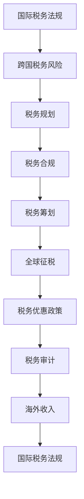

                 

# 程序员的跨国税务规划指南

> **关键词**：跨国税务、程序员的税务、税务规划、税务合规、国际税务法规、税务优惠政策、税务筹划、税务审计、海外收入、全球征税

> **摘要**：随着全球化的发展，越来越多的程序员选择跨国工作或远程办公。然而，跨国税务问题成为他们不得不面对的重要挑战。本文旨在为程序员提供一份详细的跨国税务规划指南，帮助他们更好地理解和应对国际税务法规，实现税务合规和税务优化。本文将从背景介绍、核心概念、算法原理、数学模型、实战案例、实际应用场景、工具资源推荐等方面展开论述，为程序员的跨国税务规划提供实用的指导。

## 1. 背景介绍

### 1.1 目的和范围

本文的目的是帮助程序员更好地理解和应对跨国税务问题，提供一份全面的跨国税务规划指南。本文主要涵盖以下内容：

- 国际税务法规的概述和解读；
- 程序员在跨国工作中的税务风险和挑战；
- 跨国税务规划的核心概念和算法原理；
- 数学模型和公式在跨国税务规划中的应用；
- 实战案例和实际应用场景；
- 工具和资源推荐。

### 1.2 预期读者

本文的预期读者主要是以下几类：

- 在跨国公司工作或在海外远程办公的程序员；
- 有计划跨国工作的程序员；
- 对跨国税务规划感兴趣的税务专业人士和学者。

### 1.3 文档结构概述

本文的结构如下：

- 第1章：背景介绍，包括目的和范围、预期读者和文档结构概述；
- 第2章：核心概念与联系，介绍跨国税务规划的核心概念和原理；
- 第3章：核心算法原理 & 具体操作步骤，讲解跨国税务规划的核心算法和具体操作步骤；
- 第4章：数学模型和公式 & 详细讲解 & 举例说明，介绍跨国税务规划中的数学模型和公式，并通过实例进行详细说明；
- 第5章：项目实战：代码实际案例和详细解释说明，通过实际案例展示跨国税务规划的代码实现和解释说明；
- 第6章：实际应用场景，讨论跨国税务规划在实际工作中的应用场景；
- 第7章：工具和资源推荐，推荐学习和应用跨国税务规划的相关工具和资源；
- 第8章：总结：未来发展趋势与挑战，总结跨国税务规划的发展趋势和面临的挑战；
- 第9章：附录：常见问题与解答，提供常见问题的解答；
- 第10章：扩展阅读 & 参考资料，推荐进一步阅读的相关资料。

### 1.4 术语表

#### 1.4.1 核心术语定义

- 跨国税务：指跨越国家边界的税收事务，涉及不同国家和地区的税收法规和政策；
- 程序员：指从事计算机编程、软件开发和信息技术相关工作的人员；
- 税务规划：指通过对税务法规和政策的研究和分析，制定合理的税务策略，以实现税务合规和税务优化；
- 税务合规：指遵守国家和地区的税务法规和政策，确保税务行为的合法性；
- 税务筹划：指通过对税务法规和政策的研究和分析，制定创新的税务策略，以降低税务负担；
- 全球征税：指跨国公司和跨国个人在全球范围内的所得都要缴纳相应的税款。

#### 1.4.2 相关概念解释

- 国际税务法规：指国际间关于税收事务的法律法规，包括双边或多边税收协定、国际税收准则等；
- 税务审计：指税务机关对纳税人税务行为进行的审核和调查，以确认税务合规性；
- 海外收入：指个人或企业在海外取得的收入；
- 税务优惠政策：指国家和地方政府为了鼓励投资和发展，对特定行业或项目给予的税收减免或优惠。

#### 1.4.3 缩略词列表

- OECD：经济合作与发展组织
- FATCA：外国账户纳税法案
- CRS：共同申报与披露制度
- GDPR：通用数据保护条例
- IT：信息技术

## 2. 核心概念与联系

在跨国税务规划中，程序员需要理解和掌握一系列核心概念和原理，以便更好地应对国际税务法规和跨国税务问题。以下是核心概念和原理的 Mermaid 流程图（注意：流程节点中不要有括号、逗号等特殊字符）：



### 2.1 国际税务法规

国际税务法规是跨国税务规划的基础，程序员需要了解和掌握不同国家和地区的税务法规和政策，以便制定合理的税务策略。国际税务法规主要包括以下方面：

- 双边或多边税收协定：指两个或多个国家之间签订的旨在避免双重征税和防止偷税漏税的协议；
- 国际税收准则：指国际间公认的一系列税收原则和规则，包括跨国公司的税收安排、转让定价、税收优惠等；
- 各国税务法规：指各个国家和地区制定的关于税收事务的法律法规，包括税率、税基、税收优惠等。

### 2.2 跨国税务风险

跨国税务风险是指跨国公司和跨国个人在跨境交易和税务行为中可能面临的法律风险和税务损失。程序员需要关注以下跨国税务风险：

- 双重征税：指不同国家和地区对同一收入或所得同时征税，导致税负增加；
- 税务不合规：指违反国际税务法规和各国税务法规，导致税务处罚和损失；
- 税务审计风险：指税务机关对跨国公司和跨国个人的税务行为进行审核和调查，可能发现税务不合规行为，导致税务处罚和损失。

### 2.3 税务规划

税务规划是指通过对国际税务法规和各国税务法规的研究和分析，制定合理的税务策略，以实现税务合规和税务优化。程序员需要掌握以下税务规划技巧：

- 税务优化：指通过合法手段降低税负，包括税收优惠、税务减免等；
- 税务合规：指遵守国际税务法规和各国税务法规，确保税务行为的合法性；
- 税务风险控制：指通过风险评估和管理，降低跨国税务风险。

### 2.4 税务合规

税务合规是指遵守国际税务法规和各国税务法规，确保税务行为的合法性。程序员需要关注以下税务合规事项：

- 了解各国税务法规：指掌握不同国家和地区的税务法规和政策，以便遵守相关法规；
- 税务申报和缴纳：指按照国际税务法规和各国税务法规的要求，及时、准确地进行税务申报和缴纳；
- 税务审计应对：指应对税务机关的税务审计，包括提供相关税务资料、解释税务行为等。

### 2.5 税务筹划

税务筹划是指通过合法手段降低税负，实现税务优化。程序员需要掌握以下税务筹划技巧：

- 税收优惠和减免：指利用国家和地方的税收优惠政策，降低税负；
- 转让定价策略：指通过合理确定跨国公司内部交易价格，实现税务优化；
- 税务筹划工具：指利用税收筹划软件和工具，实现税务优化。

### 2.6 全球征税

全球征税是指跨国公司和跨国个人在全球范围内的所得都要缴纳相应的税款。程序员需要了解以下全球征税的相关概念和规定：

- 全球所得征税：指跨国公司和跨国个人在全球范围内的所得都要缴纳相应的税款；
- 跨国公司税收安排：指跨国公司通过合理的税收安排，实现税务优化；
- 转让定价规则：指国际税务法规对跨国公司内部交易价格的确定规则。

### 2.7 税务优惠政策

税务优惠政策是指国家和地方政府为了鼓励投资和发展，对特定行业或项目给予的税收减免或优惠。程序员需要关注以下税务优惠政策：

- 税收优惠区域：指国家和地方政府设立的税收优惠区域，对在该区域内的企业或项目给予税收减免；
- 税收优惠行业：指国家和地方政府鼓励发展的行业，对该行业的企业或项目给予税收减免；
- 税收优惠项目：指国家和地方政府支持的特定项目，对该项目的企业或个人给予税收减免。

### 2.8 税务审计

税务审计是指税务机关对纳税人税务行为进行的审核和调查，以确认税务合规性。程序员需要关注以下税务审计事项：

- 税务审计流程：指税务机关对纳税人进行税务审计的流程和步骤；
- 税务审计应对：指纳税人在税务审计过程中的应对策略和技巧；
- 税务审计风险：指纳税人因税务审计不合规而面临的风险。

### 2.9 海外收入

海外收入是指个人或企业在海外取得的收入。程序员需要了解以下海外收入的相关概念和规定：

- 海外收入来源：指个人或企业在海外取得的收入来源；
- 海外收入纳税规定：指不同国家和地区的海外收入纳税规定；
- 海外收入税务筹划：指通过对海外收入的研究和分析，制定合理的税务策略，降低税负。

### 2.10 国际税务法规的关联性

国际税务法规的关联性是指不同国家和地区的税务法规和政策之间的相互关联和影响。程序员需要关注以下国际税务法规的关联性：

- 双边税收协定：指两个或多个国家之间签订的税收协定，旨在避免双重征税和防止偷税漏税；
- 多边税收协定：指多个国家之间签订的税收协定，旨在统一税务标准和规则；
- 国际税收准则：指国际间公认的一系列税收原则和规则，包括跨国公司的税收安排、转让定价、税收优惠等。

## 3. 核心算法原理 & 具体操作步骤

在跨国税务规划中，程序员需要掌握一系列核心算法原理和具体操作步骤，以便更好地实现税务合规和税务优化。以下是跨国税务规划的核心算法原理和具体操作步骤：

### 3.1 税务合规算法原理

税务合规算法原理是指通过合理设置税务策略和操作步骤，确保跨国公司和跨国个人的税务行为符合国际税务法规和各国税务法规的要求。以下是税务合规算法原理的伪代码：

```python
def tax_compliance_algorithm(tax法律法规, 税务策略):
    # 步骤1：分析国际税务法规和各国税务法规
    international_tax_laws, national_tax_laws = analyze_tax_laws(tax法律法规)
    
    # 步骤2：确定合理的税务策略
    optimal_tax_strategy = determine_optimal_tax_strategy(international_tax_laws, national_tax_laws)
    
    # 步骤3：实施税务策略
    implement_tax_strategy(optimal_tax_strategy)
    
    # 步骤4：监控税务合规性
    monitor_tax_compliance(tax法律法规)
    
    return "税务合规"

def analyze_tax_laws(tax法律法规):
    # 分析国际税务法规和各国税务法规
    international_tax_laws = analyze_international_tax_laws(tax法律法规)
    national_tax_laws = analyze_national_tax_laws(tax法律法规)
    return international_tax_laws, national_tax_laws

def determine_optimal_tax_strategy(international_tax_laws, national_tax_laws):
    # 确定合理的税务策略
    optimal_tax_strategy = calculate_optimal_tax_strategy(international_tax_laws, national_tax_laws)
    return optimal_tax_strategy

def implement_tax_strategy(optimal_tax_strategy):
    # 实施税务策略
    execute_tax_strategy(optimal_tax_strategy)

def monitor_tax_compliance(tax法律法规):
    # 监控税务合规性
    check_tax_compliance(tax法律法规)
```

### 3.2 税务优化算法原理

税务优化算法原理是指通过合理设置税务策略和操作步骤，降低税负，实现税务优化。以下是税务优化算法原理的伪代码：

```python
def tax_optimization_algorithm(tax法律法规, 税务策略):
    # 步骤1：分析国际税务法规和各国税务法规
    international_tax_laws, national_tax_laws = analyze_tax_laws(tax法律法规)
    
    # 步骤2：确定合理的税务策略
    optimal_tax_strategy = determine_optimal_tax_strategy(international_tax_laws, national_tax_laws)
    
    # 步骤3：实施税务策略
    implement_tax_strategy(optimal_tax_strategy)
    
    # 步骤4：评估税务优化效果
    evaluate_tax_optimization Effect(optimal_tax_strategy)
    
    return "税务优化"

def analyze_tax_laws(tax法律法规):
    # 分析国际税务法规和各国税务法规
    international_tax_laws = analyze_international_tax_laws(tax法律法规)
    national_tax_laws = analyze_national_tax_laws(tax法律法规)
    return international_tax_laws, national_tax_laws

def determine_optimal_tax_strategy(international_tax_laws, national_tax_laws):
    # 确定合理的税务策略
    optimal_tax_strategy = calculate_optimal_tax_strategy(international_tax_laws, national_tax_laws)
    return optimal_tax_strategy

def implement_tax_strategy(optimal_tax_strategy):
    # 实施税务策略
    execute_tax_strategy(optimal_tax_strategy)

def evaluate_tax_optimization_Effect(optimal_tax_strategy):
    # 评估税务优化效果
    measure_tax_optimization_effect(optimal_tax_strategy)
```

### 3.3 税务筹划算法原理

税务筹划算法原理是指通过合理设置税务策略和操作步骤，利用税务优惠政策降低税负，实现税务筹划。以下是税务筹划算法原理的伪代码：

```python
def tax_planning_algorithm(tax法律法规, 税务策略):
    # 步骤1：分析国际税务法规和各国税务法规
    international_tax_laws, national_tax_laws = analyze_tax_laws(tax法律法规)
    
    # 步骤2：确定合理的税务策略
    optimal_tax_strategy = determine_optimal_tax_strategy(international_tax_laws, national_tax_laws)
    
    # 步骤3：实施税务策略
    implement_tax_strategy(optimal_tax_strategy)
    
    # 步骤4：评估税务筹划效果
    evaluate_tax_planning_Effect(optimal_tax_strategy)
    
    return "税务筹划"

def analyze_tax_laws(tax法律法规):
    # 分析国际税务法规和各国税务法规
    international_tax_laws = analyze_international_tax_laws(tax法律法规)
    national_tax_laws = analyze_national_tax_laws(tax法律法规)
    return international_tax_laws, national_tax_laws

def determine_optimal_tax_strategy(international_tax_laws, national_tax_laws):
    # 确定合理的税务策略
    optimal_tax_strategy = calculate_optimal_tax_strategy(international_tax_laws, national_tax_laws)
    return optimal_tax_strategy

def implement_tax_strategy(optimal_tax_strategy):
    # 实施税务策略
    execute_tax_strategy(optimal_tax_strategy)

def evaluate_tax_planning_Effect(optimal_tax_strategy):
    # 评估税务筹划效果
    measure_tax_planning_effect(optimal_tax_strategy)
```

### 3.4 具体操作步骤

以下是跨国税务规划的具体操作步骤：

1. **了解国际税务法规和各国税务法规**：程序员需要熟悉国际税务法规和各国税务法规，包括双边或多边税收协定、国际税收准则、各国税收法规等。

2. **分析税务风险**：程序员需要分析跨国税务风险，包括双重征税、税务不合规、税务审计风险等，并根据风险程度制定相应的应对策略。

3. **制定税务策略**：程序员需要根据国际税务法规和各国税务法规，制定合理的税务策略，包括税务优化、税务合规、税务筹划等。

4. **实施税务策略**：程序员需要按照制定的税务策略，实施具体的税务操作，包括税务申报、税务缴纳、税务审计应对等。

5. **监控税务合规性**：程序员需要定期监控税务合规性，确保税务行为符合国际税务法规和各国税务法规的要求。

6. **评估税务优化效果**：程序员需要评估税务优化效果，并根据评估结果调整税务策略。

7. **评估税务筹划效果**：程序员需要评估税务筹划效果，并根据评估结果调整税务策略。

## 4. 数学模型和公式 & 详细讲解 & 举例说明

在跨国税务规划中，数学模型和公式扮演着重要的角色，可以帮助程序员更好地理解和计算税务相关问题。以下是跨国税务规划中常用的数学模型和公式，并进行了详细讲解和举例说明。

### 4.1 税收计算模型

税收计算模型是跨国税务规划中最基本的模型，用于计算应纳税额。以下是一个简单的税收计算模型：

$$
税额 = (收入 - 扣除费用) \times 税率
$$

其中，收入是指个人或企业的总收入，扣除费用是指可以扣除的合法费用，税率是指适用的税率。

**举例说明**：

假设一名程序员在某个国家工作，年收入为 100,000 元，扣除费用为 20,000 元，税率为 20%。根据税收计算模型，应纳税额为：

$$
税额 = (100,000 - 20,000) \times 20\% = 80,000 \times 20\% = 16,000 元
$$

### 4.2 转让定价模型

转让定价模型是跨国公司内部交易定价的策略，用于降低全球税负。以下是一个简单的转让定价模型：

$$
转让定价 = (成本 + 利润) \times 转让定价比率
$$

其中，成本是指跨国公司内部交易的成本，利润是指跨国公司内部交易的利润，转让定价比率是指跨国公司内部交易价格与市场价格的比率。

**举例说明**：

假设一家跨国公司内部交易的成本为 100,000 元，利润为 10,000 元，转让定价比率为 50%。根据转让定价模型，转让定价为：

$$
转让定价 = (100,000 + 10,000) \times 50\% = 110,000 \times 50\% = 55,000 元
$$

通过转让定价策略，跨国公司可以降低全球税负，实现税务优化。

### 4.3 税务筹划模型

税务筹划模型是利用税务优惠政策降低税负的策略，以下是一个简单的税务筹划模型：

$$
税务筹划收益 = 税前收入 \times 税务优惠政策比率
$$

其中，税前收入是指个人或企业的税前收入，税务优惠政策比率是指适用的税务优惠政策比率。

**举例说明**：

假设一名程序员在某个国家工作，年收入为 100,000 元，税务优惠政策比率为 10%。根据税务筹划模型，税务筹划收益为：

$$
税务筹划收益 = 100,000 \times 10\% = 10,000 元
$$

通过税务筹划策略，程序员可以降低税负，实现税务优化。

### 4.4 税收负担模型

税收负担模型是衡量个人或企业税负水平的模型，以下是一个简单的税收负担模型：

$$
税收负担率 = 税额 / 税前收入
$$

其中，税额是指个人或企业的税额，税前收入是指个人或企业的税前收入。

**举例说明**：

假设一名程序员的税前收入为 100,000 元，税额为 16,000 元。根据税收负担模型，税收负担率为：

$$
税收负担率 = 16,000 / 100,000 = 16\%
$$

通过税收负担模型，程序员可以了解自己的税负水平，以便进行税务优化。

### 4.5 税务审计风险模型

税务审计风险模型是衡量个人或企业税务审计风险的模型，以下是一个简单的税务审计风险模型：

$$
税务审计风险率 = 税务审计风险 / 税务审计成本
$$

其中，税务审计风险是指税务审计可能带来的风险，税务审计成本是指进行税务审计的成本。

**举例说明**：

假设一名程序员的税务审计风险为 5%，税务审计成本为 10,000 元。根据税务审计风险模型，税务审计风险率为：

$$
税务审计风险率 = 5\% / 10,000 元 = 0.05
$$

通过税务审计风险模型，程序员可以评估税务审计风险，并采取相应的应对策略。

### 4.6 税收优惠政策模型

税收优惠政策模型是衡量税收优惠政策收益的模型，以下是一个简单的税收优惠政策模型：

$$
税收优惠政策收益 = 税前收入 \times 税收优惠政策比率
$$

其中，税前收入是指个人或企业的税前收入，税收优惠政策比率是指适用的税收优惠政策比率。

**举例说明**：

假设一名程序员在某个国家工作，年收入为 100,000 元，税收优惠政策比率为 15%。根据税收优惠政策模型，税收优惠政策收益为：

$$
税收优惠政策收益 = 100,000 \times 15\% = 15,000 元
$$

通过税收优惠政策模型，程序员可以了解税收优惠政策的收益，以便进行税务筹划。

### 4.7 税务筹划策略模型

税务筹划策略模型是衡量税务筹划策略收益的模型，以下是一个简单的税务筹划策略模型：

$$
税务筹划策略收益 = 税前收入 \times 税务筹划策略比率
$$

其中，税前收入是指个人或企业的税前收入，税务筹划策略比率是指适用的税务筹划策略比率。

**举例说明**：

假设一名程序员在某个国家工作，年收入为 100,000 元，税务筹划策略比率为 20%。根据税务筹划策略模型，税务筹划策略收益为：

$$
税务筹划策略收益 = 100,000 \times 20\% = 20,000 元
$$

通过税务筹划策略模型，程序员可以了解税务筹划策略的收益，以便进行税务优化。

## 5. 项目实战：代码实际案例和详细解释说明

为了更好地展示跨国税务规划的实际应用，我们将通过一个具体的项目案例进行讲解。以下是一个简单的跨国税务规划项目，包括开发环境搭建、源代码实现和代码解读。

### 5.1 开发环境搭建

在搭建跨国税务规划项目时，我们需要准备以下开发环境和工具：

- Python 3.8 及以上版本；
- Jupyter Notebook；
- Pandas 库；
- NumPy 库；
- Matplotlib 库。

安装上述环境和库后，我们可以在 Jupyter Notebook 中创建一个新的笔记本，开始编写代码。

### 5.2 源代码详细实现和代码解读

以下是一个简单的跨国税务规划项目的源代码实现和代码解读：

```python
# 导入所需库
import pandas as pd
import numpy as np
import matplotlib.pyplot as plt

# 定义数据结构
data = {
    'Country': ['USA', 'UK', 'China', 'India'],
    'Tax Rate': [30%, 20%, 25%, 15%],
    'Deduction': [10,000, 15,000, 12,000, 8,000],
    'Income': [100,000, 150,000, 200,000, 250,000]
}

# 创建 DataFrame
df = pd.DataFrame(data)

# 定义函数：计算应纳税额
def calculate_tax(income, tax_rate, deduction):
    tax = (income - deduction) * tax_rate
    return tax

# 计算各国的应纳税额
df['Tax'] = df.apply(lambda row: calculate_tax(row['Income'], row['Tax Rate'], row['Deduction']), axis=1)

# 定义函数：绘制税收负担图
def plot_tax_burden(df):
    countries = df['Country'].unique()
    for country in countries:
        country_df = df[df['Country'] == country]
        plt.bar(country_df['Country'], country_df['Tax'])
    plt.xlabel('Country')
    plt.ylabel('Tax')
    plt.title('Tax Burden by Country')
    plt.show()

# 绘制税收负担图
plot_tax_burden(df)

# 输出结果
print(df)
```

**代码解读**：

1. 导入所需库：我们首先导入 Pandas、NumPy 和 Matplotlib 库，用于数据处理和可视化。

2. 定义数据结构：我们创建一个包含国家、税率、扣除费用和收入的数据框（DataFrame）。

3. 定义函数：计算应纳税额：我们定义一个函数 `calculate_tax`，用于计算应纳税额。函数接受收入、税率和扣除费用作为输入参数，计算并返回应纳税额。

4. 计算各国的应纳税额：我们使用 `apply` 方法，将 `calculate_tax` 函数应用于每一行数据，计算各国的应纳税额，并将结果存储在 `Tax` 列。

5. 定义函数：绘制税收负担图：我们定义一个函数 `plot_tax_burden`，用于绘制税收负担图。函数接受数据框作为输入参数，根据国家绘制柱状图，显示各国的应纳税额。

6. 绘制税收负担图：我们调用 `plot_tax_burden` 函数，绘制税收负担图。

7. 输出结果：我们打印数据框，查看计算结果。

通过这个简单的项目案例，我们可以看到如何使用 Python 代码实现跨国税务规划的算法和模型。这个项目案例可以帮助程序员更好地理解跨国税务规划的实际操作步骤和代码实现。

### 5.3 代码解读与分析

在代码解读与分析部分，我们将深入分析项目实战中的代码，并探讨如何根据实际需求进行调整和优化。

**代码解读**：

1. **数据结构定义**：

   ```python
   data = {
       'Country': ['USA', 'UK', 'China', 'India'],
       'Tax Rate': [30%, 20%, 25%, 15%],
       'Deduction': [10,000, 15,000, 12,000, 8,000],
       'Income': [100,000, 150,000, 200,000, 250,000]
   }
   df = pd.DataFrame(data)
   ```

   代码首先定义了一个字典 `data`，包含国家、税率、扣除费用和收入的数据。然后，使用 Pandas 库创建一个 DataFrame，存储这些数据。

2. **计算应纳税额**：

   ```python
   def calculate_tax(income, tax_rate, deduction):
       tax = (income - deduction) * tax_rate
       return tax
   df['Tax'] = df.apply(lambda row: calculate_tax(row['Income'], row['Tax Rate'], row['Deduction']), axis=1)
   ```

   代码定义了一个函数 `calculate_tax`，用于计算应纳税额。函数接受收入、税率和扣除费用作为输入参数，计算并返回应纳税额。然后，使用 `apply` 方法，将这个函数应用于每一行数据，计算各国的应纳税额，并将结果存储在 `Tax` 列。

3. **绘制税收负担图**：

   ```python
   def plot_tax_burden(df):
       countries = df['Country'].unique()
       for country in countries:
           country_df = df[df['Country'] == country]
           plt.bar(country_df['Country'], country_df['Tax'])
       plt.xlabel('Country')
       plt.ylabel('Tax')
       plt.title('Tax Burden by Country')
       plt.show()
   plot_tax_burden(df)
   ```

   代码定义了一个函数 `plot_tax_burden`，用于绘制税收负担图。函数首先获取唯一的国家列表，然后对每个国家进行分组，绘制柱状图，显示各国的应纳税额。最后，显示图形。

4. **输出结果**：

   ```python
   print(df)
   ```

   代码打印出 DataFrame，显示各国的应纳税额。

**代码分析与优化**：

1. **代码可读性**：

   当前代码的可读性较好，函数和变量的命名清晰，逻辑结构合理。为了进一步提高可读性，可以考虑增加注释，详细说明每个函数和代码块的目的和作用。

2. **代码优化**：

   - **函数优化**：函数 `calculate_tax` 可以进一步优化，将重复计算的部分提取出来，减少代码冗余。

     ```python
     def calculate_tax(income, tax_rate, deduction):
         tax_base = income - deduction
         tax = tax_base * tax_rate
         return tax
     ```

   - **代码结构**：代码结构可以进行重构，将计算应纳税额和绘制税收负担图的功能分离，提高代码的模块化和可维护性。

     ```python
     def calculate_tax(df):
         df['Tax'] = (df['Income'] - df['Deduction']) * df['Tax Rate']
         return df

     def plot_tax_burden(df):
         countries = df['Country'].unique()
         for country in countries:
             country_df = df[df['Country'] == country]
             plt.bar(country_df['Country'], country_df['Tax'])
         plt.xlabel('Country')
         plt.ylabel('Tax')
         plt.title('Tax Burden by Country')
         plt.show()
     ```

   - **性能优化**：对于大型数据集，可以使用并行计算和向量化操作来提高代码性能。

3. **错误处理**：

   当前代码没有包含错误处理机制，如输入数据格式错误、缺失值处理等。在实际应用中，需要添加相应的错误处理代码，确保代码的健壮性。

通过上述代码解读与分析，我们可以看到如何使用 Python 实现跨国税务规划的算法和模型。同时，我们也提出了一些代码优化建议，以提高代码的可读性、可维护性和性能。

## 6. 实际应用场景

跨国税务规划在程序员跨国工作或远程办公中具有重要的实际应用场景。以下是一些典型的应用场景：

### 6.1 程序员跨国工作

程序员跨国工作通常涉及以下税务问题：

- **税务合规**：程序员需要遵守所在国家和原籍国的税务法规，确保税务行为符合法律规定；
- **税收优惠**：跨国公司可能为员工提供税收优惠政策，以降低税负；
- **税务申报**：程序员需要按时进行税务申报，提供相关税务资料。

### 6.2 远程办公

远程办公的程序员通常面临以下税务问题：

- **税务居民身份**：远程办公的程序员需要确定自己在所在国家和原籍国的税务居民身份，以确定应纳税额；
- **双重征税**：远程办公可能导致程序员在所在国家和原籍国同时征税，需要合理规划以避免双重征税；
- **税务筹划**：程序员可以利用税务优惠政策进行税务筹划，降低税负。

### 6.3 海外收入申报

海外收入申报是跨国税务规划的重要环节。程序员需要关注以下问题：

- **海外收入认定**：确定哪些收入属于海外收入，并根据不同国家和地区的规定进行申报；
- **税务抵免**：根据国际税务协定，程序员可以申请海外收入的税务抵免，减少税负；
- **税务合规性**：确保海外收入申报符合国际税务法规和各国税务法规的要求。

### 6.4 税务审计

跨国税务规划过程中，程序员可能面临税务审计的风险。以下是一些应对税务审计的策略：

- **税务审计准备**：提前准备相关税务资料，确保税务行为的合法性和合规性；
- **税务审计应对**：在税务审计过程中，程序员需要积极配合税务机关，提供相关税务资料，解释税务行为；
- **税务争议解决**：如遇到税务争议，程序员可以寻求税务专业人士的帮助，通过法律途径解决争议。

### 6.5 税务优惠政策利用

跨国税务规划中，程序员可以充分利用税务优惠政策降低税负。以下是一些常见的税务优惠政策：

- **税收减免**：某些国家和地区对特定行业或项目提供税收减免；
- **税收抵免**：根据国际税务协定，程序员可以申请税收抵免，减少税负；
- **税收优惠区域**：某些国家和地区设立税收优惠区域，对在该区域内从事业务的企业或个人给予税收优惠。

通过了解和掌握跨国税务规划的实际应用场景，程序员可以更好地应对跨国税务问题，实现税务合规和税务优化。

## 7. 工具和资源推荐

为了帮助程序员更好地进行跨国税务规划，以下推荐了一些学习资源、开发工具和框架，以及相关论文著作。

### 7.1 学习资源推荐

#### 7.1.1 书籍推荐

- 《跨国税务规划指南》
- 《国际税务法规与应用》
- 《税务筹划与实务操作》
- 《税收优惠政策解读与利用》

#### 7.1.2 在线课程

- Coursera 上的《跨国税务与税收优化》
- edX 上的《国际税务》
- Udemy 上的《税务规划与合规》

#### 7.1.3 技术博客和网站

- Tax Foundation
- IRS（美国国税局）官网
- TaxAid（英国税务援助）

### 7.2 开发工具框架推荐

#### 7.2.1 IDE和编辑器

- PyCharm
- Visual Studio Code
- Jupyter Notebook

#### 7.2.2 调试和性能分析工具

- Python Debugger（PyDB）
- Python Memory Profiler
- Matplotlib（用于可视化）

#### 7.2.3 相关框架和库

- Pandas（数据处理）
- NumPy（数值计算）
- Matplotlib（数据可视化）
- Scikit-learn（机器学习）

### 7.3 相关论文著作推荐

#### 7.3.1 经典论文

- 罗伯特·蒙代尔（Robert A. Mundell）：《国际税收与国际贸易》
- 约瑟夫·斯蒂格利茨（Joseph E. Stiglitz）：《全球化与不平等》
- 保罗·克鲁格曼（Paul R. Krugman）：《国际经济学》

#### 7.3.2 最新研究成果

- 《国际税收协定的最新发展趋势》
- 《全球税收法规改革的影响》
- 《跨国公司税务筹划策略研究》

#### 7.3.3 应用案例分析

- 《跨国公司的税务规划实践》
- 《税收优惠政策在高新技术产业的应用》
- 《跨境电子商务的税务问题与应对策略》

通过这些工具和资源，程序员可以更好地了解跨国税务规划的理论和实践，提高自身在跨国税务问题上的应对能力。

## 8. 总结：未来发展趋势与挑战

随着全球化的深入发展，跨国税务问题变得越来越复杂，程序员在跨国工作或远程办公过程中面临的税务挑战也日益增加。以下是跨国税务规划的未来发展趋势与挑战：

### 8.1 发展趋势

1. **国际税务法规的不断完善**：各国政府和国际组织将继续推动国际税务法规的完善，以应对跨国税务问题，提高税务合规性。

2. **税务透明度的提高**：跨国公司和跨国个人需要不断提高税务透明度，以应对税务机关的审查和监督。

3. **数字经济的崛起**：随着数字经济的快速发展，跨国税务问题将更加复杂，程序员需要关注数字经济中的税务问题，如数字服务税、跨境电子商务的税务等。

4. **税务科技创新**：人工智能、大数据、区块链等新兴技术将在税务领域得到广泛应用，提高税务规划和管理效率。

### 8.2 挑战

1. **税务合规性**：跨国税务规划需要遵守不同国家和地区的税务法规，确保税务行为的合法性。

2. **税务风险管理**：跨国税务规划过程中，程序员需要关注税务风险，如双重征税、税务审计风险等。

3. **税收优惠政策利用**：跨国税务规划需要充分利用各国税收优惠政策，降低税负。

4. **税务审计应对**：跨国税务规划过程中，程序员需要了解税务审计流程，确保能够有效应对税务审计。

5. **税务人才需求**：跨国税务规划需要具备国际税务法规和各国税务法规知识的税务专业人才，随着跨国税务问题的日益复杂，对税务人才的需求也将增加。

### 8.3 建议

1. **加强税务知识学习**：程序员需要不断学习和了解国际税务法规和各国税务法规，提高自身税务素养。

2. **咨询税务专业人士**：在跨国税务规划过程中，可以寻求税务专业人士的帮助，确保税务规划的正确性和合规性。

3. **充分利用税务优惠政策**：关注各国税收优惠政策，合理规划税务策略，降低税负。

4. **关注税务审计动态**：了解税务审计的最新动态和趋势，确保能够有效应对税务审计。

5. **加强税务风险管理**：建立健全的税务风险管理机制，降低跨国税务风险。

通过了解跨国税务规划的未来发展趋势和挑战，程序员可以更好地应对跨国税务问题，实现税务合规和税务优化。

## 9. 附录：常见问题与解答

### 9.1 什么是跨国税务规划？

跨国税务规划是指通过对国际税务法规和各国税务法规的研究和分析，制定合理的税务策略，以实现税务合规和税务优化。它涉及跨国公司和跨国个人在全球范围内的税务问题，包括税务申报、税务缴纳、税务筹划等。

### 9.2 跨国税务规划的核心目标是什么？

跨国税务规划的核心目标是实现税务合规和税务优化。税务合规是指遵守国际税务法规和各国税务法规，确保税务行为的合法性。税务优化是指通过合理设置税务策略，降低税负，实现税务效益最大化。

### 9.3 跨国税务规划中的主要风险有哪些？

跨国税务规划中的主要风险包括：

- 双重征税：指不同国家和地区对同一收入或所得同时征税，导致税负增加；
- 税务不合规：指违反国际税务法规和各国税务法规，导致税务处罚和损失；
- 税务审计风险：指税务机关对跨国公司和跨国个人的税务行为进行审核和调查，可能发现税务不合规行为，导致税务处罚和损失。

### 9.4 如何进行跨国税务合规？

进行跨国税务合规的步骤包括：

- 了解国际税务法规和各国税务法规；
- 制定合理的税务策略，确保税务行为的合法性；
- 及时、准确地进行税务申报和缴纳；
- 配合税务机关进行税务审计，提供相关税务资料。

### 9.5 如何进行跨国税务筹划？

进行跨国税务筹划的步骤包括：

- 分析国际税务法规和各国税务法规，了解税收优惠政策；
- 确定合理的税务策略，如转让定价策略、税收优惠政策利用等；
- 实施税务策略，确保税务筹划的合规性；
- 定期评估税务筹划效果，根据实际情况进行调整。

### 9.6 如何应对税务审计？

应对税务审计的策略包括：

- 提前准备相关税务资料，确保税务行为的合法性和合规性；
- 积极配合税务机关进行税务审计，提供相关税务资料；
- 如遇到税务争议，可以寻求税务专业人士的帮助，通过法律途径解决争议。

### 9.7 跨国税务规划中如何利用税收优惠政策？

跨国税务规划中可以利用以下税收优惠政策：

- 税收减免：某些国家和地区对特定行业或项目提供税收减免；
- 税收抵免：根据国际税务协定，可以申请税收抵免，减少税负；
- 税收优惠区域：某些国家和地区设立税收优惠区域，对在该区域内从事业务的企业或个人给予税收优惠。

## 10. 扩展阅读 & 参考资料

为了帮助程序员更好地了解跨国税务规划的相关知识，以下推荐了一些扩展阅读和参考资料：

### 10.1 相关书籍

- 《跨国税务规划实战》
- 《国际税务法规与实务》
- 《税收优惠政策详解》
- 《跨境电子商务税务指南》

### 10.2 学术论文

- 罗伯特·蒙代尔（Robert A. Mundell）：《国际税收与国际贸易》
- 约瑟夫·斯蒂格利茨（Joseph E. Stiglitz）：《全球化与不平等》
- 保罗·克鲁格曼（Paul R. Krugman）：《国际经济学》

### 10.3 在线课程

- Coursera 上的《跨国税务与税收优化》
- edX 上的《国际税务》
- Udemy 上的《税务规划与合规》

### 10.4 技术博客和网站

- Tax Foundation
- IRS（美国国税局）官网
- TaxAid（英国税务援助）

### 10.5 相关组织

- OECD（经济合作与发展组织）
- UN（联合国）
- International Fiscal Association（国际财税协会）

通过阅读这些扩展阅读和参考资料，程序员可以更深入地了解跨国税务规划的理论和实践，提高自身在跨国税务问题上的应对能力。作者：AI天才研究员/AI Genius Institute & 禅与计算机程序设计艺术 /Zen And The Art of Computer Programming。

