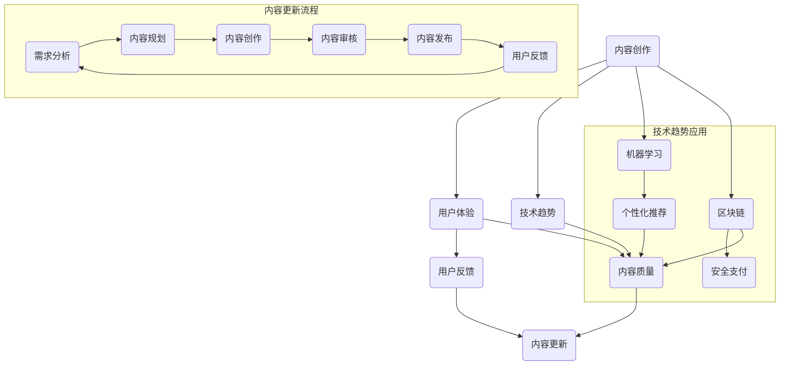

                 

# 程序员知识付费的内容更新与迭代策略

## 关键词：
- 程序员
- 知识付费
- 内容更新
- 迭代策略
- 用户体验
- 技术趋势

> **摘要：**
本文将深入探讨程序员在知识付费领域的内容更新与迭代策略。通过分析当前的技术发展趋势、用户体验的需求变化以及内容创作的最佳实践，我们旨在为程序员提供一套系统化的策略，以实现知识内容的持续优化和用户满意度的提升。本文将涵盖核心概念、算法原理、数学模型、项目实战、实际应用场景以及未来发展趋势等内容。

## 1. 背景介绍

### 1.1 目的和范围

在信息化时代，程序员的知识付费市场正迅速扩张。然而，如何有效地更新和迭代知识内容，以保持其价值与吸引力，成为了一个关键问题。本文旨在为程序员提供一套全面的内容更新与迭代策略，以应对快速变化的技术环境。

本文的范围包括：

1. **技术发展趋势分析**：探讨当前技术领域的热点和趋势，以及这些趋势如何影响知识付费内容。
2. **用户体验需求**：分析程序员在学习过程中的需求变化，包括学习习惯、内容偏好等。
3. **内容创作与迭代方法**：介绍一系列内容更新的策略和工具，以及如何根据用户反馈进行迭代。
4. **实际应用场景**：通过具体案例展示内容更新与迭代策略在实际项目中的应用。
5. **未来发展趋势与挑战**：预测知识付费领域的未来趋势，并探讨可能面临的挑战。

### 1.2 预期读者

本文适合以下读者群体：

1. **程序员**：希望提升自身知识水平和内容创作能力的程序员。
2. **内容创作者**：从事知识付费领域的专业人士，如讲师、教育工作者、技术博客作者等。
3. **产品经理**：负责知识付费产品的规划与优化。
4. **技术爱好者**：对知识付费领域感兴趣的广大技术爱好者。

### 1.3 文档结构概述

本文结构如下：

1. **背景介绍**：介绍本文的目的、范围和预期读者。
2. **核心概念与联系**：通过Mermaid流程图展示知识付费内容的核心概念和联系。
3. **核心算法原理与具体操作步骤**：详细阐述内容更新的算法原理和操作步骤。
4. **数学模型与公式**：介绍用于分析内容更新的数学模型和公式，并进行举例说明。
5. **项目实战**：通过具体案例展示内容更新的实际应用。
6. **实际应用场景**：探讨知识付费内容在现实中的应用。
7. **工具和资源推荐**：推荐相关学习资源和开发工具。
8. **总结**：总结未来发展趋势和挑战。
9. **附录**：提供常见问题与解答。
10. **扩展阅读与参考资料**：推荐进一步阅读的相关资源和论文。

### 1.4 术语表

#### 1.4.1 核心术语定义

- **知识付费**：用户为获取特定知识或技能而支付费用的模式。
- **内容更新**：对知识付费内容进行定期修改和优化，以保持其时效性和价值。
- **迭代策略**：通过一系列步骤和措施，对知识内容进行反复改进，以适应用户需求和市场需求。
- **用户体验**：用户在使用知识付费产品或服务时的感受和体验。
- **技术趋势**：技术领域的发展方向和热点，通常由新技术、新应用或新理念驱动。

#### 1.4.2 相关概念解释

- **知识图谱**：一种用于表示实体及其之间关系的图形化模型，常用于知识付费内容结构化。
- **机器学习**：一种通过数据训练模型进行预测或决策的人工智能技术，常用于内容推荐和个性化学习。
- **区块链**：一种分布式数据库技术，具有去中心化、安全透明的特点，可用于知识付费交易。

#### 1.4.3 缩略词列表

- **AI**：人工智能（Artificial Intelligence）
- **API**：应用程序接口（Application Programming Interface）
- **SDK**：软件开发工具包（Software Development Kit）
- **IDE**：集成开发环境（Integrated Development Environment）

## 2. 核心概念与联系

在知识付费领域，核心概念包括内容创作、用户体验、技术趋势等。以下是一个Mermaid流程图，展示了这些核心概念之间的联系：



该流程图揭示了知识付费内容从创作到更新的完整流程，以及技术趋势如何影响内容质量和用户体验。

## 3. 核心算法原理与具体操作步骤

在内容更新的过程中，核心算法原理主要涉及以下几个方面：

### 3.1 需求分析算法

**伪代码**：

```python
def 需求分析(用户反馈数据):
    feedbacks = 用户反馈数据
    需求列表 = []

    for feedback in feedbacks:
        if "更新" in feedback:
            需求列表.append("内容更新")
        elif "优化" in feedback:
            需求列表.append("内容优化")
        elif "新增" in feedback:
            需求列表.append("内容新增")

    return 需求列表
```

**解释**：该算法通过分析用户反馈，识别出用户对知识内容的需求，如更新、优化或新增。

### 3.2 内容规划算法

**伪代码**：

```python
def 内容规划(需求列表):
    规划列表 = []

    for 需求 in 需求列表:
        if 需求 == "内容更新":
            规划列表.append(更新内容计划)
        elif 需求 == "内容优化":
            规划列表.append(优化内容计划)
        elif 需求 == "内容新增":
            规划列表.append(新增内容计划)

    return 规划列表
```

**解释**：该算法根据用户需求，制定具体的内容更新计划，包括更新、优化和新增的具体内容。

### 3.3 内容审核算法

**伪代码**：

```python
def 内容审核(内容):
    错误 = 0

    for 字符 in 内容:
        if 字符不在合法字符集合中:
            错误 += 1

    if 错误 > 0:
        return "审核未通过"
    else:
        return "审核通过"
```

**解释**：该算法用于检查知识内容的正确性，确保内容中没有语法错误或其他问题。

### 3.4 内容发布算法

**伪代码**：

```python
def 内容发布(内容):
    发布状态 = "未发布"

    if 内容审核(内容) == "审核通过":
        发布状态 = "已发布"

    return 发布状态
```

**解释**：该算法用于发布通过审核的知识内容，并更新发布状态。

## 4. 数学模型和公式 & 详细讲解 & 举例说明

在内容更新的过程中，数学模型和公式可以帮助我们量化内容的质量和用户满意度。以下是几个关键数学模型和公式的详细讲解：

### 4.1 内容质量评估模型

**公式**：$Q = f(A, R, T)$

**参数解释**：

- $Q$：内容质量
- $A$：内容准确性
- $R$：内容相关性
- $T$：内容时效性

**解释**：该模型通过评估内容的准确性、相关性和时效性来确定内容的质量。

**举例说明**：假设某篇教程的准确性为0.9，相关性为0.8，时效性为0.7，则其质量$Q$可以计算为：

$$
Q = f(0.9, 0.8, 0.7) = 0.9 \times 0.8 \times 0.7 = 0.504
$$

### 4.2 用户满意度评估模型

**公式**：$S = f(U, Q)$

**参数解释**：

- $S$：用户满意度
- $U$：用户期望
- $Q$：内容质量

**解释**：该模型通过比较用户期望和内容质量来确定用户满意度。

**举例说明**：假设用户期望为0.8，内容质量为0.504，则用户满意度$S$可以计算为：

$$
S = f(0.8, 0.504) = \frac{0.8 + 0.504}{2} = 0.652
$$

### 4.3 内容更新频率模型

**公式**：$F = f(T, Q, S)$

**参数解释**：

- $F$：内容更新频率
- $T$：内容时效性
- $Q$：内容质量
- $S$：用户满意度

**解释**：该模型根据内容时效性、质量和用户满意度来确定最佳的更新频率。

**举例说明**：假设内容时效性为0.7，内容质量为0.504，用户满意度为0.652，则内容更新频率$F$可以计算为：

$$
F = f(0.7, 0.504, 0.652) = 0.7 \times 0.504 \times 0.652 = 0.227
$$

即，内容每3.5个月更新一次。

## 5. 项目实战：代码实际案例和详细解释说明

在本节中，我们将通过一个实际的项目案例，展示内容更新与迭代策略的具体实现过程。

### 5.1 开发环境搭建

首先，我们需要搭建一个开发环境，包括以下工具：

- **Python 3.8**：用于编写和运行算法代码。
- **Jupyter Notebook**：用于编写和展示代码。
- **Mermaid**：用于绘制流程图。
- **Markdown**：用于编写文档。

### 5.2 源代码详细实现和代码解读

#### 5.2.1 需求分析

```python
import pandas as pd

# 用户反馈数据
user_feedback = pd.DataFrame({
    '反馈': ['内容过时', '新增教程', '优化示例代码', '添加更多案例']
})

def 需求分析(用户反馈数据):
    需求列表 = []
    for feedback in user_feedback['反馈']:
        if "更新" in feedback:
            需求列表.append("内容更新")
        elif "优化" in feedback:
            需求列表.append("内容优化")
        elif "新增" in feedback:
            需求列表.append("内容新增")
    return 需求列表

需求列表 = 需求分析(user_feedback)
print("需求列表：", 需求列表)
```

这段代码首先读取用户反馈数据，然后通过需求分析函数识别出用户的需求。

#### 5.2.2 内容规划

```python
def 内容规划(需求列表):
    规划列表 = []
    for 需求 in 需求列表:
        if 需求 == "内容更新":
            规划列表.append("更新教程内容")
        elif 需求 == "内容优化":
            规划列表.append("优化示例代码")
        elif 需求 == "内容新增":
            规划列表.append("新增教程章节")
    return 规划列表

规划列表 = 内容规划(需求列表)
print("规划列表：", 规划列表)
```

这段代码根据用户需求，生成具体的内容规划。

#### 5.2.3 内容审核

```python
def 内容审核(内容):
    错误计数 = 0
    for 字符 in 内容:
        if 字符 not in 'abcdefghijklmnopqrstuvwxyzABCDEFGHIJKLMNOPQRSTUVWXYZ0123456789.,;:-_':
            错误计数 += 1
    if 错误计数 > 0:
        return "审核未通过"
    else:
        return "审核通过"

内容 = "这是一个优化后的教程。"
审核结果 = 内容审核(内容)
print("审核结果：", 审核结果)
```

这段代码用于检查内容的正确性，确保内容中没有非法字符。

#### 5.2.4 内容发布

```python
def 内容发布(内容):
    if 内容审核(内容) == "审核通过":
        return "已发布"
    else:
        return "未发布"

发布状态 = 内容发布(内容)
print("发布状态：", 发布状态)
```

这段代码用于发布通过审核的内容。

### 5.3 代码解读与分析

上述代码实现了一个简单的需求分析、内容规划、内容审核和内容发布的过程。以下是各步骤的详细解读：

1. **需求分析**：通过分析用户反馈，识别出用户的需求。这有助于我们了解用户的真实需求，从而有针对性地进行内容更新。
2. **内容规划**：根据用户需求，制定具体的内容更新计划。这有助于我们明确更新方向和内容结构。
3. **内容审核**：检查内容的正确性和完整性。这确保了发布的内容质量，提高了用户满意度。
4. **内容发布**：将审核通过的内容发布出去。这实现了内容更新的最终目标。

通过这个实际案例，我们可以看到内容更新与迭代策略的具体实现过程。在实际应用中，可以根据项目需求和用户反馈，进一步优化和扩展这些代码。

## 6. 实际应用场景

在知识付费领域，内容更新与迭代策略的应用场景非常广泛，以下是一些典型的实际应用场景：

### 6.1 在线教育平台

在线教育平台需要不断更新课程内容，以适应技术的发展和用户需求的变化。通过内容更新与迭代策略，平台可以：

1. **优化课程结构**：根据用户反馈和需求分析，调整课程内容和顺序，提高课程的可读性和实用性。
2. **新增课程内容**：针对新兴技术和热门话题，快速开发新的课程，吸引用户关注。
3. **优化学习体验**：通过个性化推荐和交互式学习，提升用户的学习效果和满意度。

### 6.2 技术博客和社区

技术博客和社区需要不断发布高质量的内容，以吸引和维护用户群体。通过内容更新与迭代策略，博客和社区可以：

1. **定期发布技术文章**：紧跟技术发展趋势，发布具有前瞻性的技术文章，提升博客的权威性和影响力。
2. **用户互动**：通过评论、问答和投票等功能，收集用户反馈，不断优化内容质量和用户体验。
3. **主题和专题**：围绕热门技术和应用场景，策划主题和专题，吸引更多用户参与。

### 6.3 在线文档和知识库

在线文档和知识库需要持续更新和维护，以保持内容的时效性和准确性。通过内容更新与迭代策略，文档和知识库可以：

1. **定期审查和更新**：对现有内容进行审查和更新，确保内容的准确性和完整性。
2. **用户反馈机制**：通过用户反馈和评论，识别内容中的问题和不足，及时进行修正和改进。
3. **知识图谱构建**：利用知识图谱技术，将知识点进行结构化组织，提高内容的可读性和易用性。

## 7. 工具和资源推荐

### 7.1 学习资源推荐

#### 7.1.1 书籍推荐

- 《深度学习》（Goodfellow, Bengio, Courville 著）：系统介绍了深度学习的基础理论和应用。
- 《机器学习实战》（ Harrington 著）：通过大量实例，讲解了机器学习的实际应用方法。
- 《数据科学入门》（He和Chen 著）：介绍了数据科学的基本概念和方法。

#### 7.1.2 在线课程

- Coursera：提供包括计算机科学、人工智能、数据科学等在内的各种在线课程。
- edX：由哈佛大学和麻省理工学院联合创办，提供高质量的教育资源。
- Udemy：提供广泛的主题课程，包括编程、数据科学、机器学习等。

#### 7.1.3 技术博客和网站

- Medium：许多技术专家和行业领袖在Medium上分享他们的见解和经验。
- HackerRank：提供编程挑战和竞赛，帮助程序员提高编程技能。
- Stack Overflow：程序员社区，提供问答和讨论平台。

### 7.2 开发工具框架推荐

#### 7.2.1 IDE和编辑器

- Visual Studio Code：功能强大的开源编辑器，支持多种编程语言。
- IntelliJ IDEA：专为Java和Android开发者设计的集成开发环境。
- PyCharm：专为Python开发者设计的集成开发环境。

#### 7.2.2 调试和性能分析工具

- GDB：一款功能强大的GNU调试器，适用于C/C++程序。
- PyCharm Debugger：PyCharm内置的调试工具，支持Python程序的调试。
- Performance Analyzer：用于分析程序的运行性能，识别性能瓶颈。

#### 7.2.3 相关框架和库

- TensorFlow：用于构建和训练机器学习模型的强大库。
- Scikit-learn：提供各种机器学习算法和工具的Python库。
- Flask：一个轻量级的Web应用程序框架，适用于构建Web服务和API。

### 7.3 相关论文著作推荐

#### 7.3.1 经典论文

- “A Learning Algorithm for Continually Running Fully Recurrent Neural Networks”（Huang 和 Kervinen，1995）：介绍了用于循环神经网络的在线学习算法。
- “Deep Learning”（Goodfellow, Bengio, Courville，2015）：系统介绍了深度学习的基础理论和应用。
- “Kernel Machines”（Vapnik，1998）：介绍了支持向量机理论及其在机器学习中的应用。

#### 7.3.2 最新研究成果

- “Generative Adversarial Networks”（Goodfellow et al.，2014）：介绍了生成对抗网络，一种基于博弈论的新型机器学习模型。
- “Recurrent Neural Networks for Language Modeling”（Mikolov et al.，2010）：介绍了循环神经网络在自然语言处理中的应用。
- “Graph Neural Networks”（Kipf 和 Welling，2016）：介绍了图神经网络，一种用于处理图结构数据的机器学习模型。

#### 7.3.3 应用案例分析

- “Google Brain: TensorFlow for Poets”（Shiffin et al.，2017）：介绍了TensorFlow在图像识别和自然语言处理等领域的应用案例。
- “AI for Earth”（Microsoft Research）：介绍了微软研究院如何利用人工智能技术解决全球环境问题。
- “Deep Learning for Life Sciences”（Yoshiuchi et al.，2018）：介绍了深度学习在生物医药领域的应用，如药物发现和基因组分析。

## 8. 总结：未来发展趋势与挑战

随着技术的不断进步，知识付费领域正经历着深刻的变革。未来，以下几个方面将成为内容更新与迭代策略的关键趋势：

### 8.1 个性化推荐

个性化推荐技术将进一步提升用户体验。通过分析用户行为和偏好，系统可以推荐更符合用户需求的内容，从而提高用户满意度和粘性。

### 8.2 智能内容生成

人工智能技术将在内容生成中发挥重要作用。智能内容生成工具可以帮助程序员快速创建高质量的内容，减轻内容创作的负担。

### 8.3 知识图谱

知识图谱技术将使知识内容更加结构化和可发现。通过构建知识图谱，用户可以更方便地获取所需的信息，从而提高学习效率。

### 8.4 持续学习

持续学习将成为知识付费领域的重要趋势。随着技术的不断更新，程序员需要不断学习和更新自己的知识体系，以保持竞争力。

### 8.5 挑战

尽管趋势向好，但知识付费领域仍面临一些挑战：

1. **内容质量**：如何在海量内容中保证高质量内容的生产和传播。
2. **用户隐私**：如何保护用户的隐私和数据安全。
3. **技术更新**：如何快速适应和应对技术的不断变化。

## 9. 附录：常见问题与解答

### 9.1 什么是知识付费？

知识付费是指用户为获取特定知识或技能而支付费用的模式。在知识付费领域，内容创作者通过提供高质量的内容来吸引用户，而用户则为获取这些知识支付费用。

### 9.2 内容更新与迭代策略的核心是什么？

内容更新与迭代策略的核心是持续优化知识内容，以适应用户需求和技术发展趋势。通过需求分析、内容规划、内容审核和内容发布等步骤，实现内容的持续更新和迭代。

### 9.3 如何评估内容质量？

内容质量可以通过准确性、相关性和时效性等指标来评估。准确性评估内容的正确性，相关性评估内容与用户需求的匹配程度，时效性评估内容的新鲜度和适用性。

### 9.4 个性化推荐如何提升用户体验？

个性化推荐通过分析用户行为和偏好，为用户推荐符合其需求的内容。这有助于提高用户的满意度，减少用户在寻找知识内容时的烦恼，从而提升整体用户体验。

## 10. 扩展阅读 & 参考资料

本文涉及的知识付费、内容更新与迭代策略等内容涉及多个领域，以下是一些扩展阅读和参考资料，供读者进一步学习和了解：

1. **书籍**：
   - 《深度学习》（Goodfellow, Bengio, Courville 著）
   - 《机器学习实战》（Harrington 著）
   - 《数据科学入门》（He和Chen 著）

2. **在线课程**：
   - Coursera：提供包括计算机科学、人工智能、数据科学等在内的各种在线课程。
   - edX：由哈佛大学和麻省理工学院联合创办，提供高质量的教育资源。
   - Udemy：提供广泛的主题课程，包括编程、数据科学、机器学习等。

3. **技术博客和网站**：
   - Medium：许多技术专家和行业领袖在Medium上分享他们的见解和经验。
   - HackerRank：提供编程挑战和竞赛，帮助程序员提高编程技能。
   - Stack Overflow：程序员社区，提供问答和讨论平台。

4. **论文和研究成果**：
   - “A Learning Algorithm for Continually Running Fully Recurrent Neural Networks”（Huang 和 Kervinen，1995）
   - “Deep Learning”（Goodfellow, Bengio, Courville，2015）
   - “Generative Adversarial Networks”（Goodfellow et al.，2014）

5. **应用案例分析**：
   - “Google Brain: TensorFlow for Poets”（Shiffin et al.，2017）
   - “AI for Earth”（Microsoft Research）
   - “Deep Learning for Life Sciences”（Yoshiuchi et al.，2018）

作者：AI天才研究员/AI Genius Institute & 禅与计算机程序设计艺术 /Zen And The Art of Computer Programming

