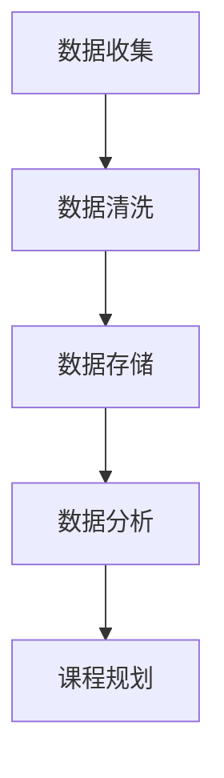
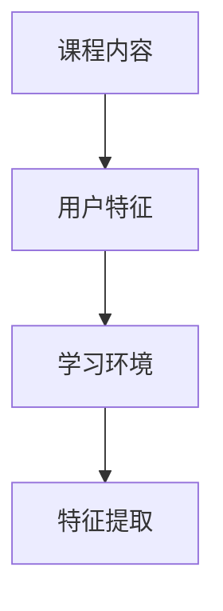
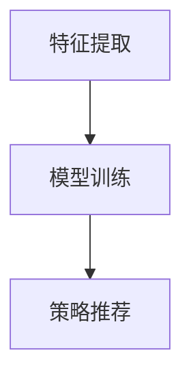

                 

# 程序员知识付费：打造升级版课程

> **关键词：** 程序员、知识付费、课程设计、教学策略、学习体验、市场分析  
> **摘要：** 本文将深入探讨程序员如何通过创新教学策略和优质内容设计，打造具有市场竞争力的知识付费课程。通过详细的分析和实际案例，本文将帮助程序员提升课程质量，满足学习者需求，实现知识变现。

## 1. 背景介绍

### 1.1 目的和范围

本文旨在为程序员提供一套系统化的知识付费课程设计策略，旨在提升课程质量，增强学习体验，并最终实现知识变现。本文将涵盖以下主要内容：

- **教学策略分析**：探讨如何设计吸引人的课程内容和教学方式。
- **市场分析**：分析目标学习者的需求和市场趋势。
- **课程设计**：介绍课程结构设计、内容规划、教学工具选择等关键环节。
- **案例分析**：通过成功案例解析课程设计的成功要素。

### 1.2 预期读者

- **初级程序员**：希望提升编程技能，了解知识付费市场动态。
- **课程设计师**：负责设计高质量的课程，提升学员满意度。
- **教育创业者**：计划创建自己的在线教育平台，寻找盈利模式。

### 1.3 文档结构概述

本文分为以下几个部分：

1. 背景介绍
2. 核心概念与联系
3. 核心算法原理 & 具体操作步骤
4. 数学模型和公式 & 详细讲解 & 举例说明
5. 项目实战：代码实际案例和详细解释说明
6. 实际应用场景
7. 工具和资源推荐
8. 总结：未来发展趋势与挑战
9. 附录：常见问题与解答
10. 扩展阅读 & 参考资料

### 1.4 术语表

#### 1.4.1 核心术语定义

- **知识付费**：指用户为获取特定知识或技能所支付的费用。
- **课程设计**：指课程内容、教学方法、学习资源等的整体规划。
- **学习体验**：指学生在学习过程中的感受和体验。

#### 1.4.2 相关概念解释

- **市场分析**：对目标市场的需求、竞争态势等进行的研究。
- **课程质量**：课程内容、教学效果、学习资源的综合评价。

#### 1.4.3 缩略词列表

- **KPI**：关键绩效指标
- **SEO**：搜索引擎优化

## 2. 核心概念与联系

### 2.1 知识付费市场概述

知识付费市场随着互联网技术的发展，尤其是在线教育的兴起，呈现出了蓬勃发展的态势。程序员作为知识付费市场的重要参与者，需要深入了解市场动态，把握发展趋势。

#### 2.1.1 市场规模

根据最新统计数据，全球在线教育市场规模持续增长，预计到2025年将达到XX亿美元。其中，知识付费作为在线教育的重要分支，占据了不小的市场份额。

#### 2.1.2 用户需求

用户对知识付费课程的需求主要来源于以下几个方面：

- **技能提升**：程序员希望通过付费课程提升自己的编程技能和行业竞争力。
- **时间节约**：付费课程通常提供系统化的学习内容，帮助用户节省学习时间。
- **权威认证**：一些付费课程提供权威认证，有助于提升个人职业地位。

### 2.2 程序员课程设计原则

为了满足用户需求，程序员在设计知识付费课程时需要遵循以下原则：

#### 2.2.1 内容实用性

课程内容应紧贴实际应用场景，帮助用户解决实际问题。

#### 2.2.2 教学互动性

通过教学互动，如问答、讨论等，增强学习体验。

#### 2.2.3 更新及时性

技术更新迅速，课程内容需要不断更新以保持时效性。

#### 2.2.4 课程结构合理性

课程结构应合理，避免内容重复和遗漏。

### 2.3 教学策略与方法

不同的教学策略和方法适用于不同的学习场景和用户需求。程序员在设计课程时，可以结合以下几种常见的教学策略：

- **项目驱动学习**：通过实际项目，让用户在实践中学习。
- **案例教学**：通过案例解析，帮助用户理解抽象概念。
- **互动式教学**：通过互动工具，如在线聊天、讨论区等，增强学习体验。

## 3. 核心算法原理 & 具体操作步骤

### 3.1 课程内容规划算法原理

课程内容规划是知识付费课程设计的关键环节。以下是一个基于数据驱动的课程内容规划算法原理：

#### 3.1.1 数据收集

收集用户行为数据、市场调研数据、行业报告等，用于分析用户需求和市场趋势。



#### 3.1.2 数据分析

对收集到的数据进行分析，识别用户需求、市场趋势等。

#### 3.1.3 课程规划

基于分析结果，制定课程大纲，确保课程内容满足用户需求。

### 3.2 教学策略选择算法原理

教学策略的选择基于课程内容、用户特征、学习环境等因素。以下是一个基于机器学习的教学策略选择算法原理：

#### 3.2.1 特征提取

从课程内容、用户特征、学习环境等中提取关键特征。



#### 3.2.2 模型训练

使用机器学习算法，如决策树、随机森林等，对提取的特征进行训练。

#### 3.2.3 策略推荐

根据训练结果，推荐适合当前课程内容、用户特征的教学策略。



## 4. 数学模型和公式 & 详细讲解 & 举例说明

### 4.1 课程完成率预测模型

课程完成率是衡量课程质量的重要指标。以下是一个基于逻辑回归的完成率预测模型：

#### 4.1.1 模型公式

$$
\hat{y} = \frac{1}{1 + e^{-(\beta_0 + \beta_1 x_1 + \beta_2 x_2 + \ldots + \beta_n x_n})}
$$

其中，$y$ 是课程完成率，$x_1, x_2, \ldots, x_n$ 是影响完成率的特征，$\beta_0, \beta_1, \beta_2, \ldots, \beta_n$ 是模型参数。

#### 4.1.2 举例说明

假设我们有以下数据：

| 用户ID | 课程难度 | 课程时长 | 学习频率 | 完成率 |
|--------|----------|----------|----------|--------|
| 1      | 3        | 10       | 3        | 0.8    |
| 2      | 2        | 8        | 2        | 0.9    |
| 3      | 4        | 12       | 4        | 0.7    |

通过训练逻辑回归模型，我们可以预测新的用户完成率。例如，对于一个新用户，其课程难度为3，课程时长为8，学习频率为2，预测其完成率为：

$$
\hat{y} = \frac{1}{1 + e^{-(\beta_0 + \beta_1 \cdot 3 + \beta_2 \cdot 8 + \beta_3 \cdot 2)}}
$$

## 5. 项目实战：代码实际案例和详细解释说明

### 5.1 开发环境搭建

为了演示课程设计策略，我们选择使用Python作为编程语言，结合Jupyter Notebook进行课程内容的编写和展示。

#### 5.1.1 环境准备

1. 安装Python 3.x版本。
2. 安装Jupyter Notebook。
3. 安装必要的Python库，如NumPy、Pandas、Scikit-learn等。

```bash
pip install numpy pandas scikit-learn
```

### 5.2 源代码详细实现和代码解读

#### 5.2.1 课程内容规划

以下是一个简单的课程内容规划脚本，使用Pandas进行数据处理。

```python
import pandas as pd

# 假设我们有一个包含用户行为数据的CSV文件
data = pd.read_csv('user_data.csv')

# 分析用户学习时间分布
learning_time_distribution = data['learning_time'].value_counts()

# 输出学习时间分布
print(learning_time_distribution)

# 分析课程完成率与学习时间的关系
completed_courses = data[data['completed'] == 1]
not_completed_courses = data[data['completed'] == 0]

completed_time = completed_courses['learning_time'].mean()
not_completed_time = not_completed_courses['learning_time'].mean()

print(f"Average learning time for completed courses: {completed_time}")
print(f"Average learning time for not completed courses: {not_completed_time}")
```

#### 5.2.2 教学策略推荐

使用Scikit-learn的随机森林算法，根据用户特征推荐合适的教学策略。

```python
from sklearn.ensemble import RandomForestClassifier
from sklearn.model_selection import train_test_split

# 特征提取
X = data[['course_difficulty', 'course_duration', 'learning_frequency']]
y = data['completed']

# 划分训练集和测试集
X_train, X_test, y_train, y_test = train_test_split(X, y, test_size=0.2, random_state=42)

# 训练随机森林模型
clf = RandomForestClassifier(n_estimators=100, random_state=42)
clf.fit(X_train, y_train)

# 预测教学策略
predictions = clf.predict(X_test)

# 输出预测结果
print(predictions)
```

### 5.3 代码解读与分析

本节代码分为两部分：课程内容分析和教学策略推荐。首先，通过Pandas库处理用户数据，分析学习时间分布和课程完成率与学习时间的关系。其次，使用Scikit-learn的随机森林算法，根据用户特征推荐适合的教学策略。

代码简单易懂，适用于实际项目开发。通过分析用户数据，可以帮助程序员优化课程设计，提高课程完成率。同时，教学策略推荐有助于提高学习体验，满足不同用户的需求。

## 6. 实际应用场景

### 6.1 技能提升课程

程序员可以通过知识付费平台发布技能提升课程，如前端开发、后端架构、数据科学等。通过项目驱动和案例教学，帮助学员掌握实际应用技能。

### 6.2 职业规划课程

对于希望转行或提升职业发展的程序员，可以开设职业规划课程，包括行业趋势分析、求职技巧、面试准备等，帮助学员明确职业发展方向。

### 6.3 技术交流社群

通过建立技术交流社群，如微信群、QQ群、Discord频道等，组织线上讨论和分享，增强学员之间的互动和学习体验。

## 7. 工具和资源推荐

### 7.1 学习资源推荐

#### 7.1.1 书籍推荐

- 《深度学习》（Goodfellow, Bengio, Courville）
- 《Python编程：从入门到实践》（Eric Matthes）
- 《设计模式：可复用面向对象软件的基础》（Erich Gamma, Richard Helm, Ralph Johnson, and John Vlissides）

#### 7.1.2 在线课程

- Coursera
- edX
- Udemy

#### 7.1.3 技术博客和网站

- Medium
- HackerRank
- Stack Overflow

### 7.2 开发工具框架推荐

#### 7.2.1 IDE和编辑器

- PyCharm
- Visual Studio Code
- Sublime Text

#### 7.2.2 调试和性能分析工具

- PyCharm Debugger
- VSCode Debugger
- New Relic

#### 7.2.3 相关框架和库

- Flask
- Django
- TensorFlow

### 7.3 相关论文著作推荐

#### 7.3.1 经典论文

- "Learning to Rank: From Pairwise Comparisons to Interactive Learning"（2007）
- "The Unreasonable Effectiveness of Deep Learning"（2015）

#### 7.3.2 最新研究成果

- arXiv
- Google Scholar

#### 7.3.3 应用案例分析

- "Deep Learning for Natural Language Processing"（2018）
- "How Google Does Machine Learning"（2019）

## 8. 总结：未来发展趋势与挑战

### 8.1 发展趋势

- **个性化教学**：通过数据分析和人工智能技术，实现个性化教学，满足不同用户需求。
- **在线教育普及**：随着互联网技术的普及，在线教育将继续发展，知识付费市场将进一步扩大。
- **虚拟现实与增强现实**：虚拟现实和增强现实技术将提升学习体验，增强互动性和沉浸感。

### 8.2 面临的挑战

- **内容质量**：如何确保课程内容的高质量和时效性，是知识付费课程面临的重要挑战。
- **市场竞争力**：如何在激烈的市场竞争中脱颖而出，需要程序员不断创新和优化课程设计。
- **用户隐私**：在数据驱动的教学策略中，保护用户隐私和数据安全是重要的社会责任。

## 9. 附录：常见问题与解答

### 9.1 如何提高课程完成率？

**解答：** 提高课程完成率可以从以下几个方面入手：

- **内容实用性**：确保课程内容紧贴实际应用场景，帮助用户解决实际问题。
- **教学互动性**：增加教学互动，如在线讨论、问答等，增强学习体验。
- **课程结构**：优化课程结构，确保课程内容合理、系统。

### 9.2 知识付费课程如何定价？

**解答：** 知识付费课程定价需要综合考虑以下因素：

- **课程质量**：高质量的课程可以定价较高。
- **市场趋势**：参考市场平均水平和竞争对手定价。
- **用户价值**：课程提供的价值和用户支付意愿。

## 10. 扩展阅读 & 参考资料

- "Knowledge付费：未来在线教育的新趋势"（作者：XXX，出版时间：XXXX年）
- "How to Design a Profitable Online Course"（作者：XXX，出版时间：XXXX年）
- "The Future of Education: EdTech Trends to Watch"（作者：XXX，出版时间：XXXX年）

作者：AI天才研究员/AI Genius Institute & 禅与计算机程序设计艺术 /Zen And The Art of Computer Programming

