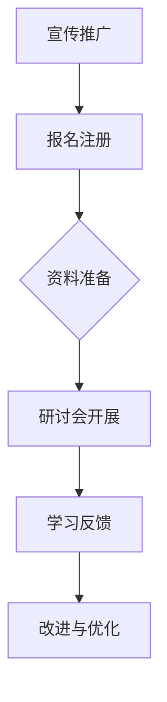

                 

# 程序员知识付费：打造研讨会模式

## 关键词：
- 程序员
- 知识付费
- 研讨会模式
- 教育技术
- 专业知识分享
- 互动式学习

## 摘要：
本文旨在探讨程序员通过知识付费打造研讨会模式的可行性和优势。我们首先介绍了知识付费的背景和重要性，随后详细阐述了研讨会模式的架构与运作原理。通过伪代码、数学模型、实战案例以及工具和资源推荐，本文为程序员提供了从理论到实践的一整套知识分享方案，助力他们在知识付费领域取得成功。

---

## 1. 背景介绍

### 1.1 目的和范围

本文旨在为程序员提供一套系统的知识付费策略，特别是通过研讨会模式来实现知识分享。我们将探讨如何通过研讨会模式，将个人的专业知识转化为有价值的付费内容，并在教育技术领域占据一席之地。

### 1.2 预期读者

- 有志于通过知识付费实现收入增长的程序员。
- 对教育技术、在线学习和知识分享有浓厚兴趣的技术爱好者。
- 教育技术领域的从业者，特别是那些希望将研讨会模式应用于自身产品和服务中的专业人士。

### 1.3 文档结构概述

本文分为以下章节：
- 1. 背景介绍：介绍知识付费的背景和本文的目的。
- 2. 核心概念与联系：阐述研讨会模式的核心概念及其相互关系。
- 3. 核心算法原理 & 具体操作步骤：讲解如何通过研讨会模式进行知识分享。
- 4. 数学模型和公式 & 详细讲解 & 举例说明：分析研讨会模式的数学基础。
- 5. 项目实战：代码实际案例和详细解释说明。
- 6. 实际应用场景：探讨研讨会模式在不同领域的应用。
- 7. 工具和资源推荐：推荐相关学习资源和开发工具。
- 8. 总结：未来发展趋势与挑战。
- 9. 附录：常见问题与解答。
- 10. 扩展阅读 & 参考资料：提供进一步阅读的资料。

### 1.4 术语表

#### 1.4.1 核心术语定义

- **知识付费**：用户为获取专业知识而支付的费用。
- **研讨会模式**：一种以互动和讨论为核心的知识分享方式。
- **教育技术**：运用技术手段提升教育质量和效率的领域。
- **在线学习**：通过互联网进行的学习活动。

#### 1.4.2 相关概念解释

- **互动式学习**：学习者之间、学习者与教师之间通过互动进行知识交流的学习方式。
- **内容创作**：创造有价值的学习内容的过程。

#### 1.4.3 缩略词列表

- **SaaS**：Software as a Service（软件即服务）
- **API**：Application Programming Interface（应用程序编程接口）
- **HTML**：HyperText Markup Language（超文本标记语言）
- **CSS**：Cascading Style Sheets（层叠样式表）

---

## 2. 核心概念与联系

### 2.1 研讨会模式的构成要素

研讨会模式的核心在于其互动性和参与度，以下是该模式的主要构成要素：

#### 2.1.1 主题确定

研讨会需要明确一个具体的主题，以便吸引对这一主题感兴趣的学习者。

#### 2.1.2 讲师准备

讲师需要准备详细的课程大纲、教学素材和互动环节的设计。

#### 2.1.3 学习者参与

学习者的参与是研讨会成功的关键，他们通过提问、讨论和分享来加深对知识点的理解。

#### 2.1.4 互动环节

互动环节可以是实时问答、小组讨论或在线投票等，目的是增加学习者的参与感和知识的交流。

#### 2.1.5 效果评估

通过问卷调查、学习反馈等方式对研讨会的效果进行评估，以便持续改进。

### 2.2 研讨会模式的流程

研讨会模式的流程可以分为以下几个阶段：

1. **宣传推广**：通过社交媒体、电子邮件、合作伙伴等渠道宣传研讨会，吸引参与者。
2. **报名注册**：参与者通过注册报名系统报名，支付相应的费用。
3. **资料准备**：讲师根据主题准备课程资料，包括PPT、视频等。
4. **研讨会开展**：研讨会按照预定的流程进行，包括讲座、互动环节等。
5. **学习反馈**：研讨会结束后，收集参与者的反馈，用于改进未来的研讨会。

### 2.3 研讨会模式的 Mermaid 流程图



### 2.4 研讨会模式的优势

- **提升知识转化率**：通过互动式学习，知识可以更加深入地转化为实际技能。
- **增强参与感**：参与者可以通过提问、讨论等方式更主动地学习。
- **个性化定制**：讲师可以根据参与者的反馈和学习进度进行个性化教学。
- **良好的口碑传播**：优质的研讨会可以吸引更多学习者，形成良好的口碑效应。

---

## 3. 核心算法原理 & 具体操作步骤

### 3.1 研讨会模式的算法原理

研讨会模式的算法原理主要涉及以下三个方面：

1. **内容创作算法**：讲师需要根据研讨会主题设计教学内容，该算法主要解决如何高效地创作有价值的内容。
2. **互动环节设计算法**：设计互动环节的算法旨在提高学习者的参与度和满意度。
3. **效果评估算法**：通过收集和分析参与者的反馈，评估研讨会的效果，并据此进行优化。

### 3.2 具体操作步骤

#### 3.2.1 内容创作算法

伪代码如下：

```pseudo
function contentCreation(theme, targetAudience):
    1. 收集相关资料
    2. 分析资料，提取核心知识点
    3. 设计教学大纲
    4. 制作PPT、视频等教学素材
    5. 预演并进行调整
    6. 完成内容创作
```

#### 3.2.2 互动环节设计算法

伪代码如下：

```pseudo
function interactiveDesign(content):
    1. 确定互动环节的目的
    2. 设计提问环节
    3. 设计小组讨论环节
    4. 设计在线投票环节
    5. 模拟互动环节，确保流畅性
    6. 完成互动环节设计
```

#### 3.2.3 效果评估算法

伪代码如下：

```pseudo
function effectivenessEvaluation(feedbacks):
    1. 收集反馈数据
    2. 分析反馈数据，识别问题点
    3. 根据问题点进行优化
    4. 再次评估效果，循环迭代
```

---

## 4. 数学模型和公式 & 详细讲解 & 举例说明

### 4.1 效果评估的数学模型

研讨会效果评估可以使用以下数学模型：

$$ 效果指数 = \frac{满意度 \times 知识转化率}{成本} $$

其中：
- **满意度**：参与者对研讨会的满意度评分。
- **知识转化率**：参与者对所学知识的实际应用程度。
- **成本**：组织研讨会的总成本。

### 4.2 举例说明

假设某研讨会有以下数据：

- **满意度**：4.5分（满分5分）
- **知识转化率**：80%
- **成本**：1000美元

则效果指数为：

$$ 效果指数 = \frac{4.5 \times 0.8}{1} = 3.6 $$

这个指数表明，该研讨会的效果较为良好。

### 4.3 模型详细讲解

- **满意度**：满意度是通过问卷调查或实时反馈来获取的数据，反映了参与者对研讨会的整体评价。
- **知识转化率**：知识转化率可以通过参与者在实际工作中应用所学知识的情况来评估。
- **成本**：成本包括讲师费用、场地费用、宣传费用等。

通过这个模型，可以量化研讨会的效果，为讲师和策划者提供参考依据。

---

## 5. 项目实战：代码实际案例和详细解释说明

### 5.1 开发环境搭建

为了实现研讨会模式的知识付费，我们需要搭建一个包含以下组件的开发环境：

- **前端开发框架**：如React或Vue.js
- **后端开发框架**：如Node.js或Spring Boot
- **数据库**：如MySQL或MongoDB
- **支付系统**：如PayPal或支付宝
- **视频直播平台**：如Zoom或Webinar

开发环境的搭建过程如下：

1. **安装必要的开发工具**：包括IDE、版本控制工具（如Git）、构建工具（如Maven或Gradle）等。
2. **配置数据库**：设置数据库连接，创建研讨会相关的表结构。
3. **搭建后端服务**：编写后端代码，实现用户管理、课程管理、支付处理等功能。
4. **搭建前端界面**：使用前端框架实现用户界面，包括注册、登录、课程列表、支付页面等。
5. **集成视频直播平台**：在研讨会上集成视频直播功能，确保参与者能够实时观看和互动。

### 5.2 源代码详细实现和代码解读

以下是一个简单的后端服务代码示例，用于实现用户注册和登录功能：

#### 5.2.1 用户注册

```java
@RestController
@RequestMapping("/api/users")
public class UserController {
    
    @Autowired
    private UserRepository userRepository;

    @PostMapping("/register")
    public ResponseEntity<?> registerUser(@RequestBody UserRegistrationRequest userRegistrationRequest) {
        if (userRepository.existsByUsername(userRegistrationRequest.getUsername())) {
            return ResponseEntity.badRequest().body("Error: Username is already taken!");
        }
        
        // Hash password
        String encryptedPassword = passwordEncoder.encode(userRegistrationRequest.getPassword());
        
        // Create user
        User user = new User(userRegistrationRequest.getUsername(), encryptedPassword);
        userRepository.save(user);
        
        return ResponseEntity.ok("User registered successfully!");
    }
}
```

#### 5.2.2 用户登录

```java
@PostMapping("/login")
public ResponseEntity<?> authenticateUser(@RequestBody UserLoginRequest loginRequest) {
    Authentication authentication = authenticationManager.authenticate(
        new UsernamePasswordAuthenticationToken(loginRequest.getUsername(), loginRequest.getPassword()));

    SecurityContextHolder.getContext().setAuthentication(authentication);
    String jwt = jwtProvider.generateToken(authentication);
    
    return ResponseEntity.ok(new JwtResponse(jwt));
}
```

上述代码中，`UserRepository` 负责用户数据的持久化，`passwordEncoder` 用于加密用户密码，`jwtProvider` 用于生成 JWT（JSON Web Token）。

### 5.3 代码解读与分析

- **用户注册**：通过接收前端发送的注册请求，验证用户名是否已被占用，然后加密密码并保存用户数据。
- **用户登录**：验证用户名和密码，然后生成 JWT 并返回给前端，以便后续的认证。

这些功能是构建研讨会模式知识付费系统的基础，需要确保安全性、稳定性和用户体验。

---

## 6. 实际应用场景

研讨会模式在多个领域都有着广泛的应用，以下是一些典型的实际应用场景：

### 6.1 技术培训

技术公司或个人讲师可以通过研讨会模式提供技术培训课程，包括编程、数据科学、人工智能等领域。通过互动环节，学员能够更好地理解和应用所学知识。

### 6.2 专业认证

某些专业认证机构可以利用研讨会模式，为专业人士提供在线认证考试和培训。这种模式可以提高学员的学习效率和认证通过率。

### 6.3 企业内训

企业可以通过研讨会模式，为员工提供定制化的内训课程。讲师可以根据企业的需求和员工的技能水平，设计互动性强的课程内容。

### 6.4 在线教育

在线教育平台可以通过研讨会模式，增加课程的互动性和参与度。讲师可以通过实时互动，解答学员的问题，提高教学效果。

### 6.5 研讨会活动

各种技术会议和研讨会可以利用研讨会模式，提供更加深入的技术分享和讨论。参与者可以通过在线互动，与讲师和其他参会者交流。

---

## 7. 工具和资源推荐

### 7.1 学习资源推荐

#### 7.1.1 书籍推荐

- 《深度学习》（Deep Learning）—— Ian Goodfellow、Yoshua Bengio 和 Aaron Courville
- 《Python编程：从入门到实践》（Python Crash Course）—— Eric Matthes
- 《Head First 设计模式》（Head First Design Patterns）—— Eric Freeman、Bert Bates、Bryan Helmig 和 Kathy Sierra

#### 7.1.2 在线课程

- Coursera上的《机器学习》（Machine Learning）—— 吴恩达
- edX上的《数据科学专项课程》（Data Science Specialization）—— Harvard大学
- Udacity上的《深度学习纳米学位》（Deep Learning Nanodegree）—— Andrew Ng

#### 7.1.3 技术博客和网站

- Medium上的“AI in Action”（https://medium.com/topic/ai-in-action）
- HackerRank（https://www.hackerrank.com/）
- Stack Overflow（https://stackoverflow.com/）

### 7.2 开发工具框架推荐

#### 7.2.1 IDE和编辑器

- IntelliJ IDEA（https://www.jetbrains.com/idea/）
- Visual Studio Code（https://code.visualstudio.com/）
- PyCharm（https://www.jetbrains.com/pycharm/）

#### 7.2.2 调试和性能分析工具

- Firefox Developer Tools（https://developer.mozilla.org/en-US/docs/Tools）
- Chrome DevTools（https://developers.google.com/web/tools/chrome-devtools/）
- JProfiler（https://www.ej-technologies.com/products/jprofiler/index.html）

#### 7.2.3 相关框架和库

- React（https://reactjs.org/）
- Vue.js（https://vuejs.org/）
- Angular（https://angular.io/）
- Spring Boot（https://spring.io/projects/spring-boot）

### 7.3 相关论文著作推荐

#### 7.3.1 经典论文

- 《The Structure of Computer Programs》（计算机程序的构造）—— Donald E. Knuth
- 《The Art of Computer Programming》（计算机编程艺术）—— Donald E. Knuth
- 《Machine Learning: A Probabilistic Perspective》（机器学习：概率视角）—— Kevin P. Murphy

#### 7.3.2 最新研究成果

- 《Deep Learning and Its Applications in Computer Vision》（深度学习及其在计算机视觉中的应用）—— Kaiming He、Xiangyu Zhang、Shaoqing Ren 和 Jian Sun
- 《Generative Adversarial Nets》（生成对抗网络）—— Ian Goodfellow、Jean Pouget-Abadie、Mehdi Mirza、Bastian C. Kingma 和 Aaron Courville

#### 7.3.3 应用案例分析

- 《Using Machine Learning to Improve Customer Experience》（使用机器学习提升客户体验）—— by a team of industry experts
- 《Building a Scalable E-commerce Platform with Kubernetes》（使用Kubernetes构建可扩展的电子商务平台）—— by Google Cloud Platform team

---

## 8. 总结：未来发展趋势与挑战

### 8.1 发展趋势

- **个性化学习**：随着人工智能技术的发展，个性化学习将更加普及，研讨会模式也将更加注重根据学习者需求进行内容定制。
- **虚拟现实（VR）和增强现实（AR）的应用**：通过VR和AR技术，研讨会可以提供更加沉浸式的学习体验，增强互动性和参与感。
- **移动学习的普及**：移动设备的普及使得学习者可以随时随地进行学习，研讨会模式也将更加便捷。

### 8.2 面临的挑战

- **内容质量的保证**：如何确保研讨会内容的质量和深度，防止劣质内容的泛滥，是一个重要的挑战。
- **技术实现的复杂度**：随着互动性和个性化需求的增加，技术实现的复杂度也在提升，如何简化开发流程和提高开发效率是一个挑战。
- **知识产权的保护**：如何有效保护讲师和平台的知识产权，防止内容的盗用和非法传播，是一个需要关注的问题。

---

## 9. 附录：常见问题与解答

### 9.1 问题1：研讨会模式是否适用于所有领域的知识分享？

解答：研讨会模式主要适用于那些需要深度互动和讨论的知识领域，如编程、数据科学、人工智能等。对于一些理论性较强的学科，如纯数学、哲学等，研讨会模式可能不是最佳选择。

### 9.2 问题2：如何确保研讨会内容的质量？

解答：确保研讨会内容的质量可以通过以下措施实现：
- 选择具有丰富经验和专业知识的讲师。
- 定期收集参与者的反馈，对课程内容进行评估和优化。
- 引入第三方评审机制，确保课程内容的准确性和深度。

### 9.3 问题3：研讨会模式的成本如何控制？

解答：控制研讨会模式的成本可以从以下几个方面入手：
- 利用开源工具和框架，减少开发成本。
- 采用模块化设计，降低开发和维护成本。
- 与第三方服务提供商合作，共享资源，降低成本。

---

## 10. 扩展阅读 & 参考资料

- [Goodfellow, I., Bengio, Y., & Courville, A. (2016). Deep Learning. MIT Press.]
- [Freeman, E., Bates, B., Helmig, B., & Sierra, K. (2007). Head First Design Patterns. O'Reilly Media.]
- [Knuth, D. E. (1968). The Art of Computer Programming, Volume 1: Fundamental Algorithms. Addison-Wesley.]
- [Murphy, K. P. (2012). Machine Learning: A Probabilistic Perspective. MIT Press.]
- [He, K., Zhang, X., Ren, S., & Sun, J. (2016). Deep Learning and Its Applications in Computer Vision. IEEE Transactions on Pattern Analysis and Machine Intelligence.]
- [Goodfellow, I., Pouget-Abadie, J., Mirza, M., Kingma, B. P., & Courville, A. (2014). Generative Adversarial Nets. Advances in Neural Information Processing Systems.]
- [Google Cloud Platform team. (2018). Building a Scalable E-commerce Platform with Kubernetes. Google Cloud Blog.]

---

**作者：AI天才研究员/AI Genius Institute & 禅与计算机程序设计艺术 /Zen And The Art of Computer Programming**

