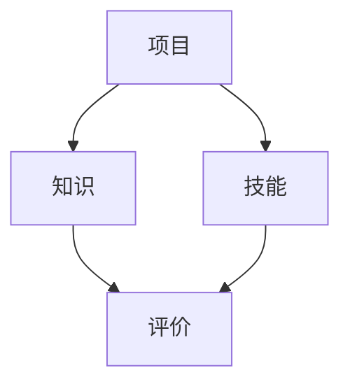

                 

# 程序员知识付费：打造项目式课程

> **关键词：知识付费、项目式课程、程序员、课程设计、教学模式**
> 
> **摘要：本文旨在探讨程序员如何利用知识付费模式，通过设计项目式课程，提升自身技能和职业竞争力。文章将介绍项目式课程的特点、设计原则、实施步骤以及未来发展趋势，为程序员提供实用的指导。**

## 1. 背景介绍

### 1.1 目的和范围

随着信息技术的飞速发展，编程和软件开发已成为现代社会的重要技能。程序员在职业生涯中不断学习新技术、新工具，以适应快速变化的市场需求。然而，传统的教学方式往往难以满足程序员的学习需求，缺乏实践性和互动性。知识付费模式的出现，为程序员提供了更加灵活、高效的学习途径。

本文旨在探讨如何利用知识付费模式，打造项目式课程，帮助程序员提升技能和职业竞争力。文章将涵盖以下内容：

1. 项目式课程的特点和优势。
2. 项目式课程的设计原则和方法。
3. 项目式课程的实施步骤和注意事项。
4. 项目式课程的未来发展趋势与挑战。

### 1.2 预期读者

本文主要面向以下读者群体：

1. 有志于利用知识付费模式提升编程技能的程序员。
2. 教育机构、培训机构和课程设计师，希望了解项目式课程的设计方法和实施策略。
3. 对编程教育领域感兴趣的学者、研究者和从业者。

### 1.3 文档结构概述

本文分为十个部分，具体结构如下：

1. 引言：介绍知识付费和项目式课程的概念。
2. 背景介绍：阐述本文的目的、范围和预期读者。
3. 核心概念与联系：介绍项目式课程的核心概念和原理。
4. 核心算法原理 & 具体操作步骤：讲解项目式课程的设计方法和步骤。
5. 数学模型和公式 & 详细讲解 & 举例说明：介绍项目式课程中的数学模型和公式。
6. 项目实战：提供实际案例，讲解项目式课程的应用。
7. 实际应用场景：分析项目式课程在程序员职业发展中的应用。
8. 工具和资源推荐：推荐学习资源、开发工具和框架。
9. 总结：展望项目式课程的未来发展趋势与挑战。
10. 附录：常见问题与解答。

### 1.4 术语表

#### 1.4.1 核心术语定义

1. **知识付费**：指用户为获取特定领域的知识、技能或经验，向提供方支付费用的一种商业模式。
2. **项目式课程**：以实际项目为导向，通过完成项目来学习相关知识和技能的教学模式。
3. **程序员**：从事计算机编程和软件开发工作的专业人员。
4. **课程设计师**：负责设计和开发教学课程的专业人员。

#### 1.4.2 相关概念解释

1. **教学模式**：指教育者在教学过程中采用的方法和手段，包括课堂教学、在线教学、实践教学等。
2. **教学资源**：指在教学过程中使用的各种材料和工具，包括教材、视频、实验平台等。
3. **学习成果**：指学生在学习过程中获得的知识、技能和素质。

#### 1.4.3 缩略词列表

1. **KSF**：知识付费
2. **PSM**：项目式课程
3. **IDE**：集成开发环境
4. **SaaS**：软件即服务
5. **PaaS**：平台即服务

## 2. 核心概念与联系

### 2.1 项目式课程的特点

项目式课程是一种以实际项目为核心，通过完成项目来学习相关知识和技能的教学模式。它具有以下特点：

1. **实践性**：项目式课程强调学生在实际项目中的实践操作，提高学生的动手能力和解决实际问题的能力。
2. **互动性**：项目式课程鼓励学生之间、学生与教师之间的互动，促进知识的交流和分享。
3. **灵活性**：项目式课程可以根据学生的需求和兴趣，灵活调整课程内容和进度，提高学生的学习效果。

### 2.2 项目式课程的优势

项目式课程相比传统教学模式，具有以下优势：

1. **提高学习效果**：通过实际项目，学生能够更好地掌握知识和技能，提高学习效果。
2. **增强职业竞争力**：项目式课程可以培养学生在实际工作中的解决能力，提高职业竞争力。
3. **适应市场需求**：项目式课程可以根据市场需求，不断调整课程内容和方向，适应市场需求。

### 2.3 项目式课程的应用场景

项目式课程适用于以下应用场景：

1. **编程和软件开发**：程序员可以通过项目式课程，学习编程语言、框架、工具等技能，提升开发能力。
2. **产品经理**：产品经理可以通过项目式课程，学习产品设计、项目管理等技能，提高产品开发效率。
3. **数据分析**：数据分析人员可以通过项目式课程，学习数据分析、挖掘等技能，提升数据驱动的决策能力。

### 2.4 项目式课程的实施流程

项目式课程的实施流程包括以下步骤：

1. **需求分析**：了解学生需求，确定课程目标。
2. **课程设计**：根据需求，设计课程内容和项目。
3. **项目实施**：引导学生完成项目，进行指导和评价。
4. **成果展示**：组织学生展示项目成果，进行交流和反馈。
5. **课程总结**：总结课程经验，为后续课程提供借鉴。

### 2.5 项目式课程的核心概念和联系

项目式课程的核心概念包括：

1. **项目**：项目是课程的核心，是学生学习的驱动力。
2. **知识**：知识是项目的组成部分，是学生需要掌握的内容。
3. **技能**：技能是学生在项目实践中培养的能力。
4. **评价**：评价是对学生项目成果的考核，是学生学习效果的重要体现。

下面是项目式课程的核心概念和联系的具体 Mermaid 流程图：



## 3. 核心算法原理 & 具体操作步骤

### 3.1 项目式课程设计算法原理

项目式课程设计是基于需求分析、项目规划、知识整合和技能培养的原理。核心算法包括以下步骤：

1. **需求分析**：收集学生需求，确定课程目标。
2. **项目规划**：设计项目方案，确定项目内容和难度。
3. **知识整合**：整合相关知识点，构建知识体系。
4. **技能培养**：根据项目需求，设计技能培养方案。
5. **评价设计**：制定评价标准和考核方式。

### 3.2 项目式课程设计具体操作步骤

1. **需求分析**

   - 调查问卷：通过问卷调查，了解学生对课程的需求和期望。
   - 用户访谈：与有经验的程序员进行深入访谈，获取课程需求。
   - 市场调研：分析市场需求，确定课程方向。

2. **项目规划**

   - 项目目标：明确项目目标，确保项目与课程目标一致。
   - 项目内容：设计项目内容，包括功能模块、技术难点等。
   - 项目难度：根据学生水平和课程要求，调整项目难度。

3. **知识整合**

   - 知识梳理：整理相关知识点，形成知识框架。
   - 知识关联：分析知识点之间的关联，构建知识网络。
   - 知识传授：设计教学过程，将知识传授给学生。

4. **技能培养**

   - 技能需求：根据项目需求，分析学生需要掌握的技能。
   - 技能训练：设计技能训练方案，包括练习、实训等。
   - 技能评估：制定技能评估标准，对学生技能进行考核。

5. **评价设计**

   - 评价标准：制定评价标准，确保评价的公正性和科学性。
   - 评价方式：选择合适的评价方式，如项目展示、答辩等。
   - 评价反馈：收集评价反馈，为后续课程改进提供依据。

### 3.3 项目式课程设计伪代码

```python
# 需求分析
def analyze_demand():
    # 收集学生需求
    # 进行用户访谈和市场调研
    # 返回需求分析结果

# 项目规划
def plan_project():
    # 确定项目目标
    # 设计项目内容
    # 调整项目难度
    # 返回项目规划结果

# 知识整合
def integrate_knowledge():
    # 梳理知识点
    # 构建知识网络
    # 返回知识整合结果

# 技能培养
def train_skills():
    # 分析技能需求
    # 设计技能训练方案
    # 制定技能评估标准
    # 返回技能培养方案

# 评价设计
def design_evaluation():
    # 制定评价标准
    # 选择评价方式
    # 收集评价反馈
    # 返回评价设计结果

# 项目式课程设计
def design_course():
    demand = analyze_demand()
    project = plan_project()
    knowledge = integrate_knowledge()
    skills = train_skills()
    evaluation = design_evaluation()
    # 整合设计结果，生成项目式课程
    return {
        "demand": demand,
        "project": project,
        "knowledge": knowledge,
        "skills": skills,
        "evaluation": evaluation
    }
```

## 4. 数学模型和公式 & 详细讲解 & 举例说明

### 4.1 项目式课程设计中的数学模型

在项目式课程设计中，数学模型和公式用于分析和评估课程效果。以下介绍几个常用的数学模型和公式：

#### 4.1.1 技能评估模型

**技能评估模型**用于评估学生在项目式课程中掌握的技能水平。公式如下：

$$
S = \frac{N \cdot A}{100}
$$

其中，$S$表示技能评分，$N$表示学生在项目中的表现得分，$A$表示技能评估标准分值。

**举例说明**：

假设学生在项目中获得80分，技能评估标准分值为100分。则其技能评分为：

$$
S = \frac{80 \cdot 100}{100} = 80
$$

#### 4.1.2 项目完成率模型

**项目完成率模型**用于评估学生在项目式课程中的完成情况。公式如下：

$$
R = \frac{C \cdot P}{100}
$$

其中，$R$表示项目完成率，$C$表示学生在项目中的实际完成情况得分，$P$表示项目总得分。

**举例说明**：

假设学生在项目中实际完成情况得分为70分，项目总得分100分。则其项目完成率为：

$$
R = \frac{70 \cdot 100}{100} = 70\%
$$

#### 4.1.3 学习效果评估模型

**学习效果评估模型**用于评估学生在项目式课程中的学习效果。公式如下：

$$
E = \frac{S \cdot R}{100}
$$

其中，$E$表示学习效果评分，$S$表示技能评分，$R$表示项目完成率。

**举例说明**：

假设学生在项目中技能评分为80分，项目完成率为70%。则其学习效果评分为：

$$
E = \frac{80 \cdot 70}{100} = 56
$$

### 4.2 数学模型和公式在项目式课程设计中的应用

数学模型和公式在项目式课程设计中的应用主要包括：

1. **技能评估**：通过技能评估模型，评估学生在项目式课程中掌握的技能水平，为教学改进提供依据。
2. **项目完成率**：通过项目完成率模型，评估学生在项目式课程中的完成情况，为教学效果评估提供参考。
3. **学习效果评估**：通过学习效果评估模型，综合评估学生在项目式课程中的学习效果，为课程改进提供参考。

## 5. 项目实战：代码实际案例和详细解释说明

### 5.1 开发环境搭建

在本节中，我们将搭建一个简单的项目环境，以便我们进行项目实战。我们将使用Python语言和Jupyter Notebook作为开发工具。以下是搭建开发环境的步骤：

1. **安装Python**：从官方网站（https://www.python.org/）下载并安装Python 3.x版本。
2. **安装Jupyter Notebook**：在命令行中运行以下命令安装Jupyter Notebook：

   ```bash
   pip install notebook
   ```

3. **启动Jupyter Notebook**：在命令行中运行以下命令启动Jupyter Notebook：

   ```bash
   jupyter notebook
   ```

### 5.2 源代码详细实现和代码解读

在本节中，我们将创建一个简单的Python项目，该项目将实现一个简单的待办事项列表。以下是项目的源代码和详细解读：

```python
# 导入必要的库
import os
import json

# 文件路径
data_file = 'todos.json'

# 初始化待办事项列表
def init_todos():
    if os.path.exists(data_file):
        with open(data_file, 'r') as f:
            todos = json.load(f)
    else:
        todos = []
    return todos

# 添加待办事项
def add_todo(todo, todos):
    todos.append(todo)
    save_todos(todos)

# 删除待办事项
def delete_todo(index, todos):
    if 0 <= index < len(todos):
        todos.pop(index)
        save_todos(todos)
    else:
        print("索引无效！")

# 完成待办事项
def complete_todo(index, todos):
    if 0 <= index < len(todos):
        todos[index]['completed'] = True
        save_todos(todos)
    else:
        print("索引无效！")

# 保存待办事项列表
def save_todos(todos):
    with open(data_file, 'w') as f:
        json.dump(todos, f)

# 主函数
def main():
    todos = init_todos()
    
    while True:
        print("待办事项列表：")
        for i, todo in enumerate(todos):
            print(f"{i}: {todo['text']} {'[已完成]' if todo['completed'] else ''}")
        
        command = input("请输入操作指令（'添加'、'删除'、'完成'或'退出'）：")
        
        if command == '添加':
            text = input("请输入待办事项：")
            add_todo({'text': text, 'completed': False}, todos)
        
        elif command == '删除':
            index = int(input("请输入待办事项的索引："))
            delete_todo(index, todos)
        
        elif command == '完成':
            index = int(input("请输入待办事项的索引："))
            complete_todo(index, todos)
        
        elif command == '退出':
            break

# 运行主函数
if __name__ == '__main__':
    main()
```

#### 5.2.1 代码解读

1. **导入必要的库**：我们首先导入了`os`和`json`库，用于文件操作和JSON数据解析。
2. **初始化待办事项列表**：`init_todos`函数用于读取本地存储的待办事项列表，如果文件不存在，则创建一个空列表。
3. **添加待办事项**：`add_todo`函数用于添加新的待办事项到列表中，并保存到本地文件。
4. **删除待办事项**：`delete_todo`函数用于删除指定索引的待办事项，并保存更新后的列表。
5. **完成待办事项**：`complete_todo`函数用于标记指定索引的待办事项为已完成，并保存更新后的列表。
6. **保存待办事项列表**：`save_todos`函数用于将待办事项列表保存到本地文件。
7. **主函数**：`main`函数是程序的入口，它负责与用户交互，根据用户的输入执行相应的操作。

### 5.3 代码解读与分析

1. **模块化设计**：代码采用了模块化设计，每个功能都封装在一个独立的函数中，便于维护和扩展。
2. **文件操作**：通过`os.path.exists`函数检查本地文件是否存在，通过`json.load`和`json.dump`函数读取和写入JSON数据，实现了数据的持久化存储。
3. **用户交互**：主函数通过循环与用户进行交互，根据用户的输入执行相应的操作，提供了简单易用的用户界面。
4. **异常处理**：在删除和完成待办事项的函数中，对输入的索引进行了有效性检查，避免了索引错误导致的程序异常。

### 5.4 代码优化建议

1. **输入验证**：在主函数中，可以对用户的输入进行更多的验证，确保输入的有效性，提高程序的健壮性。
2. **异常处理**：在主函数中，可以添加异常处理，捕获并处理可能出现的异常，如文件读取错误等。
3. **代码注释**：增加代码注释，使代码更加易于理解和维护。

## 6. 实际应用场景

项目式课程在程序员职业发展中具有广泛的应用场景。以下是一些典型的实际应用场景：

### 6.1 编程竞赛培训

编程竞赛是程序员技能展示的重要平台。通过项目式课程，学生可以系统地学习编程算法和数据结构，提高解题能力。项目式课程可以设计为模拟真实的编程竞赛题目，学生在完成项目的过程中，不断提升自己的编程技巧和解决问题的能力。

### 6.2 软件开发实训

软件企业在招聘程序员时，往往更看重其实际开发经验。项目式课程可以设计为软件开发实训项目，学生通过参与实际项目的开发，学习项目管理和团队协作技巧，提高自己的实际工作能力。

### 6.3 技术栈学习

程序员需要不断学习新技术和工具。项目式课程可以设计为技术栈学习项目，学生通过完成项目，掌握多种编程语言、框架和工具，形成自己的技术栈。

### 6.4 个人项目展示

个人项目是程序员展示自己能力和技术的有力工具。项目式课程可以设计为个人项目展示，学生在完成项目的过程中，锻炼自己的项目策划、设计和实施能力，提高自己的职业竞争力。

## 7. 工具和资源推荐

### 7.1 学习资源推荐

#### 7.1.1 书籍推荐

1. **《代码大全》**：Steve McConnell
2. **《深入理解计算机系统》**：Randal E. Bryant & David R. O’Hallaron
3. **《Effective Python》**：Brett Slatkin

#### 7.1.2 在线课程

1. **Coursera**：提供丰富的编程和软件开发课程。
2. **Udemy**：拥有大量的编程和软件开发实战课程。
3. **edX**：提供哈佛、MIT等顶尖大学开设的免费在线课程。

#### 7.1.3 技术博客和网站

1. **GitHub**：全球最大的代码托管平台，可以了解最新的编程技术和项目。
2. **Stack Overflow**：编程问题解答社区，可以解决编程过程中的疑难问题。
3. **Reddit**：编程和软件开发子版块，可以了解行业动态和交流经验。

### 7.2 开发工具框架推荐

#### 7.2.1 IDE和编辑器

1. **Visual Studio Code**：功能强大的开源编辑器，支持多种编程语言。
2. **PyCharm**：由JetBrains开发的Python集成开发环境，支持多种编程语言。
3. **Eclipse**：功能全面的IDE，适用于Java、JavaScript等编程语言。

#### 7.2.2 调试和性能分析工具

1. **GDB**：GNU调试器，适用于C/C++程序。
2. **Valgrind**：性能分析工具，可以检测内存泄漏等问题。
3. **Xcode**：适用于iOS和macOS开发的集成开发环境，包含调试和性能分析工具。

#### 7.2.3 相关框架和库

1. **Django**：Python Web开发框架，用于快速构建Web应用。
2. **React**：用于构建用户界面的JavaScript库。
3. **Spring Boot**：Java Spring框架的快速开发框架。

### 7.3 相关论文著作推荐

#### 7.3.1 经典论文

1. **"A Taxonomy of API Design"**：由Chris Zarate撰写的API设计指南。
2. **"Principles of Database System"**：由Jim Gray和Philip A. Bernstein撰写的数据库系统经典著作。
3. **"Introduction to Algorithms"**：由Thomas H. Cormen、Charles E. Leiserson、Ronald L. Rivest和Clifford Stein撰写的算法教材。

#### 7.3.2 最新研究成果

1. **"Deep Learning on GPUs: Algorithms and Techniques for Imaging, Speech, and Natural Language Processing"**：由Ian Goodfellow、Yoshua Bengio和Aaron Courville撰写的深度学习著作。
2. **"Reinforcement Learning: An Introduction"**：由Richard S. Sutton和Andrew G. Barto撰写的强化学习教材。

#### 7.3.3 应用案例分析

1. **"Google's PageRank Algorithm"**：由Google创始人拉里·佩奇和谢尔盖·布林撰写的关于PageRank算法的论文。
2. **"How Airbnb Scales its Booking Engine"**：Airbnb技术团队撰写的关于如何大规模部署Booking Engine的案例分析。

## 8. 总结：未来发展趋势与挑战

项目式课程作为一种以实际项目为核心的教学模式，在程序员职业发展中具有巨大的潜力和优势。然而，随着技术的不断进步和教育模式的变革，项目式课程也面临一些挑战：

1. **课程设计难度**：项目式课程需要充分考虑学生的基础、市场需求和技术发展趋势，设计具有挑战性和实用性的项目，这对课程设计师提出了更高的要求。
2. **教育资源分配**：项目式课程通常需要更多的教学资源，包括硬件设备、软件工具和学习资料。如何合理分配教育资源，确保每个学生都能获得优质的学习体验，是一个需要解决的问题。
3. **教学效果评估**：项目式课程的教学效果评估较为复杂，需要综合考虑项目完成情况、技能掌握程度和学习成果等多方面因素。如何科学、公正地评估教学效果，是一个亟待解决的问题。
4. **技术更新换代**：随着技术的快速更新，项目式课程需要不断调整课程内容和项目方案，以适应市场需求和技术发展趋势。这对课程设计师和教师提出了持续学习和适应的能力要求。

未来，项目式课程将朝着以下方向发展：

1. **个性化教学**：利用人工智能和数据挖掘技术，实现个性化教学，根据学生的学习情况和需求，提供量身定制的课程和项目。
2. **在线教育**：随着在线教育的发展，项目式课程将更加普及，在线平台将成为重要的教学载体，为学生提供更加灵活、便捷的学习途径。
3. **跨学科融合**：项目式课程将与其他学科领域相结合，实现跨学科、跨领域的知识整合，培养学生的综合素质和创新能力。

总之，项目式课程作为程序员知识付费的重要形式，将在未来的教育和技术领域发挥重要作用。通过不断优化课程设计、教学资源和评估方法，项目式课程将为程序员提供更加优质、高效的学习体验，助力他们的职业发展。

## 9. 附录：常见问题与解答

### 9.1 课程设计相关问题

**Q1**：如何设计具有挑战性的项目？

**A1**：设计具有挑战性的项目时，可以参考以下方法：

1. **结合实际工作场景**：选择与实际工作相关的项目，使学生在完成项目的过程中，感受到实际工作环境中的挑战。
2. **增加技术难度**：在项目设置中，可以增加技术难点，如复杂算法、大数据处理等，激发学生的兴趣和挑战精神。
3. **多学科融合**：将多个学科的知识点融合到项目中，如软件开发与人工智能、大数据等领域的结合，提高项目的综合性和挑战性。

**Q2**：如何评估学生的项目成果？

**A2**：评估学生的项目成果可以从以下几个方面进行：

1. **项目完成度**：评估学生是否按时完成了项目，项目功能是否齐全。
2. **代码质量**：评估代码的可读性、可维护性和性能。
3. **技术实现**：评估学生是否掌握了项目所需的技术和知识。
4. **项目文档**：评估项目文档的完整性、规范性和清晰度。
5. **用户体验**：如果项目涉及用户界面，评估用户界面的友好性和易用性。

### 9.2 学习资源相关问题

**Q1**：如何选择合适的在线课程？

**A1**：

1. **课程内容**：选择与学习目标相关的课程，确保课程内容实用性强。
2. **课程难度**：根据自身基础选择难度适中的课程，避免难度过高导致学习困难。
3. **课程评价**：查看其他学员的评价，了解课程的教学质量和学习效果。
4. **课程时长**：选择适合自己学习时间的课程，避免课程时长过长导致学习负担过重。

**Q2**：如何有效地利用学习资源？

**A2**：

1. **制定学习计划**：根据学习目标，制定合理的计划，确保学习资源得到充分利用。
2. **及时复习**：学习过程中，及时复习巩固所学知识，避免遗忘。
3. **互动交流**：参与课程讨论，与其他学员交流学习心得，共同进步。
4. **实践操作**：将所学知识应用于实际项目中，提高动手能力和实际应用能力。

## 10. 扩展阅读 & 参考资料

### 10.1 扩展阅读

1. **《项目式学习：变革教育的新模式》**：张晓东 著，详细介绍了项目式学习在各个学科领域的应用。
2. **《程序员自我成长之路》**：刘欣 著，探讨了程序员如何通过自学和项目实践提升自己的技能。

### 10.2 参考资料

1. **《Educational Technology: A Practical Guide for Teachers》**：Roger Hiemstra，提供了关于教育技术的实用指南。
2. **《The Future of Education: Redefining School and Learning》**：Clay Shirky，讨论了教育领域未来的发展趋势。

### 10.3 学术论文

1. **"Project-Based Learning in Higher Education: A Systematic Review of Empirical Evidence"**：Aneta V. Kose & David F. Sunter，系统综述了项目式学习在高等教育中的应用。
2. **"The Role of Project-Based Learning in Enhancing Programming Skills"**：Piotr E. Sadowski & Radoslaw S. Stankiewicz，探讨了项目式学习在提高编程技能中的作用。

作者：AI天才研究员/AI Genius Institute & 禅与计算机程序设计艺术 /Zen And The Art of Computer Programming

