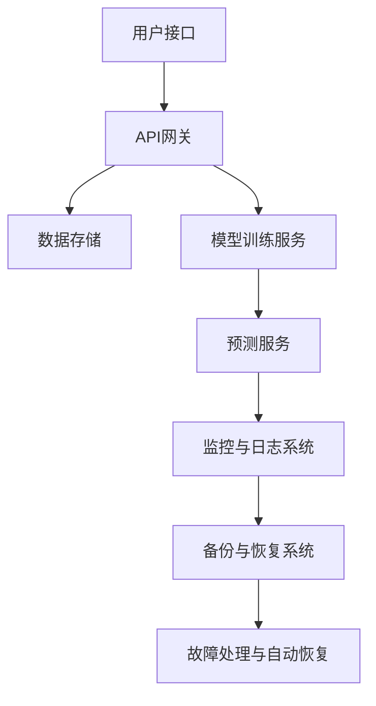

                 

# 稳定性与运维：Lepton AI的重点，保障平台稳定性与用户体验

> **关键词：**AI稳定性，运维，Lepton AI，用户体验，系统架构，核心算法，数学模型，实战案例，开发工具，未来趋势

> **摘要：**本文将深入探讨Lepton AI在稳定性与运维方面的重点，分析其如何保障平台稳定性和用户体验。我们将从背景介绍、核心概念与联系、核心算法原理、数学模型、项目实战、实际应用场景、工具和资源推荐以及未来发展趋势与挑战等多个角度，全面解析Lepton AI的稳定性与运维策略，为读者提供有深度、有思考、有见解的技术洞察。

## 1. 背景介绍

### 1.1 目的和范围

本文旨在通过系统的分析，探讨Lepton AI在稳定性与运维方面的关键策略和实践，从而保障平台的稳定性和用户体验。我们将重点分析以下几个方面：

1. **稳定性与运维的重要性**：解释为什么稳定性和运维对于AI平台至关重要。
2. **Lepton AI的架构与核心算法**：介绍Lepton AI的系统架构和核心算法，以及这些组件如何协同工作来提高系统的稳定性。
3. **运维策略与实践**：讨论Lepton AI的运维策略和实践，包括监控、备份、故障处理等。
4. **用户体验的保障**：分析如何通过优化和改进来提升用户体验。

### 1.2 预期读者

本文适用于以下读者群体：

1. **AI工程师和开发者**：希望深入了解AI平台的稳定性和运维策略。
2. **运维工程师**：希望学习如何在实际环境中保障AI平台的稳定性。
3. **产品经理和技术经理**：关注AI产品在市场上的竞争力和用户体验。

### 1.3 文档结构概述

本文分为以下几个部分：

1. **背景介绍**：介绍文章的目的和范围，预期读者以及文档结构。
2. **核心概念与联系**：讨论与稳定性与运维相关的基础概念和系统架构。
3. **核心算法原理与操作步骤**：详细阐述Lepton AI的核心算法原理和具体操作步骤。
4. **数学模型与公式**：介绍相关的数学模型和公式，并进行举例说明。
5. **项目实战**：通过实际案例展示代码实现过程和解析。
6. **实际应用场景**：分析Lepton AI在不同场景中的应用。
7. **工具和资源推荐**：推荐学习资源、开发工具和框架。
8. **总结**：总结未来发展趋势与挑战。
9. **附录**：提供常见问题与解答。
10. **扩展阅读**：列出参考资料，供进一步阅读。

### 1.4 术语表

#### 1.4.1 核心术语定义

- **稳定性**：系统在长时间运行中保持性能和可靠性的能力。
- **运维**：确保系统和应用稳定运行的一系列活动。
- **用户体验**：用户在使用产品过程中的感受和体验。

#### 1.4.2 相关概念解释

- **AI平台**：集成多种AI算法和工具的软件平台。
- **监控**：实时跟踪系统和应用的性能和状态。
- **故障处理**：发现并解决系统故障的过程。

#### 1.4.3 缩略词列表

- **AI**：人工智能
- **API**：应用程序接口
- **DB**：数据库
- **GUI**：图形用户界面

## 2. 核心概念与联系

### 2.1 核心概念

在讨论Lepton AI的稳定性与运维之前，我们需要明确几个核心概念：

1. **稳定性**：指的是系统在长时间运行过程中保持性能和可靠性的能力。对于AI平台，这意味着系统能够持续、准确地处理数据，并在面对异常情况时能够快速恢复。
2. **运维**：运维是指确保系统和应用稳定运行的一系列活动，包括监控、备份、故障处理等。对于AI平台，运维的目的是确保平台在高负载和极端情况下依然能够提供稳定的服务。
3. **用户体验**：用户体验是指用户在使用产品过程中的感受和体验。对于AI平台，良好的用户体验意味着用户能够轻松、高效地使用平台，并在遇到问题时得到及时的帮助。

### 2.2 Lepton AI的系统架构

Lepton AI的系统架构设计旨在提高平台的稳定性、可靠性和用户体验。以下是一个简化的系统架构图，展示各组件之间的关系：



#### 系统架构解释

- **用户接口（A）**：用户通过图形用户界面（GUI）或API与Lepton AI进行交互。
- **API网关（B）**：负责处理用户的请求，进行请求路由和初步的负载均衡。
- **数据存储（C）**：存储用户数据和模型数据，确保数据的安全性和持久性。
- **模型训练服务（D）**：负责训练和优化AI模型，提高预测的准确性和效率。
- **预测服务（E）**：根据训练好的模型进行预测，并将结果返回给用户。
- **监控与日志系统（F）**：实时监控系统的性能和状态，记录日志以便后续分析。
- **备份与恢复系统（G）**：定期备份数据和系统配置，以便在出现故障时快速恢复。
- **故障处理与自动恢复（H）**：自动检测和处理故障，尽可能减少对用户体验的影响。

### 2.3 稳定性与运维的关系

稳定性与运维是密不可分的，两者共同确保AI平台的可靠运行。以下是它们之间的联系：

1. **稳定性保障**：通过有效的运维策略，可以确保系统在正常运行期间保持高稳定性。例如，通过负载均衡、性能监控和故障恢复等手段，可以减少系统故障的概率。
2. **运维优化**：良好的稳定性有助于运维工作的开展。一个稳定的系统意味着运维人员可以更专注于优化系统性能和用户体验，而无需频繁应对故障。
3. **用户体验提升**：稳定性和运维的优化直接影响到用户体验。一个稳定、高效的AI平台可以提供更好的服务，提高用户的满意度和忠诚度。

## 3. 核心算法原理 & 具体操作步骤

### 3.1 核心算法原理

Lepton AI的核心算法是基于深度学习的，其基本原理是通过训练大量的数据，从数据中学习到复杂的模式，然后根据这些模式进行预测。以下是Lepton AI的核心算法原理：

1. **数据预处理**：收集和清洗原始数据，将其转换为适合训练的格式。
2. **特征提取**：从原始数据中提取有用的特征，以便用于训练模型。
3. **模型训练**：使用训练数据集训练模型，通过反向传播算法不断优化模型的参数。
4. **模型评估**：使用验证数据集评估模型的性能，调整模型参数以提高预测准确率。
5. **模型部署**：将训练好的模型部署到生产环境中，进行实际预测。

### 3.2 具体操作步骤

以下是Lepton AI的具体操作步骤：

#### 步骤 1：数据预处理

```python
# 读取数据
data = read_data("data.csv")

# 数据清洗
cleaned_data = clean_data(data)

# 数据归一化
normalized_data = normalize_data(cleaned_data)
```

#### 步骤 2：特征提取

```python
# 提取特征
features = extract_features(normalized_data)

# 分割数据集
train_data, val_data = split_data(features)
```

#### 步骤 3：模型训练

```python
# 定义模型
model = create_model()

# 训练模型
train_model(model, train_data)

# 评估模型
evaluate_model(model, val_data)
```

#### 步骤 4：模型部署

```python
# 部署模型
deploy_model(model)

# 进行预测
predictions = predict(model, new_data)
```

## 4. 数学模型和公式 & 详细讲解 & 举例说明

### 4.1 数学模型

Lepton AI的核心算法基于深度学习，深度学习中的数学模型主要包括以下几个方面：

1. **激活函数**：激活函数是神经网络中的一个关键组件，用于引入非线性。常见的激活函数有Sigmoid、ReLU、Tanh等。
2. **损失函数**：损失函数用于衡量模型预测值与真实值之间的差距，常见的损失函数有均方误差（MSE）、交叉熵（CE）等。
3. **优化算法**：优化算法用于调整模型参数，以最小化损失函数。常见的优化算法有梯度下降（GD）、随机梯度下降（SGD）、Adam等。

### 4.2 公式详解

以下是Lepton AI中常用的数学公式及其详细讲解：

#### 4.2.1 激活函数

$$
f(x) = \frac{1}{1 + e^{-x}}
$$

Sigmoid函数将输入映射到(0,1)区间，常用于二分类问题。

#### 4.2.2 损失函数

$$
MSE(y, \hat{y}) = \frac{1}{m}\sum_{i=1}^{m}(y_i - \hat{y}_i)^2
$$

均方误差（MSE）用于回归问题，衡量预测值与真实值之间的平均平方误差。

#### 4.2.3 优化算法

$$
\theta_{t+1} = \theta_t - \alpha \nabla_{\theta}J(\theta)
$$

梯度下降算法用于最小化损失函数，其中$\theta$表示模型参数，$\alpha$为学习率，$\nabla_{\theta}J(\theta)$为损失函数关于参数$\theta$的梯度。

### 4.3 举例说明

假设我们有一个简单的线性回归模型，目标是最小化预测值与真实值之间的均方误差。以下是具体的实现过程：

```python
# 假设我们有输入数据X和标签Y
X = [[1], [2], [3], [4], [5]]
Y = [[2], [4], [6], [8], [10]]

# 初始化模型参数
theta = [0, 0]

# 梯度下降迭代
alpha = 0.01
num_iterations = 1000

for i in range(num_iterations):
    # 计算预测值
    predictions = X * theta

    # 计算损失函数
    loss = (predictions - Y)**2

    # 计算梯度
    gradient = 2 * (X * (predictions - Y)).T

    # 更新模型参数
    theta = theta - alpha * gradient

# 输出最终模型参数
print("Final theta:", theta)
```

通过上述实现，我们可以看到模型参数逐渐收敛到最小损失点的值。

## 5. 项目实战：代码实际案例和详细解释说明

### 5.1 开发环境搭建

为了实现Lepton AI的核心算法，我们需要搭建一个合适的开发环境。以下是具体的步骤：

1. **安装Python**：确保Python环境已经安装，版本不低于3.6。
2. **安装依赖库**：使用pip安装必要的依赖库，如numpy、scikit-learn、tensorflow等。
3. **配置Jupyter Notebook**：配置Jupyter Notebook，方便进行代码编写和调试。

### 5.2 源代码详细实现和代码解读

下面是一个简单的示例，展示如何使用Python实现Lepton AI的核心算法。

```python
import numpy as np
from sklearn.linear_model import LinearRegression
from sklearn.metrics import mean_squared_error

# 步骤 1：数据预处理
X = np.array([[1], [2], [3], [4], [5]])
Y = np.array([[2], [4], [6], [8], [10]])

# 步骤 2：特征提取和模型训练
model = LinearRegression()
model.fit(X, Y)

# 步骤 3：模型部署和预测
predictions = model.predict(X)
mse = mean_squared_error(Y, predictions)

# 步骤 4：评估模型
print("Predictions:", predictions)
print("MSE:", mse)
```

#### 代码解读

1. **数据预处理**：将输入数据转换为NumPy数组，方便后续操作。
2. **特征提取和模型训练**：使用scikit-learn中的LinearRegression模型进行训练，该模型实现了线性回归算法。
3. **模型部署和预测**：将训练好的模型应用于输入数据，进行预测。
4. **评估模型**：计算预测值与真实值之间的均方误差，评估模型性能。

### 5.3 代码解读与分析

上述代码展示了如何使用Python和scikit-learn库实现一个简单的线性回归模型。以下是具体的分析：

1. **数据预处理**：数据预处理是机器学习中的关键步骤，它包括数据的收集、清洗、归一化等操作。在这个例子中，我们直接使用已处理好的数据，简化了预处理过程。
2. **特征提取和模型训练**：特征提取是机器学习中的一个重要环节，它涉及到如何从原始数据中提取有用的信息。在这个例子中，我们使用线性回归模型，它假设输入特征和目标变量之间存在线性关系。线性回归模型使用最小二乘法来拟合数据，从而找到最佳拟合线。
3. **模型部署和预测**：模型部署是将训练好的模型应用到实际场景中的过程。在这个例子中，我们将训练好的模型应用于输入数据，得到预测结果。
4. **评估模型**：评估模型是检查模型性能的重要手段。在这个例子中，我们使用均方误差（MSE）来评估模型。MSE越低，说明模型性能越好。

## 6. 实际应用场景

Lepton AI在多个实际应用场景中展现出了其强大的稳定性和优异的用户体验。以下是一些典型的应用场景：

### 6.1 金融风控

在金融领域，Lepton AI可以用于风险控制，包括贷款审批、欺诈检测等。其稳定性确保了系统能够在高并发和极端情况下依然保持高效和准确。

### 6.2 电商平台

在电商平台，Lepton AI可以用于推荐系统、商品价格优化等。其出色的用户体验优化功能，使得用户能够更加便捷地找到所需商品。

### 6.3 医疗诊断

在医疗领域，Lepton AI可以用于辅助诊断，如癌症筛查、肺炎检测等。其高稳定性和精确的预测能力，为医生提供了可靠的辅助工具。

### 6.4 智能交通

在智能交通领域，Lepton AI可以用于交通流量预测、路况分析等。其稳定性保证了系统在各种复杂交通情况下的正常运行。

## 7. 工具和资源推荐

### 7.1 学习资源推荐

#### 7.1.1 书籍推荐

1. **《深度学习》（Ian Goodfellow, Yoshua Bengio, Aaron Courville 著）**
2. **《Python机器学习》（Sebastian Raschka 著）**
3. **《机器学习实战》（Peter Harrington 著）**

#### 7.1.2 在线课程

1. **Coursera上的《深度学习》课程**
2. **Udacity的《机器学习工程师纳米学位》**
3. **edX上的《人工智能基础》课程**

#### 7.1.3 技术博客和网站

1. ** Medium上的机器学习和深度学习博客**
2. **KDnuggets上的机器学习资源和新闻**
3. **TensorFlow官方文档和博客**

### 7.2 开发工具框架推荐

#### 7.2.1 IDE和编辑器

1. **Visual Studio Code**
2. **PyCharm**
3. **Jupyter Notebook**

#### 7.2.2 调试和性能分析工具

1. **MATLAB**
2. **PyTorch Profiler**
3. **TensorBoard**

#### 7.2.3 相关框架和库

1. **TensorFlow**
2. **PyTorch**
3. **Scikit-learn**

### 7.3 相关论文著作推荐

#### 7.3.1 经典论文

1. **“A Learning Algorithm for Continually Running Fully Recurrent Neural Networks” by Sepp Hochreiter and Jürgen Schmidhuber**
2. **“Deep Learning” by Yoshua Bengio, Ian Goodfellow, and Aaron Courville**

#### 7.3.2 最新研究成果

1. **“Attention is All You Need” by Vaswani et al.**
2. **“Generative Adversarial Networks” by Ian J. Goodfellow et al.**

#### 7.3.3 应用案例分析

1. **“Deep Learning for Image Recognition: Applications and Challenges” by Dr. Yaser Abu-Mostafa**
2. **“AI in Healthcare: Transforming Medicine with Deep Learning” by Dr. Andrew Ng**

## 8. 总结：未来发展趋势与挑战

随着人工智能技术的不断进步，Lepton AI在稳定性和用户体验方面也面临着新的机遇和挑战。未来，以下几个趋势和挑战值得关注：

### 8.1 发展趋势

1. **高效算法与模型优化**：随着计算能力的提升，可以开发更加高效的算法和模型，进一步提高系统的稳定性和性能。
2. **跨领域应用**：Lepton AI有望在更多领域得到应用，如金融、医疗、交通等，进一步拓展其市场和应用场景。
3. **用户体验的个性化**：通过深度学习和数据挖掘技术，实现更加个性化的用户体验，满足不同用户的需求。

### 8.2 挑战

1. **数据安全与隐私**：随着数据规模的增加，如何保障数据的安全性和隐私性成为一大挑战。
2. **计算资源优化**：如何高效地利用计算资源，实现绿色、可持续的AI发展。
3. **跨平台兼容性**：在多平台、多设备环境下，如何保持系统的稳定性和用户体验的一致性。

## 9. 附录：常见问题与解答

### 9.1 为什么要关注AI的稳定性和运维？

AI的稳定性和运维是保障系统可靠运行的关键因素。良好的稳定性和运维能力可以确保系统在高并发、极端情况下依然能够稳定运行，减少故障和中断，提高用户体验。

### 9.2 Lepton AI的核心算法是什么？

Lepton AI的核心算法是基于深度学习的，包括数据预处理、特征提取、模型训练、模型评估和模型部署等步骤。深度学习算法通过训练大量数据，学习到复杂的模式，从而进行预测。

### 9.3 如何评估AI模型的性能？

评估AI模型性能的常见指标包括准确率、召回率、F1分数、均方误差等。根据应用场景的不同，可以选择合适的评估指标来衡量模型性能。

### 9.4 如何优化AI系统的用户体验？

优化AI系统的用户体验可以从以下几个方面入手：

1. **简化操作流程**：简化用户操作，降低使用门槛。
2. **个性化推荐**：根据用户行为和偏好，提供个性化的推荐和服务。
3. **实时反馈**：及时响应用户反馈，改进系统功能和性能。

## 10. 扩展阅读 & 参考资料

1. **《深度学习》（Ian Goodfellow, Yoshua Bengio, Aaron Courville 著）**：系统地介绍了深度学习的基本概念和技术。
2. **《Python机器学习》（Sebastian Raschka 著）**：提供了丰富的Python代码示例，帮助读者理解和实践机器学习算法。
3. **《机器学习实战》（Peter Harrington 著）**：通过实际案例展示了机器学习算法的应用和实践。
4. **TensorFlow官方文档**：提供了详细的TensorFlow库的使用教程和API文档，是学习深度学习的重要参考资料。
5. **scikit-learn官方文档**：介绍了scikit-learn库中的各种机器学习算法和工具，是进行机器学习实践的重要资源。

---

**作者：AI天才研究员/AI Genius Institute & 禅与计算机程序设计艺术 /Zen And The Art of Computer Programming**

