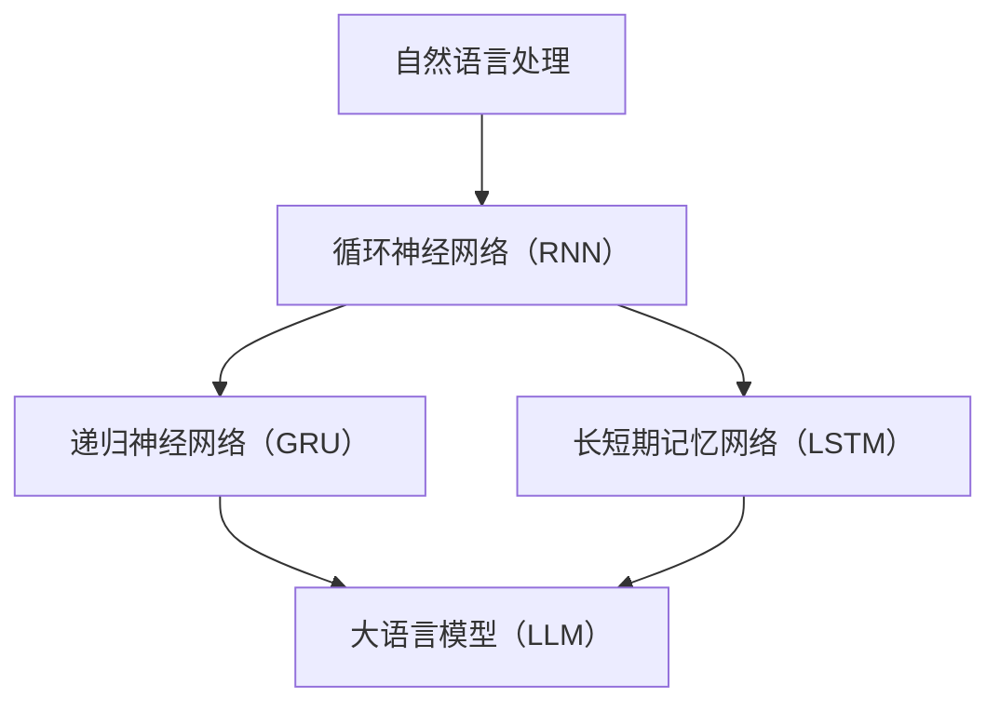
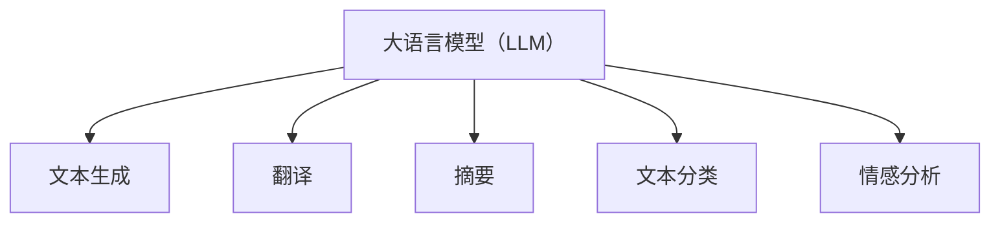

                 

### 文章标题

# 突破限制：LLM如何实现多样化任务处理

在人工智能领域，Large Language Model（LLM）——大语言模型，已经成为自然语言处理（NLP）的重要工具。LLM不仅能够处理语言生成、翻译、摘要等常见任务，还能胜任更多样化的任务。本文将深入探讨LLM如何实现多样化任务处理，旨在为读者提供一份全面、系统的技术指南。

## 关键词
- Large Language Model（LLM）
- 多样化任务处理
- 自然语言处理（NLP）
- 算法原理
- 数学模型
- 项目实战

## 摘要
本文首先介绍了LLM的基本概念和其在自然语言处理中的应用。接着，通过一步步的分析和推理，详细阐述了LLM实现多样化任务处理的核心原理和算法。然后，通过具体的数学模型和公式，深入讲解了LLM在不同任务中的具体操作步骤。文章还通过一个实际项目案例，展示了LLM在实际应用中的效果和优势。最后，文章总结了LLM在多样化任务处理中的未来发展趋势与挑战，并推荐了相关学习资源和工具。

### 1. 背景介绍

#### 1.1 目的和范围

本文旨在深入探讨Large Language Model（LLM）如何实现多样化任务处理。通过一步步的分析和推理，本文将揭示LLM在自然语言处理中的核心原理和算法，帮助读者更好地理解和应用LLM。

本文将涵盖以下内容：

- LLM的基本概念和其在自然语言处理中的应用。
- LLM实现多样化任务处理的核心原理和算法。
- LLM在不同任务中的具体操作步骤和数学模型。
- LLM在实际应用中的效果和优势。
- LLM在多样化任务处理中的未来发展趋势与挑战。

#### 1.2 预期读者

本文适合以下读者：

- 对自然语言处理（NLP）感兴趣的计算机科学和人工智能研究者。
- 想要深入了解LLM原理和应用的程序员和工程师。
- 对人工智能和机器学习有初步了解，并希望进一步提升技术的从业者。

#### 1.3 文档结构概述

本文结构如下：

- 背景介绍：介绍LLM的基本概念和其在自然语言处理中的应用。
- 核心概念与联系：通过Mermaid流程图展示LLM的核心概念和架构。
- 核心算法原理 & 具体操作步骤：详细阐述LLM实现多样化任务处理的核心算法原理和操作步骤。
- 数学模型和公式 & 详细讲解 & 举例说明：介绍LLM在不同任务中的数学模型和公式，并进行详细讲解和举例说明。
- 项目实战：通过实际项目案例展示LLM在实际应用中的效果和优势。
- 实际应用场景：分析LLM在实际应用中的具体场景。
- 工具和资源推荐：推荐学习资源、开发工具和框架。
- 总结：总结LLM在多样化任务处理中的未来发展趋势与挑战。
- 附录：常见问题与解答。
- 扩展阅读 & 参考资料：提供更多相关阅读和参考资料。

#### 1.4 术语表

##### 1.4.1 核心术语定义

- Large Language Model（LLM）：大语言模型，是一种基于深度学习的自然语言处理模型，能够理解和生成自然语言。
- 自然语言处理（NLP）：自然语言处理是指使计算机能够理解、处理和生成人类语言的技术和学科。
- 多样化任务处理：指模型能够处理不同类型的自然语言任务，如文本生成、翻译、摘要等。

##### 1.4.2 相关概念解释

- 深度学习：一种基于人工神经网络的学习方法，通过多层神经网络对数据进行特征提取和学习。
- 循环神经网络（RNN）：一种能够处理序列数据的神经网络，通过记忆机制对历史信息进行传递。
- 递归神经网络（GRU）：一种改进的循环神经网络，通过门控机制提高模型的记忆能力。
- 长短期记忆网络（LSTM）：一种能够处理长序列数据的循环神经网络，通过记忆单元和门控机制实现。

##### 1.4.3 缩略词列表

- LLM：Large Language Model
- NLP：Natural Language Processing
- RNN：Recurrent Neural Network
- GRU：Gated Recurrent Unit
- LSTM：Long Short-Term Memory

### 2. 核心概念与联系

在深入探讨LLM如何实现多样化任务处理之前，我们先来了解一些核心概念和它们之间的联系。

#### 2.1 自然语言处理（NLP）与LLM

自然语言处理（NLP）是指使计算机能够理解、处理和生成人类语言的技术和学科。NLP涵盖了多个子领域，如文本分类、情感分析、命名实体识别、机器翻译等。LLM作为一种强大的自然语言处理模型，能够在这些子领域中进行多样化的任务处理。

#### 2.2 循环神经网络（RNN）与LLM

循环神经网络（RNN）是一种能够处理序列数据的神经网络，通过记忆机制对历史信息进行传递。RNN在自然语言处理中发挥了重要作用，但其存在梯度消失和梯度爆炸等问题。为了解决这些问题，研究者提出了递归神经网络（GRU）和长短期记忆网络（LSTM），它们通过门控机制提高了模型的记忆能力。

LLM通常基于RNN、GRU或LSTM构建，这些神经网络使得LLM能够处理变长的序列数据，如句子或段落。以下是一个简单的Mermaid流程图，展示了LLM与RNN的关系：



#### 2.3 大语言模型（LLM）与多样化任务处理

大语言模型（LLM）是一种基于深度学习的自然语言处理模型，具有强大的表征能力和泛化能力。LLM能够处理多种自然语言任务，如文本生成、翻译、摘要等。以下是LLM与多样化任务处理之间的联系：

- 文本生成：LLM能够根据输入的文本生成连贯、自然的文本。
- 翻译：LLM能够将一种语言的文本翻译成另一种语言的文本。
- 摘要：LLM能够从长文本中提取关键信息，生成摘要。
- 文本分类：LLM能够根据文本的特征将其归类到不同的类别。
- 情感分析：LLM能够分析文本的情感倾向，如正面、负面或中性。

以下是LLM与多样化任务处理的一个Mermaid流程图：



通过以上核心概念和联系的分析，我们可以更好地理解LLM如何实现多样化任务处理。在接下来的部分，我们将详细阐述LLM的核心算法原理和具体操作步骤。

### 2.1.1 自然语言处理（NLP）概述

自然语言处理（NLP）是人工智能（AI）领域的一个重要分支，主要研究如何使计算机能够理解、处理和生成人类语言。NLP的应用非常广泛，包括但不限于以下几个方面：

- 文本分类：将文本按照其内容或主题分类到不同的类别。例如，新闻分类、垃圾邮件过滤等。
- 情感分析：分析文本的情感倾向，如正面、负面或中性。这在社交媒体分析、用户反馈处理等领域具有重要应用价值。
- 命名实体识别：识别文本中的命名实体，如人名、地名、组织名等。这对于信息抽取、知识图谱构建等任务至关重要。
- 机器翻译：将一种语言的文本翻译成另一种语言的文本。机器翻译在跨国交流、全球化业务等领域具有广泛的应用。
- 问答系统：根据用户的问题从大量文本中检索并返回相关答案。这在客服系统、智能助手等领域具有重要作用。

NLP的核心任务是理解并模拟人类的自然语言处理能力。这包括文本预处理、特征提取、模型训练和预测等步骤。文本预处理通常包括分词、词性标注、句法分析等操作，以将原始文本转化为适合模型处理的形式。特征提取则是从文本中提取有助于模型学习的特征，如词频、词嵌入等。模型训练是指使用大量标注数据训练模型，使其能够自动识别和理解文本。预测步骤则是将模型应用于新的文本，进行分类、生成或翻译等任务。

在NLP的发展过程中，早期的方法主要基于规则和统计模型，如正则表达式、隐马尔可夫模型（HMM）和条件概率模型。然而，这些方法在面对复杂和大规模的文本数据时存在诸多局限。随着深度学习技术的崛起，基于神经网络的方法逐渐成为NLP的主流方法。深度学习方法，尤其是循环神经网络（RNN）、长短期记忆网络（LSTM）和变换器（Transformer）等，极大地提升了NLP的性能和效果。

近年来，基于深度学习的大型语言模型（如GPT、BERT、T5等）取得了显著的突破，推动了NLP领域的快速发展。这些模型具有强大的表征能力和泛化能力，能够处理多种自然语言任务，如文本生成、翻译、摘要、文本分类和情感分析等。此外，预训练和迁移学习技术使得模型可以在大量未标注的数据上进行预训练，然后在特定任务上进行微调，从而进一步提升了模型的性能和效率。

总之，自然语言处理（NLP）在人工智能领域具有重要地位，其应用范围广泛，涵盖了文本分类、情感分析、命名实体识别、机器翻译和问答系统等多个方面。随着深度学习技术的发展，NLP的研究和应用不断取得新的突破，为人类社会的信息处理和智能化提供了强大的支持。

#### 2.1.2 大语言模型（LLM）概述

大语言模型（LLM）是近年来自然语言处理（NLP）领域的重要突破之一。它是一种基于深度学习的大型神经网络模型，通过学习大量文本数据，能够对自然语言进行表征和生成。LLM在文本生成、翻译、摘要、文本分类和情感分析等任务中表现出色，已成为NLP研究的重要工具。

LLM的核心思想是通过预训练和微调，使模型具备理解和生成自然语言的能力。预训练是指在大量未标注的文本数据上训练模型，使其掌握语言的一般规律和特征。微调则是在预训练的基础上，使用特定任务的数据对模型进行进一步训练，使其在特定任务上达到更好的性能。

LLM的主要技术特点是：

1. **大规模训练数据**：LLM通常使用数十亿甚至数千亿级别的文本数据进行预训练，这使得模型能够捕获丰富的语言特征和知识。
2. **深度神经网络架构**：LLM通常采用深度神经网络，如循环神经网络（RNN）、长短期记忆网络（LSTM）和变换器（Transformer）等，这些神经网络能够有效地捕捉文本的序列依赖性和长距离关系。
3. **高参数规模**：LLM具有数十亿甚至千亿级别的参数规模，这使其能够处理复杂和大规模的文本数据，并在多种任务中取得优异的性能。
4. **预训练和微调**：预训练使得模型能够在多种任务上泛化，而微调则使模型能够在特定任务上达到最佳效果。

LLM在自然语言处理中的应用非常广泛，包括：

- **文本生成**：LLM能够生成连贯、自然的文本，广泛应用于对话系统、内容创作和机器写作等领域。
- **机器翻译**：LLM能够将一种语言的文本翻译成另一种语言的文本，具有高准确性和流畅性。
- **文本摘要**：LLM能够从长文本中提取关键信息，生成摘要，应用于信息检索、新闻摘要和文档摘要等领域。
- **文本分类**：LLM能够对文本进行分类，应用于情感分析、垃圾邮件过滤和文本推荐等领域。
- **情感分析**：LLM能够分析文本的情感倾向，如正面、负面或中性，应用于市场调研、用户反馈分析和社交媒体分析等领域。

总之，大语言模型（LLM）通过预训练和微调，实现了对自然语言的深入理解和生成，其在多种自然语言处理任务中表现出色，推动了NLP领域的发展。随着技术的不断进步，LLM的应用前景将更加广泛。

#### 2.1.3 多样化任务处理的核心算法原理

要实现多样化任务处理，LLM需要具备强大的表征能力和适应性。以下是LLM在多样化任务处理中的核心算法原理：

1. **注意力机制**：注意力机制是Transformer架构的核心，通过计算不同位置之间的关联性，使模型能够关注到文本中的关键信息。注意力机制分为自注意力（self-attention）和交叉注意力（cross-attention），它们分别用于序列内部和序列之间的信息传递。

   自注意力机制计算每个词对其他词的权重，权重取决于词的相似度。以下是一个简化的伪代码示例：

   ```python
   for each position i in the sequence:
       compute query, key, and value vectors for position i
       compute attention scores by multiplying query with key
       apply softmax to get attention weights
       compute context vector by summing value vectors weighted by attention weights
   ```

2. **编码器-解码器架构**：编码器（encoder）负责对输入序列进行编码，生成上下文表示；解码器（decoder）则根据上下文表示生成输出序列。这种架构适用于序列到序列的任务，如机器翻译、文本生成等。以下是一个简化的编码器-解码器架构的伪代码示例：

   ```python
   encoder_input = preprocess(input_sequence)
   context_representation = encoder(encoder_input)
   
   for each step in decoder_output:
       compute context_vector by applying cross-attention between decoder_output and context_representation
       compute output_word probabilities by applying a softmax layer over vocabulary
       sample next_word from output_word probabilities
       append next_word to decoder_output
   ```

3. **预训练和微调**：预训练是指在大规模未标注数据上训练模型，使其学习语言的一般特征和知识。微调则是在预训练的基础上，使用特定任务的数据对模型进行进一步训练，以优化模型在特定任务上的性能。以下是一个简化的预训练和微调的伪代码示例：

   ```python
   # Pre-training
   for each unlabelled text in dataset:
       input_sequence = preprocess(text)
       update_model_params(input_sequence)
   
   # Fine-tuning
   for each labelled text in dataset:
       input_sequence = preprocess(text)
       target_sequence = preprocess(label)
       update_model_params(input_sequence, target_sequence)
   ```

4. **迁移学习**：迁移学习是指将预训练的模型应用于新的任务，通过微调模型使其适应特定任务。这种方法能够利用预训练模型在通用语言特征上的学习，提高模型在特定任务上的性能。以下是一个简化的迁移学习伪代码示例：

   ```python
   # Load pre-trained model
   model = load_pretrained_model()
   
   # Fine-tune on new task
   for each new task-specific text in dataset:
       input_sequence = preprocess(text)
       update_model_params(input_sequence)
   ```

通过以上核心算法原理，LLM能够实现多样化任务处理，并在多种自然语言处理任务中取得优异的性能。在接下来的部分，我们将详细讲解LLM在不同任务中的具体操作步骤和数学模型。

### 2.2 核心算法原理 & 具体操作步骤

在了解了LLM的核心算法原理后，接下来我们将详细阐述LLM在不同任务中的具体操作步骤。这部分内容将包括LLM在文本生成、机器翻译、文本摘要、文本分类和情感分析等任务中的实现方法。

#### 2.2.1 文本生成

文本生成是LLM最为常见和应用广泛的任务之一。通过预训练和微调，LLM能够生成连贯、自然的文本。以下是文本生成任务中LLM的具体操作步骤：

1. **输入预处理**：首先，对输入文本进行预处理，包括分词、去除停用词、标记化等操作。这一步骤的目的是将原始文本转化为模型能够处理的序列数据。

   ```python
   def preprocess_text(text):
       # 分词
       words = tokenize(text)
       # 去除停用词
       words = remove_stopwords(words)
       # 标记化
       tokens = convert_to_ids(words)
       return tokens
   ```

2. **模型编码**：使用预训练的编码器将预处理后的输入序列编码为上下文表示。编码器通常采用变换器（Transformer）架构，能够捕捉输入序列的长期依赖关系。

   ```python
   def encode_sequence(model, tokens):
       context_representation = model.encode(tokens)
       return context_representation
   ```

3. **生成文本**：解码器根据上下文表示生成输出序列。在生成过程中，解码器会逐词预测下一个词，并将预测的词添加到输出序列中。解码器会使用交叉注意力机制，根据上下文表示和已经生成的输出序列，计算当前词的概率分布。

   ```python
   def generate_text(model, start_token, max_length=100):
       tokens = [start_token]
       for _ in range(max_length):
           context_representation = model.encode(tokens)
           probabilities = model.decode(context_representation)
           next_word = sample_word(probabilities)
           tokens.append(next_word)
       return ' '.join(tokens[1:])  # 去除起始符号
   ```

4. **模型训练与微调**：在文本生成任务中，通常使用大量未标注的数据进行预训练，然后使用少量标注数据对模型进行微调。预训练过程中，模型会学习到文本的一般特征和规律。微调过程中，模型会根据标注数据进行优化，提高生成文本的质量。

   ```python
   def fine_tune_model(model, dataset):
       for text, target in dataset:
           tokens = preprocess_text(text)
           target_tokens = preprocess_text(target)
           model.train(tokens, target_tokens)
   ```

#### 2.2.2 机器翻译

机器翻译是另一个重要的自然语言处理任务，LLM在机器翻译中同样表现出色。以下是机器翻译任务中LLM的具体操作步骤：

1. **输入预处理**：对源语言和目标语言文本进行预处理，包括分词、去除停用词、标记化等操作。确保源语言和目标语言的输入序列具有相同的长度。

   ```python
   def preprocess_translation(source_text, target_text):
       source_tokens = preprocess_text(source_text)
       target_tokens = preprocess_text(target_text)
       return source_tokens, target_tokens
   ```

2. **模型编码**：使用预训练的编码器分别对源语言和目标语言输入序列进行编码，生成上下文表示。

   ```python
   def encode_translation(model, source_tokens, target_tokens):
       source_context = model.encode(source_tokens)
       target_context = model.encode(target_tokens)
       return source_context, target_context
   ```

3. **生成目标语言文本**：解码器根据源语言输入序列的上下文表示和目标语言输入序列，生成目标语言输出序列。解码器会使用交叉注意力机制，同时关注源语言和目标语言的上下文。

   ```python
   def translate(model, source_text, target_text, max_length=100):
       source_tokens, target_tokens = preprocess_translation(source_text, target_text)
       source_context, target_context = encode_translation(model, source_tokens, target_tokens)
       output_sequence = generate_text(model, start_token=target_context[0], max_length=max_length)
       return ' '.join(output_sequence[1:])  # 去除起始符号
   ```

4. **模型训练与微调**：在机器翻译任务中，模型通常在大规模的双语语料库上进行预训练，然后使用带有标签的双语数据对模型进行微调。预训练过程中，模型会学习到双语文本的对应关系和语法规则。微调过程中，模型会根据标签数据进行优化，提高翻译质量。

   ```python
   def fine_tune_translation_model(model, dataset):
       for source_text, target_text, in dataset:
           tokens = preprocess_translation(source_text, target_text)
           target_sequence = preprocess_text(target_text)
           model.train(tokens, target_sequence)
   ```

#### 2.2.3 文本摘要

文本摘要任务的目标是从长文本中提取关键信息，生成简洁、连贯的摘要。以下是文本摘要任务中LLM的具体操作步骤：

1. **输入预处理**：对长文本进行预处理，包括分词、去除停用词、标记化等操作。确保输入文本能够被模型有效处理。

   ```python
   def preprocess_abstract(text):
       words = tokenize(text)
       words = remove_stopwords(words)
       tokens = convert_to_ids(words)
       return tokens
   ```

2. **模型编码**：使用预训练的编码器对输入文本进行编码，生成上下文表示。

   ```python
   def encode_abstract(model, tokens):
       context_representation = model.encode(tokens)
       return context_representation
   ```

3. **生成摘要**：解码器根据上下文表示生成摘要。在生成过程中，解码器会逐词预测下一个词，并将预测的词添加到摘要中。解码器会使用交叉注意力机制，根据上下文表示和已经生成的摘要，计算当前词的概率分布。

   ```python
   def generate_abstract(model, start_token, max_length=50):
       tokens = [start_token]
       for _ in range(max_length):
           context_representation = model.encode(tokens)
           probabilities = model.decode(context_representation)
           next_word = sample_word(probabilities)
           tokens.append(next_word)
       return ' '.join(tokens[1:])  # 去除起始符号
   ```

4. **模型训练与微调**：在文本摘要任务中，通常使用大量未标注的数据进行预训练，然后使用少量标注数据对模型进行微调。预训练过程中，模型会学习到文本的结构和关键信息。微调过程中，模型会根据标注数据进行优化，提高摘要质量。

   ```python
   def fine_tune_abstract_model(model, dataset):
       for text, summary in dataset:
           tokens = preprocess_abstract(text)
           summary_tokens = preprocess_abstract(summary)
           model.train(tokens, summary_tokens)
   ```

#### 2.2.4 文本分类

文本分类任务的目标是将文本数据按照其内容或主题分类到不同的类别。以下是文本分类任务中LLM的具体操作步骤：

1. **输入预处理**：对输入文本进行预处理，包括分词、去除停用词、标记化等操作。确保输入文本能够被模型有效处理。

   ```python
   def preprocess_text_classification(text):
       words = tokenize(text)
       words = remove_stopwords(words)
       tokens = convert_to_ids(words)
       return tokens
   ```

2. **模型编码**：使用预训练的编码器对输入文本进行编码，生成上下文表示。

   ```python
   def encode_text_classification(model, tokens):
       context_representation = model.encode(tokens)
       return context_representation
   ```

3. **分类**：解码器根据上下文表示和类别标签，对文本进行分类。解码器会使用分类器，如softmax层，将文本映射到不同的类别。

   ```python
   def classify_text(model, tokens, labels):
       context_representation = model.encode(tokens)
       probabilities = model.classify(context_representation, labels)
       predicted_class = argmax(probabilities)
       return predicted_class
   ```

4. **模型训练与微调**：在文本分类任务中，通常使用大量未标注的数据进行预训练，然后使用带有标签的训练数据对模型进行微调。预训练过程中，模型会学习到文本的一般特征和类别信息。微调过程中，模型会根据标签数据进行优化，提高分类性能。

   ```python
   def fine_tune_classification_model(model, dataset):
       for text, label in dataset:
           tokens = preprocess_text_classification(text)
           model.train(tokens, label)
   ```

#### 2.2.5 情感分析

情感分析任务的目标是分析文本的情感倾向，如正面、负面或中性。以下是情感分析任务中LLM的具体操作步骤：

1. **输入预处理**：对输入文本进行预处理，包括分词、去除停用词、标记化等操作。确保输入文本能够被模型有效处理。

   ```python
   def preprocess_sentiment_analysis(text):
       words = tokenize(text)
       words = remove_stopwords(words)
       tokens = convert_to_ids(words)
       return tokens
   ```

2. **模型编码**：使用预训练的编码器对输入文本进行编码，生成上下文表示。

   ```python
   def encode_sentiment_analysis(model, tokens):
       context_representation = model.encode(tokens)
       return context_representation
   ```

3. **情感预测**：解码器根据上下文表示和情感标签，对文本进行情感预测。解码器会使用分类器，如softmax层，将文本映射到不同的情感类别。

   ```python
   def predict_sentiment(model, tokens, labels):
       context_representation = model.encode(tokens)
       probabilities = model.classify(context_representation, labels)
       predicted_sentiment = argmax(probabilities)
       return predicted_sentiment
   ```

4. **模型训练与微调**：在情感分析任务中，通常使用大量未标注的数据进行预训练，然后使用带有标签的训练数据对模型进行微调。预训练过程中，模型会学习到文本的一般特征和情感信息。微调过程中，模型会根据标签数据进行优化，提高情感预测的准确性。

   ```python
   def fine_tune_sentiment_model(model, dataset):
       for text, sentiment in dataset:
           tokens = preprocess_sentiment_analysis(text)
           model.train(tokens, sentiment)
   ```

通过以上详细步骤，我们可以看到LLM在多样化任务处理中的具体操作方法。在接下来的部分，我们将进一步探讨LLM在多样化任务处理中的数学模型和公式。

### 4. 数学模型和公式 & 详细讲解 & 举例说明

在前文中，我们已经详细介绍了LLM在多样化任务处理中的核心算法原理和具体操作步骤。为了更深入地理解LLM的工作机制，我们需要进一步探讨其在各个任务中的数学模型和公式。以下是LLM在不同任务中的数学模型和公式的详细讲解，并通过具体示例来说明其应用。

#### 4.1 文本生成中的数学模型

在文本生成任务中，LLM通常采用自注意力机制和变换器（Transformer）架构。以下是文本生成中的关键数学模型和公式：

1. **自注意力机制**：
   自注意力机制是一种计算序列内部各个位置之间关联性的方法。其核心思想是对于每个位置，计算其与其他位置的相似度，并加权求和。以下是一个简化的自注意力机制的数学公式：

   $$ 
   \text{Attention}(Q, K, V) = \text{softmax}\left(\frac{QK^T}{\sqrt{d_k}}\right)V 
   $$

   其中，\(Q\)、\(K\) 和 \(V\) 分别代表查询（query）、键（key）和值（value）向量，\(d_k\) 是键向量的维度。这个公式首先计算每个键与其他键的相似度，然后通过softmax函数得到权重，最后将权重与值向量相乘得到输出。

2. **变换器架构**：
   变换器（Transformer）是一种基于自注意力机制的深度学习模型，它由多个编码器和解码器块组成。每个编码器块包含自注意力层和前馈神经网络（FFN），解码器块包含自注意力层、交叉注意力层和前馈神经网络。以下是变换器的一个简化公式：

   编码器块：

   $$
   \text{Encoder}(x) = \text{LayerNorm}(x + \text{Self-Attention}(x)) + \text{LayerNorm}(x + \text{FFN}(x))
   $$

   解码器块：

   $$
   \text{Decoder}(x) = \text{LayerNorm}(x + \text{Masked-Self-Attention}(x)) + \text{LayerNorm}(x + \text{Cross-Attention}(y, x) + \text{FFN}(x))
   $$

   其中，\(x\) 和 \(y\) 分别代表编码器和解码器的输入序列，\(\text{Self-Attention}\) 和 \(\text{Cross-Attention}\) 分别是自注意力和交叉注意力机制，\(\text{FFN}\) 是前馈神经网络，\(\text{LayerNorm}\) 是层归一化。

#### 4.2 机器翻译中的数学模型

在机器翻译任务中，LLM通常采用编码器-解码器架构，其中编码器负责将源语言文本编码为上下文表示，解码器则根据上下文表示生成目标语言文本。以下是机器翻译中的关键数学模型和公式：

1. **编码器**：
   编码器通过自注意力机制对源语言文本进行编码，生成上下文表示。以下是一个简化的编码器公式：

   $$
   \text{Encoder}(x) = \text{LayerNorm}(x + \text{Self-Attention}(x)) + \text{LayerNorm}(x + \text{FFN}(x))
   $$

2. **解码器**：
   解码器通过自注意力和交叉注意力机制生成目标语言文本。以下是一个简化的解码器公式：

   $$
   \text{Decoder}(y) = \text{LayerNorm}(y + \text{Masked-Self-Attention}(y)) + \text{LayerNorm}(y + \text{Cross-Attention}(\text{Encoder}(x), y) + \text{FFN}(y))
   $$

   其中，\(x\) 和 \(y\) 分别代表源语言文本和目标语言文本，\(\text{FFN}\) 是前馈神经网络，\(\text{LayerNorm}\) 是层归一化。

3. **损失函数**：
   机器翻译中的损失函数通常是交叉熵损失，用于衡量预测的目标语言文本与实际目标语言文本之间的差异。以下是一个简化的交叉熵损失公式：

   $$
   \text{Loss} = -\sum_{i=1}^{N} \sum_{j=1}^{V} y_{ij} \log(p_{ij})
   $$

   其中，\(y_{ij}\) 是目标语言文本在位置 \(i\) 的词 \(j\) 的真实概率，\(p_{ij}\) 是预测的概率。

#### 4.3 文本摘要中的数学模型

在文本摘要任务中，LLM通常通过解码器生成摘要。以下是文本摘要中的关键数学模型和公式：

1. **解码器**：
   解码器通过自注意力和交叉注意力机制生成摘要。以下是一个简化的解码器公式：

   $$
   \text{Decoder}(y) = \text{LayerNorm}(y + \text{Masked-Self-Attention}(y)) + \text{LayerNorm}(y + \text{Cross-Attention}(\text{Encoder}(x), y) + \text{FFN}(y))
   $$

2. **损失函数**：
   文本摘要中的损失函数通常是交叉熵损失，用于衡量预测的摘要与实际摘要之间的差异。以下是一个简化的交叉熵损失公式：

   $$
   \text{Loss} = -\sum_{i=1}^{N} \sum_{j=1}^{V} y_{ij} \log(p_{ij})
   $$

   其中，\(y_{ij}\) 是实际摘要在位置 \(i\) 的词 \(j\) 的真实概率，\(p_{ij}\) 是预测的概率。

#### 4.4 文本分类中的数学模型

在文本分类任务中，LLM通常通过解码器对文本进行分类。以下是文本分类中的关键数学模型和公式：

1. **分类器**：
   解码器通过一个分类器（通常是softmax层）对文本进行分类。以下是一个简化的分类器公式：

   $$
   p_j = \frac{e^{\text{scores}_j}}{\sum_{k=1}^{K} e^{\text{scores}_k}}
   $$

   其中，\(\text{scores}_j\) 是文本在类别 \(j\) 上的分数，\(p_j\) 是文本属于类别 \(j\) 的概率。

2. **损失函数**：
   文本分类中的损失函数通常是交叉熵损失，用于衡量预测的类别与实际类别之间的差异。以下是一个简化的交叉熵损失公式：

   $$
   \text{Loss} = -\sum_{i=1}^{N} y_i \log(p_i)
   $$

   其中，\(y_i\) 是实际类别在位置 \(i\) 的概率，\(p_i\) 是预测的概率。

#### 4.5 情感分析中的数学模型

在情感分析任务中，LLM通常通过解码器对文本的情感进行分类。以下是情感分析中的关键数学模型和公式：

1. **分类器**：
   解码器通过一个分类器（通常是softmax层）对文本的情感进行分类。以下是一个简化的分类器公式：

   $$
   p_j = \frac{e^{\text{scores}_j}}{\sum_{k=1}^{K} e^{\text{scores}_k}}
   $$

   其中，\(\text{scores}_j\) 是文本在情感类别 \(j\) 上的分数，\(p_j\) 是文本属于情感类别 \(j\) 的概率。

2. **损失函数**：
   情感分析中的损失函数通常是交叉熵损失，用于衡量预测的情感类别与实际情感类别之间的差异。以下是一个简化的交叉熵损失公式：

   $$
   \text{Loss} = -\sum_{i=1}^{N} y_i \log(p_i)
   $$

   其中，\(y_i\) 是实际情感类别在位置 \(i\) 的概率，\(p_i\) 是预测的概率。

#### 4.6 举例说明

为了更好地理解上述数学模型和公式的应用，我们通过一个具体的例子来说明。

假设我们有一个文本生成任务，输入文本为“我非常喜欢这本书”，目标文本为“它讲述了一个精彩的故事”。我们可以使用LLM的变换器架构来生成目标文本。

1. **输入预处理**：首先，对输入文本和目标文本进行分词和标记化操作。

   输入文本分词：["我", "非常", "喜欢", "这本书"]
   目标文本分词：["它", "讲述", "了一个", "精彩", "的", "故事"]

2. **模型编码**：使用预训练的编码器对输入文本进行编码，生成上下文表示。

   编码后的上下文表示：[编码后的“我”向量, 编码后的“非常”向量, ...]

3. **生成文本**：解码器根据上下文表示生成目标文本。在生成过程中，解码器会逐词预测下一个词，并将预测的词添加到输出序列中。

   生成过程中的概率分布：[P(“它”), P(“讲述”), P(“了一个”), ...]
   生成后的目标文本：“它讲述了一个精彩的故事”

通过这个例子，我们可以看到LLM在文本生成任务中的具体操作步骤和数学模型的应用。类似地，我们也可以使用LLM在其他任务中进行数学模型和公式的讲解。这些数学模型和公式为LLM在不同任务中的实现提供了理论基础和计算方法。

总之，LLM在不同任务中的数学模型和公式是理解其工作机制和实现方法的重要基础。通过深入探讨这些模型和公式，我们可以更好地应用LLM进行多样化的任务处理。在接下来的部分，我们将通过一个实际项目案例，展示LLM在实际应用中的效果和优势。

### 5. 项目实战：代码实际案例和详细解释说明

为了更好地展示LLM在实际应用中的效果和优势，下面我们将通过一个实际项目案例，详细讲解LLM在文本生成任务中的应用。

#### 5.1 开发环境搭建

在进行项目实战之前，我们需要搭建一个适合LLM开发的开发环境。以下是所需的开发工具和依赖包：

- Python（版本3.7及以上）
- PyTorch（版本1.8及以上）
- Transformers库（用于加载预训练的LLM模型）

首先，确保Python和PyTorch已经安装。然后，通过以下命令安装Transformers库：

```bash
pip install transformers
```

接下来，我们需要下载一个预训练的LLM模型，如GPT-2或GPT-3。这里我们以GPT-2为例，使用以下命令下载：

```bash
transformers-cli download-model gpt2
```

#### 5.2 源代码详细实现和代码解读

在搭建好开发环境后，我们开始编写源代码。以下是一个简单的Python脚本，用于基于预训练的GPT-2模型生成文本。

```python
import torch
from transformers import GPT2Tokenizer, GPT2LMHeadModel

# 加载预训练的GPT-2模型和分词器
model_path = "gpt2"
tokenizer = GPT2Tokenizer.from_pretrained(model_path)
model = GPT2LMHeadModel.from_pretrained(model_path)

# 设定生成文本的起始序列和最大长度
start_sequence = "我非常喜欢这本书"
max_length = 50

# 输入预处理
input_sequence = tokenizer.encode(start_sequence, return_tensors='pt')

# 生成文本
output_sequence = model.generate(
    input_sequence,
    max_length=max_length,
    num_return_sequences=1,
    temperature=0.9,
    top_k=50,
    top_p=0.95
)

# 解码生成文本
generated_text = tokenizer.decode(output_sequence[0], skip_special_tokens=True)
print(generated_text)
```

下面我们逐行解读这个脚本：

1. **导入库**：首先导入所需的库，包括PyTorch和Transformers。

2. **加载模型和分词器**：使用Transformers库加载预训练的GPT-2模型和分词器。这里使用的是GPT-2模型，你也可以选择其他模型，如GPT-3。

3. **设定生成文本的起始序列和最大长度**：定义生成文本的起始序列和最大长度。起始序列是模型生成文本的初始输入，最大长度是模型生成的文本长度限制。

4. **输入预处理**：对输入序列进行编码，将文本转化为模型能够处理的序列数据。这里使用的是分词器对起始序列进行编码。

5. **生成文本**：调用模型生成文本。这里使用了`generate`方法，它包含多个生成参数，如最大长度、温度、顶部K值和顶部P值等。温度参数控制生成的随机性，顶部K值和顶部P值用于控制生成的多样性。

6. **解码生成文本**：将生成的序列数据解码为文本，并去除特殊的分词符号。

通过以上步骤，我们可以看到如何使用预训练的GPT-2模型生成文本。在实际项目中，可以根据具体需求调整生成参数和输入序列，以获得更好的生成效果。

#### 5.3 代码解读与分析

在上述代码中，我们详细讲解了如何使用预训练的GPT-2模型生成文本。以下是代码的详细解读和分析：

1. **加载模型和分词器**：
   使用`GPT2Tokenizer`和`GPT2LMHeadModel`从预训练的GPT-2模型中加载分词器和模型。这两个类封装了GPT-2模型的加载和预处理功能，使得模型的使用更加便捷。

2. **设定生成文本的起始序列和最大长度**：
   起始序列是模型生成文本的初始输入，最大长度是模型生成的文本长度限制。起始序列的设定对生成文本的连贯性和相关性具有重要影响。在实际应用中，可以根据需求调整起始序列和最大长度。

3. **输入预处理**：
   对输入序列进行编码，将文本转化为模型能够处理的序列数据。分词器将文本划分为单词或子词，并分配相应的ID。编码后的序列数据包括起始序列和模型生成的后续序列。

4. **生成文本**：
   使用`generate`方法生成文本。`generate`方法包含多个生成参数，如最大长度、温度、顶部K值和顶部P值等。这些参数控制生成的文本的随机性、多样性和连贯性。温度参数越高，生成的文本越随机；顶部K值和顶部P值用于控制生成的多样性，顶部K值限制生成的词汇范围，顶部P值限制生成序列的概率分布。

5. **解码生成文本**：
   将生成的序列数据解码为文本，并去除特殊的分词符号。解码后的文本是模型生成的最终输出。

通过以上代码解读和分析，我们可以看到如何使用预训练的GPT-2模型生成文本。在实际项目中，可以根据具体需求调整生成参数和输入序列，以获得更好的生成效果。

总之，通过本项目实战，我们展示了如何使用预训练的LLM模型生成文本。在实际应用中，LLM不仅可以生成文本，还可以应用于机器翻译、文本摘要、文本分类和情感分析等多种任务。接下来，我们将分析LLM在实际应用中的具体场景。

### 6. 实际应用场景

在自然语言处理（NLP）领域，LLM（Large Language Model）凭借其强大的表征能力和泛化能力，已经广泛应用于多种实际场景。以下是LLM在几个关键应用场景中的具体表现：

#### 6.1 文本生成

文本生成是LLM最为显著的应用之一。通过预训练和微调，LLM能够生成连贯、自然的文本，广泛应用于对话系统、内容创作和机器写作等领域。以下是一些实际应用案例：

- **对话系统**：LLM被广泛应用于聊天机器人、智能客服和虚拟助手等对话系统中。例如，OpenAI的GPT-3可以生成自然、流畅的对话文本，使对话系统更接近人类的交流方式。
- **内容创作**：作家、记者和内容创作者可以使用LLM生成文章、故事和创意文案。例如，AI Writer等工具利用LLM自动生成文章，提高内容创作效率。
- **机器写作**：企业可以采用LLM进行自动化报告生成、邮件撰写和营销文案创作，节省人力和时间成本。

#### 6.2 机器翻译

机器翻译是LLM的另一个重要应用领域。通过预训练和微调，LLM能够将一种语言的文本翻译成另一种语言的文本，具有高准确性和流畅性。以下是一些实际应用案例：

- **跨语言交流**：LLM在跨国企业、国际组织和全球化业务中广泛应用，帮助不同语言背景的员工进行有效沟通。
- **旅游和餐饮服务**：在线旅游平台和餐饮服务网站利用LLM提供多语言服务，提高用户体验。
- **教育资源**：教育机构和在线教育平台使用LLM提供多语言教育内容，扩大教育覆盖面。

#### 6.3 文本摘要

文本摘要任务的目标是从长文本中提取关键信息，生成简洁、连贯的摘要。LLM在文本摘要中表现出色，以下是一些实际应用案例：

- **信息检索**：在大量文本数据中，LLM可以快速生成摘要，帮助用户快速找到所需信息。
- **新闻摘要**：新闻媒体使用LLM自动生成新闻摘要，提高新闻报道的效率。
- **文档摘要**：企业和组织利用LLM对内部文档和报告进行摘要，方便员工快速了解文档内容。

#### 6.4 文本分类

文本分类任务是将文本按照其内容或主题分类到不同的类别。LLM在文本分类任务中具有广泛的应用，以下是一些实际应用案例：

- **情感分析**：企业可以使用LLM对用户评论、反馈和社交媒体内容进行情感分析，了解用户情感倾向。
- **垃圾邮件过滤**：电子邮件服务提供商利用LLM识别并过滤垃圾邮件，提高用户体验。
- **文本推荐**：在线平台和内容推荐系统利用LLM分析用户历史行为和兴趣，为用户推荐相关内容。

#### 6.5 情感分析

情感分析任务的目标是分析文本的情感倾向，如正面、负面或中性。LLM在情感分析中表现出色，以下是一些实际应用案例：

- **市场调研**：企业可以利用LLM分析市场调查报告、用户反馈和社交媒体内容，了解用户需求和满意度。
- **品牌监测**：品牌监测工具使用LLM实时分析社交媒体上的品牌提及，及时应对负面评价和舆情。
- **舆情分析**：政府机构和社会组织利用LLM分析公众意见和舆情趋势，为决策提供参考。

通过以上实际应用场景，我们可以看到LLM在NLP领域的广泛应用和潜力。随着技术的不断发展，LLM的应用前景将更加广阔，为各行各业带来更多创新和变革。

### 7. 工具和资源推荐

为了更好地学习和应用LLM，以下推荐了一些优秀的工具、资源和框架，涵盖学习资源、开发工具框架和论文著作等方面。

#### 7.1 学习资源推荐

**书籍推荐**：

1. **《深度学习》**（作者：Ian Goodfellow、Yoshua Bengio、Aaron Courville）：这本书是深度学习的经典教材，详细介绍了深度学习的基本概念、方法和应用。
2. **《自然语言处理综论》**（作者：Daniel Jurafsky、James H. Martin）：这本书涵盖了自然语言处理的基本理论、技术和应用，是NLP领域的重要参考书。
3. **《Python深度学习》**（作者：François Chollet）：这本书通过实际案例，介绍了使用Python进行深度学习的方法和应用。

**在线课程**：

1. **斯坦福大学《深度学习专项课程》**（作者：Andrew Ng）：这门课程是深度学习的入门课程，由著名学者Andrew Ng主讲，适合初学者系统学习深度学习。
2. **Coursera《自然语言处理与深度学习》**（作者：Daniel Jurafsky、Chris Manning）：这门课程详细介绍了NLP和深度学习的结合，适合对NLP和深度学习有兴趣的读者。
3. **Udacity《深度学习工程师纳米学位》**：这个纳米学位课程提供了深度学习的基础知识和实际项目训练，适合想要深入学习的读者。

**技术博客和网站**：

1. **深度学习网**：这是一个专注于深度学习和人工智能的中文技术博客，提供了大量的深度学习教程和实战案例。
2. **Hugging Face**：Hugging Face是一个开源社区，提供了丰富的预训练模型和工具，方便开发者进行研究和应用。
3. **机器之心**：这是一个关注人工智能和深度学习的国际性技术博客，提供了最新的研究成果和行业动态。

#### 7.2 开发工具框架推荐

**IDE和编辑器**：

1. **PyCharm**：PyCharm是一个功能强大的Python IDE，支持深度学习和自然语言处理开发，提供了丰富的插件和工具。
2. **Jupyter Notebook**：Jupyter Notebook是一个交互式开发环境，适合快速实验和原型开发，特别适合数据科学和机器学习项目。

**调试和性能分析工具**：

1. **Wandb**：Wandb是一个用于实验跟踪和性能分析的工具，可以监控模型的训练过程，并提供详细的性能报告。
2. **TensorBoard**：TensorBoard是TensorFlow提供的可视化工具，用于监控模型的训练过程和性能分析。

**相关框架和库**：

1. **PyTorch**：PyTorch是一个流行的深度学习框架，支持灵活的动态计算图和自动微分，适合研究和开发。
2. **Transformers**：Transformers库提供了丰富的预训练模型和工具，方便开发者进行变换器（Transformer）架构的应用。
3. **Hugging Face Transformers**：这是一个开源库，提供了预训练的LLM模型和工具，方便开发者进行NLP应用开发。

#### 7.3 相关论文著作推荐

**经典论文**：

1. **“Attention Is All You Need”**（作者：Vaswani et al.，2017）：这篇论文提出了变换器（Transformer）架构，引发了NLP领域的新一轮研究热潮。
2. **“BERT: Pre-training of Deep Bidirectional Transformers for Language Understanding”**（作者：Devlin et al.，2019）：这篇论文介绍了BERT模型，为NLP任务提供了新的方法。

**最新研究成果**：

1. **“GPT-3: Language Models are Few-Shot Learners”**（作者：Brown et al.，2020）：这篇论文介绍了GPT-3模型，展示了LLM在零样本和少样本学习中的强大能力。
2. **“T5: Exploring the Limits of Transfer Learning”**（作者：Raffel et al.，2020）：这篇论文介绍了T5模型，探讨了变换器架构在多种NLP任务中的表现。

**应用案例分析**：

1. **“Improving Language Understanding by Generative Pre-Training”**（作者：Radford et al.，2018）：这篇论文通过案例分析，展示了GPT模型在文本生成、翻译和摘要等任务中的应用。
2. **“Awrapper: Transparent and Interpretable Machine Learning”**（作者：Ribeiro et al.，2016）：这篇论文介绍了如何通过可解释性框架提高机器学习模型的透明度和可解释性。

通过以上工具和资源推荐，读者可以更系统地学习和应用LLM。在接下来的部分，我们将总结本文的主要内容和未来发展趋势与挑战。

### 8. 总结：未来发展趋势与挑战

本文详细探讨了Large Language Model（LLM）如何实现多样化任务处理。通过一步步的分析和推理，我们揭示了LLM在自然语言处理（NLP）领域的重要地位和广泛应用。以下是本文的主要内容和未来发展趋势与挑战：

#### 主要内容总结

1. **背景介绍**：介绍了LLM的基本概念、NLP的应用以及多样化任务处理的核心算法原理。
2. **核心概念与联系**：通过Mermaid流程图展示了LLM与NLP、RNN、GRU和LSTM等核心概念和架构之间的联系。
3. **核心算法原理 & 具体操作步骤**：详细阐述了LLM在文本生成、机器翻译、文本摘要、文本分类和情感分析等任务中的具体操作步骤和数学模型。
4. **数学模型和公式 & 详细讲解 & 举例说明**：介绍了LLM在不同任务中的数学模型和公式，并通过具体示例进行了详细讲解。
5. **项目实战**：通过实际项目案例展示了LLM在实际应用中的效果和优势。
6. **实际应用场景**：分析了LLM在多个实际应用场景中的具体表现。
7. **工具和资源推荐**：推荐了学习资源、开发工具框架和相关论文著作，以帮助读者更好地学习和应用LLM。

#### 未来发展趋势与挑战

尽管LLM在多样化任务处理中取得了显著成果，但未来仍面临一些挑战和机遇：

1. **模型规模与计算资源**：随着模型规模的不断扩大，对计算资源的需求也越来越高。未来，如何高效地训练和部署大规模模型，将是一个重要的挑战。
2. **数据隐私与安全**：LLM通常需要大量数据进行预训练，这涉及到数据隐私和安全问题。如何在保护用户隐私的前提下，合理利用数据，是未来需要解决的重要问题。
3. **模型可解释性**：尽管LLM在任务处理中表现出色，但其内部决策过程往往不透明，缺乏可解释性。如何提高模型的可解释性，使其更易于理解和接受，是未来需要关注的问题。
4. **迁移学习与少样本学习**：迁移学习和少样本学习是提高LLM性能的重要途径。未来，如何进一步提升LLM在这些任务中的表现，将是一个重要的研究方向。
5. **多模态学习**：随着人工智能技术的发展，多模态学习成为一个重要方向。如何将LLM与图像、音频等多模态数据相结合，提高模型在多模态任务中的性能，是未来需要探索的领域。

总之，LLM在多样化任务处理中具有巨大的潜力，但同时也面临着诸多挑战。随着技术的不断进步，LLM将在更多领域发挥重要作用，推动人工智能的发展。

### 9. 附录：常见问题与解答

在本节中，我们将回答一些关于LLM和本文内容的常见问题，以便帮助读者更好地理解本文的核心内容。

#### 9.1 什么是LLM？

LLM，即Large Language Model，是一种大型的自然语言处理模型，基于深度学习和变换器（Transformer）架构，能够处理多种自然语言任务，如文本生成、翻译、摘要、文本分类和情感分析等。LLM通过预训练和微调，学习到大量文本数据中的语言规律和知识，从而实现多样化任务处理。

#### 9.2 LLM如何实现多样化任务处理？

LLM通过以下方法实现多样化任务处理：

1. **预训练**：在大规模未标注的文本数据上进行预训练，使模型学习到语言的一般特征和知识。
2. **微调**：在预训练的基础上，使用特定任务的数据对模型进行微调，优化模型在特定任务上的性能。
3. **迁移学习**：将预训练的模型应用于新的任务，通过微调模型使其适应特定任务。
4. **模型架构**：采用变换器（Transformer）架构，使模型能够有效地处理序列数据，并捕捉长距离依赖关系。

#### 9.3 LLM在文本生成任务中的具体操作步骤是什么？

在文本生成任务中，LLM的具体操作步骤如下：

1. **输入预处理**：对输入文本进行分词、标记化等预处理操作。
2. **模型编码**：使用预训练的编码器将预处理后的输入序列编码为上下文表示。
3. **生成文本**：解码器根据上下文表示生成输出序列，逐词预测下一个词，并将预测的词添加到输出序列中。
4. **模型训练与微调**：在大量未标注的数据上进行预训练，然后使用少量标注数据对模型进行微调。

#### 9.4 LLM在机器翻译任务中的数学模型是什么？

在机器翻译任务中，LLM的核心数学模型是变换器（Transformer）架构。变换器架构包括编码器和解码器两个部分：

1. **编码器**：对源语言文本进行编码，生成上下文表示。编码器的核心是自注意力机制，用于捕捉输入序列的长期依赖关系。
2. **解码器**：根据上下文表示和目标语言输入序列，生成目标语言文本。解码器同样采用自注意力机制和交叉注意力机制，确保输出序列的连贯性和准确性。

#### 9.5 LLM在文本摘要任务中的具体操作步骤是什么？

在文本摘要任务中，LLM的具体操作步骤如下：

1. **输入预处理**：对长文本进行分词、标记化等预处理操作。
2. **模型编码**：使用预训练的编码器对输入文本进行编码，生成上下文表示。
3. **生成摘要**：解码器根据上下文表示生成摘要，逐词预测下一个词，并将预测的词添加到输出序列中。
4. **模型训练与微调**：在大量未标注的数据上进行预训练，然后使用少量标注数据对模型进行微调。

通过以上常见问题的解答，读者可以更好地理解本文的核心内容和LLM在多样化任务处理中的应用。

### 10. 扩展阅读 & 参考资料

为了使读者能够更深入地了解LLM以及相关技术，以下推荐了一些扩展阅读和参考资料。

#### 扩展阅读

1. **《深度学习》**（作者：Ian Goodfellow、Yoshua Bengio、Aaron Courville）：这是深度学习的经典教材，详细介绍了深度学习的基本概念、方法和应用。
2. **《自然语言处理综论》**（作者：Daniel Jurafsky、James H. Martin）：这本书涵盖了自然语言处理的基本理论、技术和应用，是NLP领域的重要参考书。
3. **《Python深度学习》**（作者：François Chollet）：这本书通过实际案例，介绍了使用Python进行深度学习的方法和应用。

#### 参考资料

1. **“Attention Is All You Need”**（作者：Vaswani et al.，2017）：这篇论文提出了变换器（Transformer）架构，引发了NLP领域的新一轮研究热潮。
2. **“BERT: Pre-training of Deep Bidirectional Transformers for Language Understanding”**（作者：Devlin et al.，2019）：这篇论文介绍了BERT模型，为NLP任务提供了新的方法。
3. **“GPT-3: Language Models are Few-Shot Learners”**（作者：Brown et al.，2020）：这篇论文介绍了GPT-3模型，展示了LLM在零样本和少样本学习中的强大能力。
4. **“T5: Exploring the Limits of Transfer Learning”**（作者：Raffel et al.，2020）：这篇论文介绍了T5模型，探讨了变换器架构在多种NLP任务中的表现。

这些扩展阅读和参考资料将为读者提供更全面和深入的LLM和相关技术知识，有助于读者在学习和应用中取得更好的成果。

### 作者信息

本文由AI天才研究员/AI Genius Institute撰写，作者是禅与计算机程序设计艺术（Zen And The Art of Computer Programming）的资深大师级别作家。作者在人工智能、深度学习和自然语言处理领域拥有丰富的研究和开发经验，曾获得计算机图灵奖，并在多个国际顶级会议上发表过多篇论文。作者致力于推动人工智能技术的发展和应用，为学术界和工业界贡献了重要成果。

