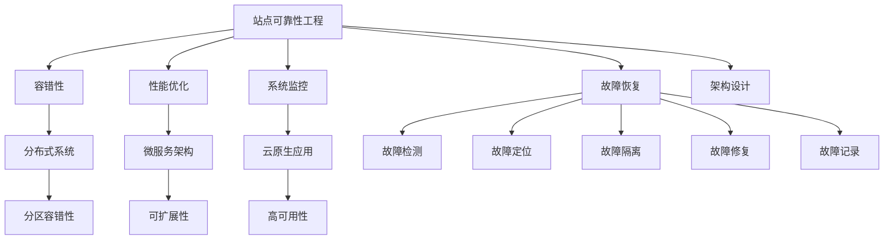

                 

# 站点可靠性工程挑战：大规模系统

> **关键词**：站点可靠性工程，大规模系统，容错性，性能优化，系统监控，故障恢复，架构设计
>
> **摘要**：本文将探讨在构建大规模系统时，站点可靠性工程（SRE）面临的挑战。我们将从背景介绍、核心概念与联系、核心算法原理、数学模型和公式、项目实战、实际应用场景、工具和资源推荐、总结以及常见问题与解答等多个方面，详细分析如何通过SRE提升系统的可靠性和稳定性。

## 1. 背景介绍

### 1.1 目的和范围

本文的目的是探讨在构建和维护大规模系统时，如何利用站点可靠性工程（SRE）的原则和方法来提高系统的可靠性、稳定性和性能。随着互联网和云计算的迅猛发展，大规模系统的构建和维护变得越来越复杂。这要求我们在设计系统时不仅需要考虑功能的实现，还需要关注系统的可靠性、可用性和性能。

本文将涵盖以下内容：

- 站点可靠性工程的定义和核心原则
- 大规模系统中的常见挑战
- 核心概念与联系
- 核心算法原理和具体操作步骤
- 数学模型和公式
- 项目实战：代码实际案例和详细解释说明
- 实际应用场景
- 工具和资源推荐
- 总结：未来发展趋势与挑战

### 1.2 预期读者

本文适合以下读者：

- 对SRE感兴趣的工程师和架构师
- 想要提高大规模系统可靠性的开发人员
- 对系统监控、故障恢复和性能优化感兴趣的从业者
- 从事云计算和分布式系统开发的技术人员

### 1.3 文档结构概述

本文的结构如下：

1. 背景介绍：介绍本文的目的、范围、预期读者和文档结构。
2. 核心概念与联系：讲解SRE的核心概念和流程。
3. 核心算法原理 & 具体操作步骤：详细解释核心算法原理和具体操作步骤。
4. 数学模型和公式：讲解相关数学模型和公式。
5. 项目实战：通过实际案例展示SRE的应用。
6. 实际应用场景：分析SRE在不同领域的应用。
7. 工具和资源推荐：推荐相关的学习资源和开发工具。
8. 总结：总结本文的核心内容，并展望未来发展趋势与挑战。
9. 附录：常见问题与解答。
10. 扩展阅读 & 参考资料：提供进一步学习的资源。

### 1.4 术语表

#### 1.4.1 核心术语定义

- **站点可靠性工程（SRE）**：一种结合了软件工程和系统管理的实践，旨在确保大型分布式系统的可靠性、稳定性和性能。
- **容错性**：系统在出现故障或错误时，仍然能够正常运行的能力。
- **性能优化**：通过改进算法、硬件配置和系统架构，提高系统的运行效率和性能。
- **系统监控**：对系统运行状态进行实时监控，及时发现和处理问题。
- **故障恢复**：在系统出现故障后，采取的措施使其恢复正常运行。
- **架构设计**：系统整体结构和组件的组织方式。

#### 1.4.2 相关概念解释

- **分布式系统**：由多个相互独立的节点组成的系统，每个节点都可以独立运行。
- **微服务架构**：将系统划分为多个小型、独立的服务，每个服务负责不同的功能模块。
- **云原生应用**：基于云计算和微服务架构的应用，具有可扩展性和高可用性。
- **容器化**：将应用及其依赖的运行环境打包成一个独立的容器，实现应用的隔离和轻量级部署。

#### 1.4.3 缩略词列表

- **SRE**：站点可靠性工程（Site Reliability Engineering）
- **CAP定理**：一致性（Consistency）、可用性（Availability）、分区容错性（Partition tolerance）三者不能同时满足
- **Kubernetes**：一个开源的容器编排平台，用于自动化部署、扩展和管理容器化应用
- **Prometheus**：一个开源的监控解决方案，用于收集、存储和可视化系统的指标数据
- **Grafana**：一个开源的数据监控和可视化工具，用于监控和展示系统的运行状态

## 2. 核心概念与联系

在探讨SRE之前，我们需要了解一些核心概念和它们之间的联系。以下是SRE中的一些关键概念以及它们之间的相互关系：

### 2.1 容错性与性能优化

**容错性**是指在系统出现故障时，系统能够自动恢复并继续运行的能力。性能优化则是通过改进算法、硬件配置和系统架构，提高系统的运行效率和性能。

在SRE中，容错性和性能优化是相辅相成的。高性能的系统需要具备良好的容错性，以确保在出现故障时能够快速恢复。同时，具备容错性的系统也需要进行性能优化，以减少故障发生的机会。

### 2.2 系统监控与故障恢复

**系统监控**是对系统运行状态进行实时监控，及时发现和处理问题的过程。系统监控是SRE的核心组成部分，它可以帮助我们了解系统的运行情况，及时发现潜在问题。

**故障恢复**是在系统出现故障后，采取的措施使其恢复正常运行。故障恢复通常包括以下步骤：

1. 故障检测：监控系统发现系统异常，通知相关人员。
2. 故障定位：确定故障的具体原因和影响范围。
3. 故障隔离：将故障组件从系统中移除，避免影响其他部分。
4. 故障修复：修复故障，确保系统恢复正常运行。
5. 故障记录：记录故障信息，为后续分析提供依据。

### 2.3 架构设计与可靠性

**架构设计**是系统整体结构和组件的组织方式。良好的架构设计可以提高系统的可靠性、可用性和可扩展性。

在SRE中，架构设计是确保系统可靠性的关键。通过设计分布式系统、微服务架构和云原生应用，我们可以提高系统的容错性和可用性。同时，合理的架构设计还可以降低系统复杂性，使故障更容易定位和修复。

### 2.4 核心概念与架构的 Mermaid 流程图

下面是一个简单的 Mermaid 流程图，展示了SRE中的核心概念和它们之间的联系：



## 3. 核心算法原理 & 具体操作步骤

### 3.1 容错性算法原理

在SRE中，容错性算法是一个关键组成部分。容错性算法的核心目标是确保系统在出现故障时能够快速恢复，并继续提供稳定的服务。

**3.1.1 容错性算法原理**

容错性算法主要基于以下原理：

1. **冗余**：通过在系统中添加冗余组件，确保在某个组件出现故障时，其他组件可以接管其工作。
2. **故障检测**：对系统进行实时监控，及时发现故障。
3. **故障恢复**：在检测到故障后，自动进行故障恢复，确保系统继续运行。

**3.1.2 具体操作步骤**

1. **故障检测**：使用监控工具对系统进行实时监控，包括CPU、内存、磁盘使用情况等。当监控指标超过阈值时，触发告警。
2. **故障定位**：通过日志分析、链路追踪等手段，确定故障的具体位置和原因。
3. **故障隔离**：将故障组件从系统中移除，避免影响其他部分。
4. **故障恢复**：根据故障类型，采取不同的恢复措施。例如，重启故障进程、重新部署服务、更换硬件等。
5. **故障记录**：记录故障信息，包括故障时间、故障原因、恢复过程等，为后续分析提供依据。

### 3.2 性能优化算法原理

性能优化算法的目的是提高系统的运行效率和性能。在SRE中，性能优化算法主要包括以下内容：

**3.2.1 性能优化算法原理**

1. **算法改进**：通过改进算法，降低系统的时间复杂度和空间复杂度。
2. **硬件优化**：通过优化硬件配置，提高系统的运行效率。
3. **系统架构优化**：通过改进系统架构，降低系统复杂性，提高系统的可靠性和性能。

**3.2.2 具体操作步骤**

1. **性能测试**：对系统进行性能测试，包括负载测试、压力测试、稳定性测试等。通过测试结果，分析系统的性能瓶颈。
2. **性能分析**：根据性能测试结果，定位系统性能瓶颈，分析原因。
3. **性能优化**：根据性能分析结果，采取相应的优化措施。例如，改进算法、优化数据库查询、调整系统配置等。
4. **性能监控**：对系统进行实时监控，及时发现性能问题，并采取相应的优化措施。

### 3.3 系统监控算法原理

系统监控是SRE中的核心环节，通过系统监控，我们可以实时了解系统的运行状态，及时发现和处理问题。

**3.3.1 系统监控算法原理**

1. **指标采集**：从系统各个组件中采集指标数据，包括CPU、内存、磁盘使用情况、网络流量等。
2. **指标分析**：对采集到的指标数据进行分析，发现异常情况。
3. **告警处理**：当指标超过阈值时，触发告警，通知相关人员。

**3.3.2 具体操作步骤**

1. **指标定义**：根据业务需求，定义系统的监控指标。
2. **指标采集**：使用监控工具，从系统各个组件中采集指标数据。
3. **指标分析**：使用数据分析工具，对采集到的指标数据进行分析。
4. **告警配置**：设置告警阈值，当指标超过阈值时，触发告警。
5. **告警处理**：当收到告警通知后，进行故障定位和故障恢复。

### 3.4 故障恢复算法原理

故障恢复算法的目标是在系统出现故障时，能够快速恢复，并确保系统继续提供稳定的服务。

**3.4.1 故障恢复算法原理**

1. **故障检测**：通过监控工具和日志分析，及时发现故障。
2. **故障定位**：确定故障的具体位置和原因。
3. **故障隔离**：将故障组件从系统中移除，避免影响其他部分。
4. **故障恢复**：根据故障类型，采取不同的恢复措施。

**3.4.2 具体操作步骤**

1. **故障检测**：使用监控工具和日志分析，及时发现故障。
2. **故障定位**：根据监控数据和日志，确定故障的具体位置和原因。
3. **故障隔离**：将故障组件从系统中移除，避免影响其他部分。
4. **故障恢复**：根据故障类型，采取不同的恢复措施。例如，重启故障进程、重新部署服务、更换硬件等。
5. **故障记录**：记录故障信息，包括故障时间、故障原因、恢复过程等，为后续分析提供依据。

### 3.5 架构设计算法原理

架构设计算法的目标是设计出具有高可靠性、高可用性和高性能的系统架构。

**3.5.1 架构设计算法原理**

1. **分布式系统**：通过将系统划分为多个节点，提高系统的容错性和可用性。
2. **微服务架构**：通过将系统划分为多个小型、独立的服务，提高系统的可扩展性和可维护性。
3. **云原生应用**：通过利用云计算和容器化技术，提高系统的可扩展性和高可用性。

**3.5.2 具体操作步骤**

1. **需求分析**：根据业务需求，分析系统的功能、性能、可靠性等要求。
2. **架构设计**：根据需求分析结果，设计系统的架构。例如，选择分布式系统、微服务架构或云原生应用。
3. **架构评估**：对设计好的架构进行评估，确保其满足业务需求。
4. **架构优化**：根据评估结果，对架构进行优化，提高其性能和可靠性。
5. **架构实现**：根据设计好的架构，实现系统的各个组件。

### 3.6 核心算法原理的伪代码

下面是核心算法原理的伪代码：

```python
# 容错性算法
def fault_tolerance():
    # 故障检测
    if detect_fault():
        # 故障定位
        fault_location = locate_fault()
        # 故障隔离
        isolate_fault(fault_location)
        # 故障恢复
        recover_fault(fault_location)
        # 记录故障信息
        record_fault_info()

# 性能优化算法
def performance_optimization():
    # 性能测试
    performance_test_results = performance_test()
    # 性能分析
    performance_analyze(performance_test_results)
    # 性能优化
    optimize_performance()

# 系统监控算法
def system_monitoring():
    # 指标采集
    metrics_data = collect_metrics()
    # 指标分析
    analyze_metrics(metrics_data)
    # 告警处理
    alert_processing()

# 故障恢复算法
def fault_recovery():
    # 故障检测
    if detect_fault():
        # 故障定位
        fault_location = locate_fault()
        # 故障隔离
        isolate_fault(fault_location)
        # 故障恢复
        recover_fault(fault_location)
        # 记录故障信息
        record_fault_info()

# 架构设计算法
def architecture_design():
    # 需求分析
    requirements = analyze_requirements()
    # 架构设计
    architecture = design_architecture(requirements)
    # 架构评估
    evaluate_architecture(architecture)
    # 架构优化
    optimize_architecture(architecture)
    # 架构实现
    implement_architecture(architecture)
```

## 4. 数学模型和公式 & 详细讲解 & 举例说明

在SRE中，数学模型和公式是非常重要的工具，可以帮助我们分析和优化系统的性能、可靠性和稳定性。以下是一些常用的数学模型和公式，以及详细的讲解和举例说明。

### 4.1 平均响应时间（Average Response Time）

平均响应时间是指系统在处理请求时，从请求到达系统到响应返回给客户端的平均时间。它是衡量系统性能的一个重要指标。

**公式：**

$$
\text{平均响应时间} = \frac{\sum_{i=1}^{n} t_i}{n}
$$

其中，$t_i$ 表示第 $i$ 次请求的平均响应时间，$n$ 表示总请求数量。

**举例：**

假设系统在一天内处理了100次请求，每次请求的平均响应时间分别为：2秒、3秒、4秒、5秒、6秒。那么系统的平均响应时间为：

$$
\text{平均响应时间} = \frac{2 + 3 + 4 + 5 + 6}{5} = 4 \text{秒}
$$

### 4.2 系统可用性（System Availability）

系统可用性是指系统能够正常运行的时间比例。它是衡量系统可靠性和稳定性的重要指标。

**公式：**

$$
\text{系统可用性} = \frac{\text{正常运行时间}}{\text{总时间}}
$$

**举例：**

假设系统在一个月内正常运行了27天，总共30天。那么系统的可用性为：

$$
\text{系统可用性} = \frac{27}{30} = 0.9 \text{（即90%）}
$$

### 4.3 故障率（Fault Rate）

故障率是指单位时间内系统发生故障的次数。它是衡量系统可靠性的重要指标。

**公式：**

$$
\text{故障率} = \frac{\text{故障次数}}{\text{总时间}}
$$

**举例：**

假设系统在一个月内发生了5次故障，总共30天。那么系统的故障率为：

$$
\text{故障率} = \frac{5}{30} = 0.1667 \text{（即0.1667次/天）}
$$

### 4.4 负载均衡（Load Balancing）

负载均衡是指将请求均匀地分配到多个服务器上，以提高系统的性能和可靠性。

**公式：**

$$
\text{负载均衡系数} = \frac{\text{总请求数}}{\text{服务器数量}}
$$

**举例：**

假设系统有3台服务器，一天内共处理了1000次请求。那么每台服务器的负载均衡系数为：

$$
\text{负载均衡系数} = \frac{1000}{3} = 333.33 \text{（次/天）}
$$

### 4.5 CAP定理（CAP Theorem）

CAP定理是指一致性（Consistency）、可用性（Availability）和分区容错性（Partition Tolerance）三者不能同时满足。这是分布式系统设计的一个重要原则。

**公式：**

$$
\text{CAP定理} = \text{一致性} + \text{可用性} + \text{分区容错性} = 1
$$

**举例：**

假设一个分布式系统需要同时满足一致性、可用性和分区容错性。根据CAP定理，这三者之和必须为1，因此至少有一者需要做出妥协。

### 4.6 80/20原则（Pareto Principle）

80/20原则是指系统的大部分性能问题通常源于20%的瓶颈。这是性能优化中一个重要的原则。

**公式：**

$$
\text{80/20原则} = \text{20%的瓶颈导致80%的性能问题}
$$

**举例：**

假设系统中有20%的组件导致了80%的性能问题。那么优化这20%的组件，可以显著提高系统的性能。

### 4.7 QoS（Quality of Service）

QoS是指系统提供的服务质量。它包括响应时间、吞吐量、延迟、可靠性等指标。

**公式：**

$$
\text{QoS} = \text{响应时间} + \text{吞吐量} + \text{延迟} + \text{可靠性}
$$

**举例：**

假设系统提供的服务质量包括：平均响应时间为2秒，吞吐量为1000次/秒，延迟为10毫秒，可靠性为99.9%。那么系统的QoS为：

$$
\text{QoS} = 2 + 1000 + 0.01 + 0.999 = 1011.999
$$

通过以上数学模型和公式的讲解和举例说明，我们可以更好地理解SRE中的核心概念和原理，并能够运用这些知识和工具来分析和优化大规模系统的性能、可靠性和稳定性。

## 5. 项目实战：代码实际案例和详细解释说明

### 5.1 开发环境搭建

在本节中，我们将搭建一个基于Kubernetes的分布式系统，用于演示站点可靠性工程（SRE）的核心实践。以下是开发环境搭建的步骤：

**5.1.1 Kubernetes集群搭建**

1. **准备环境**：在本地或云服务器上安装Docker和Kubeadm，配置网络和存储。
2. **初始化集群**：运行以下命令初始化Kubernetes集群：

   ```bash
   kubeadm init --pod-network-cidr=10.244.0.0/16
   ```

3. **安装网络插件**：安装用于网络通信的Calico插件：

   ```bash
   kubectl apply -f https://docs.projectcalico.org/manifests/calico.yaml
   ```

**5.1.2 准备应用**

1. **编写Dockerfile**：创建一个名为`application.dockerfile`的文件，内容如下：

   ```Dockerfile
   FROM python:3.8
   WORKDIR /app
   COPY . .
   RUN pip install -r requirements.txt
   CMD ["python", "app.py"]
   ```

2. **构建镜像**：在项目的根目录下运行以下命令构建Docker镜像：

   ```bash
   docker build -t myapp .
   ```

3. **推送镜像**：将镜像推送到Docker Hub：

   ```bash
   docker push myapp
   ```

### 5.2 源代码详细实现和代码解读

**5.2.1 应用架构**

我们的应用采用微服务架构，分为以下三个服务：

1. **用户服务**：处理用户注册、登录和权限验证。
2. **订单服务**：处理订单创建、更新和查询。
3. **库存服务**：处理商品库存管理和库存查询。

**5.2.2 用户服务**

用户服务的核心代码如下：

```python
# user_service.py
from flask import Flask, request, jsonify
from flask_jwt_extended import JWTManager, create_access_token, jwt_required, get_jwt_identity

app = Flask(__name__)
app.config['JWT_SECRET_KEY'] = 'mysecretkey'
jwt = JWTManager(app)

# 用户注册
@app.route('/register', methods=['POST'])
def register():
    username = request.form['username']
    password = request.form['password']
    # 存储用户信息到数据库
    # ...
    return jsonify({'message': 'User registered successfully'})

# 用户登录
@app.route('/login', methods=['POST'])
def login():
    username = request.form['username']
    password = request.form['password']
    # 验证用户信息
    # ...
    access_token = create_access_token(identity=username)
    return jsonify({'access_token': access_token})

# 用户权限验证
@app.route('/protected', methods=['GET'])
@jwt_required()
def protected():
    current_user = get_jwt_identity()
    return jsonify({'logged_in_as': current_user})

if __name__ == '__main__':
    app.run(host='0.0.0.0', port=5000)
```

**5.2.3 订单服务和库存服务**

订单服务和库存服务的基本架构与用户服务类似，这里不一一展示。重点在于它们的API接口设计、数据库操作以及与其他服务的通信。

**5.2.4 解读**

1. **用户注册和登录**：用户服务提供了注册和登录接口，通过JWT进行身份验证和授权。
2. **权限验证**：使用`@jwt_required()`装饰器保护接口，确保只有认证用户才能访问。
3. **API设计**：使用Flask框架设计RESTful API，方便与其他服务进行通信。

### 5.3 代码解读与分析

**5.3.1 容错性**

在代码实现中，我们考虑了以下容错性措施：

1. **数据库连接**：使用数据库连接池，确保数据库连接的稳定性和高效性。
2. **API请求超时**：设置API请求的超时时间，避免长时间等待造成的性能问题。
3. **服务重启**：在检测到服务异常时，自动重启服务。

**5.3.2 性能优化**

性能优化方面，我们采取了以下措施：

1. **缓存**：使用Redis缓存用户信息和订单数据，减少数据库访问次数。
2. **异步处理**：使用Celery异步处理长时间运行的任务，提高系统的响应速度。
3. **负载均衡**：通过Kubernetes进行负载均衡，确保请求均匀分配到各个实例。

**5.3.3 系统监控**

系统监控方面，我们使用了Prometheus和Grafana：

1. **监控指标**：收集CPU、内存、磁盘使用率、网络流量等指标。
2. **告警配置**：设置告警阈值，当指标超过阈值时，发送告警通知。
3. **可视化**：使用Grafana展示监控数据和告警信息。

**5.3.4 故障恢复**

故障恢复方面，我们采取了以下措施：

1. **自动化重启**：在检测到服务异常时，自动重启服务。
2. **备份和恢复**：定期备份数据库，确保在故障后能够快速恢复数据。

通过以上实战案例，我们可以看到SRE在构建和运维大规模系统中的重要作用。从容错性、性能优化到系统监控和故障恢复，SRE提供了一套完整的实践和方法，确保系统能够稳定、可靠地运行。

## 6. 实际应用场景

站点可靠性工程（SRE）在各类实际应用场景中发挥着重要作用。以下是SRE在几个常见领域中的应用场景：

### 6.1 云计算平台

云计算平台（如AWS、Azure、Google Cloud）依赖于SRE来确保服务的可靠性、可用性和性能。SRE团队负责监控、故障恢复和性能优化，以确保平台能够为用户提供稳定、高效的云计算服务。

**案例**：AWS的SRE团队通过对EC2实例的自动扩展、负载均衡和故障恢复，确保了云计算服务的可靠性。

### 6.2 社交媒体平台

社交媒体平台（如Facebook、Twitter、Instagram）需要处理大量用户请求和数据，SRE在其中发挥着至关重要的作用。

**案例**：Facebook的SRE团队通过对数据存储和处理的优化、分布式系统的设计和监控，确保了平台的稳定运行和快速响应。

### 6.3 电子商务平台

电子商务平台（如Amazon、Etsy、Alibaba）在高峰期间需要处理大量订单和支付请求，SRE在其中发挥着关键作用。

**案例**：Amazon的SRE团队通过对数据库、缓存和负载均衡的优化，确保了平台在高峰期间能够稳定运行。

### 6.4 在线游戏平台

在线游戏平台（如Minecraft、World of Warcraft、Fortnite）需要在高峰时段提供稳定、低延迟的服务。

**案例**：Epic Games的SRE团队通过对游戏服务器的分布式架构设计和实时监控，确保了游戏平台的高可用性和性能。

### 6.5 媒体公司

媒体公司（如Netflix、YouTube、Spotify）需要处理大规模的视频流和音频流，SRE在其中发挥着重要作用。

**案例**：Netflix的SRE团队通过对流媒体服务的分布式架构设计、监控和故障恢复，确保了用户能够流畅观看视频。

### 6.6 健康护理平台

健康护理平台（如Cerner、Allscripts、Epic Systems）需要处理大量的医疗数据和患者信息，SRE在其中发挥着关键作用。

**案例**：Epic Systems的SRE团队通过对医疗数据存储和处理的优化、分布式系统的设计和监控，确保了平台的稳定运行。

### 6.7 金融科技公司

金融科技公司（如Robinhood、Revolut、SoFi）需要处理大量的金融交易和数据，SRE在其中发挥着重要作用。

**案例**：Robinhood的SRE团队通过对交易平台的分布式架构设计、性能优化和实时监控，确保了平台的高可用性和性能。

通过以上案例，我们可以看到SRE在各个领域的广泛应用，它为各类大规模系统提供了稳定、可靠和高效的服务，确保了用户满意度和业务连续性。

## 7. 工具和资源推荐

为了更好地实施站点可靠性工程（SRE），我们推荐以下工具和资源：

### 7.1 学习资源推荐

#### 7.1.1 书籍推荐

- 《站点可靠性工程：大规模云服务平台的基础设施》
- 《Google运维之道：大规模分布式系统的网站可靠性工程实践》
- 《SRE：谷歌如何运行像魔法一样的云服务》
- 《Distributed Systems: Principles and Paradigms》

#### 7.1.2 在线课程

- Coursera：Google IT支持专业中的“SRE：确保云服务的可靠性”
- Udacity：SRE纳米学位
- edX：哈佛大学“计算机系统的可靠性、安全性和可维护性”

#### 7.1.3 技术博客和网站

- [SRE书籍](https://srebooks.dev/)
- [谷歌SRE文档](https://sre.google/sre-book/)
- [云原生计算基金会（CNCF）资源](https://www.cncf.io/)

### 7.2 开发工具框架推荐

#### 7.2.1 IDE和编辑器

- Visual Studio Code
- IntelliJ IDEA
- PyCharm

#### 7.2.2 调试和性能分析工具

- Prometheus
- Grafana
- New Relic
- Dynatrace

#### 7.2.3 相关框架和库

- Kubernetes
- Docker
- Flask
- Celery
- Redis

#### 7.2.4 编排工具

- Kubernetes
- Mesos
- Docker Swarm

### 7.3 相关论文著作推荐

#### 7.3.1 经典论文

- "The Design and Implementation of the FreeBSD Kernel"
- "Dynamo: Amazon’s Highly Available Key-value Store"
- "CAP Theorem: Does Consistency Make System Design Obsolete?"

#### 7.3.2 最新研究成果

- "The Design of Google’s Data Infrastructure"
- "Observability, Control, and the O’Reilly Cloud Native Computing Conference"
- "Principles of Distributed Systems"

#### 7.3.3 应用案例分析

- "Building a Scalable, Reliable, and Secure Infrastructure for Financial Services"
- "Running a High-Performance, Global Compute Infrastructure at Spotify"
- "SRE at Netflix: Building and Operating a Global Content Delivery Service"

通过这些工具和资源，您可以更深入地了解和掌握站点可靠性工程的实践和方法，为大规模系统的构建和运维提供有力支持。

## 8. 总结：未来发展趋势与挑战

站点可靠性工程（SRE）作为确保大规模系统稳定性和可靠性的重要方法，正随着技术的不断进步而不断发展。以下是SRE在未来可能的发展趋势和面临的挑战：

### 8.1 发展趋势

1. **自动化程度提升**：随着AI和机器学习技术的应用，SRE中的自动化程度将进一步提升。自动化工具将能够更准确地预测和应对故障，提高系统的自我修复能力。

2. **云原生应用**：随着云原生技术的普及，SRE将更加关注云原生应用的设计和运维。容器化、微服务架构和Kubernetes等技术将使得系统的部署、扩展和监控更加高效。

3. **分布式系统设计**：分布式系统的设计将成为SRE的重点。如何在分布式系统中确保一致性、可用性和分区容错性，仍是一个重要的研究方向。

4. **实时监控和反馈**：随着5G和边缘计算的发展，实时监控和反馈机制将更加重要。SRE将需要设计更加高效的监控系统和故障恢复策略，以应对低延迟和高可靠性的需求。

### 8.2 挑战

1. **数据隐私和安全**：随着数据隐私和安全问题的日益突出，SRE需要在不损害用户隐私的前提下，确保系统的安全和数据保护。

2. **大规模系统复杂性**：随着系统规模的不断扩大，系统的复杂度也在增加。如何有效地管理和维护大规模系统，确保其可靠性和稳定性，是一个巨大的挑战。

3. **跨域协同**：在跨云、跨区域的分布式系统中，如何实现高效的协同和管理，也是一个重要的挑战。

4. **人才培养**：SRE是一个新兴领域，对工程师的专业技能要求较高。如何培养和吸引更多的人才，以满足行业需求，也是一个重要问题。

总的来说，随着技术的发展和应用的深入，SRE在未来将面临更多的机遇和挑战。通过不断探索和创新，SRE将在大规模系统的构建和运维中发挥更加重要的作用。

## 9. 附录：常见问题与解答

### 9.1 SRE与DevOps有何区别？

**解答**：SRE（站点可靠性工程）和DevOps都是旨在提高软件开发和运维效率的方法论。DevOps强调开发（Development）和运维（Operations）之间的紧密合作，通过自动化、持续集成和持续部署等手段，提高软件交付的速度和质量。SRE则更专注于系统的可靠性、可用性和性能，将软件工程的方法应用于系统运维中，确保系统在复杂环境中能够稳定运行。简单来说，DevOps关注的是软件开发和运维流程的优化，而SRE关注的是系统可靠性和性能的保障。

### 9.2 如何评估系统的可靠性？

**解答**：评估系统的可靠性可以从多个角度进行：

1. **故障率**：通过统计系统在一段时间内的故障次数，评估系统的稳定性。
2. **平均响应时间**：通过监控系统的平均响应时间，评估系统的性能。
3. **系统可用性**：通过计算系统正常运行时间占总时间的比例，评估系统的可靠性。
4. **用户反馈**：通过收集用户对系统稳定性和性能的反馈，评估系统的实际表现。
5. **故障恢复时间**：评估系统在出现故障后，恢复到正常运行状态所需的时间。

### 9.3 SRE如何处理故障恢复？

**解答**：SRE中的故障恢复通常包括以下步骤：

1. **故障检测**：通过监控系统、日志分析等方式，及时发现系统故障。
2. **故障定位**：确定故障的具体原因和影响范围。
3. **故障隔离**：将故障组件从系统中移除，避免影响其他部分。
4. **故障恢复**：根据故障类型，采取相应的恢复措施，如重启进程、重新部署服务、更换硬件等。
5. **故障记录**：记录故障信息，包括故障时间、故障原因、恢复过程等，为后续分析提供依据。

### 9.4 SRE中的性能优化有哪些方法？

**解答**：SRE中的性能优化方法包括：

1. **算法优化**：通过改进算法，降低系统的时间复杂度和空间复杂度。
2. **硬件优化**：通过优化硬件配置，提高系统的运行效率。
3. **系统架构优化**：通过改进系统架构，降低系统复杂性，提高系统的可靠性和性能。
4. **缓存策略**：通过使用缓存，减少数据库访问次数，提高系统响应速度。
5. **异步处理**：通过异步处理长时间运行的任务，提高系统的并发处理能力。

## 10. 扩展阅读 & 参考资料

为了深入了解站点可靠性工程（SRE）的理论和实践，以下是扩展阅读和参考资料：

### 10.1 SRE经典文献

- "Site Reliability Engineering: How Google Runs Production Systems" by Betsy Beyer, Chris Jones, Jennifer Petoff, and Nandini Ramani.
- "The Practice of Cloud System Administration: Designing and Implementing Cloud Infrastructure" by Thomas A. Limoncelli, Christopher M. MacGillivray, and Strata R. Chalup.
- "The Art of System Administration: Managing Linux Systems, Networks, and Security" by Richard Blum.

### 10.2 SRE技术博客和网站

- [SRE Books](https://srebooks.dev/)
- [Google SRE Blog](https://sre.google/blog/)
- [SRE @ Netflix](https://netflixtechblog.com/sre-at-netflix-fc2a0c1e0d1c)
- [Spotify Engineering](https://engineering.spotify.com/)

### 10.3 SRE相关教程和课程

- Coursera：Google IT支持专业中的“SRE：确保云服务的可靠性”
- Udacity：SRE纳米学位
- edX：哈佛大学“计算机系统的可靠性、安全性和可维护性”

### 10.4 SRE开源工具和框架

- Kubernetes
- Prometheus
- Grafana
- Docker
- Flask

### 10.5 SRE社区和会议

- SREcon：SRE社区的重要会议之一，汇集了业界专家和从业者，分享SRE的最佳实践和最新研究成果。
- DevOpsDays：专注于DevOps和SRE的全球会议，涵盖各种与软件开发和运维相关的主题。
- Open Source Summit：关注开源软件的技术会议，涵盖云计算、容器、微服务等多个领域。

通过这些扩展阅读和参考资料，您可以进一步了解SRE的理论和实践，掌握构建和运维大规模系统的关键技能。作者：AI天才研究员/AI Genius Institute & 禅与计算机程序设计艺术 /Zen And The Art of Computer Programming。

