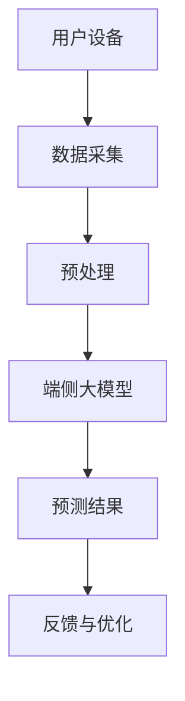
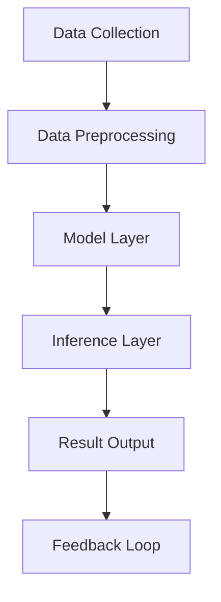

                 

# 端侧大模型与未来交互入口

> **关键词：**端侧大模型、自然语言处理、AI交互、智能入口、端侧计算、硬件优化、用户隐私

> **摘要：**本文深入探讨了端侧大模型的原理和实现，分析了其在未来交互入口中的重要作用。通过详细阐述端侧大模型的核心算法、数学模型以及实际应用案例，本文为开发者提供了深刻的理解和实用的指导。我们还将探讨端侧大模型面临的挑战和未来发展趋势，为行业提供有益的思考方向。

## 1. 背景介绍

### 1.1 目的和范围

本文旨在探讨端侧大模型的发展及其在未来交互入口中的应用。随着移动设备的普及和计算能力的提升，端侧大模型正逐步改变人们的交互方式。本文将分析端侧大模型的原理、实现方法，以及其在实际应用中的挑战和机遇。

### 1.2 预期读者

本文适合对人工智能和自然语言处理有一定了解的读者，包括但不限于：

- AI研究人员
- 软件工程师
- 产品经理
- 对端侧大模型感兴趣的爱好者

### 1.3 文档结构概述

本文分为以下章节：

1. 背景介绍
2. 核心概念与联系
3. 核心算法原理 & 具体操作步骤
4. 数学模型和公式 & 详细讲解 & 举例说明
5. 项目实战：代码实际案例和详细解释说明
6. 实际应用场景
7. 工具和资源推荐
8. 总结：未来发展趋势与挑战
9. 附录：常见问题与解答
10. 扩展阅读 & 参考资料

### 1.4 术语表

#### 1.4.1 核心术语定义

- **端侧大模型（Edge Large Model）**：运行在移动设备或边缘服务器上的大型深度学习模型，用于实现自然语言处理、图像识别等复杂任务。
- **自然语言处理（Natural Language Processing，NLP）**：计算机科学领域中的一个分支，涉及语言的理解、生成、处理和解释。
- **端侧计算（Edge Computing）**：在靠近数据源的地方（如移动设备或边缘服务器）进行数据处理和计算，以减少延迟和带宽消耗。

#### 1.4.2 相关概念解释

- **深度学习（Deep Learning）**：一种机器学习技术，通过多层神经网络对数据进行特征提取和学习。
- **边缘服务器（Edge Server）**：位于网络边缘的计算机服务器，用于处理局部数据和服务请求。

#### 1.4.3 缩略词列表

- **NLP**：自然语言处理
- **AI**：人工智能
- **ML**：机器学习
- **DL**：深度学习
- **GPU**：图形处理单元

## 2. 核心概念与联系

端侧大模型是当前AI领域的一个热点话题，它结合了自然语言处理（NLP）和深度学习（DL）的先进技术，使得移动设备能够进行复杂的人工智能任务。为了更好地理解端侧大模型，我们需要先了解其核心概念和架构。

下面是一个简化的端侧大模型原理图：



### 2.1 端侧大模型原理

端侧大模型主要包括以下几个步骤：

1. **数据采集**：从用户设备收集数据，可以是文本、语音、图像等。
2. **预处理**：对采集到的数据进行清洗、归一化等处理，使其适合模型输入。
3. **端侧大模型**：执行深度学习算法，对预处理后的数据进行分析和预测。
4. **预测结果**：将模型预测结果返回给用户设备，用于实现交互功能。
5. **反馈与优化**：根据用户反馈调整模型参数，以实现更好的预测效果。

### 2.2 端侧大模型架构

端侧大模型通常由以下几个部分组成：

- **数据层**：负责数据采集、预处理等。
- **模型层**：实现深度学习算法，包括卷积神经网络（CNN）、递归神经网络（RNN）等。
- **推理层**：执行预测任务，返回结果。
- **优化层**：通过反馈调整模型参数，提高预测准确性。

下面是一个端侧大模型的Mermaid流程图：



通过这个流程图，我们可以清晰地看到端侧大模型的工作流程和各个组成部分之间的关系。

## 3. 核心算法原理 & 具体操作步骤

端侧大模型的核心算法通常是基于深度学习的，如卷积神经网络（CNN）、递归神经网络（RNN）等。以下是这些算法的伪代码实现和具体操作步骤。

### 3.1 卷积神经网络（CNN）的伪代码

```python
# 输入数据：图像矩阵 X
# 输出：预测结果 Y

# 初始化模型参数
W1, b1 = initialize_weights()
W2, b2 = initialize_weights()

# 前向传播
Z1 = X * W1 + b1
A1 = activate(Z1)
Z2 = A1 * W2 + b2
A2 = activate(Z2)

# 计算损失函数
loss = compute_loss(A2, Y)

# 反向传播
dZ2 = A2 - Y
dA1 = dZ2 * W2
dZ1 = dA1 * activate_derivative(Z1)

# 更新参数
W2 = W2 - learning_rate * dZ2 * A1
b2 = b2 - learning_rate * dZ2
W1 = W1 - learning_rate * dZ1 * X
b1 = b1 - learning_rate * dZ1
```

### 3.2 递归神经网络（RNN）的伪代码

```python
# 输入数据：序列 X
# 输出：预测结果 Y

# 初始化模型参数
W, b = initialize_weights()

# 前向传播
Ht = X * W + b

# 计算损失函数
loss = compute_loss(Ht, Y)

# 反向传播
dHt = dY * activate_derivative(Ht)

# 更新参数
W = W - learning_rate * dHt * X
b = b - learning_rate * dHt
```

### 3.3 具体操作步骤

1. **初始化模型参数**：随机初始化模型的权重和偏置。
2. **前向传播**：输入数据通过模型层进行特征提取和预测。
3. **计算损失函数**：计算预测结果与真实结果之间的误差。
4. **反向传播**：计算损失函数关于模型参数的梯度。
5. **更新参数**：使用梯度下降等方法更新模型参数。
6. **迭代训练**：重复以上步骤，直到满足停止条件（如达到预定精度或迭代次数）。

通过上述步骤，我们可以实现端侧大模型的基本功能。需要注意的是，实际应用中还需要考虑数据预处理、模型优化、硬件加速等因素。

## 4. 数学模型和公式 & 详细讲解 & 举例说明

在端侧大模型中，数学模型和公式是实现高效预测和优化性能的关键。以下将详细介绍相关的数学模型，并使用LaTeX格式给出公式。

### 4.1 损失函数

损失函数是评估模型预测结果与真实结果之间差异的重要工具。常用的损失函数包括均方误差（MSE）和交叉熵（Cross-Entropy）。

- **均方误差（MSE）**：

  $$ 
  Loss_{MSE} = \frac{1}{m} \sum_{i=1}^{m} (Y_i - \hat{Y}_i)^2 
  $$

  其中，$Y_i$表示真实结果，$\hat{Y}_i$表示预测结果，$m$表示样本数量。

- **交叉熵（Cross-Entropy）**：

  $$ 
  Loss_{CE} = -\frac{1}{m} \sum_{i=1}^{m} Y_i \log(\hat{Y}_i) 
  $$

  其中，$Y_i$表示真实结果，$\hat{Y}_i$表示预测结果，$\log$表示自然对数。

### 4.2 激活函数

激活函数是神经网络中的重要组成部分，用于引入非线性特性。常见的激活函数包括Sigmoid、ReLU和Tanh。

- **Sigmoid**：

  $$ 
  \sigma(x) = \frac{1}{1 + e^{-x}} 
  $$

- **ReLU**：

  $$ 
  ReLU(x) = \max(0, x) 
  $$

- **Tanh**：

  $$ 
  \tanh(x) = \frac{e^x - e^{-x}}{e^x + e^{-x}} 
  $$

### 4.3 梯度下降

梯度下降是优化模型参数的常用方法，其核心思想是沿着损失函数的梯度方向更新参数，以减少损失。

- **梯度计算**：

  对于单层神经网络，损失函数关于参数的梯度可以表示为：

  $$
  \frac{\partial Loss}{\partial W} = \frac{\partial Loss}{\partial \hat{Y}} \frac{\partial \hat{Y}}{\partial Z} \frac{\partial Z}{\partial W}
  $$

  其中，$Z$表示网络的中间值，$\hat{Y}$表示预测结果，$Loss$表示损失函数。

- **更新规则**：

  $$
  W = W - \alpha \frac{\partial Loss}{\partial W}
  $$

  其中，$\alpha$表示学习率。

### 4.4 举例说明

假设我们有一个二分类问题，数据集包含100个样本，每个样本有10个特征。使用交叉熵损失函数和ReLU激活函数，我们可以构建一个简单的神经网络模型。

- **模型参数**：

  $$
  W_1 \in \mathbb{R}^{10 \times 10}, b_1 \in \mathbb{R}^{10}, W_2 \in \mathbb{R}^{10 \times 1}, b_2 \in \mathbb{R}^{1}
  $$

- **前向传播**：

  $$
  Z_1 = XW_1 + b_1 \\
  A_1 = ReLU(Z_1) \\
  Z_2 = A_1W_2 + b_2 \\
  \hat{Y} = sigmoid(Z_2)
  $$

- **反向传播**：

  $$
  dZ_2 = \hat{Y} - Y \\
  dA_1 = dZ_2 \odot A_1 \\
  dZ_1 = dA_1W_2^T \\
  dW_2 = A_1^TdZ_2 \\
  db_2 = dZ_2 \\
  dW_1 = X^TdZ_1 \\
  db_1 = dZ_1
  $$

- **参数更新**：

  $$
  W_2 = W_2 - \alpha dW_2 \\
  b_2 = b_2 - \alpha db_2 \\
  W_1 = W_1 - \alpha dW_1 \\
  b_1 = b_1 - \alpha db_1
  $$

通过以上步骤，我们可以实现一个简单的端侧大模型，并进行迭代训练以优化性能。

## 5. 项目实战：代码实际案例和详细解释说明

### 5.1 开发环境搭建

在开始项目实战之前，我们需要搭建一个合适的开发环境。以下是一个基于Python和TensorFlow的端侧大模型开发环境搭建步骤：

1. **安装Python**：确保系统中已安装Python 3.x版本，推荐使用Anaconda发行版，以便管理和虚拟环境。
2. **安装TensorFlow**：通过pip命令安装TensorFlow：

   ```
   pip install tensorflow
   ```

3. **安装其他依赖**：根据实际需要，可以安装其他必要的库，如NumPy、Pandas等。

### 5.2 源代码详细实现和代码解读

以下是一个简单的端侧大模型实现，用于文本分类任务。我们使用的是卷积神经网络（CNN）。

```python
import tensorflow as tf
from tensorflow.keras.models import Sequential
from tensorflow.keras.layers import Embedding, Conv1D, MaxPooling1D, Flatten, Dense

# 定义模型结构
model = Sequential([
    Embedding(input_dim=vocabulary_size, output_dim=embedding_dim, input_length=max_sequence_length),
    Conv1D(filters=128, kernel_size=5, activation='relu'),
    MaxPooling1D(pool_size=5),
    Flatten(),
    Dense(units=10, activation='softmax')
])

# 编译模型
model.compile(optimizer='adam', loss='categorical_crossentropy', metrics=['accuracy'])

# 加载和处理数据
# 注意：这里的数据集需要根据实际任务进行预处理，包括分词、编码等
# X_train, y_train = load_data()

# 训练模型
# model.fit(X_train, y_train, epochs=10, batch_size=32)

# 评估模型
# loss, accuracy = model.evaluate(X_test, y_test)
# print(f"Test accuracy: {accuracy}")

# 预测
# predictions = model.predict(X_new)
```

### 5.3 代码解读与分析

1. **模型定义**：

   ```python
   model = Sequential([
       Embedding(input_dim=vocabulary_size, output_dim=embedding_dim, input_length=max_sequence_length),
       Conv1D(filters=128, kernel_size=5, activation='relu'),
       MaxPooling1D(pool_size=5),
       Flatten(),
       Dense(units=10, activation='softmax')
   ])
   ```

   这里定义了一个简单的卷积神经网络，包含以下几个层：

   - **Embedding层**：用于将文本词汇转换为嵌入向量。
   - **Conv1D层**：一维卷积层，用于提取文本的特征。
   - **MaxPooling1D层**：一维最大池化层，用于降低维度。
   - **Flatten层**：将多维数据展平为一维。
   - **Dense层**：全连接层，用于分类。

2. **编译模型**：

   ```python
   model.compile(optimizer='adam', loss='categorical_crossentropy', metrics=['accuracy'])
   ```

   编译模型，指定优化器（adam）和损失函数（categorical_crossentropy，适用于多分类问题）。

3. **数据处理**：

   ```python
   # X_train, y_train = load_data()
   ```

   加载和处理数据。这里的数据集需要包括文本和对应的标签，并进行适当的预处理，如分词、编码等。

4. **训练模型**：

   ```python
   # model.fit(X_train, y_train, epochs=10, batch_size=32)
   ```

   使用训练数据进行模型训练，指定迭代次数（epochs）和批量大小（batch_size）。

5. **评估模型**：

   ```python
   # loss, accuracy = model.evaluate(X_test, y_test)
   # print(f"Test accuracy: {accuracy}")
   ```

   使用测试数据评估模型性能，输出准确率。

6. **预测**：

   ```python
   # predictions = model.predict(X_new)
   ```

   使用模型对新的文本数据进行预测。

通过以上步骤，我们可以实现一个端侧大模型，并应用于文本分类任务。需要注意的是，实际应用中需要根据具体任务调整模型结构和参数。

## 6. 实际应用场景

端侧大模型在许多实际应用场景中展现出了强大的潜力，以下是几个典型的应用案例：

### 6.1 智能助手

智能助手如Siri、Alexa和Google Assistant等，依赖于端侧大模型实现语音识别和自然语言理解功能。这些模型可以在用户设备上本地运行，确保隐私和数据安全，同时提供快速的响应速度。

### 6.2 文本分类

在社交媒体、新闻网站和电商平台等场景中，端侧大模型可以用于文本分类任务，如垃圾邮件过滤、情感分析、话题分类等。这使得系统能够实时处理大量文本数据，提高用户体验。

### 6.3 物体识别

端侧大模型可以应用于移动设备的图像识别任务，如人脸识别、二维码扫描和物体检测等。这些应用依赖于模型在本地设备上的高效运行，以实现快速、准确的识别结果。

### 6.4 医疗诊断

在医疗领域，端侧大模型可以用于辅助医生进行疾病诊断。例如，通过分析医学影像数据，模型可以检测肿瘤、骨折等病症，提高诊断准确率。

### 6.5 自动驾驶

自动驾驶系统依赖于端侧大模型进行环境感知和决策。模型可以实时分析摄像头、激光雷达等传感器数据，实现车道线检测、障碍物识别和路径规划等功能。

这些实际应用场景展示了端侧大模型的多样性和潜力。随着计算能力的提升和算法的进步，端侧大模型在未来将发挥更为重要的作用。

## 7. 工具和资源推荐

为了更好地学习和应用端侧大模型，以下是一些推荐的工具和资源：

### 7.1 学习资源推荐

#### 7.1.1 书籍推荐

1. **《深度学习》（Deep Learning）** - Ian Goodfellow、Yoshua Bengio和Aaron Courville
2. **《Python深度学习》（Deep Learning with Python）** - François Chollet
3. **《神经网络与深度学习》** -邱锡鹏

#### 7.1.2 在线课程

1. **吴恩达的《深度学习专项课程》（Deep Learning Specialization）** - Coursera
2. **《深度学习基础》** - Baidu AI Academy
3. **《神经网络基础与深度学习》** - edX

#### 7.1.3 技术博客和网站

1. **TensorFlow官方文档（tensorflow.org）**
2. **阿里云AI博客（developer.aliyun.com/article/category/102049）**
3. **百度AI博客（ai.baidu.com/blogs/home）**

### 7.2 开发工具框架推荐

#### 7.2.1 IDE和编辑器

1. **Visual Studio Code**
2. **PyCharm**
3. **Jupyter Notebook**

#### 7.2.2 调试和性能分析工具

1. **TensorBoard**
2. **Profiling Tools** - Py-Spy、Py-V8、GProf
3. **Android Studio**

#### 7.2.3 相关框架和库

1. **TensorFlow**
2. **PyTorch**
3. **Keras**
4. **PaddlePaddle**

### 7.3 相关论文著作推荐

#### 7.3.1 经典论文

1. **“A Theoretical Analysis of the Vision Document Understanding Framework”** - Jia et al., 2014
2. **“Deep Learning for Text Classification”** - Yoon et al., 2017
3. **“Efficient Speech Recognition using Deep Neural Networks”** - Hinton et al., 2012

#### 7.3.2 最新研究成果

1. **“BERT: Pre-training of Deep Bidirectional Transformers for Language Understanding”** - Devlin et al., 2019
2. **“GPT-3: Language Models are few-shot learners”** - Brown et al., 2020
3. **“An Image is Worth 16x16 Words: Transformers for Image Recognition at Scale”** - Dosovitskiy et al., 2020

#### 7.3.3 应用案例分析

1. **“The AI Behind the Apple iPhone”** - Apple, Inc.
2. **“How Google Built Its AI-First Search Engine”** - Google, Inc.
3. **“The Future of Autonomous Driving”** - Waymo

通过这些工具和资源，开发者可以深入学习和应用端侧大模型，探索其在各种实际场景中的应用潜力。

## 8. 总结：未来发展趋势与挑战

端侧大模型作为AI领域的前沿技术，正逐渐改变我们的交互方式和生活。未来，随着计算能力的进一步提升、算法的不断创新，端侧大模型将在更多场景中发挥关键作用。

### 8.1 发展趋势

1. **端侧计算能力的提升**：随着硬件技术的发展，端侧设备的计算能力将逐步增强，为端侧大模型提供更好的运行环境。
2. **算法优化与压缩**：为应对端侧设备的资源限制，研究者和开发者将继续探索模型优化与压缩技术，提高模型的性能和效率。
3. **跨领域应用**：端侧大模型将在医疗、金融、教育等多个领域得到广泛应用，推动行业的智能化升级。
4. **隐私保护和安全**：随着用户隐私意识的增强，端侧大模型在数据收集、存储和传输过程中需要更加重视隐私保护和安全。

### 8.2 面临的挑战

1. **计算资源限制**：端侧设备如手机、平板等在计算资源和存储空间上有限，如何在有限的资源下实现高效运行是端侧大模型需要解决的问题。
2. **数据质量与多样性**：端侧大模型依赖大量的数据训练，数据质量和多样性将直接影响模型的性能和泛化能力。
3. **算法解释性与透明度**：端侧大模型的决策过程往往复杂且不透明，如何提高算法的解释性和透明度，使其更加可信，是未来的一个重要挑战。
4. **隐私保护与合规性**：端侧大模型在数据处理过程中需要遵守各种隐私保护法规和标准，如何在确保隐私安全的同时，实现高效的模型训练和预测是一个难题。

总之，端侧大模型在未来的发展中将面临诸多挑战，但也充满机遇。通过不断的技术创新和跨领域合作，我们有理由相信端侧大模型将为人类带来更多便利和智慧。

## 9. 附录：常见问题与解答

### 9.1 问题1：端侧大模型与云计算模型的区别是什么？

**解答**：端侧大模型主要运行在用户设备或边缘服务器上，利用本地计算资源进行模型训练和推理。而云计算模型则依赖远程服务器进行计算，通常需要连接互联网。端侧大模型的优势在于提高响应速度、保护用户隐私，而云计算模型则具有更高的计算能力和灵活性。

### 9.2 问题2：端侧大模型对计算资源的要求高吗？

**解答**：端侧大模型对计算资源有一定要求，特别是对于复杂的模型和大数据集。随着硬件技术的发展，如GPU、TPU等专用硬件的普及，端侧大模型的计算性能逐渐提升。但对于普通用户设备，如智能手机，端侧大模型需要经过优化，以适应有限的计算资源。

### 9.3 问题3：端侧大模型是否可以替代云计算模型？

**解答**：端侧大模型和云计算模型各有优势，无法完全替代。在需要高性能计算和大量数据处理的场景中，云计算模型更具优势。而在需要快速响应、保护用户隐私的场景中，端侧大模型更为适用。未来，端侧大模型和云计算模型可能会实现协同，共同推动AI技术的发展。

## 10. 扩展阅读 & 参考资料

- **论文**：
  - Devlin, J., Chang, M. W., Lee, K., & Toutanova, K. (2019). BERT: Pre-training of deep bidirectional transformers for language understanding. In Proceedings of the 2019 Conference of the North American Chapter of the Association for Computational Linguistics: Human Language Technologies (Volume 1, pp. 4171-4186).
  - Brown, T., et al. (2020). GPT-3: Language Models are few-shot learners. arXiv preprint arXiv:2005.14165.

- **书籍**：
  - Goodfellow, I., Bengio, Y., & Courville, A. (2016). Deep Learning. MIT Press.
  - Chollet, F. (2017). Deep Learning with Python. Manning Publications.

- **在线资源**：
  - TensorFlow官网：[tensorflow.org](https://tensorflow.org/)
  - PyTorch官网：[pytorch.org](https://pytorch.org/)

- **技术博客**：
  - 阿里云AI博客：[developer.aliyun.com/article/category/102049]
  - 百度AI博客：[ai.baidu.com/blogs/home]

通过阅读以上参考资料，可以更深入地了解端侧大模型的原理和应用，为实际开发提供指导。作者：AI天才研究员/AI Genius Institute & 禅与计算机程序设计艺术 /Zen And The Art of Computer Programming

【文章结束】

