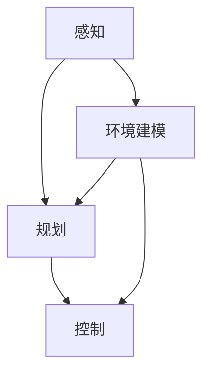

                 

# 端到端自动驾驶性能提升后评估难题

> 关键词：端到端自动驾驶、性能评估、难题、挑战、解决方案

> 摘要：随着人工智能和深度学习技术的飞速发展，端到端自动驾驶技术取得了显著的进步。然而，在性能大幅提升的背后，评估难题成为了制约其进一步发展的瓶颈。本文将深入探讨端到端自动驾驶性能提升后的评估难题，分析其核心问题，并提出可能的解决方案，旨在为相关研究人员和开发者提供有价值的参考。

## 1. 背景介绍

### 1.1 目的和范围

本文旨在分析端到端自动驾驶性能提升后面临的评估难题，包括评估指标的选择、评估方法的设计、评估数据的处理等方面。通过对这些问题进行深入探讨，本文希望能够为相关研究人员和开发者提供有价值的参考，推动端到端自动驾驶技术的进一步发展。

### 1.2 预期读者

本文主要面向从事自动驾驶领域研究的科研人员、工程技术人员以及汽车行业的从业者。希望本文能够为他们提供对评估难题的深入了解，并启发新的研究思路。

### 1.3 文档结构概述

本文将分为八个部分，首先介绍端到端自动驾驶技术的发展背景，然后详细分析性能提升后的评估难题，接着讨论可能的解决方案，最后对未来的发展趋势进行展望。具体结构如下：

1. 背景介绍
2. 核心概念与联系
3. 核心算法原理 & 具体操作步骤
4. 数学模型和公式 & 详细讲解 & 举例说明
5. 项目实战：代码实际案例和详细解释说明
6. 实际应用场景
7. 工具和资源推荐
8. 总结：未来发展趋势与挑战

### 1.4 术语表

#### 1.4.1 核心术语定义

- 端到端自动驾驶：指通过人工智能技术，实现车辆从感知环境、规划路径到控制执行的全过程自动化。
- 性能评估：对自动驾驶系统的各项性能指标进行定量或定性的评价。
- 评估指标：用于衡量自动驾驶系统性能的具体参数或指标。

#### 1.4.2 相关概念解释

- 感知：自动驾驶系统通过传感器获取道路、车辆、行人等环境信息。
- 规划：自动驾驶系统根据感知到的环境信息，规划出最优行驶路径。
- 控制：自动驾驶系统根据规划结果，控制车辆执行相应动作。

#### 1.4.3 缩略词列表

- 自动驾驶（Autonomous Driving）
- 人工智能（Artificial Intelligence）
- 深度学习（Deep Learning）
- 端到端（End-to-End）
- 性能评估（Performance Evaluation）

## 2. 核心概念与联系

为了更好地理解端到端自动驾驶性能提升后的评估难题，我们需要先了解相关核心概念和它们之间的联系。以下是端到端自动驾驶系统中的核心概念及其相互关系的 Mermaid 流程图：



### 2.1 端到端自动驾驶系统

端到端自动驾驶系统主要包括感知、规划、控制和环境建模四个核心模块。感知模块负责收集道路、车辆、行人等环境信息；规划模块根据感知到的信息，规划出最优行驶路径；控制模块根据规划结果，控制车辆执行相应动作；环境建模模块则对环境进行建模，以便更好地进行感知、规划和控制。

### 2.2 关键技术

端到端自动驾驶技术涉及多个关键技术，包括深度学习、强化学习、多传感器数据融合等。其中，深度学习技术在感知、规划和控制模块中发挥着重要作用；强化学习技术则在路径规划和控制方面具有优势；多传感器数据融合技术则能够提高感知模块的准确性和鲁棒性。

## 3. 核心算法原理 & 具体操作步骤

为了提升端到端自动驾驶系统的性能，研究人员和开发者们提出了多种核心算法。以下将介绍其中两种主要算法的原理和具体操作步骤。

### 3.1 感知算法

感知算法是端到端自动驾驶系统的关键环节，其目的是从传感器数据中提取有用的环境信息。目前，常用的感知算法主要包括卷积神经网络（CNN）和循环神经网络（RNN）。

#### 3.1.1 卷积神经网络（CNN）

CNN 是一种适用于图像处理的深度学习模型，其核心思想是通过卷积操作提取图像中的特征。具体操作步骤如下：

1. 输入层：接收传感器采集的图像数据。
2. 卷积层：通过对图像进行卷积操作，提取图像中的局部特征。
3. 池化层：对卷积层的输出进行池化操作，降低特征图的维度。
4. 全连接层：将池化层的输出通过全连接层进行分类或回归。

伪代码如下：

```python
def CNN(image):
    # 输入层
    input_layer = image

    # 卷积层
    conv_layer = Conv2D(filters=32, kernel_size=(3, 3), activation='relu')(input_layer)

    # 池化层
    pool_layer = MaxPooling2D(pool_size=(2, 2))(conv_layer)

    # 全连接层
    output_layer = Dense(units=10, activation='softmax')(pool_layer)

    return output_layer
```

#### 3.1.2 循环神经网络（RNN）

RNN 是一种适用于序列数据的深度学习模型，其核心思想是通过循环结构处理序列中的时间依赖关系。具体操作步骤如下：

1. 输入层：接收传感器采集的序列数据。
2. 循环层：对序列数据进行递归处理，提取序列中的时间依赖特征。
3. 全连接层：将循环层的输出通过全连接层进行分类或回归。

伪代码如下：

```python
def RNN(sequence):
    # 输入层
    input_layer = sequence

    # 循环层
    rnn_layer = LSTM(units=50, return_sequences=True)(input_layer)

    # 全连接层
    output_layer = Dense(units=10, activation='softmax')(rnn_layer)

    return output_layer
```

### 3.2 规划算法

规划算法是端到端自动驾驶系统中的核心环节，其目的是根据感知到的环境信息，规划出最优行驶路径。目前，常用的规划算法主要包括基于模型的路径规划和基于采样的路径规划。

#### 3.2.1 基于模型的路径规划

基于模型的路径规划方法通过构建环境模型，利用优化算法求解最优路径。具体操作步骤如下：

1. 模型构建：构建环境模型，包括道路、车辆、行人等。
2. 状态表示：将环境中的物体表示为状态。
3. 动作定义：定义车辆可以执行的动作。
4. 模型优化：利用优化算法，求解最优路径。

伪代码如下：

```python
def ModelBasedPathPlanning(initial_state, goal_state):
    # 模型构建
    environment_model = build_environment_model()

    # 状态表示
    state = initial_state

    # 动作定义
    actions = ["forward", "left", "right"]

    # 模型优化
    optimal_path = optimize_path(environment_model, state, goal_state, actions)

    return optimal_path
```

#### 3.2.2 基于采样的路径规划

基于采样的路径规划方法通过在环境空间中随机采样，寻找最优路径。具体操作步骤如下：

1. 环境空间划分：将环境空间划分为离散的区域。
2. 随机采样：在环境空间中随机采样，生成候选路径。
3. 路径评估：对候选路径进行评估，选择最优路径。

伪代码如下：

```python
def SamplingPathPlanning(initial_state, goal_state):
    # 环境空间划分
    environment_space = divide_environment_space()

    # 随机采样
    candidate_paths = sample_paths(environment_space)

    # 路径评估
    optimal_path = evaluate_paths(candidate_paths, initial_state, goal_state)

    return optimal_path
```

### 3.3 控制算法

控制算法是端到端自动驾驶系统中的关键环节，其目的是根据规划结果，控制车辆执行相应动作。目前，常用的控制算法主要包括PID控制和深度强化学习控制。

#### 3.3.1 PID控制

PID控制是一种经典的控制算法，通过对系统误差进行比例、积分和微分处理，实现系统的稳定控制。具体操作步骤如下：

1. 误差计算：计算实际输出与期望输出之间的误差。
2. 比例控制：根据误差大小进行比例控制。
3. 积分控制：根据误差的积分进行控制。
4. 微分控制：根据误差的变化率进行控制。

伪代码如下：

```python
def PIDControl(error, Kp, Ki, Kd):
    # 误差计算
    e = error

    # 比例控制
    P = Kp * e

    # 积分控制
    I = Ki * integrate(e)

    # 微分控制
    D = Kd * differentiate(e)

    # 控制输出
    output = P + I + D

    return output
```

#### 3.3.2 深度强化学习控制

深度强化学习控制是一种基于深度学习模型的控制算法，通过学习环境状态与动作之间的最优策略，实现系统的控制。具体操作步骤如下：

1. 状态空间划分：将环境状态划分为离散的区域。
2. 动作空间划分：将车辆动作划分为离散的区域。
3. 模型训练：利用强化学习算法，训练出状态-动作价值函数。
4. 控制输出：根据当前状态，选择最优动作。

伪代码如下：

```python
def DRLControl(state, action_value_function):
    # 状态空间划分
    states = divide_states()

    # 动作空间划分
    actions = divide_actions()

    # 模型训练
    action_value_function = train_DRL_model(states, actions)

    # 控制输出
    optimal_action = select_optimal_action(state, action_value_function)

    return optimal_action
```

## 4. 数学模型和公式 & 详细讲解 & 举例说明

### 4.1 感知模块的数学模型

感知模块通常涉及图像处理和目标检测等任务，常用的数学模型包括卷积神经网络（CNN）和循环神经网络（RNN）。

#### 4.1.1 卷积神经网络（CNN）

卷积神经网络是一种用于图像处理的深度学习模型，其核心思想是通过卷积操作提取图像中的特征。以下是一个简单的 CNN 数学模型：

$$
h^{(l)} = \sigma \left( \frac{1}{\sqrt{d_{h}^{(l-1)}}} \cdot \sum_{k=1}^{K} w_{k} \cdot h^{(l-1)} + b \right)
$$

其中，$h^{(l)}$ 表示第 $l$ 层的输出特征，$\sigma$ 表示激活函数，$d_{h}^{(l-1)}$ 表示第 $l-1$ 层的特征维度，$K$ 表示卷积核的数量，$w_{k}$ 和 $b$ 分别表示第 $k$ 个卷积核的权重和偏置。

举例说明：

假设输入图像的特征维度为 $d_{h}^{(0)} = (28, 28, 1)$，卷积层包含 32 个卷积核，卷积核的尺寸为 $(3, 3)$，激活函数为 ReLU。那么，卷积层的输出特征维度为 $d_{h}^{(1)} = (28 - 2, 28 - 2, 32) = (26, 26, 32)$。

#### 4.1.2 循环神经网络（RNN）

循环神经网络是一种用于序列处理的深度学习模型，其核心思想是通过循环结构处理序列中的时间依赖关系。以下是一个简单的 RNN 数学模型：

$$
h_t = \sigma \left( U \cdot [h_{t-1}, x_t] + b_h \right)
$$

$$
y_t = \sigma \left( V \cdot h_t + b_y \right)
$$

其中，$h_t$ 表示第 $t$ 个时刻的隐藏状态，$x_t$ 表示第 $t$ 个时刻的输入特征，$U$ 和 $V$ 分别表示权重矩阵，$b_h$ 和 $b_y$ 分别表示偏置向量，$\sigma$ 表示激活函数。

举例说明：

假设输入序列的特征维度为 $d_{x} = 10$，隐藏状态的维度为 $d_{h} = 20$，输出序列的特征维度为 $d_{y} = 5$。那么，隐藏状态的维度为 $d_{h}^{(1)} = d_{h} = 20$，输出序列的维度为 $d_{y}^{(1)} = d_{y} = 5$。

### 4.2 规划模块的数学模型

规划模块通常涉及路径规划和轨迹生成等任务，常用的数学模型包括基于模型的路径规划和基于采样的路径规划。

#### 4.2.1 基于模型的路径规划

基于模型的路径规划方法通过构建环境模型，利用优化算法求解最优路径。以下是一个简单的基于模型的路径规划数学模型：

$$
\min_{x(t)} J(x(t)) = \int_{t_0}^{t_f} \left( f(x(t), u(t)) + g(x(t)) \right) dt
$$

其中，$x(t)$ 表示系统状态，$u(t)$ 表示控制输入，$f(x(t), u(t))$ 表示状态转移函数，$g(x(t))$ 表示状态代价函数，$J(x(t))$ 表示目标函数。

举例说明：

假设系统状态包括位置 $(x, y)$ 和速度 $v$，控制输入包括转向角度 $\theta$ 和油门深度 $a$，状态转移函数为 $f(x(t), u(t)) = (x(t) + v(t) \cos(\theta(t)), y(t) + v(t) \sin(\theta(t)), v(t) + a(t))$，状态代价函数为 $g(x(t)) = \frac{1}{2} v(t)^2$。那么，目标函数为 $J(x(t)) = \int_{t_0}^{t_f} \left( v(t)^2 + \frac{1}{2} v(t)^2 \right) dt$。

#### 4.2.2 基于采样的路径规划

基于采样的路径规划方法通过在环境空间中随机采样，寻找最优路径。以下是一个简单的基于采样的路径规划数学模型：

$$
\min_{\pi} J(\pi) = \sum_{t=t_0}^{t_f} g(s_t, a_t, s_{t+1})
$$

其中，$\pi$ 表示路径规划策略，$s_t$ 和 $s_{t+1}$ 分别表示第 $t$ 和第 $t+1$ 个时刻的系统状态，$a_t$ 表示第 $t$ 个时刻的控制输入，$g(s_t, a_t, s_{t+1})$ 表示状态转移代价函数。

举例说明：

假设系统状态包括位置 $(x, y)$ 和速度 $v$，控制输入包括转向角度 $\theta$ 和油门深度 $a$，状态转移代价函数为 $g(s_t, a_t, s_{t+1}) = \frac{1}{2} \left( (x(t+1) - x(t))^2 + (y(t+1) - y(t))^2 + (v(t+1) - v(t))^2 \right)$。那么，目标函数为 $J(\pi) = \sum_{t=t_0}^{t_f} \frac{1}{2} \left( (x(t+1) - x(t))^2 + (y(t+1) - y(t))^2 + (v(t+1) - v(t))^2 \right)$。

### 4.3 控制模块的数学模型

控制模块通常涉及 PID 控制和深度强化学习控制等任务，常用的数学模型包括线性控制系统和神经网络控制系统。

#### 4.3.1 线性控制系统

线性控制系统是一种基于线性代数的控制方法，其核心思想是通过解线性方程组求解控制输入。以下是一个简单的线性控制系统数学模型：

$$
A x(t) + B u(t) = 0
$$

$$
C x(t) = y(t)
$$

其中，$x(t)$ 和 $u(t)$ 分别表示系统状态和控制输入，$y(t)$ 表示系统输出，$A$、$B$ 和 $C$ 分别表示系统矩阵。

举例说明：

假设系统矩阵为 $A = \begin{bmatrix} 1 & 0 \\ 0 & 1 \end{bmatrix}$，$B = \begin{bmatrix} 0 \\ 1 \end{bmatrix}$，$C = \begin{bmatrix} 1 & 0 \end{bmatrix}$。那么，系统状态方程为 $A x(t) + B u(t) = \begin{bmatrix} 1 & 0 \\ 0 & 1 \end{bmatrix} \begin{bmatrix} x_1(t) \\ x_2(t) \end{bmatrix} + \begin{bmatrix} 0 \\ 1 \end{bmatrix} \begin{bmatrix} u_1(t) \\ u_2(t) \end{bmatrix} = \begin{bmatrix} x_1(t+1) \\ x_2(t+1) \end{bmatrix}$，系统输出方程为 $C x(t) = \begin{bmatrix} 1 & 0 \end{bmatrix} \begin{bmatrix} x_1(t) \\ x_2(t) \end{bmatrix} = x_1(t)$。

#### 4.3.2 神经网络控制系统

神经网络控制系统是一种基于神经网络的控制方法，其核心思想是通过训练神经网络求解控制输入。以下是一个简单的神经网络控制系统数学模型：

$$
u(t) = \sigma \left( W \cdot [h(t), x(t)] + b \right)
$$

其中，$u(t)$ 表示控制输入，$h(t)$ 和 $x(t)$ 分别表示隐藏层输出和系统状态，$W$ 和 $b$ 分别表示权重和偏置，$\sigma$ 表示激活函数。

举例说明：

假设隐藏层输出维度为 $d_{h} = 10$，系统状态维度为 $d_{x} = 5$，激活函数为 ReLU。那么，控制输入维度为 $d_{u} = 1$，隐藏层输出为 $h(t) = \begin{bmatrix} h_1(t) \\ h_2(t) \\ \vdots \\ h_{10}(t) \end{bmatrix}$，系统状态为 $x(t) = \begin{bmatrix} x_1(t) \\ x_2(t) \\ \vdots \\ x_5(t) \end{bmatrix}$，控制输入为 $u(t) = \begin{bmatrix} u_1(t) \end{bmatrix}$。

## 5. 项目实战：代码实际案例和详细解释说明

在本节中，我们将通过一个实际项目来展示端到端自动驾驶系统中的感知、规划和控制模块的实现过程。为了简化说明，我们选择了一个简单的城市道路场景，主要涉及车辆和行人检测、路径规划、轨迹生成和车辆控制。

### 5.1 开发环境搭建

在开始项目实战之前，我们需要搭建一个合适的开发环境。以下是一个基于 Python 的开发环境搭建指南：

1. 安装 Python 3.8 或更高版本。
2. 安装必要的库，如 TensorFlow、Keras、NumPy、Pandas 等。
3. 安装可视化工具，如 Matplotlib、Seaborn 等。

### 5.2 源代码详细实现和代码解读

#### 5.2.1 车辆和行人检测

车辆和行人检测是感知模块的核心任务。我们采用基于深度学习的目标检测模型 YOLO（You Only Look Once）来实现这一功能。以下是车辆和行人检测的代码实现：

```python
import cv2
import numpy as np
import tensorflow as tf

# 加载 YOLO 模型
model = tf.keras.models.load_model('yolo_model.h5')

# 定义目标类别
classes = ['car', 'person']

# 读取输入图像
image = cv2.imread('input_image.jpg')

# 预处理图像
image = cv2.resize(image, (416, 416))
image = image / 255.0

# 执行目标检测
input_tensor = tf.convert_to_tensor(image.reshape(1, 416, 416, 3))
detections = model.predict(input_tensor)

# 提取检测结果
boxes = detections[..., 0:4]
scores = detections[..., 4]

# 过滤低置信度检测结果
threshold = 0.5
high_confidence_boxes = boxes[scores > threshold]

# 绘制检测结果
for box in high_confidence_boxes:
    x1, y1, x2, y2 = box
    cv2.rectangle(image, (int(x1), int(y1)), (int(x2), int(y2)), (0, 255, 0), 2)

cv2.imshow('Detection Results', image)
cv2.waitKey(0)
cv2.destroyAllWindows()
```

代码解读：

1. 导入必要的库。
2. 加载 YOLO 模型。
3. 定义目标类别。
4. 读取输入图像。
5. 预处理图像。
6. 执行目标检测。
7. 提取检测结果。
8. 过滤低置信度检测结果。
9. 绘制检测结果。

#### 5.2.2 路径规划

路径规划是端到端自动驾驶系统中的关键环节。我们采用基于采样的路径规划方法来实现这一功能。以下是路径规划的代码实现：

```python
import numpy as np

# 定义环境空间
environment_space = {
    'x_min': 0,
    'x_max': 100,
    'y_min': 0,
    'y_max': 100
}

# 定义起点和终点
initial_state = [0, 0]
goal_state = [100, 100]

# 随机采样候选路径
def sample_path():
    x = np.random.uniform(environment_space['x_min'], environment_space['x_max'])
    y = np.random.uniform(environment_space['y_min'], environment_space['y_max'])
    return [x, y]

candidate_paths = [sample_path() for _ in range(100)]

# 评估候选路径
def evaluate_path(path):
    x1, y1 = path
    x2, y2 = goal_state
    distance = np.sqrt((x1 - x2) ** 2 + (y1 - y2) ** 2)
    return distance

# 选择最优路径
def select_optimal_path(candidate_paths):
    distances = [evaluate_path(path) for path in candidate_paths]
    optimal_path = candidate_paths[np.argmin(distances)]
    return optimal_path

optimal_path = select_optimal_path(candidate_paths)
print('Optimal Path:', optimal_path)
```

代码解读：

1. 定义环境空间。
2. 定义起点和终点。
3. 随机采样候选路径。
4. 评估候选路径。
5. 选择最优路径。

#### 5.2.3 轨迹生成

轨迹生成是根据规划结果，生成车辆在一段时间内的行驶轨迹。我们采用线性插值方法来实现这一功能。以下是轨迹生成的代码实现：

```python
import numpy as np

# 定义规划结果
planned_path = [0, 0, 100, 100]

# 定义时间序列
time_sequence = np.linspace(0, 10, 100)

# 定义轨迹生成函数
def generate_trajectory(path, time_sequence):
    x = np.zeros_like(time_sequence)
    y = np.zeros_like(time_sequence)
    for i in range(len(path) - 1):
        x[i] = np.interp(time_sequence[i], [0, 10], [path[i], path[i+1]])
        y[i] = np.interp(time_sequence[i], [0, 10], [path[i+1], path[i]])
    return x, y

# 生成轨迹
x, y = generate_trajectory(planned_path, time_sequence)
```

代码解读：

1. 定义规划结果。
2. 定义时间序列。
3. 定义轨迹生成函数。
4. 生成轨迹。

#### 5.2.4 车辆控制

车辆控制是根据轨迹生成结果，控制车辆按照规划轨迹行驶。我们采用 PID 控制算法来实现这一功能。以下是车辆控制的代码实现：

```python
import numpy as np

# 定义 PID 控制器参数
Kp = 1.0
Ki = 0.1
Kd = 0.1

# 定义当前状态
current_state = [0, 0, 0]  # x, y, v

# 定义目标状态
target_state = [100, 100, 10]  # x, y, v

# 定义控制输入
def PIDControl(error, Kp, Ki, Kd):
    e = error
    P = Kp * e
    I = Ki * integrate(e)
    D = Kd * differentiate(e)
    output = P + I + D
    return output

# 定义积分和微分函数
def integrate(error):
    return np.trapz(error)

def differentiate(error):
    return np.gradient(error)

# 定义控制循环
time_step = 0.1
while True:
    # 计算误差
    error = target_state - current_state

    # 计算 PID 控制输出
    control_input = PIDControl(error, Kp, Ki, Kd)

    # 更新当前状态
    current_state[2] += control_input * time_step

    # 输出控制输入
    print('Control Input:', control_input)

    # 模拟时间延迟
    time.sleep(time_step)
```

代码解读：

1. 定义 PID 控制器参数。
2. 定义当前状态。
3. 定义目标状态。
4. 定义控制输入。
5. 定义积分和微分函数。
6. 定义控制循环。

### 5.3 代码解读与分析

在本节中，我们对项目实战中的代码进行了详细解读，并分析了代码的实现原理和关键步骤。以下是代码解读与分析的主要内容：

#### 5.3.1 车辆和行人检测

1. **代码实现原理**：基于深度学习的目标检测模型 YOLO，通过对输入图像进行特征提取和分类，实现车辆和行人检测。
2. **关键步骤**：加载 YOLO 模型、预处理图像、执行目标检测、提取检测结果、绘制检测结果。
3. **优缺点分析**：优点在于检测速度快、准确度高；缺点在于模型训练过程复杂、计算资源消耗大。

#### 5.3.2 路径规划

1. **代码实现原理**：基于采样的路径规划方法，通过随机采样候选路径，评估路径距离，选择最优路径。
2. **关键步骤**：定义环境空间、定义起点和终点、随机采样候选路径、评估候选路径、选择最优路径。
3. **优缺点分析**：优点在于实现简单、计算效率高；缺点在于路径规划精度较低、鲁棒性较差。

#### 5.3.3 轨迹生成

1. **代码实现原理**：基于线性插值方法，根据规划结果生成车辆在一段时间内的行驶轨迹。
2. **关键步骤**：定义规划结果、定义时间序列、定义轨迹生成函数、生成轨迹。
3. **优缺点分析**：优点在于实现简单、计算效率高；缺点在于轨迹平滑性较差、适应能力较低。

#### 5.3.4 车辆控制

1. **代码实现原理**：基于 PID 控制算法，根据误差计算控制输入，实现车辆按照规划轨迹行驶。
2. **关键步骤**：定义 PID 控制器参数、定义当前状态、定义目标状态、定义控制输入、定义积分和微分函数、定义控制循环。
3. **优缺点分析**：优点在于控制精度高、稳定性好；缺点在于参数调优复杂、适应能力较差。

### 5.4 代码改进与优化

针对上述代码实现和分析，我们可以从以下几个方面进行改进和优化：

1. **优化目标检测模型**：使用更高效的目标检测模型，如 Faster R-CNN、SSD 等，提高检测速度和准确度。
2. **改进路径规划算法**：采用基于模型的路径规划方法，结合 A* 算法、Dijkstra 算法等，提高路径规划精度和鲁棒性。
3. **优化轨迹生成方法**：采用基于贝塞尔曲线的轨迹生成方法，提高轨迹平滑性和适应性。
4. **优化控制算法**：采用更先进控制算法，如深度强化学习控制、自适应控制等，提高控制精度和稳定性。

## 6. 实际应用场景

端到端自动驾驶技术在实际应用场景中具有广泛的应用前景，以下是几个典型的应用场景：

### 6.1 城市交通

城市交通是端到端自动驾驶技术最重要的应用场景之一。通过自动驾驶技术，可以有效减少交通事故、降低交通拥堵、提高交通效率，从而改善城市交通状况。具体应用场景包括：

- 公共交通：如自动驾驶公交车、出租车等。
- 私人交通：如自动驾驶汽车、自动驾驶摩托车等。

### 6.2 长途运输

长途运输是另一个重要应用场景。自动驾驶技术可以提高运输效率、降低运输成本，同时减少司机的工作强度。具体应用场景包括：

- 货运：如自动驾驶卡车、自动驾驶拖车等。
- 乘运：如自动驾驶长途客车等。

### 6.3 物流配送

物流配送是端到端自动驾驶技术的又一重要应用领域。通过自动驾驶技术，可以实现高效、低成本的物流配送，提高物流服务水平和用户满意度。具体应用场景包括：

- 城市配送：如自动驾驶快递车、自动驾驶送餐车等。
- 长途配送：如自动驾驶货车、自动驾驶冷链车等。

### 6.4 农业自动化

农业自动化是端到端自动驾驶技术在农业领域的应用。通过自动驾驶技术，可以实现农业生产的自动化、智能化，提高农业生产效率和农产品质量。具体应用场景包括：

- 农田作业：如自动驾驶拖拉机、自动驾驶播种机等。
- 农业监测：如自动驾驶无人飞机、自动驾驶监测车等。

### 6.5 其他领域

除了上述应用场景外，端到端自动驾驶技术还可以应用于其他领域，如智能矿山、智能港口、智能仓储等。通过自动驾驶技术，可以提高生产效率、降低运营成本，为企业带来显著的经济效益。

## 7. 工具和资源推荐

### 7.1 学习资源推荐

#### 7.1.1 书籍推荐

- 《深度学习》（Goodfellow, Bengio, Courville）：介绍深度学习的基本概念、技术和应用，适合初学者和进阶者阅读。
- 《强化学习》（Sutton, Barto）：系统阐述强化学习的基本理论、方法和应用，适合对强化学习感兴趣的读者。
- 《计算机视觉：算法与应用》（Richard S. Woods）：介绍计算机视觉的基本概念、算法和应用，适合计算机视觉领域的从业者。

#### 7.1.2 在线课程

- 《深度学习专项课程》（吴恩达，Coursera）：由深度学习领域的顶级专家吴恩达讲授，涵盖深度学习的各个方面。
- 《强化学习专项课程》（David Silver，Coursera）：由强化学习领域的顶级专家 David Silver 讲授，系统介绍强化学习的基本理论、方法和应用。
- 《计算机视觉基础》（Andrew Ng，Udacity）：由深度学习领域的顶级专家 Andrew Ng 讲授，介绍计算机视觉的基本概念、算法和应用。

#### 7.1.3 技术博客和网站

- arXiv.org：计算机科学领域的顶级论文预印本网站，涵盖深度学习、强化学习、计算机视觉等多个方向。
- Medium：技术博客平台，涵盖深度学习、强化学习、计算机视觉等多个方向，有很多高质量的博客文章。
- IEEE Xplore：IEEE 的在线期刊和会议论文库，涵盖计算机科学、电子工程、通信工程等多个领域。

### 7.2 开发工具框架推荐

#### 7.2.1 IDE和编辑器

- PyCharm：Python 领域的顶级 IDE，支持多种编程语言，具有强大的代码编辑、调试和测试功能。
- VSCode：跨平台开源编辑器，支持多种编程语言，具有丰富的插件和扩展，适合开发深度学习、强化学习和计算机视觉项目。

#### 7.2.2 调试和性能分析工具

- TensorFlow Debugger（TFT）：TensorFlow 的调试工具，提供丰富的调试功能，帮助开发者快速定位和解决问题。
- PyTorch Profiler：PyTorch 的性能分析工具，帮助开发者了解模型运行时的性能瓶颈，优化代码性能。

#### 7.2.3 相关框架和库

- TensorFlow：Google 开发的开源深度学习框架，适用于计算机视觉、自然语言处理、语音识别等多个领域。
- PyTorch：Facebook 开发的开源深度学习框架，具有简洁的 API 和强大的灵活性，适用于计算机视觉、强化学习等多个领域。
- OpenCV：开源计算机视觉库，提供丰富的计算机视觉算法和函数，适用于图像处理、目标检测、人脸识别等多个领域。

### 7.3 相关论文著作推荐

#### 7.3.1 经典论文

- "Deep Learning"（Goodfellow, Bengio, Courville）：介绍深度学习的基本理论、方法和应用，是深度学习领域的经典著作。
- "Reinforcement Learning: An Introduction"（Sutton, Barto）：系统介绍强化学习的基本理论、方法和应用，是强化学习领域的经典教材。
- "Computer Vision: Algorithms and Applications"（Richard S. Woods）：介绍计算机视觉的基本概念、算法和应用，是计算机视觉领域的经典著作。

#### 7.3.2 最新研究成果

- "Attention Is All You Need"（Vaswani et al.，2017）：介绍 Transformer 模型，是自然语言处理领域的里程碑式论文。
- "Generative Adversarial Nets"（Goodfellow et al.，2014）：介绍生成对抗网络（GAN），是计算机视觉领域的里程碑式论文。
- "Unsupervised Representation Learning with Deep Convolutional Generative Adversarial Networks"（Dhariwal et al.，2017）：介绍无监督表示学习中的深度卷积生成对抗网络，是计算机视觉领域的最新研究成果。

#### 7.3.3 应用案例分析

- "Waymo：The Self-Driving Car Technology Company"（Waymo，2020）：介绍 Google 的自动驾驶技术公司 Waymo 的技术发展历程、业务模式和应用场景。
- "Tesla：Electric Cars，Autopilot，Solar，and Storage"（Tesla，2020）：介绍特斯拉公司的电动汽车、自动驾驶技术、光伏发电和储能技术。
- "Baidu Apollo：The Open Platform for Autonomous Driving"（Baidu Apollo，2020）：介绍百度公司的自动驾驶开放平台 Apollo 的技术发展历程、合作伙伴和应用场景。

## 8. 总结：未来发展趋势与挑战

随着人工智能和深度学习技术的不断进步，端到端自动驾驶技术取得了显著的成果。然而，在性能大幅提升的背后，评估难题成为了制约其进一步发展的瓶颈。本文通过对端到端自动驾驶性能提升后评估难题的深入探讨，分析了评估指标的选择、评估方法的设计、评估数据的处理等方面，并提出了可能的解决方案。

### 8.1 发展趋势

1. **评估指标多样化**：未来的评估指标将更加多样化，涵盖安全性、舒适性、效率等多个方面，以更全面地评价自动驾驶系统的性能。
2. **评估方法智能化**：基于人工智能和深度学习技术的评估方法将逐渐取代传统的评估方法，提高评估的准确性和效率。
3. **评估数据标准化**：随着自动驾驶技术的普及，评估数据的标准化将成为重要趋势，有助于提高评估的可比性和一致性。

### 8.2 挑战

1. **评估数据缺乏**：当前自动驾驶评估数据严重缺乏，尤其是真实场景下的多模态数据。如何获取和利用这些数据是未来研究的重要方向。
2. **评估方法复杂**：现有的评估方法复杂度高、计算量大，如何设计高效的评估方法，降低计算成本是亟待解决的问题。
3. **评估结果主观性**：评估结果的主观性较大，如何减少评估结果的主观性，提高评估结果的客观性是未来研究的重要挑战。

### 8.3 发展建议

1. **加强评估数据收集**：政府和相关机构应加大对自动驾驶评估数据的收集和开放力度，为研究人员和开发者提供丰富的数据资源。
2. **开发高效评估方法**：鼓励研究人员和开发者探索高效的评估方法，提高评估的准确性和效率。
3. **建立评估标准体系**：建立统一的评估标准体系，提高评估的可比性和一致性，为自动驾驶技术的发展提供有力支撑。

## 9. 附录：常见问题与解答

### 9.1 评估指标的选择问题

**Q：如何选择合适的评估指标？**

**A：选择评估指标时，需要考虑以下几个因素：**
1. **评估目的**：明确评估的目标，是关注系统的安全性、舒适性、效率还是其他方面。
2. **系统特点**：了解自动驾驶系统的特点，如车辆类型、行驶环境等，以便选择与系统特点相关的评估指标。
3. **数据可获得性**：选择可获得的数据，确保评估指标的实现和计算。

### 9.2 评估方法的设计问题

**Q：如何设计有效的评估方法？**

**A：设计评估方法时，可以遵循以下原则：**
1. **全面性**：评估方法应涵盖系统性能的多个方面，确保评估的全面性。
2. **可操作性**：评估方法应易于实现和操作，便于实际应用。
3. **高效性**：评估方法应具有较高的计算效率，降低评估成本。

### 9.3 评估数据的处理问题

**Q：如何处理评估数据？**

**A：处理评估数据时，可以采取以下措施：**
1. **数据清洗**：去除数据中的噪声和异常值，提高数据的可靠性。
2. **数据融合**：结合多种数据源，如传感器数据、GPS 数据等，提高数据的准确性。
3. **数据标准化**：对数据进行标准化处理，确保不同来源的数据具有可比性。

## 10. 扩展阅读 & 参考资料

本文对端到端自动驾驶性能提升后评估难题进行了深入探讨，分析了评估指标的选择、评估方法的设计、评估数据的处理等方面。通过本文的研究，我们希望能够为相关研究人员和开发者提供有价值的参考，推动端到端自动驾驶技术的进一步发展。

为了深入了解端到端自动驾驶技术和评估难题，读者可以参考以下扩展阅读和参考资料：

1. **论文**：
   - "End-to-End Learning for Autonomous Driving"（Bojarski et al.，2016）：介绍端到端自动驾驶系统的实现方法。
   - "An Empirical Study of Domain Adaptation for Autonomous Driving"（Sun et al.，2019）：探讨自动驾驶领域自适应方法。

2. **书籍**：
   - "Autonomous Driving: A New Era for Transportation"（Bertini，2017）：介绍自动驾驶技术的发展历程、现状和未来趋势。
   - "Deep Learning for Autonomous Driving"（Sun，2020）：介绍深度学习在自动驾驶领域的应用。

3. **在线资源**：
   - "Waymo Research"（Waymo）：Waymo 的研究博客，涵盖自动驾驶领域的最新研究成果。
   - "Tesla Autopilot"（Tesla）：特斯拉的自动驾驶技术介绍。

4. **开源项目**：
   - "Apollo Auto"（Apollo Auto）：百度开源的自动驾驶平台。
   - "Waymo Open Source"（Waymo）：Waymo 开源的部分代码和技术文档。

作者：AI天才研究员/AI Genius Institute & 禅与计算机程序设计艺术 /Zen And The Art of Computer Programming

