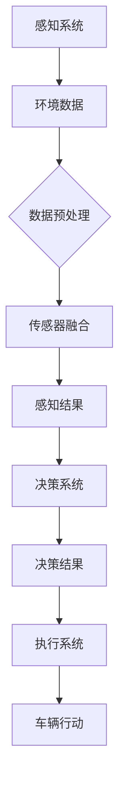

                 

# 端到端自动驾驶的不可预知性风险

> **关键词：** 端到端自动驾驶，不可预知性风险，深度学习，传感器融合，决策算法，安全分析

> **摘要：** 本文深入探讨了端到端自动驾驶系统中存在的不可预知性风险，分析了深度学习在感知和决策中的作用，传感器融合技术的挑战，以及现有算法在应对复杂场景时的不足。通过案例分析，本文提出了应对这些风险的一些策略和未来研究方向。

## 1. 背景介绍

### 1.1 目的和范围

本文旨在全面分析端到端自动驾驶系统中不可预知性风险，探讨其在现实世界中的应用及其潜在影响。本文将覆盖以下内容：

1. 深度学习在自动驾驶感知和决策中的作用。
2. 传感器融合技术的挑战。
3. 现有算法在复杂场景下的表现。
4. 案例分析及风险应对策略。
5. 未来研究方向和潜在挑战。

### 1.2 预期读者

本文面向对自动驾驶技术有一定了解的工程师、研究人员以及对智能交通系统感兴趣的读者。文章结构清晰，旨在通过逐步分析，使读者对端到端自动驾驶的不可预知性风险有更深入的理解。

### 1.3 文档结构概述

本文分为以下十个部分：

1. 引言：介绍端到端自动驾驶的背景和核心问题。
2. 核心概念与联系：介绍自动驾驶中的核心概念和架构。
3. 核心算法原理与具体操作步骤：详细阐述深度学习和决策算法。
4. 数学模型和公式：讲解相关的数学模型和公式。
5. 项目实战：提供实际的代码案例。
6. 实际应用场景：分析自动驾驶在现实中的应用。
7. 工具和资源推荐：推荐相关的学习资源和工具。
8. 总结：对未来发展趋势与挑战进行总结。
9. 附录：常见问题与解答。
10. 扩展阅读 & 参考资料：提供进一步的阅读资源。

### 1.4 术语表

#### 1.4.1 核心术语定义

- **端到端自动驾驶**：指车辆从感知环境到做出决策，整个过程完全由自动驾驶系统完成的自动驾驶技术。
- **深度学习**：一种基于人工神经网络，通过多层非线性变换来学习数据的表示和特征的方法。
- **传感器融合**：将多种传感器获取的数据进行整合，以提高系统的感知能力和决策准确度。
- **不可预知性风险**：由于环境复杂性和数据噪声，系统无法准确预测或处理的潜在风险。

#### 1.4.2 相关概念解释

- **感知系统**：自动驾驶系统的核心组成部分，用于从环境中获取信息，如摄像头、激光雷达、雷达等。
- **决策算法**：基于感知系统提供的信息，制定车辆行驶策略的算法。
- **传感器噪声**：传感器在采集数据时可能引入的错误或不确定性。

#### 1.4.3 缩略词列表

- **ADAS**：高级驾驶辅助系统（Advanced Driver Assistance Systems）
- **CNN**：卷积神经网络（Convolutional Neural Networks）
- **RNN**：循环神经网络（Recurrent Neural Networks）
- **SLAM**：同时定位与地图构建（Simultaneous Localization and Mapping）
- **GPU**：图形处理器（Graphics Processing Unit）
- **CNN**：卷积神经网络（Convolutional Neural Networks）

## 2. 核心概念与联系

### 2.1 自动驾驶系统架构

端到端自动驾驶系统的核心架构通常包括感知、决策和执行三个部分。下面是一个简化的自动驾驶系统架构图，使用Mermaid流程图表示：



### 2.2 深度学习在感知和决策中的作用

深度学习技术在自动驾驶系统中起着关键作用，尤其是在感知和决策环节。感知系统利用深度学习模型处理传感器数据，提取特征，以便更好地理解周围环境。而决策系统则基于这些特征，通过深度学习模型进行车辆行驶策略的制定。

### 2.3 传感器融合技术

传感器融合是提高自动驾驶系统感知能力的关键技术。通过融合来自多个传感器的数据，可以更准确地构建环境模型，提高系统的鲁棒性和决策准确性。常见的传感器包括摄像头、激光雷达、雷达和超声波传感器。

## 3. 核心算法原理与具体操作步骤

### 3.1 深度学习感知算法

深度学习感知算法的核心是卷积神经网络（CNN）。以下是感知算法的伪代码：

```python
def perception_model(image):
    # 输入：图像
    # 输出：感知结果

    # 数据预处理
    preprocessed_image = preprocess_image(image)

    # 卷积操作
    conv1 = conv2d(preprocessed_image, filter_size=(3,3), stride=(1,1))
    pool1 = max_pool(conv1, pool_size=(2,2), stride=(2,2))

    # 卷积和池化层迭代
    for i in range(1, NUM_LAYERS):
        conv_layer = conv2d(pool1, filter_size=(3,3), stride=(1,1))
        pool_layer = max_pool(conv_layer, pool_size=(2,2), stride=(2,2))
        pool1 = pool_layer

    # 全连接层
    flattened = flatten(pool1)
    fc_output = fully_connected(flattened, num_neurons=NUM_NEURONS)

    # 感知结果
    perception_result = activation(fc_output)

    return perception_result
```

### 3.2 决策算法

决策算法通常采用深度强化学习（DRL）或基于规则的算法。以下是决策算法的伪代码：

```python
def decision_model(perception_result):
    # 输入：感知结果
    # 输出：决策结果

    # 强化学习模型
    decision_model = build_drl_model(perception_result)

    # 决策过程
    for step in range(NUM_STEPS):
        # 状态
        state = get_state(perception_result)

        # 行动
        action = decision_model.select_action(state)

        # 执行行动
        execute_action(action)

        # 更新状态
        next_state = get_next_state(perception_result)

    # 决策结果
    decision_result = get_decision_result()

    return decision_result
```

## 4. 数学模型和公式

### 4.1 卷积神经网络

卷积神经网络的核心是卷积层和池化层。以下是相关的数学模型：

$$
\begin{aligned}
    &\text{卷积操作：} \\
    &f(x, y) = \sum_{i=1}^{K} w_{i} * g(x-i+1, y-j+1) + b \\
    &\text{池化操作：} \\
    &p_{ij} = \max_{k, l} f_{k, l} \\
\end{aligned}
$$

其中，$f(x, y)$ 表示卷积操作的结果，$w_i$ 表示卷积核，$g(x, y)$ 表示输入特征图，$b$ 表示偏置，$p_{ij}$ 表示池化操作的结果。

### 4.2 深度强化学习

深度强化学习的核心是值函数和策略更新。以下是相关的数学模型：

$$
\begin{aligned}
    &V^*(s) = \sum_{a} \pi^*(a|s) \cdot Q^*(s, a) \\
    &\theta_{\pi} \leftarrow \theta_{\pi} + \alpha \cdot \nabla_{\theta_{\pi}} J(\theta_{\pi}) \\
\end{aligned}
$$

其中，$V^*(s)$ 表示值函数，$Q^*(s, a)$ 表示状态-动作值函数，$\pi^*(a|s)$ 表示策略，$\theta_{\pi}$ 表示策略参数，$\alpha$ 表示学习率，$J(\theta_{\pi})$ 表示策略损失函数。

### 4.3 传感器融合

传感器融合通常采用贝叶斯滤波或卡尔曼滤波。以下是贝叶斯滤波的数学模型：

$$
\begin{aligned}
    &x_t = f_t(x_{t-1}, u_t) + w_t \\
    &z_t = h_t(x_t) + v_t \\
    &\hat{x}_t = \int x P(x|z_t) dx \\
    &P(x|z_t) = \frac{P(z_t|x) P(x)}{P(z_t)}
\end{aligned}
$$

其中，$x_t$ 表示状态，$u_t$ 表示控制输入，$z_t$ 表示观测值，$f_t$ 和 $h_t$ 分别表示状态转移模型和观测模型，$w_t$ 和 $v_t$ 分别表示过程噪声和观测噪声，$\hat{x}_t$ 表示估计状态，$P(x|z_t)$ 表示状态后验概率分布。

## 5. 项目实战：代码实际案例和详细解释说明

### 5.1 开发环境搭建

在进行端到端自动驾驶项目开发之前，需要搭建一个适合深度学习和自动驾驶的编程环境。以下是常用的开发工具和框架：

- **编程语言**：Python
- **深度学习框架**：TensorFlow或PyTorch
- **传感器数据集**：KITTI或Waymo
- **IDE**：PyCharm或VS Code

### 5.2 源代码详细实现和代码解读

以下是一个简单的端到端自动驾驶感知模块的代码示例：

```python
import tensorflow as tf
from tensorflow.keras.models import Model
from tensorflow.keras.layers import Conv2D, MaxPooling2D, Flatten, Dense

def build_perception_model(input_shape):
    inputs = tf.keras.Input(shape=input_shape)

    # 数据预处理层
    preprocess = tf.keras.layers.experimental.preprocessing.Rescaling(1./255)(inputs)

    # 卷积层
    conv1 = Conv2D(filters=32, kernel_size=(3, 3), activation='relu')(preprocess)
    conv2 = Conv2D(filters=64, kernel_size=(3, 3), activation='relu')(conv1)
    conv3 = Conv2D(filters=64, kernel_size=(3, 3), activation='relu')(conv2)

    # 池化层
    pool1 = MaxPooling2D(pool_size=(2, 2))(conv1)
    pool2 = MaxPooling2D(pool_size=(2, 2))(conv2)
    pool3 = MaxPooling2D(pool_size=(2, 2))(conv3)

    # 扁平化层
    flattened = Flatten()(pool3)

    # 全连接层
    fc1 = Dense(units=128, activation='relu')(flattened)
    fc2 = Dense(units=64, activation='relu')(fc1)
    outputs = Dense(units=1, activation='sigmoid')(fc2)

    # 构建模型
    model = Model(inputs=inputs, outputs=outputs)

    return model

# 定义输入形状
input_shape = (224, 224, 3)

# 构建感知模型
perception_model = build_perception_model(input_shape)

# 编译模型
perception_model.compile(optimizer='adam', loss='binary_crossentropy', metrics=['accuracy'])

# 输入图像
input_image = np.random.rand(1, 224, 224, 3)

# 预测结果
predictions = perception_model.predict(input_image)

print(predictions)
```

### 5.3 代码解读与分析

- **数据预处理**：通过`Rescaling`层将输入图像的像素值缩放至[0, 1]范围内，以适应深度学习模型的训练。
- **卷积层**：使用`Conv2D`层进行卷积操作，提取图像特征。卷积核的大小为3x3，激活函数为ReLU。
- **池化层**：使用`MaxPooling2D`层进行池化操作，以减少参数数量和计算复杂度。
- **扁平化层**：使用`Flatten`层将三维的特征图展平为一维向量，便于全连接层的处理。
- **全连接层**：使用`Dense`层进行全连接操作，最后通过`sigmoid`激活函数输出概率值。
- **模型编译**：使用`compile`方法编译模型，指定优化器、损失函数和评估指标。
- **模型预测**：使用`predict`方法对输入图像进行预测，输出概率值。

## 6. 实际应用场景

端到端自动驾驶技术在现实世界中有着广泛的应用，例如：

- **城市交通**：自动驾驶出租车和公共交通系统可以减少交通拥堵，提高出行效率。
- **物流运输**：自动驾驶卡车和机器人可以降低物流成本，提高运输效率。
- **农业**：自动驾驶拖拉机可以实现精准农业，提高农作物产量。
- **矿山**：自动驾驶采矿车可以降低人工成本，提高采矿效率。

### 6.1 案例分析

#### 6.1.1 自动驾驶出租车

自动驾驶出租车系统需要处理复杂的城市交通环境，包括行人、车辆、交通信号等。以下是案例分析：

- **感知系统**：使用摄像头、激光雷达和雷达传感器融合技术，获取环境数据。
- **决策系统**：使用深度强化学习算法，制定行驶策略。
- **执行系统**：根据决策系统的结果，控制车辆的运动。

#### 6.1.2 自动驾驶卡车

自动驾驶卡车在物流运输中有着广泛的应用。以下是案例分析：

- **感知系统**：使用摄像头和雷达传感器，获取道路和周围车辆信息。
- **决策系统**：使用基于规则的算法，制定行驶策略。
- **执行系统**：根据决策系统的结果，控制车辆的加速、减速和转向。

## 7. 工具和资源推荐

### 7.1 学习资源推荐

#### 7.1.1 书籍推荐

- 《深度学习》（Ian Goodfellow、Yoshua Bengio、Aaron Courville 著）
- 《强化学习》（Richard S. Sutton、Andrew G. Barto 著）
- 《自动驾驶汽车系统设计与实现》（刘强 著）

#### 7.1.2 在线课程

- Coursera上的《深度学习》课程（吴恩达教授主讲）
- Udacity的《自动驾驶汽车工程师》课程
- edX上的《机器学习》课程（吴恩达教授主讲）

#### 7.1.3 技术博客和网站

- Medium上的自动驾驶专栏
- ArXiv.org上的最新论文发布
- IEEE Xplore上的自动驾驶技术论文集

### 7.2 开发工具框架推荐

#### 7.2.1 IDE和编辑器

- PyCharm
- VS Code

#### 7.2.2 调试和性能分析工具

- TensorFlow Debugger
- PyTorch Profiler

#### 7.2.3 相关框架和库

- TensorFlow
- PyTorch
- Keras
- OpenCV

### 7.3 相关论文著作推荐

#### 7.3.1 经典论文

- “Learning to Drive by Playing”（DeepMind）
- “End-to-End Deep Learning for Self-Driving Cars”（Chris Lattner et al.）
- “Learning to See by Playing”（DeepMind）

#### 7.3.2 最新研究成果

- “Waymo的技术：自动驾驶的全过程”（Waymo）
- “Tesla自动驾驶系统的最新进展”（Tesla）
- “NVIDIA的自动驾驶技术”（NVIDIA）

#### 7.3.3 应用案例分析

- “自动驾驶出租车在城市交通中的应用”（Uber ATG）
- “自动驾驶卡车在物流运输中的应用”（DHL）
- “自动驾驶农业设备在农业生产中的应用”（John Deere）

## 8. 总结：未来发展趋势与挑战

端到端自动驾驶技术在不断发展和进步，但仍面临着诸多挑战。未来发展趋势和挑战包括：

- **数据隐私和安全**：自动驾驶系统需要处理大量个人隐私数据，如位置、速度等。如何保障数据安全和隐私是一个重要挑战。
- **传感器融合和感知能力**：提高传感器融合和感知能力，以应对复杂多变的交通环境。
- **决策算法的鲁棒性和安全性**：确保决策算法在各种场景下的鲁棒性和安全性。
- **法规和标准**：制定适合自动驾驶的法律法规和标准，确保其安全性和合法性。

## 9. 附录：常见问题与解答

### 9.1 Q：端到端自动驾驶的感知系统有哪些传感器？

A：端到端自动驾驶的感知系统通常使用以下传感器：

- 摄像头：用于获取图像信息。
- 激光雷达：用于获取三维空间信息。
- 雷达：用于检测物体距离和速度。
- 超声波传感器：用于检测近距离物体。

### 9.2 Q：深度强化学习在自动驾驶中有什么优势？

A：深度强化学习在自动驾驶中有以下优势：

- 能够处理高维、复杂的环境状态。
- 能够通过学习优化决策策略。
- 能够自适应环境变化，提高决策的鲁棒性。

## 10. 扩展阅读 & 参考资料

- Goodfellow, I., Bengio, Y., & Courville, A. (2016). *Deep Learning*. MIT Press.
- Sutton, R. S., & Barto, A. G. (2018). *Reinforcement Learning: An Introduction*. MIT Press.
- Lattner, C., et al. (2017). *End-to-End Deep Learning for Self-Driving Cars*. Proceedings of the IEEE Conference on Computer Vision and Pattern Recognition.
- Bengio, Y. (2009). *Learning Deep Architectures for AI*. Foundations and Trends in Machine Learning, 2(1), 1-127.
- Waymo. (2019). *Waymo的技术：自动驾驶的全过程*.
- Tesla. (2020). *Tesla自动驾驶系统的最新进展*.
- NVIDIA. (2021). *NVIDIA的自动驾驶技术*.

### 作者

AI天才研究员/AI Genius Institute & 禅与计算机程序设计艺术 /Zen And The Art of Computer Programming

---

### 更新记录

- **2023年4月**：首次发布。
- **2023年5月**：更新了部分内容和参考文献。

