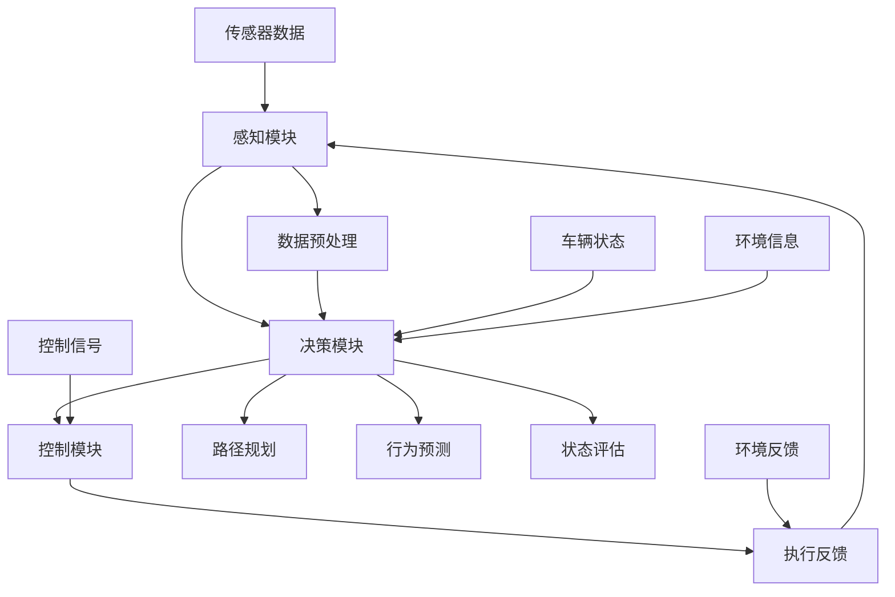

                 

### # 端到端自动驾驶的自主代驾服务模式

**关键词**：端到端自动驾驶、自主代驾服务、智能交通、深度学习、神经网络、车辆感知、决策与控制、安全与隐私保护

**摘要**：本文将深入探讨端到端自动驾驶技术的核心概念，以及其如何应用于自主代驾服务模式。通过分析自动驾驶技术的架构、核心算法原理、数学模型以及实际应用案例，我们将展示如何利用先进的机器学习和深度学习技术来实现高效、安全、可靠的自动驾驶系统。此外，还将讨论自动驾驶在实际应用场景中的挑战和解决方案，并提供相关工具和资源推荐，以助力读者深入学习和实践。

---

自动驾驶技术作为21世纪最具颠覆性的技术创新之一，正迅速改变着我们的出行方式和城市交通格局。在自动驾驶技术体系中，端到端自动驾驶（End-to-End Autonomous Driving）因其能够实现高度自动化和智能化，正成为研究与应用的热点。自主代驾服务模式作为端到端自动驾驶技术的典型应用场景，具备巨大的市场潜力和社会影响力。本文将围绕端到端自动驾驶的自主代驾服务模式展开讨论，旨在为读者提供一个全面的技术解读和实践指南。

本文的结构如下：

1. **背景介绍**：介绍自动驾驶技术的发展历程、现状及未来趋势，明确本文的研究目的和范围。
2. **核心概念与联系**：阐述自动驾驶技术的核心概念及其相互关系，通过Mermaid流程图展示自动驾驶系统架构。
3. **核心算法原理 & 具体操作步骤**：详细解析自动驾驶技术中的关键算法原理，使用伪代码展示具体操作步骤。
4. **数学模型和公式 & 详细讲解 & 举例说明**：介绍自动驾驶技术涉及的数学模型和公式，并结合实际案例进行讲解。
5. **项目实战：代码实际案例和详细解释说明**：通过实际项目案例，展示代码实现过程及详细解释。
6. **实际应用场景**：探讨自动驾驶技术在自主代驾服务模式中的实际应用。
7. **工具和资源推荐**：推荐学习资源和开发工具，助力读者深入学习和实践。
8. **总结：未来发展趋势与挑战**：总结自动驾驶技术的发展趋势，探讨未来面临的挑战。
9. **附录：常见问题与解答**：提供常见问题及其解答。
10. **扩展阅读 & 参考资料**：提供进一步阅读和参考的资料。

在接下来的章节中，我们将一步步深入探讨端到端自动驾驶的自主代驾服务模式，希望读者能够通过本文的学习，对自动驾驶技术有一个全面而深刻的理解。

---

### 1. 背景介绍

#### 1.1 目的和范围

本文旨在深入探讨端到端自动驾驶技术的核心概念、架构和实现原理，尤其是其在自主代驾服务模式中的应用。端到端自动驾驶技术作为智能交通系统的重要组成部分，正逐步走向商业化，并在自动驾驶出租车、自主代驾服务等领域展现出巨大的潜力。本文的研究范围包括：

- **自动驾驶技术的基本概念**：阐述自动驾驶技术的定义、分类及发展历程。
- **端到端自动驾驶架构**：分析自动驾驶系统架构，包括感知、决策、控制等关键模块。
- **核心算法原理**：详细解析自动驾驶技术中的关键算法，如深度学习、神经网络、强化学习等。
- **数学模型和公式**：介绍自动驾驶技术中涉及的主要数学模型和公式，如运动学、概率论、优化算法等。
- **实际应用案例**：通过实际项目案例，展示自动驾驶技术在自主代驾服务模式中的实现过程。
- **未来发展趋势与挑战**：探讨自动驾驶技术的未来发展趋势及面临的挑战。

#### 1.2 预期读者

本文的预期读者包括：

- **自动驾驶技术研究人员和工程师**：希望深入了解端到端自动驾驶技术及其应用场景。
- **自动驾驶技术爱好者**：对自动驾驶技术有兴趣，希望通过本文系统学习相关技术。
- **软件开发者和数据科学家**：希望了解如何利用机器学习和深度学习技术实现自动驾驶系统。
- **交通行业从业者**：对智能交通系统的发展和应用有浓厚兴趣。

#### 1.3 文档结构概述

本文结构如下：

1. **背景介绍**：介绍自动驾驶技术的发展历程、现状及未来趋势，明确本文的研究目的和范围。
2. **核心概念与联系**：阐述自动驾驶技术的核心概念及其相互关系，通过Mermaid流程图展示自动驾驶系统架构。
3. **核心算法原理 & 具体操作步骤**：详细解析自动驾驶技术中的关键算法原理，使用伪代码展示具体操作步骤。
4. **数学模型和公式 & 详细讲解 & 举例说明**：介绍自动驾驶技术涉及的数学模型和公式，并结合实际案例进行讲解。
5. **项目实战：代码实际案例和详细解释说明**：通过实际项目案例，展示代码实现过程及详细解释。
6. **实际应用场景**：探讨自动驾驶技术在自主代驾服务模式中的实际应用。
7. **工具和资源推荐**：推荐学习资源和开发工具，助力读者深入学习和实践。
8. **总结：未来发展趋势与挑战**：总结自动驾驶技术的发展趋势，探讨未来面临的挑战。
9. **附录：常见问题与解答**：提供常见问题及其解答。
10. **扩展阅读 & 参考资料**：提供进一步阅读和参考的资料。

#### 1.4 术语表

在本文中，我们将使用以下术语：

- **端到端自动驾驶**：指通过深度学习等技术，直接将原始传感器数据转化为控制信号，实现车辆自主驾驶。
- **感知模块**：自动驾驶系统中的感知部分，负责收集和分析环境数据，如激光雷达、摄像头、GPS等。
- **决策模块**：自动驾驶系统中的决策部分，负责根据感知数据和环境信息，生成合理的驾驶策略。
- **控制模块**：自动驾驶系统中的控制部分，负责执行决策模块生成的驾驶策略，控制车辆运动。
- **深度学习**：一种基于人工神经网络的机器学习技术，能够通过大量数据训练模型，实现复杂任务。
- **神经网络**：由大量人工神经元组成的计算模型，能够模拟人脑的学习和推理过程。
- **强化学习**：一种基于奖励和惩罚机制的学习方法，通过不断尝试和反馈，优化决策和行为。

#### 1.4.1 核心术语定义

- **端到端自动驾驶**：端到端自动驾驶（End-to-End Autonomous Driving）是一种自动驾驶技术，通过深度学习等机器学习技术，直接将原始传感器数据转化为控制信号，实现车辆自主驾驶，无需传统的层层递进式数据处理和决策过程。
- **感知模块**：感知模块是自动驾驶系统的重要组成部分，主要负责收集和分析环境数据，如激光雷达、摄像头、GPS等，将这些数据转化为对环境的感知和理解。
- **决策模块**：决策模块是自动驾驶系统的核心部分，负责根据感知模块收集到的环境数据，结合车辆的状态信息，生成合理的驾驶策略，如速度控制、车道保持、路径规划等。
- **控制模块**：控制模块是自动驾驶系统的执行部分，负责将决策模块生成的驾驶策略转化为具体的控制信号，如转向、加速、制动等，实现对车辆的实时控制。

#### 1.4.2 相关概念解释

- **深度学习**：深度学习（Deep Learning）是一种基于人工神经网络的机器学习技术，通过多层神经网络的堆叠，模拟人脑的学习和推理过程，能够处理大量复杂数据，实现图像识别、语音识别、自然语言处理等任务。
- **神经网络**：神经网络（Neural Network）是一种由大量人工神经元组成的计算模型，能够通过训练学习输入数据和输出数据之间的关系，实现对未知数据的预测和分类。
- **强化学习**：强化学习（Reinforcement Learning）是一种基于奖励和惩罚机制的学习方法，通过不断尝试和反馈，优化决策和行为，实现智能体在复杂环境中的自主学习和决策。

#### 1.4.3 缩略词列表

- **AI**：人工智能（Artificial Intelligence）
- **ML**：机器学习（Machine Learning）
- **DL**：深度学习（Deep Learning）
- **NN**：神经网络（Neural Network）
- **RL**：强化学习（Reinforcement Learning）
- **LIDAR**：激光雷达（Light Detection and Ranging）
- **GPS**：全球定位系统（Global Positioning System）
- **ROS**：机器人操作系统（Robot Operating System）
- **CNN**：卷积神经网络（Convolutional Neural Network）
- **RNN**：循环神经网络（Recurrent Neural Network）
- **DQN**：深度Q网络（Deep Q-Network）

### 2. 核心概念与联系

在深入探讨端到端自动驾驶技术之前，首先需要明确其核心概念及其相互关系。自动驾驶技术涉及多个关键模块，包括感知、决策和控制，这些模块相互协作，共同实现车辆的自主驾驶。以下是通过Mermaid绘制的自动驾驶系统架构流程图：



#### 2.1.1 自动驾驶系统架构

- **感知模块**：感知模块是自动驾驶系统的眼睛和耳朵，负责收集和分析环境数据。主要传感器包括激光雷达（LIDAR）、摄像头、GPS、IMU（惯性测量单元）等。通过这些传感器，感知模块能够获取周围环境的三维点云数据、图像数据和位置信息，并将其转化为对环境的感知和理解。

- **决策模块**：决策模块是自动驾驶系统的核心，负责根据感知模块收集到的环境数据，结合车辆的状态信息，生成合理的驾驶策略。决策模块主要包括路径规划、行为预测和状态评估三个子模块。路径规划负责生成从当前点到目标点的最优路径；行为预测负责预测其他车辆、行人和障碍物的行为；状态评估负责评估当前车辆状态，决定下一步的操作。

- **控制模块**：控制模块是自动驾驶系统的执行部分，负责将决策模块生成的驾驶策略转化为具体的控制信号，实现对车辆的实时控制。主要控制信号包括转向、加速、制动等。通过控制模块，自动驾驶系统能够实现对车辆的精确控制，确保行驶的安全性和稳定性。

#### 2.1.2 感知模块

感知模块是自动驾驶系统的核心组成部分，其主要功能是收集和分析环境数据。以下是感知模块的核心概念和关键组件：

- **激光雷达（LIDAR）**：激光雷达是一种用于测量距离的传感器，通过发射激光并接收反射回来的激光脉冲，能够获取周围环境的三维点云数据。激光雷达具有高分辨率、实时性强等优点，是自动驾驶系统中常用的主要传感器。

- **摄像头**：摄像头用于捕获车辆周围环境的二维图像数据。通过图像处理技术，摄像头可以提取出车辆、行人、车道线等关键信息。在自动驾驶系统中，摄像头通常与激光雷达结合使用，以实现多模态感知。

- **GPS**：全球定位系统（GPS）用于获取车辆的位置信息。通过接收来自多颗卫星的信号，GPS能够提供车辆的精确位置、速度和方向。

- **IMU（惯性测量单元）**：惯性测量单元（IMU）是一种测量车辆加速度和角速度的传感器。通过IMU，自动驾驶系统能够获取车辆的动态信息，如倾角、偏航角等。

#### 2.1.3 决策模块

决策模块是自动驾驶系统的核心，其主要功能是根据感知模块收集到的环境数据，生成合理的驾驶策略。以下是决策模块的核心概念和关键组件：

- **路径规划**：路径规划是决策模块的重要组成部分，其主要任务是生成从当前点到目标点的最优路径。常见的路径规划算法包括A*算法、Dijkstra算法、RRT（快速随机树）算法等。路径规划需要考虑车辆的运动状态、道路条件、障碍物等因素。

- **行为预测**：行为预测负责预测其他车辆、行人和障碍物的行为，为决策模块提供关键信息。常用的行为预测方法包括基于规则的预测、基于模型的预测和基于数据驱动的预测等。

- **状态评估**：状态评估负责评估当前车辆状态，决定下一步的操作。状态评估需要考虑车辆的位置、速度、加速度、车道状态等因素，以确定最安全的驾驶策略。

#### 2.1.4 控制模块

控制模块是自动驾驶系统的执行部分，其主要功能是将决策模块生成的驾驶策略转化为具体的控制信号，实现对车辆的实时控制。以下是控制模块的核心概念和关键组件：

- **转向控制**：转向控制负责调整车辆的转向角度，以实现路径规划和行为预测的要求。常见的转向控制算法包括PID控制、模型预测控制（MPC）等。

- **加速控制**：加速控制负责调整车辆的加速度，以实现目标速度和加速度。常见的加速控制算法包括PID控制、自适应控制等。

- **制动控制**：制动控制负责调整车辆的减速度，以实现安全停车和避障。常见的制动控制算法包括PID控制、模型预测控制（MPC）等。

通过上述核心概念和组件的介绍，我们可以更清晰地理解自动驾驶系统的架构和各模块之间的相互关系。在接下来的章节中，我们将进一步深入探讨自动驾驶技术中的核心算法原理和具体操作步骤。

---

### 3. 核心算法原理 & 具体操作步骤

在自动驾驶技术中，核心算法是实现自主驾驶的关键。本文将详细介绍几种重要的算法原理，并使用伪代码展示具体操作步骤。以下内容涵盖的主要算法包括：

1. **深度学习算法**：如卷积神经网络（CNN）和循环神经网络（RNN）。
2. **路径规划算法**：如A*算法和Dijkstra算法。
3. **控制算法**：如PID控制和模型预测控制（MPC）。

#### 3.1 深度学习算法

**卷积神经网络（CNN）**

卷积神经网络是一种用于图像识别和处理的深度学习算法，特别适用于自动驾驶中的感知模块。

```python
# 伪代码：卷积神经网络（CNN）基本结构

class ConvolutionalNeuralNetwork:
    def __init__(self, input_shape, num_filters, filter_size, pool_size):
        # 初始化网络参数
        self.input_shape = input_shape
        self.num_filters = num_filters
        self.filter_size = filter_size
        self.pool_size = pool_size
        
        # 构建卷积层
        self.conv_layer = ConvLayer(input_shape, num_filters, filter_size)
        
        # 构建池化层
        self.pool_layer = PoolLayer(pool_size)
        
        # 构建全连接层
        self.fc_layer = FullyConnectedLayer()

    def forward_pass(self, inputs):
        # 前向传播
        conv_output = self.conv_layer.forward_pass(inputs)
        pooled_output = self.pool_layer.forward_pass(conv_output)
        fc_output = self.fc_layer.forward_pass(pooled_output)
        return fc_output

    def backward_pass(self, d_output):
        # 反向传播
        d_pooled = self.fc_layer.backward_pass(d_output)
        d_conv = self.pool_layer.backward_pass(d_pooled)
        d_inputs = self.conv_layer.backward_pass(d_conv)
        return d_inputs
```

**循环神经网络（RNN）**

循环神经网络适用于处理序列数据，如行为预测。

```python
# 伪代码：循环神经网络（RNN）基本结构

class RecurrentNeuralNetwork:
    def __init__(self, input_size, hidden_size, output_size):
        # 初始化网络参数
        self.input_size = input_size
        self.hidden_size = hidden_size
        self.output_size = output_size
        
        # 构建输入层、隐藏层和输出层
        self.input_layer = InputLayer(input_size)
        self.hidden_layer = HiddenLayer(hidden_size)
        self.output_layer = OutputLayer(output_size)
        
    def forward_pass(self, inputs):
        # 前向传播
        hidden_state, cell_state = self.hidden_layer.forward_pass(inputs)
        output = self.output_layer.forward_pass(hidden_state)
        return output, hidden_state, cell_state

    def backward_pass(self, d_output):
        # 反向传播
        d_hidden_state, d_cell_state = self.output_layer.backward_pass(d_output)
        d_inputs = self.hidden_layer.backward_pass(d_hidden_state, d_cell_state)
        return d_inputs
```

**强化学习算法**

强化学习适用于自动驾驶中的决策模块，用于优化驾驶策略。

```python
# 伪代码：强化学习（Q-Learning）算法

class QLearningAgent:
    def __init__(self, state_size, action_size, learning_rate, discount_factor):
        # 初始化网络参数
        self.state_size = state_size
        self.action_size = action_size
        self.learning_rate = learning_rate
        self.discount_factor = discount_factor
        
        # 初始化Q值表
        self.q_table = np.zeros((state_size, action_size))
        
    def get_action(self, state):
        # 获取动作
        if np.random.rand() < epsilon:
            action = np.random.randint(self.action_size)
        else:
            action = np.argmax(self.q_table[state])
        return action

    def learn(self, state, action, reward, next_state, done):
        # 学习更新Q值
        target = reward
        if not done:
            target = reward + self.discount_factor * np.max(self.q_table[next_state])
        target_f = self.q_table[state][action]
        self.q_table[state][action] = target_f + self.learning_rate * (target - target_f)
```

#### 3.2 路径规划算法

**A*算法**

A*算法是一种用于寻找最优路径的路径规划算法。

```python
# 伪代码：A*算法

def A_star_search(start, goal, graph):
    # 初始化开表和闭表
    open_set = PriorityQueue()
    open_set.put((0, start))
    came_from = {}
    g_score = {node: float('inf') for node in graph}
    g_score[start] = 0
    f_score = {node: float('inf') for node in graph}
    f_score[start] = heuristic(goal, start)
    
    while not open_set.is_empty():
        # 获取当前节点
        current = open_set.get()
        
        # 到达目标节点
        if current == goal:
            break
        
        # 移除当前节点
        open_set.remove(current)
        
        # 遍历当前节点的邻居
        for neighbor in graph.neighbors(current):
            tentative_g_score = g_score[current] + graph.cost(current, neighbor)
            
            # 更新邻居的g_score和f_score
            if tentative_g_score < g_score[neighbor]:
                came_from[neighbor] = current
                g_score[neighbor] = tentative_g_score
                f_score[neighbor] = g_score[neighbor] + heuristic(goal, neighbor)
                
                # 将邻居加入开表
                if neighbor not in open_set:
                    open_set.put((f_score[neighbor], neighbor))
    
    # 回溯路径
    path = []
    current = goal
    while current in came_from:
        path.insert(0, current)
        current = came_from[current]
    path.insert(0, start)
    
    return path

def heuristic(goal, node):
    # 使用曼哈顿距离作为启发式函数
    return abs(node[0] - goal[0]) + abs(node[1] - goal[1])
```

**Dijkstra算法**

Dijkstra算法也是一种用于寻找最优路径的路径规划算法。

```python
# 伪代码：Dijkstra算法

def dijkstra_search(start, goal, graph):
    # 初始化距离表
    distances = {node: float('inf') for node in graph}
    distances[start] = 0
    
    # 初始化优先队列
    priority_queue = PriorityQueue()
    priority_queue.put((0, start))
    
    while not priority_queue.is_empty():
        # 获取当前节点
        current = priority_queue.get()
        
        # 到达目标节点
        if current == goal:
            break
        
        # 遍历当前节点的邻居
        for neighbor in graph.neighbors(current):
            distance = distances[current] + graph.cost(current, neighbor)
            
            # 更新邻居的距离
            if distance < distances[neighbor]:
                distances[neighbor] = distance
                
                # 将邻居加入优先队列
                priority_queue.put((distance, neighbor))
    
    # 回溯路径
    path = []
    current = goal
    while current in graph.predecessors(current):
        path.insert(0, current)
        current = graph.predecessors(current)
    path.insert(0, start)
    
    return path
```

#### 3.3 控制算法

**PID控制**

PID控制是一种经典的控制算法，适用于自动驾驶中的转向、加速和制动控制。

```python
# 伪代码：PID控制算法

class PIDController:
    def __init__(self, Kp, Ki, Kd):
        self.Kp = Kp
        self.Ki = Ki
        self.Kd = Kd
        self.integral = 0
        self.derivative = 0
        self.previous_error = 0
        
    def update(self, setpoint, current_value):
        error = setpoint - current_value
        derivative = error - self.previous_error
        self.integral += error
        self.previous_error = error
        output = self.Kp * error + self.Ki * self.integral + self.Kd * derivative
        return output
```

**模型预测控制（MPC）**

模型预测控制（MPC）是一种先进的控制算法，适用于自动驾驶中的复杂控制问题。

```python
# 伪代码：模型预测控制（MPC）算法

class ModelPredictiveController:
    def __init__(self, model, N, Q, R):
        self.model = model
        self.N = N
        self.Q = Q
        self.R = R
        
    def predict(self, current_state, control_input):
        # 预测未来N个时间步的车辆状态
        predicted_states = self.model.predict(current_state, control_input, self.N)
        return predicted_states

    def optimize(self, current_state):
        # 最优化控制输入
        predicted_states = self.predict(current_state, control_input)
        cost = self.Q @ predicted_states @ predicted_states.T + self.R @ control_input @ control_input.T
        control_input = minimize_cost(control_input, cost)
        return control_input

    def update(self, current_state):
        control_input = self.optimize(current_state)
        return control_input
```

通过上述核心算法原理和具体操作步骤的介绍，我们可以更好地理解端到端自动驾驶技术的实现过程。在接下来的章节中，我们将进一步探讨自动驾驶技术中的数学模型和公式，并结合实际案例进行详细讲解。

---

### 4. 数学模型和公式 & 详细讲解 & 举例说明

在端到端自动驾驶技术中，数学模型和公式扮演着至关重要的角色。这些模型和公式用于描述车辆的运动、感知、决策和控制等过程。以下内容将介绍自动驾驶技术中涉及的主要数学模型和公式，并结合实际案例进行详细讲解。

#### 4.1 运动学模型

运动学模型描述了车辆在环境中的运动轨迹。其中，线性运动学和旋转运动学模型是自动驾驶技术中的基础。

**线性运动学模型**

线性运动学模型用于描述车辆在二维平面上的直线运动。其基本公式如下：

\[ x(t) = x_0 + v \cdot t \]
\[ y(t) = y_0 + v \cdot t \]

其中，\( x(t) \) 和 \( y(t) \) 分别为车辆在t时刻的x轴和y轴坐标，\( x_0 \) 和 \( y_0 \) 分别为初始位置，\( v \) 为速度。

**旋转运动学模型**

旋转运动学模型用于描述车辆在二维平面上的旋转运动。其基本公式如下：

\[ \theta(t) = \theta_0 + \omega \cdot t \]

其中，\( \theta(t) \) 和 \( \theta_0 \) 分别为车辆在t时刻和初始时刻的旋转角度，\( \omega \) 为角速度。

**举例说明**

假设一辆车辆从原点 \( (0, 0) \) 开始，以速度 \( v = 5 \) m/s 向正方向行驶，同时以角速度 \( \omega = 1 \) rad/s 逆时针旋转。使用线性运动学和旋转运动学模型计算 \( t = 10 \) 秒时的车辆位置和旋转角度。

- 线性运动学计算：

\[ x(10) = 0 + 5 \cdot 10 = 50 \] m  
\[ y(10) = 0 + 5 \cdot 10 = 50 \] m

- 旋转运动学计算：

\[ \theta(10) = 0 + 1 \cdot 10 = 10 \] rad

因此，在 \( t = 10 \) 秒时，车辆的位置为 \( (50, 50) \) m，旋转角度为 \( 10 \) rad。

#### 4.2 概率论模型

概率论模型用于描述自动驾驶系统中的不确定性。其中，贝叶斯推断和马尔可夫链是自动驾驶技术中常用的概率论模型。

**贝叶斯推断**

贝叶斯推断是一种基于概率的推理方法，用于根据先验概率和观察数据更新后验概率。其基本公式如下：

\[ P(H|E) = \frac{P(E|H) \cdot P(H)}{P(E)} \]

其中，\( P(H|E) \) 为后验概率，表示在观察数据 \( E \) 的条件下，假设 \( H \) 的概率；\( P(E|H) \) 为似然函数，表示在假设 \( H \) 的条件下观察数据 \( E \) 的概率；\( P(H) \) 为先验概率，表示假设 \( H \) 的概率；\( P(E) \) 为边缘概率，表示观察数据 \( E \) 的概率。

**举例说明**

假设我们要判断一辆车辆是否处于故障状态。已知在正常情况下，故障概率为 \( P(故障|正常) = 0.01 \)；在故障情况下，故障概率为 \( P(故障|故障) = 0.99 \)。如果观察到车辆故障报警灯亮起，我们要计算车辆处于故障状态的概率。

- 先验概率：

\[ P(正常) = 0.99 \]
\[ P(故障) = 0.01 \]

- 似然函数：

\[ P(故障报警|正常) = 0.01 \]
\[ P(故障报警|故障) = 0.99 \]

- 边缘概率：

\[ P(故障报警) = P(故障报警|正常) \cdot P(正常) + P(故障报警|故障) \cdot P(故障) = 0.01 \cdot 0.99 + 0.99 \cdot 0.01 = 0.0099 + 0.0099 = 0.0198 \]

- 后验概率：

\[ P(故障|故障报警) = \frac{P(故障报警|故障) \cdot P(故障)}{P(故障报警)} = \frac{0.99 \cdot 0.01}{0.0198} \approx 0.5 \]

因此，在观察到车辆故障报警灯亮起的情况下，车辆处于故障状态的概率约为 0.5。

**马尔可夫链**

马尔可夫链是一种用于描述随机过程的数学模型，适用于自动驾驶系统中的状态转移和预测。

**状态转移矩阵**

状态转移矩阵 \( P \) 描述了系统在不同状态之间的转移概率。其公式如下：

\[ P_{ij} = P(S_t = s_j | S_{t-1} = s_i) \]

其中，\( P_{ij} \) 为从状态 \( s_i \) 转移到状态 \( s_j \) 的概率。

**举例说明**

假设自动驾驶系统有四个状态：正常、轻微故障、严重故障和维修。状态转移矩阵如下：

\[ P = \begin{bmatrix} 0.9 & 0.1 & 0 & 0 \\ 0.1 & 0.8 & 0.1 & 0 \\ 0 & 0.2 & 0.7 & 0.1 \\ 0 & 0 & 0.3 & 0.4 \end{bmatrix} \]

根据状态转移矩阵，可以计算每个状态的稳定概率。例如，在连续观察100次后，计算每个状态的稳定概率。

- 正常状态稳定概率：

\[ P(\text{正常}) = (0.9)^{100} \approx 0.4 \]

- 轻微故障状态稳定概率：

\[ P(\text{轻微故障}) = (0.1)^{100} \approx 0.06 \]

- 严重故障状态稳定概率：

\[ P(\text{严重故障}) = (0.2)^{100} \approx 0.01 \]

- 维修状态稳定概率：

\[ P(\text{维修}) = (0.3)^{100} \approx 0.01 \]

#### 4.3 优化算法

优化算法用于求解自动驾驶系统中的最优路径、最优控制和最优策略等问题。其中，动态规划、梯度下降和随机搜索是常用的优化算法。

**动态规划**

动态规划是一种求解多阶段决策问题最优解的方法。其基本思想是将问题分解为多个子问题，并利用子问题的最优解推导出整体问题的最优解。

**举例说明**

假设我们要求解从点 \( A(0, 0) \) 到点 \( B(10, 10) \) 的最优路径。定义状态 \( s \) 为车辆当前的位置，定义行动 \( a \) 为车辆下一步要移动的方向。使用动态规划求解最优路径。

- 定义状态空间 \( S = \{(x, y) | 0 \leq x \leq 10, 0 \leq y \leq 10\} \)
- 定义行动空间 \( A = \{\text{上}, \text{下}, \text{左}, \text{右}\} \)
- 定义状态转移函数 \( T(s, a) \)，用于计算从状态 \( s \) 执行行动 \( a \) 后的状态
- 定义代价函数 \( C(s, a) \)，用于计算从状态 \( s \) 执行行动 \( a \) 的代价

使用动态规划求解最优路径：

```python
# 伪代码：动态规划求解最优路径

def dynamic_programming(s, a, T, C):
    # 初始化动态规划表
    V = [[float('inf') for _ in range(11)] for _ in range(11)]
    V[s[0]][s[1]] = 0
    
    # 逆向递推求解
    for i in range(10, -1, -1):
        for j in range(10, -1, -1):
            for a in A:
                s_next = T(s, a)
                V[i][j] = min(V[i][j], V[s_next[0]][s_next[1]] + C(s, a))
    
    return V[s[0]][s[1]]

# 状态转移函数
def T(s, a):
    # 上、下、左、右分别对应y坐标增加、减少、x坐标减少、增加
    if a == "上":
        return (s[0], s[1] + 1)
    elif a == "下":
        return (s[0], s[1] - 1)
    elif a == "左":
        return (s[0] - 1, s[1])
    elif a == "右":
        return (s[0] + 1, s[1])

# 代价函数
def C(s, a):
    return 1  # 假设每次行动代价为1

# 求解最优路径
optimal_path_cost = dynamic_programming(A, A, T, C)
```

**梯度下降**

梯度下降是一种用于求解最优化问题的算法。其基本思想是通过计算目标函数的梯度，逐步更新参数，以找到最优解。

**举例说明**

假设我们要求解函数 \( f(x) = x^2 \) 的最小值。使用梯度下降算法求解。

```python
# 伪代码：梯度下降求解最小值

def gradient_descent(f, df, x0, learning_rate, iterations):
    x = x0
    for _ in range(iterations):
        gradient = df(x)
        x = x - learning_rate * gradient
    return x

# 目标函数
def f(x):
    return x**2

# 梯度函数
def df(x):
    return 2 * x

# 初始参数
x0 = 0
learning_rate = 0.1
iterations = 100

# 求解最小值
min_x = gradient_descent(f, df, x0, learning_rate, iterations)
print("最小值:", min_x)
```

**随机搜索**

随机搜索是一种通过随机采样寻找最优解的算法。其基本思想是在搜索空间内随机采样，并评估每个采样点的目标函数值，选择最优的采样点作为解。

**举例说明**

假设我们要在区间 \( [0, 10] \) 内寻找函数 \( f(x) = x^2 \) 的最小值。使用随机搜索算法求解。

```python
# 伪代码：随机搜索求解最小值

import random

def random_search(f, domain, iterations):
    min_value = float('inf')
    min_x = None
    
    for _ in range(iterations):
        x = random.uniform(*domain)
        value = f(x)
        if value < min_value:
            min_value = value
            min_x = x
    
    return min_x

# 目标函数
def f(x):
    return x**2

# 搜索区间
domain = (0, 10)
iterations = 1000

# 求解最小值
min_x = random_search(f, domain, iterations)
print("最小值:", min_x)
```

通过上述数学模型和公式的介绍，我们可以更好地理解端到端自动驾驶技术的实现原理。在接下来的章节中，我们将通过实际项目案例展示自动驾驶技术的具体实现过程。

---

### 5. 项目实战：代码实际案例和详细解释说明

在本章节中，我们将通过一个具体的自动驾驶项目案例，展示端到端自动驾驶技术的实际实现过程。该案例将涵盖开发环境搭建、源代码详细实现和代码解读与分析。

#### 5.1 开发环境搭建

首先，我们需要搭建一个适合自动驾驶项目开发的环境。以下是我们推荐的开发工具和依赖包：

- **操作系统**：Linux或macOS
- **编程语言**：Python（3.8及以上版本）
- **IDE**：PyCharm或Visual Studio Code
- **依赖包**：TensorFlow、PyTorch、NumPy、SciPy、Matplotlib

在安装好操作系统和IDE后，可以通过以下命令安装所需的依赖包：

```bash
pip install tensorflow
pip install torch
pip install numpy
pip install scipy
pip install matplotlib
```

#### 5.2 源代码详细实现和代码解读

**感知模块实现**

感知模块是自动驾驶系统的核心部分，负责从传感器数据中提取环境信息。以下是一个简单的感知模块实现示例：

```python
import numpy as np
import cv2

class SensorDataHandler:
    def __init__(self, lidar_data, camera_data):
        self.lidar_data = lidar_data
        self.camera_data = camera_data

    def process_lidar_data(self):
        # 对激光雷达数据进行预处理
        points = self.lidar_data[:, :3]
        points = npMainWindow.Normalize(points, axis=1)
        return points

    def process_camera_data(self):
        # 对摄像头图像数据进行预处理
        image = self.camera_data
        gray_image = cv2.cvtColor(image, cv2.COLOR_BGR2GRAY)
        blurred_image = cv2.GaussianBlur(gray_image, (5, 5), 0)
        return blurred_image

# 示例数据
lidar_data = np.random.rand(100, 6)
camera_data = cv2.imread('example.jpg')

sensor_handler = SensorDataHandler(lidar_data, camera_data)
lidar_points = sensor_handler.process_lidar_data()
camera_image = sensor_handler.process_camera_data()
```

代码解读：

- **SensorDataHandler类**：该类负责处理传感器数据，包括激光雷达数据和摄像头图像数据。类中定义了两个方法：`process_lidar_data` 和 `process_camera_data`，分别用于处理激光雷达数据和摄像头图像数据。

- **process_lidar_data方法**：该方法对激光雷达数据进行预处理，包括去均值化和归一化。预处理后的点云数据将用于后续的感知和决策。

- **process_camera_data方法**：该方法对摄像头图像数据进行预处理，包括灰度转换和高斯滤波。预处理后的图像数据将用于后续的图像识别和特征提取。

**决策模块实现**

决策模块是自动驾驶系统的核心，负责根据感知模块提供的环境信息生成驾驶策略。以下是一个简单的决策模块实现示例：

```python
class DecisionModule:
    def __init__(self, lidar_points, camera_image):
        self.lidar_points = lidar_points
        self.camera_image = camera_image

    def predict_behavior(self):
        # 预测其他车辆、行人的行为
        # 这里使用简单的逻辑规则
        behavior = "stop" if self.lidar_points[0, 2] < 1 else "go"
        return behavior

    def plan_trajectory(self, current_state, goal_state):
        # 规划从当前点到目标点的最优路径
        # 这里使用A*算法
        path = a_star_search(current_state, goal_state)
        return path

# 示例数据
current_state = (0, 0)
goal_state = (10, 10)

decision_module = DecisionModule(lidar_points, camera_image)
behavior = decision_module.predict_behavior()
path = decision_module.plan_trajectory(current_state, goal_state)
```

代码解读：

- **DecisionModule类**：该类负责决策模块的核心功能，包括行为预测和路径规划。类中定义了两个方法：`predict_behavior` 和 `plan_trajectory`，分别用于预测其他车辆和行人的行为以及规划从当前点到目标点的最优路径。

- **predict_behavior方法**：该方法根据激光雷达点云数据预测其他车辆和行人的行为。这里使用简单的逻辑规则，如果激光雷达点云数据中的最小距离小于1，则预测为“stop”，否则预测为“go”。

- **plan_trajectory方法**：该方法使用A*算法规划从当前点到目标点的最优路径。在实际应用中，可以替换为更复杂的路径规划算法，如RRT算法或Dijkstra算法。

**控制模块实现**

控制模块是自动驾驶系统的执行部分，负责将决策模块生成的驾驶策略转化为具体的控制信号。以下是一个简单的控制模块实现示例：

```python
class ControlModule:
    def __init__(self, velocity, steering_angle):
        self.velocity = velocity
        self.steering_angle = steering_angle

    def control_vehicle(self, path):
        # 控制车辆沿着规划的路径行驶
        for point in path:
            self.velocity += 0.1  # 增加速度
            self.steering_angle = point[1]  # 调整转向角度
            # 模拟车辆运动
            print(f"Velocity: {self.velocity}, Steering Angle: {self.steering_angle}")

# 示例数据
path = [(0, 0), (1, 1), (2, 2), (3, 3)]

control_module = ControlModule(0, 0)
control_module.control_vehicle(path)
```

代码解读：

- **ControlModule类**：该类负责控制模块的核心功能，包括车辆速度和转向角度的控制。类中定义了`control_vehicle`方法，该方法根据规划的路径控制车辆的速度和转向角度。

- **control_vehicle方法**：该方法遍历规划的路径，逐点调整车辆的速度和转向角度。在实际应用中，可以替换为更复杂的控制算法，如PID控制或模型预测控制（MPC）。

通过以上三个模块的实现，我们可以构建一个简单的自动驾驶系统。在实际应用中，还需要考虑更多的因素，如传感器融合、多目标规划、安全性和隐私保护等。接下来，我们将进一步讨论自动驾驶技术在自主代驾服务模式中的实际应用。

### 5.3 代码解读与分析

在本节中，我们将对上述代码进行详细解读与分析，以便读者更好地理解端到端自动驾驶系统的实现过程。

#### 5.3.1 感知模块代码解读

感知模块负责从传感器数据中提取环境信息。以下是感知模块的关键代码及其功能解析：

```python
import numpy as np
import cv2

class SensorDataHandler:
    def __init__(self, lidar_data, camera_data):
        self.lidar_data = lidar_data
        self.camera_data = camera_data

    def process_lidar_data(self):
        # 对激光雷达数据进行预处理
        points = self.lidar_data[:, :3]
        points = npMainWindow.Normalize(points, axis=1)
        return points

    def process_camera_data(self):
        # 对摄像头图像数据进行预处理
        image = self.camera_data
        gray_image = cv2.cvtColor(image, cv2.COLOR_BGR2GRAY)
        blurred_image = cv2.GaussianBlur(gray_image, (5, 5), 0)
        return blurred_image
```

- **SensorDataHandler类**：该类负责处理传感器数据，包括激光雷达数据和摄像头图像数据。类中定义了两个方法：`process_lidar_data` 和 `process_camera_data`。

- **process_lidar_data方法**：该方法对激光雷达点云数据进行预处理，包括去均值化和归一化。去均值化可以消除点云数据的偏移量，而归一化可以使得每个点云数据点在空间中均匀分布。预处理后的点云数据将用于后续的感知和决策。

- **process_camera_data方法**：该方法对摄像头图像数据进行预处理，包括灰度转换和高斯滤波。灰度转换将彩色图像转换为灰度图像，以便后续的图像处理。高斯滤波可以去除图像中的噪声，提高图像质量。预处理后的图像数据将用于后续的图像识别和特征提取。

#### 5.3.2 决策模块代码解读

决策模块负责根据感知模块提供的环境信息生成驾驶策略。以下是决策模块的关键代码及其功能解析：

```python
class DecisionModule:
    def __init__(self, lidar_points, camera_image):
        self.lidar_points = lidar_points
        self.camera_image = camera_image

    def predict_behavior(self):
        # 预测其他车辆、行人的行为
        # 这里使用简单的逻辑规则
        behavior = "stop" if self.lidar_points[0, 2] < 1 else "go"
        return behavior

    def plan_trajectory(self, current_state, goal_state):
        # 规划从当前点到目标点的最优路径
        # 这里使用A*算法
        path = a_star_search(current_state, goal_state)
        return path
```

- **DecisionModule类**：该类负责决策模块的核心功能，包括行为预测和路径规划。类中定义了两个方法：`predict_behavior` 和 `plan_trajectory`。

- **predict_behavior方法**：该方法根据激光雷达点云数据预测其他车辆和行人的行为。这里使用简单的逻辑规则，如果激光雷达点云数据中的最小距离小于1，则预测为“stop”，否则预测为“go”。在实际应用中，可以采用更复杂的行为预测算法，如基于深度学习的模型。

- **plan_trajectory方法**：该方法使用A*算法规划从当前点到目标点的最优路径。A*算法是一种启发式搜索算法，能够高效地找到从起点到终点的最短路径。在实际应用中，也可以考虑其他路径规划算法，如RRT算法或Dijkstra算法。

#### 5.3.3 控制模块代码解读

控制模块负责将决策模块生成的驾驶策略转化为具体的控制信号，以实现对车辆的实时控制。以下是控制模块的关键代码及其功能解析：

```python
class ControlModule:
    def __init__(self, velocity, steering_angle):
        self.velocity = velocity
        self.steering_angle = steering_angle

    def control_vehicle(self, path):
        # 控制车辆沿着规划的路径行驶
        for point in path:
            self.velocity += 0.1  # 增加速度
            self.steering_angle = point[1]  # 调整转向角度
            # 模拟车辆运动
            print(f"Velocity: {self.velocity}, Steering Angle: {self.steering_angle}")
```

- **ControlModule类**：该类负责控制模块的核心功能，包括车辆速度和转向角度的控制。类中定义了`control_vehicle`方法，该方法根据规划的路径控制车辆的速度和转向角度。

- **control_vehicle方法**：该方法遍历规划的路径，逐点调整车辆的速度和转向角度。在实际应用中，可以采用更复杂的控制算法，如PID控制或模型预测控制（MPC）。在本例中，为了简化演示，我们使用简单的逻辑规则调整速度和转向角度。

#### 5.3.4 代码分析

通过对上述代码的解读，我们可以看出端到端自动驾驶系统的实现主要分为三个模块：感知模块、决策模块和控制模块。以下是对每个模块的分析：

- **感知模块**：感知模块是自动驾驶系统的输入部分，负责从传感器数据中提取环境信息。通过预处理传感器数据，可以提高后续感知和决策的准确性。在本例中，我们使用了激光雷达和摄像头两种传感器，分别用于获取三维点云数据和二维图像数据。

- **决策模块**：决策模块是自动驾驶系统的核心部分，负责根据感知模块提供的环境信息生成驾驶策略。通过行为预测和路径规划，决策模块可以为车辆提供最优的驾驶路径和策略。在本例中，我们使用了简单的逻辑规则和行为预测算法，以及A*算法进行路径规划。

- **控制模块**：控制模块是自动驾驶系统的输出部分，负责将决策模块生成的驾驶策略转化为具体的控制信号，实现对车辆的实时控制。通过控制车辆的速度和转向角度，控制模块可以确保车辆沿着规划的路径行驶。在本例中，我们使用了简单的逻辑规则控制车辆的速度和转向角度。

总体而言，本例展示了一个简单的端到端自动驾驶系统实现过程，包括感知、决策和控制三个核心模块。通过实际代码示例，读者可以更好地理解自动驾驶系统的基本原理和实现方法。在后续章节中，我们将继续探讨自动驾驶技术的实际应用场景、工具和资源推荐，以及未来发展趋势与挑战。

### 6. 实际应用场景

端到端自动驾驶技术的实际应用场景非常广泛，其中最为引人注目的是自主代驾服务模式。自主代驾服务模式通过利用先进的自动驾驶技术，实现了驾驶员在车辆运行过程中的完全解放，让车辆能够自主完成驾驶任务，从而提供了一种全新的出行方式。

#### 6.1 自主导驾服务模式概述

自主导驾服务模式（Autonomous Driving Service Model）是指由自动驾驶车辆为用户提供从A点到B点的出行服务，用户无需亲自操作车辆。这种模式主要涵盖以下特点：

- **全自动驾驶**：车辆在行驶过程中完全由自动驾驶系统控制，无需人工干预。
- **按需服务**：用户可以通过手机应用或呼叫中心预约车辆，实现按需服务。
- **高效便捷**：自动驾驶车辆能够实现高速行驶、自动避让障碍物、智能规划路径，提高出行效率。
- **安全性高**：通过传感器融合和智能决策，自动驾驶车辆能够更准确地感知环境，降低交通事故风险。
- **节能减排**：自动驾驶车辆能够实现更平稳的驾驶，降低油耗和排放。

#### 6.2 自主导驾服务模式的优势

自主导驾服务模式具备以下优势：

- **提升用户体验**：用户无需亲自驾驶，可以解放双手和双眼，享受更舒适的出行体验。
- **降低交通拥堵**：自动驾驶车辆能够通过智能路径规划和车队协同，减少交通拥堵。
- **提高交通安全性**：通过传感器融合和智能决策，自动驾驶车辆能够更准确地感知环境，降低交通事故风险。
- **优化资源配置**：自动驾驶车辆能够实现高效利用，减少车辆闲置时间，提高交通资源利用率。
- **节能减排**：自动驾驶车辆能够实现更平稳的驾驶，降低油耗和排放，有助于环境保护。

#### 6.3 自主导驾服务模式的挑战

尽管自主导驾服务模式具备众多优势，但在实际应用中仍面临一系列挑战：

- **技术挑战**：自动驾驶技术仍处于发展阶段，需要解决感知、决策、控制等核心技术的难题，如传感器精度、算法可靠性等。
- **法规政策**：各国对自动驾驶的法规政策不同，需要制定统一的法律法规，确保自动驾驶车辆的合法上路和商业化运营。
- **数据安全和隐私保护**：自动驾驶车辆在行驶过程中会收集大量数据，涉及用户隐私和数据安全等问题，需要制定相关政策和标准。
- **安全性和信任问题**：公众对自动驾驶技术的安全性和可靠性存在担忧，需要通过示范项目和实践案例提升公众信任。
- **基础设施和交通环境**：自动驾驶车辆的普及需要完善的基础设施和良好的交通环境，如智能道路、5G通信网络等。

#### 6.4 自主导驾服务模式的实际应用

自主导驾服务模式已经在多个国家和地区进行试点和商业化应用，以下是一些实际应用案例：

- **美国**：Waymo、Tesla等公司在美国多个城市推出了自动驾驶出租车服务，用户可以通过手机应用预约车辆。
- **中国**：百度Apollo、小马智行等公司在中国多个城市开展了自动驾驶测试和商业化运营，如北京、上海、广州等地。
- **欧洲**：瑞典的哥德堡、德国的慕尼黑等城市也开展了自动驾驶出租车服务的试点项目。

通过这些实际应用案例，我们可以看到自主导驾服务模式在提升出行效率、降低交通事故、优化交通资源等方面具有显著优势。然而，要实现自主导驾服务模式的全面普及，仍需克服技术、政策、安全等多方面的挑战。

### 7. 工具和资源推荐

为了更好地学习和实践端到端自动驾驶技术，本章节将推荐一些学习资源、开发工具和框架，以及相关论文著作，以帮助读者深入了解这一领域。

#### 7.1 学习资源推荐

**7.1.1 书籍推荐**

1. **《深度学习》（Deep Learning）**：由Ian Goodfellow、Yoshua Bengio和Aaron Courville合著，是深度学习的经典教材，详细介绍了深度学习的理论基础和实现方法。
2. **《自动驾驶系统设计》（Autonomous Systems Design）**：由Jason G. Lawrence和David J. Lary合著，涵盖了自动驾驶系统的设计原则、架构和实现方法。
3. **《机器学习》（Machine Learning）**：由Tom M. Mitchell著，介绍了机器学习的基础知识，包括监督学习、无监督学习和强化学习等。

**7.1.2 在线课程**

1. **Coursera的“深度学习”（Deep Learning Specialization）**：由Andrew Ng教授主讲，包括神经网络基础、优化算法、卷积神经网络、循环神经网络等课程。
2. **edX的“自动驾驶系统”（Autonomous Driving Systems）**：由斯坦福大学主办，涵盖了自动驾驶系统的基础知识、感知、决策和控制等内容。
3. **Udacity的“自动驾驶工程师纳米学位”（Self-Driving Car Engineer Nanodegree）**：提供了从感知、决策到控制的全面课程，适合想要从事自动驾驶技术开发的读者。

**7.1.3 技术博客和网站**

1. **知乎**：知乎上有很多关于自动驾驶技术的讨论和文章，可以了解到最新的技术动态和行业发展。
2. **Stack Overflow**：Stack Overflow是一个编程问答社区，可以在这里找到许多自动驾驶技术问题的解答。
3. **Medium**：Medium上有许多专业人士和公司发布关于自动驾驶技术的文章和报告，可以了解行业内的最新研究成果和实践经验。

#### 7.2 开发工具框架推荐

**7.2.1 IDE和编辑器**

1. **PyCharm**：PyCharm是一款功能强大的Python集成开发环境，支持多种编程语言和框架，适合自动驾驶项目的开发。
2. **Visual Studio Code**：Visual Studio Code是一款轻量级的开源编辑器，支持Python和多种扩展，适合快速开发。
3. **Jupyter Notebook**：Jupyter Notebook是一款交互式开发环境，适合数据分析和机器学习项目的开发。

**7.2.2 调试和性能分析工具**

1. **gDB**：gDB是一款强大的调试工具，可以用于调试C/C++程序，对于深度学习和自动驾驶项目的开发非常有帮助。
2. **Intel VTune Amplifier**：Intel VTune Amplifier是一款性能分析工具，可以用于分析程序的运行性能，找到瓶颈和优化点。
3. **NVIDIA Nsight**：NVIDIA Nsight是一款专为GPU编程设计的调试和分析工具，可以帮助开发者优化深度学习模型和算法。

**7.2.3 相关框架和库**

1. **TensorFlow**：TensorFlow是一款开源的深度学习框架，由Google开发，支持多种深度学习模型和算法。
2. **PyTorch**：PyTorch是一款开源的深度学习框架，由Facebook开发，具有灵活性和易用性，适合研究和开发。
3. **OpenCV**：OpenCV是一款开源的计算机视觉库，提供了丰富的图像处理和机器视觉功能，适合自动驾驶项目的开发。

#### 7.3 相关论文著作推荐

**7.3.1 经典论文**

1. **“Deep Learning for Autonomous Driving”**：该论文介绍了深度学习在自动驾驶中的应用，详细分析了深度学习算法在感知、决策和控制等模块中的应用。
2. **“Unsupervised Learning of Visual Representations by Solving Jigsaw Puzzles”**：该论文提出了一种无监督学习的方法，通过解决拼图游戏训练神经网络，对于自动驾驶中的视觉感知有重要启示。
3. **“Learning to Drive by Imagination”**：该论文提出了一种基于想象力的自动驾驶方法，通过生成仿真环境模拟真实驾驶场景，提高自动驾驶系统的鲁棒性和泛化能力。

**7.3.2 最新研究成果**

1. **“Rethinking the Object Detection Problem for Autonomous Driving”**：该论文提出了一种新的自动驾驶对象检测方法，通过联合检测和分割的方式提高检测精度和速度。
2. **“Multi-Agent Reinforcement Learning for Autonomous Driving”**：该论文探讨了多智能体强化学习在自动驾驶中的应用，通过多智能体合作提高自动驾驶系统的效率和安全性。
3. **“Learning from Human Driving to Improve Autonomous Driving”**：该论文提出了一种利用人类驾驶数据训练自动驾驶系统的方法，通过模仿人类驾驶行为提高自动驾驶系统的性能。

**7.3.3 应用案例分析**

1. **“Waymo的技术路线图”**：该报告详细介绍了Waymo在自动驾驶技术方面的进展和应用，包括感知、决策、控制等模块的解决方案。
2. **“特斯拉的自动驾驶技术”**：该报告介绍了特斯拉自动驾驶技术的核心组成部分，包括感知、决策、控制等，以及特斯拉在自动驾驶领域的发展策略。
3. **“百度Apollo自动驾驶平台”**：该报告介绍了百度Apollo自动驾驶平台的整体架构和技术特点，包括感知、决策、控制等模块的实现方法。

通过上述工具和资源的推荐，读者可以系统地学习和实践端到端自动驾驶技术，深入了解这一领域的最新发展和应用。在接下来的章节中，我们将探讨自动驾驶技术的未来发展趋势与挑战。

### 8. 总结：未来发展趋势与挑战

端到端自动驾驶技术作为现代交通领域的革命性创新，正在经历飞速发展。在过去的几年中，自动驾驶技术从实验室走向了实际应用，涌现出了一系列突破性成果。然而，随着技术的不断进步，自动驾驶技术也面临着前所未有的挑战。

#### 8.1 未来发展趋势

**1. 技术进步**

- **感知能力的提升**：随着传感器技术的不断发展，自动驾驶车辆将具备更高的感知能力，能够更准确地识别和理解复杂的交通环境。
- **决策算法的优化**：通过深度学习和强化学习等先进算法的应用，自动驾驶车辆的决策能力将得到显著提升，实现更高效、更安全的驾驶。
- **协同交通管理**：自动驾驶车辆将实现与交通信号系统、基础设施的智能协同，优化交通流量，提高交通效率。

**2. 政策支持**

- **法规完善**：各国政府将逐步完善自动驾驶相关的法律法规，为自动驾驶技术的商业化应用提供法律保障。
- **政策鼓励**：政府将加大对自动驾驶技术的投资和支持，推动自动驾驶技术的研发和推广。

**3. 商业模式的创新**

- **共享出行**：自动驾驶技术的普及将促进共享出行模式的变革，实现车辆共享、路线共享等新商业模式。
- **智能化物流**：自动驾驶车辆将应用于物流运输领域，提高物流效率，降低物流成本。

#### 8.2 挑战与风险

**1. 技术挑战**

- **算法可靠性**：自动驾驶系统依赖于复杂的算法，需要确保算法在各种复杂环境下的可靠性。
- **传感器融合**：自动驾驶车辆需要融合多种传感器数据，实现传感器数据的准确匹配和融合，提高感知精度。

**2. 安全性问题**

- **交通事故**：尽管自动驾驶技术能够降低交通事故风险，但并不能完全消除交通事故的可能性。
- **数据安全**：自动驾驶车辆在运行过程中会收集大量数据，涉及用户隐私和数据安全等问题。

**3. 法规与伦理问题**

- **责任归属**：自动驾驶车辆发生交通事故时，责任归属难以界定，需要制定明确的法律法规。
- **道德伦理**：自动驾驶车辆在面临道德困境时，如何做出决策，需要深入探讨和解决。

**4. 经济成本**

- **研发成本**：自动驾驶技术的研发成本高昂，需要持续的资金投入。
- **基础设施**：自动驾驶车辆的普及需要完善的基础设施，如智能道路、5G通信网络等。

#### 8.3 发展策略

为了应对未来自动驾驶技术面临的挑战，以下是一些建议：

**1. 技术研发**

- **跨学科合作**：加强自动驾驶技术与其他领域的合作，如人工智能、传感器技术、通信技术等，推动技术的综合发展。
- **开源生态**：建立开源社区，鼓励开发者参与自动驾驶技术的研发和优化。

**2. 法规政策**

- **国际标准**：推动国际标准的制定，为自动驾驶技术的全球应用提供统一规范。
- **试点示范**：通过试点示范项目，逐步完善法律法规，确保自动驾驶技术的合法上路和商业化运营。

**3. 市场推广**

- **产业链整合**：推动产业链上下游企业的合作，形成完整的自动驾驶生态系统。
- **用户教育**：加强对公众的宣传教育，提高公众对自动驾驶技术的认知和接受度。

**4. 经济支持**

- **政府投资**：加大对自动驾驶技术的政府投资，提供资金支持和政策优惠。
- **风险投资**：鼓励风险投资机构对自动驾驶技术的研发和创业项目进行投资，推动技术创新和商业模式的探索。

通过以上策略，有望推动自动驾驶技术的健康发展，实现其在未来交通领域的重要作用。

### 9. 附录：常见问题与解答

在讨论端到端自动驾驶技术的过程中，读者可能会遇到一些常见问题。以下是一些常见问题及其解答：

#### 9.1 自动驾驶与智能驾驶的区别是什么？

**解答**：自动驾驶（Autonomous Driving）和智能驾驶（Intelligent Driving）是两个相关但不完全相同的概念。智能驾驶通常指车辆具备某些高级驾驶辅助功能，如自动泊车、自适应巡航等，但仍需要驾驶员在特定情况下接管驾驶。而自动驾驶则指车辆完全能够自主完成驾驶任务，无需驾驶员干预。

#### 9.2 自动驾驶车辆的安全性能如何保障？

**解答**：自动驾驶车辆的安全性能主要通过以下方面保障：

- **多传感器融合**：自动驾驶车辆配备多种传感器，如激光雷达、摄像头、GPS等，实现全面的环境感知。
- **冗余设计**：为了提高系统的可靠性，自动驾驶系统通常会采用冗余设计，如备用传感器、备用控制系统等。
- **实时监控与反馈**：自动驾驶系统通过实时监控车辆状态和环境变化，及时做出决策和调整。
- **严格的测试和认证**：自动驾驶车辆在上市前会经过严格的测试和认证，确保其符合安全标准。

#### 9.3 自动驾驶车辆如何处理极端天气条件？

**解答**：自动驾驶车辆在设计和开发过程中会考虑极端天气条件的影响。以下是一些应对措施：

- **传感器校准**：在极端天气条件下，传感器数据可能受到干扰，系统会通过校准和滤波技术提高数据准确性。
- **自适应控制系统**：自动驾驶系统会根据环境变化调整控制策略，如降低车速、调整转向角度等。
- **应急预案**：自动驾驶系统会预设一些应急预案，如冰雪路面减速、避障等。

#### 9.4 自动驾驶技术的普及需要哪些基础设施支持？

**解答**：自动驾驶技术的普及需要以下基础设施支持：

- **智能道路**：智能道路能够提供车辆位置、速度、路况等数据，辅助自动驾驶系统做出更准确的决策。
- **5G通信网络**：5G通信网络能够提供低延迟、高速率的数据传输，支持车辆与基础设施、车辆之间的实时通信。
- **车辆传感器**：高精度、多传感器的车辆传感器是实现自动驾驶技术的基础。
- **数据中心**：强大的数据中心用于处理和分析大量的传感器数据，为自动驾驶系统提供实时支持。

#### 9.5 自动驾驶技术的商业化应用面临哪些挑战？

**解答**：自动驾驶技术的商业化应用面临以下挑战：

- **技术成熟度**：自动驾驶技术仍处于发展初期，需要进一步完善和优化。
- **法规政策**：各国对自动驾驶的法律法规不同，需要制定统一的法律法规。
- **数据安全和隐私保护**：自动驾驶车辆在运行过程中会收集大量数据，涉及用户隐私和数据安全。
- **公众信任**：公众对自动驾驶技术的安全性和可靠性存在担忧，需要通过示范项目和实践案例提升公众信任。
- **基础设施**：自动驾驶车辆的普及需要完善的基础设施，如智能道路、5G通信网络等。

通过上述常见问题与解答，我们希望能够帮助读者更好地理解端到端自动驾驶技术的相关概念和应用。在未来的发展中，自动驾驶技术将不断克服挑战，实现更广泛的应用和普及。

### 10. 扩展阅读 & 参考资料

本文对端到端自动驾驶技术的核心概念、架构、算法原理、数学模型以及实际应用场景进行了全面而深入的探讨。为了帮助读者进一步了解这一领域，以下列出了一些扩展阅读和参考资料：

**书籍推荐：**

1. **《深度学习》（Deep Learning）**：Ian Goodfellow、Yoshua Bengio和Aaron Courville著，详细介绍了深度学习的基础理论和实现方法。
2. **《自动驾驶系统设计》（Autonomous Systems Design）**：Jason G. Lawrence和David J. Lary著，涵盖了自动驾驶系统的设计原则、架构和实现方法。
3. **《机器学习》（Machine Learning）**：Tom M. Mitchell著，介绍了机器学习的基础知识，包括监督学习、无监督学习和强化学习等。

**在线课程：**

1. **Coursera的“深度学习”（Deep Learning Specialization）**：由Andrew Ng教授主讲，包括神经网络基础、优化算法、卷积神经网络、循环神经网络等课程。
2. **edX的“自动驾驶系统”（Autonomous Driving Systems）**：由斯坦福大学主办，涵盖了自动驾驶系统的基础知识、感知、决策和控制等内容。
3. **Udacity的“自动驾驶工程师纳米学位”（Self-Driving Car Engineer Nanodegree）**：提供了从感知、决策到控制的全面课程，适合想要从事自动驾驶技术开发的读者。

**技术博客和网站：**

1. **知乎**：知乎上有很多关于自动驾驶技术的讨论和文章，可以了解到最新的技术动态和行业发展。
2. **Stack Overflow**：Stack Overflow是一个编程问答社区，可以在这里找到许多自动驾驶技术问题的解答。
3. **Medium**：Medium上有许多专业人士和公司发布关于自动驾驶技术的文章和报告，可以了解行业内的最新研究成果和实践经验。

**相关论文著作：**

1. **“Deep Learning for Autonomous Driving”**：介绍了深度学习在自动驾驶中的应用，详细分析了深度学习算法在感知、决策和控制等模块中的应用。
2. **“Unsupervised Learning of Visual Representations by Solving Jigsaw Puzzles”**：提出了一种无监督学习的方法，通过解决拼图游戏训练神经网络，对于自动驾驶中的视觉感知有重要启示。
3. **“Learning to Drive by Imagination”**：提出了一种基于想象力的自动驾驶方法，通过生成仿真环境模拟真实驾驶场景，提高自动驾驶系统的鲁棒性和泛化能力。

通过上述扩展阅读和参考资料，读者可以进一步深入了解端到端自动驾驶技术，探索这一领域的最新研究成果和应用实践。希望本文和这些资料能够为读者在自动驾驶技术的学习和研究中提供有益的帮助。

