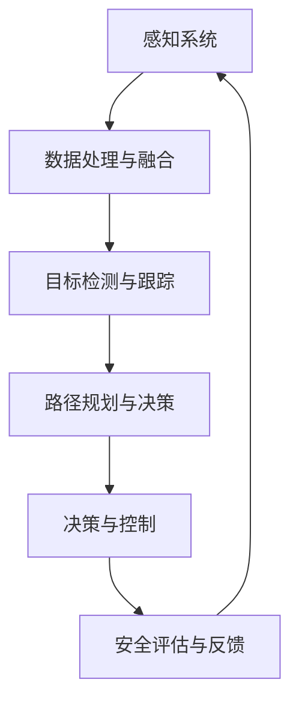

                 

# 端到端自动驾驶的车辆主动安全设计

> 关键词：端到端自动驾驶、车辆主动安全、传感器融合、深度学习、安全评估、决策与控制

> 摘要：本文深入探讨了端到端自动驾驶系统中车辆主动安全设计的核心概念、算法原理、数学模型以及实际应用场景。通过详细的案例分析，本文旨在为自动驾驶系统开发者提供有价值的参考和指导，以实现更高层次的安全性和可靠性。

## 1. 背景介绍

### 1.1 目的和范围

本文旨在分析并阐述端到端自动驾驶系统中车辆主动安全设计的关键要素和方法。端到端自动驾驶技术作为人工智能与汽车技术深度融合的产物，正逐步改变着我们的出行方式。车辆主动安全设计是确保自动驾驶系统在各种复杂场景下安全可靠运行的核心环节。本文将围绕以下几个方面展开：

1. **核心概念与联系**：介绍端到端自动驾驶系统的基本概念，阐述传感器融合、深度学习、安全评估等关键技术在车辆主动安全设计中的应用。
2. **核心算法原理 & 具体操作步骤**：详细阐述车辆主动安全设计的算法原理，包括传感器数据处理、目标检测与跟踪、路径规划与决策等。
3. **数学模型和公式 & 详细讲解 & 举例说明**：介绍车辆主动安全设计中的数学模型和公式，并通过实例进行详细解释。
4. **项目实战：代码实际案例和详细解释说明**：提供具体的代码实现和分析，帮助读者理解车辆主动安全设计的具体应用。
5. **实际应用场景**：探讨车辆主动安全设计在不同驾驶环境中的应用，包括城市道路、高速公路、复杂交通场景等。
6. **工具和资源推荐**：推荐学习资源和开发工具，为自动驾驶系统开发者提供支持。
7. **总结与未来发展趋势**：总结车辆主动安全设计的主要成果和挑战，展望未来发展趋势。

### 1.2 预期读者

本文适用于以下读者群体：

1. **自动驾驶系统开发者**：对自动驾驶技术有基本了解，希望深入理解车辆主动安全设计原理和实践的开发者。
2. **人工智能研究人员**：对深度学习和传感器融合等技术有兴趣，希望将其应用于自动驾驶安全设计的科研人员。
3. **汽车工程师**：关注自动驾驶技术在汽车行业中的应用，希望提升自身技能和知识水平的汽车工程师。
4. **安全评估专家**：对自动驾驶系统安全评估有研究，希望了解车辆主动安全设计的专家。

### 1.3 文档结构概述

本文结构如下：

1. **背景介绍**：介绍研究背景、目的和范围，预期读者群体以及文档结构。
2. **核心概念与联系**：讨论端到端自动驾驶系统的核心概念和关键技术。
3. **核心算法原理 & 具体操作步骤**：详细阐述车辆主动安全设计的算法原理和操作步骤。
4. **数学模型和公式 & 详细讲解 & 举例说明**：介绍车辆主动安全设计中的数学模型和公式。
5. **项目实战：代码实际案例和详细解释说明**：提供具体的代码实现和分析。
6. **实际应用场景**：探讨车辆主动安全设计的实际应用。
7. **工具和资源推荐**：推荐学习资源和开发工具。
8. **总结与未来发展趋势**：总结研究成果和展望未来发展趋势。
9. **附录**：常见问题与解答。
10. **扩展阅读 & 参考资料**：提供相关文献和资源。

### 1.4 术语表

#### 1.4.1 核心术语定义

- **端到端自动驾驶**：一种自动驾驶技术，直接从原始传感器数据生成驾驶决策，无需传统的人工特征工程。
- **车辆主动安全设计**：通过算法和技术手段，确保自动驾驶车辆在复杂环境中安全运行的设计过程。
- **传感器融合**：将多种传感器数据（如激光雷达、摄像头、超声波传感器等）集成到一个统一的感知系统中。
- **深度学习**：一种基于神经网络的学习方法，通过多层抽象特征，实现图像识别、目标检测等功能。
- **安全评估**：对自动驾驶系统的安全性进行评估和验证，确保其在实际应用中不会出现安全隐患。
- **路径规划与决策**：根据环境感知数据，规划自动驾驶车辆的行驶路径和驾驶策略。

#### 1.4.2 相关概念解释

- **感知系统**：自动驾驶车辆的感知模块，包括激光雷达、摄像头、雷达、超声波传感器等。
- **自动驾驶框架**：包括感知、规划、决策和控制等模块的自动驾驶系统整体架构。
- **目标检测与跟踪**：通过算法从传感器数据中识别并跟踪车辆、行人、交通标志等目标。
- **路径规划**：根据环境感知数据，生成自动驾驶车辆的行驶路径。
- **决策与控制**：根据路径规划和环境感知数据，控制自动驾驶车辆的转向、加速和制动。

#### 1.4.3 缩略词列表

- **SLAM**：同时定位与地图构建（Simultaneous Localization and Mapping）
- **CNN**：卷积神经网络（Convolutional Neural Network）
- **RNN**：递归神经网络（Recurrent Neural Network）
- **Lidar**：激光雷达（Light Detection and Ranging）
- **GPU**：图形处理器（Graphics Processing Unit）
- **ROS**：机器人操作系统（Robot Operating System）

## 2. 核心概念与联系

在探讨端到端自动驾驶的车辆主动安全设计之前，有必要明确一些核心概念及其相互关系。端到端自动驾驶系统主要包括感知、规划、决策和控制等模块，这些模块紧密相连，共同构成了一个完整的自动驾驶框架。

### 2.1 端到端自动驾驶系统架构

端到端自动驾驶系统的架构可以分为以下几个核心模块：

1. **感知系统**：包括激光雷达、摄像头、雷达、超声波传感器等，负责采集车辆周围环境的数据。
2. **数据处理与融合**：将不同类型的传感器数据融合到一个统一的感知系统中，以提高环境感知的准确性和可靠性。
3. **目标检测与跟踪**：通过深度学习算法，从传感器数据中识别并跟踪车辆、行人、交通标志等目标。
4. **路径规划与决策**：根据环境感知数据，规划自动驾驶车辆的行驶路径和驾驶策略。
5. **决策与控制**：根据路径规划和环境感知数据，控制自动驾驶车辆的转向、加速和制动。

### 2.2 传感器融合

传感器融合是端到端自动驾驶系统中的关键环节。通过将多种传感器数据进行集成和融合，可以提高感知系统的准确性和鲁棒性。以下是一种常见的传感器融合流程：

1. **数据采集**：使用激光雷达、摄像头、雷达、超声波传感器等采集车辆周围环境的数据。
2. **预处理**：对传感器数据进行预处理，包括数据去噪、数据增强等操作。
3. **特征提取**：从预处理后的传感器数据中提取关键特征，如点云数据、图像特征等。
4. **数据融合**：将不同类型的传感器数据进行融合，生成一个统一的感知数据集。
5. **融合算法**：采用多传感器数据融合算法，如卡尔曼滤波、粒子滤波、贝叶斯估计等，对感知数据集进行融合。

### 2.3 深度学习在自动驾驶中的应用

深度学习技术在自动驾驶系统中发挥着重要作用，尤其在目标检测与跟踪、路径规划与决策等领域。以下是一种基于深度学习的自动驾驶系统框架：

1. **图像处理**：使用卷积神经网络（CNN）对摄像头捕获的图像进行处理，提取图像特征。
2. **点云处理**：使用点云数据处理算法，如体素化、VoxelNet等，对激光雷达捕获的点云数据进行处理。
3. **特征融合**：将图像特征和点云特征进行融合，生成一个统一的特征向量。
4. **目标检测与跟踪**：使用深度学习算法，如YOLO、Faster R-CNN等，对特征向量进行目标检测与跟踪。
5. **路径规划与决策**：根据目标检测结果，使用深度强化学习（DRL）或规划算法（如A*算法、RRT算法等）进行路径规划和决策。

### 2.4 安全评估与决策控制

安全评估是确保自动驾驶系统在实际应用中安全可靠运行的关键环节。以下是一种安全评估与决策控制的流程：

1. **环境感知**：通过传感器系统获取车辆周围环境的数据。
2. **目标识别**：使用深度学习算法识别并跟踪车辆、行人、交通标志等目标。
3. **风险评估**：根据目标识别结果，评估当前驾驶环境的安全风险。
4. **决策控制**：根据风险评估结果，生成驾驶策略，控制车辆的转向、加速和制动。
5. **实时反馈**：将驾驶策略反馈到传感器系统，进行实时调整和优化。

### 2.5 Mermaid 流程图

以下是一个简化的端到端自动驾驶系统架构的Mermaid流程图：



### 2.6 关键技术联系

端到端自动驾驶系统的各个模块之间紧密相连，形成一个完整的闭环系统。传感器融合技术确保了环境感知的准确性，深度学习技术提高了目标检测与跟踪的精度，路径规划与决策算法实现了自动驾驶车辆的行驶控制，而安全评估与反馈机制则保证了系统的安全性和可靠性。

通过以上分析，我们可以看出端到端自动驾驶的车辆主动安全设计需要综合考虑传感器融合、深度学习、路径规划与决策、安全评估与反馈等多方面的技术，以实现自动驾驶车辆在复杂环境中的安全可靠运行。

## 3. 核心算法原理 & 具体操作步骤

在端到端自动驾驶系统中，车辆主动安全设计依赖于一系列核心算法，这些算法共同作用，确保车辆在各种复杂场景下能够安全、可靠地运行。以下是车辆主动安全设计中的核心算法原理及具体操作步骤：

### 3.1 传感器数据处理

传感器数据处理是车辆主动安全设计的基础，其目标是提取有效的环境信息，以便后续处理。以下是一个基于深度学习的传感器数据处理算法步骤：

1. **数据采集**：使用激光雷达、摄像头、雷达、超声波传感器等采集车辆周围环境的数据。
2. **预处理**：对传感器数据进行预处理，包括降噪、去噪、数据增强等操作。预处理步骤的目的是提高数据质量和减少噪声干扰。
3. **特征提取**：从预处理后的传感器数据中提取关键特征。例如，对于激光雷达数据，可以提取点云特征；对于摄像头数据，可以提取图像特征。特征提取的目的是将原始数据转换为更适合深度学习处理的格式。
4. **特征融合**：将不同类型的传感器数据进行融合，生成一个统一的特征向量。特征融合可以通过加权平均、拼接等方式实现。融合后的特征向量将用于后续的目标检测与跟踪。

伪代码如下：

```python
def preprocess_data(data):
    # 噪声去除、数据增强等预处理操作
    return preprocessed_data

def extract_features(data):
    # 特征提取操作
    return features

def fuse_features(feature_lists):
    # 特征融合操作
    return fused_features
```

### 3.2 目标检测与跟踪

目标检测与跟踪是车辆主动安全设计的关键环节，其目标是识别并跟踪车辆、行人、交通标志等目标。以下是一个基于深度学习的目标检测与跟踪算法步骤：

1. **特征提取**：使用深度学习算法（如CNN、YOLO、Faster R-CNN等）对特征向量进行目标检测。目标检测的目的是从传感器数据中识别出感兴趣的目标。
2. **目标跟踪**：使用跟踪算法（如卡尔曼滤波、粒子滤波等）对检测到的目标进行跟踪。目标跟踪的目的是确保目标在连续帧中的一致性。

伪代码如下：

```python
def detect_objects(features):
    # 目标检测操作
    return objects

def track_objects(objects):
    # 目标跟踪操作
    return tracked_objects
```

### 3.3 路径规划与决策

路径规划与决策是车辆主动安全设计的重要环节，其目标是根据环境感知数据生成车辆的行驶路径和驾驶策略。以下是一个基于深度强化学习的路径规划与决策算法步骤：

1. **状态评估**：根据环境感知数据，评估当前驾驶状态，包括车辆位置、速度、周围车辆和行人等信息。
2. **策略选择**：使用深度强化学习（DRL）算法，根据当前驾驶状态选择最优驾驶策略，如转向角度、加速和制动等。
3. **路径规划**：根据所选驾驶策略，规划车辆的行驶路径，确保车辆在行驶过程中避开障碍物，保持安全距离等。

伪代码如下：

```python
def assess_state(state):
    # 状态评估操作
    return action_value

def select_action(state):
    # 策略选择操作
    return action

def plan_path(action):
    # 路径规划操作
    return path
```

### 3.4 决策与控制

决策与控制是车辆主动安全设计的最终环节，其目标是根据路径规划和环境感知数据，控制车辆的转向、加速和制动。以下是一个基于模型预测控制的决策与控制算法步骤：

1. **模型预测**：根据车辆模型和当前驾驶状态，预测未来一段时间内的车辆状态。
2. **决策生成**：根据预测结果，生成最优驾驶决策，如转向角度、加速和制动等。
3. **控制执行**：将决策信号传递给车辆控制模块，执行相应的驾驶操作。

伪代码如下：

```python
def predict_future_state(state):
    # 模型预测操作
    return future_state

def generate_decision(future_state):
    # 决策生成操作
    return decision

def execute_control(decision):
    # 控制执行操作
    return executed_control
```

### 3.5 安全评估与反馈

安全评估与反馈是确保车辆主动安全设计有效性的关键环节。以下是一个基于闭环控制的安全评估与反馈算法步骤：

1. **环境感知**：使用传感器系统获取车辆周围环境的数据。
2. **目标识别**：使用深度学习算法识别并跟踪车辆、行人、交通标志等目标。
3. **风险评估**：根据目标识别结果，评估当前驾驶环境的安全风险。
4. **实时反馈**：将风险评估结果反馈到传感器系统，进行实时调整和优化。

伪代码如下：

```python
def perceive_environment():
    # 环境感知操作
    return environment_data

def identify_objects(data):
    # 目标识别操作
    return objects

def assess_risk(objects):
    # 风险评估操作
    return risk_level

def provide_feedback(risk_level):
    # 实时反馈操作
    return updated_control
```

通过以上核心算法原理和具体操作步骤，我们可以构建一个高效的车辆主动安全设计系统，确保自动驾驶车辆在各种复杂场景下安全、可靠地运行。

### 4. 数学模型和公式 & 详细讲解 & 举例说明

在车辆主动安全设计中，数学模型和公式扮演着至关重要的角色。这些模型和公式用于描述传感器数据融合、目标检测与跟踪、路径规划与决策等过程。在本节中，我们将详细讲解这些数学模型和公式，并通过具体示例进行说明。

#### 4.1 传感器数据融合

传感器数据融合的目的是将来自不同类型的传感器数据进行集成，以提高环境感知的准确性和可靠性。常用的融合方法包括卡尔曼滤波、粒子滤波和贝叶斯估计等。

**卡尔曼滤波**：

卡尔曼滤波是一种线性统计滤波方法，用于估计线性系统的状态。其基本公式如下：

$$
\hat{x}_{k|k} = \hat{x}_{k|k-1} + K_k (z_k - \hat{z}_k)
$$

$$
K_k = P_{k|k-1} H_k^T (H_k P_{k|k-1} H_k^T + R_k)^{-1}
$$

其中，$\hat{x}_{k|k}$是状态估计值，$K_k$是卡尔曼增益，$P_{k|k-1}$是状态估计误差协方差，$H_k$是观测矩阵，$z_k$是观测值，$\hat{z}_k$是预测观测值，$R_k$是观测噪声协方差。

**粒子滤波**：

粒子滤波是一种非线性、非高斯滤波方法，通过粒子表示状态分布，进行状态估计。其基本公式如下：

$$
w_k(i) = \frac{p(z_k|x_k=i) \pi(x_k=i)}{\sum_{j=1}^N w_k(j)}
$$

$$
x_{k+1}(i) \sim \phi(x_k=i|u_k, x_{k+1}=i)
$$

其中，$w_k(i)$是粒子权重，$p(z_k|x_k=i)$是观测概率，$\pi(x_k=i)$是初始状态概率，$\phi(x_k=i|u_k, x_{k+1}=i)$是状态转移概率。

**贝叶斯估计**：

贝叶斯估计是一种基于贝叶斯定理的状态估计方法，通过最大化后验概率进行状态估计。其基本公式如下：

$$
\hat{x}_{k|k} = \arg \max_x p(x|z_1:k)
$$

$$
p(x|z_1:k) = \frac{p(z_1:k|x) p(x)}{\int p(z_1:k|x) p(x) dx}
$$

其中，$p(x|z_1:k)$是后验概率，$p(z_1:k|x)$是观测概率，$p(x)$是先验概率。

#### 4.2 目标检测与跟踪

目标检测与跟踪是车辆主动安全设计的关键环节，其目标是识别并跟踪车辆、行人、交通标志等目标。以下是一些常用的数学模型和公式。

**单目标检测**：

单目标检测通常使用高斯背景模型（Gaussian Mixture Model, GMM）进行背景建模，然后使用均值漂移（Mean Shift）算法进行目标检测。其基本公式如下：

$$
p(b|\lambda) = \frac{1}{(2\pi \sigma^2)^{D/2}} \exp \left( -\frac{1}{2\sigma^2} \sum_{d=1}^D (\lambda_d - \mu_d)^2 \right)
$$

其中，$p(b|\lambda)$是背景概率，$\lambda$是背景参数，$\mu_d$是背景在$d$维度的均值，$\sigma^2$是背景在$d$维度的方差。

**多目标检测**：

多目标检测通常使用深度学习算法（如Faster R-CNN、SSD、YOLO等）进行。这些算法通过训练得到一个统一的检测模型，可以同时检测多个目标。其基本公式如下：

$$
p(o|c) = \frac{p(c|o) p(o)}{p(c)}
$$

其中，$p(o|c)$是目标条件概率，$p(c|o)$是观测条件概率，$p(o)$是目标概率，$p(c)$是观测概率。

**目标跟踪**：

目标跟踪通常使用卡尔曼滤波或粒子滤波算法进行。卡尔曼滤波的跟踪公式如下：

$$
\hat{x}_{k|k} = \hat{x}_{k|k-1} + K_k (z_k - \hat{z}_k)
$$

$$
K_k = P_{k|k-1} H_k^T (H_k P_{k|k-1} H_k^T + R_k)^{-1}
$$

其中，$\hat{x}_{k|k}$是状态估计值，$K_k$是卡尔曼增益，$P_{k|k-1}$是状态估计误差协方差，$H_k$是观测矩阵，$z_k$是观测值，$\hat{z}_k$是预测观测值，$R_k$是观测噪声协方差。

粒子滤波的跟踪公式如下：

$$
w_k(i) = \frac{p(z_k|x_k=i) \pi(x_k=i)}{\sum_{j=1}^N w_k(j)}
$$

$$
x_{k+1}(i) \sim \phi(x_k=i|u_k, x_{k+1}=i)
$$

其中，$w_k(i)$是粒子权重，$p(z_k|

